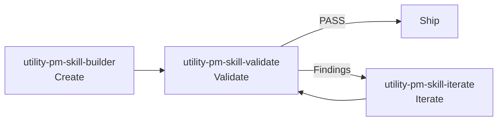

# PM-Skills Quick Start

## What's Included

- **67 shipped PM skills in `skills/`** (30 phase skills across 6 phases, 10 foundation skills, 12 utility skills, 15 tool skills)
- **11 slash-command docs in `commands/`** (the 10 `/workflow-*` orchestrator commands plus `/chain`)
- **12 Workflows** for multi-skill processes (Triple Diamond, Lean Startup, Feature Kickoff, and 9 more)

## Installation

### Claude Code (recommended: plugin marketplace)

```
/plugin marketplace add product-on-purpose/agent-plugins
/plugin install pm-skills@product-on-purpose
```

Prefer a file-based install? Clone or copy to your project:

```bash
git clone https://github.com/product-on-purpose/pm-skills.git
```

Or download and extract the latest ZIP from [Releases](https://github.com/product-on-purpose/pm-skills/releases) to your project root.

### Claude.ai / Claude Desktop

1. Go to **Settings > Capabilities** (Desktop) or **Project Settings > Add Files** (Claude.ai)
2. Upload the latest release ZIP (`pm-skills-vX.X.X.zip`) from [Releases](https://github.com/product-on-purpose/pm-skills/releases)
3. Skills are now available in your conversations

### Other AI Agents

Add via the open skills CLI:

```bash
npx skills add product-on-purpose/pm-skills
```

Or point your agent to `AGENTS.md` for skill discovery. Each skill is self-contained in `skills/{skill-name}/SKILL.md` (e.g., `skills/deliver-prd/SKILL.md`).

More detail: see the [Getting Started guide](https://product-on-purpose.github.io/pm-skills/getting-started/) for the long-form walkthrough.

## Usage

### Slash Commands

```
/pm-skills:deliver-prd "Feature description"
/pm-skills:define-hypothesis "Assumption to test"
/pm-skills:deliver-acceptance-criteria "Story or feature slice"
/pm-skills:deliver-user-stories "PRD or feature context"
/pm-skills:discover-competitive-analysis "Market or product area"
```

See `AGENTS.md` for the complete command list.

### Workflows

Run multi-skill workflows:

```
/workflow-feature-kickoff "Feature name"  # Problem → Hypothesis → PRD → Stories
```

Workflow definitions are in `_workflows/`.

## Skill Lifecycle Tools

Three utility skills manage the skill library itself:



See the [PM Skill Lifecycle guide](https://product-on-purpose.github.io/pm-skills/guides/pm-skill-lifecycle/) for detailed workflow patterns.

## File Structure

```
skills/            # All 67 skill definitions (30 phase + 10 foundation + 12 utility + 15 tool, flat)
commands/          # 11 command markdown files (10 workflow + /chain)
_workflows/        # Multi-skill workflows
scripts/           # sync, validation, and release helpers
.claude/pm-skills-for-claude.md  # instructions for Claude Code users
AGENTS.md          # Agent discovery index
```

For Claude Code discovery, run `./scripts/sync-claude.sh` (or `.ps1`) to populate `.claude/skills` and `.claude/commands` from the flat source.

## Learn More

- Full documentation: https://product-on-purpose.github.io/pm-skills/
- GitHub repository: https://github.com/product-on-purpose/pm-skills
- Skill specification: https://agentskills.io/specification

---

*Built by [Product on Purpose](https://github.com/product-on-purpose) for PMs who ship.*
