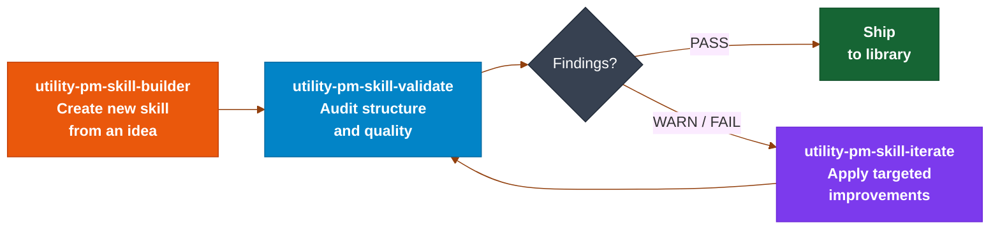
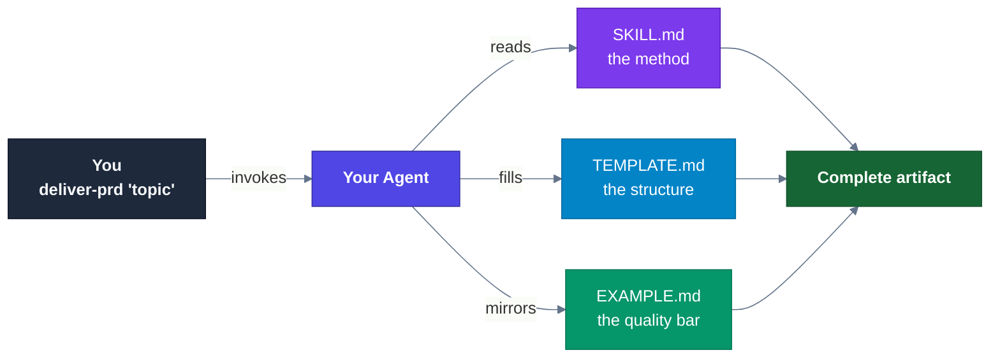
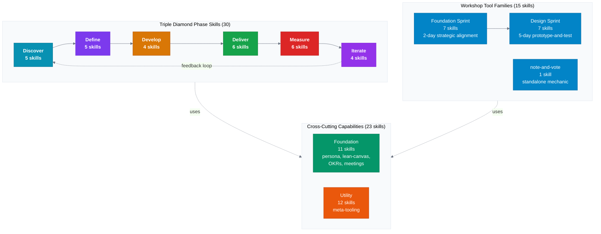
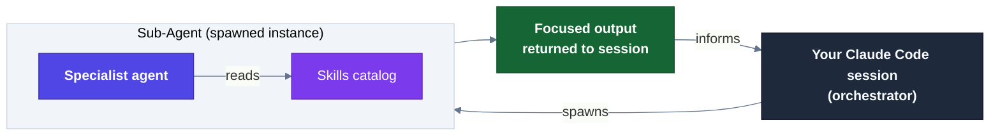

<a id="readme-top"></a>

<h1 align="center">
  <a href="https://github.com/product-on-purpose/pm-skills">PM-Skills</a>
</h1>

<h4 align="center">A curated library of 68 best-practice, plug-and-play product management skills covering the complete product lifecycle - plus templates, workflows, and 200+ real-world sample outputs that set the quality bar.</h4>

<p align="center">
  <a href="https://github.com/product-on-purpose/pm-skills/issues/new?labels=bug">Report a Bug</a>
  ·
  <a href="https://github.com/product-on-purpose/pm-skills/issues/new?labels=enhancement">Request a Feature</a>
  ·
  <a href="https://github.com/product-on-purpose/pm-skills/discussions">Ask a Question</a>
</p>

<p align="center">
  
  <a href="https://github.com/product-on-purpose/pm-skills/blob/main/LICENSE">
    
  </a>
  <a href="https://github.com/product-on-purpose/pm-skills/releases">
     <!-- x-release-please-version -->
  </a>
  <a href="#the-skill-library">
    
  </a>
  <a href="https://agentskills.io/specification">
    
  </a>
  <a href="https://skills.sh/product-on-purpose/pm-skills">
    
  </a>
  <a href="CONTRIBUTING.md">
    
  </a>
</p>

<p align="center">
  <a href="https://github.com/product-on-purpose/pm-skills/stargazers">
    
  </a>
  <a href="https://github.com/product-on-purpose/pm-skills/network/members">
    
  </a>
  <a href="https://github.com/product-on-purpose/pm-skills/issues">
    
  </a>
  <a href="https://github.com/product-on-purpose/pm-skills/graphs/contributors">
    
  </a>
  <a href="https://github.com/product-on-purpose/pm-skills/commits/main">
    
  </a>
</p>

<p align="center">
  <a href="https://github.com/product-on-purpose/pm-skills-mcp">
    
  </a>
</p>

<p align="center">
  <a href="#the-big-idea">About</a> •
  <a href="#installation-and-setup">Install</a> •
  <a href="#the-skill-library">Skills</a> •
  <a href="#sub-agents">Sub-Agents</a> •
  <a href="#workflows">Workflows</a> •
  <a href="#learning-and-resources">Learning</a> •
  <a href="#project-status">Status</a> •
  <a href="#contributing">Contributing</a> •
  <a href="#community">Community</a>
</p>

---

<details>
<summary><strong>Table of Contents</strong></summary>

- [Quick Start](#quick-start)
- [Recent Updates](#recent-updates)
- [The Big Idea](#the-big-idea)
    - [Who Is This For](#who-is-this-for)
    - [Key Features](#key-features)
    - [Skill Lifecycle Tools](#skill-lifecycle-tools--custom-skill-builder)
    - [Founded On](#founded-on)
- [Installation and Setup](#installation-and-setup)
- [How Agent Skills Work](#how-agent-skills-work)
- [The Skill Library](#the-skill-library)
    - [Foundation Skills](#foundation-skills---cross-cutting-capability-11)
    - [Discover Phase Skills](#discover---find-and-assess-the-right-problem-5)
    - [Define Phase Skills](#define---frame-the-problem-5)
    - [Develop Phase Skills](#develop---explore-solutions-4)
    - [Deliver Phase Skills](#deliver---ship-it-6)
    - [Measure Phase Skills](#measure---validate-with-data-6)
    - [Iterate Phase Skills](#iterate---learn-and-improve-4)
    - [Tool Family: Foundation Sprint](#tool-family-foundation-sprint-7)
    - [Tool Family: Design Sprint](#tool-family-design-sprint-7)
    - [Standalone Tool Skill](#standalone-tool-skill)
    - [Utility Skills](#utility-skills---meta-tooling-12)
    - [Sub-Agents](#sub-agents)
    - [Workflows](#workflows-skill-chaining)
- [Library Examples](#library-examples)
- [Learning and Resources](#learning-and-resources)
- [Project Status](#project-status)
- [Contributing](#contributing)
- [Community](#community)
- [FAQ](#faq)
- [About the Author](#about-the-author)

</details>

---

## Quick Start

After installing, you'll have all 68 skills available (invoke any by name, like `/pm-skills:deliver-prd`, `/pm-skills:define-hypothesis`, `/pm-skills:deliver-user-stories`) plus 10 `/workflow-*` orchestrator commands and the `/chain` ad-hoc runner, templates, sub-agents, and 200+ sample outputs.

**Claude Code (recommended):**

```bash
/plugin marketplace add product-on-purpose/agent-plugins
/plugin install pm-skills@product-on-purpose
```

> Already installed via the old `pm-skills-marketplace`? It keeps working - no action needed. To move to the new home, see the [v2.21.0 release notes](https://github.com/product-on-purpose/pm-skills/releases/tag/v2.21.0).

**Cross-agent (Cursor, Copilot, Cline, and others via the open [skills CLI](https://github.com/vercel-labs/skills)):**

```bash
npx skills add product-on-purpose/pm-skills
```

**Clone or download:**

```bash
git clone https://github.com/product-on-purpose/pm-skills.git
```

[](https://github.com/product-on-purpose/pm-skills/releases/latest)

**More resources:**

- [Getting Started Guide](https://product-on-purpose.github.io/pm-skills/getting-started/) - Detailed walkthrough for new users covering clone, sync helper, and first skill run. The path to take if any of the quick start steps above leave gaps.
- [Setup by Platform](https://product-on-purpose.github.io/pm-skills/getting-started/platforms/) - Step-by-step install for Claude.ai, Codex, Cursor, Windsurf, GitHub Copilot, VS Code extensions, and ChatGPT.
- [Quickstart Reference](https://product-on-purpose.github.io/pm-skills/getting-started/quickstart/) - Short-form reference card for users who just need the commands.

<p align="right">(<a href="#readme-top">back to top</a>)</p>

---

## Recent Updates

<details>
<summary><strong>MCP Server: Maintenance Mode (effective 2026-05-04)</strong></summary>

The companion [`pm-skills-mcp`](https://github.com/product-on-purpose/pm-skills-mcp) server is in the v2.9.x maintenance line (latest v2.9.3) and remains available on npm for clients that need MCP transport. The catalog is frozen at the v2.9.2 build; subsequent v2.9.x patches do not change the catalog. Active development on the MCP server is paused; security patches and critical bug fixes will continue.

> **Recommendation:** For new users, we recommend using the plugin. See [Installation and Setup](#installation-and-setup) for other options.


</details>

---

**What's New**

<!-- pmskills:latest-release:start (generated by scripts/gen-derived-surfaces.mjs; edit CHANGELOG.md, not this block) -->
<!-- count-exempt:start -->

| Version | Date | Highlights |
| ------- | ---- | ---------- |
| [v2.30.0](https://github.com/product-on-purpose/pm-skills/releases/tag/v2.30.0) | 2026-07-04 | Trust repair + hygiene. See [CHANGELOG](CHANGELOG.md#2300---2026-07-04). |
| [v2.29.1](https://github.com/product-on-purpose/pm-skills/releases/tag/v2.29.1) | 2026-06-24 | Maintenance patch: skill docs pages no longer drop sections. See [CHANGELOG](CHANGELOG.md#2291---2026-06-24). |
| [v2.29.0](https://github.com/product-on-purpose/pm-skills/releases/tag/v2.29.0) | 2026-06-23 | New foundation skill: the pre-build risk gate, plus a key-free router engine. See [CHANGELOG](CHANGELOG.md#2290---2026-06-23). |

Full history: [CHANGELOG.md](CHANGELOG.md) or [all GitHub Releases](https://github.com/product-on-purpose/pm-skills/releases).

<!-- count-exempt:end -->
<!-- pmskills:latest-release:end -->

<p align="right">(<a href="#readme-top">back to top</a>)</p>

---

## The Big Idea

**Stop prompt-fumbling. Start shipping.** Every time you ask an AI to help with product management, you start from zero. Generic responses. Inconsistent formats. Missing critical sections. Hours lost to repetitive prompt crafting.

PM-Skills gives your AI instant access to professional frameworks refined across hundreds of product launches, production-ready templates that capture institutional PM knowledge, and real-world examples that set the quality bar.

| Without PM-Skills                 | With PM-Skills                  |
| --------------------------------- | ------------------------------- |
| ⚠️ Generic AI responses          | ✅ Professional PM frameworks   |
| ⚠️ Inconsistent formats          | ✅ Production-ready templates   |
| ⚠️ Missing key sections          | ✅ Comprehensive coverage       |
| ⚠️ Starting from scratch         | ✅ Building on best practices   |
| ⚠️ Prompt engineering every time | ✅ One command, instant results |

### Who Is This For

| You are...                            | PM-Skills gives you...                                                                      |
| ------------------------------------- | ------------------------------------------------------------------------------------------- |
| A solo PM using AI for the first time | A starting point that skips prompt engineering and produces professional output immediately |
| A team lead standardizing PM output   | Shared skill library your whole team invokes the same way, producing consistent artifacts   |
| An AI/PM builder creating PM tools    | Open-source, Apache 2.0 library of production-quality PM artifacts to build on              |

### Key Features

- ✅ **68 Production-Ready Skills** covering the complete product lifecycle (30 phase skills + 11 foundation skills + 12 utility skills + 15 tool skills for structured workshop methodologies)
- ✅ **Triple Diamond Framework** organizing Discover, Define, Develop, Deliver, Measure, and Iterate phases
- ✅ **Tool Families** for the Foundation Sprint (2-day strategic alignment) and Design Sprint (5-day prototype-and-test) workshop methodologies
- ✅ **5 Active Orchestration Sub-Agents** (pm-critic, pm-skill-auditor, pm-changelog-curator, pm-release-conductor, pm-workflow-orchestrator) for Claude Code, with dispatch skills extending the pattern to Codex, Cursor, Windsurf, Copilot, and Gemini CLI
- ✅ **12 Workflows** for common PM processes including Feature Kickoff, Lean Startup, Triple Diamond, and foundation-to-design end-to-end arc
- ✅ **10 Workflow Commands** for Claude Code users - plus every skill invocable directly by name
- ✅ **Auto-Discovery** via AGENTS.md in GitHub Copilot, Cursor, and Windsurf
- ✅ **Agent Skills Spec** compliant - works across AI assistants
- ✅ **Apache 2.0 Licensed** for commercial and personal use

### Skill Lifecycle Tools = Custom Skill Builder

PM-Skills includes three utility skills that form a complete **Create - Validate - Iterate** lifecycle for building and managing skills:



**Why this matters:** Skills are living artifacts that evolve. The builder creates them, the validator catches drift and quality gaps, and the iterator applies fixes. Together they keep the library consistent as it grows.

| Tool & Command                      | What it does                                                                                         |
| ----------------------------------- | ---------------------------------------------------------------------------------------------------- |
| **Builder:** `/pm-skills:utility-pm-skill-builder`    | Creates a new skill from an idea. Runs gap analysis against existing skills, classifies by type and phase, generates draft files to a staging area, and promotes on confirmation. |
| **Validator:** `/pm-skills:utility-pm-skill-validate` | Audits an existing skill against structural conventions and quality criteria. Produces a report with severity-graded findings and actionable recommendations. |
| **Iterator:** `/pm-skills:utility-pm-skill-iterate`   | Applies targeted improvements to a skill based on feedback or a validation report. Previews changes, writes on confirmation, and suggests a version bump. |

🔗 **More resources:**

- [**PM Skill Lifecycle Guide**](https://product-on-purpose.github.io/pm-skills/guides/pm-skill-lifecycle/) - Full workflow for creating, validating, and iterating skills, including the builder-validator-iterator cycle with worked examples.
- [**Creating PM Skills**](https://product-on-purpose.github.io/pm-skills/guides/creating-pm-skills/) - Authoring guide for contributing new skills to the library.
- [**Skill Template**](docs/templates/skill-template/) - The canonical three-file template every skill must follow; copy this as your starting point.

### Founded On

- **[Triple Diamond Framework](https://medium.com/zendesk-creative-blog/the-zendesk-triple-diamond-process-fd857a11c179)** - Six-phase product cycle (extends Design Council's Double Diamond): Discover, Define, Develop, Deliver, Measure, Iterate
- **[Opportunity Solution Trees](https://www.producttalk.org/opportunity-solution-tree/) (Teresa Torres)** - Outcome-driven discovery
- **[Jobs to be Done Framework](https://strategyn.com/jobs-to-be-done/)** - Customer motivation framework
- **[Foundation Sprint](https://thefoundationsprint.com/) (Knapp/Zeratsky)** - 2-day structured workshop methodology for early-stage strategic alignment: basics, differentiation, approach options, magic lenses, founding hypothesis, brief
- **[Design Sprint](https://www.thesprintbook.com/) (Knapp/Zeratsky/Kowitz)** - 5-day structured workshop methodology for prototype-and-test cycles: map-and-target, sketch, decide-and-storyboard, prototype-plan, test-and-score
- **[Architecture Decision Records](https://adr.github.io/) (Michael Nygard format)** - Technical decision documentation

<p align="left">
  <a href="https://agentskills.io/specification">
    
  </a>
  <a href="https://github.github.com/gfm/">
    
  </a>
  <a href="https://github.com/features/actions">
    
  </a>
</p>

<p align="right">(<a href="#readme-top">back to top</a>)</p>

---

## Installation and Setup

### Tool Compatibility

| Platform                       | Native Skills? | Notes                                    |
| ------------------------------ | :------------: | ---------------------------------------- |
| **Claude Code**                | ✅ Yes         | Plugin marketplace + 10 workflow commands   |
| **GitHub Copilot**             | ✅ Yes         | AGENTS.md auto-discovery from clone      |
| **Cursor**                     | ✅ Yes         | AGENTS.md auto-discovery from clone      |
| **Windsurf**                   | ✅ Yes         | AGENTS.md auto-discovery from clone      |
| **Codex (OpenAI)**             | ✅ Yes         | AGENTS.md auto-discovery from clone      |
| **OpenCode**                   | ✅ Yes         | Direct skill loading from clone          |
| **VS Code (Cline, Continue)**  | ✅ Yes         | AGENTS.md auto-discovery from clone      |
| **Claude.ai / Claude Desktop** | ✔️ Manual     | ZIP upload to Project Files              |
| **ChatGPT / other LLMs**       | ✔️ Manual     | Paste SKILL.md content into conversation |

### Featured Install Paths

**Claude Code - Plugin Marketplace (recommended)**

```bash
/plugin marketplace add product-on-purpose/agent-plugins
/plugin install pm-skills@product-on-purpose
```

> Already installed via the old `pm-skills-marketplace`? It keeps working - no action needed. To move to the new home, see the [v2.21.0 release notes](https://github.com/product-on-purpose/pm-skills/releases/tag/v2.21.0).

All 68 skills and their slash commands become available immediately. No clone required.

**Cross-Agent via skills CLI (Cursor, Copilot, Cline, and others)**

```bash
npx skills add product-on-purpose/pm-skills
```

The open [skills CLI](https://github.com/vercel-labs/skills) from Vercel Labs scans the `skills/` directory and installs all 68 skills into your agent's default skills directory. Works with Claude Code, Cursor, GitHub Copilot, Cline, and any other agent that supports the skills ecosystem. Discoverable via [skills.sh/product-on-purpose/pm-skills](https://skills.sh/product-on-purpose/pm-skills).

Telemetry is anonymous and opt-out via `DISABLE_TELEMETRY=1` or `DO_NOT_TRACK=1`.

**Git Clone (manual path, everything included)**

```bash
git clone https://github.com/product-on-purpose/pm-skills.git
cd pm-skills
```

Gives you the full repo: skill files, slash commands, sample library, workflows, and documentation. Use this path when you want local access to sample outputs, plan to customize skills, or prefer not to depend on a CLI.

Optional: after cloning, run `./scripts/sync-claude.sh` (macOS/Linux) or `./scripts/sync-claude.ps1` (Windows) to populate `.claude/skills/` for agents that use that discovery path.

### Additional Install Methods

For Claude.ai, MCP clients, OpenCode, Windsurf, and ChatGPT, see the full [Platform Setup Guide](https://product-on-purpose.github.io/pm-skills/getting-started/platforms/) for step-by-step instructions.

| Platform                    | How                                 | Guide                                                                                          |
| --------------------------- | ----------------------------------- | ---------------------------------------------------------------------------------------------- |
| Claude.ai / Claude Desktop  | ZIP upload to Project Files         | [Platform guide](https://product-on-purpose.github.io/pm-skills/getting-started/platforms/#claudeai--claude-desktop) |
| MCP Server (any MCP client) | `npx pm-skills-mcp`                 | [pm-skills-mcp repo](https://github.com/product-on-purpose/pm-skills-mcp)                      |
| GitHub Copilot              | AGENTS.md auto-discovery from clone | [Platform guide](https://product-on-purpose.github.io/pm-skills/getting-started/platforms/#github-copilot)           |
| OpenCode                    | Direct skill loading from clone     | [Platform guide](https://product-on-purpose.github.io/pm-skills/getting-started/platforms/#opencode)                 |
| Cursor / Windsurf           | AGENTS.md auto-discovery            | [Platform guide](https://product-on-purpose.github.io/pm-skills/getting-started/platforms/#cursor)         |
| VS Code (Cline / Continue)  | AGENTS.md auto-discovery            | [Platform guide](https://product-on-purpose.github.io/pm-skills/getting-started/platforms/#vs-code-cline--continue)  |
| ChatGPT / other LLMs        | Copy SKILL.md into conversation     | [Platform guide](https://product-on-purpose.github.io/pm-skills/getting-started/platforms/#chatgpt--other-llms)      |

**More resources:**

- [**Getting Started Guide**](https://product-on-purpose.github.io/pm-skills/getting-started/) - Detailed walkthrough for new users covering all install methods, the sync helper script, and your first skill run end-to-end.
- [**Quickstart Reference**](https://product-on-purpose.github.io/pm-skills/getting-started/quickstart/) - Short-form reference card with just the essential commands.

<p align="right">(<a href="#readme-top">back to top</a>)</p>

---

## How Agent Skills Work

Each skill is a self-contained instruction set in three files:



```
skills/deliver-prd/
  SKILL.md                  # the method the agent reads
  references/
    TEMPLATE.md             # the structure the output follows
    EXAMPLE.md              # the worked example that anchors quality
```

When you run `/pm-skills:deliver-prd "topic"`, the agent loads the skill, mirrors the example, fills the template, and produces a complete PRD. No prompt engineering required.

| Property                    | What it gives you                                                              |
| --------------------------- | ------------------------------------------------------------------------------ |
| **Declarative**             | The skill says *what a good PRD is*, not *how to phrase a prompt*              |
| **Example-anchored**        | The worked example sets the quality bar; the agent mirrors depth and structure |
| **Structurally contracted** | The template enforces sections-present and sections-complete                   |

🔗 **More resources:**

- **[PM Skill Anatomy](https://product-on-purpose.github.io/pm-skills/reference/pm-skill-anatomy/)** - Deep dive into the three-file structure (SKILL.md, TEMPLATE.md, EXAMPLE.md) and what each file contributes to output quality. Essential reading before authoring your first skill.
- **[Skill Finder](https://product-on-purpose.github.io/pm-skills/guides/skill-finder/)** - Decision guide for choosing the right skill when you know the outcome you need but aren't sure which skill produces it.
- [**PM Skill Comparisons**](https://product-on-purpose.github.io/pm-skills/guides/pm-skill-comparisons/) - Side-by-side comparison of overlapping skills. Prevents the common mistake of reaching for `problem-statement` when `opportunity-tree` is the right fit.
- [**Sub-Agents**](#sub-agents) - Claude Code also supports spawnable specialist agents for tasks that benefit from a dedicated agent context: adversarial review, catalog auditing, changelog curation, and release orchestration.

<p align="right">(<a href="#readme-top">back to top</a>)</p>

---

<a id="the-skill-library"></a>

## The Skill Library

<!-- pmskills:catalog-badges:start (generated by scripts/gen-derived-surfaces.mjs; edit skill frontmatter, not this block) -->
<p>
  
  
  
  
</p>
<!-- pmskills:catalog-badges:end -->

### At a Glance

<!-- count-exempt:start -->



<!-- count-exempt:end -->

<!-- pmskills:catalog-table:start (generated by scripts/gen-derived-surfaces.mjs; edit skill frontmatter, not this block) -->
| Classification                       | Count | What's in it                                                                                         |
| ------------------------------------ | ----: | ---------------------------------------------------------------------------------------------------- |
| **Phase** (Triple Diamond)           | 30    | One skill per major PM activity across Discover, Define, Develop, Deliver, Measure, and Iterate      |
| **Foundation** (cross-cutting)       | 11    | Persona, lean canvas, OKRs, prioritized action plan, stakeholder briefings, and the full meeting skills family |
| **Utility** (meta-tooling)           | 12    | pm-skill-builder, pm-skill-validate, pm-skill-iterate, pm-workflow-builder, pm-workflow-orchestrator, mermaid-diagrams, slideshow-creator, update-pm-skills, and helpers |
| **Tool Families** (workshop methods) | 15    | Foundation Sprint family (7) + Design Sprint family (7) + note-and-vote (1)                          |
<!-- pmskills:catalog-table:end -->

---

### Foundation Skills - Cross-cutting capability (11)

| Skill                  | What it does                                                                      |
| ---------------------- | --------------------------------------------------------------------------------- |
| **persona**            | Generate product or marketing personas with evidence and confidence ratings       |
| **lean-canvas**        | Capture problem, customer segment, value proposition, and key metrics on one page |
| **okr-writer**         | Draft an objectives-and-key-results plan with tight, measurable key results       |
| **stakeholder-update** | Compose a stakeholder-facing update from project state and recent activity        |
| **meeting-agenda**     | Draft a focused agenda from purpose, attendees, and time-box                      |
| **meeting-brief**      | One-page brief priming attendees with context and pre-reads                       |
| **meeting-recap**      | Synthesize a meeting transcript into decisions, actions, and follow-ups           |
| **meeting-synthesize** | Cross-meeting synthesis distilling themes from multiple sessions                  |
| **prioritized-action-plan** | Turn any PM input into an evidence-grounded prioritized action plan via Theory of Constraints and Cynefin |
| **stakeholder-briefings** | Fan any source artifact into a master document plus audience-tailored briefings, one per stakeholder lens, each a traceable projection of the master |

---

### Phase Skills: Triple Diamond

#### Discover - Find and assess the right problem (5)

| Skill                    | What it does                                                                       |
| ------------------------ | ---------------------------------------------------------------------------------- |
| **interview-synthesis**  | Turn raw user research into actionable insights, patterns, and design implications |
| **competitive-analysis** | Map the competitive landscape and identify gaps and differentiation opportunities  |
| **stakeholder-summary**  | Understand who the key stakeholders are, what they need, and how to engage them    |
| **journey-map**          | Map the customer journey: stages, touchpoints, emotional curve, pain points, and moments of truth |
| **market-sizing**        | Estimate market opportunity (TAM/SAM/SOM) with multiple frameworks and source-graded confidence |

#### Define - Frame the problem (5)

| Skill                 | What it does                                                           |
| --------------------- | ---------------------------------------------------------------------- |
| **problem-statement** | Crystal-clear problem framing with scope, impact, and success criteria |
| **hypothesis**        | Testable assumptions with measurable success conditions                |
| **opportunity-tree**  | Teresa Torres-style outcome-driven opportunity mapping                 |
| **jtbd-canvas**       | Jobs to be Done framework for understanding customer motivation        |
| **prioritization-framework** | Run RICE, ICE, MoSCoW, Weighted Scoring, and Kano in parallel with a cross-framework comparison |

#### Develop - Explore solutions (4)

| Skill                | What it does                                                     |
| -------------------- | ---------------------------------------------------------------- |
| **solution-brief**   | One-page solution pitch with tradeoffs and open questions        |
| **spike-summary**    | Document technical exploration outcomes and decisions            |
| **adr**              | Architecture Decision Records in Michael Nygard format           |
| **design-rationale** | Why you made that design choice, documented for future reference |

#### Deliver - Ship it (6)

| Skill                   | What it does                                                                                        |
| ----------------------- | --------------------------------------------------------------------------------------------------- |
| **prd**                 | Comprehensive product requirements document with problem, metrics, stories, scope, and dependencies |
| **user-stories**        | INVEST-compliant stories with acceptance criteria                                                   |
| **acceptance-criteria** | Given/When/Then testable scenarios                                                                  |
| **edge-cases**          | Error states, boundaries, and recovery paths                                                        |
| **launch-checklist**    | End-to-end launch checklist so nothing gets missed                                                  |
| **release-notes**       | User-facing release communication                                                                   |

#### Measure - Validate with data (6)

| Skill                      | What it does                                                                         |
| -------------------------- | ------------------------------------------------------------------------------------ |
| **experiment-design**      | Rigorous A/B test planning with hypothesis, sample size, and success criteria        |
| **instrumentation-spec**   | Event tracking requirements for engineers                                            |
| **dashboard-requirements** | Analytics dashboard specifications                                                   |
| **experiment-results**     | Document and synthesize learnings from completed experiments                         |
| **okr-grader**             | Score completed OKR sets at cycle close with KR-level scoring and learning synthesis |
| **survey-analysis**        | Analyze survey results into persona segments, validated hypotheses, and honest limitation warnings |

#### Iterate - Learn and improve (4)

| Skill                | What it does                                                          |
| -------------------- | --------------------------------------------------------------------- |
| **retrospective**    | Team retros that produce real action items, not just feelings         |
| **lessons-log**      | Build organizational memory from repeated patterns and surprises      |
| **refinement-notes** | Capture backlog refinement outcomes and decision rationale            |
| **pivot-decision**   | Evidence-based pivot/persevere framework with clear decision criteria |

🔗 **More resources:**

- [Using Skills Guide](https://product-on-purpose.github.io/pm-skills/guides/using-skills/) - Practical guide to invoking skills across different agents, passing context effectively, and getting consistent outputs session to session.
- [Using Workflows Guide](https://product-on-purpose.github.io/pm-skills/guides/using-workflows/) - How to run multi-skill chains, handle handoffs between skills, and adapt workflows to your team's process.
- [Recipes](https://product-on-purpose.github.io/pm-skills/guides/recipes/) - Curated patterns for common PM scenarios: solo feature launch, quarterly OKR cycle, research-to-delivery arc.
- [Prompt Gallery](https://product-on-purpose.github.io/pm-skills/guides/prompt-gallery/) - Real prompts that produce excellent skill outputs, annotated with what makes each one effective.

<p align="right">(<a href="#readme-top">back to top</a>)</p>

---

### Tool Family: Foundation Sprint (7)

**A Foundation Sprint is a short, structured workshop that clarifies the problem space, target users, success metrics, constraints, and business context before creative exploration begins.** It ensures teams start with shared understanding and crisp definitions so downstream design and product decisions move faster and with fewer reversals.

**Run the full methodology with the [foundation-sprint workflow](_workflows/foundation-sprint.md).**

```mermaid
%%{init: {'theme': 'base', 'themeVariables': {'primaryColor': '#eff6ff', 'primaryBorderColor': '#bfdbfe', 'lineColor': '#3b82f6'}}}%%
flowchart LR
    classDef sprint fill:#0284c7,stroke:#0369a1,color:#fff,font-weight:bold
    classDef gate fill:#1d4ed8,stroke:#1e40af,color:#fff,font-weight:bold

    R["1. Readiness<br/>Go / No-Go check"]:::gate
    B["2. Basics<br/>Customer + Problem + Competition"]:::sprint
    Di["3. Differentiation<br/>2x2 advantage map"]:::sprint
    A["4. Approach Options<br/>3-5 high-level paths"]:::sprint
    M["5. Magic Lenses<br/>Score approaches"]:::sprint
    H["6. Founding Hypothesis<br/>Synthesize direction"]:::sprint
    Br["7. Brief<br/>One-page output"]:::gate

    R --> B --> Di --> A --> M --> H --> Br
```



| Skill                                     | What it does                                                                    |
| ----------------------------------------- | ------------------------------------------------------------------------------- |
| **foundation-sprint-readiness**           | Decision tree for evaluating whether a Foundation Sprint is the right next step |
| **foundation-sprint-basics**              | Establish the customer, problem, and competitive context (the founding 3-tuple) |
| **foundation-sprint-differentiation**     | Map your team's unique advantages on a 2x2 framework                            |
| **foundation-sprint-approach-options**    | Generate 3-5 high-level strategic approaches                                    |
| **foundation-sprint-magic-lenses**        | Score approaches across 3-4 critical evaluation lenses                          |
| **foundation-sprint-founding-hypothesis** | Synthesize the chosen approach into a testable founding hypothesis              |
| **foundation-sprint-brief**               | Produce the one-page sprint brief that serves as input for a Design Sprint      |

🔗 **More resources:**

- [**Foundation Sprint Concept Primer**](https://product-on-purpose.github.io/pm-skills/concepts/foundation-sprint/) - A Foundation Sprint is a 2-day structured workshop methodology developed by Jake Knapp and John Zeratsky. This primer explains what it is, when to use it, the 7-step sequence, and how it compares to a Design Sprint.
- [**Using Foundation Sprint**](https://product-on-purpose.github.io/pm-skills/guides/using-foundation-sprint/) - Operational guide for running the 7-skill Foundation Sprint sequence with an agent, including facilitation notes and output expectations for each step.
- [**Foundation Sprint FAQ**](https://product-on-purpose.github.io/pm-skills/guides/foundation-sprint-faq/) - Answers to common questions about the methodology: how long it takes, who should be in the room, what to do with the brief output, and when not to run it.
- [**Foundation Sprint Cheat Sheet**](https://product-on-purpose.github.io/pm-skills/guides/foundation-sprint-cheat-sheet/) - One-page quick reference for the day-arc, skill sequence, and key outputs.
- [**Foundation Sprint Case Studies**](https://product-on-purpose.github.io/pm-skills/guides/foundation-sprint-case-studies/) - Three fictional scenarios showing how different teams used the Foundation Sprint methodology at different stages.
- [**Foundation Sprint Recovery**](https://product-on-purpose.github.io/pm-skills/guides/foundation-sprint-recovery/) - What to do when a sprint produces a confusing founding hypothesis, the team disagrees on direction, or you want to redo a step.

<p align="right">(<a href="#readme-top">back to top</a>)</p>

---

### Tool Family: Design Sprint (7)

**A Design Sprint is a fast, structured process that helps teams understand a problem, explore solutions, build a prototype, and test it with real users in five days.** It reduces risk by forcing alignment and validation before any heavy engineering investment.

Run the full methodology with the [design-sprint workflow](_workflows/design-sprint.md). Chain it after a Foundation Sprint with [foundation-to-design](_workflows/foundation-to-design.md).


| Skill                                   | What it does                                                                |
| --------------------------------------- | --------------------------------------------------------------------------- |
| **design-sprint-readiness**             | Decision tree for evaluating whether a Design Sprint is the right next step |
| **design-sprint-brief**                 | Pre-sprint brief: long-term goal and sprint questions                       |
| **design-sprint-map-and-target**        | Customer journey map and chosen target moment                               |
| **design-sprint-sketch**                | Structured 4-step individual sketch session                                 |
| **design-sprint-decide-and-storyboard** | Heat map, straw poll, decider vote, and storyboard                          |
| **design-sprint-prototype-plan**        | Realistic-enough Friday prototype plan                                      |
| **design-sprint-test-and-score**        | 5 customer interviews, scored patterns, and decision                        |

🔗 **More resources:**

- [**Design Sprint Concept Primer**](https://product-on-purpose.github.io/pm-skills/concepts/design-sprint/) - A Design Sprint is a 5-day structured workshop methodology developed at Google Ventures by Jake Knapp, John Zeratsky, and Braden Kowitz. This primer covers the methodology's heritage, the 5-day arc as implemented in this skill family, and how it differs from a physical in-person workshop.
- [**Using Design Sprint**](https://product-on-purpose.github.io/pm-skills/guides/using-design-sprint/) - Operational guide for running the 7-skill Design Sprint sequence with an agent, including what "realistic-enough" means for the prototype step and how to recruit for test day.
- [**Design Sprint FAQ**](https://product-on-purpose.github.io/pm-skills/guides/design-sprint-faq/) - Questions about prototype fidelity, user recruitment, scoring results, and what to do if no clear winner emerges after testing.
- [**Design Sprint Cheat Sheet**](https://product-on-purpose.github.io/pm-skills/guides/design-sprint-cheat-sheet/) - One-page quick reference for the 5-day arc, skill sequence, and key outputs.
- [**Design Sprint Case Studies**](https://product-on-purpose.github.io/pm-skills/guides/design-sprint-case-studies/) - Fictional scenarios applying the Design Sprint to B2C, B2B, and internal-tools product challenges.
- [**Design Sprint Recovery**](https://product-on-purpose.github.io/pm-skills/guides/design-sprint-recovery/) - What to do when prototype testing produces inconclusive results, the test fails entirely, or the team needs to iterate on the storyboard.
- **[Workshop Sprints vs Agile Sprints](https://product-on-purpose.github.io/pm-skills/concepts/workshop-sprints-vs-agile-sprints/)** - The disambiguation every Scrum team needs before running their first Design Sprint. Two completely different processes, one unfortunately shared word.
- **[Workshop Method Comparison](https://product-on-purpose.github.io/pm-skills/reference/workshop-method-comparison/)** - When to use Foundation Sprint vs Design Sprint vs other structured workshop approaches; includes a decision matrix.

<p align="right">(<a href="#readme-top">back to top</a>)</p>

---

### Standalone Tool Skill

| Skill             | What it does                                                                                         |
| ----------------- | ---------------------------------------------------------------------------------------------------- |
| **note-and-vote** | Group decision mechanic usable inside any workshop or meeting - silent capture, share aloud, dot vote, discuss top-voted only, decider calls it |

---

### Utility Skills - Meta-tooling (12)

| Skill                      | What it does                                                                                                   |
| -------------------------- | -------------------------------------------------------------------------------------------------------------- |
| **pm-skill-builder**       | Create new PM skills with gap analysis, classification, and guided drafting                                    |
| **pm-skill-validate**      | Audit a skill against structural conventions and quality criteria                                              |
| **pm-skill-iterate**       | Apply targeted improvements from feedback or validation reports                                                |
| **pm-workflow-builder**    | Author a new multi-skill workflow (or promote a proven `/chain`) into a staged draft packet for review         |
| **mermaid-diagrams**       | Create syntactically valid mermaid diagrams for product documents                                              |
| **slideshow-creator**      | Generate professional presentations from JSON deck specifications                                              |
| **update-pm-skills**       | Check for and apply updates to a local PM-Skills installation                                                  |
| **pm-critic**              | Adversarial quality reviewer for PM artifacts - also available as a [sub-agent](#sub-agents) in Claude Code   |
| **pm-skill-auditor**       | Cross-skill catalog auditor against structural and quality criteria - also available as a [sub-agent](#sub-agents) |
| **pm-changelog-curator**   | CHANGELOG manager and entry drafter following conventional commit rules - also available as a [sub-agent](#sub-agents) |
| **pm-release-conductor**   | Release orchestrator walking the 6-gate pre-tag runbook - also available as a [sub-agent](#sub-agents)         |
| **pm-workflow-orchestrator** | Governed multi-skill runner; walks an ordered plan/chain with per-step go/no-go - also available as a [sub-agent](#sub-agents) |

---

---

<a id="sub-agents"></a>

### Sub-Agents

**Sub-agents are specialist agents that Claude Code can spawn as autonomous sub-tasks within a larger session.** Unlike skills - which are instruction files your agent reads inline - a sub-agent is a separate agent instance launched for a focused job. It runs against the skills catalog, produces its output, and returns the result to the orchestrating session. The orchestrator continues with that output as context.



For other platforms (Codex, Cursor, Windsurf, Copilot, Gemini CLI), each sub-agent ships as a paired utility skill with dispatch instructions that replicate the same workflow in standard skill invocation mode.

| Sub-Agent | Command | What it does |
| --------- | ------- | ------------ |
| **pm-critic** | `/pm-skills:utility-pm-critic` | Adversarial quality reviewer. Reads a PM artifact and produces a severity-graded findings report covering gaps, weak assumptions, and missing sections. Use it to stress-test a PRD, hypothesis, or opportunity tree before sharing with stakeholders. |
| **pm-skill-auditor** | `/pm-skills:utility-pm-skill-auditor` | Cross-skill catalog auditor. Checks a skill against structural conventions, frontmatter requirements, and quality criteria. Use it before contributing a new skill or after making changes to an existing one. |
| **pm-changelog-curator** | `/pm-skills:utility-pm-changelog-curator` | CHANGELOG manager. Drafts and formats changelog entries from git history and release context, following conventional commit classification rules and the repo's established CHANGELOG format. |
| **pm-release-conductor** | `/pm-skills:utility-pm-release-conductor` | Release orchestrator. Walks through the 6-gate pre-tag release runbook: pre-tag readiness, adversarial review, version bumps, tagging, artifact verification, and post-tag hygiene. |
| **pm-workflow-orchestrator** | `/pm-skills:utility-pm-workflow-orchestrator` | Governed multi-skill runner. Walks an ordered step list (a saved foundation-prioritized-action-plan or a user-named chain), pausing for human go/no-go and refusing to advance past a failed or empty step. Ships EXPERIMENTAL. |

🔗 **More resources:**

- [**Active Orchestration Guide**](https://product-on-purpose.github.io/pm-skills/reference/runtime-components/) - What sub-agents are, how Claude Code spawns them, the dispatch skill pattern for other platforms, and invocation examples for all five sub-agents.
- [**v2.16.0 Release Notes**](https://github.com/product-on-purpose/pm-skills/releases/tag/v2.16.0) - The release that introduced active orchestration, including the rationale for the sub-agent model and how it connects to the broader skill ecosystem.

<p align="right">(<a href="#readme-top">back to top</a>)</p>

---

<a id="workflows"></a>

### Workflows (skill chaining)

Workflows combine multiple skills into guided, end-to-end processes that mirror how experienced product managers actually work. Each workflow provides a sequence of skills with handoff guidance between steps so context flows naturally from discovery through delivery.

| Workflow                                                       | Best for                                               | Skills included                                                    |
| -------------------------------------------------------------- | ------------------------------------------------------ | ------------------------------------------------------------------ |
| **[Foundation to Design](_workflows/foundation-to-design.md)** | End-to-end strategic alignment into prototype-and-test | foundation-sprint-* + design-sprint-*                              |
| **[Foundation Sprint](_workflows/foundation-sprint.md)**       | 2-day strategic alignment only                         | All 7 foundation-sprint skills                                     |
| **[Design Sprint](_workflows/design-sprint.md)**               | 5-day prototype-and-test only                          | All 7 design-sprint skills                                         |
| **[Feature Kickoff](_workflows/feature-kickoff.md)**           | New features                                           | problem-statement, hypothesis, prd, user-stories, launch-checklist |
| **[Lean Startup](_workflows/lean-startup.md)**                 | Rapid validation                                       | hypothesis, experiment-design, experiment-results, pivot-decision  |
| **[Triple Diamond](_workflows/triple-diamond.md)**             | Major initiatives                                      | Full 30 phase-skill flow across 6 phases                           |
| **[Customer Discovery](_workflows/customer-discovery.md)**     | Research synthesis                                     | Raw research into a validated problem statement                    |
| **[Sprint Planning](_workflows/sprint-planning.md)**           | Sprint prep                                            | Sprint-ready stories from a backlog                                |

**Ad-hoc chains and building your own.** When no curated workflow fits, `/chain` runs any ordered sequence of skills against shared context (ephemeral, checkpointed by default; it routes to the `pm-workflow-orchestrator` engine). If a chain proves reusable, `utility-pm-workflow-builder` guides you from that chain (or a fresh idea) to a complete draft workflow packet, staged for review before anything lands in the repo.

<p align="right">(<a href="#readme-top">back to top</a>)</p>

---

## Library Examples

### Why Examples Matter More Than You Think

When you ask an AI to write a PRD, the output quality is anchored to its training data average. That average is mediocre. **The examples in this library are the floor, not the ceiling.** They are the quality signal your agent calibrates against before writing anything.

There are two layers of examples:

1. **Skill-level `EXAMPLE.md`** - every skill ships with a worked example sitting right next to the SKILL.md. This is what the agent reads at the moment it runs the skill.
1. **Library samples** (`library/skill-output-samples/`) - 200+ full outputs across three narrative threads. These are for *you*, not just the agent: read them before a skill run to calibrate expectations, or browse them to understand what a skill you haven't used actually produces.

### Varied Prompt Maturity to Reflect Reality

**The samples in this library intentionally vary in how polished the prompts are...** Some use carefully structured, multi-turn context; others are more direct single invocations. This was a deliberate choice for two reasons:

- **To reflect real life.** The AI tooling landscape is evolving fast. Product managers are figuring out what works in real time. A library full of "perfect" prompts would misrepresent how most people actually work with AI today.
- **To lower the bar for experimentation.** The goal of this library is to encourage you to try, not to intimidate you with a gallery of polished outputs. If a sample was produced with a rough prompt and still looks good, that's a feature - it means the skill is doing the heavy lifting.

**You'll find a natural range across the samples:**

- Direct invocations with minimal context (most Brainshelf samples, early-stage framing)
- Single-turn invocations with a short briefing paragraph (most Storevine samples)
- Multi-step structured invocations with full context blocks (most Workbench ADR and stakeholder samples)

Browse the library to find the level of maturity that matches your current practice - then experiment upward from there.

### Three Narrative Threads Across Three Fictional Companies

The library isn't a random collection of samples. It's organized around three fictional companies that each operate at a different stage, in a different industry, with different PM challenges. Every sample belongs to one of these threads so you can follow a company's product story across multiple skills.

#### Brainshelf - Early-Stage B2C Founder

- **The company:** Brainshelf builds a personal knowledge product - a tool for people who capture notes, articles, and ideas across too many apps and an never find them later. Think early-stage B2C, one PM who is also the founder, zero product-market fit certainty.
- **Why this thread exists:** Early-stage PM work looks different. Hypotheses are looser. Personas aren't validated by a research team. Foundation Sprints and lean canvases matter more than full PRDs. The Brainshelf samples show how to use PM skills when you have more questions than answers.
- **Best samples to start with:** [define-hypothesis](library/skill-output-samples/define-hypothesis/sample_define-hypothesis_brainshelf_resurface.md), [tool-foundation-sprint-basics](library/skill-output-samples/tool-foundation-sprint-basics/sample_tool-foundation-sprint-basics_brainshelf_book-catalog.md), [discover-interview-synthesis](library/skill-output-samples/discover-interview-synthesis/sample_discover-interview-synthesis_brainshelf_resurface.md), [tool-foundation-sprint-founding-hypothesis](library/skill-output-samples/tool-foundation-sprint-founding-hypothesis/sample_tool-foundation-sprint-founding-hypothesis_brainshelf_book-catalog.md)

#### Storevine - Mid-Stage E-Commerce PM

* **The company:** Storevine is a mid-market e-commerce SaaS platform. The PM running the checkout-conversion program is three years into the role, works with an engineering team of six, and is accountable to experiment velocity and revenue-per-visit metrics.
* **Why this thread exists:** Most PM skill work happens in the middle: running experiments, measuring results, writing PRDs for known problems, aligning stakeholders on tradeoffs. The Storevine samples represent the bread-and-butter PM output at a company with enough scale to run rigorous tests but without so much bureaucracy that every artifact becomes a political battle.
* **Best samples to start with:**  [deliver-prd](library/skill-output-samples/deliver-prd/sample_deliver-prd_storevine_campaigns.md), [measure-experiment-design](library/skill-output-samples/measure-experiment-design/sample_measure-experiment-design_storevine_campaigns.md), [measure-okr-grader](library/skill-output-samples/measure-okr-grader/sample_measure-okr-grader_storevine_campaigns-q3.md), [define-opportunity-tree](library/skill-output-samples/define-opportunity-tree/sample_define-opportunity-tree_storevine_campaigns.md)

#### Workbench - Internal-Tools PM at a Growing Org

- **The company:** Workbench is the internal tooling and platform team at a 200-person organization moving from startup to scale. The PM's "users" are internal employees and the "product" is the internal tooling layer - blueprints, automation, integrations.
- **Why this thread exists:** Internal-tools PM is its own discipline. Stakeholders are your co-workers. The cost of ignoring feedback is high because users are captive. ADRs matter more than press releases. Stakeholder updates go to department heads who have opinions. This thread shows PM skills applied to the least-glamorous-but-often-most-impactful area of product work.
- **Best samples to start with:**  [develop-adr](library/skill-output-samples/develop-adr/sample_develop-adr_workbench_blueprints.md), [foundation-stakeholder-update](library/skill-output-samples/foundation-stakeholder-update/sample_foundation-stakeholder-update_workbench_blueprints-notion-enterprise-cs.md), [foundation-meeting-recap](library/skill-output-samples/foundation-meeting-recap/sample_foundation-meeting-recap_workbench_blueprints-customer-feedback.md), [iterate-retrospective](library/skill-output-samples/iterate-retrospective/sample_iterate-retrospective_workbench_blueprints.md)

### Browse the Library

Since product management is all about context, there  are several ways for you to review the skills and outputs. 

1. **By skill** - organized by skill name: [**library/skill-output-samples/**](library/skill-output-samples/)
1. **By company thread** - follow one company's story across multiple skills:

| Thread     | Folder pattern   | Starting point                                                                                       |
| ---------- | ---------------- | ---------------------------------------------------------------------------------------------------- |
| Brainshelf | `*_brainshelf_*` | [define-hypothesis resurface](library/skill-output-samples/define-hypothesis/sample_define-hypothesis_brainshelf_resurface.md) |
| Storevine  | `*_storevine_*`  | [deliver-prd campaigns](library/skill-output-samples/deliver-prd/sample_deliver-prd_storevine_campaigns.md) |
| Workbench  | `*_workbench_*`  | [develop-adr blueprints](library/skill-output-samples/develop-adr/sample_develop-adr_workbench_blueprints.md) |

3. **By scenario** - the "resurface" feature (Brainshelf), "campaigns" program (Storevine), and "blueprints" initiative (Workbench) recur across dozens of skills, so you can see how outputs connect and build on each other.

**More resources:**

- [**Skill Output Samples**](library/skill-output-samples/) - All 200+ sample outputs organized by skill name. Browse to calibrate expectations before running a skill.
- [**Prompt Gallery**](https://product-on-purpose.github.io/pm-skills/guides/prompt-gallery/) - The prompts that generated many of the best library samples, annotated with what makes each one effective. A useful companion when you want to improve your own invocation patterns.

<p align="right">(<a href="#readme-top">back to top</a>)</p>

---

## Learning and Resources

**PM-Skills isn't just a skill repo. It ships with a full learning layer:** 

- Concept primers
- How-to guides
- Cheat sheets
- Case studies
- Recovery playbooks
- A prompt gallery
- ... and 200+ real sample outputs.

### Learn the Methodologies

These guides explain the *why* behind the workshop frameworks and PM practices this library encodes:

- [**Foundation Sprint concept primer**](https://product-on-purpose.github.io/pm-skills/concepts/foundation-sprint/) - A Foundation Sprint is a structured 2-day workshop methodology developed by Jake Knapp and John Zeratsky for aligning early-stage teams before design begins. This primer explains what it is, when to run one, how the 7 skills fit together, and how it relates to the Design Sprint.
- [**Design Sprint concept primer**](https://product-on-purpose.github.io/pm-skills/concepts/design-sprint/) - A Design Sprint is a structured 5-day process for understanding a problem, sketching solutions, building a prototype, and testing with real users. This primer covers the Google Ventures heritage, the 5-day arc as implemented in this skill family, and how it differs from running a physical workshop.
- [**Sprint skills overview**](https://product-on-purpose.github.io/pm-skills/concepts/sprint-skills-overview/) - An orientation to both workshop tool families: how Foundation Sprint and Design Sprint relate to each other, to the Triple Diamond framework, and to the rest of the PM-Skills catalog. Start here if you are new to either methodology.
- [**Workshop sprints vs agile sprints**](https://product-on-purpose.github.io/pm-skills/concepts/workshop-sprints-vs-agile-sprints/) - If your team runs Scrum or any other agile framework, read this before running either workshop methodology. The word "sprint" means two completely different things in these two contexts, and confusing them is the most common source of friction for new users.

### Use Skills Effectively

- [**Using skills guide**](https://product-on-purpose.github.io/pm-skills/guides/using-skills/) - Foundational guide to invoking skills across different agents, passing context effectively, and getting consistent outputs. Covers invocation patterns, context blocks, and how to recover from incomplete outputs.
- **[Using workflows](https://product-on-purpose.github.io/pm-skills/guides/using-workflows/)** - How to run multi-skill chains, handle handoffs between skills so context flows correctly, and adapt workflow sequences to your team's specific process.
- [**Skill finder**](https://product-on-purpose.github.io/pm-skills/guides/skill-finder/) - Decision guide for finding the right skill when you know the outcome you need but not which skill to reach for. Organized by PM activity and phase.
- [**Skill comparisons**](https://product-on-purpose.github.io/pm-skills/guides/pm-skill-comparisons/) - Side-by-side comparison of skills with overlapping scope: when to use `problem-statement` vs `hypothesis` vs `opportunity-tree`, and similar questions that come up repeatedly.
- [**Recipes**](https://product-on-purpose.github.io/pm-skills/guides/recipes/) - Common patterns and skill combinations for real PM scenarios: solo feature launch, quarterly OKR cycle, research-to-delivery arc, and more.
- **[Prompt gallery](https://product-on-purpose.github.io/pm-skills/guides/prompt-gallery/)** - Real prompts that produce excellent skill outputs, annotated with what makes each one work. A practical reference for getting better results immediately.

### Foundation Sprint Resources

The Foundation Sprint tool family ships with five companion guides covering every stage of use:

- **[Using Foundation Sprint](https://product-on-purpose.github.io/pm-skills/guides/using-foundation-sprint/)** - Operational guide for running the complete 7-skill Foundation Sprint sequence with an agent. Covers facilitation patterns, what to do between steps, and output quality expectations for each skill.
- [**Foundation Sprint FAQ**](https://product-on-purpose.github.io/pm-skills/guides/foundation-sprint-faq/) - Answers to the most common questions about the Foundation Sprint workshop methodology: who should be in the room, how long each step takes, what the founding hypothesis output looks like, and what to do with the brief.
- [**Foundation Sprint Cheat Sheet**](https://product-on-purpose.github.io/pm-skills/guides/foundation-sprint-cheat-sheet/) - One-page quick reference for the Foundation Sprint arc: skill sequence, key questions, and outputs. Print it or keep it open during a session.
- [**Foundation Sprint Case Studies**](https://product-on-purpose.github.io/pm-skills/guides/foundation-sprint-case-studies/) - Three fictional scenarios (early-stage B2C, mid-market SaaS, internal tools) showing how different teams applied the Foundation Sprint at different stages and under different constraints.
- [**Foundation Sprint Recovery**](https://product-on-purpose.github.io/pm-skills/guides/foundation-sprint-recovery/) - What to do when a sprint goes sideways: confusing founding hypothesis, team disagreement on direction, a step that needs to be redone, or a situation where the readiness check was wrong.

### Design Sprint Resources

The Design Sprint tool family ships with five companion guides:

- [**Using Design Sprint**](https://product-on-purpose.github.io/pm-skills/guides/using-design-sprint/) - Operational guide for running the 7-skill Design Sprint sequence with an agent. Covers what "realistic-enough" means for the prototype step, how to structure test-day interview sessions, and how to score results.
- [**Design Sprint FAQ**](https://product-on-purpose.github.io/pm-skills/guides/design-sprint-faq/) - Questions about prototype fidelity, participant recruitment for test day, scoring criteria, and what to do when no clear winner emerges from testing.
- [**Design Sprint Cheat Sheet**](https://product-on-purpose.github.io/pm-skills/guides/design-sprint-cheat-sheet/) - One-page quick reference for the 5-day arc: skill sequence, daily outputs, and decision points.
- [**Design Sprint Case Studies**](https://product-on-purpose.github.io/pm-skills/guides/design-sprint-case-studies/) - Fictional scenarios applying the Design Sprint to B2C product discovery, B2B feature validation, and an internal-tools redesign challenge.
- [**Design Sprint Recovery**](https://product-on-purpose.github.io/pm-skills/guides/design-sprint-recovery/) - What to do when prototype testing is inconclusive, the test fails entirely, the team wants to revisit the storyboard, or time constraints force adjustments.

### Reference

- [**PM skill anatomy**](https://product-on-purpose.github.io/pm-skills/reference/pm-skill-anatomy/) - The three-file structure every skill follows (SKILL.md, TEMPLATE.md, EXAMPLE.md) and what each file contributes to output quality. Essential before authoring a new skill.
- [**Agent skill anatomy**](https://product-on-purpose.github.io/pm-skills/concepts/agent-skill-anatomy/) - The general Agent Skills Specification anatomy that PM-Skills is built on. Useful context for understanding how skills work across the broader AI ecosystem.
- [**Mermaid style guide**](https://product-on-purpose.github.io/pm-skills/reference/mermaid-style-guide/) - Using the mermaid-diagrams skill to create consistent, on-brand diagrams. Includes the color palette, classDef patterns, and guidance on when to use LR vs TD layout.
- [**Sprint methodology glossary**](https://product-on-purpose.github.io/pm-skills/reference/sprint-methodology-glossary/) - Definitions for terms used across Foundation Sprint and Design Sprint skills. A useful reference when the meaning of a skill output or workshop term isn't clear.
- [**Workshop method comparison**](https://product-on-purpose.github.io/pm-skills/reference/workshop-method-comparison/) - Decision matrix for when to use Foundation Sprint vs Design Sprint vs other structured workshop approaches.
- [**Ecosystem overview**](https://product-on-purpose.github.io/pm-skills/reference/ecosystem/) - How pm-skills, pm-skills-mcp, and the skills CLI relate to each other; which to use for which client and workflow.
- [**How pm-skills is evaluated**](https://product-on-purpose.github.io/pm-skills/reference/evals/) - The three eval lanes (trigger fixtures, the controlled router eval, LLM-judged output evals), what each measures, and the honest confound lesson behind why the router eval is the trustworthy instrument.

<p align="right">(<a href="#readme-top">back to top</a>)</p>

---

## Project Status

### At a Glance

|                     |                                                                                           |
| ------------------- | ----------------------------------------------------------------------------------------- |
| **Current version** | [v2.30.0](https://github.com/product-on-purpose/pm-skills/releases/tag/v2.30.0)           | <!-- x-release-please-version -->
| **Skill count**     | 68 skills (30 phase + 11 foundation + 12 utility + 15 tool)                               |
| **Sub-agents**      | 6 (pm-critic, pm-skill-auditor, pm-changelog-curator, pm-release-conductor, pm-workflow-orchestrator, pm-skill-router) |
| **Workflows**       | 12                                                                                        |
| **Slash commands**  | 11                                                                                        |
| **Spec**            | [agentskills.io](https://agentskills.io/specification)                                    |
| **License**         | [Apache 2.0](LICENSE)                                                                     |
| **Docs site**       | [product-on-purpose.github.io/pm-skills](https://product-on-purpose.github.io/pm-skills/) |

### Repo Structure

```
pm-skills/
├── skills/                  # 68 PM skills (30 phase, 11 foundation, 12 utility, 15 tool)
├── commands/                # Slash commands mapping to skills, workflows, and sub-agents
├── _workflows/              # Workflow chains: feature-kickoff, lean-startup, triple-diamond, and more
├── agents/                  # Sub-agent definitions (v2.16.0+, Claude Code plugin runtime)
├── hooks/                   # Claude Code hooks: house-rule guardrails + phase router (v2.25.0+)
├── library/                 # Sample output library (200+ real skill outputs)
├── scripts/                 # sync-claude, build-release, validate-commands, and CI scripts
├── .github/                 # CI workflows and automation
├── site/                    # Astro docs site, published to product-on-purpose.github.io/pm-skills
│   └── src/content/docs/    # getting-started, concepts, guides, reference, releases
├── docs/
│   └── templates/           # Canonical skill template (copy to author a new skill)
├── AGENTS.md                # Universal agent discovery file
├── CONTRIBUTING.md          # Contribution guidelines
└── CHANGELOG.md             # Version history
```

**Key paths:**

| Path                                                             | What's in it                                                                          |
| ---------------------------------------------------------------- | ------------------------------------------------------------------------------------- |
| [`skills/`](skills/)                                             | All 68 PM skills, each with SKILL.md + references/TEMPLATE.md + references/EXAMPLE.md |
| [`commands/`](commands/)                                         | Slash command definitions for Claude Code                                             |
| [`_workflows/`](_workflows/)                                     | Multi-skill workflow chains with handoff guidance                                     |
| [`library/skill-output-samples/`](library/skill-output-samples/) | 200+ real sample outputs organized by skill name                                       |
| [`site/src/content/docs/guides/`](site/src/content/docs/guides/)                                   | How-to guides and operational references                                              |
| [`site/src/content/docs/concepts/`](site/src/content/docs/concepts/)                               | Methodology primers and conceptual explanations                                       |
| [`site/src/content/docs/reference/`](site/src/content/docs/reference/)                             | Technical reference: skill anatomy, ecosystem, runtime components                     |
| [`docs/RESOURCES.md`](docs/RESOURCES.md)                         | Browsable index of every resource, linking each live page to its repo source          |

**See [project structure reference](https://product-on-purpose.github.io/pm-skills/reference/project-structure/) for detailed descriptions of every directory.**

### Changelog

**See [CHANGELOG.md](CHANGELOG.md) for full details, or [Recent Updates](#recent-updates) above for the latest highlights and links.** The second changelog table that used to live here has folded into the generated Recent Updates mirror, so release history now lives in exactly one place in this file.

### License

Distributed under the **Apache License 2.0**. See [LICENSE](LICENSE) for more information.

This means you can:

- Use PM-Skills commercially
- Modify and distribute
- Use privately
- Include in proprietary software

**The only requirements are attribution and including the license notice.**

<p align="right">(<a href="#readme-top">back to top</a>)</p>

---

## Contributing

Contributions are what make the open-source community such a meaningful place to learn, create, and improve. Any contributions you make are **greatly appreciated**.

**Quick contribution steps:**

1. Fork the Project
2. Create your Feature Branch (`git checkout -b feature/AmazingSkill`)
3. Commit your changes using [Conventional Commits](https://www.conventionalcommits.org/) (`git commit -m 'feat: add amazing skill'`)
4. Push to the Branch (`git push origin feature/AmazingSkill`)
5. Open a Pull Request

**Please read [CONTRIBUTING.md](CONTRIBUTING.md) for detailed guidelines on:**

- Code of conduct
- Development process
- Skill contribution guidelines
- Testing requirements
- Documentation standards

**Resources:**

- [Creating PM Skills](https://product-on-purpose.github.io/pm-skills/guides/creating-pm-skills/) - Authoring guide for new skills
- [Skill Template](docs/templates/skill-template/) - The expected three-file structure

<p align="right">(<a href="#readme-top">back to top</a>)</p>

---

## Community

Have ideas for making PM-Skills better? Here are ways to contribute and connect:

**💡 Feature Ideas**

- Open a [feature request](https://github.com/product-on-purpose/pm-skills/issues/new?labels=enhancement) to suggest new skills or improvements
- Join the [Discussions](https://github.com/product-on-purpose/pm-skills/discussions) to brainstorm with the community

**🐞 Reporting Bugs**. Please try to create bug reports that are:

- ✅ **Reproducible** - Include steps to reproduce the problem
- ✅ **Specific** - Include as much detail as possible (version, environment, etc.)
- ✅ **Unique** - Do not duplicate existing opened issues
- ✅ **Scoped** - One bug per report

**📣 Spread the Word**

- Give the repo a star if you find it useful
- Share PM-Skills on Twitter, LinkedIn, or your favorite PM community
- Write a blog post about how you use PM-Skills in your workflow

**💬 Feedback**

- Found something confusing? [Open an issue](https://github.com/product-on-purpose/pm-skills/issues/new)
- Want to chat? Start a [discussion](https://github.com/product-on-purpose/pm-skills/discussions)

<p align="right">(<a href="#readme-top">back to top</a>)</p>

---

## FAQ

<details>
<summary><strong>What's the difference between Foundation Sprint and Design Sprint?</strong></summary>

**Foundation Sprint** is a 2-day strategic alignment workshop. It answers: "Do we know our problem, customer, and direction well enough to start designing?" Output: a founding hypothesis and a sprint brief.

**Design Sprint** is a 5-day prototype-and-test workshop. It answers: "Is this particular solution right for this particular problem?" Output: a prototype and test results.

Run a Foundation Sprint first if you don't have strong conviction on the problem space. Run a Design Sprint when you have the problem defined and need to validate a solution approach. Neither of these is an agile iteration sprint.

See [Foundation Sprint vs Design Sprint](https://product-on-purpose.github.io/pm-skills/concepts/sprint-skills-overview/) and [Workshop Sprints vs Agile Sprints](https://product-on-purpose.github.io/pm-skills/concepts/workshop-sprints-vs-agile-sprints/) for detailed comparisons.

</details>

<details>
<summary><strong>Do I need to install all 68 skills?</strong></summary>

No. You can use individual skills as needed. Each skill is self-contained and works independently. If you only need PRDs, just reference `skills/deliver-prd/`. The workflows are optional guides, not requirements.

</details>

<details>
<summary><strong>Can I use PM-Skills with ChatGPT?</strong></summary>

Yes, with some limitations. Copy the contents of any `SKILL.md` file into your ChatGPT conversation as context and ask it to follow the skill instructions. ChatGPT doesn't support the Agent Skills Specification natively, so you won't get automatic skill discovery or slash commands. For the best experience, use Claude Code, GitHub Copilot, Cursor, or Windsurf.

</details>

<details>
<summary><strong>How do I customize a skill for my team?</strong></summary>

Fork the repository and modify the `SKILL.md`, `TEMPLATE.md`, or `EXAMPLE.md` files to match your team's standards. You can add company-specific sections, change terminology, or adjust the output format. The Apache 2.0 license allows commercial use and modification.

</details>

<details>
<summary><strong>What's the difference between skills and workflows?</strong></summary>

**Skills** are atomic units - each produces one PM artifact (a PRD, a hypothesis, user stories, etc.). **Workflows** chain multiple skills together in a recommended sequence. Use skills when you need a specific output; use workflows when you want guided end-to-end processes.

</details>

<details>
<summary><strong>What's the difference between skills and sub-agents?</strong></summary>

**Skills** are instruction files (SKILL.md + TEMPLATE.md + EXAMPLE.md) that your agent reads inline when you invoke a slash command. The agent doing the work IS your current session.

**Sub-agents** are separate agent instances that Claude Code spawns as sub-tasks. When you invoke a sub-agent, a new agent context is launched for that specific job, runs against the skills catalog, returns its output to your session, and exits. This separation is useful for tasks that benefit from a clean context - like adversarial review, where the same session that wrote the artifact might not be the best critic.

Sub-agents are currently Claude Code-only. For other platforms, the same four capabilities ship as paired utility skills you invoke like any other skill.

</details>

<details>
<summary><strong>How do I stay up to date with new skills?</strong></summary>

Watch the [GitHub Releases](https://github.com/product-on-purpose/pm-skills/releases) page for new versions, or use the `/pm-skills:utility-update-pm-skills` slash command from within your agent to check for and apply updates. Major releases are summarized in the [Recent Updates](#recent-updates) section above.

</details>

<details>
<summary><strong>Why doesn't PM-Skills work with the openskills CLI?</strong></summary>

The openskills CLI discovers skills in `.claude/skills/` directories. PM-Skills ships a flat `skills/{phase-skill}/` structure plus a sync helper. Clone the repo and run `./scripts/sync-claude.sh` (or `.ps1`) to populate `.claude/skills/` locally, and openskills or Claude Code discovery will find all skills.

</details>

<details>
<summary><strong>Can I contribute new skills?</strong></summary>

Yes. Read the [authoring guide](https://product-on-purpose.github.io/pm-skills/guides/creating-pm-skills/) for the full process. Submit a proposal via GitHub issue first, then create your skill following the template structure. All contributions are reviewed for quality and alignment with PM best practices.

</details>

<details>
<summary><strong>How do slash commands work in Claude Code?</strong></summary>

Slash commands (like `/pm-skills:deliver-prd` or `/pm-skills:define-hypothesis`) are shortcuts that invoke the corresponding skill. When you type `/pm-skills:deliver-prd "my feature"`, Claude Code reads the skill instructions from `skills/deliver-prd/SKILL.md` and generates output following the template. No additional setup required after install; the commands are defined in the `commands/` directory.

</details>

<details>
<summary><strong>What's the difference between pm-skills and pm-skills-mcp?</strong></summary>

**pm-skills** (this repo) is the source skill library with all 68 PM skills as markdown files. Best for Claude Code slash commands, file browsing, and customization.

**pm-skills-mcp** wraps the same skills in an MCP server for programmatic access. Best for Claude Desktop, Cursor, and any MCP-compatible client when you want tool-based invocation rather than slash commands.

Both give you access to the same skills; choose based on your preferred client and workflow. See the [Ecosystem Overview](https://product-on-purpose.github.io/pm-skills/reference/ecosystem/) for a detailed comparison.

</details>

<p align="right">(<a href="#readme-top">back to top</a>)</p>

---

## About the Author

<p align="center">
  <a href="https://github.com/jprisant">
    
  </a>
</p>

Howdy, I'm Jonathan Prisant, a product leader/manager/nerd in the church technology space who gets unreasonably excited about understanding and solving problems, serving humans, designing elegant systems, and getting stuff done. I enjoy optimizing and scaling workflows more than is probably healthy - not because I'm particularly fond of "business process definition," but because I think in systems and value the outcomes of increased effectiveness and efficiency.

I am a follower of Jesus Christ, grateful husband, proud (and exhausted) daddy, D&D geek, 3D printing enthusiast, formerly-consistent strength trainer, smart home enthusiast, insatiable learner, compulsive tech-experimenter, and a bunch of other things. I have too many projects going on across too many domains - but hopefully you find this open-source repo helpful and useful.

*If PM-Skills has helped you ship better products, consider giving the repo a star and sharing it with your team.*

<p align="right">(<a href="#readme-top">back to top</a>)</p>

---

<p align="center">
  <strong>Built with purpose by <a href="https://github.com/product-on-purpose">Product on Purpose</a></strong><br>
  <sub>Helping teams ship better products with AI-powered PM workflows</sub>
</p>

<p align="right">(<a href="#readme-top">back to top</a>)</p>
