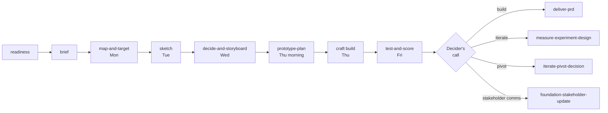

# Design Sprint Workflow

> Five-day workshop that turns a sharply-framed challenge into a tested prototype and a Decider call

> **Note:** Design Sprint is a workshop methodology (Knapp/Zeratsky/Kowitz), NOT an agile / Scrum sprint. For the disambiguation, see [`docs/concepts/workshop-sprints-vs-agile-sprints.md`](../docs/concepts/workshop-sprints-vs-agile-sprints.md). For pm-skills' agile sprint planning workflow, see [`sprint-planning.md`](sprint-planning.md).

Design Sprint is a structured five-day workshop developed by Jake Knapp, John Zeratsky, and Braden Kowitz that takes a single challenge from blank-page Monday to validated-or-invalidated Friday. The output is not a finished product or a polished design; it is a Decider's call (build, iterate, pivot, or stop) grounded in five customer interviews against a one-day prototype.

This workflow chains the 7 `tool-design-sprint-*` skills in their canonical sequence, with `tool-note-and-vote` invoked at decision moments throughout (specifically the Monday HMW heat-map, optional Monday target supervote, and Wednesday heat-map plus straw poll).

## Workflow Metadata

| Field | Value |
|-------|-------|
| **Workflow** | Design Sprint |
| **Classification** | tool |
| **Family** | design-sprint-skills |
| **Skills** | `tool-design-sprint-readiness` -> `tool-design-sprint-brief` -> `tool-design-sprint-map-and-target` -> `tool-design-sprint-sketch` -> `tool-design-sprint-decide-and-storyboard` -> `tool-design-sprint-prototype-plan` -> `tool-design-sprint-test-and-score` |
| **Cross-skill** | `tool-note-and-vote` (invoked at Monday HMW heat-map and Wednesday heat-map plus straw poll) |
| **Phases Covered** | Validation (downstream of strategic alignment and upstream of build) |
| **Estimated Duration** | 5 days canonical + 1 prep week (recruiting) |
| **Team Size** | 4 to 7 people including Decider |
| **Prerequisite Inputs** | A sprint-worthy challenge plus a hypothesis worth testing (often from a prior Foundation Sprint) plus customer access for Friday |
| **Final Output** | Friday scorecard plus Decider's build / iterate / pivot / stop call |

---

## Overview

```
                              prep week
                                 |
                                 v
                          readiness -> brief
                                 |
                                 v
   Mon: map-and-target  ->  Tue: sketch  ->
   Wed: decide-and-storyboard  ->  Thu: prototype-plan + craft build  ->
   Fri: test-and-score
                                 |
                                 v
                  Friday scorecard + Decider's call
                                 |
                                 v
              next artifact (PRD, experiment, pivot memo, stakeholder update)
```



The flow moves from challenge framing (Mon) to divergent design (Tue) to convergent decision and storyboard (Wed) to focused build planning (Thu morning) to craft build (Thu rest of day) to live customer testing (Fri) and a Decider call by Friday end. Each day's bundled output is the next day's primary input.

---

## When to Use

**Use Design Sprint when:**

- A specific challenge needs validation before committing engineering build cycles to it.
- A Foundation Sprint produced a Founding Hypothesis whose highest-risk assumption can be tested through a single-week prototype.
- Customer access for Friday testing is feasible (or recruitable in 7 to 10 days) at typical USD 75-150 honorarium per interview for B2B / USD 25-75 for B2C.
- The Decider is available for the load-bearing moments (Monday morning, Wednesday morning, Friday afternoon at minimum).
- The team can clear 5 consecutive days for 4 to 7 people; non-sprint coverage is arranged for on-call, customer-success, and investor pings.
- A prototype medium (clickable, slideware, service role-play, paper, physical mock) is feasible in 1 day with the team's existing capabilities.

**Don't use Design Sprint when:**

- The team has no clear challenge and is still in problem framing. Run a Foundation Sprint or customer discovery first.
- The challenge is too broad to fit one week ("redesign onboarding" is too broad; "design and test the first-time signup flow for B2B trial customers" is sprint-sized).
- No Decider is available for the load-bearing moments. Decisions made by committee Wednesday will be re-litigated Thursday.
- No customer access for Friday and no realistic recruiting plan. A Design Sprint that can't test on Friday is just a 4-day workshop with no learning event.
- The team has already decided what to build and the sprint is being run for political cover. The Friday scorecard cannot change the decision; this is sprint theater.
- Leadership stakes are low enough that 5 team-days plus customer cost are disproportionate. Use a smaller experiment design.

---

## Core Sequence

### Step 0 (prep week, REQUIRED): Readiness

**Skill:** [`tool-design-sprint-readiness`](../skills/tool-design-sprint-readiness/SKILL.md)

**Purpose:** Diagnose whether the team should run a Design Sprint now, postpone, or do prerequisite work first. The single most common cause of Design Sprint failure is running one that shouldn't have been run.

**Time:** 30 to 45 minutes.

**Key Outputs:**

- Go / Conditional Go / Wait verdict
- Diagnosis against 8 canonical readiness criteria (challenge sprint-worthiness; stakes; Decider availability; team size; 5-day clearable; customer access; prototype medium feasibility; downstream path)
- Recommended preconditions (Wait or Conditional Go)
- Recommended attendee list, customer recruiting plan, pre-sprint activities (Go)

**Decider Checkpoint:** Decider signs off on verdict AND authorizes the customer-recruiting honorarium budget before recruiting activates.

### Step 1 (prep week, REQUIRED): Brief

**Skill:** [`tool-design-sprint-brief`](../skills/tool-design-sprint-brief/SKILL.md)

**Purpose:** Produce the two-page brief that locks challenge, sprint questions, team, customer recruiting plan, prototype medium, interview format, logistics, and success criteria before Monday.

**Time:** 60 to 90 minutes.

**Prerequisites:** Readiness verdict is Go (or Conditional Go with preconditions cleared); recruiting started within 24 hours of readiness Go.

**Key Outputs:**

- Challenge statement and why-now (one paragraph)
- 2 to 4 sprint questions (lead question often = FS highest-risk assumption)
- Decider attendance windows (Mon AM, Wed AM, Fri PM at minimum)
- Team roster with role assignments per day
- Customer recruiting plan (target profile, source, count, incentive, recruiter owner, deadline, Friday schedule)
- Prototype medium decision plus rationale
- Interview format (live, remote, moderated; observer setup; recording posture)
- Logistics plan
- Success criteria

**Decider Checkpoint:** Decider signs off on the brief as the contract for the next 5 days and the authorization for customer-recruiting spend.

### Step 2 (Monday, 90-120 min facilitated + expert interviews + HMW): Map and Target

**Skill:** [`tool-design-sprint-map-and-target`](../skills/tool-design-sprint-map-and-target/SKILL.md)

**Purpose:** Produce Monday's bundled artifact: long-term goal (1-5 years), refined sprint questions (3-7), customer or system map (5-15 step flow), expert interview notes from cameo experts, HMW (How Might We) cluster board, and the Decider's chosen target moment for Tuesday's sketches.

**Time:** 105 minutes for the facilitated synthesis sections. Full Monday workshop is ~7 hours (09:00-17:00) including expert interviews running in parallel.

**Prerequisites:** Signed brief.

**Key Outputs:**

- Long-term goal (one aspirational sentence; 1-5 years out)
- Refined sprint questions (3-7; testable risks, not solutions)
- Customer or system map (5-15 steps from key player to long-term goal)
- Expert interview notes (2-4 cameo experts; 15-30 min each)
- HMW cluster board (30-100+ HMWs in 4-8 themes; heat-mapped via note-and-vote)
- Target moment (Decider's single-point selection on the map)

**Cross-skill:** Invokes [`tool-note-and-vote`](../skills/tool-note-and-vote/SKILL.md) for HMW heat-map; optionally for target-moment supervote.

**Decider Checkpoint:** Decider picks the target moment. Team disperses for Tuesday sketches.

### Step 3 (Tuesday, ~7 hours including silent sketch work): Sketch

**Skill:** [`tool-design-sprint-sketch`](../skills/tool-design-sprint-sketch/SKILL.md)

**Purpose:** Structure Tuesday's lightning demos plus four-step independent solution sketch protocol (Notes, Ideas, Crazy 8s, Solution Sketch). Each team member produces one solution sketch INDIVIDUALLY; the skill orchestrates the day but does not author the sketches themselves.

**Time:** 180 minutes for Facilitator-led portions; silent sketch steps run in parallel.

**Prerequisites:** Signed Monday Map and Target artifact.

**Key Outputs:**

- Lightning demo board (each team member presents 3 demos; Facilitator extracts reusable patterns)
- Sketch assignment plan (swarm vs divide; default swarm for v0.1 sprints)
- Four-step sketches from each team member (Notes 20 min plus Ideas 20 min plus Crazy 8s 8 min plus Solution Sketch 30-90 min)
- Recruiting tracker update

**Decider Checkpoint:** Logistics-only end-of-day check (sketches collected, attribution stripped before Wednesday heat-map, Wednesday morning attendance confirmed, recruiting status). The substantive Decider call comes Wednesday at supervote time.

### Step 4 (Wednesday, ~7 hours; most decision-heavy day): Decide and Storyboard

**Skill:** [`tool-design-sprint-decide-and-storyboard`](../skills/tool-design-sprint-decide-and-storyboard/SKILL.md)

**Purpose:** Run the art museum layout, heat map, speed critique, straw poll, Decider supervote, rumble-vs-all-in-one decision, and the storyboard that drives Thursday's prototype build. Wednesday is the most decision-heavy day of the sprint.

**Time:** 210 minutes for Facilitator-led portions.

**Prerequisites:** Tuesday sketches collected, attribution-stripped, uploaded to shared workspace.

**Key Outputs:**

- Art museum layout (sketches A/B/C/D arrayed anonymously)
- Heat map (silent dot-vote stickers on compelling parts)
- Speed critique notes per sketch (3 min each; sketcher silent during own sketch's critique)
- Straw poll results (1 dot per voter; non-binding)
- Supervote (Decider's call; Sprint book canonical 3-dot supervote)
- Rumble vs all-in-one decision (default all-in-one; v0.1 supports the decision but not dual-prototype execution)
- Storyboard (5-15 panels; What customer sees / What customer does / System response / Notes-for-builders)

**Cross-skill:** Invokes `tool-note-and-vote` for heat-map and straw poll. Supervote is the Decider's direct call.

**Decider Checkpoint:** Decider confirms storyboard is build-ready (specific enough that Thursday's builders can begin without re-debating design).

### Step 5 (Thursday morning, 60-120 min skill; rest of Thursday is craft build): Prototype Plan

**Skill:** [`tool-design-sprint-prototype-plan`](../skills/tool-design-sprint-prototype-plan/SKILL.md)

**Purpose:** Produce Thursday morning's planning artifact: 5 canonical Sprint book roles (Maker, Stitcher, Writer, Asset Collector, Interviewer), prototype brief, canonical Five-Act Interview script (Welcome, Context, Intro, Tasks, Debrief), trial-run checklist, and Friday participant confirmation tracker. The actual prototype build is craft work outside this skill's AI invocation surface (per Ratified Decision 1).

**Time:** 90 minutes for the planning artifact; the build itself occupies the rest of Thursday.

**Prerequisites:** Signed Wednesday storyboard.

**Key Outputs:**

- Prototype role plan (5 canonical roles assigned to humans)
- Prototype brief (what to build; fidelity bar; time allocation; explicitly NOT being built)
- Interview script (Five-Act canonical; Welcome / Context / Intro / Tasks / Debrief)
- Trial-run checklist (gates the prototype must pass Thursday afternoon before Friday)
- Participant confirmation tracker (Thursday morning re-confirm of all 5 Friday slots; buffer activation if needed)

**Decider Checkpoint:** Decider approves role plan, fidelity bar, Tasks-act wording, trial-run gate criteria, and Friday participant status. Decider then steps back; team disperses into parallel build work.

### Step 6 (Thursday rest-of-day, craft build): Prototype Build

**Not a pm-skills skill.** The prototype build is craft activity (Figma frames, Keynote slides, paper assemblies, role-play props) done by the team's Maker, Stitcher, Writer, and Asset Collector roles assigned in Step 5. Sprint book Chapter 16 governs this work; pm-skills does not orchestrate it.

**Trial-run gate:** Per Step 5's checklist, a fake-customer trial run (a teammate playing a target-profile customer) must pass before Friday begins. Failures here trigger Thursday evening recovery; if recovery fails by 19:00 PT, Friday postpones.

### Step 7 (Friday, ~9 hours): Test and Score

**Skill:** [`tool-design-sprint-test-and-score`](../skills/tool-design-sprint-test-and-score/SKILL.md)

**Purpose:** Friday is the sprint's payoff. 5 target-profile customers run the prototype while the team observes; the team synthesizes observations into a scorecard against Monday's sprint questions; the Decider makes the build / iterate / pivot / stop call by Friday end.

**Time:** 270 minutes for the synthesis sections. Interview time (5 x 50-60 min) runs in parallel with continuous observation capture. Friday day arc: 09:00-16:30 interviews; 16:30-17:00 wrap + hot takes; 17:00-17:30 Decider review; 17:30-18:00 summary captured.

**Prerequisites:** Trial run passed Thursday; 5 confirmed participants (or 4 if a buffer absorbed a cancellation; pause if below 4).

**Key Outputs:**

- Per-customer interview observation notes (Context reactions, Tasks behavior with timestamps, Debrief reactions including pricing)
- Best quotes (5-15 verbatim; used in Decider summary and downstream pitch artifacts)
- Scorecard grid (sprint-question rows by customer columns; Y / N / partial / unclear per cell; day-end decision per row)
- Observed patterns (worked, hesitated, broke trust, unexpected)
- Hot takes from each team member (written silently in parallel BEFORE group synthesis)
- Decider summary (build / iterate / pivot / stop / reframe + highest-confidence learning + most important revision + next artifact)

**Decider Checkpoint:** Decider's call IS the checkpoint. Sprint cannot close without an explicit build / iterate / pivot / stop / reframe call by 17:30 Friday and a named next artifact with owner.

---

## Other Next Steps (Post-Sprint)

The Friday Decider summary names the next artifact. The next artifact is typically NOT another Design Sprint; it is the action the call unlocks:

| Decider call | Next artifact | pm-skills path |
|---|---|---|
| Build | PRD for v0.1 build | [`deliver-prd`](../skills/deliver-prd/SKILL.md) |
| Iterate (refine prototype + re-sprint) | Smaller follow-on experiment design | [`measure-experiment-design`](../skills/measure-experiment-design/SKILL.md) |
| Pivot (to backup approach) | Pivot rationale + plan | [`iterate-pivot-decision`](../skills/iterate-pivot-decision/SKILL.md) |
| Stop | Lessons captured for future strategic work | [`iterate-lessons-log`](../skills/iterate-lessons-log/SKILL.md) |
| Stakeholder communication for any of the above | Async update | [`foundation-stakeholder-update`](../skills/foundation-stakeholder-update/SKILL.md) |

Per Ratified Decision 4 of the Design Sprint integration plan, the Decider summary in Step 7 captures the call and the next-artifact decision; full executive-memo authoring delegates to `foundation-stakeholder-update` (existing pm-skills foundation skill).

---

## Canonical Sources

- Knapp, J., Zeratsky, J., and Kowitz, B. *Sprint: How to Solve Big Problems and Test New Ideas in Just Five Days*. Simon and Schuster, 2016 (book-length canonical Design Sprint method).
- GV Design Sprint Guide. https://www.gv.com/sprint/
- Character Capital. "Design Sprint guide." https://www.character.vc
- Google Design Sprint Kit. https://designsprintkit.withgoogle.com/
- AJ and Smart "Remote Design Sprint" template (for the remote and hybrid format adaptations).
- Nielsen, J. (2000). "Why You Only Need to Test with 5 Users." Nielsen Norman Group. https://www.nngroup.com/articles/why-you-only-need-to-test-with-5-users/ (canonical research for the 5-customer cohort size).

See also [`docs/concepts/design-sprint.md`](../docs/concepts/design-sprint.md) for the conceptual explainer and [`docs/guides/using-design-sprint.md`](../docs/guides/using-design-sprint.md) for the operational guide (ships in v2.15.0).

---

## Related Workflows

- [`foundation-to-design`](foundation-to-design.md): end-to-end arc when both Foundation Sprint and Design Sprint run back-to-back; includes the narrative handoff that replaces the dropped bridge skill.
- [`foundation-sprint`](foundation-sprint.md): upstream when the team needs to choose a top bet and write a Founding Hypothesis before testing it through a Design Sprint.
- [Customer Discovery](customer-discovery.md): upstream when the team needs problem framing or customer research before a sprint-worthy challenge exists.
- [Feature Kickoff](feature-kickoff.md): downstream when the Friday Decider call is Build and the team is moving to PRD then delivery.
- [Post-Launch Learning](post-launch-learning.md): downstream of Build when the v0.1 ships and the team needs to measure outcomes.
