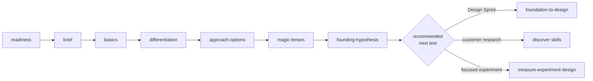

# Foundation Sprint Workflow

> Two-day strategic alignment workshop that produces a testable Founding Hypothesis

Foundation Sprint is a structured two-day workshop developed by Jake Knapp and John Zeratsky that converts fuzzy early-stage product beliefs into a single, testable strategic promise. The output is not a strategy deck or a roadmap; it is one canonical sentence (the Founding Hypothesis) plus an assumption scorecard the team can take into a Design Sprint, customer research, or a focused experiment.

This workflow chains the 7 `tool-foundation-sprint-*` skills in their canonical sequence, with `tool-note-and-vote` invoked many times across the arc at decision moments.

## Workflow Metadata

| Field | Value |
|-------|-------|
| **Workflow** | Foundation Sprint |
| **Classification** | tool |
| **Family** | foundation-sprint-skills |
| **Skills** | `tool-foundation-sprint-readiness` -> `tool-foundation-sprint-brief` -> `tool-foundation-sprint-basics` -> `tool-foundation-sprint-differentiation` -> `tool-foundation-sprint-approach-options` -> `tool-foundation-sprint-magic-lenses` -> `tool-foundation-sprint-founding-hypothesis` |
| **Cross-skill** | `tool-note-and-vote` (invoked at decision moments throughout) |
| **Phases Covered** | Strategic alignment (upstream of Design Sprint and downstream of problem framing) |
| **Estimated Duration** | 2 days canonical + 1 prep day |
| **Team Size** | 3 to 5 people including Decider |
| **Prerequisite Inputs** | An initiative or strategic question; some existing customer/market knowledge |
| **Final Output** | One canonical Founding Hypothesis sentence + assumption scorecard + recommended next test |

---

## Overview

```
                              prep day (optional)
                                     |
                                     v
                              readiness -> brief
                                     |
                                     v
   Day 1 AM: basics  ->  Day 1 PM: differentiation  ->
   Day 2 AM: approach-options  ->  Day 2 PM: magic-lenses  ->
   Day 2 end: founding-hypothesis
                                     |
                                     v
                       Founding Hypothesis + Scorecard
                                     |
                                     v
                       next test (Design Sprint, customer research, experiment)
```



The flow moves from customer and problem clarity (Basics) to differentiation (Day 1 PM) to approach generation and selection (Day 2) to a testable hypothesis (Day 2 end). Each step's bundled output is the next step's primary input.

---

## When to Use

**Use Foundation Sprint when:**

- Starting a significant new product, feature, or strategic initiative where a wrong direction is costly.
- The team has multiple plausible approaches and needs to choose a top bet plus a backup.
- Different stakeholders describe the customer or problem differently and alignment is needed before delivery.
- The team cannot clearly state why customers would choose this over alternatives.
- A Design Sprint is on the calendar but the hypothesis to test is not yet named.
- Founder or executive beliefs are strong but scattered, not explicit.

**Don't use Foundation Sprint when:**

- There is no concrete project, opportunity, or strategic question yet.
- The team has zero customer or market knowledge to draw on (do discovery first).
- Deep problem exploration is what's missing (use problem framing or `discover-*` skills first).
- The decision is minor and a full sprint is overkill (use a lighter prioritization tool).
- No Decider is available to make strategic calls (postpone until one is appointed).
- The hypothesis is already clear and the team needs to validate it with customers (jump straight to a Design Sprint).

---

## Core Sequence

### Step 0 (prep day, optional but recommended): Readiness

**Skill:** [`tool-foundation-sprint-readiness`](../skills/tool-foundation-sprint-readiness/SKILL.md)

**Purpose:** Diagnose whether the team should run a Foundation Sprint now, postpone, or do prerequisite work first.

**Time:** 30 to 45 minutes.

**Key Outputs:**

- Go / Conditional Go / Wait verdict
- Diagnosis (what's missing, if anything)
- Recommended preconditions (Wait or Conditional Go)
- Recommended attendee list and pre-sprint activities (Go)

**Decider Checkpoint:** Decider signs off on verdict before scheduling Day 1.

### Step 1 (prep day): Brief

**Skill:** [`tool-foundation-sprint-brief`](../skills/tool-foundation-sprint-brief/SKILL.md)

**Purpose:** Produce the one-page brief that locks scope, decision target, team, logistics, and success criteria before Day 1.

**Time:** 45 to 60 minutes.

**Prerequisites:** Readiness verdict is Go (or Conditional Go with preconditions cleared).

**Key Outputs:**

- Initiative statement and stakes (one paragraph)
- Decision the sprint must unlock (one sentence)
- Team roster with role assignments
- Logistics plan
- Inputs to bring
- Readiness reaffirmation

**Decider Checkpoint:** Decider signs off on the brief as the contract for the next two days.

### Step 2 (Day 1 morning, 90-120 min): Basics

**Skill:** [`tool-foundation-sprint-basics`](../skills/tool-foundation-sprint-basics/SKILL.md)

**Purpose:** Force explicit team choices on target customer, important problem, team advantage, and competitors and alternatives. Output is one coherent strategic frame, not four separable decisions.

**Time:** 90 to 120 minutes.

**Prerequisites:** Signed brief.

**Key Outputs:**

- Target customer statement (specific, with markers)
- Important problem statement (painful enough to drive switching)
- Team advantage inventory (with concrete evidence)
- Competitor and alternative map (including "do nothing")
- Note-and-vote trace per sub-decision

**Cross-skill:** Invokes [`tool-note-and-vote`](../skills/tool-note-and-vote/SKILL.md) four times.

**Decider Checkpoint:** Decider signs off on the bundled artifact before lunch.

### Step 3 (Day 1 afternoon, 120-180 min): Differentiation

**Skill:** [`tool-foundation-sprint-differentiation`](../skills/tool-foundation-sprint-differentiation/SKILL.md)

**Purpose:** Convert the morning's Basics frame into a defensible strategic position through scored candidates, 2x2 chart, decision principles, and Mini Manifesto.

**Time:** 120 to 180 minutes.

**Prerequisites:** Signed Basics bundled artifact.

**Key Outputs:**

- Scored differentiator candidates table
- 2 chosen differentiators
- 2x2 differentiation chart with competitors plotted
- 3 to 5 decision principles
- One-page Mini Manifesto

**Cross-skill:** Invokes `tool-note-and-vote` for differentiator selection.

**Decider Checkpoint:** Decider signs off on the Day 1 strategic summary before Day 1 ends.

### Step 4 (Day 2 morning, 60-90 min): Approach Options

**Skill:** [`tool-foundation-sprint-approach-options`](../skills/tool-foundation-sprint-approach-options/SKILL.md)

**Purpose:** Force generation of 3 to 7 candidate approaches as one-page summaries before the team converges on a top bet. Anti-anchoring discipline.

**Time:** 60 to 90 minutes.

**Prerequisites:** Signed Differentiation bundled artifact.

**Key Outputs:**

- 3 to 7 one-page approach summaries
- Approach set summary table

**Decider Checkpoint:** Decider signs off on the candidate set advancing to Magic Lenses.

### Step 5 (Day 2 afternoon, 90-120 min): Magic Lenses

**Skill:** [`tool-foundation-sprint-magic-lenses`](../skills/tool-foundation-sprint-magic-lenses/SKILL.md)

**Purpose:** Evaluate the approach set through 4 classic lenses (customer, pragmatic, growth, money) plus at least 1 custom lens, then surface trade-offs and name a top bet plus a backup plan.

**Time:** 90 to 120 minutes.

**Prerequisites:** Signed Approach Options bundled artifact.

**Key Outputs:**

- 4 classic lens charts
- 1 or more custom lens charts
- Pattern review (consistent winners, contradictions, biggest trade-off)
- Top bet (Decider supervote)
- Backup plan (strategically distinct from top bet)
- Decision rationale (one paragraph)

**Cross-skill:** Invokes `tool-note-and-vote` for the top bet supervote.

**Decider Checkpoint:** Decider signs off on top bet, backup, and rationale before Founding Hypothesis writing begins.

### Step 6 (Day 2 end, 30-45 min): Founding Hypothesis

**Skill:** [`tool-foundation-sprint-founding-hypothesis`](../skills/tool-foundation-sprint-founding-hypothesis/SKILL.md)

**Purpose:** Compress the sprint's full strategic frame into one canonical sentence plus an assumption scorecard plus a recommended next test. This is the artifact the sprint exists to produce.

**Time:** 30 to 45 minutes.

**Prerequisites:** Signed Magic Lenses output.

**Key Outputs:**

- Founding Hypothesis statement (strict canonical template, no paraphrase)
- Assumption scorecard (5 to 7 recommended; 3 to 10 accepted)
- Why we believe this (3 to 5 evidence bullets)
- What could prove us wrong (3 to 5 risk bullets)
- Recommended next validation step with owner and timeline

**Decider Checkpoint:** Decider ratifies the hypothesis. The sprint closes.

---

## Transition: Foundation Sprint to Design Sprint

The Founding Hypothesis is often the input to a downstream Design Sprint. There is **no formal bridge skill** in pm-skills (canonical Knapp/Zeratsky methodology has no formal handoff move; pm-skills does not invent one). The transition is narrative content described here and in the user guides.

How Foundation Sprint outputs feed Design Sprint inputs:

| Foundation Sprint output | Becomes Design Sprint input |
|---|---|
| Target customer | Customer recruiting profile (Design Sprint brief) |
| Important problem framing | Day 1 long-term goal context |
| Top bet (approach) | Prototype direction (Day 3 storyboard) |
| Assumption scorecard | Sprint questions (Day 1 Map and Target) |
| Highest-risk assumption | Primary scorecard row (Day 5 Test and Score) |
| Backup plan | Pivot option if Friday signal is weak |

The go/no-go checkpoint between sprints: the Decider confirms the Founding Hypothesis is testable through a prototype before starting the Design Sprint. If the highest-risk assumption cannot be tested with a 5-day prototype, the team revisits the hypothesis or chooses a different next test.

Team continuity considerations: the Foundation Sprint team typically expands for the Design Sprint (3 to 5 people becomes up to 7). The Decider continues; the facilitator continues; PM and design typically continue; engineering may join for prototype build.

Timing: run the Design Sprint within 1 to 2 weeks of Foundation Sprint so the strategic context is fresh. Longer gaps invite re-litigation of the Founding Hypothesis.

For the full end-to-end arc, see [`foundation-to-design.md`](foundation-to-design.md) (Design Sprint plan).

---

## Other Next Steps (Not a Design Sprint)

The Foundation Sprint produces a Founding Hypothesis and a recommended next test. The recommended next test is not always a Design Sprint:

| Recommended next test | When to choose it | Pm-skills path |
|---|---|---|
| Design Sprint | Hypothesis is testable through a realistic prototype with target customers | `tool-design-sprint-readiness` and downstream |
| Customer research | The hypothesis depends on a deeper understanding of customer behavior or context | `discover-interview-synthesis` and other discover-* skills |
| Focused experiment | A single assumption can be tested with a fake-door, landing page, or A/B test | `measure-experiment-design` |
| Concierge MVP | The hypothesis is testable by delivering the experience manually before building | (no pm-skills direct equivalent; document in skill body) |
| Feature kickoff | The hypothesis is confirmed enough that the team can move to PRD | [`feature-kickoff`](feature-kickoff.md) workflow |

The Founding Hypothesis's Assumption Scorecard names the highest-risk assumption; the recommended next test should attack that assumption first.

---

## Canonical Sources

- Knapp, J., and Zeratsky, J. *Click: How to Make What People Want* (book-length canonical Foundation Sprint method).
- Character Capital. "Foundation Sprint guide." https://www.character.vc/guide/foundation-sprint
- Knapp, J., and Zeratsky, J. "Introducing the Foundation Sprint." Lenny's Newsletter.
- Design Sprint Academy. Foundation Sprint articles for enterprise adaptation.

See also [`docs/concepts/foundation-sprint.md`](../docs/concepts/foundation-sprint.md) for the conceptual explainer and [`docs/guides/using-foundation-sprint.md`](../docs/guides/using-foundation-sprint.md) for the operational guide (ships in v2.15.0).

---

## Related Workflows

- [Customer Discovery](customer-discovery.md): upstream of Foundation Sprint when the team needs problem framing or customer research first.
- [Feature Kickoff](feature-kickoff.md): downstream when the Founding Hypothesis is confirmed and the team is moving to delivery.
- [`foundation-to-design`](foundation-to-design.md): end-to-end arc when both Foundation Sprint and Design Sprint run back-to-back.
- [Product Strategy](product-strategy.md): broader strategic context if the team is also re-evaluating the whole product direction.
