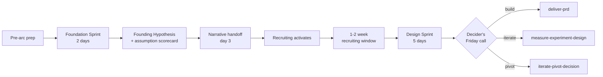

# Foundation Sprint to Design Sprint Workflow

> End-to-end 7-8 day arc that pairs a Foundation Sprint with a Design Sprint, including the narrative handoff that replaces the dropped bridge skill

This is the canonical end-to-end workflow for teams running a Foundation Sprint followed by a Design Sprint as one connected arc. It chains [`foundation-sprint`](foundation-sprint.md) (2 days of strategic alignment) with [`design-sprint`](design-sprint.md) (5 days of prototype validation) through a brief narrative-only transition between them.

There is **no bridge skill** in pm-skills. Canonical Knapp/Zeratsky methodology has no formal handoff move between Foundation Sprint and Design Sprint; pm-skills does not invent one. The handoff is described narratively in this workflow, in [`docs/guides/using-foundation-sprint.md`](../docs/guides/using-foundation-sprint.md), and in [`docs/guides/using-design-sprint.md`](../docs/guides/using-design-sprint.md). The Founding Hypothesis (Foundation Sprint output) is consumed as input context by the Design Sprint readiness and brief skills directly; no intermediate artifact is required.

## Workflow Metadata

| Field | Value |
|-------|-------|
| **Workflow** | Foundation Sprint to Design Sprint (end-to-end) |
| **Classification** | tool |
| **Families** | foundation-sprint-skills + design-sprint-skills |
| **Component Workflows** | [`foundation-sprint`](foundation-sprint.md) + [`design-sprint`](design-sprint.md) |
| **Cross-skill** | `tool-note-and-vote` (invoked across both sprints at decision moments) |
| **Phases Covered** | Strategic alignment (FS) + Validation (DS) |
| **Estimated Duration** | 7 to 8 days total: 2 days FS + 1 prep day + 5 days DS, with a 1-2 week recruiting window starting at FS close |
| **Team Size** | 3-5 for FS expanding to 4-7 for DS (typically) |
| **Prerequisite Inputs** | An initiative or strategic question; some existing customer/market knowledge |
| **Final Output** | A built v0.1 plan: Friday DS scorecard plus Decider's build / iterate / pivot / stop call plus the next artifact owner-and-deadline |

---

## When to Use This End-to-End Arc

**Use the FS-to-DS arc when:**

- The team is at the start of a significant new product, feature, or strategic initiative AND knows it wants to validate the direction through customer testing.
- The decision is consequential enough to justify 7-8 days of focused team time plus customer-recruiting cost.
- The Decider can commit to both sprints with continuity (the same Decider for both; minimal gap between).
- Customer access is feasible within the recruiting window (typically 1-2 weeks).
- The team has not yet locked a strategic direction (FS) AND wants prototype-validated evidence before committing to build (DS).

**Don't use this end-to-end arc when:**

- The strategic direction is already clear; jump to [`design-sprint`](design-sprint.md) directly.
- The team is in deep discovery and needs problem framing first; run [`customer-discovery`](customer-discovery.md) before either sprint.
- The Decider can attend FS but not DS (or vice versa); run only the sprint that fits and use a smaller follow-up for the other half.
- Time is constrained to less than 7 days end-to-end; pick one sprint or use a smaller experiment design.
- The team has already prototyped and tested; the arc adds no value over post-build iteration.

---

## End-to-End Sequence Overview

```
                   Week -2 to Week 0: pre-arc prep
                                  |
                                  v
   Week 1, Day 1-2: Foundation Sprint (readiness + brief + basics +
                    differentiation + approach-options + magic-lenses +
                    founding-hypothesis)
                                  |
                                  v
                   Day 2 end: Founding Hypothesis ratified
                                  |
                                  v
                   Day 3: Narrative handoff conversation (this workflow)
                          + Design Sprint readiness invocation
                          + recruiting activation
                                  |
                                  v
   Week 1 to Week 2 gap (1-2 weeks): recruiting closes; DS brief locked
                                  |
                                  v
   Week 2 or 3, Days 1-5: Design Sprint (map-and-target Mon, sketch Tue,
                          decide-and-storyboard Wed, prototype-plan +
                          craft build Thu, test-and-score Fri)
                                  |
                                  v
                   Friday end: Decider's call + next artifact
                                  |
                                  v
                   Next artifact (PRD / experiment / pivot / etc.)
```



The arc is 7-8 days of facilitated team time spread across 2-3 calendar weeks. The calendar-week spread is because customer recruiting needs a 7-10 day lead from sprint Monday; FS finishes Friday of Week 1 and DS typically runs Mon-Fri of Week 2 or Week 3.

---

## Part 1: Foundation Sprint

Run the full [`foundation-sprint`](foundation-sprint.md) workflow. The output is a ratified Founding Hypothesis plus an assumption scorecard plus a recommended next test (which, in this end-to-end arc, is named as a Design Sprint).

Key Foundation Sprint outputs that become Design Sprint inputs in Part 3:

- **Target customer statement** (from Day 1 Basics)
- **Important problem framing** (from Day 1 Basics)
- **Team advantage** (from Day 1 Basics)
- **Competitors and alternatives map** (from Day 1 Basics)
- **2 chosen differentiators** (from Day 1 Differentiation)
- **Mini Manifesto** (from Day 1 Differentiation)
- **3 to 5 decision principles** (from Day 1 Differentiation)
- **Top bet approach** (from Day 2 Magic Lenses)
- **Backup plan** (from Day 2 Magic Lenses)
- **Founding Hypothesis sentence** (from Day 2 end Founding Hypothesis)
- **Assumption scorecard with highest-risk assumption flagged** (from Day 2 end Founding Hypothesis)

---

## Part 2: The Narrative Handoff (Day 3)

This is the load-bearing replacement for the dropped bridge skill. It is described narratively here and operationalized in the two user guides; no SKILL.md authors it.

### Handoff conversation structure (30 to 60 minutes; small group)

The Decider plus the facilitator plus the PM hold a working conversation between Foundation Sprint close (Day 2 end) and Design Sprint readiness invocation (typically Day 3 morning). Conversation covers:

1. **Re-confirm the highest-risk assumption.** From the Foundation Sprint assumption scorecard, name the specific assumption the Design Sprint will test as its lead question. The Founding Hypothesis as a whole is not the test target; one specific assumption is.

2. **Confirm the assumption is prototype-testable.** Can a 5-day team build a prototype that puts target customers in a situation where they would meaningfully validate or invalidate the assumption? If yes, proceed. If no, the right next test is not a Design Sprint (it might be customer research or a smaller fake-door experiment); see "Go / no-go checkpoint" below.

3. **Map Foundation Sprint outputs to Design Sprint inputs.** Use the slot mapping table (next section) to identify which Founding Hypothesis components feed which Design Sprint moments. Most importantly: target customer becomes the recruiting profile; the top bet becomes the prototype direction; the highest-risk assumption becomes the lead sprint question.

4. **Identify team continuity and expansion.** Foundation Sprint typically runs with 3-5 people; Design Sprint typically needs 4-7. The Decider continues; the facilitator continues; PM and design typically continue. Engineering may need to join (specifically for Thursday prototype build). Customer-expert role may shift (FS customer expert may not be the right person for DS interviews).

5. **Commit to Design Sprint timing.** Run the Design Sprint within 1 to 2 weeks of Foundation Sprint close so strategic context is fresh. Longer gaps invite re-litigation of the Founding Hypothesis. Recruiting starts the day of this conversation (or the next morning).

### Foundation Sprint to Design Sprint slot mapping

| Foundation Sprint output | Becomes Design Sprint input | Where in DS arc |
|---|---|---|
| Target customer | Customer recruiting profile | DS Brief (Step 1) |
| Important problem framing | Challenge statement plus why-now context | DS Brief (Step 1) and DS Map and Target Day 1 long-term goal |
| Team advantage | Expert interview prioritization plus "why us, why now" framing | DS Map and Target Day 1 (expert interview selection) |
| Competitors and alternatives map | Long-term goal context plus prototype differentiation framing | DS Map and Target Day 1 plus DS Decide and Storyboard Day 3 |
| 2 chosen differentiators | Sketch input (Tuesday) plus storyboard moments of differentiation (Wednesday) | DS Sketch Day 2 plus DS Decide and Storyboard Day 3 |
| Mini Manifesto | Day 1 sanity-check during Map and Target; Day 3 storyboard alignment check | DS Map and Target Day 1 plus DS Decide and Storyboard Day 3 |
| 3 to 5 decision principles | Wednesday voting criteria plus storyboard guardrails | DS Decide and Storyboard Day 3 |
| Top bet (approach) | Prototype direction | DS Decide and Storyboard Day 3 (storyboard) and DS Prototype Plan Day 4 |
| Backup plan | Pivot option if Friday signal is weak | DS Test and Score Day 5 (Decider summary) |
| Founding Hypothesis sentence | Brief why-now context plus Friday Decider review reference | DS Brief Step 1 plus DS Test and Score Step 7 |
| Assumption scorecard | Source for sprint questions | DS Brief Step 1 plus DS Map and Target Day 1 (refinement) |
| Highest-risk assumption | LEAD sprint question | DS Brief Step 1 (Q1) plus DS Test and Score Step 7 (lead scorecard row) |

### Go / no-go checkpoint between sprints

The Decider answers three questions at the end of the handoff conversation. All three must be Yes for the Design Sprint to launch:

1. **Is the highest-risk assumption testable through a single-week prototype with target customers?** If no, the right next test is not a Design Sprint. Options: customer research, fake-door experiment, concierge MVP, or a different specific test. Use [`measure-experiment-design`](../skills/measure-experiment-design/SKILL.md) to design the alternative.

2. **Is customer access feasible within the 1-2 week recruiting window?** If no, recruiting needs to start earlier (this is sometimes a reason to postpone DS by a week) or the target profile needs to be loosened (sometimes acceptable, sometimes a signal that the FS target was too narrow).

3. **Can the team clear 5 consecutive days plus a Decider who attends the load-bearing moments?** If no, the DS itself is not feasible right now; postpone or use a smaller follow-on test.

If any answer is No, the team uses [`tool-design-sprint-readiness`](../skills/tool-design-sprint-readiness/SKILL.md) to formalize a Wait verdict, document the gating issue, and either close the gap or pivot to a different next test. The Founding Hypothesis remains valid regardless; only the testing modality changes.

---

## Part 3: Design Sprint

Once the handoff conversation completes with Go on all three checkpoint questions, invoke [`tool-design-sprint-readiness`](../skills/tool-design-sprint-readiness/SKILL.md) as the formal Design Sprint readiness assessment. Then run the full [`design-sprint`](design-sprint.md) workflow.

The Design Sprint's readiness, brief, and Monday Map-and-Target steps consume the Foundation Sprint outputs as input context (via the slot mapping above). The team does not re-derive the target customer or restate the strategic direction; those are inherited from Foundation Sprint and locked at FS close.

What changes between standalone DS and FS-to-DS:

- **DS Readiness:** consumes the Founding Hypothesis as optional input context (FS-to-DS arc); EXAMPLE.md in the readiness skill demonstrates the Brainshelf arc continuing from FS.
- **DS Brief:** The lead sprint question (Q1) is the FS highest-risk assumption verbatim.
- **DS Map and Target Monday:** The long-term goal is informed by the FS important-problem framing; the customer or system map is informed by the FS competitors-and-alternatives map.
- **DS Decide and Storyboard Wednesday:** The Mini Manifesto serves as the alignment check; the decision principles serve as guardrails for the supervote.
- **DS Test and Score Friday:** The Decider summary references the Founding Hypothesis directly; if Friday invalidates the lead assumption, the pivot is to the FS backup plan (not a re-litigation of strategic direction).

---

## Canonical Sources

- Knapp, J., and Zeratsky, J. *Click: How to Make What People Want* (Foundation Sprint method).
- Knapp, J., Zeratsky, J., and Kowitz, B. *Sprint: How to Solve Big Problems and Test New Ideas in Just Five Days*. Simon and Schuster, 2016 (Design Sprint method).
- GV Design Sprint Guide. https://www.gv.com/sprint/
- Character Capital. "Foundation Sprint guide" + "Design Sprint guide." https://www.character.vc

See also [`docs/concepts/foundation-sprint.md`](../docs/concepts/foundation-sprint.md) and [`docs/concepts/design-sprint.md`](../docs/concepts/design-sprint.md) for the conceptual explainers, and [`docs/guides/using-foundation-sprint.md`](../docs/guides/using-foundation-sprint.md) plus [`docs/guides/using-design-sprint.md`](../docs/guides/using-design-sprint.md) for the operational guides (ships in v2.15.0).

---

## Related Workflows

- [`foundation-sprint`](foundation-sprint.md): the Foundation Sprint half of this arc, runnable standalone when the team only needs strategic alignment.
- [`design-sprint`](design-sprint.md): the Design Sprint half of this arc, runnable standalone when the team already has a hypothesis and only needs prototype validation.
- [Customer Discovery](customer-discovery.md): upstream when the team needs problem framing or customer research before either sprint.
- [Feature Kickoff](feature-kickoff.md): downstream when the Friday Decider call is Build and the team moves to PRD then delivery.
- [Post-Launch Learning](post-launch-learning.md): downstream of Build when v0.1 ships and the team needs to measure outcomes.
