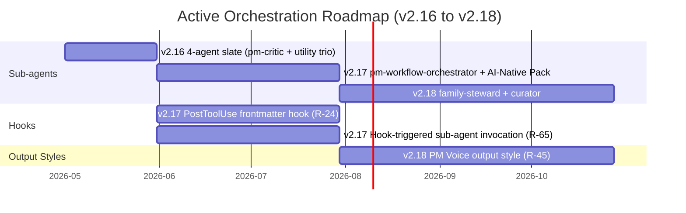

## Table of Contents

- [The Theme](#the-theme)
- [What Changes for Users](#what-changes-for-users)
- [The Strategic Arc (v2.16 to v2.18)](#the-strategic-arc-v216-to-v218)
- [Why Now](#why-now)
- [What Stays the Same](#what-stays-the-same)
- [Related Documentation](#related-documentation)

## The Theme

pm-skills started as a content library: skills that AI agents read at invocation time to produce PM artifacts with professional quality. Through v2.15.0, the catalog grew to 60 skills + 67 slash commands + 12 workflows + 27 enforcing CI validators. All of it is content. The AI reads it. The AI acts on it. The AI produces the output.

v2.16.0 opens a second layer: the **runtime layer**. Sub-agents are the first inhabitants. Hooks (v2.17+) and output styles (v2.18+) follow.

Active orchestration is the theme: the repo no longer ONLY supplies content for AI to read; it ALSO supplies AI components that take action. The same way `pm-critic` runs adversarial review automatically after a PRD-producing skill completes, future hooks will validate frontmatter on every file write, and future output styles will shape Claude's voice for PM communications.

The shipping unit shifts from "the skill" (content) to "the runtime component" (active).

## What Changes for Users

Functionally:

- **You can now run `/pm-critic` and get a real adversarial review of your PRD or OKR set in 30 seconds.** `pm-critic` reads the artifact, consults the canonical contract docs, and returns P0/P1/P2/P3 findings with concrete fix suggestions. The proactive trigger means it auto-fires after PM-artifact-producing skills - you do not need to remember to invoke it.

- **You can now run `/pm-release v{X.Y.Z}` and get a 6-gate guided release flow.** `pm-release-conductor` walks the maintainer through Pre-tag readiness, Adversarial review attestation, Version bump + CHANGELOG prep, Commit + re-verify, Tag + push, Post-tag hygiene. It refuses to advance past failed gates. It tags only the SHA captured at G2.5 (preventing the broken-tag class of bug that v2.13.1 surfaced).

- **You can now run `/pm-audit-repo` and `/pm-draft-changelog` as standalone utility commands** or let the conductor chain to them at the relevant gates.

- **On non-Claude clients** (Codex CLI, Cursor, Windsurf, Copilot, Gemini CLI), you get the same intent via **dispatch skills** at `skills/utility-pm-{role}/`. The dispatch skills detect runtime and either invoke the native sub-agent (Claude Code) or execute the agent definition inline (other clients). Functionally equivalent except for proactive triggering, which is Claude Code only.

Structurally:

- The repo has a new `subagents/` directory containing 4 sub-agent definitions (paths declared via plugin.json's custom `agents` field per master plan D31; see [`docs/concepts/sub-agents.md`](./sub-agents.md) for the rationale on the non-default directory name)
- 4 new dispatch skills at `skills/utility-pm-{role}/`
- 4 new slash commands (`/pm-critic`, `/pm-audit-repo`, `/pm-draft-changelog`, `/pm-release`)
- 12 new library samples (3 per sub-agent across the brainshelf / storevine / workbench narrative threads)
- 5 new public docs (this one plus sub-agents.md, using-sub-agents.md, authoring-sub-agents.md, sub-agent-design-patterns.md)
- 3 new contributor-facing reference docs (runtime-components.md catalog, adversarial-review.md user guide, release-runbook.md contributor guide)

## The Strategic Arc (v2.16 to v2.18)

**v2.16.0:** sub-agents land. 4 in the slate. Foundational pattern: proactive review, explicit utility trio, dispatch skills for cross-client.

**v2.17.0:** `pm-workflow-orchestrator` joins (coordinates multi-skill workflows with quality gates). Hook infrastructure (PostToolUse validating frontmatter on every Edit/Write; hook-triggered sub-agent invocation). User-settings parser (`.claude/pm-skills.local.md` for per-project pm-critic severity floors and auto-invoke configuration). The AI-Native PM Pack adds eval-suite-spec, prompt-spec, model-card, and ai-failure-mode-catalog skills for AI-product PMs.

**v2.18.0+:** family-steward sub-agent design (currently folded into pm-critic per master plan D8; revisits when a third skill family ships and cross-family logic diverges). PM Voice output style. Multi-reviewer critique board (3 critics with consensus filtering).

## Why Now

Three factors converged to make v2.16.0 the right release for active orchestration:

1. **The Phase 0 Adversarial Review Loop has proven itself** across 2 manual cycles in v2.15.0 (FS-track 35 findings + DS-track 13 Codex findings + 20 self-audit findings). Codifying it as a sub-agent now has strong evidence behind it.

2. **The release runbook has accumulated enough discipline points** that the maintainer's head + partial release-plan checklists is not enough. The v2.13.1 plugin install path correction was post-tag detection that required a fast patch ship. The G2.5 commit gate (per master plan D22 / Codex R01) makes that bug class structurally impossible.

3. **CHANGELOG hygiene rules from CLAUDE.md** are sufficiently formalized that the curator can apply them mechanically. The hygiene rules took shape across v2.14.x cleanup cycles; v2.16 codifies them as a sub-agent that applies them consistently.

The v2.17 utility trio (orchestrator + frontmatter-doctor + AI-Native Pack) was originally scoped for separate v2.16.0 + v2.16.1 releases per the implementation plan. Master plan D3 collapsed that into one tag because (a) v2.15.0 shipped the locked classification:tool work and there's no other large content track running; (b) the conductor + curator + auditor form a coherent maintenance trio that compounds with every subsequent release; (c) shipping all four together gives a defensible release narrative.

## What Stays the Same

Despite the strategic shift, several invariants hold:

- **Skills remain the bulk of pm-skills.** 60 skills at v2.15.0; still 55 at v2.16.0 (plus 4 dispatch skills, which are thin wrappers, not new content). The content library is the foundation; sub-agents extend its surface.
- **Cross-client compatibility is preserved.** Dispatch skills mean Codex CLI, Cursor, Windsurf, Copilot, and Gemini CLI users get full functional access.
- **agentskills.io specification compliance.** pm-skills continues to follow the spec for skills; sub-agents are an additive Claude Code plugin feature that does not change the skill contract.
- **No-em-dash + no-Claude-attribution-trailer hygiene rules.** Both apply to sub-agent outputs; the curator enforces the CHANGELOG side; the conductor's G0 enforces the repo side.
- **Apache 2.0 license.** Unchanged.

## Related Documentation

- Sub-Agents concept (the mechanism): [`docs/concepts/sub-agents.md`](./sub-agents.md)
- Runtime components catalog: [`docs/reference/runtime-components.md`](../reference/runtime-components.md)
- Using Sub-Agents (user-facing guide): [`docs/guides/using-sub-agents.md`](../guides/using-sub-agents.md)
- Authoring Sub-Agents (contributor guide): [`docs/contributing/authoring-sub-agents.md`](../contributing/authoring-sub-agents.md)
- v2.16.0 release plan: master plan at [`docs/internal/release-plans/v2.16.0/plan_v2.16.0.md`](https://github.com/product-on-purpose/pm-skills/blob/main/docs/internal/release-plans/v2.16.0/plan_v2.16.0.md)
- v2.17.0 forward planning: stub at [`docs/internal/release-plans/v2.17.0/plan_v2.17.0.md`](https://github.com/product-on-purpose/pm-skills/blob/main/docs/internal/release-plans/v2.17.0/plan_v2.17.0.md) (created at end of v2.16.0 cycle)
