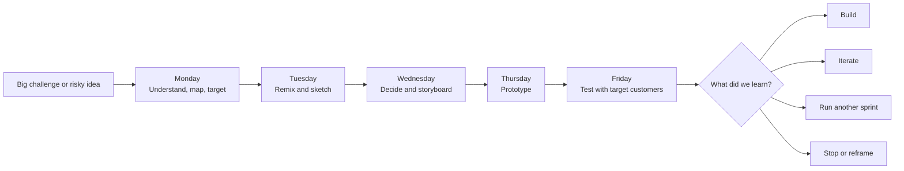
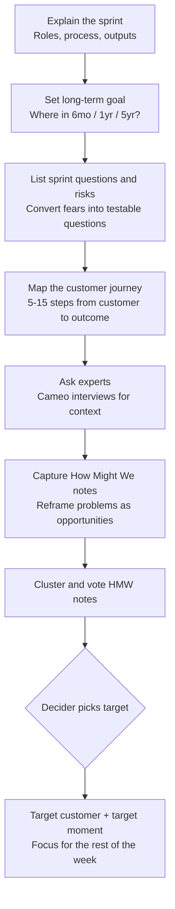
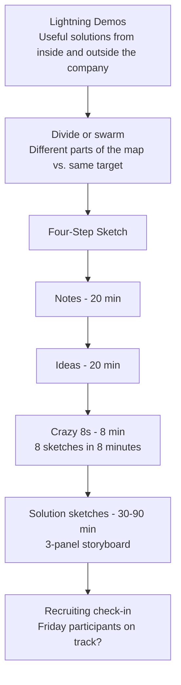
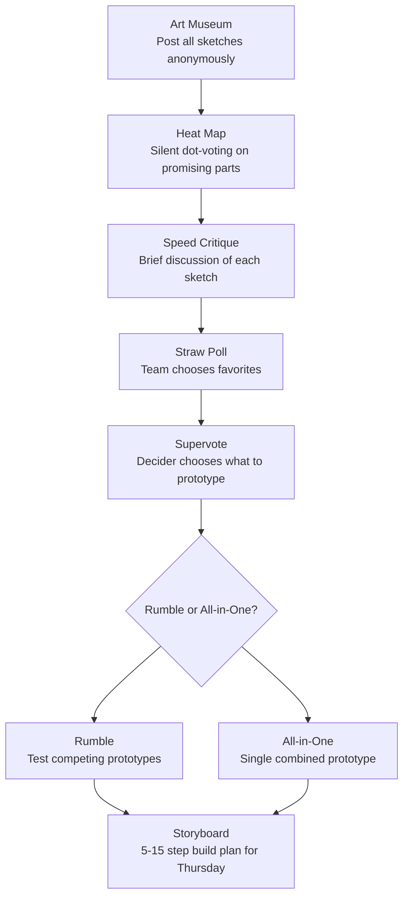
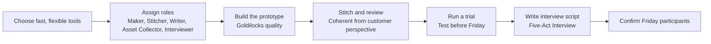
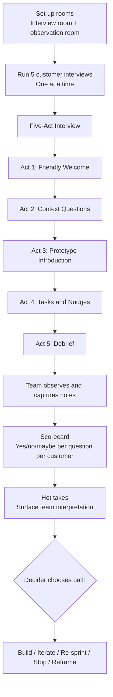
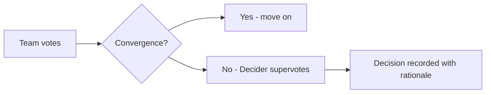
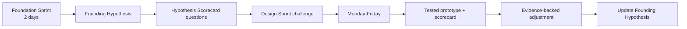
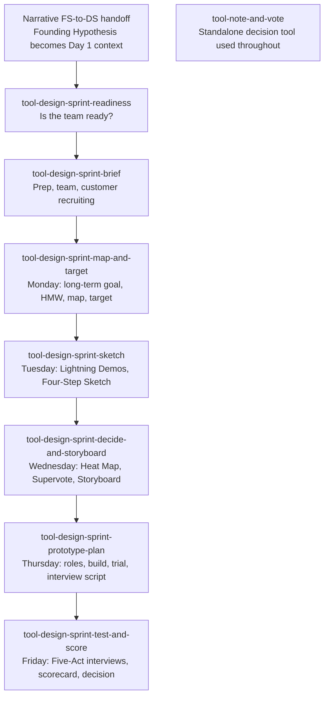

> **Design Sprint is NOT an agile / Scrum sprint.** It is a 5-day workshop methodology from Knapp, Zeratsky, and Kowitz (Sprint book, 2016). For the cross-method disambiguation, see [Workshop Sprints vs Agile Sprints](workshop-sprints-vs-agile-sprints.md). For pm-skills' agile sprint planning content, see [`_workflows/sprint-planning.md`](../../_workflows/sprint-planning.md).

## Executive Summary

A **Design Sprint** is a timeboxed five-day process for answering important business, product, or service questions by mapping a challenge, sketching solutions, choosing a direction, building a realistic prototype, and testing it with target customers. By Friday afternoon, the team has converted a high-risk idea into observable customer evidence and an explicit decision: build, iterate, run another sprint, or stop.

The Design Sprint was developed at Google Ventures by Jake Knapp, John Zeratsky, Braden Kowitz, Michael Margolis, and Daniel Burka, and popularized in the 2016 book *Sprint: How to Solve Big Problems and Test New Ideas in Just Five Days*. It has since been adopted by thousands of teams across software, hardware, services, and operations.

The core insight is not speed by itself. The value is the combination of speed, decision discipline, prototype realism, customer evidence, and cross-functional alignment, all compressed into one continuous week so that learning happens before momentum gets locked into a full delivery effort.

---

## Origins: From GV to Character Capital

### Why Google Ventures Built It

In 2010, Jake Knapp was running design workshops for Google teams and started experimenting with combining the best parts of design thinking, IDEO-style methods, agile, and business-strategy facilitation into a single intensive week. The structure stabilized as the five-day Design Sprint at Google Ventures, where Knapp and his colleagues used it to help GV-funded startups make faster, better-grounded product decisions.

The method was first published openly in 2016 with the *Sprint* book and accompanying GV guide at gv.com/sprint. The five-day structure (Monday: understand; Tuesday: sketch; Wednesday: decide; Thursday: prototype; Friday: test) has remained stable since.

### Character Capital's Evolution

After leaving GV, Knapp and Zeratsky founded Character Capital and continued to evolve the method. Character's current Design Sprint guide preserves the five-day structure but updates the guidance for remote sprints, AI-era tooling, and the relationship with the upstream Foundation Sprint they developed for early-stage strategic clarity.

### Canonical Sources

- **The Sprint book** at https://www.thesprintbook.com/. Book-length canonical method.
- **GV's Design Sprint guide** at https://www.gv.com/sprint/. Original public five-day structure.
- **Character Capital's Design Sprint guide** at https://www.character.vc/guide/design-sprint. Current guide from Knapp and Zeratsky.
- **Google Design Sprint Kit** at https://designsprintkit.withgoogle.com/methodology/overview. Methodology overview and community resources.

The full reference list appears at the end of this document.

---

## The Conceptual Model

The structure is intentionally narrowing then expanding then narrowing:

- **Monday narrows the problem.** The team chooses one target customer and one target moment to focus the week.
- **Tuesday expands the solution space.** Independent sketching produces diverse, concrete solution concepts.
- **Wednesday narrows the solutions.** Voting, critique, and a Decider supervote pick what gets prototyped.
- **Thursday converts a storyboard into an artifact** real enough to generate honest customer reactions.
- **Friday converts customer reactions into a decision** through interviews and a structured scorecard.

### The Core Claim

The value of a Design Sprint is not speed alone. The value is the combination of speed, decision discipline, prototype realism, customer evidence, and cross-functional alignment. A team can move fast in many ways; the Design Sprint is useful when speed needs to be paired with a high-quality decision about a risky idea.

---

## When to Use a Design Sprint

| Use it when | Skip it when |
|---|---|
| Testing a new product or service concept before committing to full build | There is no clear challenge or candidate direction |
| Redesigning a major feature or workflow with multiple plausible solutions | The work is pure discovery; use problem framing or Foundation Sprint first |
| A high-risk assumption could invalidate the entire initiative if wrong | Leadership has already decided; the sprint would be theater |
| Stakeholders disagree on what customers will understand, trust, or value | The need is implementation planning, not validation |
| PM, design, engineering, leadership, and customer-facing teams have different mental models | Target customers cannot be recruited for Friday testing |
| The strategic idea is clear but not yet concrete enough to build | No Decider is available to choose what gets prototyped |
| Testing a Founding Hypothesis from a Foundation Sprint | Low-stakes tweaks; a full sprint is overkill |

Friday customer testing is central. Without target participants who match the customer hypothesis, the sprint becomes an internal design workshop and the scorecard delivers misleading signal.

---

## The Five-Day Breakdown

### Monday: Understand, Map, and Target

Monday creates shared understanding and selects the target. The most important output is not the map itself, but the chosen target moment and the sprint questions the prototype must answer.

**Key mechanics:** the long-term goal forces aspirational framing; the sprint questions force fears into testable form; the **How Might We (HMW)** technique captures opportunities by reframing each problem statement ("the form has too many fields") into an opportunity question ("how might we shorten the form?").

### Tuesday: Remix, Improve, and Sketch

Tuesday is not a brainstorming day in the loose sense. It is structured individual work. The method favors "working alone together" because concrete, independent sketches reduce groupthink and status bias. The output is one solution sketch per team member, each a small three-panel storyboard understandable without verbal explanation.

**Key mechanics:** **Lightning Demos** capture inspiration from existing solutions inside and outside the company. **Crazy 8s** forces eight sketches in eight minutes, which breaks the first-idea anchor. The full **Four-Step Sketch** (Notes, Ideas, Crazy 8s, Solution Sketch) walks each person from observation to a comparable artifact.

### Wednesday: Decide and Storyboard

Wednesday is the decision bottleneck. The Design Sprint succeeds or fails here. A weak storyboard creates a weak prototype; a weak prototype creates noisy customer evidence.

The decision protocol is deliberately layered: silent voting first (Heat Map and Straw Poll) to surface group sense without verbal anchoring, then Decider Supervote to close the choice. The team then decides whether to test multiple competing concepts in a **Rumble** or combine the best parts of several sketches into a single **All-in-One** prototype.

The storyboard is a 5-to-15-step script showing exactly what the prototype will be on Thursday. It is the build spec; Thursday should not reopen Wednesday's debates.

### Thursday: Prototype

Thursday turns the storyboard into a realistic prototype. Prototype quality should be **Goldilocks quality**: realistic enough to get believable reactions, but not so polished that the team wastes effort or becomes attached to it.

Common prototype tools include Keynote, Figma, Webflow, paper-and-screen mockups, video-stitched experiences, role-played service interactions, and brochure facades for hardware. The choice depends on what the prototype needs to feel like for the customer to react authentically.

The interview script is written in parallel using the **Five-Act Interview** structure (described next).

### Friday: Test and Decide

Friday converts the prototype into learning. The team runs five interviews because five is typically enough for major patterns to emerge in a sprint context (smaller samples miss patterns; larger samples produce diminishing returns within one day).

The **Five-Act Interview** is a standardized flow that warms up the participant, gathers context that grounds their reactions, introduces the prototype, gives tasks with minimal nudging, and debriefs to surface unprompted insights. The script is open-ended and non-leading; "what do you think this does?" beats "do you understand what this does?"

The **scorecard** converts observations into answers. Each sprint question is a row, each customer is a column, and each cell holds the team's read on whether that customer's reaction answers the question yes, no, or unclear.

---

## Core Mechanics

### How Might We (HMW) Notes

Reframing every observed problem as a `How might we...?` opportunity question keeps the team in solution-curious mode without committing to a specific solution. HMW notes get clustered into themes and voted on; the winning cluster usually points to the target moment.

### The Decider and Supervote

The Decider is not symbolic. The Decider has the right to override the team's votes when needed, accepts responsibility for the outcome, and most importantly, makes decisions visible. Without a Decider, the team can produce work but fail to commit to a direction.

The **Supervote** is the explicit moment where the Decider chooses, after the team has voted and discussed. Recording the supervote as a discrete decision (rather than letting it blur into discussion) protects the rationale and prevents Friday-evening drift back into "but what about option X?"

### Note-and-Vote

The Note-and-Vote protocol (silent individual writing, silent voting, brief discussion, Decider close) is used throughout. Character publishes a separate Note-and-Vote guide because it appears so often.

### Goldilocks Prototype Quality

Too rough and customers react to the roughness, not the idea. Too polished and the team can't change it after Friday. Goldilocks quality is just enough realism for honest reactions.

### Five-Act Interview

| Act | Purpose | Duration (approx.) |
|---|---|---|
| 1. Friendly Welcome | Build rapport, set expectations | 5 min |
| 2. Context Questions | Understand the participant's background and current behavior | 10 min |
| 3. Prototype Introduction | Hand off the prototype with minimal framing | 5 min |
| 4. Tasks and Nudges | Customer attempts realistic tasks; interviewer nudges only when stuck | 30-40 min |
| 5. Debrief | Open-ended reflection, surprise questions, summary | 10 min |

The interview structure is standardized so the five interviews are comparable.

---

## The Design Sprint Team

| Role | Required? | Why |
|---|---|---|
| Decider | Yes | Makes final calls when votes do not converge |
| Facilitator | Yes | Protects process, timing, participation, and decision hygiene |
| Product manager | Yes | Owns problem context, business context, continuity, and follow-up |
| Designer | Usually | Leads sketching, interaction quality, storyboarding, prototype realism |
| Engineer or technical lead | Usually | Grounds feasibility and uncovers constraints |
| Researcher or interviewer | Strongly recommended | Improves interview design, recruiting, synthesis quality |
| Customer expert | Usually | Adds real customer knowledge from sales, support, success, research |
| Extra experts | Optional | Provide cameo expertise on Monday without joining the full week |

Character recommends seven people or fewer. If the Decider cannot attend the full sprint, they should attend critical moments (Wednesday Supervote, Friday Hot Takes) or appoint a delegate who can make binding calls.

---

## Design Sprint and Foundation Sprint

Foundation Sprints help teams choose a strategic hypothesis. Design Sprints help teams test that hypothesis. A strong Design Sprint following a Foundation Sprint should use the Founding Hypothesis to define Friday's scorecard. The scorecard questions answer directly to the parts of the hypothesis: target customer, important problem, approach, competitors, differentiators, credibility, and whether the whole promise "clicks."

See [Foundation Sprint](foundation-sprint.md) for the upstream method.

---

## Variants and Adaptations

### Remote Design Sprint

Remote Design Sprints are viable with a strong facilitator, a reliable digital whiteboard, good video setup, and disciplined attention management.

- Use shorter blocks and more breaks than in-person sprints.
- Prepare the board more heavily before the sprint (in-person allows ad-hoc setup; remote does not).
- Assign a board operator or co-facilitator to manage the digital workspace.
- Confirm participant tech (video, prototype access) well before Friday.
- Use explicit working agreements around cameras, chat use, notifications, and decision moments.

### Rumble Sprint

A **Rumble** tests two or three competing prototype directions in parallel. Use a Rumble when the Decider needs evidence about which strategic direction or concept customers understand, prefer, or trust. Common Rumble pattern: two prototypes test contrasting strategic bets (e.g., automated vs. concierge service model).

### Follow-Up Sprint

A follow-up sprint after the first sprint can be shorter because the team often already has the map, target, customer access, and prototype base. Use a follow-up sprint when Friday shows a promising but flawed concept that needs targeted iteration before scaling investment.

### Hardware or Service Sprint

Design Sprints extend beyond software when the team adopts a prototype mindset. Hardware prototypes may use modified existing products, 3D printing, or storyboard simulations. Service prototypes may use role-play, brochure facades, or concierge experiences where humans manually deliver what an eventual product would automate.

---

## Common Failure Modes

| Failure mode | What goes wrong | Mitigation |
|---|---|---|
| Starting without a Decider | Team produces work but fails to commit | Confirm Decider availability for critical moments before sprint starts |
| Challenge too broad | Cannot map, sketch, prototype, or test in one week | Narrow the challenge before Monday; if too broad, run a Foundation Sprint first |
| Group brainstorming instead of individual sketching | Increases bias, reduces solution diversity | Enforce silent individual work on Tuesday |
| Prototype treated as a deliverable | Team builds for shipping rather than learning | Reinforce Goldilocks quality; the prototype dies on Friday |
| Wrong participants | Friday produces misleading signal | Validate participant recruiting screens against the customer hypothesis |
| Leading interview questions | Confirms team beliefs instead of testing them | Use Five-Act script verbatim; interviewer is not the salesperson |
| No decision on Friday | Sprint loses much of its value | Force the Decider to choose build / iterate / re-sprint / stop / reframe before adjourning |
| No follow-up ownership | Learning decays quickly | Assign a named follow-up owner and next artifact (PRD, experiment, design iteration) before adjourning |
| Skipping the trial run | Thursday prototype gaps surface during real customer testing | Always run a Thursday afternoon trial before Friday's first interview |

---

## How Design Sprint Connects to pm-skills

The Design Sprint framework lands in pm-skills as a `design-sprint-skills` family under the `classification: tool` taxonomy, alongside the Foundation Sprint family and the standalone `tool-note-and-vote` decision tool.

### Skill Family Map

The `tool-note-and-vote` skill is a standalone tool (not a family member) used by both Foundation Sprint and Design Sprint at decision moments. The FS-to-DS transition is documented narratively in `_workflows/foundation-to-design.md` and in both user guides; there is no separate bridge skill because canonical Knapp/Zeratsky methodology has no formal handoff move.

### Recommended Workflow

The `design-sprint` workflow chains these skills into a complete five-day facilitation pass. The `foundation-to-design` workflow chains a complete Foundation Sprint then a complete Design Sprint when both are run back-to-back.

See [docs/guides/using-design-sprint.md](../guides/using-design-sprint.md) for the operational guide.

---

## Practical Applications

### Pre-Build Validation

PMs use Design Sprints before committing engineering capacity to a major feature or product line. A successful Friday scorecard converts into a PRD with high confidence; a failing scorecard either kills the initiative cleanly or surfaces a more specific re-sprint candidate.

### New Market Entry

Companies entering a new customer segment, geography, or channel use Design Sprints to test whether the existing product (or a minor variant) will resonate with the new customer set. The five-customer interview pattern produces a fast read on whether the entry plan needs adjustment.

### Concept Validation Before Pitch

Founders use Design Sprints to test pitch concepts with prospective customers before raising money or committing to a specific product direction. The Friday scorecard becomes evidence for or against the pitch's central claim.

### Stakeholder De-Conflict

When PM, design, engineering, and leadership disagree on direction, a Design Sprint forces the disagreement into a single testable prototype and lets customer reactions resolve the debate.

### Foundation Sprint Hypothesis Testing

When a team has run a Foundation Sprint and produced a Founding Hypothesis, the natural next step is a Design Sprint with the hypothesis as the input. The Friday scorecard answers the hypothesis directly.

---

## References and Further Reading

### Primary Sources

- Knapp, Jake; Zeratsky, John; Kowitz, Braden. ***Sprint: How to Solve Big Problems and Test New Ideas in Just Five Days*** (Simon & Schuster, 2016). [thesprintbook.com](https://www.thesprintbook.com/)
- Google Ventures. **"The Design Sprint."** [gv.com/sprint](https://www.gv.com/sprint/). The original public five-day structure.
- Character Capital. **"Design Sprint guide."** [character.vc/guide/design-sprint](https://www.character.vc/guide/design-sprint). Current guide from Knapp and Zeratsky.
- Google. **"Design Sprint Kit: Methodology overview."** [designsprintkit.withgoogle.com/methodology/overview](https://designsprintkit.withgoogle.com/methodology/overview). Methodology overview and community resources.

### Related Sources

- Character Capital. **"Foundation Sprint guide."** [character.vc/guide/foundation-sprint](https://www.character.vc/guide/foundation-sprint). The upstream strategic-alignment method.
- Character Capital. **"Note and Vote guide."** [character.vc/guide/note-and-vote](https://www.character.vc/guide/note-and-vote). The decision protocol used throughout both sprints.
- Wikipedia. **"Design sprint."** [en.wikipedia.org/wiki/Design_sprint](https://en.wikipedia.org/wiki/Design_sprint). Neutral overview, not canonical enough for skill design alone.
- Miro. **"Design Sprint by Jake Knapp template."** [miro.com/templates/design-sprint-jake-knapp](https://miro.com/templates/design-sprint-jake-knapp/)
- Miro. **"Remote 5-day Design Sprint template."** [miro.com/templates/remote-design-sprint](https://miro.com/templates/remote-design-sprint/)
- AJ&Smart. **"Remote Design Sprint template."** [ajsmart.com/remote-design-sprint-template](https://www.ajsmart.com/remote-design-sprint-template)
- IDEO. **"Tips for running a successful design sprint."** [ideo.com/blog/tips-for-running-a-successful-design-sprint](https://www.ideo.com/blog/tips-for-running-a-successful-design-sprint)

### Adjacent Reading (Books)

These books inform the conceptual foundations of Design Sprint without being directly canonical to the method. Useful for teams that want deeper background on the underlying ideas.

- Nielsen, Jakob. ***Usability Engineering*** (Morgan Kaufmann, 1993). Classic reference; the "test with 5 users" rationale that the Friday cohort size canonicalizes comes from Nielsen's research on usability test power curves.
- Norman, Don. ***The Design of Everyday Things*** (Basic Books, revised 2013). The canonical interaction-design book; useful background on the affordances and signifiers framing that informs Tuesday sketch evaluation.
- Krug, Steve. ***Don't Make Me Think, Revisited*** (New Riders, 3rd edition 2014). Practical usability heuristics for evaluating prototypes; useful for Wednesday critique and Friday observation.
- Brown, Tim. ***Change by Design*** (Harper Business, revised 2019). IDEO's design thinking framework; complementary to Sprint method and useful for stakeholders familiar with Brown's framing.
- Liedtka, Jeanne; Ogilvie, Tim. ***Designing for Growth*** (Columbia Business School, 2011). Design-thinking-for-business framing; bridges the language gap when explaining Design Sprint to non-design audiences.
- Ries, Eric. ***The Lean Startup*** (Crown Business, 2011). Build-Measure-Learn; Design Sprint is one structured tactic for the Build-Measure half of the cycle.
- Maurya, Ash. ***Running Lean*** (O'Reilly, 3rd edition 2022). Customer-development practice; useful for the Tuesday expert-interview design and Friday Five-Act Interview script.
- Knapp, Jake; Zeratsky, John. ***Make Time*** (Currency, 2018). The authors' productivity book; useful background on the focus-and-decision rhythm that informs Sprint's day-by-day discipline.
- Courland, Jonathan; et al. ***The Workshopper Playbook*** (AJ and Smart, 2021). Workshop facilitation patterns from one of the leading Sprint training organizations; complementary to canonical sources.
- Stickdorn, Marc; et al. ***This Is Service Design Doing*** (O'Reilly, 2018). Service-design methodology; useful when running Sprint for service products (vs digital products).
- Buxton, Bill. ***Sketching User Experiences*** (Morgan Kaufmann, 2007). Sketching as design thinking tool; informs the Tuesday four-step sketch protocol.

### Adjacent Reading (Articles + Talks)

- Nielsen, Jakob. **"Why You Only Need to Test with 5 Users."** Nielsen Norman Group (2000). [nngroup.com/articles/why-you-only-need-to-test-with-5-users](https://www.nngroup.com/articles/why-you-only-need-to-test-with-5-users/). The canonical research underpinning the Friday cohort size; treat this as required reading for anyone customizing the Sprint method.
- Nielsen, Jakob. **"How Many Test Users in a Usability Study?"** Nielsen Norman Group (2012). [nngroup.com/articles/how-many-test-users](https://www.nngroup.com/articles/how-many-test-users/). The follow-up that addresses N>5 cases (B2B with multiple personas; quantitative studies).
- Knapp, Jake. Medium archive at [medium.com/@jakek](https://medium.com/@jakek). Various essays on Sprint methodology, design facilitation, and the GV-to-Character transition.
- Banfield, Richard; Lombardo, C. Todd; Wax, Trace. ***Design Sprint: A Practical Guidebook for Building Great Digital Products*** (O'Reilly, 2015). Complementary practitioner guide; earlier Sprint-method articulation.
- AJ and Smart blog at [ajsmart.com/blog](https://www.ajsmart.com/blog). Hundreds of articles on facilitating sprints, including remote and hybrid variants. Among the most active practitioner sources outside Character Capital.
- IDEO. **"Tips for running a successful design sprint."** [ideo.com/blog/tips-for-running-a-successful-design-sprint](https://www.ideo.com/blog/tips-for-running-a-successful-design-sprint). IDEO's framing on Sprint as one design-thinking pattern among many.
- Reforge. **"Discovery sprints"** and adjacent product-discovery articles. [reforge.com](https://www.reforge.com/). Reforge's framing on the broader product-discovery cadence Design Sprint fits into.
- Service Design Network. **"Service Design Sprint"** variant. [service-design-network.org](https://www.service-design-network.org/). Methodology adaptation for service products and customer-experience journeys.

### Related pm-skills Concepts

- [Foundation Sprint](foundation-sprint.md) - the upstream method that produces the Founding Hypothesis a Design Sprint can test
- [The Triple Diamond Delivery Process](triple-diamond-delivery-process.md) - the framework organizing pm-skills' domain, foundation, and utility skills
- [Agent Skill Anatomy](agent-skill-anatomy.md) - the structural pattern every pm-skill follows, including the `tool-design-sprint-*` family

### Related pm-skills Adjacent Methods (in this repo)

The following pm-skills cover adjacent practices that compose with or substitute for parts of Design Sprint:

- **[`measure-experiment-design`](../../skills/measure-experiment-design/SKILL.md)** - smaller experiment design (fake-door, landing-page test, A/B test). Use when the assumption is testable with a lighter cycle than a full 5-day Design Sprint.
- **[`discover-interview-synthesis`](../../skills/discover-interview-synthesis/SKILL.md)** - customer interview synthesis. Use post-Friday to extend the Sprint Friday observations into a fuller research artifact.
- **[`deliver-prd`](../../skills/deliver-prd/SKILL.md)** - PRD authoring. Use when the Decider's Friday call is Build; the PRD references the Friday scorecard as load-bearing context.
- **[`iterate-pivot-decision`](../../skills/iterate-pivot-decision/SKILL.md)** - pivot rationale and plan. Use when the Decider's Friday call is Pivot.
- **[`iterate-lessons-log`](../../skills/iterate-lessons-log/SKILL.md)** - structured lessons capture. Use when the Decider's Friday call is Stop (or for retrospective on any sprint).
- **[`foundation-stakeholder-update`](../../skills/foundation-stakeholder-update/SKILL.md)** - async stakeholder update. Use to communicate the Friday Decider call to investors, board, or non-sprint stakeholders (per Ratified Decision 4).
- **[`foundation-meeting-recap`](../../skills/foundation-meeting-recap/SKILL.md)** - meeting recap. Use to document end-of-day check-ins and the Friday Decider review for the team's permanent record.

---

*Part of [PM-Skills](https://github.com/product-on-purpose/pm-skills) - Open source Product Management skills for AI agents.*
