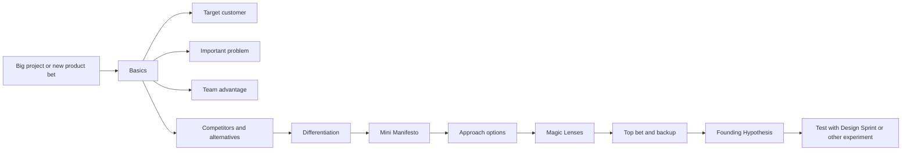
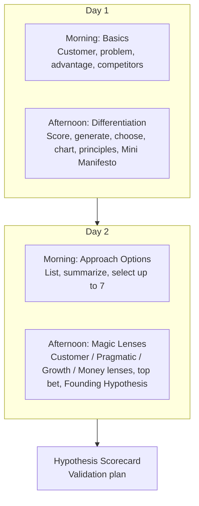
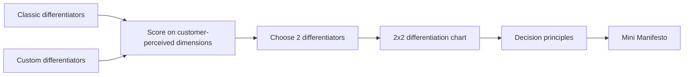
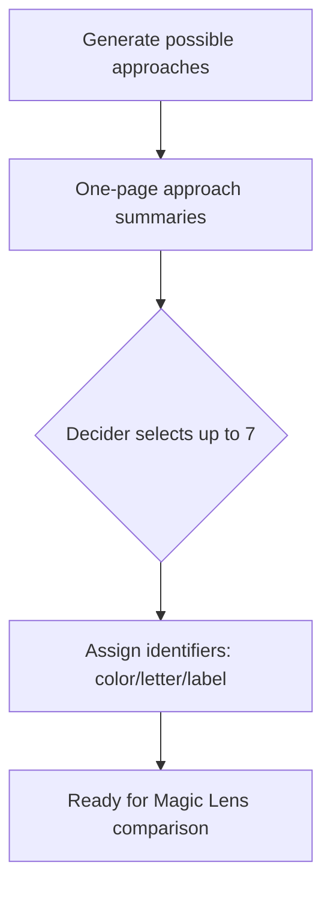
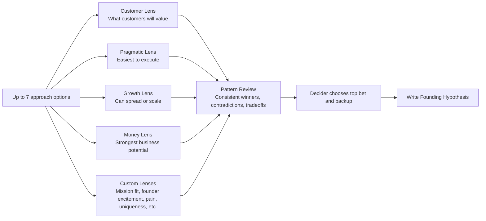
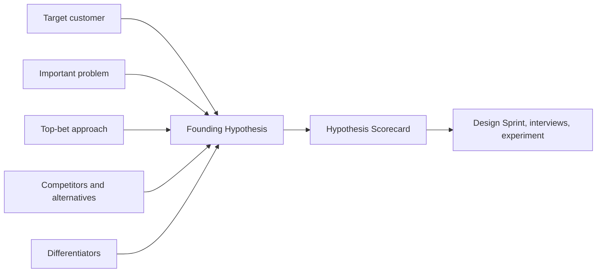
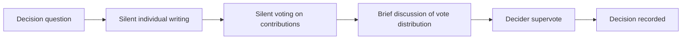
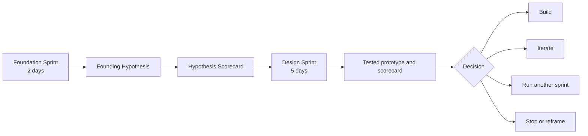
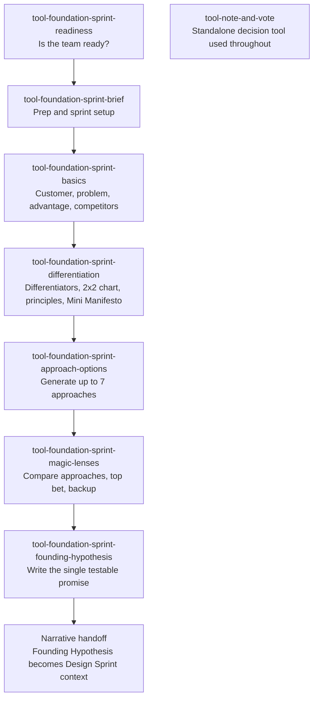

## Executive Summary

A **Foundation Sprint** is a two-day workshop for aligning a small team at the beginning of a big project around six strategic questions: who is the target customer, what important problem are we solving, what advantage does this team have, who are the competitors and alternatives, how will the product differentiate, and which approach should be tested first.

The output is not a strategy deck. The output is a single coherent sentence called the **Founding Hypothesis** that fits the customer, problem, approach, competitors, and differentiators into one testable promise. That hypothesis can then be tested with a Design Sprint, customer research, or a focused experiment.

Foundation Sprint is the strategic-alignment counterpart to Design Sprint. Design Sprint tests a risky idea with a realistic prototype and target customers. Foundation Sprint decides what risky idea is worth testing in the first place. When a team has the resources for a Design Sprint but cannot yet name the hypothesis it would test, a Foundation Sprint is the right tool.

---

## Origins: From Sprint to Foundation Sprint

### Why Jake Knapp and John Zeratsky Built It

The Foundation Sprint was developed by Jake Knapp and John Zeratsky, the two co-authors of the original *Sprint* book, after they left Google Ventures to start Character Capital, an early-stage investment firm. Through Character, they began running Design Sprints with founders of pre-seed and seed-stage startups and noticed a recurring failure mode: teams arrived at the Design Sprint without enough strategic clarity to use the week well.

Design Sprint assumes a team has already chosen the customer, the problem, and the hypothesis worth testing. The five-day method then channels enormous facilitation energy into testing that hypothesis with a prototype. When the inputs are unclear, the prototype tests the wrong thing, the customer interviews produce noisy data, and the Friday scorecard delivers a confident answer to a poorly-chosen question.

Foundation Sprint was designed to be the upstream complement: a faster, lighter workshop whose output is exactly the hypothesis a Design Sprint can then validate.

### Canonical Sources

The most authoritative public materials are:

- **Character Capital's Foundation Sprint guide** at https://www.character.vc/guide/foundation-sprint. The most complete procedural source publicly available.
- **Lenny's Newsletter introduction by Knapp and Zeratsky** at https://www.lennysnewsletter.com/p/introducing-the-foundation-sprint. Strong explanation of why the Founding Hypothesis structure works, with Day 1 walkthrough.
- **Design Sprint Academy's Foundation Sprint explainer** at https://www.designsprint.academy/blog/what-is-the-foundation-sprint. Practitioner framing with enterprise and edge-case considerations.
- **The Click book** by Knapp and Zeratsky at https://www.theclickbook.com/. Book-length canonical method (not all content is on the public web).

The full reference list appears at the end of this document.

---

## The Conceptual Model

The process deliberately moves from customer and problem clarity, to differentiation, to approach selection, to a testable hypothesis. Each block surfaces a decision the team must make explicit before the next block can produce useful output.

### The Core Claim

The value of a Foundation Sprint is not merely alignment. The value is converting fuzzy early-stage product beliefs into a single, testable strategic promise. A team that leaves the workshop with only shared language has improved alignment. A team that leaves with a Founding Hypothesis has a direction it can test.

---

## When to Use a Foundation Sprint

| Use it when | Skip it when |
|---|---|
| Starting a significant new initiative where the wrong starting direction is costly | There is no concrete project, opportunity, or strategic question yet |
| The team has multiple plausible approaches and needs to choose a top bet | The team has zero customer or market knowledge to draw on |
| Different stakeholders describe the customer or problem differently | Deep problem discovery is what's missing; do that first |
| The team cannot clearly state why customers would choose this over alternatives | No Decider is available to make strategic calls |
| Founder or executive beliefs are strong but scattered, not explicit | The hypothesis is already clear; jump straight to a Design Sprint |
| A Design Sprint is on the calendar but the strategic promise to test is not yet named | The decision is minor; use a lighter prioritization tool |

Foundation Sprint depends on the team's existing knowledge. It is not a substitute for customer research, market research, or problem discovery when those are what is actually needed.

---

## The Two-Day Breakdown

### Day 1, Morning: Basics

The morning of Day 1 forces the team to make four foundational choices explicit. Each is something the team probably believes implicitly already, but the workshop demands a single chosen interpretation rather than multiple unstated ones.

1. **Choose a target customer** in plain language. Real people or organizations, not vague segments.
2. **Choose an important customer problem**. A pain strong enough to justify the customer switching, paying, learning, or adopting.
3. **Identify the team's advantage**. The capability, insight, motivation, relationship, data, technology, distribution, or timing edge that makes this team credible.
4. **List competitors and alternatives**. Direct competitors, substitute workflows, manual workarounds, internal tools, and crucially, doing nothing.

Each choice is made through **Note-and-Vote**: independent silent contributions, a silent vote, a brief discussion, and a final Decider supervote. Note-and-Vote appears so often in Foundation Sprint and Design Sprint that Character publishes a separate guide for it.

### Day 1, Afternoon: Differentiation

The afternoon converts the morning's choices into a strategic position the product can occupy.

The team scores how the solution could stand out on standard customer-perceived dimensions (speed, simplicity, price, trust, breadth, depth, and so on), generates custom dimensions specific to its market, then chooses two differentiators worth committing to.

The two chosen differentiators are placed on a customer-perceived 2x2 chart showing where the product could occupy a meaningfully different position from competitors. The team then converts those differentiators into **decision principles**: rules that will guide future product choices ("we will always prefer X over Y").

The result is the **Mini Manifesto**, a one-page strategic artifact summarizing Day 1.

### Day 2, Morning: Approach Options

The morning of Day 2 deliberately defers commitment to a single approach. Teams tend to anchor on the first plausible solution; Foundation Sprint forces them to generate alternatives and compare them. The approach summaries describe what the approach is, why it is a good idea, and include a simple doodle or visual.

### Day 2, Afternoon: Magic Lenses and the Top Bet

The afternoon evaluates each approach through multiple perspectives, called **Magic Lenses**.

Each lens produces a 2x2 chart placing every option relative to the other options on that perspective. Patterns across the charts make tradeoffs visible: an option that wins the Customer Lens but loses the Pragmatic Lens is asking the team to take a feasibility bet; an option that wins on Money but loses on Customer is asking the team to bet that they can shift customer perception over time.

The Decider then chooses a **top bet** and a **backup plan**. The backup matters: without it, invalidation of the top bet sends the team back to ambiguous debate. With it, invalidation triggers a pre-decided next experiment.

---

## The Founding Hypothesis

The Founding Hypothesis is the central artifact of the entire sprint. A practical structure:

> If we help **[target customer]** solve **[important problem]** with **[approach]**, they will choose it over **[competitors or alternatives]** because our solution is **[differentiators]**.

This single sentence forces the team to state customer, problem, approach, competition, and differentiation in one coherent promise.

### What Makes a Good Founding Hypothesis

| Quality | What it means |
|---|---|
| **Specific** | Names a real customer and a real problem; not "users" and "frustrations" |
| **Comparative** | Explains what customers choose today, including doing nothing |
| **Differentiated** | States why this solution should win, not just that it should |
| **Testable** | Can be translated into scorecard questions and experiments |
| **Simple** | A customer can understand the promise quickly |
| **Uncomfortable enough to be useful** | If nobody disagrees or feels exposed, the hypothesis may be too vague |

### The Hypothesis Scorecard

The hypothesis is then decomposed into testable parts:

| Hypothesis element | Test question | Evidence source |
|---|---|---|
| Target customer | Do we have the right customer? | Interviews, usage, sales signals |
| Important problem | Is the problem painful enough? | Interviews, willingness to pay, behavior, support data |
| Approach | Does the chosen approach make sense and feel valuable? | Prototype testing, concept testing, concierge trial |
| Competitors and alternatives | Would customers choose this over what they do now? | Competitive interviews, switching behavior, win/loss data |
| Differentiators | Do the differentiators matter to customers? | Prototype testing, message testing |
| Credibility | Will customers believe the product can deliver the promise? | Sales calls, prototype reactions, brand trust signals |
| Click | Does the whole promise feel simple and compelling? | Design Sprint, landing page test, customer reaction |

Any of these rows can become a Design Sprint question, an interview script, or an experiment design.

---

## Core Mechanics: Note-and-Vote and the Decider

Two protocols recur throughout Foundation Sprint.

### Note-and-Vote

Each decision is made through Note-and-Vote rather than open discussion. The protocol surfaces independent thinking before group dynamics narrow the option space. It also produces a written trail of the decision and its alternatives, which matters when the team revisits the hypothesis later.

### The Decider

The Decider is not symbolic. The Decider has the right to override the team's votes when needed, accepts responsibility for the outcome, and most importantly, makes decisions visible. Without a Decider, the team can vote indefinitely without converging; the workshop produces options instead of bets.

### Team Size and Composition

| Role | Required? | Why |
|---|---|---|
| Decider | Yes | Makes the final strategic calls |
| Facilitator | Yes | Protects pace, process, decision hygiene, and participation |
| Product manager or product lead | Usually | Brings customer, product, and business context |
| Customer expert | Usually | Brings customer understanding from research, sales, success, support |
| Technical expert | Usually | Grounds approaches in feasibility and constraints |
| Design or product strategy lead | Usually | Helps visualize options and shape differentiation |
| Growth or marketing expert | Helpful | Grounds promise, channel, positioning, competitive reality |
| Executive or founder | Often | Useful when strategy or company advantage is being set |

Character recommends no more than five core decision participants. A group with only executives may become abstract; a group with only practitioners may lack strategic authority.

---

## Foundation Sprint Compared to Design Sprint

| Dimension | Foundation Sprint | Design Sprint |
|---|---|---|
| Primary purpose | Choose the strategic promise and approach | Test a risky idea with customers |
| Duration | Two days | Five days |
| Core output | Founding Hypothesis | Tested prototype and scorecard |
| Best timing | Beginning of a big project | After a challenge or hypothesis is clear |
| Main question | What should we believe and test? | Do customers understand, value, and respond to this? |
| Primary evidence | Team knowledge, structured comparison, decision logic | Customer interviews and prototype reactions |
| Main risk | False confidence from weak inputs | Noisy learning from weak prototype or wrong participants |
| Typical next step | Design Sprint, customer research, experiment, or strategy revision | Build, iterate, retest, or stop |

Foundation Sprint is upstream of Design Sprint when the team does not yet know what to test. Design Sprint is downstream when the team has a hypothesis or concept that can be prototyped. They are designed to work together; running a Design Sprint without a strong Foundation Sprint output (whether from a workshop or from existing strategic clarity) is a common failure mode.

---

## Variants and Adaptations

### Startup Foundation Sprint

Startups often have strong founder intuition but inconsistent articulation. The Foundation Sprint forces that intuition into a written, testable form.

- Keep the team extremely small (often three or four people).
- Focus heavily on differentiation and competitors; founder bias toward "we're just better" needs explicit pressure.
- Treat the Founding Hypothesis as a living validation artifact, updated as customer evidence arrives.
- Follow quickly with prototype testing, founder-led sales conversations, or a Design Sprint.

### Enterprise Foundation Sprint

Large organizations distribute customer knowledge, decision authority, technical context, and market insight across many teams.

- Add pre-work to synthesize customer research, support themes, sales objections, usage data, and technical constraints into a single research packet.
- Include cameo experts on specific topics instead of expanding the core team beyond five.
- Identify the real Decider and escalation path before the sprint.
- Document decisions with rationale and confidence so the output survives organizational handoff.
- Translate the Founding Hypothesis into downstream artifacts: PRDs, opportunity solution trees, roadmap bets, Design Sprint questions.

### AI-Era Foundation Sprint

Character argues that as AI makes building faster, deciding what to build becomes more important. Foundation Sprint is especially relevant when teams can rapidly prototype many product options but still need a differentiated strategic promise.

- Use AI to prepare inputs (research synthesis, competitor maps, scorecard drafts), not to replace decisions.
- Use AI to generate alternative approaches, but force human Decider choices.
- Use AI to draft first-pass hypothesis language, then refine through team discussion.
- Use human customer evidence to test whether the promise actually clicks.

---

## Common Failure Modes

| Failure mode | What goes wrong | Mitigation |
|---|---|---|
| Confusing alignment with validation | The team aligns on a hypothesis but treats it as proven | Always end with a Hypothesis Scorecard and validation plan |
| Insufficient customer context | Confident guesses fill knowledge gaps | Do problem discovery first; only run when team has real context |
| Executive dominance | Senior leaders push decisions without practitioner grounding | Cap team at five; include hands-on customer and product experts |
| Vague customer segments | Broad segments produce weak hypotheses | Push for named individuals or buyer types |
| Ignoring "do nothing" as a competitor | Inertia is often the strongest alternative; teams miss it | Explicitly include doing-nothing in competitor maps |
| Choosing undeliverable differentiators | Differentiation is only useful if the team can make it true | Test each chosen differentiator against feasibility and team advantage |
| Falling in love with the top bet | The top bet becomes a strategy rather than the first test candidate | Always pair top bet with backup plan |
| Skipping the backup plan | Invalidation sends the team back to ambiguous debate | Make backup plan a Day 2 PM requirement |
| Hypothesis becomes static strategy copy | The output never drives experiments | Make a Hypothesis Scorecard before declaring the sprint complete |

---

## How Foundation Sprint Connects to pm-skills

The Foundation Sprint framework lands in pm-skills as a `foundation-sprint-skills` family under the `classification: tool` taxonomy, integrated alongside the existing domain, foundation, and utility skills.

### Skill Family Map

The `tool-note-and-vote` skill is a standalone tool used by both Foundation Sprint and Design Sprint at decision moments; it is not a family member of either sprint family. The Foundation-to-Design transition is described narratively in `_workflows/foundation-to-design.md` and in this guide's companion `docs/guides/using-foundation-sprint.md`; there is no separate bridge skill because canonical Knapp/Zeratsky methodology has no formal handoff move.

### Recommended Workflow

The `foundation-sprint` workflow chains these skills into a complete two-day facilitation pass. Run the readiness skill first; if the readiness assessment returns Go, the brief and core skills run in sequence; if Wait or Conditional Go, do the prerequisite work (often problem framing or customer research) and re-assess.

See [docs/guides/using-foundation-sprint.md](../guides/using-foundation-sprint.md) for the operational guide.

---

## Practical Applications

### Pre-Funding Strategic Clarity

Founders use Foundation Sprint before their seed round to articulate the promise an investor needs to evaluate. The Founding Hypothesis becomes the centerpiece of the pitch deck's "what we're building" page.

### Pre-Build Strategic Clarity

PMs use Foundation Sprint at the start of a large initiative to align engineering, design, and go-to-market on the strategic direction before scoping begins. The Mini Manifesto becomes a decision-making reference for the next several months of execution.

### Re-Alignment After Drift

When an initiative has lost coherence (multiple teams pulling in different directions, conflicting roadmap bets, stakeholder confusion), Foundation Sprint surfaces the unstated disagreements and forces choices.

### Pre-Design-Sprint Setup

Teams that have a Design Sprint scheduled but cannot clearly answer "what hypothesis are we testing?" run Foundation Sprint first. The Founding Hypothesis becomes the input to Monday morning of the Design Sprint.

---

## References and Further Reading

### Primary Sources

- Knapp, Jake; Zeratsky, John. *Click: How to Make What People Want* (Simon & Schuster, expected). [theclickbook.com](https://www.theclickbook.com/)
- Character Capital. **"Foundation Sprint guide."** [character.vc/guide/foundation-sprint](https://www.character.vc/guide/foundation-sprint). The most complete public procedural source.
- Knapp, Jake; Zeratsky, John. **"Introducing the Foundation Sprint."** Lenny's Newsletter. [lennysnewsletter.com/p/introducing-the-foundation-sprint](https://www.lennysnewsletter.com/p/introducing-the-foundation-sprint). Strong explanation of the Founding Hypothesis rationale.
- Design Sprint Academy. **"What is the Foundation Sprint?"** [designsprint.academy/blog/what-is-the-foundation-sprint](https://www.designsprint.academy/blog/what-is-the-foundation-sprint). Practitioner framing with enterprise concerns and when-to-use guidance.

### Related Sources

- Character Capital. **"Note and Vote guide."** [character.vc/guide/note-and-vote](https://www.character.vc/guide/note-and-vote). Core decision mechanic used throughout the sprint.
- Character Capital. **"Design Sprint guide."** [character.vc/guide/design-sprint](https://www.character.vc/guide/design-sprint). The downstream validation method.
- Google Ventures. **"The Design Sprint."** [gv.com/sprint](https://www.gv.com/sprint/). Original Sprint method reference.
- Knapp, Jake; Zeratsky, John; Kowitz, Braden. *Sprint: How to Solve Big Problems and Test New Ideas in Just Five Days* (Simon & Schuster, 2016). [thesprintbook.com](https://www.thesprintbook.com/)
- Design Sprint Academy. **"Avoiding pitfalls: making Foundation Sprints work in large organizations."** [designsprint.academy/blog/avoiding-pitfalls-making-foundation-sprints-work-in-large-organizations](https://www.designsprint.academy/blog/avoiding-pitfalls-making-foundation-sprints-work-in-large-organizations)
- Design Sprint Academy. **"Foundation Sprint workshop template."** [designsprint.academy/free-templates/the-foundation-sprint-workshop-template](https://www.designsprint.academy/free-templates/the-foundation-sprint-workshop-template)

### Adjacent Reading (Books)

These books inform the conceptual foundations of Foundation Sprint without being directly canonical to the method. Useful for teams that want deeper background on the underlying ideas.

- Ries, Eric. ***The Lean Startup*** (Crown Business, 2011). Build-Measure-Learn cycle; hypothesis-driven product development. Foundation Sprint produces the testable hypothesis Lean Startup demands at the front end.
- Blank, Steve. ***The Four Steps to the Epiphany*** (K&S Ranch, 2005 / second edition 2013). Customer-development methodology; problem-and-solution-fit framing that the Foundation Sprint Basics step formalizes.
- Maurya, Ash. ***Running Lean*** (O'Reilly, 3rd edition 2022). Lean canvas + customer-development practice. Lean canvas overlaps with Foundation Sprint Basics but is less ritualized.
- Osterwalder, Alexander; Pigneur, Yves. ***Business Model Generation*** (Wiley, 2010). The original BMC; differentiation work in Foundation Sprint borrows from BMC's value-proposition framing.
- Osterwalder, Alexander; Pigneur, Yves; Bernarda, Greg; Smith, Alan. ***Value Proposition Design*** (Wiley, 2014). Customer-jobs + pains + gains analysis adjacent to Foundation Sprint's important-problem framing.
- Torres, Teresa. ***Continuous Discovery Habits*** (Product Talk, 2021). Opportunity-solution tree; ongoing customer interviews. Pairs with Foundation Sprint as the post-FS validation cadence.
- Ulwick, Anthony. ***Jobs to be Done: Theory to Practice*** (Idea Bite Press, 2016). Outcome-driven innovation; the JTBD framing that informs Foundation Sprint target-customer + important-problem work.
- Cagan, Marty. ***Inspired*** (Wiley, 2nd edition 2018). Empowered product teams; provides the team-structure context Foundation Sprint assumes.
- Duke, Annie. ***Thinking in Bets*** (Portfolio, 2018). Decision-making under uncertainty; useful framing for Magic Lenses scoring and Decider supervote work.
- Kahneman, Daniel. ***Thinking, Fast and Slow*** (Farrar, Straus and Giroux, 2011). System 1 vs System 2; explains why structured-deliberation moments (like Magic Lenses) outperform informal team discussion.
- Knapp, Jake; Zeratsky, John. ***Make Time*** (Currency, 2018). The authors' productivity book; useful background on the design-and-decision rhythm that informs Foundation Sprint's two-day discipline.

### Adjacent Reading (Articles + Talks)

- Brown, Tim. **"Design Thinking."** *Harvard Business Review* (June 2008). [hbr.org/2008/06/design-thinking](https://hbr.org/2008/06/design-thinking). The HBR article that popularized "design thinking" as an executive concept; useful context for explaining Foundation Sprint to design-thinking-familiar stakeholders.
- Knapp, Jake. Medium archive at [medium.com/@jakek](https://medium.com/@jakek). Various essays on sprint methodology, design facilitation, and the Foundation Sprint origin story.
- Zeratsky, John. Personal blog at [johnzeratsky.com](https://johnzeratsky.com/). Posts on the GV-to-Character transition and the rationale for the Foundation Sprint.
- Reforge. **"How to validate a startup idea."** Various authors. [reforge.com](https://www.reforge.com/). Adjacent to Foundation Sprint's purpose; longer-cycle versions of the same validation question.
- Silicon Valley Product Group (SVPG). **Product discovery articles** by Marty Cagan and team. [svpg.com](https://www.svpg.com/). Discovery-focused product practice; Foundation Sprint is one structured tactic within the broader discovery toolkit.
- Center for Innovation at Mayo Clinic (Maggie Breslin, Christopher Murray, et al.). **Service design and prototyping work**; useful for teams running Foundation Sprint in healthcare or other regulated contexts.

### Related pm-skills Concepts

- [The Triple Diamond Delivery Process](triple-diamond-delivery-process.md) - the framework organizing pm-skills' domain, foundation, and utility skills
- [Design Sprint](design-sprint.md) - the downstream method that tests the Founding Hypothesis
- [Agent Skill Anatomy](agent-skill-anatomy.md) - the structural pattern every pm-skill follows, including the `tool-foundation-sprint-*` family

### Related pm-skills Adjacent Methods (in this repo)

The following pm-skills cover adjacent practices that compose with or substitute for parts of Foundation Sprint:

- **[`foundation-lean-canvas`](../skills/foundation-lean-canvas/SKILL.md)** - Ash Maurya's lean canvas. Less ritualized than Foundation Sprint Basics but covers similar territory in 60-90 min.
- **[`foundation-persona`](../skills/foundation-persona/SKILL.md)** - canonical persona template. Composes with Foundation Sprint Basics target-customer work; can be used as input.
- **[`foundation-okr-writer`](../skills/foundation-okr-writer/SKILL.md)** - outcome-based OKRs. The Founding Hypothesis is an upstream artifact OKRs flow from at the start of a cycle.
- **[`define-jtbd-canvas`](../skills/define-jtbd-canvas/SKILL.md)** - JTBD canvas. Adjacent framing for important-problem work.
- **[`define-hypothesis`](../skills/define-hypothesis/SKILL.md)** - lightweight hypothesis definition. The Founding Hypothesis is a heavier-weight ritualized version; this skill is the smaller-cycle counterpart.
- **[`develop-spike-summary`](../skills/develop-spike-summary/SKILL.md)** - tech spike output. Useful when Foundation Sprint's recommended next test is a technical-feasibility investigation rather than a Design Sprint.

---

*Part of [PM-Skills](https://github.com/product-on-purpose/pm-skills) - Open source Product Management skills for AI agents.*
