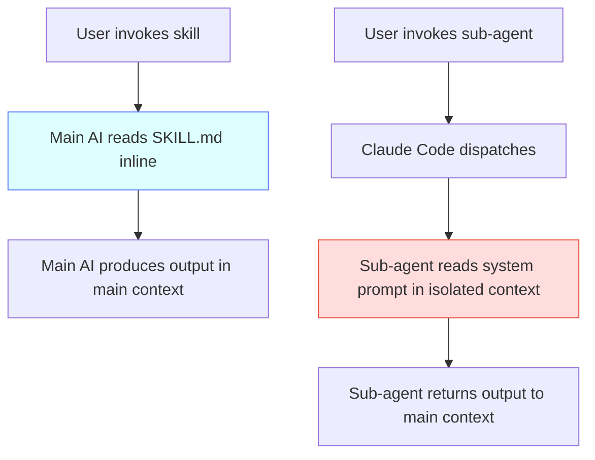
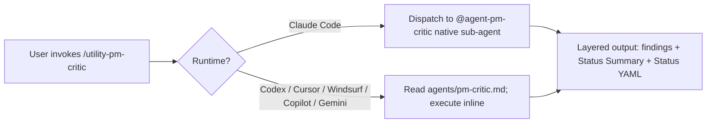

## Table of Contents

- [What a Sub-Agent Is](#what-a-sub-agent-is)
- [Sub-Agents vs Skills](#sub-agents-vs-skills)
- [The v2.16.0 Slate](#the-v2160-slate)
- [Composition Patterns](#composition-patterns)
- [Cross-Client Compatibility](#cross-client-compatibility)
- [When to Use a Sub-Agent vs a Skill](#when-to-use-a-sub-agent-vs-a-skill)

## What a Sub-Agent Is

A sub-agent is a Claude Code plugin component that:

1. Lives as a markdown file with YAML frontmatter in the plugin's `agents/` directory (`agents/{name}.md` in pm-skills, auto-discovered by Claude Code at the fixed `agents/` path)
2. Has a `description:` field that Claude Code's intent classifier matches on when delegating work
3. Runs in its OWN context window with its OWN tool budget when invoked
4. Returns its output to the parent context (the main conversation, or another sub-agent if chained)

The defining property: a sub-agent isolates execution. Where a skill is content the main AI reads and acts on inline, a sub-agent is a separate AI invocation with a separate context. This isolation is what makes sub-agents useful for adversarial framing (the critic sees only the artifact, not your prior context) and for token-budget separation (the conductor's 30-minute release flow doesn't pollute the main conversation).

## Sub-Agents vs Skills

| Dimension | Skill | Sub-agent |
|---|---|---|
| **Where it lives** | `skills/{name}/SKILL.md` | `agents/{name}.md` |
| **What it is** | Reference content the AI reads inline | Separate AI invocation in isolated context |
| **How it activates** | User invokes via `/skill-name`; AI reads SKILL.md as in-context guidance | Claude Code's intent classifier matches description; OR explicit `/command-name` invocation; OR `@agent-{name}` mention |
| **Context isolation** | None (runs in main context) | Isolated context window; isolated tool budget |
| **Tool surface** | Inherits from main AI's tools | Declared per-agent in frontmatter |
| **Output** | Inline in main conversation | Returned from isolated context to main |
| **Cross-client portability** | YES (per agentskills.io spec) | Claude Code plugin feature; dispatch skills bridge cross-client |
| **Best for** | Producing artifacts with PM framing | Adversarial review; governance audit; chained workflows |

The right mental model: a skill is **content the AI consumes**; a sub-agent is **a different AI you can dispatch to**.

## The v2.16.0 Slate

v2.16.0 introduces four sub-agents as the new component class:

| Sub-agent | Mission | Audience | Trigger |
|---|---|---|---|
| `pm-critic` | Adversarial review of PM artifacts (PRDs, OKRs, personas, etc.). Finds weaknesses, not wins. | User (PM authoring artifacts) | **Proactive** (auto-fires after PM-artifact-producing skills) + explicit `utility-pm-critic` |
| `pm-skill-auditor` | Repo-level cross-cutting governance: validators + cross-cutting checks + counter audit | User + Maintainer | Explicit `utility-pm-skill-auditor` only |
| `pm-changelog-curator` | Draft CHANGELOG entries from git log applying CLAUDE.md hygiene rules | Maintainer | Explicit `utility-pm-changelog-curator` or chained from conductor |
| `pm-release-conductor` | Walk the 6-gate release runbook with chain composition to auditor + curator | Maintainer | Explicit `utility-pm-release-conductor v{X.Y.Z}` only |

All four ship dispatch skills at `skills/utility-pm-{role}/` for non-Claude clients. The dispatch mechanism + conductor's "reference + execute inline" chain composition were validated on Codex CLI 0.128.0 on 2026-05-17. Additional clients (Cursor, Windsurf, Copilot, Gemini CLI) are untested but expected to work. See [Sub-Agent Compatibility Matrix](../reference/sub-agent-compatibility.md) for the canonical per-sub-agent status, safe-usage guidance, and v2.17 expansion plan.

## Composition Patterns

Sub-agents compose in 4 patterns documented in [`docs/contributing/sub-agent-design-patterns.md`](../contributing/sub-agent-design-patterns.md):

1. **Skill -> Sub-agent (proactive review loop):** `pm-critic` auto-fires after `/deliver-prd`, returns findings, user revises with `/deliver-prd` again, critic re-reviews
2. **Slash command -> Sub-agent (explicit invocation):** `utility-pm-critic`, `utility-pm-skill-auditor`, `utility-pm-changelog-curator`, `utility-pm-release-conductor` invoke their paired sub-agent
3. **Sub-agent -> Sub-agent (chain composition, 2 levels max):** `pm-release-conductor` chains to `pm-skill-auditor` at G0 + G2.5 and `pm-changelog-curator` at G2
4. **Dispatch skill -> Sub-agent or inline (cross-client):** dispatch skill detects runtime; invokes native sub-agent on Claude Code or executes inline on other clients

The chain-depth-2 limit (per master plan D14) is enforced via `agents/_chain-permitted.yaml` which lists only the conductor. Auditor + curator system prompts do not include the Agent tool, so they cannot chain further. This caps chain depth at 2 structurally.

## Cross-Client Compatibility

Sub-agents are a Claude Code plugin feature. Other AI clients (Codex CLI, Cursor, Windsurf, Copilot, Gemini CLI) cannot natively load `agents/{name}.md` files.

Per master plan D11 (amended) + D30, pm-skills delivers sub-agent intent to non-Claude clients via **dispatch skills** at `skills/utility-pm-{role}/`. The dispatch skill detects runtime:

- **Claude Code path:** invokes the native sub-agent via `@agent-pm-{role}` syntax
- **Non-Claude path:** reads `agents/pm-{role}.md` and executes the system prompt inline

This pattern is portable per the agentskills.io specification. The single-tool user assumption (D30) means a user typically picks ONE primary AI client; pm-skills delivers full functionality to that client.

See [`docs/reference/runtime-components.md`](../reference/runtime-components.md) section "Cross-Client Compatibility" for the full mechanism. The per-sub-agent cross-client status (which is PRODUCTION on which client; what's EXPERIMENTAL) lives in the [Sub-Agent Compatibility Matrix](../reference/sub-agent-compatibility.md).

## When to Use a Sub-Agent vs a Skill

**Use a skill when:**

- You are producing a PM artifact (PRD, OKR set, persona, recap, etc.). Skills are the authoring layer.
- You want cross-client portability for the artifact-production behavior. Skills are portable; sub-agents are Claude Code native.
- You want the output in the main conversation context for further iteration.

**Use a sub-agent when:**

- You want adversarial framing (the reviewer should NOT see the author's prior context). `pm-critic` is the canonical case.
- You are running a workflow with strict gates and confirmation pauses. `pm-release-conductor` is the canonical case.
- You want chain composition: a parent flow that orchestrates child flows in isolated contexts.
- You want token-budget separation: a long-running flow that shouldn't pollute the main conversation context.

**Use BOTH (the canonical loop):**

- Skill produces artifact -> sub-agent reviews adversarially -> user revises with skill again -> sub-agent re-reviews. The skill is the author; the sub-agent is the reviewer. Both exist; both have distinct roles.

## Related Documentation

- Runtime components catalog: [`docs/reference/runtime-components.md`](../reference/runtime-components.md)
- Using sub-agents (user-facing guide): [`docs/guides/using-sub-agents.md`](../guides/using-sub-agents.md)
- Authoring sub-agents (contributor guide): [`docs/contributing/authoring-sub-agents.md`](../contributing/authoring-sub-agents.md)
- Sub-agent design patterns (contributor guide): [`docs/contributing/sub-agent-design-patterns.md`](../contributing/sub-agent-design-patterns.md)
- Adversarial review with pm-critic: [`docs/guides/adversarial-review.md`](../guides/adversarial-review.md)
- Release runbook for pm-release-conductor: [`docs/contributing/release-runbook.md`](../contributing/release-runbook.md)
- Active orchestration concept: [`docs/concepts/active-orchestration.md`](./active-orchestration.md)
