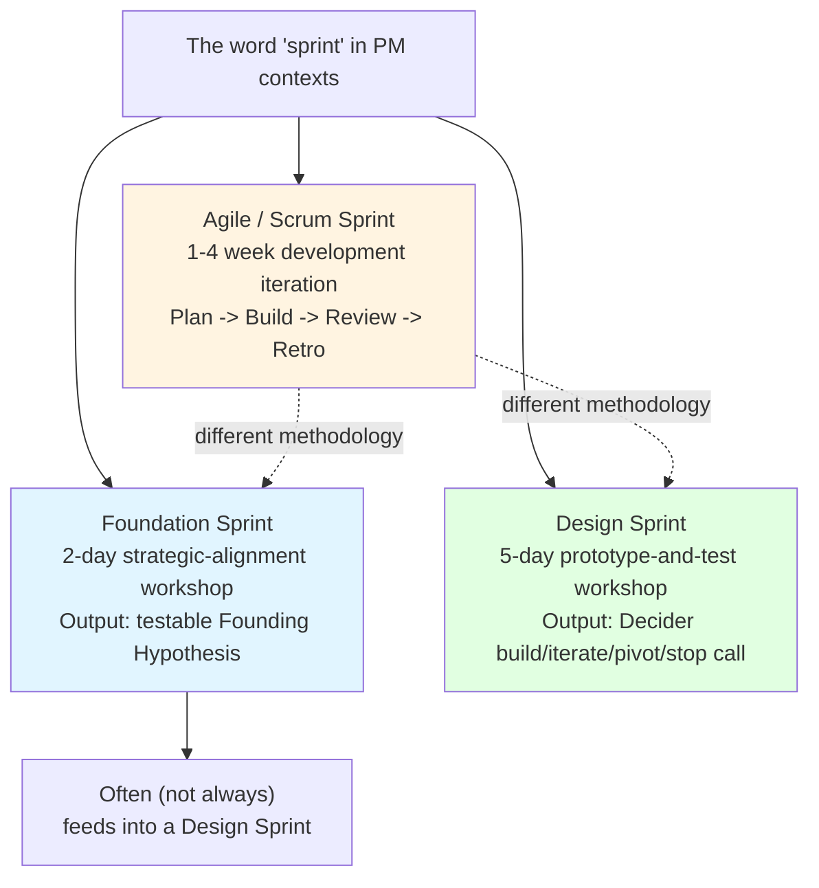
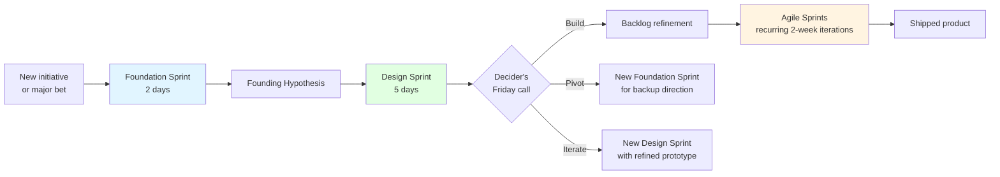

## Why this page exists

If you work in product management, the word "sprint" probably triggers an agile / Scrum mental model first: a 1-4 week development iteration with planning, stand-ups, review, and retrospective. That's not what Foundation Sprint or Design Sprint mean.

This page sits at the top of the v2.15.0 documentation so that readers arriving with the agile-sprint frame can disambiguate before reading the Foundation Sprint or Design Sprint user guides, concept docs, or skills. The pm-skills repo uses both terms (agile sprint planning lives in `_workflows/sprint-planning.md`; the Foundation Sprint and Design Sprint families live in `skills/tool-foundation-sprint-*/` and `skills/tool-design-sprint-*/`), so the disambiguation has practical stakes.

## Three different things, same word

The three methodologies share the word "sprint" because each emphasizes time-boxed focused work. They differ on every other dimension: purpose, output, participants, cadence, and what counts as success.

## Side-by-side comparison

| Dimension | Agile / Scrum Sprint | Foundation Sprint | Design Sprint |
|---|---|---|---|
| **Author / origin** | Schwaber + Sutherland (1990s); codified in the Scrum Guide | Knapp + Zeratsky (2023+; Character Capital) | Knapp + Zeratsky + Kowitz (2010 at GV; published in *Sprint* 2016) |
| **Purpose** | Deliver shippable software increments | Choose a testable strategic direction | Test a risky idea with a realistic prototype + target customers |
| **Output** | Working software increment + retrospective learnings | Founding Hypothesis sentence + assumption scorecard + recommended next test | Friday scorecard + Decider's build / iterate / pivot / stop call + named next artifact |
| **Duration** | 1-4 weeks (typically 2; fixed cadence) | 2 days (Day 1 + Day 2; one-time per initiative) | 5 days (Mon-Fri; one-time per challenge) |
| **Cadence** | Recurring (every 1-4 weeks indefinitely) | One-time at the start of a big initiative | One-time per challenge; runs when needed |
| **Team size** | Whole Scrum team (typically 5-9) | 3-5 people including a Decider | 4-7 people including a Decider |
| **Customer involvement** | None mandatory during sprint; possibly demo at review | Existing customer knowledge as input; no new customer contact during the 2 days | 5 target customers in Friday testing (canonical Nielsen N=5) |
| **Decision authority** | Product Owner prioritizes backlog; team self-organizes execution | Decider makes strategic calls at note-and-vote moments | Decider makes target-moment selection, supervote, build/iterate/pivot/stop call |
| **Prototype required?** | No (working software, not throwaway prototype) | No (strategic artifact only) | Yes (one-day Thursday build; throwaway by design) |
| **Roles** | Product Owner, Scrum Master, Developers | Facilitator, Decider, PM, design, engineering, customer expert | Facilitator, Decider, 5 canonical Sprint book roles (Maker, Stitcher, Writer, Asset Collector, Interviewer) |
| **What counts as success** | Sprint goal met; increment shipped; team velocity sustainable | Single Founding Hypothesis ratified; testable next step named with owner + date | Sprint question validated or invalidated 4-of-5; Decider call by 17:30 Friday |
| **What it does NOT produce** | Strategic direction; user research; prototype validation | Working software; new customer evidence; build plan | Shippable software; ongoing cadence; team velocity metric |

## When you'd use each (and how they coexist)

These methodologies are complementary, not competitive. A product organization can run all three.

**Foundation Sprint** runs ONCE at the start of a significant new initiative when the strategic direction is unclear. Output (Founding Hypothesis) is consumed by a downstream test, often a Design Sprint but sometimes customer research or a focused experiment.

**Design Sprint** runs ONCE per challenge when a specific risky assumption needs validation before committing to build. Output (Decider call) flows into the team's normal delivery process - typically agile / Scrum sprints.

**Agile / Scrum sprints** are the recurring delivery cadence. They run continuously throughout the product's life. The Decider's "Build" call from a Design Sprint typically becomes the next 1-3 agile sprints' worth of work.

A common end-to-end arc:

Foundation Sprint and Design Sprint are NOT replacements for agile delivery. They are upstream workshops that produce decisions agile delivery acts on.

## Why both Knapp methodologies use the word "sprint"

Knapp chose "sprint" for the original Design Sprint in 2010 to evoke speed and focus, before the Scrum term had reached its current ubiquity in the software industry. By the time the *Sprint* book published in 2016, the agile-sprint convention was dominant, but the Design Sprint name was already established and the *Sprint* book title was committed.

The Foundation Sprint, developed at Character Capital after Knapp and Zeratsky left GV, deliberately kept the "sprint" naming for branding continuity with the original Sprint book and the Design Sprint methodology. The shared word signals "this is part of the Knapp/Zeratsky workshop family", not "this is similar to agile/Scrum".

Practitioners in the Knapp/Character/AJ and Smart community sometimes use **"workshop sprint"** as the qualified term when distinguishing from agile sprints. pm-skills documentation uses the explicit method names (**Foundation Sprint**, **Design Sprint**) by default and reserves **agile sprint** or **Scrum sprint** for the iteration-cycle meaning.

## Naming discipline in pm-skills documentation

The pm-skills repo follows a deliberate naming discipline codified in both family contracts:

> When writing about Foundation Sprint or Design Sprint in pm-skills documentation, always include the full method name on first reference per document. Prefer qualified terms ("the Foundation Sprint week", "your Design Sprint output") over bare "sprint" thereafter. Reserve bare "sprint" for agile / Scrum iteration context only, with explicit "(agile)" or "(Scrum)" qualifier if both methodologies could be confused in the surrounding context.

If you find a pm-skills doc that uses bare "sprint" ambiguously, that is a doc bug worth flagging.

## Related pm-skills resources

- [Foundation Sprint concept doc](foundation-sprint.md) - the FS methodology in depth
- [Design Sprint concept doc](design-sprint.md) - the DS methodology in depth
- [Sprint Methodology Glossary](../reference/sprint-methodology-glossary.md) - cross-method terminology (Decider, Note-and-Vote, etc.)
- [Workshop Method Comparison Matrix](../reference/workshop-method-comparison.md) - comparison across FS, DS, agile sprint planning, Lean Canvas, JTBD, etc.
- [Using Foundation Sprint guide](../guides/using-foundation-sprint.md) - operational walkthrough
- [Using Design Sprint guide](../guides/using-design-sprint.md) - operational walkthrough
- [`_workflows/sprint-planning.md`](../../_workflows/sprint-planning.md) - the pm-skills workflow for agile / Scrum sprint planning meetings (different methodology from this page's subject)

## Canonical sources for further reading

**Agile / Scrum sprint:**
- Schwaber, K.; Sutherland, J. **The Scrum Guide.** [scrumguides.org](https://scrumguides.org/). Canonical Scrum reference.

**Foundation Sprint:**
- Knapp, J.; Zeratsky, J. ***Click: How to Make What People Want***. Simon and Schuster (2024). [theclickbook.com](https://www.theclickbook.com/)
- Character Capital. **"Foundation Sprint guide."** [character.vc/guide/foundation-sprint](https://www.character.vc/guide/foundation-sprint)

**Design Sprint:**
- Knapp, J.; Zeratsky, J.; Kowitz, B. ***Sprint: How to Solve Big Problems and Test New Ideas in Just Five Days***. Simon and Schuster (2016). [thesprintbook.com](https://www.thesprintbook.com/)
- GV. **"The Design Sprint."** [gv.com/sprint](https://www.gv.com/sprint/)

---

*Part of [PM-Skills](https://github.com/product-on-purpose/pm-skills) - Open source Product Management skills for AI agents.*
