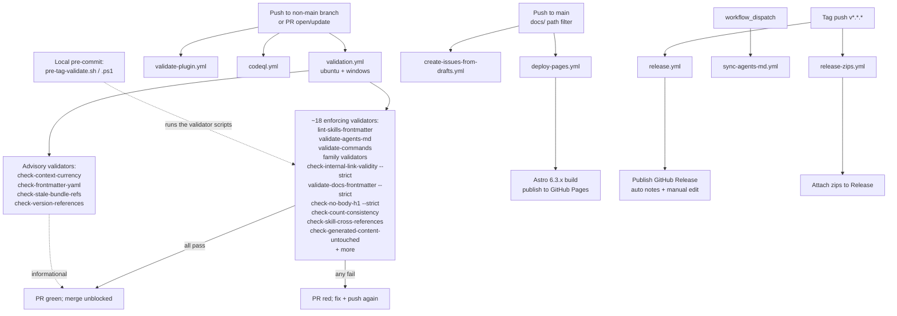

This document maps every GitHub Actions workflow + every validator script in pm-skills + how they fit together. Use it when:

- You're a contributor wanting to understand what CI will check before you open a PR
- You're a maintainer auditing why a check fired (or didn't fire)
- You're authoring a new validator and want to know where to wire it
- You're triaging a CI failure and want to know which workflow file owns which check

## Three Layers of CI in pm-skills

pm-skills CI has three layers:

1. **Local pre-commit / pre-push** (developer machine; optional). Run via individual script invocation or the `scripts/pre-tag-validate.{sh,ps1}` orchestration bundle.
2. **GitHub Actions on PR** (automatic; every push to a non-default branch + every PR open/update). The 8 workflow files in [.github/workflows/](../../.github/workflows/).
3. **GitHub Actions on main + tag** (automatic on push to main + tag push). Same workflow definitions; some have additional triggers like `release: created` for the doc-deploy + release-zips paths.

Most validators that fail in layer 2 would have caught the issue in layer 1 if run locally. Maintainers are encouraged to run `pre-tag-validate` before every release-prep commit.

The diagram shows the trigger -> workflow -> validator -> outcome flow. The dotted arrow from `pre-tag-validate` to the enforcing validators indicates the local-machine equivalent: running the bundle locally exercises the same validator scripts the CI runner runs. The bundle does NOT run the Astro build (`deploy-pages.yml`), plugin-install validation (`validate-plugin.yml`), edit-link verification, or cross-doc reference checks, so a green local bundle is a strong - but not complete - predictor of a green PR check.

## GitHub Actions Workflows

All 8 workflow files in `.github/workflows/`:

| Workflow | Trigger | What It Does |
|---|---|---|
| `validation.yml` | Push to any branch + PR open/update | Runs the full enforcing validator suite on ubuntu-latest + windows-latest. This is the primary CI gate. |
| `validate-plugin.yml` | Push + PR + workflow_dispatch | Validates the plugin manifest at `.claude-plugin/plugin.json` + the marketplace manifest at `.claude-plugin/marketplace.json` + commands + skill structure. |
| `sync-agents-md.yml` | Workflow_dispatch only | Manual maintainer trigger to regenerate AGENTS.md from skill directory state. Hardened with two-layer defense (apply:true input gate + contents:read token gate). |
| `codeql.yml` | Push + PR + schedule | CodeQL static analysis for security + code quality. |
| `create-issues-from-drafts.yml` | Push to main (issue-draft path filter) + workflow_dispatch | Auto-creates GitHub issues from `docs/internal/issue-drafts/` when they merge to main. |
| `release.yml` | Tag push (`v*.*.*` pattern) + workflow_dispatch | Publishes the GitHub Release with auto-generated notes (maintainer edits the body post-tag for full notes). |
| `release-zips.yml` | Tag push (`v*.*.*` pattern) | Builds the release zip artifacts and attaches them to the GitHub Release. |
| `deploy-pages.yml` | Push to main (docs path filter) + workflow_dispatch | Builds the Astro 6 + Starlight 0.39.x doc site and deploys to GitHub Pages at https://product-on-purpose.github.io/pm-skills/. |

### Which Workflow Runs Which Validators

The `validation.yml` workflow contains the lion's share of validator script invocations (~56 across both ubuntu + windows jobs). The `validate-plugin.yml` workflow contains ~12 plugin-specific script invocations. Together they cover the full enforcing surface.

`codeql.yml`, `deploy-pages.yml`, `release.yml`, and `release-zips.yml` do not invoke pm-skills validators - they do specialized jobs (security scanning, doc-site build, release publishing).

## Validator Catalog

Validators live in `scripts/`. Most have three sibling files: `{name}.sh` (POSIX bash), `{name}.ps1` (PowerShell), and `{name}.md` (documentation). This is the canonical `.sh + .ps1 + .md` convention.

### Enforcing Validators (truly block CI on failure)

These run in `validation.yml` and fail the build if they exit non-zero.

| Validator | What It Catches |
|---|---|
| `lint-skills-frontmatter` | Skill YAML frontmatter consistency (name, classification, version, license, metadata, phase when applicable) |
| `validate-agents-md` | AGENTS.md skill paths + sub-agent names in sync with `skills/` and `agents/` directories (extended in v2.16 to recognize sub-agent directory) |
| `validate-commands` | Each command file under `commands/` references a valid `skills/*/SKILL.md` path |
| `validate-meeting-skills-family` | Meeting Skills Family contract enforcement (5 members; v2.11.0) |
| `validate-foundation-sprint-skills-family --strict` | Foundation Sprint Family contract enforcement (7 members; v2.15.0) |
| `validate-design-sprint-skills-family --strict` | Design Sprint Family contract enforcement (7 members; v2.15.0) |
| `check-internal-link-validity --strict` | All internal markdown links resolve to actual files, and same-page `#anchor` links resolve to real GitHub-style heading slugs; fileset covers `docs/` plus root `README.md` + `AGENTS.md` (anchor resolution + root fileset added v2.19.0) |
| `validate-docs-frontmatter --strict` | Astro Starlight frontmatter shape on all docs in `docs/` |
| `check-no-body-h1 --strict` | No body H1 duplications (Starlight derives H1 from `title` frontmatter; body H1 would duplicate) |
| `check-count-consistency` | Skill/command/workflow counts in tracked .md, .mdx, and .json match filesystem state, including the `badge/skills-<N>` shields-badge form (.mdx + badge added v2.19.0) |
| `check-skill-cross-references` | Backtick skill-name references in `skills/*/SKILL.md` resolve to a real `skills/*/` directory; intentional forward-refs are allowlisted (v2.19.0) |
| `check-generated-content-untouched` | Generated landing pages match the output of `scripts/generate-skill-pages.py` (no hand-edit drift) |
| `check-landing-page-counts --strict` | Landing-page total count claims (`docs/index.mdx`, `docs/skills/index.md`, etc.) match filesystem state |
| `check-workflow-generator-coverage` | Every workflow source has both an individual page and an index-table row |
| `check-agents-md-command-sync` | AGENTS.md command table is in sync with `commands/` directory |
| `validate-script-docs` | Every `scripts/*.sh` + `*.ps1` pair has a companion `*.md` doc (promoted to enforcing v2.19.0, FU-8) |

### Advisory Validators (informational; do not block)

| Validator | What It Surfaces |
|---|---|
| `check-mcp-impact` | Detects pm-skills changes that may require pm-skills-mcp companion updates (M-22 maintenance-mode posture; never blocking) |
| `check-context-currency` | Context-staleness detector for internal notes |
| `check-frontmatter-yaml` | YAML parse validity in frontmatter (sibling to lint-skills-frontmatter; finer-grained on YAML errors) |
| `check-generated-freshness` | Generation-timestamp recency check |
| `check-stale-bundle-refs` | References to removed bundle paths |
| `check-version-references` | Version-string consistency across docs |
| `check-workflow-coverage` | Older variant of workflow-generator-coverage; complementary checks |
| `check-em-dashes` | Em-dash + en-dash sweep (CLAUDE.md hard rule enforcement) |

### Orchestration Bundles

| Bundle | What It Runs |
|---|---|
| `pre-tag-validate.{sh,ps1}` | The full enforcing validator suite + a configurable advisory bundle. Recommended before any release-prep commit. |
| `embed-skills.js` (in pm-skills-mcp) | Companion script in the pm-skills-mcp repo; reads pm-skills `skills/` directory and embeds skill metadata into the MCP server. NOT a validator but mentioned here because it consumes pm-skills validator output indirectly. |

## How to Trigger Each Workflow Locally

| Workflow | Local Equivalent |
|---|---|
| `validation.yml` | `bash scripts/pre-tag-validate.sh` (or `.ps1` on Windows) |
| `validate-plugin.yml` | `bash scripts/validate-plugin.sh` if present, else individually invoke `validate-commands.sh` + frontmatter checks |
| `codeql.yml` | Run CodeQL CLI locally per [CodeQL docs](https://codeql.github.com/docs/) |
| `deploy-pages.yml` | `npm run build` (Astro production build) |
| Others | Manually inspect the workflow_dispatch trigger inputs; some have no local equivalent |

**Windows local-run notes:**

- **Node on PATH.** In Git Bash on Windows, Node is not always on `PATH`. If `npm run build` or the node-based checks (`verify-edit-links.mjs`, `post-build-strip-md-links.mjs`) fail with `node: command not found`, prepend Node for the session: `export PATH="/c/nvm4w/nodejs:$PATH"` (Node 22.12+). The bash validator scripts do not need Node; only the build + edit-link steps do.
- **Line endings.** `.gitattributes` (added v2.19.0) pins `*.sh` to LF so Git Bash runs them without CRLF false-reds, regardless of your `core.autocrlf` setting. `*.ps1` is checked out as CRLF; `*.mjs`/`*.js`/`*.json` as LF.

## How to Add a New Validator

When adding a new validator script:

1. Create the script trio: `scripts/{name}.sh` + `scripts/{name}.ps1` + `scripts/{name}.md`. The `.md` documents what the validator catches, how to run it, and the failure-mode examples.
2. Wire it into `validation.yml` (or `validate-plugin.yml` if plugin-specific). Add it to BOTH the ubuntu-latest job and the windows-latest job.
3. Wire it into `scripts/pre-tag-validate.{sh,ps1}` if it should be part of the enforcing pre-release suite.
4. Update this document's validator catalog (the relevant section above) with the new entry.
5. Add a test case to `docs/internal/release-plans/v{next-version}/testing-summary_v{next-version}.md` if it would be useful to include in the next release's testing investment record.

## CI Failure Triage Pointers

| Failure Symptom | First Place to Look |
|---|---|
| validation.yml red, ubuntu-latest only | Linux-specific shell-script issue (e.g., bash version, line ending) |
| validation.yml red, windows-latest only | PowerShell-specific issue (e.g., encoding, CRLF parsing, `-p` flag) |
| validate-plugin.yml red | Plugin manifest schema; check `.claude-plugin/plugin.json` validity + commands paths |
| `check-internal-link-validity --strict` red | Search for the dangling link in the diff; usually a missed reference rewrite |
| `validate-docs-frontmatter --strict` red | Astro Starlight schema requires `title:` + ASCII colons in description; check the offending doc |
| `check-no-body-h1 --strict` red | A body `# Header` line exists; remove or convert to `##` |
| `check-generated-content-untouched` red | Hand-edit drift in `docs/skills/*/index.md`; run `python scripts/generate-skill-pages.py` + commit the regenerated output |
| `check-count-consistency` red | A skill/command/workflow count claim in tracked .md is out of date; search for the stale number and update |

## Reference Links

- All workflow files: [`.github/workflows/`](../../.github/workflows/)
- All validator scripts: [`scripts/`](../../scripts/)
- Pre-tag validator bundle: [`scripts/pre-tag-validate.sh`](../../scripts/pre-tag-validate.sh) + [`.ps1`](../../scripts/pre-tag-validate.ps1)
- v2.16.0 test summary (concrete example of all validators in action): [`docs/internal/release-plans/v2.16.0/testing-summary_v2.16.0.md`](../internal/release-plans/v2.16.0/testing-summary_v2.16.0.md)
- Authoring sub-agents (relevant for sub-agent-specific validators in v2.17): [`docs/contributing/authoring-sub-agents.md`](./authoring-sub-agents.md)

## Versioning

| Doc version | Date | Change |
|---|---|---|
| 1.0.0 | 2026-05-17 | Initial publication; consolidates the CI workflow + validator catalog that was previously scattered across `validation.yml` comments, individual `scripts/*.md` files, and release-plan testing summaries. |
