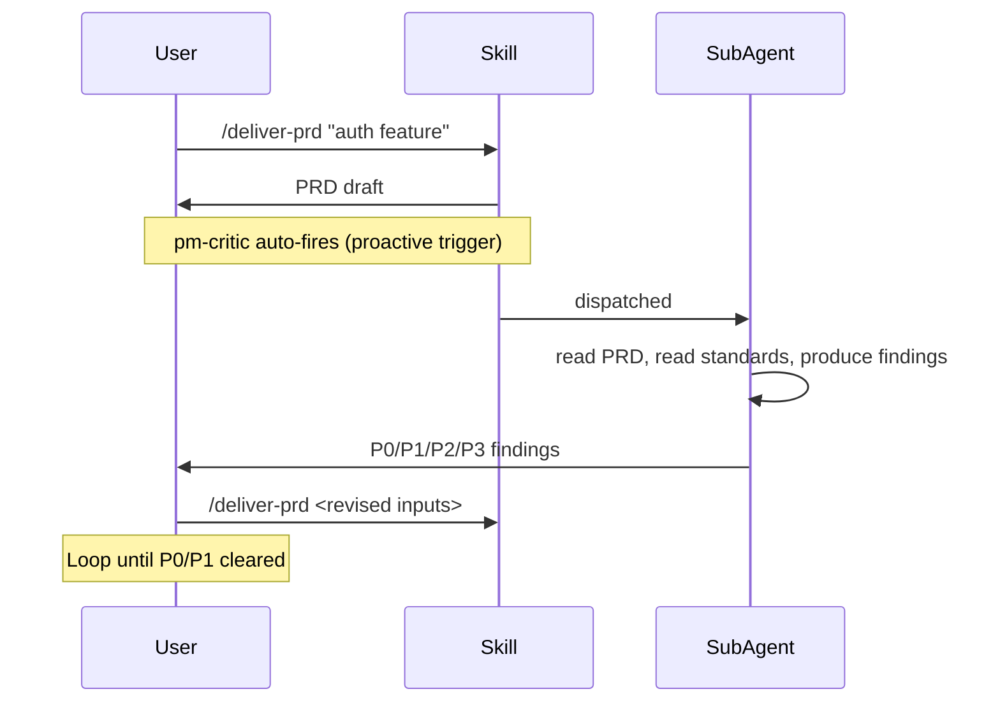
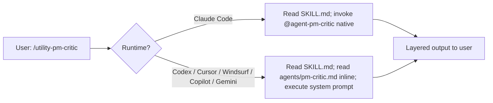
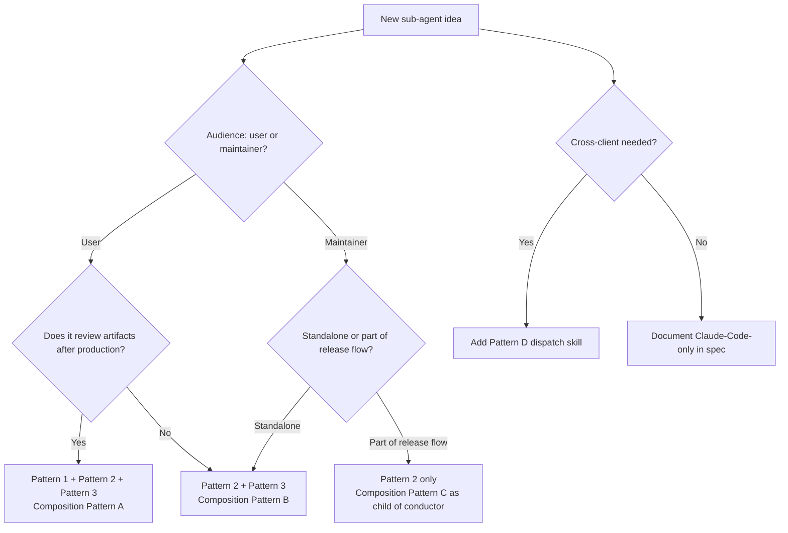

## Table of Contents

- [Invocation Patterns](#invocation-patterns)
  - [Pattern 1: Proactive Auto-Delegation](#pattern-1-proactive-auto-delegation)
  - [Pattern 2: Explicit Slash Command](#pattern-2-explicit-slash-command)
  - [Pattern 3: @-Mention](#pattern-3-mention)
  - [Pattern 4: Workflow-Triggered (Future)](#pattern-4-workflow-triggered-future)
- [Composition Patterns](#composition-patterns)
  - [Pattern A: Skill -> Sub-Agent (Review Loop)](#pattern-a-skill---sub-agent-review-loop)
  - [Pattern B: Slash Command -> Sub-Agent (Explicit)](#pattern-b-slash-command---sub-agent-explicit)
  - [Pattern C: Sub-Agent -> Sub-Agent (Chain)](#pattern-c-sub-agent---sub-agent-chain)
  - [Pattern D: Dispatch Skill -> Native or Inline (Cross-Client)](#pattern-d-dispatch-skill---native-or-inline-cross-client)
- [Choosing Patterns for a New Sub-Agent](#choosing-patterns-for-a-new-sub-agent)
- [Related Documentation](#related-documentation)

## Invocation Patterns

### Pattern 1: Proactive Auto-Delegation

The sub-agent's `description:` includes "use proactively" language. Claude Code's intent classifier matches and dispatches automatically when the trigger condition holds.

**Canonical example:** `pm-critic` description includes "use proactively after any PM-artifact-producing skill completes." After `/deliver-prd` or `/foundation-okr-writer` produces an artifact, pm-critic auto-fires in a fresh context.

**When to use:**

- The sub-agent provides value at a specific, frequent decision point that the user might forget to invoke explicitly
- The cost of a false-positive trigger is low (the user can ignore the output)
- The sub-agent's invocation is non-destructive (read-only tools; no side effects)

**When NOT to use:**

- The sub-agent has destructive tools (Edit, Bash with file mutation). Use explicit invocation only.
- The sub-agent is computationally expensive or context-heavy. Auto-firing on every PM artifact could blow context budget.
- The sub-agent's value is rare (only useful once per release, not once per artifact). Use explicit invocation.

**Cross-client caveat:** proactive triggering is a Claude Code frontmatter feature. Dispatch skills on non-Claude clients are explicit-only. This is documented as an acceptable gap per single-tool user assumption (D30).

### Pattern 2: Explicit Slash Command

Every sub-agent ships with a companion slash command in `commands/{verb}.md` per master plan D6. The command body invokes the sub-agent (or its dispatch skill).

**Canonical examples:** `/pm-critic`, `/pm-audit-repo`, `/pm-draft-changelog`, `/pm-release` invoke pm-critic, pm-skill-auditor, pm-changelog-curator, pm-release-conductor respectively.

**When to use:**

- Always (every sub-agent has a companion command per D6)
- As the primary invocation for utility-tier sub-agents (explicit-only)
- For user-tier sub-agents that ALSO have proactive triggers (the slash command is the manual fallback)

**Command naming convention (v2.16.0+):**

- `pm-` prefixed to reduce slash-command namespace collision with other plugins
- Verb-shaped suffix where natural (`/pm-release`, `/pm-audit-repo`, `/pm-draft-changelog`)
- One command per sub-agent (no multi-command pairings for v2.16)
- The `pm-` prefix convention applies to NEW sub-agent companion commands; existing pm-skills skill commands (e.g., `/prd`, `/hypothesis`, `/okr-writer`) keep their bare names as historical artifact since they predate the convention

### Pattern 3: @-Mention

Users can directly invoke a sub-agent via `@agent-pm-{role}` in their prompt:

```
@agent-pm-critic please review this PRD
@agent-pm-skill-auditor audit since v2.15.0
```

**When to use:**

- For sub-agents where ambient spawning via slash command or proactive trigger might miss the user's specific intent
- For long-form messages where the user wants guaranteed invocation

**When NOT to use:**

- For sub-agents with destructive or high-stakes operations. **Example:** `pm-release-conductor` does NOT support @-mention. The conductor's `/pm-release v{X.Y.Z}` requires explicit semver argument; @-mention spawning is too consequential.

### Pattern 4: Workflow-Triggered (Future)

Once `pm-workflow-orchestrator` ships in v2.17, workflows can explicitly invoke sub-agents at quality-gate steps. For example, the Feature Kickoff workflow could invoke `pm-critic` after each artifact-production step.

**Current state (v2.16):** workflows do not invoke sub-agents. The proactive trigger on pm-critic handles after-skill review.

## Composition Patterns

### Pattern A: Skill -> Sub-Agent (Review Loop)

The canonical pattern for pm-critic:



**Why this works:** the skill is the author; the sub-agent is the reviewer. Adversarial framing is preserved by isolating the reviewer's context. The loop is bounded by P0/P1 closure.

### Pattern B: Slash Command -> Sub-Agent (Explicit)

Standalone invocation:

```
/pm-critic docs/specs/my-prd.md
/pm-audit-repo --scope changed
/pm-draft-changelog --since-tag v2.15.0
/pm-release v2.16.0 --dry-run
```

**Why this works:** the user explicitly opts in. No ambient spawning. The sub-agent's intent is unambiguous.

### Pattern C: Sub-Agent -> Sub-Agent (Chain)

The conductor chains to children at specific gates:

```mermaid
sequenceDiagram
    User->>Conductor: /pm-release v2.16.0
    Conductor->>Conductor: G0 sub-checks
    Conductor->>Auditor: chain at G0 (Agent tool)
    Auditor->>Conductor: layered output (findings + Status YAML)
    Conductor->>Conductor: parse Status YAML; advance if p0_count==0
    Conductor->>User: G0 PASS; proceed?
    User->>Conductor: yes
    Conductor->>Conductor: G1, G2 prep
    Conductor->>Curator: chain at G2
    Curator->>Conductor: layered draft + Status YAML
    Conductor->>User: G2 PASS (apply draft); proceed to G2.5?
    User->>Conductor: yes
    Conductor->>Auditor: re-chain at G2.5 (re-verify new HEAD)
    Auditor->>Conductor: layered output
```

**Critical constraints:**

- Chain depth = 2 max per master plan D14. The conductor (parent) chains to children (auditor + curator); neither child chains further.
- The Agent tool is required for chain composition. Listed in `tools:` frontmatter. Authorized via `agents/_chain-permitted.yaml` per D21 (HARD FAIL if not in allowlist).
- Children must produce layered output per D26 (full content + Status Summary + Status YAML) so the parent can both surface human context AND parse YAML for advancement decisions.

### Pattern D: Dispatch Skill -> Native or Inline (Cross-Client)

The cross-client mechanism per master plan D30:



**Why this works:**

- Skills are portable per agentskills.io spec; sub-agent definitions are markdown that any AI can read and execute inline
- Runtime detection is a single conditional check at the start of the dispatch skill
- The canonical system prompt lives in ONE place (`agents/pm-{role}.md`); the dispatch skill references it without duplicating

**Chain composition on non-Claude clients:** the conductor's dispatch skill uses an EXPANDED version of Pattern D called "reference + execute inline." Instead of native chaining at G0 + G2, the conductor's dispatch skill INLINES the auditor + curator behaviors in its own context window. This works on clients that have sufficient context budget and can read referenced files. VALIDATED on Codex CLI 0.128.0 on 2026-05-17 (GATE C PASS; context budget held through all 6 gates in a single context window per [`docs/internal/release-plans/v2.16.0/gate-test-results_2026-05-17_codex.md`](../internal/release-plans/v2.16.0/gate-test-results_2026-05-17_codex.md)).

## Choosing Patterns for a New Sub-Agent

Decision tree:



**Common combinations:**

| Sub-agent type | Audience | Invocation patterns | Composition patterns | Cross-client |
|---|---|---|---|---|
| Reviewer (e.g., pm-critic) | User | 1 + 2 + 3 | A (review loop) | D (dispatch skill) |
| Standalone utility (e.g., pm-skill-auditor) | User + Maintainer | 2 + 3 | B (explicit) | D |
| Release-flow child (e.g., pm-changelog-curator) | Maintainer | 2 + 3 | B (standalone) + C (chained from conductor) | D |
| Release conductor (e.g., pm-release-conductor) | Maintainer | 2 only | C (parent chaining to children) | D-expanded (reference + execute inline for chain) |

## Related Documentation

- Concept: [`docs/concepts/sub-agents.md`](../concepts/sub-agents.md), [`docs/concepts/active-orchestration.md`](../concepts/active-orchestration.md)
- Authoring guide: [`./authoring-sub-agents.md`](./authoring-sub-agents.md)
- User-facing usage: [`docs/guides/using-sub-agents.md`](../guides/using-sub-agents.md)
- Reference catalog: [`docs/reference/runtime-components.md`](../reference/runtime-components.md)
- Strategy doc (source material): `docs/internal/_working/subagents/subagent-strategy_2026-05-07.md`
- Canonical sub-agents (4 in v2.16): [`agents/`](https://github.com/product-on-purpose/pm-skills/tree/main/subagents)
- Library samples demonstrating patterns: [`library/sub-agent-samples/README.md`](https://github.com/product-on-purpose/pm-skills/blob/main/library/sub-agent-samples/README.md)
