> **Design Sprint is NOT an agile / Scrum sprint.** 5-day workshop methodology (Knapp/Zeratsky/Kowitz, Sprint book 2016). For disambiguation see [Workshop Sprints vs Agile Sprints](../concepts/workshop-sprints-vs-agile-sprints.md).

Three fictional companies running the same Design Sprint methodology with different upstream contexts, post-pilot considerations, and Friday outcomes. Each case study narrates the 5-day arc and links to the full library samples for the per-skill artifacts.

Each case study continues the upstream Foundation Sprint arc from the [Foundation Sprint case studies](foundation-sprint-case-studies.md) - reading both gives the full FS-to-DS arc per company.

## Case Study 1: Brainshelf (direct FS-to-DS handoff)

**Upstream context:** Foundation Sprint closed 2026-05-14 with the Founding Hypothesis naming sub-3-second camera-first capture for 25+/year readers as the top bet. Assumption scorecard flagged A1 (25+/year readers switchable from "do nothing" with sub-3-sec capture) as highest-risk.

**Sprint dates:** 2026-06-01 to 2026-06-05 (Monday-Friday).

**Team:** Jamie (Decider/PM), Alex (design lead), Sam (engineering), Riley (customer expert + Friday interviewer).

**Sprint question (lead):** Will 25+/year readers complete sub-3-second camera capture without abandoning, and is the resulting library something they describe as valuable for personal recall?

```mermaid
flowchart LR
    FS[Foundation Sprint<br/>closes 2026-05-14<br/>A1 = highest-risk]
    FS --> HC[Handoff conversation<br/>2026-05-15]
    HC --> READY[Readiness Go<br/>2026-05-15]
    READY --> RECR[Recruiting activates<br/>2026-05-16]
    RECR --> BRIEF[Brief locked<br/>2026-05-29 Friday]
    BRIEF --> MON[Mon 06-01<br/>Map and Target<br/>capture+confirmation moment]
    MON --> TUE[Tue 06-02<br/>4 independent sketches]
    TUE --> WED[Wed 06-03<br/>Sketch B supervoted<br/>9-panel storyboard]
    WED --> THU[Thu 06-04<br/>Figma prototype built]
    THU --> FRI[Fri 06-05<br/>5 customers<br/>Q1 validated 4-of-5]
    FRI --> CALL[Decider call:<br/>BUILD with notes scope amendment<br/>PRD targeted 2026-06-12]

    style FS fill:#e1f5ff
    style FRI fill:#f0e1ff
    style CALL fill:#ffe1e1
```

**Highlights of the 5-day arc:**

- **Monday Map and Target:** 67 HMWs clustered into 6 themes; C1 (capture confirmation) wins heat-map 7-of-20 dots. Jamie picks "capture + immediate post-capture confirmation surface" (map Steps 2 + 3) as target.

- **Tuesday Sketch:** 12 lightning demos (Apple Wallet, Instagram, Pinterest, Google Photos, Linear, Robinhood, Notion, Goodreads, Letterboxd, Things 3, etc.). 4 independent sketches with distinct design philosophies (Jamie: 5-sec undo + geolocation; Alex: Polaroid stack + minimal capture; Sam: explicit two-step + tabular library; Riley: journal-entry + captured-contexts library). Discord-2 cancels Friday 12:00 slot; buffer activated.

- **Wednesday Decide:** Heat map distributes 12 dots: Sketch A=4, B=4, C=1, D=3. Straw poll: Jamie+Sam pick B, Alex picks D, Riley picks A. Jamie supervotes Sketch B (all-in-one, no rumble) with reasoning tying back to Q1 (sub-3-second capture). 9-panel storyboard from "tap Brainshelf icon at bookstore" through "recall a passage months later".

- **Thursday Prototype Plan:** Alex covers Maker + Stitcher; Jamie covers Writer; Sam + Riley share Asset Collector; Riley dedicated Interviewer. Fidelity bar locked. Five-Act script with 3 Tasks (capture-The-Overstory / find-1-week-later / recall-old-growth-forests-6-months-later). Trial run 15:30-17:00 PT with Sam playing fake customer.

- **Friday Test and Score:** All 5 customers complete Five-Act 09:00-16:30 PT. Scorecard: Q1 (sub-3-sec capture + library valuable) validated 4-of-5 on capture-interaction sub-3-sec bar; Q3 (pricing) validated above expectations (median USD 6 vs pre-sprint USD 4 estimate); Q5 (library understanding within 15 sec) validated 4-of-5. Unexpected: 3-of-5 customers unprompted ask for notes/annotation per capture. Jamie's Decider call: **BUILD with notes scope amendment** (6-week MVP becomes 7-8 weeks; PRD targeted 2026-06-12 via `deliver-prd`).

**Full library samples:** All 7 in `library/skill-output-samples/tool-design-sprint-*/sample_*_brainshelf_book-catalog.md` (see [Design Sprint workflow](../../_workflows/design-sprint.md) for the canonical sequence).

## Case Study 2: Storevine (post-pilot Design Sprint)

**Upstream context:** Foundation Sprint closed 2026-05-19 with Templates as top bet. Recommended next test was NOT a Design Sprint but a 4-week design-partner pilot (2026-06-02 to 2026-06-30). Pilot validated A1 (template fidelity) but pilot-derived A8 surfaced: "Brief interface design affects merchandiser comprehension and action-taking more than template content does." Open rate plateaued at 78% (above 70% commit but Mei wants 90%+); actionability rating averaged 3.6 of 5 (below 4-of-5 commit). Team decides to run a Design Sprint to test brief interface redesign.

**Sprint dates:** 2026-07-13 to 2026-07-17 (Monday-Friday).

**Team:** Mei (Decider/PM/CEO), Devon (data engineering), Tasha (design), Carlos (customer expert + Friday interviewer).

**Sprint question (lead):** Will merchandisers reading the redesigned Monday brief identify the top 3 ranked actions within 5 minutes of opening?

**Highlights:**

- **Monday:** 54 HMWs clustered into 5 themes; C1 (top-3-actions surfacing in first 30 sec) wins heat-map 5-of-12 dots. Mei picks "first-30-second scan moment" as target.

- **Tuesday:** 12 lightning demos (Bloomberg Terminal, Stripe Radar, NYT morning briefing, Linear weekly digest, Apple News, Robinhood market summary, Cloudwatch, GitHub PR digest, Hacker News, REI buyer Monday email, outdoor industry weekly, Costco buyer weekly memo). 4 independent sketches with distinct angles (Carlos: named-analyst attribution; Tasha: card-stack mobile-first; Devon: severity-badge + dollar-impact; Mei: narrative-led "what changed" + PDF/web split).

- **Wednesday Decide:** Heat map: Sketch A=4, B=3, C=1, D=4. Straw poll: Jamie+Sam... wait that's wrong - Mei+Devon... no, let me check: Mei picks A, Tasha picks D, Devon picks C, Carlos picks A. **Mei chooses RUMBLE** placing 2 dots on Sketch A + 1 dot on Sketch D - rare for v0.1 but justified because both test different first-30-sec hypotheses and the team has Thursday capacity for 2 prototypes.

- **Thursday Prototype Plan:** Both Sketch A and Sketch D realized as clickable Figma frame sets. Counterbalanced interview Tasks Act: customers 1/3/5 see A first then D; customers 2/4/6 see D first then A.

- **Friday Test and Score:** Scorecard heavily favors Sketch D: Q1 (5-min comprehension) Validated 5-of-5 for D (median 1:10) vs Partial-Validated for A (5-of-5 under 5 min but median 3:20); Q2 (analyst credibility) Validated 5-of-5 for D vs Mixed 3-of-5 for A; Q3 (actionability) Validated 5-of-5; Q4 (pricing) Validated 5-of-5 (median USD 6); Q5 (first-30-sec scan) Validated 5-of-5 for D. Unexpected: 3-of-5 ask for sector benchmarks. Mei's Decider call: **SCALE to paid GA with Sketch D as launch format** (PRD targeted 2026-07-24).

**Full library samples:** All 7 in `library/skill-output-samples/tool-design-sprint-*/sample_*_storevine_retail-direction.md`.

## Case Study 3: Workbench (post-pilot Design Sprint with UX scope)

**Upstream context:** Foundation Sprint closed 2026-05-22 with real-time multi-source Aggregator as top bet. Recommended next test was NOT a Design Sprint but a design-partner pilot starting 2026-06-09 with Jin's Series C fintech. Pilot validated A1 (real-time API aggregation reliability) cleanly through 4 production incidents but A2 (SREs actually use Workbench vs revert to source tools) showed mixed results: 60% open rate (above 50% commit) but 50% revert within 3 min in those opens. Pilot retro identifies one-screen UX as the lever. Team decides to run a Design Sprint to test UX redesign.

**Sprint dates:** 2026-08-03 to 2026-08-07 (Monday-Friday).

**Team:** Priya (Decider/PM; ex-Datadog), Marcus (engineering; ex-Splunk tracing), Ari (design), Jin (SRE on-call at design-partner + Friday interviewer).

**Sprint question (lead):** Will senior SREs in a simulated incident-time disorientation phase identify "what is happening" + "what to look at first" within 60 sec of opening the redesigned Workbench one-screen?

**Highlights:**

- **Monday:** 61 HMWs clustered into 5 themes; C1 (what is broken + is it spreading visual answer) wins heat-map 5-of-12 dots. Priya picks "first-60-second orient moment" as target.

- **Tuesday:** 12 lightning demos (Datadog incident dashboard, Bloomberg Terminal, NASA mission control, Honeycomb trace flame graph, Linear cycle view, Splunk panels, Apple Watch summary, Tesla incident dashboard, iOS Control Center, PagerDuty, Rootly playbook, Statuspage). 4 sketches: Jin's spatial-layout-by-mental-model + ranked anomaly band; Marcus's time-correlation ribbon + inline drill-down; Ari's phone-first vital signs; Priya's blast-radius graph as central.

- **Wednesday Decide:** Heat map: Sketch A=5, B=3, C=2, D=2. Straw poll: Priya+Ari+Jin pick A, Marcus picks B. Priya supervotes Sketch A all-in-one (no rumble) with reasoning that A answers both first-60-sec questions without conflicting metaphors. 8-panel storyboard from "PagerDuty alert 2:34 AM" through "Roll back via inline action".

- **Thursday Prototype Plan:** Ari covers Maker + Stitcher; Marcus covers Asset Collector for SRE-realistic incident data from 3 anonymized pilot incidents; Priya covers Writer; Jin Interviewer.

- **Friday Test and Score:** All 5 SREs complete simulated-incident Five-Act 09:00-16:30 PT. Scorecard: Q1 (60-sec orient) Validated 4-of-5 (median 50s; C3 partial at 80s tied to service-graph absence); Q2 (revert rate < 20%) Directional 3-of-5 hard Y + 2 partial (2-week trust-build period); Q3 (augment-not-replace positioning) Validated 5-of-5; Q4 (pricing USD 150-300) Validated 5-of-5 (median USD 200; range 150-250). Unexpected: 3-of-5 mention slow-degradation use case the one-screen doesn't handle (v0.2 candidate). Priya's Decider call: **BUILD with scope amendment** (add Sketch B inline-drill-down patterns to v0.1 + design 2-week trial-mode onboarding; PRD targeted 2026-08-14).

**Full library samples:** All 7 in `library/skill-output-samples/tool-design-sprint-*/sample_*_workbench_debugging-toolchain.md`.

## Cross-case patterns

Reading all three Design Sprint case studies surfaces patterns:

- **Friday Decider call is usually some flavor of "build"** when readiness was honest. All 3 cases land on a build variant (Brainshelf: build with notes scope amendment; Storevine: scale to paid GA with Sketch D; Workbench: build with inline-drill-down + trial-mode). None pivot or stop in these cases, which is the canonical-Sprint-book pattern - sprints that pivot or stop usually had readiness failures the team papered over.

- **Unexpected findings are the second most valuable artifact.** Brainshelf surfaced "notes/annotation per capture" (3-of-5 unprompted); Storevine surfaced "sector benchmarks" (3-of-5 unprompted); Workbench surfaced "slow-degradation case" (3-of-5 unprompted). All became v0.2+ roadmap candidates.

- **Rumble is rare but valuable when used well.** Only Storevine used it (Sketch A + D as competing brief formats). Workbench supervoted all-in-one with explicit reasoning. Brainshelf same. For v0.1 of Design Sprint adoption, all-in-one is the safer default.

- **Friday observation discipline matters.** All 3 cases have observed-pattern sections with 4 buckets (worked / hesitated / broke trust / unexpected). The "broke trust" bucket was empty in all 3 cases (good signal); the "unexpected" bucket carried the most v0.2 scope intelligence.

- **Pricing tolerance often exceeds team estimates.** Brainshelf team estimated USD 4 ceiling; market signal was USD 6 median. Workbench team estimated USD 150 floor; market signal was USD 200 median.

## Reading guide

If you're learning Design Sprint from these case studies:

1. **Start with the Brainshelf arc** - direct FS-to-DS handoff with clearest cause-and-effect.
2. **Then read Storevine** - shows the post-pilot variant + rumble decision.
3. **Then read Workbench** - shows the post-pilot variant + scope-amendment Decider call.
4. **Read the Friday Test and Score sample in full** for whichever case is closest to your context - the scorecard format + observed patterns + hot takes + Decider summary is the most-reusable artifact pattern across the entire methodology.

## Related resources

- [Using the Design Sprint Tools](using-design-sprint.md) - operational walkthrough
- [Design Sprint FAQ](design-sprint-faq.md) - common questions
- [Design Sprint cheat sheet](design-sprint-cheat-sheet.md) - printable 1-pager
- [Design Sprint concept doc](../concepts/design-sprint.md) - methodology deep-dive
- [Foundation Sprint case studies](foundation-sprint-case-studies.md) - upstream FS arcs for Brainshelf + Storevine + Workbench
- [`_workflows/foundation-to-design.md`](../../_workflows/foundation-to-design.md) - end-to-end FS-to-DS arc workflow
- [Sprint Methodology Glossary](../reference/sprint-methodology-glossary.md) - terminology

---

*Part of [PM-Skills](https://github.com/product-on-purpose/pm-skills) - Open source Product Management skills for AI agents.*
