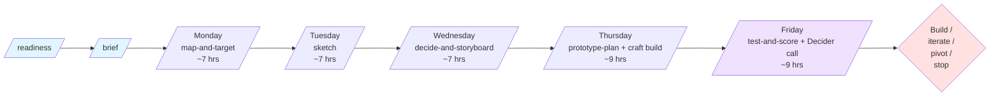

> **Design Sprint is NOT an agile / Scrum sprint.** 5-day workshop methodology (Knapp/Zeratsky/Kowitz, Sprint book 2016). For disambiguation see [Workshop Sprints vs Agile Sprints](../concepts/workshop-sprints-vs-agile-sprints.md).

## At a glance

## Roles

| Role | Required? | Days critical |
|---|---|---|
| Decider | YES (load-bearing windows minimum) | Mon AM, Wed AM, Fri PM (ideally all 5) |
| Facilitator | YES | All 5 days |
| Design lead | YES | All 5 days; Tue + Thu critical |
| Engineering lead | YES | All 5 days; Thu critical |
| PM or Researcher | YES | All 5 days; Friday critical |
| Customer expert / domain SME | Recommended | Mon + Fri |

Team total: 4-7 people. Smaller fails ("missing perspective on critical days"); larger fails ("decision-making slows").

## Pre-sprint (1-2 weeks before Monday)

- **`tool-design-sprint-readiness`** (30-45 min): Go / Conditional Go / Wait against 8 canonical criteria + customer recruiting plan.
- **`tool-design-sprint-brief`** (60-90 min): two-page scope contract; locks recruiting + medium + format.
- **Customer recruiting** (Riley or recruiter; activates day-of-readiness Go): 6 confirmed slots (5 + 1 buffer) by Friday-before-sprint.

## Day-by-day timeboxes

### Monday (Map and Target; ~7 hrs)

| Block | Time | Activity | Output |
|---|---|---|---|
| Welcome | 09:00-09:30 | Recap + agenda | - |
| Goal + questions | 09:30-10:30 | Long-term goal + sprint questions | One sentence + 3-7 questions |
| Map | 10:30-12:30 | Customer / system map | 5-15 step flow |
| Lunch + first expert | 12:30-13:30 | - | - |
| Expert interviews | 13:30-15:30 | 2-4 cameos (15-30 min each) | Notes |
| HMW + heat map | 15:30-16:30 | Cluster HMW board; heat-vote | Top clusters |
| Target moment | 16:30-17:00 | Decider picks | Single target |

### Tuesday (Sketch; ~7 hrs)

| Block | Time | Activity | Output |
|---|---|---|---|
| Welcome | 09:00-09:15 | - | - |
| Lightning demos | 09:15-10:45 | 3 demos x 3 min per person | Pattern board |
| Break | 10:45-11:00 | - | - |
| Notes + Ideas | 11:00-12:30 | Silent independent | - |
| Lunch + recruiting check | 12:30-13:30 | - | - |
| Crazy 8s | 13:30-13:40 | 8 sketches in 8 min | - |
| Solution Sketch | 13:40-15:30 | Silent independent 90 min | One sketch per person |
| Wrap | 15:30-17:00 | Collect + anonymize sketches | Wednesday-ready board |

### Wednesday (Decide and Storyboard; ~7 hrs)

| Block | Time | Activity | Output |
|---|---|---|---|
| Welcome + art museum | 09:00-09:30 | - | - |
| Heat map | 09:30-09:45 | Silent dot-vote | Hot-spot annotations |
| Speed critique | 09:45-10:45 | 3 min per sketch; sketcher silent | "What worries me" notes |
| Break | 10:45-11:00 | - | - |
| Straw poll + supervote | 11:00-11:30 | Decider supervotes | One sketch (or 2 if rumble) |
| Storyboard | 11:30-16:30 | Build 5-15 panel storyboard | Thursday build spec |
| Day-end prep | 16:30-17:00 | Thursday roles + assets | - |

### Thursday (Prototype Plan + Craft Build; ~9 hrs)

| Block | Time | Activity | Output |
|---|---|---|---|
| Prototype plan | 09:30-12:00 | `tool-design-sprint-prototype-plan` | 5 roles + Five-Act script + trial-run criteria + participant tracker |
| Craft build | 09:30-15:30 | Maker + Stitcher + Writer + Asset Collector parallel | Working prototype |
| Mock-run | 14:00-15:00 | Interviewer rehearses script | - |
| Trial run | 15:30-17:00 | Teammate plays fake customer | PASS/FAIL gate |
| Recovery (if needed) | 17:00-19:00 | Fix trial-run failures | - |

### Friday (Test and Score; ~9 hrs)

| Block | Time | Activity | Output |
|---|---|---|---|
| Interview 1 | 09:00-10:00 | Five-Act | Notes |
| Interview 2 | 10:30-11:30 | Five-Act | Notes |
| Interview 3 | 12:00-13:00 | Five-Act | Notes |
| Lunch (overlap) | 13:00-14:00 | - | - |
| Interview 4 | 14:00-15:00 | Five-Act | Notes |
| Interview 5 | 15:30-16:30 | Five-Act | Notes |
| Wrap + hot takes | 16:30-17:00 | Silent in parallel | One paragraph per teammate |
| Decider review | 17:00-17:30 | Scorecard + hot takes + call | Build/iterate/pivot/stop |
| Summary capture | 17:30-18:00 | Next-artifact assignment | Sprint closed |

## Decider Checkpoints (do not skip)

| Moment | What the Decider commits to |
|---|---|
| End of readiness | Go verdict + customer recruiting budget |
| End of brief | Challenge + sprint questions + team + recruiting + medium + format |
| End of Mon (Map and Target) | Target moment selection |
| End of Tue (Sketch) | Logistics: sketches collected + attribution stripped + Wed attendance |
| End of Wed (Decide) | Supervote + storyboard build-ready |
| End of Thu morning (Prototype Plan) | Role plan + fidelity bar + script + trial-run criteria |
| End of Fri | Build / iterate / pivot / stop call + next artifact owner |

## Top 5 failure modes (and recovery)

1. **No customer access for Friday** → most common failure. Postpone if recruiting can't deliver 5+1 by deadline.
2. **Group brainstorming Tuesday** → Facilitator enforces silence; if team can't commit to discipline, methodology is wrong fit.
3. **Consensus drift on Wednesday supervote** → Decider's call is the call; straw poll is input not result.
4. **Thursday prototype slips past 17:00** → 2-hour recovery window; if 19:00 fails, postpone Friday.
5. **Decider hesitates on Friday call** → Facilitator forces commitment; "defer" is not an answer.

## Related resources (NOT printable)

- [Using the Design Sprint Tools](using-design-sprint.md) - operational walkthrough
- [Design Sprint FAQ](design-sprint-faq.md) - common questions
- [Design Sprint case studies](design-sprint-case-studies.md) - 3 end-to-end examples
- [Design Sprint recovery playbook](design-sprint-recovery.md) - detailed failure-recovery
- [Design Sprint concept doc](../concepts/design-sprint.md) - methodology deep-dive
- [Design Sprint skills contract v0.2.0](../reference/skill-families/design-sprint-skills-contract.md) - formal spec
- [Sprint Methodology Glossary](../reference/sprint-methodology-glossary.md) - terminology

---

*Print this page to PDF for in-room facilitator reference. Part of [PM-Skills](https://github.com/product-on-purpose/pm-skills).*
