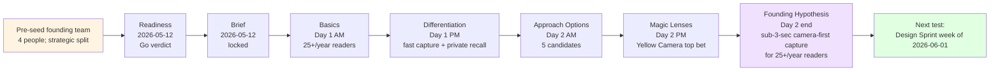

> **Foundation Sprint is NOT an agile / Scrum sprint.** 2-day workshop methodology (Knapp/Zeratsky). For disambiguation see [Workshop Sprints vs Agile Sprints](../concepts/workshop-sprints-vs-agile-sprints.md).

Three fictional companies running the same Foundation Sprint methodology with different stages, sectors, and strategic questions. Each case study narrates the 2-day arc and links to the full library samples for the per-skill artifacts.

## Case Study 1: Brainshelf (pre-seed B2C)

**Company:** Brainshelf - pre-seed B2C SaaS for personal book collection management. 4-person founding team: Jamie (founder/PM/Decider), Alex (design), Sam (engineering), Riley (customer expert with 12k-follower book-blogger Discord).

**Strategic question:** Should we optimize for individual collectors (private library tracking) or social readers (community feeds, recommendations)?

**Sprint dates:** 2026-05-13 to 2026-05-14.

**The arc:**

1. **Readiness (2026-05-12):** Jamie invokes `tool-foundation-sprint-readiness` to assess. 7/8 criteria PASS; competitor research incomplete (Goodreads + paper journals understood; StoryGraph + Bookly + LibraryThing not yet). Conditional Go: Riley owns competitor one-pagers by 2026-05-12 22:00 PT. Decider Checkpoint signed; sprint dates locked.

2. **Brief (2026-05-12):** One-page contract: scope = "should Brainshelf optimize for collectors or social readers?"; team = 4 people committed full both days; logistics = hybrid (Seattle co-working + Zoom).

3. **Day 1 morning - Basics:** Target customer = "25+/year readers who treat their personal library as memory rather than identity"; important problem = "I can't remember what I've read or what I want to read next"; team advantage = "Alex's mobile-capture UX + Sam's offline-first mobile + Riley's book-blogger network"; competitor map includes Goodreads + StoryGraph + paper + memory-only.

4. **Day 1 afternoon - Differentiation:** Two chosen differentiators: "fastest capture" + "most useful recall". 2x2 chart plots Goodreads as "slow capture + medium recall" and paper journals as "medium capture + low recall". Decision principles include "we ship for the books-as-memory framing not the books-as-identity framing". Mini Manifesto: "Brainshelf is the fastest way to capture a book and the most useful way to recall what you've read."

5. **Day 2 morning - Approach Options:** Five candidates generated: (1) Yellow Camera-first sub-3-sec capture; (2) Red Bookstore-first browse-and-capture; (3) Green Social-led recommendation feed; (4) Blue OCR-of-physical-shelf bulk capture; (5) Purple Voice-note capture with AI transcription.

6. **Day 2 afternoon - Magic Lenses:** Scored across customer, pragmatic, growth, money + custom "team-advantage" lens. Yellow Camera (top bet) and Red Bookstore (backup) emerge. Decider supervotes Yellow.

7. **Day 2 end - Founding Hypothesis:** "If we help people who read 25 or more books a year and treat their personal library as memory rather than identity solve 'I can't remember what I've read or what I want to read next' with sub-3-second camera-first capture into a private library, they will choose it over Goodreads, StoryGraph, paper journals, and doing nothing because our solution is the fastest way to capture a book and the most useful way to recall what they have read."

   Assumption scorecard names A1 (25+/year readers switchable from "do nothing" with sub-3-sec capture) as highest-risk. Recommended next test: Design Sprint week of 2026-06-01.

**Full library samples:** [Readiness](../../library/skill-output-samples/tool-foundation-sprint-readiness/sample_tool-foundation-sprint-readiness_brainshelf_book-catalog.md) | [Brief](../../library/skill-output-samples/tool-foundation-sprint-brief/sample_tool-foundation-sprint-brief_brainshelf_book-catalog.md) | [Basics](../../library/skill-output-samples/tool-foundation-sprint-basics/sample_tool-foundation-sprint-basics_brainshelf_book-catalog.md) | [Differentiation](../../library/skill-output-samples/tool-foundation-sprint-differentiation/sample_tool-foundation-sprint-differentiation_brainshelf_book-catalog.md) | [Approach Options](../../library/skill-output-samples/tool-foundation-sprint-approach-options/sample_tool-foundation-sprint-approach-options_brainshelf_book-catalog.md) | [Magic Lenses](../../library/skill-output-samples/tool-foundation-sprint-magic-lenses/sample_tool-foundation-sprint-magic-lenses_brainshelf_book-catalog.md) | [Founding Hypothesis](../../library/skill-output-samples/tool-foundation-sprint-founding-hypothesis/sample_tool-foundation-sprint-founding-hypothesis_brainshelf_book-catalog.md)

## Case Study 2: Storevine (B2B specialty retail)

**Company:** Storevine - B2B managed-intelligence service for 5-50 store US specialty retailers. 4-person team: Mei (founder/PM/CEO/Decider), Devon (data engineering), Tasha (design), Carlos (customer expert; 5-year retail buyer at 4 specialty stores).

**Strategic question:** What product approach delivers actionable specialty-retail intelligence at SMB-friendly price points?

**Sprint dates:** 2026-05-18 to 2026-05-19.

**Key arc:**

1. **Readiness Go;** 31 customer interviews already conducted; team validated as buyer-side experts.

2. **Day 1 - Basics:** Target = "merchandisers at 5-50 store US specialty retailers in outdoor / home / specialty-food"; important problem = "Monday buying decisions made from gut + spreadsheet because existing analytics tools are unused"; team advantage = Carlos's lived buyer experience + Devon's POS-integration background + Mei's SaaS pricing intuition. Competitors include Tableau, Power BI, Looker, Daasity, Glew, NetSuite reporting, Shopify Analytics.

3. **Day 1 - Differentiation:** "Specific actions" + "sector-shaped templates" emerge as differentiators; Mini Manifesto positions Storevine as "the only managed-intelligence service that combines a pre-built specialty-retail data model, sector-specialist human analyst review, a weekly delivery rhythm, and specific actions rather than abstract metrics at SMB-friendly price points."

4. **Day 2 - Approach Options:** Three candidates: (1) Templates-driven Monday brief; (2) Pooled analyst service; (3) DIY dashboard with concierge onboarding.

5. **Day 2 - Magic Lenses:** Templates (top bet) and Pooled Analyst (backup) emerge. Customer lens favors Templates (5-min Monday read); pragmatic lens favors Pooled (more flexible).

6. **Day 2 end - Founding Hypothesis:** "If we help independent and small-chain US specialty retailers with 5-50 stores solve weekly buying decisions made from spreadsheet review and gut feel with Monday morning analyst-reviewed templated briefs delivering specific ranked actions readable in 15 minutes, they will choose it over [Tableau / Power BI / Daasity / Glew / ERP reporting / Shopify Analytics / hired consultants / 'doing nothing with gut feel'] because our solution is the only managed-intelligence service that combines a pre-built specialty-retail data model, sector-specialist human analyst review, a weekly delivery rhythm matched to merchandiser schedules, and specific actions rather than abstract metrics, at a price point (USD 800-1000 MRR) that fits 5-50 store SMB margin structures."

   Highest-risk: A1 (templates can be authored that produce non-generic-feeling briefs for the 5 subverticals). Recommended next test: **NOT a Design Sprint** (top bet is operationally heavy not UX-heavy); 4-week design-partner pilot 2026-06-02 with Bayfront Outfitters and West Loop Goods.

**Full library samples:** [Founding Hypothesis (Storevine)](../../library/skill-output-samples/tool-foundation-sprint-founding-hypothesis/sample_tool-foundation-sprint-founding-hypothesis_storevine_retail-direction.md) plus the per-skill thread samples in `library/skill-output-samples/tool-foundation-sprint-*/sample_*_storevine_retail-direction.md`.

## Case Study 3: Workbench (B2B SRE incident-response)

**Company:** Workbench - real-time multi-source observability aggregator for Series B-D US growth-stage startups with significant distributed-systems complexity. 4-person team: Priya (founder/PM/Decider; ex-Datadog product), Marcus (engineering; ex-Splunk tracing), Ari (design), Jin (SRE on-call at a Series C fintech that becomes the design-partner).

**Strategic question:** What product approach reduces the disorientation-phase MTTR penalty during production incidents?

**Sprint dates:** 2026-05-21 to 2026-05-22.

**Key arc:**

1. **Readiness Go;** 19 SRE interviews conducted; Priya + Marcus credentials cover product + engineering risk.

2. **Day 1 - Basics:** Target = "senior SREs at Series B-D US growth-stage startups with distributed-systems complexity"; important problem = "5-20 minute disorientation phase at the start of production incidents juggling 5-7 dashboards"; team advantage = Priya's Datadog product experience + Marcus's tracing background + Jin's continuous on-call exposure. Competitors include Datadog, New Relic, Dynatrace, Honeycomb, Lightstep, Sentry, Grafana stack, Splunk, Sumo Logic, PagerDuty, Incident.io, Rootly.

3. **Day 1 - Differentiation:** "Augment don't replace" + "incident-time optimized" + "<30-second deployment" emerge as differentiators; Mini Manifesto positions Workbench as "the only tool optimized exclusively for the incident-time disorientation phase, designed in SRE vocabulary, augmenting existing observability investment, deployable in under 30 seconds without platform-team approval".

4. **Day 1 - Approach Options:** Three candidates: (1) Real-time aggregator (one screen); (2) Replay-first post-incident reconstruction; (3) AI-powered incident-coach chatbot.

5. **Day 2 - Magic Lenses:** Aggregator (top bet) and Replay-First (backup) emerge. Customer lens strongly favors Aggregator (incident-time vs post-incident); money lens favors Replay-First (simpler pricing).

6. **Day 2 end - Founding Hypothesis:** "If we help senior site reliability engineers at Series B-D US growth-stage startups with significant distributed-systems complexity solve the 5-20 minute disorientation phase at the start of production incidents with a real-time multi-source aggregator that pulls live data from their existing Datadog / Honeycomb / Sentry / Grafana, auto-correlates the trace + state + dependency picture, and presents one screen optimized for the disorientation phase, they will choose it over [12 listed competitors and the 'multi-tool juggling' status-quo] because our solution is the only tool optimized exclusively for the incident-time disorientation phase, designed in SRE vocabulary, augmenting (not replacing) their existing observability investment, and deployable in under 30 seconds without platform-team approval."

   Highest-risk: A1 (real-time multi-source API aggregation reliable during incidents). Recommended next test: **NOT a Design Sprint** (technical-feasibility-bound first); design-partner pilot 2026-06-09 with Jin's Series C fintech.

**Full library samples:** [Founding Hypothesis (Workbench)](../../library/skill-output-samples/tool-foundation-sprint-founding-hypothesis/sample_tool-foundation-sprint-founding-hypothesis_workbench_debugging-toolchain.md) plus the per-skill thread samples in `library/skill-output-samples/tool-foundation-sprint-*/sample_*_workbench_debugging-toolchain.md`.

## Cross-case patterns

Reading all three case studies surfaces patterns common across Foundation Sprint executions:

- **Founding Hypothesis sentence length is methodology-canonical, not bloat.** All three hypotheses are ~80-130 words. The strict "If we help [X] solve [Y] with [Z] they will choose it over [W] because [V]" template forces every load-bearing strategic choice into one sentence.

- **The recommended next test is often NOT a Design Sprint.** Brainshelf yes (UX-heavy); Storevine no (operationally heavy); Workbench no (technical-feasibility-bound). Foundation Sprint's job is to identify the right next test, not to assume Design Sprint.

- **Highest-risk assumption is always named explicitly** in the scorecard. The team's full attention goes there next; the rest of the scorecard is parking-lot for later cycles.

- **Decider supervote happens 3 times across the 2 days:** Day 1 strategic summary sign-off; Day 2 top-bet selection; Day 2 end Founding Hypothesis ratification. The Decider's authority is bounded but specific.

## Reading guide

If you're learning Foundation Sprint from these case studies:

1. **Start with the Brainshelf arc** - smallest team, simplest scenario, most-likely-to-be-relatable for first-time-sprint readers.
2. **Read the Brainshelf Founding Hypothesis sample** in full as the canonical end-state.
3. **Then trace backward** from Founding Hypothesis to Magic Lenses to Approach Options to see how the Day 2 narrowing works.
4. **Then read Storevine and Workbench Founding Hypothesis samples** for contrast - same methodology, different sectors, different "next test" recommendations.

## Related resources

- [Using the Foundation Sprint Tools](using-foundation-sprint.md) - operational walkthrough
- [Foundation Sprint FAQ](foundation-sprint-faq.md) - common questions
- [Foundation Sprint cheat sheet](foundation-sprint-cheat-sheet.md) - printable 1-pager
- [Foundation Sprint concept doc](../concepts/foundation-sprint.md) - methodology deep-dive
- [Design Sprint case studies](design-sprint-case-studies.md) - the downstream DS arcs for Brainshelf + Storevine + Workbench
- [`_workflows/foundation-to-design.md`](../../_workflows/foundation-to-design.md) - end-to-end FS-to-DS arc workflow
- [Sprint Methodology Glossary](../reference/sprint-methodology-glossary.md) - terminology

---

*Part of [PM-Skills](https://github.com/product-on-purpose/pm-skills) - Open source Product Management skills for AI agents.*
