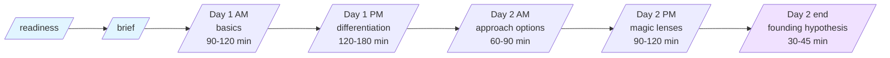

> **Foundation Sprint is NOT an agile / Scrum sprint.** 2-day workshop methodology (Knapp/Zeratsky). For disambiguation see [Workshop Sprints vs Agile Sprints](../concepts/workshop-sprints-vs-agile-sprints.md).

## At a glance

## Roles

| Role | Required? | Days |
|---|---|---|
| Decider | YES | Both days, all blocks |
| Facilitator | YES | Both days, all blocks |
| PM | YES | Both days |
| Design | Recommended | Both days |
| Engineering OR Customer expert | Recommended (one of) | Both days |

Team total: 3-5 people. Smaller fails ("not enough perspectives"); larger fails ("debate doesn't converge").

## Day-by-day timeboxes

### Pre-sprint (days before Day 1)

- **`tool-foundation-sprint-readiness`** (30-45 min): Go / Conditional Go / Wait against 8 canonical criteria.
- **`tool-foundation-sprint-brief`** (45-60 min): one-page scope contract.

### Day 1

| Block | Time | Skill | Output |
|---|---|---|---|
| Morning | 09:00-12:00 | `tool-foundation-sprint-basics` | Target customer + important problem + team advantage + competitor map |
| Lunch | 12:00-13:00 | - | - |
| Afternoon | 13:00-16:00 | `tool-foundation-sprint-differentiation` | Scored differentiators + 2x2 chart + decision principles + Mini Manifesto |
| Day-end review | 16:00-17:00 | - | Decider signs off on Day 1 strategic summary |

### Day 2

| Block | Time | Skill | Output |
|---|---|---|---|
| Morning | 09:00-11:00 | `tool-foundation-sprint-approach-options` | 3-7 candidate approaches as one-page summaries |
| Late morning | 11:00-12:00 | - | Continuation / buffer |
| Lunch | 12:00-13:00 | - | - |
| Afternoon | 13:00-15:00 | `tool-foundation-sprint-magic-lenses` | 4 classic + 1+ custom lens scoring; Decider top-bet + backup supervote |
| Late afternoon | 15:00-16:00 | `tool-foundation-sprint-founding-hypothesis` | Canonical hypothesis sentence + assumption scorecard + recommended next test |
| Day-end ratification | 16:00-17:00 | - | Decider ratifies Founding Hypothesis; sprint closes |

## Decider Checkpoints (do not skip)

| Moment | What the Decider commits to |
|---|---|
| End of readiness | Go verdict; running the 2-day workshop |
| End of brief | Scope, team, dates |
| End of basics | Target customer + problem + advantage + competitor frame |
| End of differentiation | 2 chosen differentiators + Mini Manifesto |
| End of approach options | Candidate set advancing to Magic Lenses |
| End of magic lenses | Top bet + backup + decision rationale |
| End of founding hypothesis | Ratified hypothesis sentence; next test |

## Top 5 failure modes (and recovery)

1. **No Decider available** → postpone; do not run without committed authority.
2. **Team only generates 1-2 approaches** → research gap signal; pause Approach Options for customer research.
3. **Magic Lenses scoring becomes consensus exercise** → Facilitator enforces silent scoring; Decider applies supervote.
4. **Founding Hypothesis sentence is hedged** → re-write; Decider must commit publicly to the unhedged version.
5. **Decider wants to change top bet next day** → only acceptable with new evidence; otherwise hold the line.

## Related resources (NOT printable)

- [Using the Foundation Sprint Tools](using-foundation-sprint.md) - operational walkthrough
- [Foundation Sprint FAQ](foundation-sprint-faq.md) - common questions
- [Foundation Sprint case studies](foundation-sprint-case-studies.md) - 3 end-to-end examples
- [Foundation Sprint recovery playbook](foundation-sprint-recovery.md) - detailed failure-recovery
- [Foundation Sprint concept doc](../concepts/foundation-sprint.md) - methodology deep-dive
- [Foundation Sprint skills contract v0.3.0](../reference/skill-families/foundation-sprint-skills-contract.md) - formal spec
- [Sprint Methodology Glossary](../reference/sprint-methodology-glossary.md) - terminology

---

*Print this page to PDF for in-room facilitator reference. Part of [PM-Skills](https://github.com/product-on-purpose/pm-skills).*
