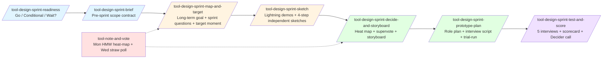
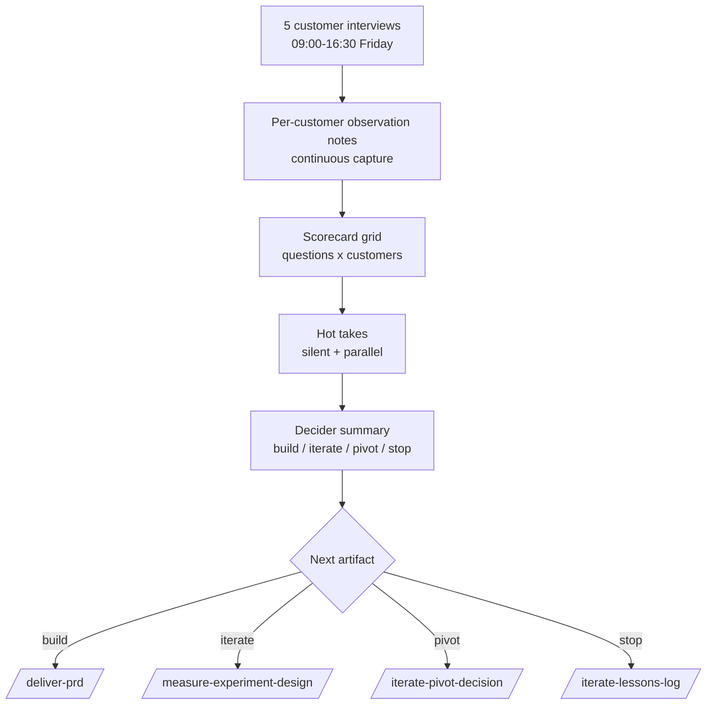
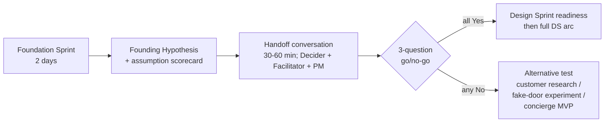

> **Design Sprint is NOT an agile / Scrum sprint.** Design Sprint is a 5-day prototype-and-test workshop methodology from Knapp, Zeratsky, and Kowitz (Sprint book, 2016). Agile sprints are 1-4 week iteration cycles for software delivery. The word "sprint" is shared but the methodologies are unrelated. If you arrived here expecting agile sprint planning, see [`_workflows/sprint-planning.md`](../../_workflows/sprint-planning.md) instead. For the full disambiguation, see [Workshop Sprints vs Agile Sprints](../concepts/workshop-sprints-vs-agile-sprints.md).

The Design Sprint is a five-day workshop developed by Jake Knapp, John Zeratsky, and Braden Kowitz that takes a sharply-framed challenge from blank-page Monday to validated-or-invalidated Friday. The output is a Decider's call (build, iterate, pivot, or stop) grounded in five customer interviews against a one-day prototype. This guide walks you through pm-skills' implementation: 7 `tool-design-sprint-*` skills, plus the standalone `tool-note-and-vote` decision tool used at heat-map and straw-poll moments.

Read the [Design Sprint concept doc](../concepts/design-sprint.md) for the framework's reasoning and history. Read the [family contract](../reference/skill-families/design-sprint-skills-contract.md) for the formal specification. Read the [`design-sprint` workflow](../../_workflows/design-sprint.md) for the canonical sequence and [`foundation-to-design`](../../_workflows/foundation-to-design.md) for the end-to-end arc when chaining with a prior Foundation Sprint. This guide is for getting started.

## The 8 tools at a glance



| Skill | When | Output |
|-------|------|--------|
| `/tool-design-sprint-readiness` | Before scheduling | Go, Conditional Go, or Wait recommendation + customer recruiting plan |
| `/tool-design-sprint-brief` | Prep week | Two-page scope: challenge, sprint questions, team, recruiting, prototype medium, success criteria |
| `/tool-design-sprint-map-and-target` | Monday | Long-term goal, sprint questions, customer/system map, HMW board, Decider's target moment |
| `/tool-design-sprint-sketch` | Tuesday | Lightning demos + 4 independent solution sketches per team member |
| `/tool-design-sprint-decide-and-storyboard` | Wednesday | Heat map, supervote, rumble-vs-all-in-one call, 5-15 panel storyboard |
| `/tool-design-sprint-prototype-plan` | Thursday morning | Role plan, Five-Act interview script, trial-run checklist |
| `/tool-design-sprint-test-and-score` | Friday | 5 customer interviews, scorecard, Decider's build/iterate/pivot/stop call |
| `/tool-note-and-vote` | Monday HMW + Wednesday straw poll | Structured group decision moments |

## Your first Design Sprint

Imagine you have a specific product question that needs validation before committing to a build cycle. Maybe you came out of a Foundation Sprint with a Founding Hypothesis whose highest-risk assumption needs testing. Maybe a competitor's move makes a strategic question urgent. Either way, you have a challenge you can frame in a sentence and a Decider who can clear five days.

### Step 0. Readiness check (30-45 minutes, 1-2 weeks before)

```bash
/tool-design-sprint-readiness "We want to test [challenge]. Decider is [name]. Customer access via [source]."
```

This produces a Go / Conditional Go / Wait verdict against 8 canonical readiness criteria: challenge sprint-worthiness, stakes, Decider availability, team size (4-7), 5-day clearable, customer access for Friday, prototype medium feasibility, and downstream path. The most common failure mode is starting a sprint that should not have been started; this skill catches that before you burn 35-40 person-days plus customer-recruiting cost.

If the verdict is Go, the skill also produces a customer recruiting plan with target profile, source, count (canonical 5; target 6 confirmed for 1-buffer), incentive (typical USD 75-150 per 60-min for B2B, USD 25-75 for B2C), recruiter owner, and a 7-10 day recruiting deadline. Start recruiting within 24 hours of Go.

### Step 1. Brief (60-90 minutes, prep week)

```bash
/tool-design-sprint-brief "Continuing from readiness verdict. Recruiting closed. Lock the brief."
```

The brief is the contract for the next five days. It locks the challenge statement, 2-4 sprint questions (the lead question is usually the highest-risk assumption from a prior Foundation Sprint), Decider attendance windows (Mon AM + Wed AM + Fri PM at minimum), team roster per day, customer recruiting plan, prototype medium choice (clickable / slideware / role-play / paper / physical mock), interview format (live / remote / moderated), logistics, and success criteria. Two pages maximum.

### Step 2. Monday: Map and Target (90-120 min facilitated + expert interviews + HMW)

```bash
/tool-design-sprint-map-and-target "Monday workshop, target customer is [X], we want to test [Y]."
```

Monday produces a long-term goal (1-5 years out, aspirational), 3-7 refined sprint questions (converting team fears into testable risks), a 5-15 step customer or system map, expert interview notes from 2-4 cameo experts, an HMW (How Might We) cluster board with 30-100+ HMWs in 4-8 themes (heat-mapped via `/tool-note-and-vote`), and the Decider's target moment selection.

The target moment is the load-bearing choice of Monday. Tuesday's sketches and Wednesday's storyboard both begin from this single point. If the Decider cannot pick a target moment by 17:00 Monday, Tuesday's work disperses with no shared direction.

### Step 3. Tuesday: Sketch (~7 hours including silent independent work)

```bash
/tool-design-sprint-sketch "Tuesday workshop, target moment locked. Run lightning demos + 4-step protocol."
```

Tuesday's skill ORCHESTRATES the day but does not author the sketches themselves. Each team member presents 3 lightning demos in the morning (Facilitator extracts a reusable pattern from each), then runs the four-step protocol INDIVIDUALLY and SILENTLY: Notes (20 min reviewing) + Ideas (20 min rough doodles) + Crazy 8s (8 min with 8 variations) + Solution Sketch (30-90 min final 3-panel storyboard-style sketch).

The single most common Tuesday failure mode is the team lapsing into group brainstorming. The Sprint method explicitly forbids it because group sketches converge on the loudest voice, not the best idea. The Facilitator's job is to enforce silence during the sketch steps.

End of Tuesday: sketches collected, attribution stripped (Wednesday's heat-map is blind so the team votes on the sketch, not the sketcher), and uploaded to the shared workspace.

### Step 4. Wednesday: Decide and Storyboard (180-240 min; the most decision-heavy day)

```bash
/tool-design-sprint-decide-and-storyboard "Wednesday workshop. 4 sketches anonymized as A/B/C/D in shared workspace."
```

Wednesday runs the art museum layout (sketches posted anonymously on a wall or shared Figma board), the heat map (silent dot-vote stickers on compelling parts), speed critique (3 min per sketch; sketcher silent during own critique), straw poll (1 dot per voter; non-binding), Decider supervote (Sprint book canonical 3 dots placed by the Decider), rumble-vs-all-in-one decision (default all-in-one for v0.1 sprints), and the 5-15 panel storyboard that drives Thursday's prototype build.

The supervote is the Decider's call. The straw poll is INPUT, not result. The single most common Wednesday failure is consensus drift: the team votes, the Facilitator averages, and the Decider rubber-stamps. The Decider's call IS the call.

The storyboard must be specific enough that Thursday's builders can begin without re-debating design. Vague storyboards force Thursday into re-litigation.

### Step 5. Thursday: Prototype Plan + Craft Build (90 min planning + rest-of-day building)

```bash
/tool-design-sprint-prototype-plan "Thursday morning. Storyboard locked. Assign roles + draft script + define trial-run."
```

Thursday morning produces the planning artifact: the 5 canonical Sprint book roles assigned (Maker, Stitcher, Writer, Asset Collector, Interviewer), prototype brief (what to build, fidelity bar, time allocation, explicitly NOT being built), the Five-Act Interview script (Welcome, Context, Intro, Tasks, Debrief; Tasks act is team-supplied wording from the storyboard, others are mostly canonical), trial-run checklist, and Friday participant confirmation tracker.

The build itself is craft activity outside the skill's invocation surface. Figma frames, Keynote slides, paper assemblies, physical mocks - whatever the medium - is built by the team across Thursday using the role plan. Trial run with a fake customer happens Thursday afternoon (typically 15:30-17:00 local). If the trial run fails, Thursday evening is recovery time; Friday postpones if recovery fails by 19:00.

### Step 6. Friday: Test and Score (~9 hours; the sprint's payoff)

```bash
/tool-design-sprint-test-and-score "Friday testing day. 5 customers scheduled. Run interviews + scorecard + Decider review."
```

Friday is the longest day: 5 customer interviews starting 09:00, ending ~16:30, plus synthesis through ~17:30 for the Decider call. Each interview follows the Five-Act script; the team observes from a breakout room and captures observations continuously.

The scorecard grid maps sprint questions (rows) against the 5 customers (columns), with each cell Y / N / partial / unclear plus a one-line note. Day-end decision per question: Validated (4 or 5 of 5 Y; or 3 of 5 Y with no N as directional), Invalidated (4 or 5 of 5 N), or Inconclusive.

After the scorecard, the team writes hot takes SILENTLY and in PARALLEL before group synthesis. This prevents consensus bias from contaminating the read. Then the Decider reviews scorecard + hot takes + observed patterns and makes the call: build / iterate / pivot / stop / reframe.

The Decider summary is the sprint's payoff artifact: the call, the highest-confidence learning, the most important revision, and the next artifact. The sprint cannot close without an explicit call by 17:30 Friday and a named next artifact with owner.



## Coming from a Foundation Sprint

This section is the load-bearing replacement for a bridge skill that pm-skills deliberately does NOT have. Canonical Knapp/Zeratsky methodology has no formal handoff move between Foundation Sprint and Design Sprint; pm-skills does not invent one. Instead, the handoff is a small narrative-only conversation that should happen between Foundation Sprint Day 2 close and Design Sprint readiness invocation.



The handoff conversation covers five things:

1. **Re-confirm the highest-risk assumption.** From the FS scorecard, name the specific assumption the DS will test as its lead question. The Founding Hypothesis as a whole is not the test target; one specific assumption is.

2. **Confirm the assumption is prototype-testable.** Can a 5-day team build a prototype that puts target customers in a situation where they meaningfully validate or invalidate the assumption?

3. **Map FS outputs to DS inputs.** Target customer becomes the recruiting profile; the top bet becomes the prototype direction; the highest-risk assumption becomes the lead sprint question. Full 12-row mapping table lives in `_workflows/foundation-to-design.md`.

4. **Identify team continuity and expansion.** FS typically runs with 3-5 people; DS typically needs 4-7. The Decider continues; the facilitator continues; PM and design typically continue. Engineering may need to join (Thursday prototype build). Customer-expert role may shift.

5. **Commit to DS timing.** Run the DS within 1-2 weeks of FS close so strategic context is fresh. Recruiting starts the day of the handoff conversation.

Then the Decider answers three questions. All three must be Yes for the DS to launch:

1. Is the highest-risk assumption testable through a single-week prototype with target customers?
2. Is customer access feasible within the 1-2 week recruiting window?
3. Can the team clear 5 consecutive days plus a Decider for the load-bearing moments?

If any answer is No, the DS is not the right next test. Use [`measure-experiment-design`](../../skills/measure-experiment-design/SKILL.md) to design an alternative (customer research, fake-door experiment, concierge MVP, etc.). The Founding Hypothesis remains valid; only the testing modality changes.

## The Decider role

The Decider's job is making the calls the team would otherwise spend hours debating. In a Design Sprint:

- **Monday end:** Picks the target moment (single point on the map or tight cluster).
- **Wednesday morning:** Places the supervote (which sketch becomes the prototype) and the rumble-vs-all-in-one call (default all-in-one).
- **Friday end:** Names the build / iterate / pivot / stop call by 17:30; names the highest-confidence learning; names the most important revision; names the next artifact and owner.

The Decider is also a sketcher on Tuesday, observer on Friday morning, and sign-off on the brief and the Decider Checkpoint at each skill's end. Smaller Decider moments (logistics confirmations, recruiting authorization) happen continuously.

Common Decider failure mode: trying to be a peer participant instead of the Decider. The team needs the Decider to be the Decider; consensus drift is the result when this fails.

## Common pitfalls

- **Sprint theater.** Leadership has already decided what to build; the sprint is being run for political cover. The Friday scorecard cannot change the decision; the honest verdict is Wait.
- **No customer access for Friday.** Single most common failure mode. Recruiting takes 7-10 days; start as soon as readiness is Go, not Monday.
- **Challenge too broad to fit one week.** "Redesign onboarding" is too broad; "design and test the first-time signup flow for B2B trial customers" is sprint-sized.
- **Group brainstorming on Tuesday.** Sprint method explicitly forbids it. Enforce silence.
- **Consensus drift on Wednesday.** The supervote is the Decider's call, not the straw-poll average.
- **Over-polishing the prototype.** The prototype dies Friday at 17:00 regardless of how Friday goes. Stop polishing past the fidelity bar.
- **Hot takes written after group debrief.** Hot takes are SILENT and PARALLEL. Writing them after a group debrief produces consensus, not signal.
- **Decider hesitating on the Friday call.** Friday's job is to produce a call. "Defer" is not an answer. If the call truly cannot be made, the call is "iterate" (re-sprint with adjustments).

## After the sprint

The Friday Decider summary names the next artifact:

| Decider call | Next artifact | pm-skills path |
|---|---|---|
| Build | PRD for v0.1 build | [`deliver-prd`](../../skills/deliver-prd/SKILL.md) |
| Iterate | Smaller follow-on experiment design | [`measure-experiment-design`](../../skills/measure-experiment-design/SKILL.md) |
| Pivot | Pivot rationale + plan | [`iterate-pivot-decision`](../../skills/iterate-pivot-decision/SKILL.md) |
| Stop | Lessons captured for future strategic work | [`iterate-lessons-log`](../../skills/iterate-lessons-log/SKILL.md) |
| Stakeholder comms | Async update | [`foundation-stakeholder-update`](../../skills/foundation-stakeholder-update/SKILL.md) |

The next artifact should be produced within 5 business days of sprint close. Letting it slip past 1-2 weeks invites re-litigation of the Friday call.

## Variants and adaptations

The Design Sprint specification supports several known variants documented in canonical sources:

- **Remote sprint:** All five days via Zoom + Miro. Slightly slower than in-person; sketch and storyboard steps need explicit screen-share discipline. AJ&Smart's remote sprint template is the canonical reference.
- **Hybrid sprint:** Mixed in-person + remote attendees. Plan for the higher-bandwidth participants (designers, engineers) to be in the same physical space if possible; remote attendees join via observer-room patterns.
- **4-day sprint:** Compresses Thursday build with a smaller-scope prototype. Used when the team has prior experience with the Sprint method.
- **Hardware sprint:** Replaces clickable prototype with physical mock or service role-play. Sprint book documents the hardware variant; pm-skills v0.1 covers the standard digital-product variant.
- **Service sprint:** Tests a service experience (concierge / role-played human-in-the-loop) rather than a digital product. Same week structure; different prototype medium decision.

For v0.1 the canonical 5-day digital-product sprint is the default; variants are documented but not separately scaffolded.

## File naming

Library samples for each skill live at `library/skill-output-samples/tool-design-sprint-{move}/sample_tool-design-sprint-{move}_{thread}_{scenario}.md` where the threads are `brainshelf_book-catalog`, `storevine_retail-direction`, and `workbench_debugging-toolchain`. The three threads each tell a coherent 7-skill story; reading any single thread end-to-end demonstrates the canonical arc.

## Related

- [Foundation Sprint workflow](../../_workflows/foundation-sprint.md)
- [Design Sprint workflow](../../_workflows/design-sprint.md)
- [Foundation-to-Design end-to-end workflow](../../_workflows/foundation-to-design.md)
- [Design Sprint concept doc](../concepts/design-sprint.md)
- [Foundation Sprint user guide](using-foundation-sprint.md)
- [Family contract](../reference/skill-families/design-sprint-skills-contract.md)

## Canonical sources

- Knapp, J., Zeratsky, J., and Kowitz, B. *Sprint: How to Solve Big Problems and Test New Ideas in Just Five Days*. Simon and Schuster, 2016.
- GV Design Sprint Guide. https://www.gv.com/sprint/
- Character Capital "Design Sprint guide." https://www.character.vc
- Google Design Sprint Kit. https://designsprintkit.withgoogle.com/
- AJ and Smart "Remote Design Sprint" template.
- Nielsen, J. (2000). "Why You Only Need to Test with 5 Users." Nielsen Norman Group.
