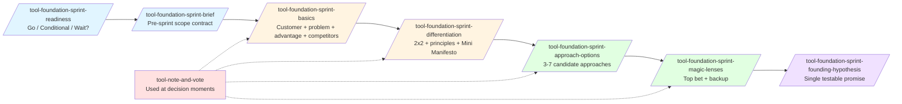
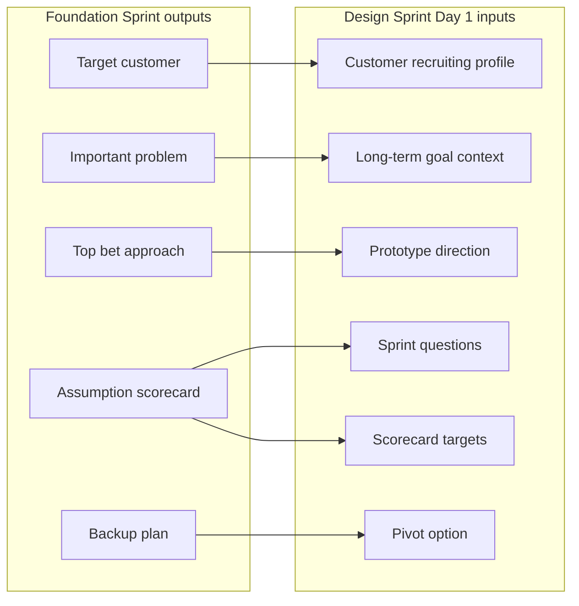

The Foundation Sprint is a two-day strategic alignment workshop developed by Jake Knapp and John Zeratsky. It converts fuzzy early-stage product beliefs into a single, testable Founding Hypothesis. This guide walks you through pm-skills' implementation: 7 `tool-foundation-sprint-*` skills, plus the standalone `tool-note-and-vote` decision tool used throughout.

Read the [Foundation Sprint concept doc](../concepts/foundation-sprint.md) if you want the framework's reasoning, history, and design decisions. Read the [family contract](../reference/skill-families/foundation-sprint-skills-contract.md) for the formal specification. This guide is for getting started.

## The 8 tools at a glance



| Skill | When | Output |
|-------|------|--------|
| `/tool-foundation-sprint-readiness` | Before scheduling | Go, Conditional Go, or Wait recommendation |
| `/tool-foundation-sprint-brief` | Prep day | One-page scope, team, logistics, success criteria |
| `/tool-foundation-sprint-basics` | Day 1 AM | Target customer, important problem, team advantage, competitor map |
| `/tool-foundation-sprint-differentiation` | Day 1 PM | Scored differentiators, 2x2 chart, decision principles, Mini Manifesto |
| `/tool-foundation-sprint-approach-options` | Day 2 AM | 3 to 7 candidate approaches as one-page summaries |
| `/tool-foundation-sprint-magic-lenses` | Day 2 PM | Approaches scored through 4 classic plus 1+ custom lens; top bet + backup |
| `/tool-foundation-sprint-founding-hypothesis` | Day 2 end | Canonical hypothesis sentence, assumption scorecard, recommended next test |
| `/tool-note-and-vote` | Decision moments throughout | 20-30 min structured group decision |

## Your first Foundation Sprint

Imagine you are about to start a significant new product bet. The team has strong but scattered beliefs about who the customer is, what the right approach is, and how to differentiate. A Design Sprint is on the calendar, but you cannot yet name the hypothesis it would test. Foundation Sprint is the right tool.

### Step 0. Readiness check (30-45 minutes, days before)

```bash
/tool-foundation-sprint-readiness "We're starting a B2B retail analytics product; team of 4; founder available; no Decider named yet"
```

The skill returns Go, Conditional Go (with prerequisites), or Wait. Common Wait verdicts: no Decider available, no concrete project yet, or the team lacks even baseline customer knowledge. A Conditional Go often surfaces a missing prerequisite like "name your Decider" or "do 3 customer interviews first" before the sprint can be productive.

If the verdict is Wait, do not run the sprint. Re-run readiness after addressing the prerequisites.

### Step 1. Write the brief (45-60 minutes, prep day)

```bash
/tool-foundation-sprint-brief "B2B retail analytics; founders + PM + design + eng; Decider is founder; goal is Founding Hypothesis to feed a Design Sprint two weeks later"
```

The brief locks scope, team, Decider, facilitator, dates, location, and success criteria before the sprint starts. Distribute the one-page output to participants 2-3 days ahead. Anyone who disagrees with the scope or team list raises it now, not Day 1 morning.

### Step 2. Day 1 morning - Basics (90-120 minutes)

```bash
/tool-foundation-sprint-basics @brief.md
```

The skill produces a coherent first-day artifact: who the target customer is, what important problem you are solving, what unique advantage this team has, and which competitors and alternatives the customer might consider. This is the strategic frame the rest of the sprint builds on. Force specificity: "small-to-mid US specialty retailers with 5-50 stores" beats "retail businesses."

Use `/tool-note-and-vote` if the team is split between two target customer framings. Twenty minutes of silent ideation plus voting plus a Decider supervote is faster than a 90-minute argument.

### Step 3. Day 1 afternoon - Differentiation (120-180 minutes)

```bash
/tool-foundation-sprint-differentiation @basics-output.md
```

The team scores differentiators against competitors on a 2x2 chart, names the decision principles that the product will live by, and writes a Mini Manifesto: a one-page strategic summary including a "what this product is" paragraph and an explicit "what this product is NOT" paragraph. The Mini Manifesto becomes a sanity-check artifact: every later decision in the sprint can be evaluated against it.

`/tool-note-and-vote` is the typical mechanism for selecting the final 2 axes of the 2x2 chart.

### Step 4. Day 2 morning - Approach Options (60-90 minutes)

```bash
/tool-foundation-sprint-approach-options @manifesto.md
```

The team generates 3 to 7 candidate approaches as one-page summaries. The minimum-3 floor is anti-anchoring discipline: the most common Day 2 failure is the team converging on a single approach without generating alternatives. The maximum-7 ceiling protects the afternoon Magic Lenses block from blowing up.

If the team only generates 2 ideas, push back into ideation to force at least one more option before progressing. The minimum-3 floor is anti-anchoring discipline, not a budget. Only pause for outside input (customer research, expert interview) if the team genuinely cannot produce a third candidate after a focused ideation block.

### Step 5. Day 2 afternoon - Magic Lenses (90-120 minutes)

```bash
/tool-foundation-sprint-magic-lenses @approach-options.md
```

Each approach is evaluated through 4 classic lenses (customer, pragmatic, growth, money) plus at least 1 custom lens specific to the team's situation. The custom lens captures team-specific constraints or opportunities the 4 classic lenses miss; this is a ratified requirement of the skill. The output names the top bet and a backup.

`/tool-note-and-vote` runs at the end to consolidate scoring into a single top-bet supervote.

### Step 6. Day 2 end - Founding Hypothesis (30-45 minutes)

```bash
/tool-foundation-sprint-founding-hypothesis @magic-lenses.md
```

The capstone skill writes the canonical Founding Hypothesis: a single sentence in the form "If we help [target customer] solve [important problem] with [approach], they will choose it over [competitors or alternatives] because our solution is [differentiators]." The skill enforces this exact structure strictly; paraphrase is rejected. Strictness forces every slot to be filled specifically, which is the whole point.

The output also includes an assumption scorecard ranking the hypothesis's component beliefs by risk, plus a recommended next test (Design Sprint, customer research, or focused experiment).

## The Decider role

Every Foundation Sprint needs a single Decider with formal supervote authority. Without one, the sprint produces a "team consensus" Founding Hypothesis that nobody is accountable for and that re-litigates the moment the team disagrees on next steps.

The Decider is usually the founder, GM, or product leader. The brief and readiness criteria require the Decider to attend all four sprint blocks (Day 1 AM Basics, Day 1 PM Differentiation, Day 2 AM Approach Options, Day 2 PM Magic Lenses, Day 2 end Founding Hypothesis); the family contract requires every TEMPLATE.md to position a Decider Checkpoint at the end so each artifact has explicit sign-off.

If the Decider can realistically only attend a subset of blocks, the readiness skill returns Conditional Go with explicit checkpoint coverage requirements, not Go. If no Decider can be named, readiness returns Wait. Do not run the sprint without a committed Decider.

## How note-and-vote fits in

`tool-note-and-vote` is a standalone tool, not a family member. It is the structured decision mechanic used throughout Foundation Sprint (and later, Design Sprint) at moments where the team needs to converge in 20-30 minutes rather than argue for 90. Typical Foundation Sprint usage: target customer split (Step 2), 2x2 axis selection (Step 3), approach generation prompts (Step 4), top-bet supervote (Step 5).

A note-and-vote always ends in a Decider supervote. The voting is informational; the Decider's pick is binding.

## Handoff to Design Sprint

The Founding Hypothesis is often the input to a downstream Design Sprint. There is no formal bridge skill in pm-skills because the canonical Knapp/Zeratsky methodology has no formal handoff move. The transition is narrative.

How Foundation Sprint outputs feed Design Sprint inputs:



| Foundation Sprint output | Becomes Design Sprint input |
|---|---|
| Target customer | Customer recruiting profile (Design Sprint brief) |
| Important problem framing | Day 1 long-term goal context |
| Team advantage | Day 1 expert interview prioritization + framing of "why us, why now" |
| Competitors and alternatives | Day 1 long-term goal context + Day 4 prototype differentiation framing |
| Differentiators | Day 1 Map and Target + Day 3 storyboard moments of differentiation |
| Mini Manifesto | Day 1 sanity-check during Map and Target; Day 3 storyboard alignment check |
| Decision principles | Day 2 Decide voting criteria + Day 3 storyboard guardrails |
| Top bet (approach) | Prototype direction (Day 3 storyboard) |
| Assumption scorecard | Sprint questions (Day 1 Map and Target) |
| Highest-risk assumption | Primary scorecard row (Day 5 Test and Score) |
| Backup plan | Pivot option if Friday signal is weak |

**Go / no-go checkpoint:** the Decider confirms the Founding Hypothesis is testable through a 5-day prototype before starting the Design Sprint. If the highest-risk assumption cannot be tested that way, the team revisits the hypothesis or chooses a different next test.

**Timing:** run the Design Sprint within 1 to 2 weeks of Foundation Sprint while the strategic context is fresh. Longer gaps invite re-litigation of the Founding Hypothesis.

**Other next steps that are not a Design Sprint:** the Founding Hypothesis's recommended next test is not always a prototype. Sometimes the right answer is more customer research (via `discover-interview-synthesis`), a focused experiment (via `measure-experiment-design`), a concierge MVP, or skipping straight to feature kickoff if the hypothesis is already well-validated.

## Common pitfalls

1. **Running without a Decider.** The sprint produces an unowned hypothesis that re-litigates as soon as anyone disagrees with next steps. Re-run readiness; do not start the sprint until a Decider is named.
2. **Generating only 1-2 approaches.** Approach Options enforces a minimum of 3 specifically to break anchoring on the first idea anyone said out loud. If the team genuinely cannot generate 3, treat that as a research gap, not a sprint failure.
3. **Skipping the custom Magic Lens.** The 4 classic lenses are generic by design. The custom lens captures a team-specific constraint or opportunity the classics miss. The skill requires at least 1.
4. **Paraphrasing the Founding Hypothesis.** The strict canonical structure exists to force specificity. A paraphrased hypothesis is almost always a vague hypothesis. Re-run the skill on the same inputs if the first draft drifts.
5. **Treating the sprint as customer research.** Foundation Sprint operates on the team's existing knowledge. If the team has zero customer or market knowledge, the readiness skill will catch that. Do customer research first.
6. **Inviting too many people.** Foundation Sprint works with 3 to 5 people, optimally 4. Bigger groups produce slower decisions and noisier outputs. Use the brief's team-list slot to enforce this.
7. **Skipping the brief.** Without a one-page locked scope distributed in advance, Day 1 morning starts with 60 minutes of scope debate instead of Basics. The brief is cheap insurance.

## File naming and outputs

The skills produce bundled artifacts following the family contract's TEMPLATE.md structure:

| Skill suffix | Filename convention |
|---|---|
| readiness | `foundation-sprint-readiness_{project}.md` |
| brief | `foundation-sprint-brief_{project}.md` |
| basics | `foundation-sprint-basics_{project}.md` |
| differentiation | `foundation-sprint-differentiation_{project}.md` |
| approach-options | `foundation-sprint-approach-options_{project}.md` |
| magic-lenses | `foundation-sprint-magic-lenses_{project}.md` |
| founding-hypothesis | `foundation-sprint-founding-hypothesis_{project}.md` |
| note-and-vote | `note-and-vote_{question-slug}.md` |

Each artifact has a Decider Checkpoint section near the end (last 25% of the TEMPLATE.md by family contract). The Decider Checkpoint is the explicit moment where the Decider ratifies the artifact before moving to the next skill.

## Related

- [Foundation Sprint concept doc](../concepts/foundation-sprint.md): framework reasoning, history, canonical sources, comparison with Design Sprint.
- [Foundation Sprint Skills Family contract](../reference/skill-families/foundation-sprint-skills-contract.md): formal contract enforced by the validator.
- [`foundation-sprint` workflow](../../_workflows/foundation-sprint.md): the multi-skill workflow chain with detailed Day-by-Day timing.
- [`tool-note-and-vote` skill](../../skills/tool-note-and-vote/SKILL.md): standalone decision tool referenced throughout.
- [Library samples](../../library/skill-output-samples/): worked artifacts following the Brainshelf book-catalog narrative thread.
- Design Sprint guide: see the companion `using-design-sprint.md` when the Design Sprint family ships in v2.15.0.
