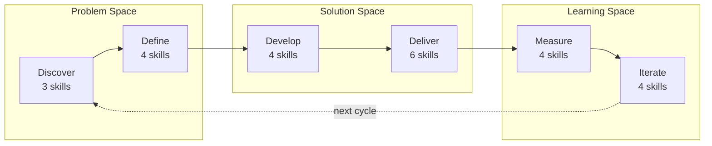
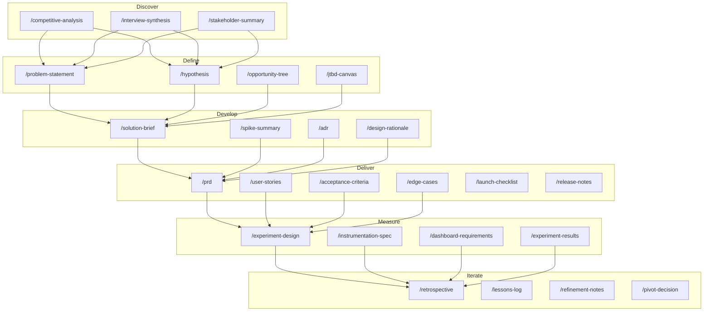
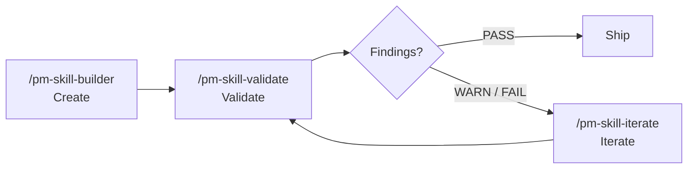

# PM Skills

**29 best-practice product management skills for AI agents.**

PM Skills teaches AI assistants how to produce professional PM artifacts — PRDs, user stories, acceptance criteria, experiment designs, and more. One command, consistent output, every time.

## The Triple Diamond

Skills are organized across 6 phases of the Triple Diamond framework — three diamonds covering the problem space, the solution space, and the learning space.



[:octicons-arrow-right-24: Learn about the Triple Diamond](concepts/triple-diamond.md)

## The Skills

<div class="grid cards" markdown>

- :material-magnify: **Discover** — 3 skills
  ---
  Research, competitive analysis, stakeholder mapping
  [:octicons-arrow-right-24: Browse](skills/discover/)

- :material-target: **Define** — 4 skills
  ---
  Problem framing, hypotheses, opportunity trees, JTBD
  [:octicons-arrow-right-24: Browse](skills/define/)

- :material-wrench: **Develop** — 4 skills
  ---
  Solution briefs, ADRs, design rationale, spikes
  [:octicons-arrow-right-24: Browse](skills/develop/)

- :material-rocket-launch: **Deliver** — 6 skills
  ---
  PRDs, user stories, acceptance criteria, edge cases, launch, release notes
  [:octicons-arrow-right-24: Browse](skills/deliver/)

- :material-chart-line: **Measure** — 4 skills
  ---
  Experiments, instrumentation, dashboards, results
  [:octicons-arrow-right-24: Browse](skills/measure/)

- :material-refresh: **Iterate** — 4 skills
  ---
  Retrospectives, lessons, refinement, pivot decisions
  [:octicons-arrow-right-24: Browse](skills/iterate/)

- :material-layers-triple: **Foundation** — 1 skill
  ---
  Cross-cutting persona generation
  [:octicons-arrow-right-24: Browse](skills/foundation/)

- :material-tools: **Utility** — 3 skills
  ---
  Create, validate, and iterate skills themselves
  [:octicons-arrow-right-24: Browse](skills/utility/)

</div>

## Skills by Phase

Every skill mapped to its phase, with the command to invoke it:



## The Skill Lifecycle

Three utility skills form a self-reinforcing quality loop for managing the skill library itself:



**Create** a new skill with guided gap analysis and classification. **Validate** it against structural conventions and quality criteria. **Iterate** to fix findings from the validation report or apply feedback. Repeat until passing, then ship.

The lifecycle tools are what keep the library consistent as it grows — the validator catches drift, and the iterator applies fixes with version tracking and change summaries.

[:octicons-arrow-right-24: Learn more about the lifecycle](concepts/skill-lifecycle.md) · [:octicons-arrow-right-24: Skill versioning](concepts/versioning.md)

## Quick Start

```bash
git clone https://github.com/product-on-purpose/pm-skills.git
cd pm-skills
```

Then use any skill:

```
/prd "Search feature for e-commerce platform"
/hypothesis "Will one-page checkout increase conversion?"
/acceptance-criteria "User can reset password via email"
```

[:octicons-arrow-right-24: Full setup guide](getting-started/) · [:octicons-arrow-right-24: Find the right skill](guides/skill-finder.md) · [:octicons-arrow-right-24: Recipes](guides/recipes.md)

## See It In Action

Follow three fictional companies through the complete product lifecycle — from discovery research to pivot decisions — with real prompts and full outputs.

<div class="grid cards" markdown>

- :material-store: **Storevine** — B2B Ecommerce
  ---
  Building email marketing for 15K merchants. Organized prompts.
  [:octicons-arrow-right-24: Follow the journey](showcase/storevine.md)

- :material-bookshelf: **Brainshelf** — Consumer PKM
  ---
  Building a morning digest for 22K users. Casual prompts.
  [:octicons-arrow-right-24: Follow the journey](showcase/brainshelf.md)

- :material-office-building: **Workbench** — Enterprise Collaboration
  ---
  Building document templates for 500 enterprises. Structured prompts.
  [:octicons-arrow-right-24: Follow the journey](showcase/workbench.md)

</div>

## Works Everywhere

| Platform | Method |
|----------|--------|
| **Claude Code** | Slash commands (`/prd`, `/hypothesis`, etc.) |
| **GitHub Copilot** | AGENTS.md auto-discovery |
| **Cursor / Windsurf** | AGENTS.md or [MCP server](https://github.com/product-on-purpose/pm-skills-mcp) |
| **Claude.ai / Desktop** | ZIP upload or MCP |
| **Any MCP client** | [pm-skills-mcp](https://github.com/product-on-purpose/pm-skills-mcp) |

## Links

- [:fontawesome-brands-github: GitHub Repository](https://github.com/product-on-purpose/pm-skills)
- [:material-server: MCP Server](https://github.com/product-on-purpose/pm-skills-mcp)
- [:material-file-document: Agent Skills Specification](https://agentskills.io/specification)
- [:material-tag: Browse by tag](tags.md)
