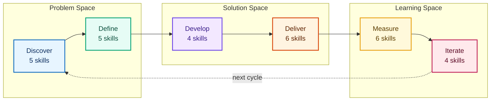
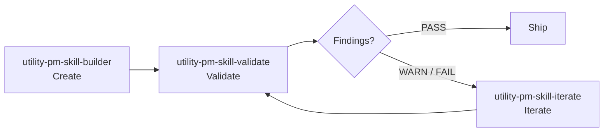

import { Card, CardGrid } from '@astrojs/starlight/components';

**65 best-practice product management skills for AI agents.**

PM Skills teaches AI assistants how to produce professional PM artifacts - PRDs, user stories, acceptance criteria, experiment designs, sprint outputs, and more. One command, consistent output, every time.

## The Triple Diamond

Skills are organized across 6 phases of the Triple Diamond framework - three diamonds covering the problem space, the solution space, and the learning space.



[Learn about the Triple Diamond](concepts/triple-diamond-delivery-process.md)

## The Skills

{/* count-exempt:start */}
<CardGrid>
  <Card title="Discover (5 skills)" icon="magnifier">
    Research, competitive analysis, stakeholder mapping.

    [Browse Discover](skills/discover/)
  </Card>

  <Card title="Define (5 skills)" icon="puzzle">
    Problem framing, hypotheses, opportunity trees, JTBD.

    [Browse Define](skills/define/)
  </Card>

  <Card title="Develop (4 skills)" icon="setting">
    Solution briefs, ADRs, design rationale, spikes.

    [Browse Develop](skills/develop/)
  </Card>

  <Card title="Deliver (6 skills)" icon="rocket">
    PRDs, user stories, acceptance criteria, edge cases, launch, release notes.

    [Browse Deliver](skills/deliver/)
  </Card>

  <Card title="Measure (6 skills)" icon="bars">
    Experiments, instrumentation, dashboards, results, OKR grading.

    [Browse Measure](skills/measure/)
  </Card>

  <Card title="Iterate (4 skills)" icon="random">
    Retrospectives, lessons, refinement, pivot decisions.

    [Browse Iterate](skills/iterate/)
  </Card>

  <Card title="Foundation (8 skills)" icon="open-book">
    Cross-cutting skills: persona, OKR writer, lean canvas, meeting lifecycle, stakeholder update.

    [Browse Foundation](skills/foundation/)
  </Card>

  <Card title="Utility (10 skills)" icon="pencil">
    Create, validate, iterate skills, generate diagrams and presentations, and update the library.

    [Browse Utility](skills/utility/)
  </Card>

  <Card title="Tool (15 skills)" icon="rocket">
    Canonical sprint methodologies: Foundation Sprint (7) + Design Sprint (7) + tool-note-and-vote.

    [Browse Tool](skills/tool/)
  </Card>
</CardGrid>
{/* count-exempt:end */}

## Skills by Phase

Each box below is a skill you invoke by name. The six phases trace a product from first research through to post-launch learning, so you can pick the one that matches where your work is right now.


**Beyond the six phases**, three cross-cutting families support the work at every stage:

- **Foundation (8)** - reusable building blocks for any initiative: `foundation-persona`, `foundation-lean-canvas`, `foundation-okr-writer`, `foundation-stakeholder-update`, and the four meeting skills (agenda, brief, recap, and cross-meeting synthesis).
- **Workshop tools (15)** - run a facilitated session with your agent: the 7-skill **Foundation Sprint** family for 2-day strategic alignment, the 7-skill **Design Sprint** family for a 5-day prototype-and-test cycle, and the standalone `tool-note-and-vote` decision mechanic.
- **Utility (10)** - meta-tooling that builds, validates, and maintains the library itself, plus the sub-agents that run adversarial review, catalog auditing, changelog curation, and release orchestration.

## The Skill Lifecycle

Three utility skills form a self-reinforcing quality loop for managing the skill library itself:



**Create** a new skill with guided gap analysis and classification. **Validate** it against structural conventions and quality criteria. **Iterate** to fix findings from the validation report or apply feedback. Repeat until passing, then ship.

The lifecycle tools are what keep the library consistent as it grows - the validator catches drift, and the iterator applies fixes with version tracking and change summaries.

[Learn more about the lifecycle](guides/pm-skill-lifecycle.md) · [PM-Skill versioning](reference/pm-skill-versioning.md)

## Quick Start

**Claude Code** - install from the plugin marketplace:

```bash
/plugin marketplace add product-on-purpose/agent-plugins
/plugin install pm-skills@product-on-purpose
```

**Any other agent** - add via the open skills CLI, or clone the repo:

```bash
npx skills add product-on-purpose/pm-skills
# or: git clone https://github.com/product-on-purpose/pm-skills.git
```

Then invoke any skill by name:

```
deliver-prd "Search feature for e-commerce platform"
define-hypothesis "Will one-page checkout increase conversion?"
deliver-acceptance-criteria "User can reset password via email"
```

[Full setup guide](getting-started/) · [Find the right skill](guides/skill-finder.md) · [Recipes](guides/recipes.md)

## See It In Action

Follow three fictional companies through the complete product lifecycle - from discovery research to pivot decisions - with real prompts and full outputs.

<CardGrid>
  <Card title="Storevine - B2B Ecommerce" icon="bars">
    Building email marketing for 15K merchants. Organized prompts.

    [Follow the journey](showcase/storevine.md)
  </Card>

  <Card title="Brainshelf - Consumer PKM" icon="open-book">
    Building a morning digest for 22K users. Casual prompts.

    [Follow the journey](showcase/brainshelf.md)
  </Card>

  <Card title="Workbench - Enterprise Collaboration" icon="laptop">
    Building document templates for 500 enterprises. Structured prompts.

    [Follow the journey](showcase/workbench.md)
  </Card>
</CardGrid>

## Works Everywhere

| Platform | Method |
|----------|--------|
| **Claude Code** | Slash commands (`deliver-prd`, `define-hypothesis`, etc.) |
| **GitHub Copilot** | AGENTS.md auto-discovery |
| **Cursor / Windsurf** | AGENTS.md or [MCP server](https://github.com/product-on-purpose/pm-skills-mcp) |
| **Claude.ai / Desktop** | ZIP upload or MCP |
| **Any MCP client** | [pm-skills-mcp](https://github.com/product-on-purpose/pm-skills-mcp) |

## Workflows

12 guided multi-skill workflows for common PM processes. Each chains skills in a recommended sequence with handoff guidance.

| Workflow | Best for | Skills |
|----------|----------|--------|
| [Feature Kickoff](workflows/feature-kickoff.md) | New features | problem-statement, hypothesis, prd, user-stories, launch-checklist |
| [Lean Startup](workflows/lean-startup.md) | Rapid validation | hypothesis, experiment-design, experiment-results, pivot-decision |
| [Triple Diamond](workflows/triple-diamond.md) | Major initiatives | All 30 phase skills across 6 phases |
| [Customer Discovery](workflows/customer-discovery.md) | Research to problem | interview-synthesis, jtbd-canvas, opportunity-tree, problem-statement |
| [Sprint Planning (agile)](workflows/sprint-planning.md) | Agile sprint-ready stories | refinement-notes, user-stories, edge-cases |
| [Product Strategy](workflows/product-strategy.md) | Strategic framing | competitive-analysis, stakeholder-summary, opportunity-tree, solution-brief, adr |
| [Post-Launch Learning](workflows/post-launch-learning.md) | Ship to learn | instrumentation-spec, dashboard-requirements, experiment-results, retrospective, lessons-log |
| [Stakeholder Alignment](workflows/stakeholder-alignment.md) | Leadership buy-in | stakeholder-summary, problem-statement, solution-brief, launch-checklist |
| [Technical Discovery](workflows/technical-discovery.md) | Feasibility | spike-summary, adr, design-rationale |
| [Foundation Sprint](workflows/foundation-sprint.md) | 2-day strategic alignment | 7 `tool-foundation-sprint-*` skills producing a testable Founding Hypothesis |
| [Design Sprint](workflows/design-sprint.md) | 5-day prototype + test | 7 `tool-design-sprint-*` skills producing a Decider's build/iterate/pivot/stop call |
| [Foundation to Design](workflows/foundation-to-design.md) | End-to-end FS + DS arc | Both families chained with a narrative handoff conversation |

[All workflows](workflows/)

## Recent Releases

{/* count-exempt:start */}
| Version | Date | Highlights |
|---------|------|-----------|
| **[v2.22.0](releases/Release_v2.22.0.md)** | 2026-05-30 | One menu entry per skill: the 63 duplicate command wrappers are gone, so each capability shows once. Native Codex support added via a `.codex-plugin` manifest. All 65 skills unchanged. |
| **[v2.21.0](releases/Release_v2.21.0.md)** | 2026-05-26 | Marketplace launch: pm-skills now installs from the `product-on-purpose` plugin marketplace. The previous install path keeps working, so existing setups need no change. |
| **[v2.20.0](releases/Release_v2.20.0.md)** | 2026-05-25 | Each workshop methodology is now a single command: `/workflow-foundation-sprint`, `/workflow-design-sprint`, and `/workflow-foundation-to-design` chain their per-day skills end to end. |
| **[v2.19.0](releases/Release_v2.19.0.md)** | 2026-05-23 | Pre-promotion hardening: new validators catch stale counts, dead links, and references to skills that do not exist before they can ship. Nothing you use behaves differently. |
| **[v2.18.0](releases/Release_v2.18.0.md)** | 2026-05-21 | Four new phase skills close the highest-consensus PM gaps: market-sizing, prioritization-framework, journey-map, and survey-analysis. Catalog grows 59 to 63. |
| **[v2.17.0](releases/Release_v2.17.0.md)** | 2026-05-20 | Native Claude Code sub-agent registration: `@pm-critic` and the other three auto-discover and dispatch by @-mention. |
| **[v2.16.0](releases/Release_v2.16.0.md)** | 2026-05-17 | Active Orchestration: 4 sub-agents (pm-critic, pm-skill-auditor, pm-changelog-curator, pm-release-conductor) plus the modernized Astro Starlight docs stack with full-text search. |
| **[v2.15.0](releases/Release_v2.15.0.md)** | 2026-05-16 | Sprint Skills launch: 15 workshop-methodology skills (Foundation Sprint + Design Sprint families + note-and-vote). Catalog grows 40 to 55. |
| [v2.14.0](releases/Release_v2.14.0.md) | 2026-05-10 | Docs stack migration from MkDocs Material to Astro Starlight: full-text search and native dark mode. |
| **[v2.12.0](releases/Release_v2.12.0.md)** | 2026-05-03 | OKR skills: `foundation-okr-writer` and `measure-okr-grader` for the full quarterly write-and-score cycle. |

[All releases](releases/) · [Full changelog](changelog.md)
{/* count-exempt:end */}

## Links

- [GitHub Repository](https://github.com/product-on-purpose/pm-skills)
- [MCP Server](https://github.com/product-on-purpose/pm-skills-mcp)
- [Agent Skills Specification](https://agentskills.io/specification)
