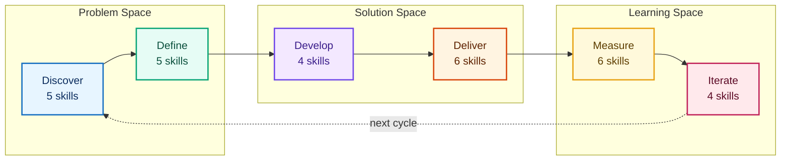
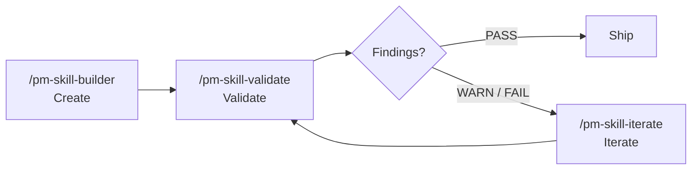

import { Card, CardGrid } from '@astrojs/starlight/components';

**63 best-practice product management skills for AI agents.**

PM Skills teaches AI assistants how to produce professional PM artifacts - PRDs, user stories, acceptance criteria, experiment designs, sprint outputs, and more. One command, consistent output, every time.

## The Triple Diamond

Skills are organized across 6 phases of the Triple Diamond framework - three diamonds covering the problem space, the solution space, and the learning space.



[Learn about the Triple Diamond](concepts/triple-diamond-delivery-process.md)

## The Skills

<CardGrid>
  <Card title="Discover (5 skills)" icon="magnifier">
    Research, competitive analysis, stakeholder mapping.

    [Browse Discover](skills/discover/)
  </Card>

  <Card title="Define (5 skills)" icon="puzzle">
    Problem framing, hypotheses, opportunity trees, JTBD.

    [Browse Define](skills/define/)
  </Card>

  <Card title="Develop (4 skills)" icon="setting">
    Solution briefs, ADRs, design rationale, spikes.

    [Browse Develop](skills/develop/)
  </Card>

  <Card title="Deliver (6 skills)" icon="rocket">
    PRDs, user stories, acceptance criteria, edge cases, launch, release notes.

    [Browse Deliver](skills/deliver/)
  </Card>

  <Card title="Measure (6 skills)" icon="bars">
    Experiments, instrumentation, dashboards, results, OKR grading.

    [Browse Measure](skills/measure/)
  </Card>

  <Card title="Iterate (4 skills)" icon="random">
    Retrospectives, lessons, refinement, pivot decisions.

    [Browse Iterate](skills/iterate/)
  </Card>

  <Card title="Foundation (8 skills)" icon="open-book">
    Cross-cutting skills: persona, OKR writer, lean canvas, meeting lifecycle, stakeholder update.

    [Browse Foundation](skills/foundation/)
  </Card>

  <Card title="Utility (10 skills)" icon="pencil">
    Create, validate, iterate skills, generate diagrams and presentations, and update the library.

    [Browse Utility](skills/utility/)
  </Card>

  <Card title="Tool (15 skills)" icon="rocket">
    Canonical sprint methodologies: Foundation Sprint (7) + Design Sprint (7) + tool-note-and-vote.

    [Browse Tool](skills/tool/)
  </Card>
</CardGrid>

## Skills by Phase

30 domain skills across 6 phases, plus 8 foundation, 10 utility (including the v2.16.0 sub-agent dispatch slate), and 15 tool skills (Foundation Sprint + Design Sprint families + note-and-vote):


**Plus:** `/lean-canvas` `/persona` `/okr-writer` `/meeting-agenda` `/meeting-brief` `/meeting-recap` `/meeting-synthesize` `/stakeholder-update` (Foundation - cross-cutting) · `/pm-skill-builder` `/pm-skill-validate` `/pm-skill-iterate` `/mermaid-diagrams` `/slideshow-creator` `/update-pm-skills` `/pm-critic` `/pm-audit-repo` `/pm-draft-changelog` `/pm-release` (Utility incl. v2.16.0 sub-agent dispatch slate) · `/tool-foundation-sprint-readiness` `/tool-foundation-sprint-brief` `/tool-foundation-sprint-basics` `/tool-foundation-sprint-differentiation` `/tool-foundation-sprint-approach-options` `/tool-foundation-sprint-magic-lenses` `/tool-foundation-sprint-founding-hypothesis` (Foundation Sprint family) · `/tool-design-sprint-readiness` `/tool-design-sprint-brief` `/tool-design-sprint-map-and-target` `/tool-design-sprint-sketch` `/tool-design-sprint-decide-and-storyboard` `/tool-design-sprint-prototype-plan` `/tool-design-sprint-test-and-score` (Design Sprint family) · `/tool-note-and-vote` (standalone)

## The Skill Lifecycle

Three utility skills form a self-reinforcing quality loop for managing the skill library itself:



**Create** a new skill with guided gap analysis and classification. **Validate** it against structural conventions and quality criteria. **Iterate** to fix findings from the validation report or apply feedback. Repeat until passing, then ship.

The lifecycle tools are what keep the library consistent as it grows - the validator catches drift, and the iterator applies fixes with version tracking and change summaries.

[Learn more about the lifecycle](guides/pm-skill-lifecycle.md) · [PM-Skill versioning](reference/pm-skill-versioning.md)

## Quick Start

```bash
git clone https://github.com/product-on-purpose/pm-skills.git
cd pm-skills
```

Then use any skill:

```
/prd "Search feature for e-commerce platform"
/hypothesis "Will one-page checkout increase conversion?"
/acceptance-criteria "User can reset password via email"
```

[Full setup guide](getting-started/) · [Find the right skill](guides/skill-finder.md) · [Recipes](guides/recipes.md)

## See It In Action

Follow three fictional companies through the complete product lifecycle - from discovery research to pivot decisions - with real prompts and full outputs.

<CardGrid>
  <Card title="Storevine - B2B Ecommerce" icon="bars">
    Building email marketing for 15K merchants. Organized prompts.

    [Follow the journey](showcase/storevine.md)
  </Card>

  <Card title="Brainshelf - Consumer PKM" icon="open-book">
    Building a morning digest for 22K users. Casual prompts.

    [Follow the journey](showcase/brainshelf.md)
  </Card>

  <Card title="Workbench - Enterprise Collaboration" icon="laptop">
    Building document templates for 500 enterprises. Structured prompts.

    [Follow the journey](showcase/workbench.md)
  </Card>
</CardGrid>

## Works Everywhere

| Platform | Method |
|----------|--------|
| **Claude Code** | Slash commands (`/prd`, `/hypothesis`, etc.) |
| **GitHub Copilot** | AGENTS.md auto-discovery |
| **Cursor / Windsurf** | AGENTS.md or [MCP server](https://github.com/product-on-purpose/pm-skills-mcp) |
| **Claude.ai / Desktop** | ZIP upload or MCP |
| **Any MCP client** | [pm-skills-mcp](https://github.com/product-on-purpose/pm-skills-mcp) |

## Workflows

12 guided multi-skill workflows for common PM processes. Each chains skills in a recommended sequence with handoff guidance.

| Workflow | Best for | Skills |
|----------|----------|--------|
| [Feature Kickoff](workflows/feature-kickoff.md) | New features | problem-statement, hypothesis, prd, user-stories, launch-checklist |
| [Lean Startup](workflows/lean-startup.md) | Rapid validation | hypothesis, experiment-design, experiment-results, pivot-decision |
| [Triple Diamond](workflows/triple-diamond.md) | Major initiatives | All 30 phase skills across 6 phases |
| [Customer Discovery](workflows/customer-discovery.md) | Research to problem | interview-synthesis, jtbd-canvas, opportunity-tree, problem-statement |
| [Sprint Planning (agile)](workflows/sprint-planning.md) | Agile sprint-ready stories | refinement-notes, user-stories, edge-cases |
| [Product Strategy](workflows/product-strategy.md) | Strategic framing | competitive-analysis, stakeholder-summary, opportunity-tree, solution-brief, adr |
| [Post-Launch Learning](workflows/post-launch-learning.md) | Ship to learn | instrumentation-spec, dashboard-requirements, experiment-results, retrospective, lessons-log |
| [Stakeholder Alignment](workflows/stakeholder-alignment.md) | Leadership buy-in | stakeholder-summary, problem-statement, solution-brief, launch-checklist |
| [Technical Discovery](workflows/technical-discovery.md) | Feasibility | spike-summary, adr, design-rationale |
| [Foundation Sprint](workflows/foundation-sprint.md) | 2-day strategic alignment | 7 `tool-foundation-sprint-*` skills producing a testable Founding Hypothesis |
| [Design Sprint](workflows/design-sprint.md) | 5-day prototype + test | 7 `tool-design-sprint-*` skills producing a Decider's build/iterate/pivot/stop call |
| [Foundation to Design](workflows/foundation-to-design.md) | End-to-end FS + DS arc | Both families chained with a narrative handoff conversation |

[All workflows](workflows/)

## Recent Releases

| Version | Date | Highlights |
|---------|------|-----------|
| **[v2.18.0](releases/Release_v2.18.0.md)** | 2026-05-21 | Highest-consensus PM skill gaps: 4 new phase skills (discover-market-sizing, define-prioritization-framework, discover-journey-map, measure-survey-analysis), each with a companion command and 3 thread samples. Catalog 59 to 63 (phase 26 to 30); commands 66 to 70. |
| **[v2.17.0](releases/Release_v2.17.0.md)** | 2026-05-20 | Native Claude Code sub-agent registration (definitions moved to the canonical agents/ directory; coordination dir renamed AGENTS/ to _agent-context/); frontmatter metadata-nested migration; bash-3.2 validator portability. 59-skill catalog unchanged. |
| **[v2.16.0](releases/Release_v2.16.0.md)** | 2026-05-17 | Active Orchestration + Doc-Stack Modernization: 4 plugin sub-agents (pm-critic, pm-skill-auditor, pm-changelog-curator, pm-release-conductor) codify the Phase 0 Adversarial Review Loop + 6-gate release runbook including the new G2.5 commit gate. 4 dispatch skills at `skills/utility-pm-{role}/` deliver cross-client compatibility (VALIDATED on Codex CLI 2026-05-17 per GATE B + C). Astro 5.13.x to 6.3.x upgrade + Starlight 0.39.x + Node 22.12+ across 5 CI workflows; closes 2 deferred Dependabot alerts. 10 new public docs (concepts, guides, reference, contributing - including the canonical sub-agent compatibility matrix and CI overview) + 12 sub-agent library samples across 3 narrative threads. Content catalog 55 to 59 with the 4 utility dispatch skills; new shipping unit is the sub-agent |
| **[v2.15.2](releases/Release_v2.15.2.md)** | 2026-05-17 | v2.15.x Cycle Closeout + v2.16.0 Plan Reconciliation: closeout patch successor to v2.15.1. No source-code, validator behavior, or catalog changes. Planning-doc hygiene only: audit doc status flipped from DRAFT to REMEDIATION SHIPPED with finding-by-finding closure table; v2.15.0 master plan continuity updated; v2.16.0 plan slate reconciled against v2.15.1 shipped reality (CONTEXT.md prereq marked DONE; ci-plan validator scope reduced via carry-in reconciliation section); CONTEXT.md refreshed; version surfaces bumped |
| **[v2.15.1](releases/Release_v2.15.1.md)** | 2026-05-16 | Post-Tag Audit Remediation + Preventive CI: same-day patch closing 18 v2.15.x audit findings (docs-site homepage, skills landing page, AGENTS.md command table, sample-library README, Sprint Planning naming-discipline) plus a workflow-generator bug fix and 4 new preventive CI validators (landing-page count assertion, workflow-generator coverage, AGENTS.md command-sync, pre-tag validator bundle orchestration). 55-skill catalog unchanged |
| **[v2.15.0](releases/Release_v2.15.0.md)** | 2026-05-16 | Sprint Skills Launch: 15 new skills under the new `classification: tool` taxonomy (7 Foundation Sprint family + 7 Design Sprint family + 1 tool-note-and-vote standalone) implementing Knapp/Zeratsky/Kowitz canonical sprint methodologies. Skill catalog 40 to 55. Two family contracts with enforcing CI validators (each with --strict release mode). 3 new workflows including end-to-end FS-to-DS arc with narrative handoff conversation that replaces dropped bridge skill (12-row slot-mapping table + 3-question go/no-go checkpoint). 45 library samples across 3 narrative threads (Brainshelf, Storevine, Workbench). Two user guides + two concept docs. Two adversarial-review cycles documented (FS-track + DS-track; all P1 closed pre-tag) |
| [v2.14.2](releases/Release_v2.14.2.md) | 2026-05-10 | Codex final review closure (cumulative docs hygiene patch). 0 P0, 1 P1, 11 P2, 1 P3 findings addressed. `validate-docs-frontmatter` scope expanded to .mdx (parity with V6); `check-no-body-h1` doc clarified with "what is NOT caught" framing; `validate-mcp-sync` guide refreshed for observe-mode default; `sync-agents-md.yml` workflow_dispatch hardened with two-layer defense (input gate + token gate); pm-skills-mcp README cross-repo update (5 "25 skills" residues to "40 skills"; v2.9.3 latest pointer); CONTRIBUTING.md workaround count corrected; release plan + Release_v2.14.0 deferral table reframed. 40-skill catalog unchanged |
| [v2.14.1](releases/Release_v2.14.1.md) | 2026-05-10 | Polish + V15 regression fix: same-day patch for v2.14.0. Title duplication fixed across 62 hand-authored docs + 6 generator emission sites (Starlight title-vs-body-H1 migration regression); 63 generator pages cleaned of contributor-noise asides; 182 en-dashes swept across 45 library samples; Mermaid 3-layer beautification + canonical style guide; two validators promoted to truly enforcing + new check-no-body-h1 validator added (enforcing tier 11 to 14); MCP maintenance posture codified cross-repo |
| [v2.14.0](releases/Release_v2.14.0.md) | 2026-05-10 | Doc Stack Migration: MkDocs Material to Astro Starlight: doc-stack migration release with zero new skills (40 unchanged); 4 phases / 13 workstreams; production cutover via GitHub Pages source flip to Actions; Starlight-native asides + MDX details replace pymdownx admonitions; client-side Mermaid via astro-mermaid 2.0.1; 115 library samples mounted under /samples/; 12 redirect entries preserved with /pm-skills/ base path; Phase 0 Adversarial Review Loop via codex:rescue against trunk |
| [v2.13.0](releases/Release_v2.13.0.md) | 2026-05-05 | Foundation Hardening + Doc Stack Decision: maintenance and quality release with zero new skills; 7 new CI gates that catch doc drift on PRs (validator inventory 15 to 22; enforcing tier 5 to 10); Diataxis-aligned docs with `pm-skill-*` filename prefix; Pattern 5C generated-content marker; out-of-cycle pm-skills-mcp v2.9.3 security patch |
| **[v2.12.0](releases/Release_v2.12.0.md)** | 2026-05-03 | OKR Skills Launch: `foundation-okr-writer` + `measure-okr-grader` with canonical type and indicator-class enums; 38 to 40 skills |
| [v2.11.1](releases/Release_v2.11.1.md) | 2026-04-22 | skills.sh CLI compatibility patch: unblocks `npx skills add product-on-purpose/pm-skills`; lint hardening; em-dash sweep completion |
| **[v2.11.0](releases/Release_v2.11.0.md)** | 2026-04-18 | Meeting Skills Family: 5 foundation skills + canonical contract + enforcing CI; lean-canvas; 32 to 38 skills |
| [v2.10.0](releases/Release_v2.10.0.md) | 2026-04-11 | Utility skill expansion: `/mermaid-diagrams`, `/slideshow-creator`, `/update-pm-skills`. (v2.10.1 and v2.10.2 patches followed; see CHANGELOG.md for details.) |
| [v2.9.1](releases/Release_v2.9.1.md) | 2026-04-10 | Workflows guide + docs count consistency CI |
| [v2.9.0](releases/Release_v2.9.0.md) | 2026-04-06 | Workflows: rename bundles to workflows, expand 3 to 9, 7 `/workflow-*` commands |

[All releases](releases/) · [Full changelog](changelog.md)

## Links

- [GitHub Repository](https://github.com/product-on-purpose/pm-skills)
- [MCP Server](https://github.com/product-on-purpose/pm-skills-mcp)
- [Agent Skills Specification](https://agentskills.io/specification)
