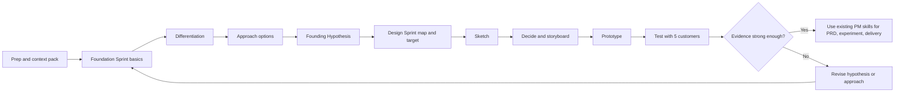

# Curated Design Sprint and Foundation Sprint Skills for PM-Skills

/// 🤖 START /  **01. Design Sprint and Foundation Sprint Skills Collection**
/// May 10, 2026 / GPT-5.2 Thinking

## Executive Summary

This collection should be built as a sprint sub-library inside [product-on-purpose/pm-skills](https://github.com/product-on-purpose/pm-skills), not as a loose packet of workshop prompts. The strongest shape is a three-layer system: shared sprint mechanics, a Foundation Sprint track for strategy and hypothesis formation, and a Design Sprint track for validation through prototype and customer testing. That structure matches the official relationship between the two methods, where the Foundation Sprint sets direction and the Design Sprint tests it with real users. (confidence: high)

The repo should **not** overload its existing `foundation` taxonomy for Foundation Sprint skills. The current repo already uses `foundation-*` for cross-cutting PM capabilities such as Lean Canvas and persona, and the current skill files show a mix of older `phase:` and newer `classification:` frontmatter patterns. A dedicated `classification: sprint` with `sprint_type: shared|foundation|design` is the cleanest and least ambiguous extension. (confidence: high)

Each sprint skill should be artifact-first. In this repo, good skills already point to structured templates and examples; likewise, official sprint practice depends on concrete outputs such as a target-customer choice, differentiation chart, mini manifesto, storyboard, prototype plan, interview script, and scorecard. The collection should therefore generate facilitation-ready assets, not generic explanations of the method. (confidence: high)

A sensible first release is: 5 shared sprint skills, 11 Foundation Sprint skills, 12 Design Sprint skills, 3 workflows, a sample-output corpus, and CI-backed review rules. That is large enough to be useful and small enough to remain curated, which fits the repo’s current model of atomic skills, workflows, validation utilities, examples, and contribution guardrails. (confidence: high)

A practical implementation plan is roughly **41 to 59 editor-days** end to end, with the best early return coming from shared templates, command/workflow wiring, example outputs, and review automation. The repo already has the structural ingredients for this, including flat skill folders, workflows, commands, docs, sample outputs, and validation culture. (confidence: medium)

## Purpose and Audience

The collection’s purpose should be operational: help an AI assistant prepare, run, and synthesize sprint work for humans who still make the decisions in the room. That fits the current repo, which is organized around atomic PM skills that produce structured artifacts, and it fits the official sprint methods, which are designed to accelerate learning and decision-making through concrete workshop outputs rather than open-ended brainstorming. (confidence: high)

The primary audience is PMs, product designers, facilitators, founders, and innovation leads who need to frame high-stakes bets, align stakeholders, and validate risky ideas quickly. Secondary audiences are engineering leads, researchers, marketing leads, customer-facing experts, and executives who participate as Deciders or domain experts. Official sources consistently position these methods for big projects, critical business questions, early-stage bets, and situations where teams are stuck or uncertain. (confidence: high)

A crucial boundary is that the Foundation Sprint is **not** the best first move for every fuzzy enterprise problem. [Design Sprint Academy](https://www.designsprint.academy/) argues that large organizations often need context-setting, prior research, or problem-framing work before a Foundation Sprint, and then follow-up experimentation after it. That means the collection should explicitly distinguish between **prep skills**, **sprint execution skills**, and **post-sprint validation skills**. (confidence: high)

The practical implication is that this collection should not replace the repo’s ordinary PM artifact library. It should sit beside it as a specialized operating system for sprint moments, then hand off into existing skills such as problem statements, hypotheses, PRDs, experiment design, interview synthesis, and launch planning as appropriate. (confidence: high)

The comparison below reflects how the collection should be framed inside the repo. The cadence and outcomes come from the official method guides and training materials. (confidence: high)

| Track | Best used for | Primary outcome | Canonical timing | Core audience |
|---|---|---|---|---|
| Foundation Sprint | Starting a major new bet, narrowing strategic options, setting differentiation | Founding Hypothesis and test agenda | 2 workshop days, plus prep | Founders, PMs, strategy leads, innovation teams |
| Design Sprint | Validating a risky concept with a prototype and customer evidence | Tested prototype, scorecard, next-step decision | 5 workshop days, plus prep | PM, design, research, engineering, Decider |
| Shared Sprint Core | Making either sprint run consistently | Briefs, decision records, voting, checklists, synthesis | Before, during, and after any sprint | Facilitators and cross-functional leads |

## Scope and Skill Architecture

The collection should be scoped as a **curated facilitation library**, not a comprehensive encyclopedia of every workshop move. The best granularity is one skill per meaningful facilitation move plus one primary artifact. That is consistent with the repo’s current skill anatomy and with official sprint agendas, which are structured as distinct checkpoints with explicit outputs and timeboxes. (confidence: high)

From the evidence, four architecture rules follow.

First, create **shared** skills for repeated mechanics such as readiness, note-and-vote, and sprint readouts rather than duplicating them in every track. (confidence: high)

Second, keep most skills to **20 to 90 minutes** of isolated practice or artifact creation, with prototype-build and test-plan orchestration as the main exceptions. (confidence: high)

Third, require every skill to include **when to use**, **when not to use**, **pitfalls**, and **success metrics** because official and practitioner sources both show that poor sprint outcomes usually come from bad context, weak prep, missing decision authority, or lack of follow-through. (confidence: high)

Fourth, separate **strategy before build** from **validation after strategy** so Foundation Sprint and Design Sprint remain complementary rather than merged into one mushy workshop bucket. (confidence: high)

The workflow below shows the operating model the repo should encode in both commands and workflows. It reflects the official pairing of Foundation Sprint and Design Sprint plus practitioner guidance for enterprise context and follow-up experimentation. (confidence: high)



The repo should also make role expectations explicit. Official sprint guidance treats the Facilitator and Decider as essential, while enterprise-focused advice stresses the need for both strategic authority and hands-on expertise in the room. (confidence: high)

| Role | Foundation Sprint weight | Design Sprint weight | Why this matters |
|---|---|---|---|
| Facilitator | Essential | Essential | Keeps pace, captures outputs, protects process |
| Decider | Essential | Essential | Makes final calls when votes and discussion do not converge |
| PM / product lead | Essential | Essential | Holds context, owns continuity after the workshop |
| Designer | Important | Essential | Stronger in sketching, prototyping, and test interpretation |
| Research / interviewer | Helpful | Essential | Critical for customer recruitment, interview quality, and synthesis |
| Engineering / technical lead | Important | Important | Grounds feasibility, constraints, and prototype realism |
| Founder / GM / strategy lead | Essential | Helpful | Heavier weighting in Foundation Sprint because strategy and edge matter most |
| Marketing / sales / CS experts | Helpful | Helpful | Add customer reality, market signal, and language |

Every skill should ship with a richer metadata contract than the repo’s current minimal examples, while still staying close to how the repo already structures frontmatter and local references. (confidence: high)

| Field | Required | Why it matters |
|---|---|---|
| `name` | Yes | Stable skill slug and command mapping |
| `description` | Yes | Clear invocation guidance |
| `classification` | Yes | Should be `sprint` for this collection |
| `sprint_type` | Yes | `shared`, `foundation`, or `design` |
| `stage` | Yes | Example: `prep`, `basics`, `differentiation`, `decide`, `prototype`, `validate` |
| `version` / `updated` / `license` | Yes | Matches current repo governance and release hygiene |
| `metadata.priority` | Yes | P1, P2, P3 for curation and workflow ordering |
| `metadata.difficulty` | Yes | Novice, intermediate, advanced |
| `metadata.timebox_minutes` | Yes | Supports agenda building and curriculum design |
| `metadata.roles` | Yes | Clarifies who should use or review the artifact |
| `metadata.prerequisites` | Yes | Prevents misuse and bad ordering |
| `metadata.inputs` / `outputs` | Yes | Makes the skill operational and composable |
| `metadata.success_metrics` | Yes | Lets maintainers review quality of the skill outcome |
| `metadata.common_pitfalls` | Yes | Encodes hard-won facilitation knowledge |
| `metadata.tooling` | Yes | Suggests whiteboards, prototyping, and interview setup without forcing one vendor |
| `metadata.learning_resources` | Yes | Gives at least one primary source and one practitioner resource |
| `metadata.source_roots` | Yes | Signals whether the skill derives from GV, Click, DSA, etc. |

## Canonical Skill Catalog

The recommended catalogs below are synthesized from the official Foundation Sprint guide, official Design Sprint guide, GV’s original five-day sequence, Google’s six-phase framing, and practitioner operational guidance from Design Sprint Academy and Lenny’s coverage. The time estimates are **recommended skill-level practice windows**, derived from those agendas rather than copied as canonical rules. (confidence: high)

### Foundation Sprint Skills

| Priority | Skill slug | Primary output | Primary roles | Practice time | Confidence |
|---|---|---|---|---|---|
| P1 | `sprint-shared-brief-readiness` | Sprint brief, participant plan, prep pack, decision scope | Facilitator, PM, Decider | 45-60 min | High |
| P1 | `sprint-shared-note-and-vote` | Silent ideation board, vote summary, decision record | Facilitator, whole team | 20-30 min | High |
| P1 | `foundation-sprint-target-customer` | Crisp target-customer definition in plain language | Facilitator, PM, Decider | 15-20 min | High |
| P1 | `foundation-sprint-important-problem` | Chosen problem statement with urgency rationale | Facilitator, PM, Decider | 15-20 min | High |
| P1 | `foundation-sprint-advantage-inventory` | List of team advantages and evidence behind them | PM, founder, engineering lead | 20-30 min | High |
| P1 | `foundation-sprint-competition-and-alternatives` | Competitor, workaround, and “do nothing” map | PM, marketing, sales, CS | 20-30 min | High |
| P1 | `foundation-sprint-differentiators` | Classic and custom differentiator set with scoring | Facilitator, PM, design | 45-60 min | High |
| P1 | `foundation-sprint-mini-manifesto` | 2x2 differentiation chart, decision principles, mini manifesto | Decider, PM, design | 75-90 min | High |
| P1 | `foundation-sprint-approach-summaries` | One-page option summaries for 3-7 approaches | PM, design, engineering | 60-75 min | High |
| P1 | `foundation-sprint-magic-lenses` | Comparative lens charts, top bet, backup bet | Decider, PM, finance/growth as needed | 90-120 min | High |
| P1 | `foundation-sprint-founding-hypothesis` | Founding Hypothesis plus assumption scorecard and next tests | PM, Facilitator, Decider | 30-45 min | High |

These 11 skills line up with the official Foundation Sprint’s three moves: **Basics**, **Differentiation**, and **Approach**, ending in the Founding Hypothesis that should then feed a Design Sprint or other validation work. (confidence: high)

### Design Sprint Skills

| Priority | Skill slug | Primary output | Primary roles | Practice time | Confidence |
|---|---|---|---|---|---|
| P1 | `sprint-shared-brief-readiness` | Sprint brief, challenge frame, team roster, logistics checklist | Facilitator, PM, Decider | 60-90 min | High |
| P1 | `sprint-shared-note-and-vote` | Structured silent ideation and decision trace | Facilitator, whole team | 20-30 min | High |
| P1 | `design-sprint-long-term-goal-and-risks` | Long-term goal and sprint questions | Decider, PM, Facilitator | 30-45 min | High |
| P1 | `design-sprint-map-and-target` | Customer/map flow and chosen target moment | PM, design, Decider | 45-60 min | High |
| P1 | `design-sprint-expert-interviews-hmw` | Expert-note synthesis and clustered How Might We opportunities | Facilitator, PM, experts | 60-90 min | High |
| P1 | `design-sprint-lightning-demos` | Demo roundup and inspiration capture board | Design, PM, Facilitator | 30-45 min | High |
| P1 | `design-sprint-four-step-sketch` | Solution sketches using notes, ideas, Crazy 8s, and final sketch | Whole team | 90-150 min | High |
| P1 | `design-sprint-sticky-decision` | Heat map, critique notes, straw poll, supervote outcome | Facilitator, Decider, whole team | 60-90 min | High |
| P1 | `design-sprint-storyboard` | 5 to 15 step storyboard for prototype build | Design, PM, Facilitator, Decider | 60-90 min | High |
| P1 | `design-sprint-prototype-orchestrator` | Role plan, prototype brief, trial-run checklist | Design, engineering, PM, interviewer | 240-360 min | High |
| P1 | `design-sprint-test-plan-and-interview-script` | Screener, recruitment tracker, interview script, schedule | Research/interviewer, PM | 60-90 min | High |
| P1 | `design-sprint-friday-scorecard` | Observation grid, yes/no decisions, hot takes, next-step memo | Interviewer, whole team, Decider | 90-120 min | High |

These 12 skills preserve the spirit of the original GV week while also fitting Google’s later six-phase language of Understand, Define, Sketch, Decide, Prototype, and Validate. That matters because it lets the repo support both classic GV framing and the later six-phase framing without fragmenting the catalog. (confidence: high)

At the workflow level, the repo should ship three opinionated sprint workflows from day one: `foundation-sprint`, `design-sprint`, and `foundation-to-design`. The current repo already treats workflows as sequences of atomic skills with handoff logic, so sprint workflows are a natural extension rather than a new concept. (confidence: high)

## Repository Design and Governance

The repo should extend its current flat shape rather than create a parallel package. The public repo already uses `skills/`, `_workflows/`, `commands/`, `library/`, docs, `AGENTS.md`, and contribution/validation utilities, so the sprint collection should land inside those same surfaces for discoverability and maintenance consistency. (confidence: high)

The structure below is the most compatible with the repo’s current architecture and naming habits. (confidence: high)

```mermaid
flowchart TD
    A[pm-skills/] --> B[skills/]
    B --> B1[sprint-shared-brief-readiness/]
    B --> B2[sprint-shared-note-and-vote/]
    B --> B3[foundation-sprint-target-customer/]
    B --> B4[foundation-sprint-magic-lenses/]
    B --> B5[design-sprint-map-and-target/]
    B --> B6[design-sprint-friday-scorecard/]

    A --> C[_workflows/]
    C --> C1[foundation-sprint.md]
    C --> C2[design-sprint.md]
    C --> C3[foundation-to-design.md]

    A --> D[commands/]
    D --> D1[foundation-target-customer.md]
    D --> D2[design-storyboard.md]
    D --> D3[workflow-foundation-to-design.md]

    A --> E[docs/]
    E --> E1[guides/sprints/]
    E --> E2[reference/sprints/]
    E --> E3[templates/sprints/]

    A --> F[library/skill-output-samples/sprints/]
    F --> F1[foundation/]
    F --> F2[design/]
    F --> F3[shared/]
```



Three naming decisions matter most. Extend the existing flat `skills/{slug}/` approach, keep sprint slugs explicit with `sprint-shared-*`, `foundation-sprint-*`, and `design-sprint-*`, and mirror those slugs into command names and docs. Also, preserve the repo’s newer docs naming habit for PM-Skills-specific documents, because the repo’s recent releases explicitly moved toward clearer prefixing and documentation guardrails. (confidence: high)

The current public files suggest a chance to normalize frontmatter. One example skill still uses `phase:` while a newer foundation skill uses `classification:` plus richer metadata. The sprint collection should standardize on the newer, more expressive pattern. (confidence: high)

A recommended frontmatter skeleton looks like this. It is intentionally close to current repo usage while adding the sprint-specific fields needed for curation, workflow wiring, and learning paths. (confidence: high)

```yaml
---
name: foundation-sprint-founding-hypothesis
description: Produces a Founding Hypothesis, assumption scorecard, and next-step validation plan after a Foundation Sprint.
classification: sprint
sprint_type: foundation
stage: approach
version: "0.1.0"
updated: 2026-05-10
license: Apache-2.0
metadata:
  category: sprint-strategy
  frameworks: [foundation-sprint, click, design-sprint]
  priority: P1
  difficulty: intermediate
  timebox_minutes: 45
  roles: [facilitator, decider, pm, founder]
  prerequisites:
    - target customer selected
    - important problem selected
    - differentiators chosen
    - approach selected
  inputs:
    - basics decisions
    - competition map
    - differentiation chart
    - option evaluation notes
  outputs:
    - founding hypothesis
    - assumption scorecard
    - recommended next test
  success_metrics:
    - clarity of hypothesis
    - testability of assumptions
    - decision alignment
  common_pitfalls:
    - vague customer wording
    - unprovable differentiation
    - no follow-up test
  tooling:
    - virtual or physical whiteboard
    - worksheet
    - decision log
  learning_resources:
    - primary
    - practitioner
  source_roots:
    - character-foundation-sprint-guide
    - click
    - design-sprint-academy
  author: product-on-purpose
---
```

The runtime anatomy should stay local to each skill folder: `SKILL.md`, `references/TEMPLATE.md`, `references/EXAMPLE.md`, and, where useful, `references/CHECKLIST.md` or `references/WORKSHEET.md`. That mirrors how the current skill files point to local references and examples. A global docs templates area is still useful for maintainers, but execution-time references should remain close to the skill. (confidence: high)

The contribution and review process should remain curated and become more evidence-based for sprint content. The current repo already has a curated contribution model, utility skills for create/validate/iterate, and several CI guardrails, so the sprint collection should build on that instead of inventing a new governance model. (confidence: high)

A strong review pipeline is:

1. **Proposal issue first** with the skill’s job to be done, why it belongs in sprint scope, primary source roots, and a sample output target. (confidence: high)
2. **Draft the skill** with `SKILL.md`, local `TEMPLATE.md`, `EXAMPLE.md`, and one realistic scenario. (confidence: high)
3. **Run structural validation** using the repo’s validation pattern and a sprint-specific checklist that checks source alignment, artifact quality, and workflow fit. (confidence: high)
4. **Require two reviews**: one method reviewer for sprint fidelity and one maintainer reviewer for repo consistency. (confidence: medium)
5. **Ship as beta** until the skill has at least one sample output, one workflow integration, and one post-merge improvement pass. (confidence: medium)
6. **Promote to stable** only after maintainers confirm the skill adds value beyond existing PM skills and does not duplicate generic workshop content. (confidence: high)

The templates below are designed to be immediately usable in the repo. They distill the official guides, scorecards, and training materials into markdown-first artifacts. (confidence: high)

### Ready-to-Use Template for Sprint Brief and Readiness

This template is most directly grounded in official Design Sprint setup guidance and practitioner emphasis on prep quality. (confidence: high)

```md
---
artifact: sprint-brief
version: "1.0"
status: draft
sprint_type: foundation-or-design
---

# Sprint Brief

## Overview
- **Sprint type:** [Foundation Sprint / Design Sprint]
- **Challenge title:** [Short name]
- **Why now:** [Why this matters now]
- **Decision owner / Decider:** [Name]
- **Facilitator:** [Name]
- **PM owner:** [Name]

## Desired Outcome
- **Primary decision to make:** [Decision]
- **Primary artifact to leave with:** [Founding Hypothesis / Storyboard / Prototype test result / etc.]
- **What success looks like:** [Specific signal]

## Scope
- **In scope:**
  - [Item]
  - [Item]
- **Out of scope:**
  - [Item]
  - [Item]

## Participants
| Role | Name | Why they are here |
|---|---|---|
| Decider | [Name] | [Reason] |
| Facilitator | [Name] | [Reason] |
| PM | [Name] | [Reason] |
| Design | [Name] | [Reason] |
| Engineering | [Name] | [Reason] |
| Research / Interviewer | [Name] | [Reason] |
| Expert cameo | [Name] | [Reason] |

## Inputs and Context
- [ ] Existing research synthesized
- [ ] Relevant metrics available
- [ ] Customer examples collected
- [ ] Competitive context prepared
- [ ] Known constraints captured
- [ ] Decision boundaries clarified

## Risks to Watch
- [Risk]
- [Risk]
- [Risk]

## Logistics
- **Format:** [In person / remote / hybrid]
- **Workspace:** [Board or room]
- **Prototype medium:** [Clickable / slideware / HTML / service role-play]
- **Interview format:** [Live / remote / moderated]
- **Customers or participants to recruit:** [Count and profile]

## Readiness Checklist
- [ ] The challenge is specific enough to decide on in a sprint
- [ ] The Decider will attend critical moments
- [ ] The team has the right mix of authority and hands-on knowledge
- [ ] Evidence is good enough to begin
- [ ] Follow-up validation time is reserved
- [ ] Everyone knows what decision the sprint is meant to unlock
```

### Ready-to-Use Template for Foundation Sprint Founding Hypothesis

This template turns the official Founding Hypothesis structure into a repo-ready artifact and adds a traceable assumption scorecard. (confidence: high)

```md
---
artifact: founding-hypothesis
version: "1.0"
status: draft
sprint_type: foundation
---

# Founding Hypothesis

## Basics
- **Target customer:** [Who exactly]
- **Important problem:** [What painful problem]
- **Core advantage:** [Why this team can solve it]
- **Main competitors / alternatives:** [Products, workarounds, do nothing]

## Differentiation
- **Chosen differentiators:**
  - [Differentiator 1]
  - [Differentiator 2]
- **Supporting principles:**
  - [Principle 1]
  - [Principle 2]
  - [Principle 3]

## Top Bet
- **Chosen approach:** [The selected path]
- **Backup approach:** [Fallback if top bet fails]

## Hypothesis Statement
**If we help** [customer] **solve** [problem] **with** [approach], **they will choose it over** [competitors / alternatives] **because our solution is** [differentiators].

## Why We Believe This
- [Reason]
- [Reason]
- [Reason]

## Assumption Scorecard
| Assumption | Why it matters | Current confidence | Best next test |
|---|---|---|---|
| We have the right customer | [Why] | [Low/Medium/High] | [Test] |
| We picked the right problem | [Why] | [Low/Medium/High] | [Test] |
| The chosen approach will work | [Why] | [Low/Medium/High] | [Test] |
| The differentiators matter to customers | [Why] | [Low/Medium/High] | [Test] |
| Customers will believe our promise | [Why] | [Low/Medium/High] | [Test] |

## Recommended Next Sprint
- **Use a Design Sprint to test:** [Highest-risk assumption]
- **Prototype type:** [What to fake or build]
- **Target participants:** [Who to test with]
- **Decision to make next:** [What evidence should settle]
```

### Ready-to-Use Template for Design Sprint Friday Scorecard and Debrief

This template reflects the official Friday interview scorecard logic of question rows, participant columns, and yes/no decision-making, plus a short next-step memo. (confidence: high)

```md
---
artifact: design-sprint-friday-scorecard
version: "1.0"
status: draft
sprint_type: design
---

# Friday Scorecard and Debrief

## Sprint Context
- **Challenge:** [Short title]
- **Prototype tested:** [What participants saw]
- **Interviewer:** [Name]
- **Decider:** [Name]

## Questions We Need to Answer
1. [Question]
2. [Question]
3. [Question]
4. [Question]

## Interview Grid
| Question / Risk | Customer 1 | Customer 2 | Customer 3 | Customer 4 | Customer 5 | Day-end decision |
|---|---|---|---|---|---|---|
| [Question 1] | [Y/N + note] | [Y/N + note] | [Y/N + note] | [Y/N + note] | [Y/N + note] | [Yes / No / Mixed] |
| [Question 2] | [Y/N + note] | [Y/N + note] | [Y/N + note] | [Y/N + note] | [Y/N + note] | [Yes / No / Mixed] |
| [Question 3] | [Y/N + note] | [Y/N + note] | [Y/N + note] | [Y/N + note] | [Y/N + note] | [Yes / No / Mixed] |
| [Question 4] | [Y/N + note] | [Y/N + note] | [Y/N + note] | [Y/N + note] | [Y/N + note] | [Yes / No / Mixed] |

## Best Quotes
- "[Quote 1]"
- "[Quote 2]"
- "[Quote 3]"

## Observed Patterns
- **What worked:** [Pattern]
- **Where people hesitated:** [Pattern]
- **Where trust broke down:** [Pattern]
- **Unexpected signal:** [Pattern]

## Hot Takes
| Person | Hot take | Proposed next step |
|---|---|---|
| [Name] | [Take] | [Action] |
| [Name] | [Take] | [Action] |
| [Name] | [Take] | [Action] |

## Decider Summary
- **Build / iterate / stop:** [Decision]
- **Highest-confidence learning:** [Learning]
- **Most important revision:** [Revision]
- **Immediate next artifact:** [Problem statement / PRD / another sprint / experiment / etc.]
```

## Learning Paths, Assessment, and Roadmap

A good sprint collection should teach both the method and the repo conventions. Google’s experience with a Sprint Leadership Academy, Design Sprint Academy’s 1-day Foundation Sprint training plus agenda-heavy facilitation kits, and the official 2-day and 5-day methods all point to the same conclusion: facilitation is a distinct capability and should be trained deliberately, not assumed. (confidence: high)

The curricula below are training paths, not claims that the canonical workshop durations should be shortened. The official production methods remain 2 days for Foundation Sprint and 5 days for Design Sprint. (confidence: high)

| Curriculum | Audience | What it covers | Output | Time |
|---|---|---|---|---|
| 1-day orientation | PMs, designers, new facilitators | Sprint anatomy, readiness, note-and-vote, target customer/problem, map/target, scorecards | One completed Foundation Hypothesis and one mock Friday scorecard | 1 day |
| 3-day bootcamp | Cross-functional leads | Full Foundation Sprint simulation plus Design Sprint map, sketch, decide, and test-plan drills | One full strategy pack and one storyboard/test plan | 3 days |
| 1-week facilitator lab | People who will lead real sprints | Compressed learning week with live challenge, critique, facilitation reps, and example outputs | Pilot-ready sprint library usage plus facilitation feedback | 5 working days |
| Ongoing practice loop | Maintainers and power users | Weekly dry runs, retrospective practice, artifact critique, sample-library growth, contribution work | Growing corpus of examples and improved skills | Ongoing |

The collection should also include structured assessment. Assessment should be based on observed facilitation and artifact quality, not just quiz questions, because the sprint methods depend on room management, decision clarity, and evidence handling. (confidence: high)

| Badge / credential idea | Evidence required | Recommended gate | Confidence |
|---|---|---|---|
| Foundation Sprint Practitioner | Complete a strategy pack with target customer, problem, differentiation, and Founding Hypothesis | Artifact review against rubric | High |
| Design Sprint Practitioner | Produce map, sketches, storyboard, test plan, and scorecard | Artifact review plus scenario simulation | High |
| Sprint Facilitator | Lead a live or simulated session with timekeeping, capture, and decision hygiene | Observed facilitation review | Medium |
| Sprint Skill Maintainer | Author or improve skills with examples, docs, and passing validation | Maintainer code/doc review | High |

A credential rubric should score five dimensions: **method fidelity**, **decision clarity**, **artifact usefulness**, **evidence quality**, and **handoff quality**. That rubric aligns both with official emphasis on deliberate facilitation and with the repo’s existing validation-first operating model. (confidence: high)

The implementation roadmap below is ordered by leverage. These are estimated editor-days for one experienced maintainer or a small pair of contributors. (confidence: medium)

| Deliverable | What ships | Estimated effort | Priority | Confidence |
|---|---|---:|---|---|
| Taxonomy and schema decision | Classification model, naming rules, frontmatter contract | 2-3 days | Highest | High |
| Shared sprint core | 5 shared skills plus command wiring | 5-7 days | Highest | High |
| Foundation Sprint track | 11 skills, references, examples | 8-12 days | Highest | High |
| Design Sprint track | 12 skills, references, examples | 12-16 days | Highest | High |
| Workflows | `foundation-sprint`, `design-sprint`, `foundation-to-design` | 3-5 days | High | High |
| Sample-output library | 15-20 realistic examples across both tracks | 4-6 days | High | Medium |
| Docs and curricula | Guides, reference pages, learning paths, badge rubric | 4-6 days | High | Medium |
| Review automation | Validation rules, source-root checks, template presence checks | 3-4 days | Medium | Medium |
| **Total** |  | **41-59 days** |  | Medium |

The sequence should be: **schema first, shared skills second, Foundation Sprint third, Design Sprint fourth, then workflows and examples**. That order front-loads reusability and keeps early decisions from being duplicated or hard to undo later. (confidence: high)

## Source Mapping, Source List, and Uncertainties

The methodological line here runs from the original Design Sprint work of Jake Knapp and John Zeratsky in *Sprint: How to Solve Big Problems and Test New Ideas in Just Five Days* to their later articulation of the Foundation Sprint in *Click: How to Make What People Want*, with practitioner translation and operationalization by Design Sprint Academy and amplification to product audiences by Lenny Rachitsky. (confidence: high)

The mapping below shows how those sources should influence the repo design. It is an analytical synthesis of the cited materials. (confidence: high)

| Facet | GV / Google Sprint | Character / Click Foundation Sprint | Design Sprint Academy | Lenny’s framing | Repo implication |
|---|---|---|---|---|---|
| Core job to be done | Validate risky ideas with prototype and user tests | Set strategic direction and create a testable Founding Hypothesis | Adapt method to real org context and prep quality | Explain value to startup/product audiences | Keep Foundation and Design as distinct tracks |
| Official cadence | 5 days | 2 days | 1-day trainings exist, but practice still depends on prep and full method understanding | “Days, not months” framing | Ship short skills plus full workflows |
| Decision backbone | Decider, structured critique, supervote | Decider, note-and-vote, Magic Lenses | Team mix and context heavily shape outcomes | Emphasizes differentiation and option comparison | Encode Decider and role fields in metadata |
| Evidence model | Five customer interviews and scorecard | Hypothesis first, then test it | Prep and follow-up experimentation are essential | Compresses months of validation into a structured sequence | Include readiness skills and post-sprint handoff |
| Most important repo lesson | Build validation assets | Build strategy assets | Build prep assets and guardrails | Build adoption-friendly docs and examples | Make artifacts, examples, and workflows first-class |

### Comprehensive Source List

Primary and official sources:

- [product-on-purpose/pm-skills repository](https://github.com/product-on-purpose/pm-skills)
- [GV Design Sprint guide](https://www.gv.com/sprint/)
- [Google Design Library on Design Sprints](https://design.google/library/design-sprints)
- [Character Capital Design Sprint guide](https://www.character.vc/guide/design-sprint)
- [Character Capital Foundation Sprint guide](https://www.character.vc/guide/foundation-sprint)
- [Character Capital Note and Vote guide](https://www.character.vc/guide/note-and-vote)
- [Official site for Sprint](https://www.thesprintbook.com/)
- [Official site for Click](https://www.theclickbook.com/)
- [Publisher page for Click](https://www.simonandschuster.com/books/Click/Jake-Knapp/9781668069735)
- [Character Foundation Sprint and Design Sprint template](https://www.character.vc/)
- [The Design Sprint by Jake Knapp template on Miro](https://miro.com/templates/design-sprint-jake-knapp/)
- [Official Remote 5-day Design Sprint template on Miro](https://miro.com/templates/remote-design-sprint/)
- [GV Library Sprint Week Monday](https://library.gv.com/sprint-week-monday-4bf0606b5c81)
- [GV Library Sprint Week Tuesday](https://library.gv.com/sprint-week-tuesday-d22b30f905c3)
- [GV Library Sprint Week Wednesday](https://library.gv.com/sprint-week-wednesday-900fe3f2c26e)
- [GV Library Sprint Week Thursday](https://library.gv.com/sprint-week-thursday-9d8e5c8deba1)
- [GV Library Sprint Week Friday](https://library.gv.com/sprint-week-friday-7f66b4194137)

Practitioner and implementation sources:

- [Lenny’s Newsletter introduction to the Foundation Sprint](https://www.lennysnewsletter.com/p/introducing-the-foundation-sprint)
- [Lenny’s Podcast episode on the Foundation Sprint](https://www.lennysnewsletter.com/p/the-foundation-sprint-jake-knapp-and-john-zeratsky)
- [Design Sprint Academy on Google’s sprint evolution](https://www.designsprint.academy/blog/googles-design-sprint-evolution-a-deep-dive-into-their-methodology)
- [Design Sprint Academy on enterprise Foundation Sprint pitfalls](https://www.designsprint.academy/blog/avoiding-pitfalls-making-foundation-sprints-work-in-large-organizations)
- [Design Sprint Academy Foundation Sprint template](https://www.designsprint.academy/free-templates/the-foundation-sprint-workshop-template)
- [Design Sprint Academy Foundation Sprint training](https://www.designsprint.academy/academy/foundation-sprint-training)
- [Design Sprint Academy facilitation kit](https://www.designsprint.academy/product/design-sprint-facilitation-kit-2025)
- [Design Sprint Academy on remote facilitation essentials](https://www.designsprint.academy/blog/design-sprint-facilitation-kit)
- [Design Sprint Academy on remote sprint preparation](https://www.designsprint.academy/blog/how-to-prepare-effectively-for-a-remote-design-sprint)
- [IDEO tips for running a successful design sprint](https://www.ideo.com/blog/tips-for-running-a-successful-design-sprint)
- [IDEO tips for productive sprints](https://www.ideo.com/blog/tips-for-productive-sprints)
- [AJ&Smart remote design sprint template](https://www.ajsmart.com/remote-design-sprint-template)

### Uncertainties and Open Questions

- I do not know whether the maintainer wants sprint skills to be exposed primarily as slash commands, workflow docs, MCP tools, or all three. (confidence: high)
- I do not know whether the maintainer prefers more atomic skills, such as separate customer-problem choices, or slightly larger facilitation skills, such as a combined “Basics” skill for the Foundation Sprint. (confidence: high)
- I do not know whether generated board assets and slide decks should live in-repo, be linked externally, or be generated on demand. (confidence: high)
- I could verify high-level contribution and validation patterns in the public repo, but I could not fully inspect every internal validation script and every line of `CONTRIBUTING.md` through the GitHub search surface alone. (confidence: high)

/// 🏁 END /  **01. Design Sprint and Foundation Sprint Skills Collection**
/// May 10, 2026 / GPT-5.2 Thinking
