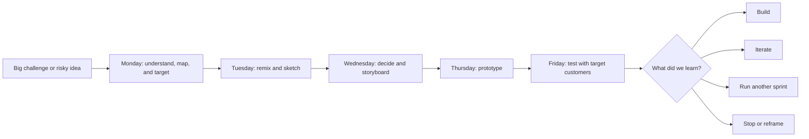
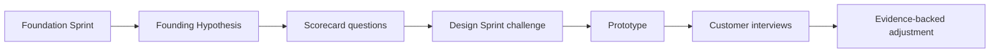

# Design Sprint Detailed Guide and PM-Skills Source Notes

## Purpose of This Document

This document is a detailed explanatory guide to Design Sprints, written as source material for `product-on-purpose/pm-skills`. It explains what Design Sprints are, when to use them, how the five-day process works, what artifacts they produce, and how they can be translated into best-in-class PM skills. (confidence: high)

This guide is not intended to replace the original Design Sprint book, GV guide, Google Design Sprint Kit, Character guide, or practitioner templates. It is intended to convert those sources into a structured knowledge base that can support reusable skills, workflows, commands, templates, and facilitation materials. (confidence: high)

## One-Sentence Definition

A Design Sprint is a timeboxed, five-day process for answering important business, product, or service questions by mapping a challenge, sketching solutions, choosing a direction, building a realistic prototype, and testing it with target customers. (confidence: high)

## Working Definition for PM-Skills

For `pm-skills`, define a Design Sprint as:

> A structured, five-day product decision workflow that helps a cross-functional team reduce risk before investing in full buildout by creating and testing a realistic prototype with target customers.

This definition is intentionally product-management oriented. It highlights the PM value of Design Sprints: turning uncertainty into a concrete prototype, observable customer reactions, and an evidence-based next decision. (confidence: high)

## Core Claim

The core value of a Design Sprint is not speed by itself. The value is the combination of speed, decision discipline, prototype realism, customer evidence, and cross-functional alignment. (confidence: high)

A team can move fast in many ways. A Design Sprint is useful when speed needs to be paired with a high-quality decision about a risky idea. (confidence: high)

## Origins and Canonical Sources

The Design Sprint approach is associated most strongly with Jake Knapp and the Google Ventures team, including John Zeratsky, Braden Kowitz, Michael Margolis, and Daniel Burka. It was developed through work at Google and GV and popularized through the book `Sprint: How to Solve Big Problems and Test New Ideas in Just Five Days`. (confidence: high)

GV describes the sprint as a five-day process for answering critical business questions through design, prototyping, and customer testing. Character Capital, founded by Jake Knapp and John Zeratsky, continues to publish a current guide that preserves the five-day structure and adds updated guidance for remote and AI-era product work. (confidence: high)

Wikipedia summarizes Design Sprint as a time-constrained, five-phase process using design thinking to reduce the risk of bringing a new product, service, or feature to market. Use Wikipedia as a helpful overview, not as the canonical process source. (confidence: high)

## Conceptual Model



The flow matters because each day narrows ambiguity. Monday narrows the problem. Tuesday expands possible solutions. Wednesday narrows solutions into a testable storyboard. Thursday converts the storyboard into a realistic artifact. Friday converts customer reactions into a decision. (confidence: high)

## What a Design Sprint Is Good For

Use a Design Sprint when the team needs to test a significant product, service, or business idea before committing substantial delivery effort. (confidence: high)

1. **New product or new service concept**. Use the sprint to test whether a proposed experience makes sense to target customers before building the full product. (confidence: high)
2. **Major feature or workflow redesign**. Use the sprint when the team knows the current experience is not working but has multiple possible solution directions. (confidence: high)
3. **High-risk assumption**. Use the sprint when the team has an assumption that could invalidate the initiative if wrong. (confidence: high)
4. **Unclear customer reaction**. Use the sprint when stakeholders are debating what customers will understand, trust, value, or choose. (confidence: high)
5. **Cross-functional misalignment**. Use the sprint when PM, design, engineering, leadership, sales, marketing, or customer-facing teams have different mental models of the problem. (confidence: high)
6. **Complex strategy-to-experience translation**. Use the sprint when the strategic idea is clear enough to test but not yet concrete enough to build. (confidence: high)
7. **Early validation after a Foundation Sprint**. Use the sprint to test a Founding Hypothesis through a prototype and customer interviews. (confidence: high)

## What a Design Sprint Is Not Good For

Do not use a Design Sprint when the team lacks enough context to choose a target, does not have access to target customers, or is unwilling to make decisions during the week. (confidence: high)

1. **No clear challenge**. A sprint needs a challenge large enough to matter and specific enough to target. (confidence: high)
2. **Pure discovery with no candidate direction**. Use problem framing, research, or a Foundation Sprint first. (confidence: high)
3. **Stakeholder theater**. A sprint will not help if leadership has already made the decision and only wants workshop validation. (confidence: high)
4. **Implementation planning only**. Use delivery planning, PRD, roadmap, or execution skills instead. (confidence: high)
5. **No customer access**. Friday testing is central to the method. Without target participants, the sprint becomes an internal design workshop. (confidence: high)
6. **No Decider**. Without a decision maker, the sprint can generate artifacts but fail to create commitment. (confidence: high)
7. **Low-stakes tweaks**. Small UX copy changes, minor settings, and low-risk improvements usually do not need a full sprint. (confidence: high)

## The Design Sprint Team

A strong Design Sprint team is small, cross-functional, and decision-capable. Character recommends seven people or fewer, with a Decider, facilitator, and people who work on the project day-to-day. (confidence: high)

| Role | Why it matters | Required? |
|---|---|---|
| Decider | Makes final calls when votes or discussion do not converge | Yes |
| Facilitator | Protects process, timing, participation, and decision hygiene | Yes |
| Product manager | Owns problem context, business context, continuity, and follow-up | Yes |
| Designer | Leads sketching, interaction quality, storyboarding, and prototype realism | Usually |
| Engineer or technical lead | Grounds feasibility and uncovers constraints | Usually |
| Researcher or interviewer | Improves interview design, recruiting, and synthesis quality | Strongly recommended |
| Customer expert | Adds real customer knowledge from sales, support, success, or research | Usually |
| Extra experts | Provide cameo expertise on Monday without joining the full week | Optional |

The Decider role should not be symbolic. If the Decider cannot attend the full sprint, they should attend critical moments or appoint a delegate who can make binding calls. (confidence: high)

## Pre-Sprint Readiness Checklist

A Design Sprint needs preparation before Monday begins. (confidence: high)

1. **Challenge selected**. The challenge is important, high-risk, and specific enough to target in one week. (confidence: high)
2. **Decider confirmed**. The decision maker or delegated decision maker is available for critical moments. (confidence: high)
3. **Team recruited**. The team has seven or fewer core members with diverse expertise. (confidence: high)
4. **Expert interviews scheduled**. Additional experts are scheduled for Monday if needed. (confidence: high)
5. **Customer recruiting started**. Friday participants are identified or recruiting is already in motion. (confidence: high)
6. **Research packet prepared**. Prior research, analytics, customer examples, support tickets, competitive context, and constraints are collected. (confidence: high)
7. **Logistics reserved**. Room, whiteboards, remote board, video tools, snacks, and interview setup are ready. (confidence: high)
8. **Calendar blocked**. The team has uninterrupted time for the sprint. (confidence: high)
9. **Post-sprint path exists**. The team knows who will act on the results after Friday. (confidence: high)

## Five-Day Breakdown

## Monday: Understand, Map, and Target

Monday creates shared understanding and selects the target. (confidence: high)

1. **Explain the sprint**. Align the team on the week, roles, process, and expected outputs. (confidence: high)
2. **Set a long-term goal**. Ask where the team wants to be in six months, one year, or five years. (confidence: high)
3. **List sprint questions and risks**. Convert fears into questions that can be answered through the sprint. (confidence: high)
4. **Map the customer journey**. Create a simple flow from customer or key player to desired outcome, usually five to fifteen steps. (confidence: high)
5. **Ask experts**. Interview internal or external experts to uncover customer knowledge, technical constraints, market context, and prior attempts. (confidence: high)
6. **Capture How Might We notes**. Reframe problems as opportunities. (confidence: high)
7. **Organize and vote on How Might We notes**. Cluster themes and identify high-value opportunities. (confidence: high)
8. **Pick the target**. The Decider selects the customer and target moment for the sprint. (confidence: high)

| Artifact | Purpose |
|---|---|
| Long-term goal | Defines the desired future state |
| Sprint questions | Defines what must be learned |
| Customer map | Frames the journey or system to target |
| HMW clusters | Captures opportunity areas |
| Target moment | Focuses the rest of the sprint |

PM-skills interpretation: Monday is a structured problem-targeting day. The most important output is not the map itself. The most important output is the chosen target and the sprint questions the prototype must answer. (confidence: high)

## Tuesday: Remix, Improve, and Sketch

Tuesday moves from problem understanding to solution exploration. (confidence: high)

1. **Lightning demos**. Review relevant solutions from inside and outside the company. Capture useful patterns. (confidence: high)
2. **Divide or swarm**. Decide whether individuals should sketch different parts of the map or all sketch the same target. (confidence: high)
3. **Four-step sketch**. Use notes, ideas, Crazy 8s, and solution sketches to produce concrete solution concepts. (confidence: high)
4. **Start or continue recruiting customers**. Keep Friday testing on track. (confidence: high)

| Artifact | Purpose |
|---|---|
| Lightning demo board | Captures reusable inspiration patterns |
| Sketch assignment | Clarifies what each person is solving |
| Solution sketches | Makes ideas concrete enough to compare |
| Recruiting tracker | Keeps customer testing viable |

PM-skills interpretation: Tuesday is not a brainstorming day in the loose sense. It is structured individual work. The method favors working alone together because concrete, independent sketches reduce groupthink and status bias. (confidence: high)

## Wednesday: Decide and Storyboard

Wednesday converts competing sketches into a testable plan. (confidence: high)

1. **Art museum**. Post all solution sketches anonymously. (confidence: high)
2. **Heat map**. Team members silently mark promising parts. (confidence: high)
3. **Speed critique**. Discuss each sketch briefly, capturing strengths and concerns. (confidence: high)
4. **Straw poll**. Team members choose favorites. (confidence: high)
5. **Supervote**. The Decider chooses what will be prototyped. (confidence: high)
6. **Rumble or all-in-one**. Decide whether to test multiple competing prototypes or one combined prototype. (confidence: high)
7. **Storyboard**. Build a five-to-fifteen-step storyboard that guides Thursday’s prototype work. (confidence: high)

| Artifact | Purpose |
|---|---|
| Heat map | Shows where the team sees promise |
| Critique notes | Captures rationale and concerns |
| Supervote record | Shows what the Decider selected |
| Prototype decision | Defines single prototype or Rumble |
| Storyboard | Gives Thursday a build plan |

PM-skills interpretation: Wednesday is the decision bottleneck. The Design Sprint succeeds or fails here. A weak storyboard creates a weak prototype. A weak prototype creates noisy customer evidence. (confidence: high)

## Thursday: Prototype

Thursday turns the storyboard into a realistic prototype. (confidence: high)

1. **Choose fast, flexible tools**. Use tools optimized for prototype speed, not production quality. (confidence: high)
2. **Assign roles**. Common roles include Maker, Stitcher, Writer, Asset Collector, and Interviewer. (confidence: high)
3. **Build the prototype**. Build just enough realism to generate honest customer reactions. (confidence: high)
4. **Stitch and review**. Ensure the prototype feels coherent from the customer perspective. (confidence: high)
5. **Run a trial**. Test the prototype before Friday. (confidence: high)
6. **Write the interview script**. Prepare the flow for customer testing. (confidence: high)
7. **Confirm participants**. Reduce no-show risk. (confidence: high)

| Artifact | Purpose |
|---|---|
| Prototype role plan | Divides work and protects time |
| Realistic prototype | Creates the test stimulus |
| Trial-run notes | Finds gaps before customer testing |
| Interview script | Standardizes Friday interviews |
| Participant schedule | Keeps testing operational |

PM-skills interpretation: Prototype quality should be Goldilocks quality: realistic enough to get believable reactions, but not so polished that the team wastes effort or becomes attached. (confidence: high)

## Friday: Test and Decide

Friday converts the prototype into learning. (confidence: high)

1. **Set up interviews**. Use one interview room and one observation room when possible. (confidence: high)
2. **Run five customer interviews**. Five interviews are typically enough for major patterns to emerge in a sprint context. (confidence: high)
3. **Use a Five-Act Interview**. Welcome, context questions, prototype introduction, tasks and nudges, debrief. (confidence: high)
4. **Observe together**. The team watches and captures notes. (confidence: high)
5. **Use a scorecard**. Add rows for sprint questions, risks, Foundation Sprint hypotheses, or prototype assumptions. (confidence: high)
6. **Vote yes or no after interviews**. Convert observations into explicit answers. (confidence: high)
7. **Summarize hot takes and next steps**. The Decider chooses the path forward. (confidence: high)

| Artifact | Purpose |
|---|---|
| Interview notes | Captures direct observations and quotes |
| Scorecard | Converts interviews into answers |
| Yes/no decisions | Makes evidence actionable |
| Hot takes | Surfaces team interpretation |
| Next-step memo | Converts learning into action |

PM-skills interpretation: Friday is not generic usability testing. It is decision-oriented prototype testing. The output should answer the sprint questions well enough to choose what to do next. (confidence: high)

## Design Sprint Artifacts

| Stage | Artifact | Good artifact test |
|---|---|---|
| Readiness | Sprint brief | A new participant can understand the challenge and why it matters |
| Monday | Long-term goal | The goal is aspirational but still connected to the sprint challenge |
| Monday | Sprint questions | Questions are answerable through a prototype test |
| Monday | Customer map | The target moment is visible and specific |
| Monday | HMW notes | Opportunities are phrased constructively |
| Tuesday | Lightning demo board | Inspiration is specific enough to reuse |
| Tuesday | Solution sketches | Each sketch is understandable without explanation |
| Wednesday | Decision record | It is clear what the Decider chose and why |
| Wednesday | Storyboard | The team can prototype from it without reopening abstract debate |
| Thursday | Prototype | Target customers can react as if it were real enough |
| Thursday | Interview script | Questions are open-ended and non-leading |
| Friday | Scorecard | Each sprint question receives a clear evidence-backed signal |
| Friday | Readout | The team knows whether to build, iterate, test again, or stop |

## Quality Rubric for a Design Sprint

| Dimension | Strong signal | Weak signal |
|---|---|---|
| Challenge quality | High-stakes, specific, answerable in one week | Vague, huge, or low-stakes |
| Team composition | Small, cross-functional, Decider present | Too many people or no decision authority |
| Problem framing | Clear long-term goal, risks, map, and target | General discussion without focus |
| Solution exploration | Independent sketches and concrete alternatives | Group brainstorming and verbal ideas |
| Decision hygiene | Votes inform decisions, Decider decides | Consensus drift or executive override without rationale |
| Prototype realism | Real enough to trigger honest reactions | Too fake to learn from or too polished to change |
| Customer testing | Target participants, open questions, direct observation | Internal review or leading questions |
| Synthesis | Sprint questions answered with evidence | Anecdotes without decisions |
| Handoff | Clear next step and owner | Interesting learning with no action |

## Common Failure Modes

1. **Starting without a Decider**. The team may produce work but fail to commit to a direction. (confidence: high)
2. **Choosing too broad a challenge**. The team cannot map, sketch, prototype, or test the whole thing in one week. (confidence: high)
3. **Using group brainstorming instead of individual sketching**. This increases bias and reduces solution diversity. (confidence: high)
4. **Treating the prototype as a deliverable**. The prototype is a learning tool, not a product artifact. (confidence: high)
5. **Testing with the wrong people**. The results may be misleading even if interviews are well run. (confidence: high)
6. **Asking leading questions**. The interview may confirm the team’s beliefs instead of testing them. (confidence: high)
7. **Failing to make a decision on Friday**. The sprint loses much of its value if learning does not change action. (confidence: high)
8. **Skipping follow-up ownership**. Customer learning decays quickly if nobody owns the next step. (confidence: high)

## Variants and Adaptations

## Remote Design Sprint

Remote Design Sprints are viable when the team has a strong facilitator, a reliable digital whiteboard, good video setup, and disciplined attention management. (confidence: high)

1. Use shorter blocks and more breaks. (confidence: medium)
2. Prepare the board more heavily before the sprint. (confidence: high)
3. Assign a board operator or co-facilitator. (confidence: medium)
4. Confirm participant tech before Friday. (confidence: high)
5. Use explicit working agreements around cameras, chat, notifications, and decision moments. (confidence: high)

## Follow-Up Sprint

A follow-up sprint after the first sprint can be shorter because the team may already have the map, target, customer access, and prototype base. (confidence: medium)

Use a follow-up sprint when Friday shows a promising but flawed concept. (confidence: high)

## Rumble Sprint

A Rumble compares two or three competing prototype directions. (confidence: high)

Use a Rumble when the Decider needs evidence about which strategic direction or concept customers understand, prefer, or trust. (confidence: high)

## Hardware or Service Sprint

Design Sprints can work beyond software if the team uses a prototype mindset. Hardware prototypes may use modified existing products, 3D printing, service role-play, storyboard simulations, or brochure facades. (confidence: medium)

## How Design Sprints Connect to Foundation Sprints

Foundation Sprints help teams choose a strategic hypothesis. Design Sprints help teams test that hypothesis. (confidence: high)



A strong Design Sprint following a Foundation Sprint should use the Founding Hypothesis to define Friday’s scorecard. (confidence: high)

Example Foundation Sprint scorecard questions that become Design Sprint questions:

1. Do we have the right customer? (confidence: high)
2. Do they care enough about the problem? (confidence: high)
3. Does the chosen approach make sense to them? (confidence: high)
4. Would they choose this over the competitor or workaround? (confidence: high)
5. Do the differentiators matter? (confidence: high)
6. Does the promise click? (confidence: high)

## How to Translate Design Sprints Into PM-Skills

For `pm-skills`, Design Sprint content should become a combination of atomic skills, workflows, commands, and templates. (confidence: high)

## Recommended Skill Family

| Skill slug | Purpose | Primary output |
|---|---|---|
| `design-sprint-readiness` | Decide if a Design Sprint is appropriate | Sprint readiness assessment |
| `design-sprint-brief` | Prepare the team and challenge | Sprint brief |
| `design-sprint-long-term-goal-and-risks` | Frame Monday’s goal and questions | Goal and sprint questions |
| `design-sprint-map-and-target` | Map the customer flow and choose a target | Map and target moment |
| `design-sprint-expert-interviews-hmw` | Capture expert input and opportunities | Expert notes and HMW clusters |
| `design-sprint-lightning-demos` | Gather inspiration | Lightning demo board |
| `design-sprint-four-step-sketch` | Generate independent solution concepts | Solution sketches |
| `design-sprint-sticky-decision` | Choose what to prototype | Decision record |
| `design-sprint-storyboard` | Plan the prototype | Storyboard |
| `design-sprint-prototype-plan` | Assign Thursday roles and quality bar | Prototype plan |
| `design-sprint-interview-script` | Prepare customer testing | Interview script |
| `design-sprint-scorecard` | Convert observations into answers | Interview scorecard |
| `design-sprint-readout` | Summarize results and next steps | Sprint readout |
| `design-sprint-handoff` | Convert learning into PM artifacts | PRD, experiment, iteration, or stop recommendation |

## Recommended Workflow

```text
workflow: design-sprint
inputs:
  - product challenge
  - existing research or context packet
  - decision owner
  - target customer hypothesis
  - team roster
  - customer recruiting plan
outputs:
  - tested prototype
  - scorecard answers
  - evidence-backed recommendation
  - follow-up artifact
steps:
  1. readiness assessment
  2. sprint brief
  3. Monday map and target
  4. Tuesday sketching
  5. Wednesday decision and storyboard
  6. Thursday prototype and interview prep
  7. Friday interviews and scorecard
  8. readout and handoff
```

## Recommended Commands

| Command | Purpose |
|---|---|
| `/design-sprint-readiness` | Determine whether the team should run a Design Sprint |
| `/design-sprint-plan` | Generate the sprint brief, agenda, role plan, and prep checklist |
| `/design-sprint-day-1` | Facilitate Monday outputs |
| `/design-sprint-day-2` | Facilitate Tuesday outputs |
| `/design-sprint-day-3` | Facilitate Wednesday outputs |
| `/design-sprint-day-4` | Facilitate Thursday prototype planning |
| `/design-sprint-day-5` | Facilitate Friday scorecard and readout |
| `/design-sprint-readout` | Produce executive summary and next-step recommendation |

## Template: Design Sprint Brief

```md
# Design Sprint Brief

## Challenge
- Challenge title:
- Why now:
- Business risk:
- Customer risk:
- Product risk:

## Sprint Goal
- Long-term goal:
- What we need to learn this week:
- Decision we need to make after Friday:

## Team
| Role | Name | Required availability |
|---|---|---|
| Decider |  |  |
| Facilitator |  |  |
| PM |  |  |
| Design |  |  |
| Engineering |  |  |
| Research / Interviewer |  |  |
| Customer expert |  |  |

## Known Inputs
- Existing research:
- Analytics:
- Customer examples:
- Support or sales signals:
- Competitive context:
- Constraints:

## Customer Testing
- Target participant profile:
- Recruiting source:
- Number of participants:
- Incentive:
- Interview format:

## Definition of Sprint Success
- We have a realistic prototype.
- We test with target customers.
- We answer the sprint questions.
- We decide what to do next.
```

## Template: Friday Scorecard

```md
# Friday Design Sprint Scorecard

## Sprint Questions
1. 
2. 
3. 
4. 
5. 

## Interview Grid
| Question | Customer 1 | Customer 2 | Customer 3 | Customer 4 | Customer 5 | Final signal |
|---|---|---|---|---|---|---|
| Question 1 |  |  |  |  |  |  |
| Question 2 |  |  |  |  |  |  |
| Question 3 |  |  |  |  |  |  |
| Question 4 |  |  |  |  |  |  |
| Question 5 |  |  |  |  |  |  |

## Pattern Summary
- Strong positive signals:
- Strong negative signals:
- Confusing signals:
- Unexpected findings:

## Decision
- Build:
- Iterate:
- Run another sprint:
- Stop:
- Reframe:

## Follow-Up Owner
- Owner:
- Next artifact:
- Due date:
```

## Recommended Source Weighting

| Source | Weight | Why |
|---|---:|---|
| GV Design Sprint guide | Very high | Original public guide and five-day structure |
| Character Design Sprint guide | Very high | Current guide from Jake Knapp and John Zeratsky |
| Sprint book | Very high | Full canonical book-length method |
| Google Design Sprint Kit | High | Google-hosted methodology overview and community resources |
| Wikipedia | Medium | Good neutral overview, but not canonical enough for skill design by itself |
| Miro and AJ&Smart templates | Medium | Useful for board structure and remote implementation |
| IDEO sprint articles | Medium | Useful practitioner perspective, not canonical process source |

## Source List

Primary sources:

1. GV: The Design Sprint: https://www.gv.com/sprint/
2. Character Capital: Design Sprint guide: https://www.character.vc/guide/design-sprint
3. Google Design Sprint Kit: Methodology overview: https://designsprintkit.withgoogle.com/methodology/overview
4. Sprint book official site: https://www.thesprintbook.com/
5. Wikipedia: Design sprint: https://en.wikipedia.org/wiki/Design_sprint

Related source material:

1. Character Capital: Foundation Sprint guide: https://www.character.vc/guide/foundation-sprint
2. Character Capital: Note and Vote guide: https://www.character.vc/guide/note-and-vote
3. Miro: Design Sprint by Jake Knapp template: https://miro.com/templates/design-sprint-jake-knapp/
4. Miro: Remote 5-day Design Sprint template: https://miro.com/templates/remote-design-sprint/
5. AJ&Smart: Remote Design Sprint template: https://www.ajsmart.com/remote-design-sprint-template
6. IDEO: Tips for running a successful design sprint: https://www.ideo.com/blog/tips-for-running-a-successful-design-sprint
7. IDEO: Tips for productive sprints: https://www.ideo.com/blog/tips-for-productive-sprints

## Open Questions and Uncertainties

1. I do not know whether `pm-skills` should model Design Sprint days as separate skills, one full workflow, or both. My recommendation is both. (confidence: high)
2. I do not know whether the repo should include Miro board exports, board-generation prompts, or plain Markdown templates only. (confidence: high)
3. I do not know whether the first audience should be solo PMs using an AI assistant, trained facilitators, or cross-functional sprint teams. (confidence: medium)
4. The Google Design Sprint Kit page previously loaded with limited extractable text, so GV and Character should be treated as stronger procedural sources for the detailed breakdown. (confidence: high)
