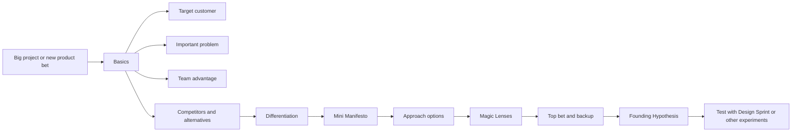

# Foundation Sprint Detailed Guide and PM-Skills Source Notes

## Purpose of This Document

This document is a detailed explanatory guide to Foundation Sprints, written as source material for `product-on-purpose/pm-skills`. It explains what Foundation Sprints are, when to use them, how the two-day process works, what artifacts they produce, and how they can be translated into best-in-class PM skills. (confidence: high)

This guide treats Foundation Sprint as a strategic alignment and hypothesis-forming method. It is closely related to Design Sprint, but it is not the same thing. Foundation Sprint helps a team decide what strategic promise to test. Design Sprint helps a team test that promise with a realistic prototype and target customers. (confidence: high)

## One-Sentence Definition

A Foundation Sprint is a two-day workshop for aligning a small team at the beginning of a big project around the target customer, important problem, team advantage, competitive differentiation, solution approach, and Founding Hypothesis. (confidence: high)

## Working Definition for PM-Skills

For `pm-skills`, define a Foundation Sprint as:

> A structured product-strategy workflow that helps a team at the start of a major initiative make fast, explicit, testable decisions about who the product is for, what problem it solves, why it can win, how it should differentiate, and what approach should be validated next.

This definition is intentionally broader than a workshop agenda. It frames Foundation Sprint as a repeatable PM capability for turning implicit strategic beliefs into explicit hypotheses. (confidence: high)

## Core Claim

The core value of a Foundation Sprint is not merely alignment. The value is converting fuzzy early-stage product beliefs into a simple, testable strategic promise. (confidence: high)

A team that leaves with only shared language has improved alignment. A team that leaves with a Founding Hypothesis has a testable direction. (confidence: high)

## Origins and Canonical Sources

The Foundation Sprint was developed by Jake Knapp and John Zeratsky after their Design Sprint work and their investing work at Character Capital. (confidence: high)

Character describes Foundation Sprint as a two-day workshop for teams at the beginning of a big project. On day one, teams define the basics and craft differentiation. On day two, teams evaluate options and choose an approach. The output is a Founding Hypothesis that can be tested in a Design Sprint. (confidence: high)

Design Sprint Academy describes Foundation Sprint as a structured, fast-paced two-day workshop that aligns teams around a clear direction at the start of big, new projects. It emphasizes that Foundation Sprint depends on the team’s existing knowledge and is not deep discovery. (confidence: high)

Lenny’s Newsletter published a detailed introduction by Jake Knapp and John Zeratsky explaining the Founding Hypothesis and the Foundation Sprint structure, including target customer, important customer problem, advantage, competitors, differentiation, and the relationship to Design Sprints. (confidence: high)

## Conceptual Model



The process deliberately moves from customer and problem clarity to differentiation, then from differentiation to approach selection, then from approach selection to a testable hypothesis. (confidence: high)

## What a Foundation Sprint Is Good For

Use a Foundation Sprint when the team is beginning a significant product, company, feature, service, or strategic initiative and needs a fast, explicit direction. (confidence: high)

1. **Starting a big new project**. Use Foundation Sprint when the initiative is important enough that an unclear starting point would be expensive. (confidence: high)
2. **Choosing among possible approaches**. Use it when the team has several plausible directions and needs to choose a top bet and backup. (confidence: high)
3. **Aligning on customer and problem**. Use it when different stakeholders describe the customer or problem differently. (confidence: high)
4. **Clarifying differentiation**. Use it when the team cannot clearly explain why customers would choose this over alternatives. (confidence: high)
5. **Stress-testing a solution idea**. Use it when a team has a solution in mind but has not made its assumptions explicit. (confidence: high)
6. **Preparing for a Design Sprint**. Use it before the first Design Sprint when the team has not yet chosen the strategic promise or key hypothesis to test. (confidence: high)
7. **Making implicit founder or executive beliefs visible**. Use it when strong opinions exist but are scattered across people’s heads, decks, conversations, or assumptions. (confidence: high)

## What a Foundation Sprint Is Not Good For

Do not use a Foundation Sprint as a substitute for problem discovery, customer research, market research, or product strategy when the team lacks enough shared knowledge to make informed choices. (confidence: high)

1. **No real initiative yet**. If there is no concrete project, opportunity, product area, or strategic question, the sprint will be too abstract. (confidence: high)
2. **No customer knowledge**. Foundation Sprint assumes the team has some meaningful knowledge of customers and alternatives. (confidence: high)
3. **Need for deep problem exploration**. Use problem framing, research planning, or discovery first. (confidence: high)
4. **No decision maker**. Foundation Sprint requires fast strategic decisions. Without a Decider, the team may only generate options. (confidence: high)
5. **Pure validation need**. If the team already has a clear hypothesis and needs customer reaction, use a Design Sprint. (confidence: high)
6. **Low-stakes prioritization**. If the decision is minor, a smaller prioritization or decision skill is more appropriate. (confidence: high)
7. **Political consensus exercise**. If the organization wants consensus without making tradeoffs, Foundation Sprint will likely expose conflict but not resolve it. (confidence: medium)

## Foundation Sprint Compared to Design Sprint

| Dimension | Foundation Sprint | Design Sprint |
|---|---|---|
| Primary purpose | Choose the strategic promise and approach | Test a risky idea with customers |
| Duration | Two days | Five days |
| Core output | Founding Hypothesis | Tested prototype and scorecard |
| Best timing | Beginning of a big project | After a challenge or hypothesis is clear |
| Main question | What should we believe and test? | Do customers understand, value, and respond to this? |
| Primary evidence | Team knowledge, structured comparison, decision logic | Customer interviews and prototype reactions |
| Main risk | False confidence from weak inputs | Noisy learning from weak prototype or wrong participants |
| Typical next step | Design Sprint, customer research, experiment, or strategy revision | Build, iterate, retest, or stop |

Foundation Sprint is upstream of Design Sprint when the team does not yet know what to test. Design Sprint is downstream when the team has a hypothesis or concept that can be prototyped. (confidence: high)

## The Founding Hypothesis

The Founding Hypothesis is the central artifact of the Foundation Sprint. (confidence: high)

A practical structure is:

```text
If we help [target customer] solve [important problem] with [approach], they will choose it over [competitors or alternatives] because our solution is [differentiators].
```

This sentence matters because it forces the team to state the customer, problem, approach, competition, and differentiation in one coherent promise. (confidence: high)

A good Founding Hypothesis is:

1. **Specific**. It names a real customer and a real problem. (confidence: high)
2. **Comparative**. It explains what customers choose instead today. (confidence: high)
3. **Differentiated**. It states why this solution should win. (confidence: high)
4. **Testable**. It can be translated into scorecard questions and experiments. (confidence: high)
5. **Simple**. Customers should be able to understand the promise quickly. (confidence: high)
6. **Uncomfortable enough to be useful**. If nobody disagrees or feels exposed, the hypothesis may be too vague. (confidence: medium)

## The Foundation Sprint Team

A strong Foundation Sprint team is smaller than a typical workshop group. Character and Lenny’s recommend a tiny team of no more than five people, including the Decider. (confidence: high)

| Role | Why it matters | Required? |
|---|---|---|
| Decider | Makes the final strategic calls | Yes |
| Facilitator | Protects pace, process, decision hygiene, and participation | Yes |
| Product manager or product lead | Brings customer, product, and business context | Usually |
| Customer expert | Brings customer understanding from research, sales, success, support, or marketing | Usually |
| Technical expert | Grounds possible approaches in feasibility and constraints | Usually |
| Design or product strategy lead | Helps visualize options and shape differentiation | Usually |
| Growth or marketing expert | Grounds promise, channel, positioning, and competitive reality | Helpful |
| Executive or founder | Useful when strategy, company advantage, or direction is being set | Often |

The team should balance decision authority and hands-on knowledge. A group with only executives may become abstract. A group with only practitioners may lack strategic authority. (confidence: high)

## Pre-Sprint Readiness Checklist

Use this checklist before running a Foundation Sprint:

1. **Initiative is defined**. The team can name the project or product area. (confidence: high)
2. **The stakes are meaningful**. A wrong starting direction would be costly. (confidence: high)
3. **The team has existing knowledge**. There is enough customer, market, competitor, or domain context to make informed choices. (confidence: high)
4. **The Decider is available**. Strategic choices can be made during the sprint. (confidence: high)
5. **The team is small enough**. No more than five core decision participants is preferred. (confidence: high)
6. **Inputs are collected**. Existing research, customer examples, competitor notes, metrics, sales insights, and constraints are available. (confidence: high)
7. **The output has a path to testing**. The team can use a Design Sprint, experiment, customer research, or another validation method afterward. (confidence: high)
8. **The organization can tolerate explicit tradeoffs**. Foundation Sprint requires choosing one top bet and a backup, not preserving every possibility. (confidence: high)

## Two-Day Breakdown

## Day 1 Morning: Basics

Day 1 morning defines the fundamentals that should inform every major decision about the initiative. (confidence: high)

1. **Choose a target customer**. Use plain language to define real people or organizations, not vague segments. (confidence: high)
2. **Choose an important customer problem**. Identify a pain strong enough to justify switching, paying, learning, or adopting. (confidence: high)
3. **Identify the team’s advantage**. Clarify the capability, insight, motivation, relationship, data, technology, distribution, or timing advantage that makes this team credible. (confidence: high)
4. **List competitors and alternatives**. Include direct competitors, substitute workflows, manual workarounds, internal tools, and doing nothing. (confidence: high)
5. **Use Note-and-Vote**. Capture independent input, vote silently, discuss briefly, and let the Decider decide. (confidence: high)

| Artifact | Purpose |
|---|---|
| Target customer statement | Defines who the product is for |
| Important problem statement | Defines why the customer should care |
| Advantage inventory | Defines why this team has a right to win |
| Competitor and alternative map | Defines what customers do instead |
| Basics decision log | Captures choices and rationale |

PM-skills interpretation: The Basics are often obvious, but they are not easy. The sprint forces the team to make basic assumptions explicit and choose one interpretation instead of carrying multiple hidden interpretations forward. (confidence: high)

## Day 1 Afternoon: Differentiation

Day 1 afternoon defines how the product can stand apart from competition and alternatives. (confidence: high)

1. **Score classic differentiators**. Evaluate where the solution could stand out on common customer-perceived dimensions. (confidence: high)
2. **Generate custom differentiators**. Create dimensions specific to the market, product, team, or customer situation. (confidence: high)
3. **Choose differentiators**. Use voting and Decider judgment to choose two differentiators to try first. (confidence: high)
4. **Create a 2x2 differentiation chart**. Use a chart focused on customer perception to show how the product could occupy a meaningfully different position. (confidence: high)
5. **Write practical principles**. Convert differentiation into decision principles that guide future product choices. (confidence: high)
6. **Fill out the Mini Manifesto**. Combine differentiation and principles into a one-page strategic artifact. (confidence: high)

| Artifact | Purpose |
|---|---|
| Differentiator candidates | Shows possible ways to stand out |
| Differentiator scores | Shows perceived relative advantage |
| Chosen differentiators | Defines what the product will try to be known for |
| 2x2 differentiation chart | Visualizes customer-perceived position |
| Principles | Guides future design and strategy choices |
| Mini Manifesto | Summarizes Day 1’s strategic direction |

PM-skills interpretation: Differentiation is not just a marketing claim. In Foundation Sprint, differentiation becomes a product decision constraint. If the team chooses “fast,” “simple,” or “trustworthy,” those words must shape the product approach and later prototype. (confidence: high)

## Day 2 Morning: Options

Day 2 morning generates possible approaches before the team commits to one direction. (confidence: high)

1. **List possible approaches**. Generate multiple paths for solving the chosen customer problem. (confidence: high)
2. **Write one-page approach summaries**. Summaries should include what the approach is, why it is a good idea, and a simple doodle or visual explanation. (confidence: high)
3. **Select up to seven options**. The Decider chooses which options advance to comparison. (confidence: high)
4. **Assign identifiers**. Give each approach a color, letter, or label so patterns are easier to see during evaluation. (confidence: high)

| Artifact | Purpose |
|---|---|
| Approach list | Expands possible starting points |
| One-page approach summaries | Makes each option comparable |
| Option set | Defines what will be evaluated |
| Option labels | Helps comparison across lenses |

PM-skills interpretation: Day 2 prevents premature commitment. Teams often default to the first plausible solution. Foundation Sprint forces them to generate alternatives and compare them before choosing. (confidence: high)

## Day 2 Afternoon: Magic Lenses and Approach Selection

Day 2 afternoon compares approaches through multiple perspectives and selects a top bet and backup. (confidence: high)

1. **Use classic Magic Lenses**. Compare options through customer, pragmatic, growth, and money perspectives. (confidence: high)
2. **Place options on 2x2 charts**. Evaluate relative position across each lens. (confidence: high)
3. **Create custom lenses**. Add criteria relevant to the team, such as mission fit, founder excitement, customer pain, uniqueness, implementation path, or differentiation. (confidence: high)
4. **Review patterns**. Look across the charts for consistent winners, contradictions, and tradeoffs. (confidence: high)
5. **Decider chooses top bet and backup**. Select the primary approach and a fallback if testing invalidates the top bet. (confidence: high)
6. **Fill in the Founding Hypothesis**. Convert the decisions into one clear testable statement. (confidence: high)

| Artifact | Purpose |
|---|---|
| Magic Lens charts | Compare options from multiple perspectives |
| Pattern summary | Shows which options consistently perform well |
| Top bet | Defines first approach to test |
| Backup plan | Defines pivot path if top bet fails |
| Founding Hypothesis | Summarizes strategic promise |

PM-skills interpretation: The point is not to mathematically prove the best option. The point is to make tradeoffs visible, force a decision, and convert that decision into a hypothesis that can be tested. (confidence: high)

## After the Foundation Sprint

The Foundation Sprint does not prove the hypothesis. It produces the hypothesis. (confidence: high)

After the sprint, the team should test and adjust the Founding Hypothesis until it clicks with customers. Character explicitly connects this to running Design Sprints against the scorecard questions. (confidence: high)

Recommended next steps:

1. **Create a hypothesis scorecard**. Break the Founding Hypothesis into testable questions. (confidence: high)
2. **Identify the riskiest assumption**. Choose the assumption most likely to invalidate the strategy. (confidence: high)
3. **Choose validation method**. Use Design Sprint, customer interviews, landing page test, concierge test, prototype test, pricing test, or market experiment. (confidence: high)
4. **Run first validation cycle**. Do not let the hypothesis become a static strategy doc. (confidence: high)
5. **Revise or reaffirm**. Update the customer, problem, approach, competitor framing, or differentiation based on evidence. (confidence: high)

## Hypothesis Scorecard

| Hypothesis element | Test question | Evidence source | Confidence |
|---|---|---|---|
| Target customer | Do we have the right customer? | Interviews, usage, sales signals, prototype testing | Low / Medium / High |
| Important problem | Is the problem painful enough to motivate action? | Interviews, willingness to pay, behavior, support data | Low / Medium / High |
| Approach | Does the chosen approach make sense and feel valuable? | Prototype testing, concept testing, concierge trial | Low / Medium / High |
| Competitors and alternatives | Would customers choose this over what they do now? | Competitive interviews, switching behavior, win/loss data | Low / Medium / High |
| Differentiators | Do the differentiators matter to customers? | Prototype testing, message testing, interviews | Low / Medium / High |
| Credibility | Will customers believe the product can deliver the promise? | Sales calls, prototype reactions, brand trust signals | Low / Medium / High |
| Click | Does the whole promise feel simple and compelling? | Design Sprint, landing page test, customer reaction | Low / Medium / High |

## Foundation Sprint Artifacts

| Stage | Artifact | Good artifact test |
|---|---|---|
| Readiness | Sprint brief | The team knows the initiative, decision owner, and why the sprint matters |
| Day 1 Morning | Target customer statement | A customer-facing teammate can recognize the person or buyer |
| Day 1 Morning | Important problem statement | The problem is painful enough to justify switching or action |
| Day 1 Morning | Advantage inventory | The team can explain why it has a right to win |
| Day 1 Morning | Competitor and alternative map | Includes direct competitors, workarounds, and doing nothing |
| Day 1 Afternoon | Differentiator set | The differentiators are customer-perceived and product-relevant |
| Day 1 Afternoon | 2x2 differentiation chart | The chart expresses a plausible market position |
| Day 1 Afternoon | Principles | The principles guide future decisions, not just branding language |
| Day 1 Afternoon | Mini Manifesto | The strategic direction fits on one page |
| Day 2 Morning | Approach summaries | Each option can be compared fairly |
| Day 2 Afternoon | Magic Lens charts | Tradeoffs are visible from multiple perspectives |
| Day 2 Afternoon | Top bet and backup | The Decider has chosen a primary path and fallback |
| Day 2 End | Founding Hypothesis | The customer, problem, approach, competitors, and differentiators fit into one testable statement |
| After | Hypothesis scorecard | Each part of the hypothesis can be tested |

## Quality Rubric for a Foundation Sprint

| Dimension | Strong signal | Weak signal |
|---|---|---|
| Customer clarity | Specific customer, plain language, recognizable | Vague segment or internal persona label |
| Problem quality | Painful enough to justify action | Mild annoyance or internal business wish |
| Advantage | Specific capability, insight, motivation, asset, or access | Generic strength such as “great team” |
| Competition | Includes substitutes, workarounds, and doing nothing | Only lists obvious direct competitors |
| Differentiation | Customer-perceived and deliverable | Marketing claim the product cannot support |
| Options | Multiple plausible approaches considered | First idea becomes default |
| Lens evaluation | Tradeoffs visible across useful perspectives | Arbitrary scoring or fake precision |
| Decision quality | Decider chooses top bet and backup | Team avoids commitment |
| Founding Hypothesis | Simple, coherent, testable, comparative | Long, vague, or non-falsifiable |
| Follow-up path | Hypothesis becomes experiments or Design Sprint questions | Hypothesis becomes static strategy copy |

## Common Failure Modes

1. **Confusing alignment with validation**. The Foundation Sprint aligns the team and forms a hypothesis. It does not prove the strategy. (confidence: high)
2. **Running it without enough customer context**. The method depends on existing knowledge. Without context, the team may make confident guesses. (confidence: high)
3. **Letting executives dominate**. Senior leaders bring authority, but hands-on customer and product experts are needed for grounding. (confidence: high)
4. **Using vague customer segments**. Broad segments create weak hypotheses. (confidence: high)
5. **Ignoring “do nothing” as a competitor**. In many markets, inertia is the strongest alternative. (confidence: high)
6. **Choosing differentiators the product cannot deliver**. Differentiation is only useful if the team can make it true. (confidence: high)
7. **Falling in love with the top bet**. The top bet is the first test candidate, not a proof. (confidence: high)
8. **Skipping the backup plan**. Without a backup, invalidation can send the team back to ambiguous debate. (confidence: high)
9. **Failing to convert the hypothesis into tests**. The output loses value if it does not drive Design Sprints, experiments, or research. (confidence: high)

## Foundation Sprint Variants and Adaptations

## Enterprise Foundation Sprint

Large organizations often need more preparation than startups because customer knowledge, decision authority, technical context, and market insight may be distributed across many teams. (confidence: high)

1. Add pre-work to synthesize customer research, support themes, sales objections, usage data, and technical constraints. (confidence: high)
2. Include cameo experts instead of expanding the core team. (confidence: high)
3. Identify the real Decider and escalation path before the sprint. (confidence: high)
4. Document decisions with rationale and confidence. (confidence: high)
5. Translate the Founding Hypothesis into downstream artifacts such as PRDs, opportunity solution trees, JPD ideas, roadmap bets, or Design Sprint questions. (confidence: medium)

## Startup Foundation Sprint

Startups may use Foundation Sprint to clarify the initial product promise, especially when the founding team has strong intuition but inconsistent articulation. (confidence: high)

1. Keep the team extremely small. (confidence: high)
2. Focus heavily on differentiation and competitors. (confidence: high)
3. Treat the Founding Hypothesis as a living validation artifact. (confidence: high)
4. Follow quickly with prototype testing, founder-led sales conversations, or Design Sprints. (confidence: high)

## AI-Era Foundation Sprint

Character argues that when AI makes building faster, deciding what to build becomes more important. Foundation Sprint is especially relevant when teams can rapidly create many product options but still need a differentiated strategic promise. (confidence: medium)

1. Use AI to prepare inputs, not to replace decision-making. (confidence: high)
2. Use AI to generate alternative approaches, but force human Decider choices. (confidence: high)
3. Use AI to create first-draft scorecards, competitor maps, and hypothesis language. (confidence: high)
4. Use human customer evidence to test whether the promise actually clicks. (confidence: high)

## How Foundation Sprints Connect to PM-Skills

For `pm-skills`, Foundation Sprint content should become a strategy and decision skill family. (confidence: high)

It should connect to existing or future skills for:

1. Problem framing. (confidence: high)
2. Customer research synthesis. (confidence: high)
3. Competitive analysis. (confidence: high)
4. Hypothesis writing. (confidence: high)
5. Experiment design. (confidence: high)
6. Design Sprint planning. (confidence: high)
7. PRD creation. (confidence: high)
8. Roadmap bet framing. (confidence: high)
9. Executive narrative and readout. (confidence: high)

## Recommended PM-Skills Skill Family

| Skill slug | Purpose | Primary output |
|---|---|---|
| `foundation-sprint-readiness` | Decide if a Foundation Sprint is appropriate | Readiness assessment |
| `foundation-sprint-brief` | Prepare the sprint and team | Sprint brief |
| `foundation-sprint-target-customer` | Choose and refine the customer | Target customer statement |
| `foundation-sprint-important-problem` | Choose the customer problem | Problem statement |
| `foundation-sprint-advantage-inventory` | Clarify team advantage | Advantage inventory |
| `foundation-sprint-competitors-alternatives` | Map competitors and substitutes | Alternative map |
| `foundation-sprint-note-and-vote` | Run repeated fast decisions | Decision set |
| `foundation-sprint-differentiators` | Generate and choose differentiators | Differentiator set |
| `foundation-sprint-differentiation-chart` | Create customer-perceived positioning | 2x2 chart |
| `foundation-sprint-principles` | Turn differentiation into decision principles | Principles list |
| `foundation-sprint-mini-manifesto` | Summarize Day 1 | Mini Manifesto |
| `foundation-sprint-approach-options` | Generate possible approaches | Approach summaries |
| `foundation-sprint-magic-lenses` | Compare options across lenses | Lens charts |
| `foundation-sprint-top-bet-backup` | Choose primary and backup approach | Decision record |
| `foundation-sprint-founding-hypothesis` | Write the final hypothesis | Founding Hypothesis |
| `foundation-sprint-hypothesis-scorecard` | Turn the hypothesis into tests | Validation scorecard |
| `foundation-sprint-to-design-sprint` | Convert the hypothesis into a Design Sprint challenge | Design Sprint brief |
| `foundation-sprint-readout` | Summarize outcomes and next steps | Sprint readout |

## Recommended Workflow

```text
workflow: foundation-sprint
inputs:
  - product or project initiative
  - customer context
  - competitor or alternative context
  - existing research or insight packet
  - team roster
  - Decider
outputs:
  - target customer statement
  - important problem statement
  - advantage inventory
  - competitor and alternative map
  - differentiator set
  - Mini Manifesto
  - approach summaries
  - top bet and backup
  - Founding Hypothesis
  - hypothesis scorecard
  - next validation plan
steps:
  1. readiness assessment
  2. sprint brief
  3. Day 1 Morning: Basics
  4. Day 1 Afternoon: Differentiation
  5. Day 2 Morning: Options
  6. Day 2 Afternoon: Magic Lenses
  7. Founding Hypothesis
  8. Scorecard and next validation plan
  9. readout and handoff
```

## Recommended Commands

| Command | Purpose |
|---|---|
| `/foundation-sprint-readiness` | Determine whether the team should run a Foundation Sprint |
| `/foundation-sprint-plan` | Generate the sprint brief, agenda, role plan, and prep checklist |
| `/foundation-sprint-day-1` | Facilitate Basics and Differentiation outputs |
| `/foundation-sprint-day-2` | Facilitate Options, Magic Lenses, and Founding Hypothesis |
| `/foundation-to-design-sprint` | Convert the Founding Hypothesis into a Design Sprint brief |
| `/foundation-sprint-readout` | Produce executive summary and next-step recommendation |

## Template: Foundation Sprint Brief

```md
# Foundation Sprint Brief

## Initiative
- Initiative name:
- Why now:
- Strategic importance:
- Current uncertainty:

## Desired Output
- Founding Hypothesis:
- Top bet:
- Backup plan:
- Validation plan:

## Team
| Role | Name | Why they are in the room |
|---|---|---|
| Decider |  |  |
| Facilitator |  |  |
| Product lead |  |  |
| Customer expert |  |  |
| Technical expert |  |  |
| Design / strategy lead |  |  |
| Growth / marketing expert |  |  |

## Existing Inputs
- Customer research:
- Customer examples:
- Sales or support insights:
- Competitor notes:
- Usage or market data:
- Technical constraints:
- Business constraints:

## Readiness Check
- We know the initiative.
- We have a Decider.
- We have enough customer context to begin.
- We can name competitors and alternatives.
- We are willing to choose a top bet and backup.
- We have a validation path after the sprint.
```

## Template: Founding Hypothesis

```md
# Founding Hypothesis

## Basics
- Target customer:
- Important problem:
- Team advantage:
- Competitors and alternatives:

## Differentiation
- Differentiator 1:
- Differentiator 2:
- Supporting principles:

## Approach
- Top bet:
- Backup plan:

## Hypothesis Statement
If we help [target customer] solve [important problem] with [approach], they will choose it over [competitors or alternatives] because our solution is [differentiators].

## Why We Believe This
- Evidence or insight 1:
- Evidence or insight 2:
- Evidence or insight 3:

## What Could Prove Us Wrong
- Risk 1:
- Risk 2:
- Risk 3:

## Next Validation Step
- Method:
- Participants:
- Prototype or stimulus:
- Decision threshold:
- Owner:
```

## Template: Mini Manifesto

```md
# Mini Manifesto

## We Serve
[Target customer]

## We Solve
[Important problem]

## We Can Win Because
[Advantage]

## Customers Choose Instead
[Competitors, alternatives, workarounds, or doing nothing]

## We Will Differentiate By
1. [Differentiator 1]
2. [Differentiator 2]

## Our Decision Principles
1. [Principle 1]
2. [Principle 2]
3. [Principle 3]

## What This Means We Will Not Do
- [Tradeoff]
- [Tradeoff]
- [Tradeoff]
```

## Template: Magic Lens Evaluation

```md
# Magic Lens Evaluation

## Options
| Option | One-sentence description | Doodle or visual |
|---|---|---|
| A |  |  |
| B |  |  |
| C |  |  |
| D |  |  |

## Classic Lenses
| Lens | What it tests | Winner | Notes |
|---|---|---|---|
| Customer lens | Which option customers will value most |  |  |
| Pragmatic lens | Which option is easiest to execute |  |  |
| Growth lens | Which option can spread or scale |  |  |
| Money lens | Which option has strongest business potential |  |  |

## Custom Lenses
| Lens | Why it matters | Winner | Notes |
|---|---|---|---|
|  |  |  |  |
|  |  |  |  |

## Pattern Review
- Consistent winner:
- Contradictions:
- Biggest tradeoff:
- Top bet:
- Backup plan:
```

## Recommended Source Weighting

| Source | Weight | Why |
|---|---:|---|
| Character Foundation Sprint guide | Very high | Most complete public procedural guide |
| Lenny’s Foundation Sprint article | Very high | Strong explanation of Founding Hypothesis and method rationale |
| Design Sprint Academy Foundation Sprint article | High | Strong practitioner framing, caveats, enterprise concerns, and when-to-use guidance |
| Click book | Very high | Book-length canonical source, but not fully available in public web text |
| Character Note and Vote guide | High | Core repeated decision mechanic used throughout the sprint |
| Character Design Sprint guide | High | Clarifies downstream validation method |
| GV Design Sprint guide | Medium | Useful for downstream validation context, not Foundation Sprint itself |

## Source List

Primary sources:

1. Character Capital: Foundation Sprint guide: https://www.character.vc/guide/foundation-sprint
2. Lenny’s Newsletter: Introducing the Foundation Sprint: https://www.lennysnewsletter.com/p/introducing-the-foundation-sprint
3. Design Sprint Academy: What is the Foundation Sprint?: https://www.designsprint.academy/blog/what-is-the-foundation-sprint
4. Click book official site: https://www.theclickbook.com/
5. Simon & Schuster: Click: https://www.simonandschuster.com/books/Click/Jake-Knapp/9781668069735

Related source material:

1. Character Capital: Design Sprint guide: https://www.character.vc/guide/design-sprint
2. Character Capital: Note and Vote guide: https://www.character.vc/guide/note-and-vote
3. GV: The Design Sprint: https://www.gv.com/sprint/
4. Sprint book official site: https://www.thesprintbook.com/
5. Design Sprint Academy: Avoiding pitfalls, making Foundation Sprints work in large organizations: https://www.designsprint.academy/blog/avoiding-pitfalls-making-foundation-sprints-work-in-large-organizations
6. Design Sprint Academy: Foundation Sprint workshop template: https://www.designsprint.academy/free-templates/the-foundation-sprint-workshop-template
7. Design Sprint Academy: Foundation Sprint training: https://www.designsprint.academy/academy/foundation-sprint-training
8. Design Sprint Academy: Should you run Problem Framing or a Design Sprint?: https://www.designsprint.academy/blog/should-you-run-problem-framing-or-a-design-sprint-heres-how-to-decide

## Open Questions and Uncertainties

1. I do not know whether `pm-skills` should treat Foundation Sprint as a standalone workflow, a pre-Design-Sprint workflow, or both. My recommendation is both. (confidence: high)
2. I do not know whether the repo should include full board templates or only Markdown templates that can be adapted into Miro, FigJam, or whiteboards. (confidence: high)
3. I do not know how much of the published `Click` book method should be encoded beyond what is publicly available in Character, Lenny’s, and Design Sprint Academy materials. (confidence: high)
4. The Lenny’s article becomes subscriber-gated after part of Day 1, so Character’s public Foundation Sprint guide should be treated as the stronger complete procedural source. (confidence: high)
5. I did not verify every Design Sprint Academy linked page in detail, so the listed practitioner sources should be reviewed before being treated as canonical implementation requirements. (confidence: medium)
