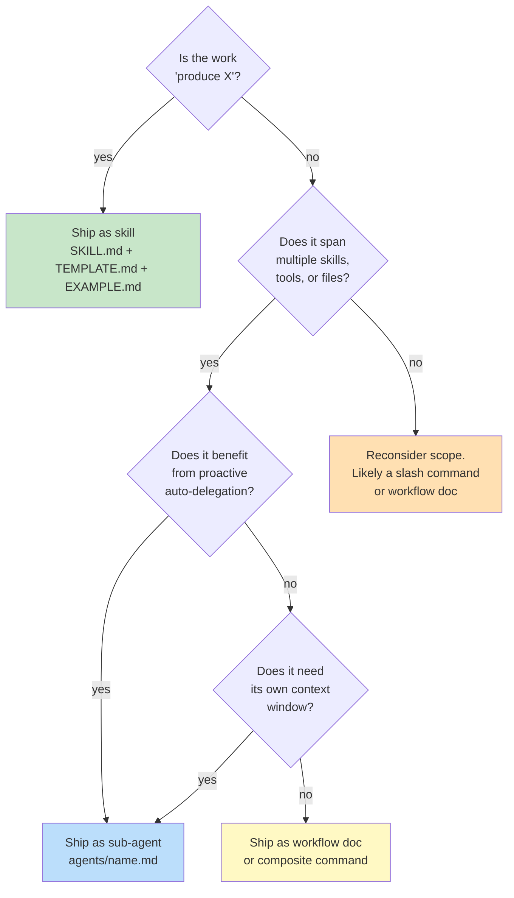
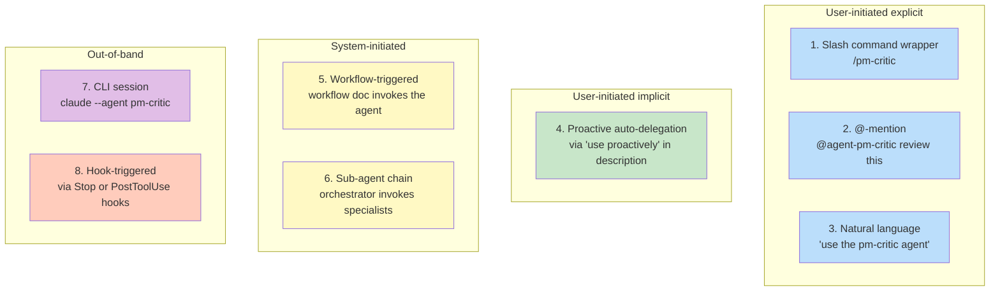
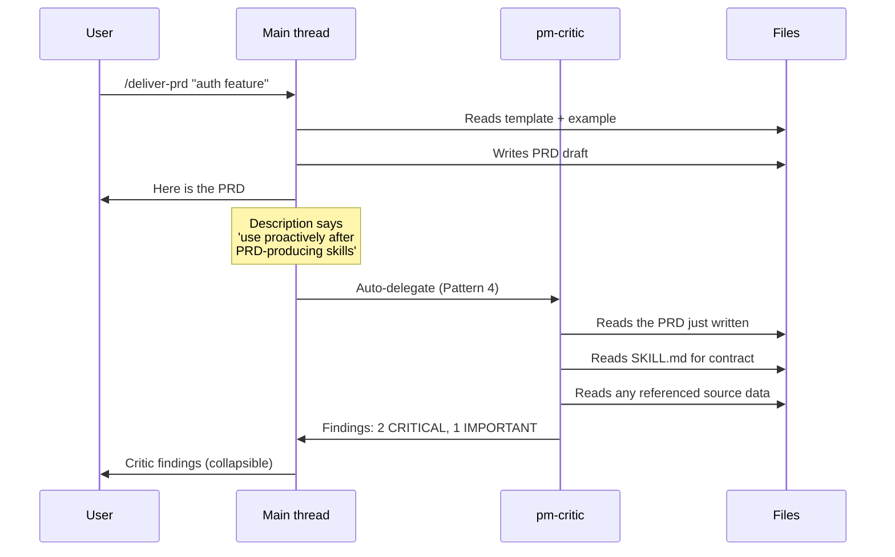
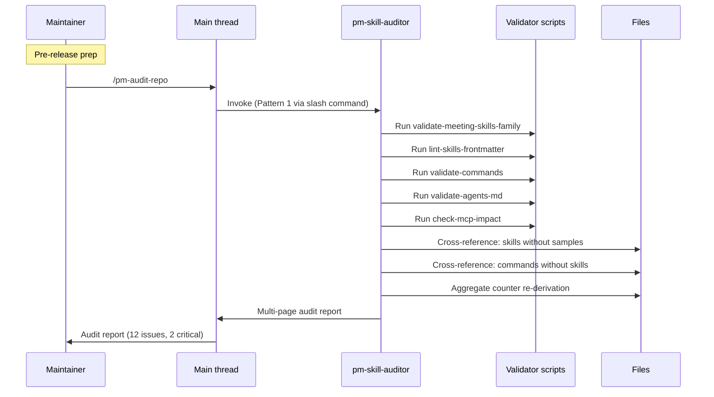
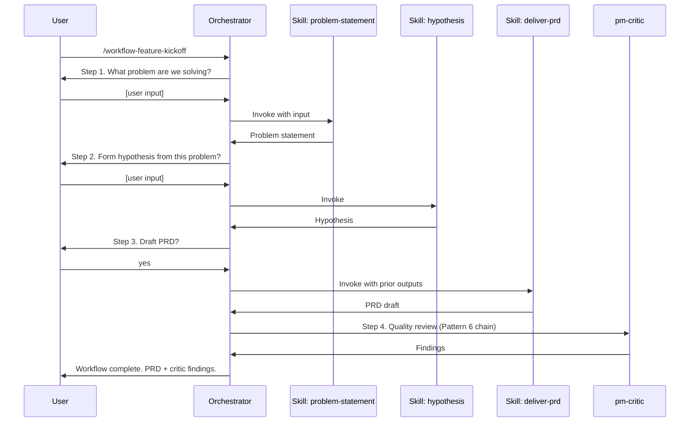
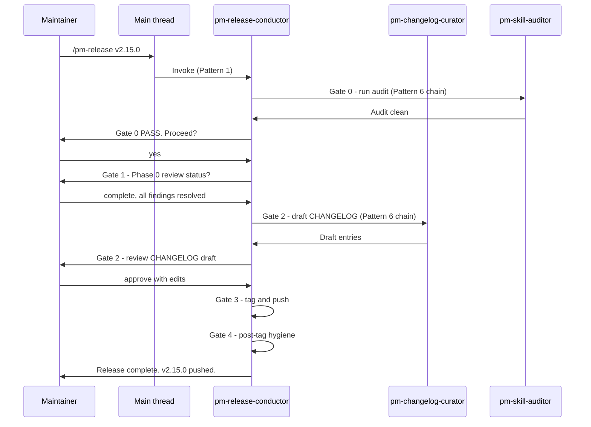
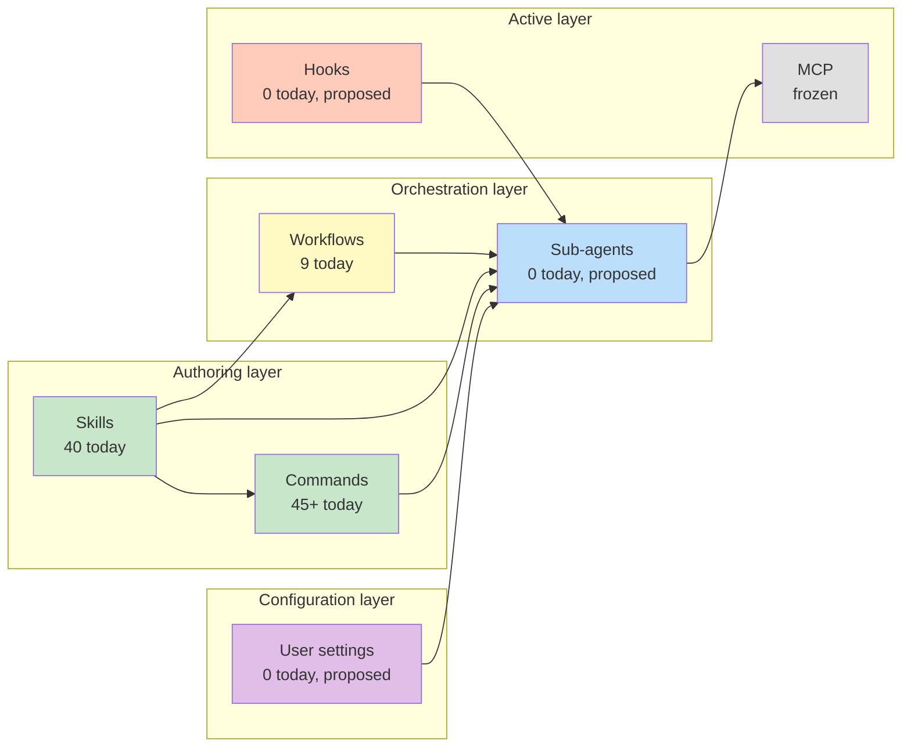
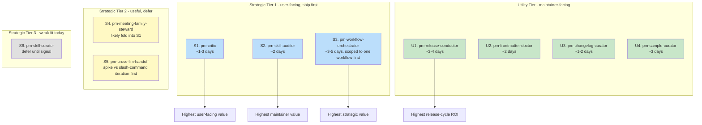

# Sub-Agent Strategy for pm-skills

**Date**: 2026-05-07
**Author**: Claude Opus 4.7
**Status**: Working draft, not yet a release artifact

## Why this doc exists

The April 18 design analysis (`agent-component-usage_2026-04-18.md`) treated sub-agents as one row in a broader runtime-leverage matrix alongside hooks, MCP, settings, and dynamic injection. Three weeks of release cycles later, we have new context worth re-thinking sub-agents specifically:

1. **v2.12.0 shipped the OKR Skills set** with strong refusal protocols (no fabricated baselines, no comp coupling, reframe feature-delivery KRs). That's a precise behavior contract that an adversarial reviewer needs to know.
2. **v2.13.x shipped** plugin install path corrections, marketplace hardening, and the start of v2.14.0's Starlight migration. The plugin surface is more mature.
3. **The Meeting Skills Family Contract** has been proven through one full cycle. We now have a template for cross-cutting structural governance that sub-agents could embody.
4. **40 skills, 45+ commands, 9 workflows, 120 library samples, 5 enforcing validators** is a lot of governance surface for a passive content model. Sub-agents are the missing active layer.

The current sub-agent count in this repo is **zero**. That's the right starting point for a thoughtful question: which one (or two, or three) is worth building first, and why?

This expanded version (2026-05-07 v2) adds a dedicated invocation-patterns section, a composition-with-other-components section, and a Utility Tier of maintainer-facing sub-agents alongside the user-facing strategic candidates from v1.

---

## 1. The decision lens. Skill or sub-agent?

Before listing candidates, the conceptual lens that should govern every "should we ship a sub-agent for X?" decision.

| Dimension | Skill | Sub-agent |
|-----------|-------|-----------|
| **Verb shape** | "Create X", "Generate X", "Draft X" | "Review", "Audit", "Orchestrate", "Coach", "Steward" |
| **Output** | A single artifact, well-bounded | A process result. report, decision, multi-file change, workflow handoff |
| **State** | Mostly stateless within a turn | May persist memory across turns or sessions |
| **Tool surface** | Reads templates and examples; writes one output | Reads many sources; runs validators; may write multiple files; may invoke other skills |
| **Trigger pattern** | User explicitly invokes (slash command or natural-language match) | User invokes, OR proactive auto-delegation, OR `@agent-name` mention |
| **Stop condition** | Output is produced | Process is complete (often multi-step) |

A clean test: **if you can describe the work as "produce X," it's a skill. If you describe it as "go do this thing and report back," it's a sub-agent.**

Two useful corollaries:

- A sub-agent that just produces a single artifact is a **mis-scoped skill**.
- A skill that orchestrates four other skills and tracks state across them is a **mis-scoped sub-agent**.

This lens immediately prunes the April doc's `pm-researcher` and `pm-diagrammer` candidates: those were really "long-context skill helpers." The mermaid case is fully covered by the existing Mermaid Chart MCP server, and interview synthesis is already a skill. They're not the right shape for a sub-agent. The candidates that survive the lens are reviewers, auditors, orchestrators, stewards, and conductors.



---

## 2. Prioritized sub-agent proposals

Ten candidates that pass the decision lens, organized into Strategic Tiers (user-facing) and a Utility Tier (maintainer-facing).

### Strategic Tier 1. User-facing, ship first

#### S1. `pm-critic` - adversarial PM-artifact reviewer

**What it does.** Reviews any PM artifact (PRD, recap, brief, OKR set, persona, lean canvas, synthesis, etc.) and returns structured findings graded `CRITICAL` / `IMPORTANT` / `MINOR` / `NIT`. Knows the structural contracts that already live in this repo and uses them as the reviewer's checklist.

**Why this matters.**
- The repo's own release process already runs Phase 0 Adversarial Review (codified in v2.11.0 pre-release checklist). It's currently a manual Codex-handoff via `/jp-ai-review`. A Claude-native sub-agent makes this pattern available for **any** PM artifact, any time, not just release artifacts.
- v2.12.0's OKR refusal protocols are precise behaviors that benefit hugely from a reviewer who knows them. "This KR is feature delivery dressed up as outcome" is a check the OKR writer can self-apply, but adversarial review on a separate pass catches more.
- The Meeting Skills Family Contract has 5 enforcing rules that `validate-meeting-skills-family.sh` checks structurally. `pm-critic` checks them **semantically** (e.g., "this recap claims a decision but the action items don't reflect it").
- Persona evidence calibration. lean canvas internal consistency. PRD success-metrics testability. all benefit from a second-pass critic.

**Why sub-agent, not skill.**
- "Review X" is process work. The output is a findings report, not a PM artifact.
- Needs to read multiple files (the artifact, its template, possibly the family contract, possibly the source data) which is sub-agent multi-tool shape.
- Benefits from `description: "use proactively after any PM artifact is produced"` so the user doesn't have to remember to invoke it.

**Concrete prompt scope.**
```yaml
---
name: pm-critic
description: |
  Use proactively after any PM-artifact-producing skill completes (deliver-prd,
  foundation-meeting-recap, foundation-okr-writer, foundation-persona,
  foundation-lean-canvas, discover-interview-synthesis, etc.). Runs adversarial
  review. finds weaknesses, not wins. Returns findings graded
  CRITICAL/IMPORTANT/MINOR/NIT with concrete fix suggestions.
tools: Read, Grep, Glob
model: sonnet
memory: none
---

You are pm-critic. You read PM artifacts adversarially and return structured
findings. You never validate; you stress-test.

Checklist by artifact type:
  - OKR sets: refusal-protocol audit (fabricated baselines, comp coupling,
    feature-delivery KRs), guardrail balance, committed-vs-aspirational
    appropriateness.
  - Meeting recaps: family-contract compliance, decision-action coherence,
    topic skeleton alignment with sibling agenda if present.
  - Personas: evidence calibration, assumption flagging, internal consistency.
  - PRDs: testability of success metrics, scope creep risk, missing edge
    cases vs deliver-edge-cases catalog.
  - Lean canvases: internal block coherence, assumption density, missing
    unfair advantage tests.
  ...
```

**Cost estimate.** ~1 day of authoring + ~2 days of iteration on the system prompt against real PM artifacts. Single file: `agents/pm-critic.md`. No companion changes required at minimum-viable scope.

**Codex compatibility.** `codex:codex-rescue` already exists as the Codex-side adversarial reviewer. Pattern: pm-critic and codex-rescue serve the same intent through different mechanisms. Document both paths in `docs/guides/adversarial-review.md`.

#### S2. `pm-skill-auditor` - repo-level skill governance

**What it does.** Runs a full audit pass across the repo: invokes all 5+ enforcing validators (frontmatter lint, command path validation, AGENTS.md sync, meeting-skills family contract, plugin-install path), aggregates results, and surfaces cross-cutting issues that no single validator catches alone.

Examples of cross-cutting issues:
- Skill `X` has a SKILL.md but no slash command in `commands/` (or vice versa).
- A skill exists but has zero library samples.
- A library sample references a thread that isn't in `THREAD_PROFILES.md` (when F-34 lands).
- A workflow doc references a skill that has been renamed.
- Two skills have overlapping descriptions (discoverability collision).

**Why this matters.**
- Each enforcing validator catches its own narrow class of issue. No one is currently sweeping the seams between them.
- Manual audit work is what the maintainer does today, expensively, before each release. The aggregate-counter drift bug captured in MEMORY (`feedback_stale-aggregate-counter.md`) is precisely the class of issue this auditor would catch automatically.
- This pairs naturally with `utility-pm-skill-validate` but doesn't replace it. The skill audits a skill; the auditor audits the repo.

**Why sub-agent, not skill.**
- The work is "go run all the validators, parse output, look for cross-cutting issues, report back." That's the pure process shape.
- Multi-tool: Bash (to run scripts), Read (to inspect files for cross-cutting checks), Grep (to find references).
- Long-running. May produce a multi-page report. Sub-agent context window keeps the main thread clean.

**Concrete invocation pattern.**
```
@agent-pm-skill-auditor

(or invoked proactively before a release tag, via maintainer convention)
```

**Cost estimate.** ~2 days. The hard part is the cross-cutting check logic, not the sub-agent envelope.

**Codex compatibility.** Codex can't auto-invoke this, but the underlying validators are all shell scripts that Codex users can run manually. Codex side could pair with a documented runbook in `docs/contributing/release-audit.md`.

#### S3. `pm-workflow-orchestrator` - active workflow chain runner

**What it does.** Walks the user through one of the 9 documented workflows (Customer Discovery, Feature Kickoff, Product Strategy, Technical Discovery, Sprint Planning, Stakeholder Alignment, Post-Launch Learning, etc.). Maintains state across the chain. invokes the correct skill at each step, carries forward outputs, prompts the user for the inputs each next-step skill needs.

Today's workflows are docs that **describe** the chain. The user invokes each skill manually. The orchestrator **runs** the chain.

**Why this matters.**
- Workflows are the highest-value abstraction in pm-skills (one workflow = a real PM activity), but they're under-leveraged because there's no runtime support. Users have to remember which skill comes next, what to feed it, and what to do with the output.
- A sub-agent that knows the chain captures the discipline that lives in the workflow doc and applies it actively.
- This is how you go from "library of 40 skills" to "guided PM operating system."

**Why sub-agent, not skill.**
- Multi-skill orchestration with state. classic sub-agent shape.
- Each step is itself a skill invocation. The sub-agent is the conductor, not a player.
- Benefits from a longer-lived context that persists outputs from each step for use by subsequent steps.

**Constraints to design around.**
- Plugin sub-agents can't set `mcpServers` on themselves, so the orchestrator can't independently pull in MCP context. This is fine for v1 because the workflow chain runs entirely on file-based skills.
- The user must still drive (the orchestrator pauses at each step for input). Auto-running the entire chain without user gates produces low-quality artifacts because workflows depend on user-supplied context.

**Cost estimate.** ~3-5 days. Each workflow needs its own state machine. Probably ship one workflow first (Feature Kickoff is the most concrete) then expand.

**Codex compatibility.** Codex doesn't load plugin sub-agents, but Codex users can follow the workflow doc manually as today. Cross-LLM pattern: the sub-agent's "step prompt" templates can be exported as `.md` files Codex users invoke as slash commands.

### Strategic Tier 2. Useful, but defer

#### S4. `pm-meeting-family-steward` - family contract embodiment

**What it does.** Sub-agent specialized in the Meeting Skills Family. Knows the contract by heart (the 5 rules, the 10 meeting-type variants, the go-mode default behaviors, the universal output requirements). Acts as expert when the user is doing meeting-skills work or extending the family.

**Why this matters.**
- The contract doc is 600+ lines. Re-reading it mid-session is expensive. A sub-agent that has internalized it can answer "does this satisfy go-mode requirements?" without re-loading the doc.
- This is the **family-steward pattern** that didn't exist in the April analysis. If pm-skills ships future families (Discovery Skills Family, Lifecycle Skills Family, etc.), each can ship with its own steward.

**Why sub-agent, not skill.**
- The steward's job is "answer family-contract questions and validate family work," which is process shape.
- Could overlap with `pm-critic` (especially the family-compliance checks). Most likely outcome: pm-critic owns the artifact-level checks, the steward owns the contract-level reasoning.

**Defer reason.** Probably the right home for the family-aware logic is `pm-critic` itself, with a `family: meeting` mode. Splitting them creates two sub-agents with overlapping context. Reconsider when a second family (Lifecycle? Discovery?) ships and the cross-family logic genuinely diverges.

**Cost estimate.** Folded into pm-critic at ~0.5 day; standalone at ~2 days.

#### S5. `pm-cross-llm-handoff` - Claude-side review packet builder

**What it does.** Bridges Claude-side PM work to Codex-side review (and back). Builds review packets that match the `/jp-ai-review` schema, ingests Codex review responses, applies accepted findings, and produces a ship-or-not recommendation.

**Why this matters.**
- The cross-LLM review protocol exists (`docs/internal/cross-llm-review-protocol.md`) and the `/jp-ai-review` slash command already implements it manually. A sub-agent that **owns** the protocol gives the maintainer a one-call interface.
- This formalizes a pattern the project already uses informally (Phase 0 Adversarial Review, Codex review of v2.13.1 plan).

**Why sub-agent, not skill.**
- Multi-step orchestration: build packet, hand off, await response, parse response, propose next action.
- Stateful within a session: needs to remember which findings were accepted, which deferred, which rejected.

**Defer reason.** This one is partially redundant with the existing `/jp-ai-review` slash command and might be better as a slash-command iteration than a sub-agent, depending on how much state the chain really needs to carry. Worth a spike before committing.

**Cost estimate.** ~3 days with state-handoff design.

### Strategic Tier 3. Experimental, currently weak fit

#### S6. `pm-skill-curator` - skill-candidate spotter

**What it does.** Watches the repo (and potentially session logs) for skill-shaped patterns. The user keeps writing the same kind of artifact in different sessions, and the curator says "this is becoming a pattern. consider promoting it to a skill."

**Why this matters in theory.**
- The skill library grows from observation. `utility-pm-skill-builder` is the bridge from idea-to-skill, but who notices the idea in the first place? Today: the maintainer, manually.

**Why this is weak right now.**
- Requires durable observation across sessions, which means hooks, memory, or external state. None of which are on the v2.14 plate.
- Risk of false positives (one-off artifacts that aren't skill-shaped).
- The maintainer is currently doing this work fine without automation.

**Defer.** Reconsider when the repo has signal that pattern-blindness is costing real opportunities. No evidence of that today.

### Utility Tier. Maintainer-facing repo operations

These sub-agents are not user-facing (PMs don't invoke them). They serve the maintainer's repo-operations workload. They earn their place because the work they do is currently manual, repeats every release cycle, and benefits genuinely from sub-agent shape (multi-tool, multi-step, judgment-heavy).

The design rubric for utility sub-agents differs from strategic ones. **utility agents are explicit-only** (no proactive auto-delegation) because the maintainer wants control over high-stakes operations. **Strategic agents may be proactive** because user-facing helpers benefit from low-friction invocation.

#### U1. `pm-release-conductor` - guided release runbook

**What it does.** Walks the maintainer through the full release runbook for a tag: pre-tag verification (CI green, validators pass, frontmatter clean, em-dash sweep clean), version bump in the right files (`plugin.json`, CHANGELOG header, release plan), tag creation, push, post-tag hygiene checks. Pauses for confirmation at each gate.

**Why this matters.**
- Releases are the highest-stakes operation in the repo. The current process lives in maintainer memory plus partial release-plan checklists. Drift between releases (the v2.13.1 plugin install path correction was post-tag detection) is the cost.
- The aggregate-counter drift class of bug captured in MEMORY (`feedback_stale-aggregate-counter.md`) is exactly the kind of issue a release conductor catches: re-derive counters, compare to declared, fail the gate.
- The Phase 0 Adversarial Review Loop is a release gate that's currently maintainer-driven; the conductor formalizes the gate.

**Why sub-agent, not script.**
- The work is judgment-heavy at gates (e.g., "Codex reported 3 IMPORTANT findings. should we proceed or address them first?"). A pure script can't pause for that.
- Multi-tool: Bash, Read, Edit (for version bumps), Grep (for cross-reference checks).
- Stateful across the release flow. holds the gate state from start to ship.

**Concrete prompt scope.**
```yaml
---
name: pm-release-conductor
description: |
  Walks the maintainer through the release runbook for a new version tag.
  Explicit invocation only (no proactive trigger). Pauses at every gate
  for confirmation. Rolls back on failure rather than proceeding.
tools: Bash, Read, Edit, Grep, Glob, Agent
model: sonnet
memory: none
---

You are pm-release-conductor. Your job is to escort a release from
"work is done" to "tag is pushed and post-tag hygiene is clean."

Gates (in order, each requires explicit user confirmation):
  G0. Pre-tag readiness check
    - All enforcing validators pass
    - CI green on the release branch
    - Frontmatter consistency
    - Em-dash sweep clean (CLAUDE.md rule)
    - Aggregate counters match declared (skill counts, command counts)
  G1. Adversarial review status
    - Phase 0 Codex review completed and findings resolved
    - Or explicit deferral to next release
  G2. Version bump
    - plugin.json version field
    - CHANGELOG.md header
    - Release plan status update
  G3. Tag and push
  G4. Post-tag hygiene
    - Plugin install path check
    - Marketplace registration verification
    - Doc-stack rebuild trigger if applicable
```

**Cost estimate.** ~3-4 days, mostly authoring the gate logic.

**Codex compatibility.** Codex users can run the underlying release scripts manually. Document the runbook in `docs/contributing/release-runbook.md` so the conductor's logic is also a manual reference.

#### U2. `pm-frontmatter-doctor` - cross-skill frontmatter consistency

**What it does.** Sweeps frontmatter across all 40 skills (and commands, workflows, family contracts), identifies inconsistencies (missing fields, drifted enum values, version conflicts), and proposes fixes in batch. The maintainer confirms the batch; the doctor applies edits.

**Why this matters.**
- Frontmatter consistency was important enough to spec (`spec_frontmatter-correction.md`) and is enforcing-CI-validated by `lint-skills-frontmatter`. The validator catches drift; nothing fixes it. The doctor closes the gap.
- Future families (lifecycle, discovery, etc.) compound the surface area. The doctor scales linearly with skill count; manual work scales worse.
- Pairs with `pm-skill-auditor` (S2) which detects issues; doctor remediates them.

**Why sub-agent, not script.**
- Some drift is intentional (e.g., a skill is intentionally on a different version because it's mid-iteration). The doctor needs to negotiate which fixes to apply, not blindly normalize.
- Multi-file edit work with confirmation gates fits sub-agent shape.

**Cost estimate.** ~2 days.

**Codex compatibility.** Codex users can ask `codex:codex-rescue` with a frontmatter-sweep prompt to do the same work. Pattern: ship the doctor for Claude users; document the prompt template for Codex users.

#### U3. `pm-changelog-curator` - draft CHANGELOG entries from commits

**What it does.** Reads git log since the last tag, drafts CHANGELOG entries applying the repo's CHANGELOG conventions: describe what changed (not where internal files are), reference public paths only, never reference gitignored `_NOTES/`. Outputs a draft for maintainer review and edit.

**Why this matters.**
- The repo's CLAUDE.md codifies CHANGELOG hygiene rules that are easy to violate accidentally (especially "never reference gitignored notes"). The curator enforces them by construction.
- CHANGELOG drafting is currently maintainer-driven and consumes ~30-60 minutes per release. A curator brings this down materially.
- Pairs with `pm-release-conductor` (U1): conductor invokes curator at the CHANGELOG-prep gate.

**Why sub-agent, not script.**
- Distinguishing a public-facing change from an internal-only change is judgment, not pattern matching.
- Reading commit messages and understanding intent benefits from LLM reasoning.
- Applying the "what changed not where" rule means the curator needs to rewrite, not just extract.

**Cost estimate.** ~1-2 days.

**Codex compatibility.** Codex side: documented prompt template that produces the same output. The discipline is in the prompt, not the agent.

#### U4. `pm-sample-curator` - library sample gap analysis and generation

**What it does.** Scans `library/skill-output-samples/`, identifies gaps (skills with no samples, skills with samples concentrated in one thread, samples that no longer match current SKILL.md output contracts), and proposes new samples. When `THREAD_PROFILES.md` exists (F-34), can auto-generate thread-aligned samples on demand.

**Why this matters.**
- 120 samples sounds like a lot until you spread it across 40 skills and 3 threads (storevine, brainshelf, workbench). Coverage gaps are likely real.
- F-32 (pm-skill-builder sample generation) is on the v2.12.0+ backlog. The curator is the runtime expression of that effort.
- Pairs with `pm-skill-auditor` (S2): auditor identifies gaps, curator fills them. Pairs with `pm-skill-builder` skill: builder authors a new skill, curator immediately backfills sample coverage.

**Why sub-agent, not skill.**
- Multi-step generation: Read TEMPLATE, Read EXAMPLE, Read THREAD_PROFILES, Generate sample, Validate sample, Save. Sub-agent shape.
- Cross-cutting analysis (gap detection) is judgment-heavy.
- The work straddles two phases (analysis + generation) which a single skill couldn't cleanly own.

**Cost estimate.** ~3 days, including F-34 dependency. Decompose: ~1 day for gap analysis, ~2 days for thread-aware generation.

**Codex compatibility.** Codex can produce samples manually using the same templates. The sub-agent's value is the gap-detection, not the sample-generation. Codex users invoke it as: `codex:codex-rescue` + prompt + manual sample authoring.

### Utility candidates considered but not proposed

- **`pm-em-dash-sweeper`**. The em-dash sweep is repeated work, but a script handles 95% of it (mechanical replacement). The 5% that benefits from judgment (where to use a comma vs sentence break vs hyphen-with-spaces) doesn't justify a dedicated sub-agent. Belongs as a sweep mode in `pm-frontmatter-doctor` or as a tightened CI script with auto-fix proposals.
- **`pm-mcp-sync-broker`**. Would bridge main repo to pm-skills-mcp companion. Currently irrelevant because MCP is in maintenance mode (M-22). Reconsider when MCP unfreezes.
- **`pm-link-validator`**. Cross-doc link validation is real work but ships better as a CI script, not a sub-agent. No judgment is needed (a link works or it doesn't).
- **`pm-doc-stack-migrator`**. Tempting for the v2.14 Starlight migration, but a one-time migration is not a sustained sub-agent. Better as a focused branch with a runbook.
- **`pm-spike-conductor`**. Conducting technical spikes is a real workflow but is already covered by the `develop-spike-summary` skill plus user discipline. Not enough sustained value to warrant a dedicated agent.

---

## 3. How sub-agents are invoked and used

Plugin sub-agents in Claude Code support six in-band invocation patterns plus two out-of-band patterns. Each has its own ergonomics and best-fit scenarios. Understanding which pattern fits which sub-agent is what makes the surface usable rather than confusing.

### 3.1 Eight invocation patterns



**Pattern 1. Slash command wrapper.** A companion slash command in `commands/` whose body says "use the pm-critic agent to review [args]". Lowest-friction discovery for users who already know the command surface.

```markdown
<!-- commands/pm-critic.md -->
---
description: Run adversarial review on a PM artifact via the pm-critic agent
---

Use the pm-critic agent to perform adversarial review on $ARGUMENTS
(or, if no arguments, the most recent PM artifact in this session).
Return findings graded CRITICAL/IMPORTANT/MINOR/NIT with concrete fix
suggestions.
```

**Pattern 2. `@agent-` mention.** User explicitly invokes by name in their prompt: `@agent-pm-critic please review my PRD`. Guarantees invocation. Useful for power users.

**Pattern 3. Natural-language delegation.** User says "use pm-critic to review this" or just "get a critical review on this PRD". Claude evaluates the request against agent descriptions and decides delegation. Works because the `description` field is matched by Claude's intent classifier.

**Pattern 4. Proactive auto-delegation.** When the agent's `description` includes "use proactively after [trigger]", Claude auto-invokes whenever the trigger fires. For pm-critic, the trigger is "any PM-artifact-producing skill completes." For pm-skill-auditor, no proactive trigger because audit work should be explicit (see Insight 8 below: auto-invocation noise).

**Pattern 5. Workflow-triggered.** A workflow doc (`_workflows/feature-kickoff.md`) instructs Claude to invoke an agent at a specific step:

```markdown
## Step 4. Quality review

After producing the PRD in Step 3, invoke `@agent-pm-critic` to perform
adversarial review. Address CRITICAL findings before proceeding to Step 5.
```

This makes workflows actively quality-gated rather than passive checklists.

**Pattern 6. Sub-agent chain.** A sub-agent invokes another sub-agent. Requires the parent to have the `Agent` tool in its tools list. Used by `pm-workflow-orchestrator` to call `pm-critic` at validation steps, or by `pm-release-conductor` to call `pm-changelog-curator` at the CHANGELOG-prep gate.

**Pattern 7 (out-of-band). CLI session.** `claude --agent pm-critic` runs the entire session as that agent. Useful for batch work (e.g., review every artifact in a directory) but not the typical in-conversation invocation.

**Pattern 8 (out-of-band). Hook-triggered.** A `PostToolUse` or `Stop` hook can elicit a sub-agent invocation by injecting a prompt into the next turn. Powerful but requires plugin-level hooks (sub-agents can't self-define hooks per the security ceiling described in Section 8).

### 3.2 Lifecycle and scope per Tier 1 candidate

How each Tier 1 sub-agent gets invoked in practice, end-to-end.

#### `pm-critic` lifecycle (proactive critic)



**Trigger:** Auto on PM-artifact production (Pattern 4) OR explicit `@agent-pm-critic` (Pattern 2) OR `/pm-critic` slash command (Pattern 1).
**Lifetime:** Single turn. Returns findings and exits.
**Memory:** None. Each invocation reads fresh.
**Tool surface:** Read, Grep, Glob.

#### `pm-skill-auditor` lifecycle (explicit governance)



**Trigger:** Explicit only (Pattern 2 or Pattern 1 via `/pm-audit-repo`). No proactive trigger because audit work is heavy and shouldn't fire on every conversation.
**Lifetime:** Multi-turn. May produce a multi-page report and ask the maintainer follow-up questions about ambiguous findings.
**Memory:** Optional `memory: project` if we want to track audit history across sessions. Default: none.
**Tool surface:** Bash (run validators), Read, Grep, Glob.

#### `pm-workflow-orchestrator` lifecycle (long chain)



**Trigger:** Explicit only via `/workflow-{name}` slash command.
**Lifetime:** Long. Spans the entire workflow chain (often dozens of turns).
**Memory:** Within-session. Holds workflow state across steps.
**Tool surface:** Read, Write, Agent (to invoke skills and sub-agents).

### 3.3 Lifecycle for utility tier

#### `pm-release-conductor` lifecycle (gated runbook)



**Trigger:** Explicit only. Slash command `/pm-release` or `@agent-pm-release-conductor`.
**Lifetime:** The full release flow (often 30+ minutes elapsed time across many turns).
**Memory:** Within-session only. The release is a one-shot.
**Tool surface:** Bash, Read, Edit, Grep, Glob, Agent.

### 3.4 Invocation rule of thumb

```
If the user wants ad-hoc reuse:    slash command wrapper (Pattern 1)
If the work is critic-shaped:      proactive auto-delegation (Pattern 4)
If the work is heavy/explicit:     @-mention or slash command (Patterns 1-2)
If the work is workflow-shaped:    workflow-triggered (Pattern 5)
If the work is multi-agent:        sub-agent chain (Pattern 6)
If the work is batch/repo-wide:    CLI session (Pattern 7)
If the work is event-driven:       hook-triggered (Pattern 8)
```

### 3.5 What invocation cost looks like

Sub-agents have non-trivial cost. each invocation runs in its own context window with its own tool budget. Practical implications:

- **Auto-delegated sub-agents** (Pattern 4) compound costs across a session. Conservatism in the `description` matters.
- **Workflow-orchestrated sub-agents** (Pattern 6) chain costs. A 5-step workflow that invokes pm-critic at every step is 5x the critic cost.
- **CLI-session sub-agents** (Pattern 7) are intentionally heavy and well-suited for batch work where the cost is amortized.
- **Hook-triggered sub-agents** (Pattern 8) fire on system events; if the trigger is too broad, they fire often. Trigger conservatism applies.

This argues for shipping `pm-critic` with a default proactive trigger but a documented opt-out via `.claude/pm-skills.local.md` (the user-settings pattern from the April doc, P2.3). Users who want every artifact critic'd get it for free; users who want explicit control turn the proactive trigger off.

### 3.6 Per-agent invocation summary

| Agent | Default trigger | Explicit options | Lifetime | Memory |
|-------|-----------------|------------------|----------|--------|
| `pm-critic` | Proactive (Pattern 4) | `/pm-critic`, `@agent-pm-critic` | Single turn | None |
| `pm-skill-auditor` | Explicit only | `/pm-audit-repo`, `@agent-pm-skill-auditor` | Multi-turn | Optional project |
| `pm-workflow-orchestrator` | Explicit only | `/workflow-{name}` | Long chain | Within-session |
| `pm-release-conductor` | Explicit only | `/pm-release [version]` | Full release flow | Within-session |
| `pm-frontmatter-doctor` | Explicit only | `/fix-frontmatter`, `@agent-pm-frontmatter-doctor` | Multi-turn batch | None |
| `pm-changelog-curator` | Explicit (or chained from conductor) | `/pm-draft-changelog`, `@agent-pm-changelog-curator` | Single turn or chained | None |
| `pm-sample-curator` | Explicit only | `/audit-samples`, `/generate-samples` | Multi-turn | None |

---

## 4. Composition with the rest of the plugin surface

Sub-agents don't live in isolation. They compose with skills, commands, workflows, hooks, MCP, and each other. The composition patterns below are the ways the proposed sub-agents fit into the existing pm-skills surface.

### 4.1 Sub-agent + slash command (wrapper pattern)

The simplest composition. A slash command wraps the sub-agent and gives it a discoverable name.

```
/pm-critic           -> invokes pm-critic on the most recent artifact
/pm-audit-repo       -> invokes pm-skill-auditor with full sweep
/workflow-fk      -> invokes pm-workflow-orchestrator for Feature Kickoff
/pm-release          -> invokes pm-release-conductor for the next release tag
/fix-frontmatter  -> invokes pm-frontmatter-doctor across the repo
/pm-draft-changelog  -> invokes pm-changelog-curator since last tag
/audit-samples    -> invokes pm-sample-curator gap analysis
```

**Why ship both?** The slash command is for users who think in commands. The sub-agent is what does the work. The slash command is a thin alias. Costs ~5 lines of YAML+markdown per agent. **Insight 7** (below) argues for this as a default discipline.

### 4.2 Sub-agent + skill (specialist after generalist)

A skill produces an artifact; a sub-agent reviews/audits/refines it. This is the pm-critic pattern.

```
deliver-prd produces PRD
  -> pm-critic reviews PRD
  -> if findings, user revises via deliver-prd again
  -> pm-critic re-reviews
```

The skill is the artifact author; the sub-agent is the quality enforcer.

### 4.3 Sub-agent + workflow (active orchestration)

A workflow doc lists the chain of skills; the orchestrator sub-agent runs the chain.

```
_workflows/feature-kickoff.md           describes the 5-step chain
pm-workflow-orchestrator                runs the chain step-by-step
```

The doc is the spec; the sub-agent is the execution. They co-exist (the doc is still the source of truth that the orchestrator reads at runtime).

### 4.4 Sub-agent + sub-agent (chain)

The orchestrator invokes the critic at the validation step. The release conductor invokes the changelog curator at the CHANGELOG-prep step and the auditor at the pre-tag readiness gate.

This requires the parent to have the `Agent` tool. Sub-agent chains are powerful but expensive (each invocation is a fresh context). Use sparingly. Two levels of chaining is fine; four becomes unmanageable.

### 4.5 Sub-agent + hook (event-driven trigger)

A `PostToolUse` hook on `Write` could inject "now invoke pm-critic on the file just written" into the next turn. This is the bridge from the April doc's hook proposals (P1.1) to the sub-agent surface.

**This is where hooks and sub-agents really shine together:** hooks observe events and decide; sub-agents do the work that the hook decided was warranted. Hooks are the nervous system; sub-agents are the muscles.

### 4.6 Sub-agent + MCP (dynamic content consumer)

If pm-skills-mcp unfreezes (P2.1 from the April doc), sub-agents can consume MCP resources. The auditor could pull the canonical thread profiles from `pm-skills://threads/` instead of reading the file directly. Decouples the sub-agent from file structure changes.

### 4.7 Sub-agent + user settings (per-user opinion override)

The `.claude/pm-skills.local.md` user-settings pattern (P2.3 from the April doc) lets users override sub-agent defaults:

```yaml
---
pm_critic_auto_invoke: false
pm_critic_severity_floor: IMPORTANT
pm_workflow_orchestrator_pause_at_each_step: true
pm_release_conductor_skip_phase_0_gate: false
---
```

The sub-agent reads these on invocation and adjusts behavior. Closes the loop between agent design (default opinions) and user customization (per-user override).

### 4.8 Composition matrix



The diagram makes one thing clear: **sub-agents are the orchestration layer's missing piece.** Today, workflows orchestrate by description; tomorrow, sub-agents orchestrate by execution. The other layers (active, configuration) are deferred to v2.15+ but compose naturally when they arrive.

---

## 5. What the prioritized list looks like



If shipping just one: **`pm-critic`**. It's the lowest-cost, highest-leverage entry point and unlocks adversarial review for every PM artifact, not just release-time work.

If shipping two: add **`pm-release-conductor`** (utility). It addresses the highest-stakes recurring maintainer operation and pays for itself the first time it catches an aggregate-counter drift or a missed Phase 0 gate.

If shipping three: add **`pm-skill-auditor`** (strategic) or **`pm-changelog-curator`** (utility) depending on whether release-prep or general repo health is the more pressing pain.

If building a complete v2.15.0 sub-agent slate (4-5 agents): pm-critic + pm-release-conductor + pm-skill-auditor + pm-changelog-curator + (optionally) pm-frontmatter-doctor. This forms a coherent maintenance-and-quality system that addresses both user-facing and maintainer-facing pain points.

---

## 6. Cross-cutting insights

### Insight 1. Sub-agents formalize discipline that already exists informally

Every Tier 1 strategic candidate codifies a behavior the maintainer already does manually:

- `pm-critic` codifies the Phase 0 Adversarial Review Loop.
- `pm-skill-auditor` codifies the pre-release manual sweep.
- `pm-workflow-orchestrator` codifies the chain that workflow docs describe.

Every Utility Tier candidate similarly codifies maintainer discipline:

- `pm-release-conductor` codifies the release runbook (currently in maintainer head + partial docs).
- `pm-frontmatter-doctor` codifies the frontmatter-correction discipline.
- `pm-changelog-curator` codifies the CHANGELOG hygiene rules in CLAUDE.md.
- `pm-sample-curator` codifies the sample-coverage discipline F-32 envisions.

This is the right shape for a first sub-agent. **Don't invent novel behaviors; promote existing discipline.** Novel behaviors invite scope creep and weak adoption signal.

### Insight 2. Plugin sub-agents have a security ceiling

Per the April research, plugin-declared sub-agents cannot self-set `hooks`, `mcpServers`, or `permissionMode`. Users who want full sub-agent autonomy must copy the sub-agent into `.claude/agents/`. Implications:

- Tier 1 candidates are designed to fit within the ceiling. they read files and report; they don't need their own MCP or hooks.
- Anything that **does** need autonomy (e.g., a sub-agent that watches `FileChanged` events and auto-validates) belongs at the plugin-hook level, not the sub-agent level.
- Document the user-copy escape hatch in any sub-agent that benefits from autonomy.

### Insight 3. Codex compatibility is best handled at the **intent** layer, not the **mechanism** layer

The April doc framed Codex compatibility as "does this exact mechanism work for both?" That produces a five-bucket matrix and lots of "partial compatibility" notes. The cleaner framing is:

- For each sub-agent, identify the **intent** (e.g., "adversarial review of PM artifacts").
- Implement the Claude-Code-native mechanism (sub-agent in `agents/`).
- Provide the same intent through Codex's native mechanism (`codex:codex-rescue` with a documented prompt template, or a slash command Codex users invoke).
- Document both paths in the user-facing guide.

This is the same pattern the Meeting Skills Family already uses for CI: `validate-meeting-skills-family.sh` runs in CI **and** users can invoke it manually. The same dual-path holds for sub-agents.

### Insight 4. Memory is rare. don't over-design for it

Of the ten candidates, only `pm-skill-curator` (Tier 3, deferred) actually wants persistent memory. Even `pm-skill-auditor` is fine without it (audit history can live in `_NOTES/` or release plans). The rest are scoped to a session or a turn. Default to `memory: none` and only escalate to `memory: project` when there's a concrete reason. Memory expands the trust surface; default-on memory expands it for free.

### Insight 5. Sub-agents are the place where opinions become enforceable

A skill produces what the user asked for. A sub-agent can refuse, re-frame, or push back. The OKR Skills set demonstrated this for skills (refusal protocols), but sub-agents make it more powerful because:

- Sub-agents are invoked **after** the artifact exists. They have the full output to reason against.
- Sub-agents can refuse to ship findings that don't meet a quality bar (e.g., "I will not produce a clean review until the input includes the family contract reference").
- The opinion is encoded in the sub-agent's system prompt and survives across all invocations.

This makes sub-agents the right home for the kind of standards work that currently lives in `docs/reference/skill-families/meeting-skills-contract.md` and in maintainer judgment. A standard that a sub-agent enforces is a standard that scales.

### Insight 6. Three sub-agents is a meaningful threshold

Once the repo has 3+ sub-agents, formalize a `docs/reference/runtime-components.md` or expand `AGENTS.md` to catalog them alongside skills, commands, and workflows. The component surface is no longer "skills + commands" but "skills + commands + agents," and discoverability work should follow.

This was flagged in the April doc and is worth re-flagging here: don't let runtime components grow ungoverned. The Meeting Skills Family Contract pattern works because every cross-cutting rule has a single canonical home. Sub-agents need the same.

### Insight 7. Wrapper slash commands are cheap; ship them by default

For every sub-agent, ship a companion slash command in `commands/`. The slash command body is ~5 lines. The discoverability win is real:

- Users who think in commands (the majority who built mental models around `/deliver-prd`, `/foundation-okr-writer`) will find sub-agent capability via the command surface they already know.
- Users who prefer `@-mentions` or natural-language can still use those.
- The slash command becomes the canonical citation point in docs ("run `/pm-critic` to review this artifact" reads better than "use the pm-critic agent").

This is the same logic that makes the existing 45+ commands valuable: command surface is a UI affordance independent of the underlying capability mechanism.

**Cost comparison:** authoring a sub-agent is ~1-3 days. Authoring its companion slash command is ~30 minutes. Skipping the command saves nothing meaningful and loses real discoverability.

### Insight 8. Default-on proactive triggers need user-override paths

Any sub-agent that auto-invokes via `description: use proactively` will fire on every conversation that matches the trigger. For pm-critic, this is desirable. For others (auditor, conductor, frontmatter-doctor), it would be obnoxious.

Two design rules follow:

1. **User-facing strategic agents may be proactive** if the work they do is consistently useful to the user. pm-critic qualifies; pm-workflow-orchestrator does not (workflows are explicit user choices).
2. **Utility/maintainer agents are explicit-only.** Release runbooks, CHANGELOG drafts, frontmatter sweeps. these are high-stakes operations the maintainer should choose, not have inflicted upon them.

Even pm-critic's proactive trigger needs an off-switch via `.claude/pm-skills.local.md` per Insight 5 (Composition Pattern 4.7). Otherwise the agent becomes resented and users start telling Claude not to invoke it, which is worse than no agent at all.

### Insight 9. Sub-agent chains have compounding context cost

Pattern 6 (sub-agent chain) lets pm-workflow-orchestrator invoke pm-critic, pm-release-conductor invoke pm-changelog-curator, etc. Each invocation is a fresh context window. Chains compound:

- A workflow with 5 steps that calls pm-critic at each step = 5 critic invocations.
- A release flow with 3 sub-agent chains (audit, changelog, post-tag verify) = 3 separate sub-agent contexts on top of the conductor's own.

Design implications:

- **Keep chains shallow.** Two levels deep (parent invokes child) is fine. Four levels (parent invokes child invokes grandchild invokes great-grandchild) is unmanageable for both cost and debuggability.
- **Cache where possible.** If the orchestrator already produced a workflow-state object, pass it to the critic in the invocation prompt rather than letting the critic re-derive state.
- **Prefer skills inside sub-agents over sub-agent chains.** A sub-agent that invokes 3 skills is cheaper than a sub-agent that invokes 3 sub-agents that each invoke 1 skill, because the former runs in a single context.

### Insight 10. Utility sub-agents are different beasts from strategic ones

Strategic sub-agents (pm-critic, pm-workflow-orchestrator) are designed for the user. They optimize for low-friction invocation, helpful auto-delegation, and graceful integration with the artifact-production flow.

Utility sub-agents (pm-release-conductor, pm-frontmatter-doctor) are designed for the maintainer. They optimize for control (explicit invocation), pause-points (gates with confirmation), and rollback safety (don't ship if the gate fails).

Conflating the two design rubrics produces bad agents. A utility agent that auto-delegates becomes scary (the maintainer didn't ask for a release flow). A strategic agent that requires explicit invocation becomes invisible (users don't discover it).

Keep the rubrics separate; design each agent to its rubric.

---

## 7. Recommended near-term path

### v2.14.x (post-Starlight migration, late v2.14 cycle)

The Starlight migration is the dominant scope for v2.14.x. Sub-agent work shouldn't compete with it. **Defer all sub-agent shipping to v2.15.0 or later.**

The exception: if the migration is shipped early (per the 6-9 day estimate), the back half of the cycle could absorb `pm-critic` as a first sub-agent. Single file, ~1-3 days, low blast radius. Otherwise hold.

### v2.15.0 (first sub-agent cycle)

1. **Ship `pm-critic`** as the first sub-agent. Single `agents/pm-critic.md` file. Ship companion `commands/pm-critic.md` slash command per Insight 7. Document invocation in a new `docs/guides/adversarial-review.md`.

2. **Audit how `pm-critic` performs** for ~2 weeks of real PM-artifact production before adding more sub-agents. Watch for: false-positive findings, cases where the critic missed something the maintainer caught, scope-creep in the system prompt.

3. **Open a tracking effort** (F-XX in v2.15.0 plan or post-Starlight slate) capturing:
   - Lessons from pm-critic shipping
   - Specific findings classes the auditor and orchestrator should learn from
   - Whether the family-steward pattern wants its own sub-agent or stays inside pm-critic

### v2.15.1 or v2.16.0 (utility cycle)

4. **Ship `pm-release-conductor`** alongside its companion slash command. This is the highest-ROI utility agent because it directly improves the release-cycle work the maintainer does most often. Co-develop with `pm-changelog-curator` since the conductor invokes the curator.

5. **Ship `pm-skill-auditor`** as the third sub-agent, scoped to invoke existing validators and report cross-cutting issues. Pair with one update to `docs/contributing/release-audit.md`.

6. **Ship `pm-frontmatter-doctor`** if frontmatter drift becomes a measurable pain point in the audit reports from S2. If S2 doesn't surface meaningful drift, defer.

### v2.16.0 or v2.17.0

7. **Ship `pm-workflow-orchestrator`** scoped to Feature Kickoff. Confirm it works end-to-end before expanding to other workflows. This is the highest-strategic-value candidate and deserves a real shipping cycle.

8. **Ship `pm-sample-curator`** once `THREAD_PROFILES.md` (F-34) is live. The curator depends on the thread profiles for sample generation; without them, the curator is half-functional.

9. **Spike `pm-cross-llm-handoff`** before committing to ship. The question is whether it's a sub-agent or a slash-command iteration. Decide based on the spike result.

### v2.17.0+ (or never)

10. Reconsider remaining Tier 2/3 candidates based on signal accumulated through prior cycles. `pm-skill-curator` (S6) likely never ships unless cross-session pattern detection becomes feasible.

---

## 8. Risks and constraints

### Sub-agent proliferation

The fastest way to make sub-agents valuable is to ship the right one. The fastest way to make them noisy is to ship five at once. Discipline: **ship one, prove value, ship the next.** Resist the urge to anticipate every PM-artifact-class or every maintainer task with a dedicated sub-agent. The 4-5 agent slate proposed for v2.15.0+v2.16.0 is the upper bound on a sustainable initial provision.

### Auto-invocation noise

`description: use proactively` triggers can fire on every PM artifact production. This is helpful for `pm-critic` (the user wants review) but would be obnoxious for `pm-skill-auditor` (the user only wants repo audit before release) and dangerous for `pm-release-conductor` (the maintainer must initiate releases). Be conservative with `proactively` and explicit-invoke by default for utility agents.

### Drift between sub-agent and standards docs

If `pm-critic` knows the OKR refusal protocols by heart (in its system prompt) and the OKR Skills set's refusal protocols change, the sub-agent goes stale. Mitigation: keep the sub-agent's system prompt **referential** ("apply the refusal protocols from `skills/foundation-okr-writer/SKILL.md`"), not duplicative. The sub-agent reads the canonical doc at invocation time, not at definition time.

### Codex-side gap

Codex users don't get the Claude-Code sub-agents directly. Mitigation per Insight 3: ship intent-layer parity (slash commands, runbooks, `codex:codex-rescue` prompts) alongside each sub-agent. Don't ship a sub-agent without thinking about its Codex-side counterpart.

### v2.14 Starlight migration

The current cycle is a doc-stack migration with substantial scope. Sub-agent work should not start mid-migration; it deserves its own cycle. Recommend slotting sub-agent work into v2.15.0 or later, not v2.14.x patch releases. (One exception: pm-critic could fit late in v2.14.x if the migration ships early.)

### Sub-agent chain depth

Per Insight 9, deeply nested sub-agent chains compound context cost and debuggability cost. Constrain chain depth to 2 levels. If a sub-agent needs to invoke another sub-agent that needs to invoke a third sub-agent, the design is wrong. consolidate.

### Plugin sub-agent self-restriction

Plugin sub-agents can't self-define hooks, mcpServers, or permissionMode. Users who want a sub-agent with full autonomy must copy it to `.claude/agents/`. Document the copy path in every sub-agent that benefits from it. For utility agents in particular, the copy step is often desirable because the user wants to add their own org-specific gates.

---

## 9. Open questions for the maintainer

1. **Does `pm-critic` overlap with `/jp-ai-review` enough that one should subsume the other?** (Probably no. `/jp-ai-review` is cross-LLM handoff infrastructure. `pm-critic` is single-LLM reviewer. They compose. `pm-cross-llm-handoff` (S5) is the agent equivalent of `/jp-ai-review` and might subsume it.)

2. **Should sub-agents live at `agents/{name}.md` or under a new `agents/pm-skills/` namespace?** Latter is cleaner if the directory grows to 6+. The former matches the Claude Code documented convention. With 7 proposed agents in the v2.15.0+v2.16.0 slate, the namespace question becomes real.

3. **Should the family-steward pattern wait until a second family ships, or be designed-in now?** Recommendation: wait. One family is not a pattern.

4. **Should `pm-release-conductor` enforce the em-dash sweep gate, or is that overkill?** The em-dash rule is in CLAUDE.md and currently enforced by maintainer discipline plus periodic sweeps. If the conductor enforces it as a Gate 0 check, em-dash drift becomes structurally impossible. Recommendation: yes, enforce.

5. **Is there a case for exposing sub-agents through MCP** (e.g., a `pm-critic` MCP prompt that Codex can invoke)? Maybe, but probably not worth it before the sub-agents are battle-tested as Claude-native. Revisit when MCP unfreezes.

6. **How does sub-agent governance interact with the `pm-skills-mcp` unfreeze decision (M-22)?** If the MCP server unfreezes (P2.1 in the April doc), some sub-agent work could shift to MCP tools. Likely safer to ship sub-agents first since they're cheaper to author and revisable.

7. **Should there be a `pm-skills-mcp.local.md` settings file mirroring `.claude/pm-skills.local.md` for utility agents?** The maintainer might want different agent defaults for the maintainer's own clone vs end-user clones. Worth thinking about as part of the user-settings work.

---

## 10. Quick reference. proposed sub-agent inventory

| Name | Tier | Audience | Purpose | Default trigger | Cost | First-ship candidate |
|------|------|----------|---------|-----------------|------|----------------------|
| `pm-critic` | Strategic 1 | User | Adversarial PM-artifact reviewer | Proactive | ~1-3 days | v2.14.x or v2.15.0 |
| `pm-skill-auditor` | Strategic 1 | User+Maintainer | Repo-level cross-cutting governance | Explicit | ~2 days | v2.15.0 or v2.15.1 |
| `pm-workflow-orchestrator` | Strategic 1 | User | Active workflow-chain runner | Explicit | ~3-5 days | v2.16.0 |
| `pm-meeting-family-steward` | Strategic 2 | User | Meeting-family contract embodiment | Explicit | folded into pm-critic | likely never standalone |
| `pm-cross-llm-handoff` | Strategic 2 | Maintainer | Bridge to Codex review pipeline | Explicit | ~3 days after spike | spike v2.15.0 |
| `pm-skill-curator` | Strategic 3 | Maintainer | Skill-candidate spotter | Explicit (proactive ideal) | unknown | reconsider when signal exists |
| `pm-release-conductor` | Utility | Maintainer | Guided release runbook with gates | Explicit | ~3-4 days | v2.15.0 or v2.15.1 |
| `pm-frontmatter-doctor` | Utility | Maintainer | Cross-skill frontmatter consistency | Explicit | ~2 days | v2.15.1 or v2.16.0 |
| `pm-changelog-curator` | Utility | Maintainer | Draft CHANGELOG entries from commits | Explicit (or chained) | ~1-2 days | v2.15.1 (with conductor) |
| `pm-sample-curator` | Utility | Maintainer | Library sample gap analysis + generation | Explicit | ~3 days | v2.16.0 (after F-34) |

### Co-shipping clusters

- **First slate (v2.15.0):** pm-critic + companion `/pm-critic` command + `docs/guides/adversarial-review.md`
- **Release-cycle slate (v2.15.1):** pm-release-conductor + pm-changelog-curator + pm-skill-auditor + companion commands + `docs/contributing/release-runbook.md`
- **Workflow slate (v2.16.0):** pm-workflow-orchestrator (Feature Kickoff first) + pm-sample-curator (after F-34)
- **Maintenance slate (opportunistic):** pm-frontmatter-doctor when frontmatter drift becomes measurable pain

---

## 11. Change log

| Date | Change |
|------|--------|
| 2026-05-07 v1 | Initial working draft. Sub-agent-focused exploration building on `agent-component-usage_2026-04-18.md`. Six candidates across three strategic tiers, with a skill-vs-sub-agent decision lens, six cross-cutting insights, and a v2.15+ shipping path. |
| 2026-05-07 v2 | Expanded with: dedicated invocation-patterns section (Section 3) covering 8 invocation patterns + per-agent lifecycle diagrams + invocation-cost analysis; composition section (Section 4) covering sub-agent + skill/command/workflow/hook/MCP/settings patterns + composition-matrix diagram; Utility Tier added (4 new maintainer-facing candidates: pm-release-conductor, pm-frontmatter-doctor, pm-changelog-curator, pm-sample-curator); 4 new cross-cutting insights (wrapper slash commands as default discipline, proactive triggers need user override, sub-agent chain cost, utility vs strategic design rubric distinction); recommended path updated to reflect 4-5 agent v2.15.0+v2.16.0 slate; quick reference table expanded with audience and trigger columns; co-shipping clusters added. |
