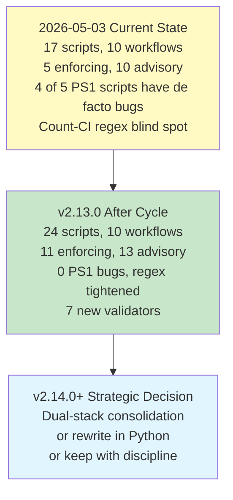
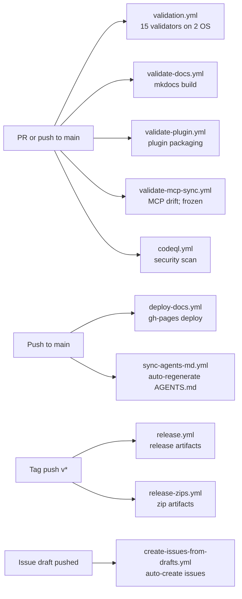

# CI Audit: Full Assessment as of 2026-05-03

**Date:** 2026-05-03
**Scope:** Complete inventory and analysis of `scripts/`, `.github/workflows/`, enforcement posture, gaps, and recommendations
**Trigger:** v2.13.0 cycle scoping. Replaces archived 2026-04-18 audit and 2026-05-01 refresh addendum.
**Auditor:** Claude (Opus 4.7) at /effort max
**Reading order:** Sections 1-2 are summary and methodology. Sections 3-4 are inventory and patterns (orientation). Sections 5-8 are findings and best practices (analysis). Sections 9-11 are recommendations and plan (action). Sections 12-15 are decisions, confidence, and reference. **Section 16 is implementation specifications** for v2.13 work items 5-12; consult it for "how to build each one" detail when executing.

---

## 1. Executive Summary

pm-skills currently ships **17 validator/check scripts** (each as a `.sh` + `.ps1` + `.md` triplet, indexed by `README_SCRIPTS.md`) and **10 GitHub Actions workflows**. The main `validation.yml` matrix runs 15 of those validators on Ubuntu (bash) and Windows (PowerShell), with **5 enforcing** (block merges) and **10 advisory** (warn but allow merge). The remaining 2 scripts (`build-release`, `sync-claude`) are tooling rather than validators.

The CI surface is structurally sound. The enforcing/advisory tiering is meaningful, the cross-platform matrix protects against bash-only or PowerShell-only assumptions, and the trigger discipline (path-filtered workflows) keeps PR latency low. v2.11.0 codified the Phase 0 Adversarial Review Loop pattern that v2.12.0 extended with a release-state confirmation loop.

**However, three classes of issue have accumulated:**

1. **Five PowerShell parity bugs** introduced or surfaced during v2.11.1 and v2.12.0 prep. Bash and PS1 have silently diverged. Some bugs are parse-level (the script can't run), some are logic-level (false positives that pollute output). The Windows leg of the CI matrix is currently de facto degraded.
2. **A regex blind spot in `check-count-consistency`** caught by Codex Round 2 of the v2.12.0 release-state loop. Prose forms with adjective interstitials ("38 AI agent skills") and per-phase counts below the MinThreshold of 10 ("Foundation: 7 skills") silently pass through. v2.12.0 needed manual cleanup.
3. **Eight net-new doc-CI validators** identified by the 2026-05-01 doc-structure audit (Section 14): nav-completeness, generated-content protection, cross-doc references, docs frontmatter, internal-link validity, version-reference drift, family-registration genericness, and a duplicate-doc divergence check (the last conditional on a separate Bucket A architectural decision). None of these have been authored.

Plus several strategic concerns: the bash + PowerShell dual-stack maintenance ratio is unfavorable (every new validator is double work, 4 of 5 PS1 scripts have de facto bugs), the advisory-heavy posture distribution lets drift accumulate (G9 from the prior audit remains open), and the family-registration validator hardcodes one family by name (G2 still open).

**This audit recommends 14 distinct CI items for v2.13.0** sequenced across three waves, with a clear strategic question deferred to v2.14.0+ (bash + PS1 dual-stack consolidation). Detail in Sections 10-11.



---

## 2. Methodology

This audit is a static review. No scripts were executed and no test data was generated. I:

1. Read the full archived 2026-04-18 audit (`docs/internal/audit/_archived/2026-04-18_ci-audit_post-v2.11.0.md`) for historical context and the prior G1-G9 enumeration.
2. Read the 2026-05-01 addendum (now archived per this audit's recommendation) to capture delta since v2.11.0.
3. Read the 2026-05-01 doc-structure audit Sections 14 and 15 for the 8 net-new doc-CI proposals and their suggested sequencing.
4. Read the v2.12.0 session log Phase 11 for the 5 PowerShell parity bugs and the count-CI regex blind spot detail.
5. Cross-checked the script and workflow inventory by globbing `scripts/*.{sh,ps1,md}` and `.github/workflows/*.yml`. Confirmed all 17 scripts have triplet completeness.
6. Read `validation.yml` end-to-end to confirm enforcement posture per script.
7. Cross-referenced gap status (G1-G9) against current backlog (F-29 to F-36) to determine which gaps remain open.
8. Synthesized strategic concerns from the cumulative pattern across v2.11.0 and v2.12.0 cycles.

**I did NOT:**

- Execute any script to confirm bug reports independently. The bug claims come from the v2.12.0 session log; treating them as authoritative.
- Read all 17 scripts line-by-line. Sampled key files referenced by gaps; confirmed bugs by reading targeted sections.
- Audit `pm-skills-mcp` CI separately. Out of scope; M-22 freeze still applies.

This audit is current as of 2026-05-03 and supersedes both the archived 2026-04-18 audit and the 2026-05-01 addendum.

---

## 3. Inventory

### 3.1 Scripts (17 in `scripts/`)

All 17 scripts ship as a triplet: `.sh` (bash, Linux/macOS) + `.ps1` (PowerShell, Windows) + `.md` (documentation). One additional file, `README_SCRIPTS.md`, indexes the set. Triplet completeness is 17/17 verified.

#### 3.1.1 Validators (15 scripts, invoked in `validation.yml`)

Grouped by primary concern:

**Skill-level validators (4):**

| Script | Purpose | Posture | What it catches |
|---|---|---|---|
| `validate-commands` | Every slash command in `commands/*.md` maps to a real skill in `skills/` | Enforcing | Broken commands invoking nonexistent skills |
| `validate-agents-md` | `AGENTS.md` skill list matches `skills/` directory | Enforcing | Drift between agent-discoverable surface and actual skills |
| `lint-skills-frontmatter` | Skill YAML frontmatter conforms to schema (required fields, types, format) | Enforcing | Malformed frontmatter that breaks loading; v2.11.1 added strict-YAML rules required by the open `skills` CLI |
| `validate-skill-history` | `HISTORY.md` (when present) conforms to versioning governance | Advisory | History format violations; only relevant for skills at v1.1.0+ |

**Family-level validator (1):**

| Script | Purpose | Posture | What it catches |
|---|---|---|---|
| `validate-meeting-skills-family` | Meeting Skills Family contract conformance for the 5 meeting skills (hardcoded by name in a `FAMILY_SKILLS` array) | Enforcing | Family-contract violations; introduced v2.11.0 |

**Release-coordination validators (2):**

| Script | Purpose | Posture | What it catches |
|---|---|---|---|
| `validate-version-consistency` | `.claude-plugin/plugin.json` version equals `marketplace.json` version | Enforcing | Plugin/marketplace version drift that breaks packaging |
| `validate-skills-manifest` | Per-release `skills-manifest.yaml` schema conformance | Advisory | Manifest schema violations |

**Documentation/coordination validators (5):**

| Script | Purpose | Posture | What it catches |
|---|---|---|---|
| `check-context-currency` | `AGENTS/claude/CONTEXT.md` freshness vs CHANGELOG | Advisory | CONTEXT.md aging without refresh |
| `validate-script-docs` | Every `.sh` and `.ps1` has a matching `.md` companion | Advisory | Triplet incompleteness (today is 17/17, this guards it) |
| `check-workflow-coverage` | Every workflow doc has a slash command | Advisory | New workflow without a discoverable command |
| `check-count-consistency` | Documented skill/command/workflow counts match filesystem reality | Advisory | Stale "32 skills" prose; **regex blind spots noted in Section 5.1.5** |
| `check-generated-freshness` | Auto-generated files re-derive cleanly from source | Advisory | Hand-edits to generated content (until next regen) |

**Auxiliary validators (3):**

| Script | Purpose | Posture | What it catches |
|---|---|---|---|
| `check-mcp-impact` | PR changes that affect pm-skills-mcp embedded surface | Advisory | MCP impact awareness; MCP frozen per M-22 so currently informational only |
| `check-stale-bundle-refs` | References to old "bundles" terminology (renamed to workflows in v2.9.0) | Advisory | Terminology regression; **PS1 has reserved-keyword bug, see Section 5.1.1** |
| `validate-gitignore-pm-skills` | `_pm-skills/` is in `.gitignore` | Advisory | Dev-workflow ergonomics |

#### 3.1.2 Tooling (2 scripts, not invoked in `validation.yml`)

| Script | Purpose | Invoked from |
|---|---|---|
| `build-release` | Builds release zip artifact | `release-zips.yml` (tag-triggered) |
| `sync-claude` | Regenerates `.claude/` workspace from flat source | Manual (developer-triggered) |

#### 3.1.3 Index (1 file)

`README_SCRIPTS.md` indexes the script set with one-line summaries. Useful entry point for new contributors.

### 3.2 Workflows (10 in `.github/workflows/`)

By trigger pattern:



**Operational summary:**

| Workflow | Triggers | Status |
|---|---|---|
| `validation.yml` | Push and PR to main | Primary CI matrix; bash + PowerShell parity check |
| `validate-docs.yml` | Doc-path changes | MkDocs `--strict` build before deploy |
| `validate-plugin.yml` | Plugin-path changes; tags | Claude plugin manifest validation |
| `validate-mcp-sync.yml` | Skill/command-path changes; manual | MCP drift check; M-22 frozen so currently informational |
| `deploy-docs.yml` | Push to main (doc paths) | Auto-deploy to GitHub Pages |
| `sync-agents-md.yml` | Push to main (skill/workflow/command paths) | Auto-regenerates AGENTS.md from source |
| `release.yml` | Tag push `v*` | Builds release artifacts (does not auto-create GitHub Release) |
| `release-zips.yml` | Tag push `v*` | Builds zip artifacts |
| `create-issues-from-drafts.yml` | Issue-draft push | Process automation |
| `codeql.yml` | Push, PR, scheduled | GitHub CodeQL security scanning |

### 3.3 Enforcement matrix

```
                  Enforcing (5)                 Advisory (10)
                  =================             ==================
Skill-level       validate-commands             validate-skill-history
                  validate-agents-md
                  lint-skills-frontmatter

Family-level      validate-meeting-skills-family

Release           validate-version-consistency  validate-skills-manifest

Documentation     (none)                        check-context-currency
                                                check-count-consistency
                                                check-generated-freshness
                                                check-workflow-coverage
                                                validate-script-docs

Auxiliary         (none)                        check-mcp-impact
                                                check-stale-bundle-refs
                                                validate-gitignore-pm-skills
```

**Distribution insight:** all enforcement is concentrated on skill-level and release-coordination concerns. **Documentation and auxiliary concerns are entirely advisory.** This is the structural reason `check-count-consistency`-style drift accumulates: even when the script flags an issue, no PR is blocked. v2.11.1 manually ran the script and fixed 8 stale references that had accumulated over a 2-week period; the script never blocked the merges that introduced them.

---

## 4. Patterns and Conventions in Place

This section is for learning. Each pattern is intentional, with trade-offs.

### 4.1 The .sh + .ps1 + .md triplet

**What it is:** every script ships in three files: bash version (`.sh`), PowerShell version (`.ps1`), markdown documentation (`.md`).

**Why it exists:**

- Bash runs on Linux/macOS; PowerShell runs on Windows. Both are first-class targets.
- The `.md` companion explains what the script does, when to run it, exit codes, and limitations. Documentation lives next to the script, not buried in a wiki.
- The `validate-script-docs.sh` validator checks triplet completeness: every script has all three files. This guards against the "wrote a script, forgot to document" failure mode.

**Trade-offs:**

- Pro: every script is documented at authoring time. Windows users have native experience.
- Con: every script change requires bash + PS1 + md updates. **5 of 17 PS1 scripts currently have de facto bugs (Section 5.1)**, suggesting the parity discipline has been hard to maintain.

**My take:** the triplet was a sound early-stage decision. As validator count grew (now 17), the bash/PS1 maintenance ratio has become unfavorable. The `.md` companion remains valuable. Section 9 explores three options for the cross-platform question.

### 4.2 The advisory-to-enforcing promotion path

**What it is:** new validators ship advisory (`continue-on-error: true` in `validation.yml`). After observing them in real use for one or more release cycles, candidates that produce no false positives get promoted to enforcing.

**Why it exists:**

- A new validator might catch real problems but also have edge cases that trip false alarms. Shipping advisory-first lets contributors see the validator's output without it blocking PRs.
- Promotion is a discrete, considered decision: "this has been advisory for X cycles; it's stable; promote."

**Trade-offs:**

- Pro: low-risk introduction of new checks. No CI breakage on day one.
- Con: **scripts can stay advisory indefinitely.** v2.11.0's audit recommended promoting `check-count-consistency`, `validate-script-docs`, and `check-workflow-coverage`. As of 2026-05-03, none have been promoted. The advisory tier accumulates without clear promotion triggers.

**My take:** the pattern is sound but needs a forcing function. Either a per-cycle "promotion review" agenda item, or automatic promotion after N cycles of zero false positives.

### 4.3 The cross-platform matrix

**What it is:** `validation.yml` runs on Ubuntu and Windows in parallel. Each script invoked twice (once via bash, once via pwsh).

**Why it exists:**

- Bash-only assumptions in scripts (POSIX paths, bash-specific globbing) would silently break Windows users.
- PowerShell-only assumptions would break Linux/macOS users.
- The matrix surfaces parity issues at PR time.

**Trade-offs:**

- Pro: real cross-platform support, not just claimed support.
- Con: doubles CI runtime. **More importantly: PS1 bugs that produce non-zero exit codes don't always fail the workflow** (because of `continue-on-error` posture for advisory checks), so 5 PS1 bugs have lurked without surfacing despite the matrix.

**My take:** the matrix is good. The buy-in to make it work is enforcing posture for the advisory checks. Without enforcement, the Windows leg can run with subtle bugs and no one notices.

### 4.4 Trigger discipline

**What it is:** workflows are path-filtered. `validate-docs.yml` only runs on doc changes. `validate-plugin.yml` only runs on plugin changes. `validation.yml` runs on every push/PR (broadest).

**Why it exists:**

- CI runtime is precious; running every workflow on every change is wasteful.
- Path filters keep PR feedback fast.

**Trade-offs:**

- Pro: focused workflows, fast feedback.
- Con: path filters need maintenance. If a new top-level path is added without updating workflow path filters, validation may silently skip it.

**My take:** sound pattern. Worth a periodic re-confirmation that path filters cover all relevant paths.

### 4.5 The Phase 0 Adversarial Review Loop

**What it is:** a release process gate, codified in v2.11.0. After mechanical CI passes, run Codex (or another adversarial reviewer) against the release stack. Resolve findings. Re-run. Repeat until findings stabilize below IMPORTANT severity. v2.12.0 extended this with a release-state confirmation loop running on the broader release stack.

**Why it exists:**

- Mechanical CI catches what it's designed to catch. It misses:
  - Cross-document semantic inconsistencies (one doc says X skills, another says Y)
  - Self-contradicting prose
  - Stale claims (counts, version references, enumerations)
  - Audit-trail accuracy in the release notes themselves

v2.11.0 Round 2 caught 6 IMPORTANT findings that all mechanical validators had passed on. v2.12.0 ran 4 release-state rounds catching 9 distinct MEDIUM defects.

**Trade-offs:**

- Pro: catches what CI cannot.
- Con: time-cost (~12 minutes of Codex compute for v2.12.0; can stretch). Asymptotic risk: each round can surface meta-issues about the previous round's resolution, hence the "stabilize below IMPORTANT" termination rule.

**My take:** this pattern is a major win. The release-state confirmation loop is now codified and worth preserving. The CI here doesn't replace the loop; the loop catches what the CI cannot.

---

## 5. Findings: Current Defects

### 5.1 PowerShell parity bugs (5 items, all current at 2026-05-03)

Discovered during v2.12.0 release prep. The Windows leg of `validation.yml` matrix has been running with these bugs in flight.

#### 5.1.1 Bug 1: `check-stale-bundle-refs.ps1` reserved-word collision

A variable named `$matches` collides with PowerShell's automatic variable populated by the `-match` operator. Assignments to `$matches` either silently fail or produce unexpected values depending on PowerShell version. The script's logic is broken on Windows.

**Effect:** Windows leg reports clean state regardless of whether stale bundle refs exist.

**Fix:** Rename to `$bundleMatches` (or similar non-reserved name). Half-day work including test verification.

#### 5.1.2 Bug 2: `check-workflow-coverage.ps1` Join-Path positional parameter

`Join-Path` invocations use positional parameters in a way PowerShell parses ambiguously when the first argument has a trailing slash or expansion mismatch. Either parse error or wrong-path output.

**Effect:** Script either fails to parse or operates on wrong paths.

**Fix:** Use named parameters: `Join-Path -Path $base -ChildPath $rel`. Audit every `Join-Path` call in the file. Half-day work.

#### 5.1.3 Bug 3: `check-generated-freshness.ps1` Join-Path positional parameter

Same root cause as Bug 2. Likely shared root if `Join-Path` is used identically across multiple PS1 scripts. Could share a fix pattern.

**Effect:** Same as Bug 2.

**Fix:** Same as Bug 2. Refactor into a shared helper if pattern repeats elsewhere.

#### 5.1.4 Bug 4: `lint-skills-frontmatter.ps1` false-positive missing-references

Script reports missing `references/EXAMPLE.md` for `utility-pm-skill-validate`, `utility-slideshow-creator`, and `utility-update-pm-skills`. Bash version finds these files correctly. The PS1 path-detection logic is broken; likely a relative-vs-absolute path mismatch or a glob-pattern POSIX/Windows separator issue.

**Effect:** Windows leg reports false positives. Windows users see "missing files" errors that don't exist.

**Fix:** Audit path resolution. Likely `Get-ChildItem -Path "skills/*/references"` needs to be rewritten as `Get-ChildItem -Path (Join-Path $repoRoot "skills" "*" "references")`. 2 to 4 hours plus test verification across all 40 skills.

#### 5.1.5 Bug 5: `check-count-consistency.ps1` regex blind spot (also affects bash version)

Same regex pattern as the bash version. The regex is `[0-9]+\s+(?:PM\s+|product\s+management\s+)?skills`. It does NOT match these patterns:

- `38 AI agent skills` (the words "AI agent" are between digit and "skills"; the regex alternation only handles "PM " or "product management ")
- `38 best-practice product management skills` (works because "product management" is in the alternation, but only if exactly preceding "skills")
- `Foundation: 7 skills` (per-phase counts under the `MinThreshold = 10` filter)

Codex Round 2 of the v2.12.0 release-state loop caught 2 instances of "38 AI agent skills" / "38 best-practice product management skills" in `docs/index.md` that the regex had silently missed.

**Effect:** Stale prose-form counts pass undetected. Manual sweep needed at release time.

**Fix:** Regex tightening (Section 7.4) plus posture promotion to enforcing for current-state files.

### 5.2 Coverage gaps from prior audit (G1-G9 status)

The 2026-04-18 audit identified 9 gaps. As of 2026-05-03, status:

| Gap | Title | Status |
|---|---|---|
| **G1** | Sample-standards enforcement (no validator for `library/skill-output-samples/*`) | **Open.** F-33 effort still in backlog; deferred from v2.13 per session log re-eval |
| **G2** | Generic family-registration validator (current `validate-meeting-skills-family` hardcodes 5 skills) | **Open.** F-31 partially closes via `pm-skill-validate` family awareness; F-36 fully closes; F-36 in v2.13 Bucket C Wave 3 |
| **G3** | Utility-skill content currency (e.g., `pm-skill-builder` SKILL.md hardcoded counts) | **Partially exercised, mechanism still advisory.** v2.11.1 manually fixed 8 stale references using `check-count-consistency` output. F-32 deferred from v2.13 |
| **G4** | Internal link checking in docs | **Open.** v2.13 Bucket C Wave 3 addresses (new validator) |
| **G5** | GitHub Release auto-creation on tag | **Open.** Manual `gh release create` workflow continues; nice-to-have, deferred |
| **G6** | Contract-validator version sync (validator doesn't check contract version against its own expectations) | **Open.** No drift has materialized; meeting-skills-contract still at v1.1.0; gets trickier with multiple families |
| **G7** | macOS matrix leg | **Open.** Not added; defer indefinitely |
| **G8** | Post-deploy docs smoke test | **Open.** Not added; defer |
| **G9** | Promote advisory → enforcing for current-state-applicable scripts | **Partial.** `check-count-consistency` advisory promotion in v2.13 Bucket C; `validate-script-docs` and `check-workflow-coverage` still advisory |

### 5.3 Net-new gaps from doc-structure audit (Section 14, 8 items)

The 2026-05-01 doc-structure audit identified 8 net-new CI gaps that don't overlap G1-G9:

| Item | Title | v2.13 disposition |
|---|---|---|
| 14.1 | Tighten `check-count-consistency` regex; promote enforcing | **In Bucket C** (closes Bug 5 above) |
| 14.2 | New `validate-docs-frontmatter` (rendered docs frontmatter conformance) | **In Bucket C Wave 3** |
| 14.3 | New `check-nav-completeness` (every doc in nav or excluded) | **In Bucket C Wave 1** |
| 14.4 | New `check-generated-content-untouched` (regen + diff) | **In Bucket C Wave 2** |
| 14.5 | New `check-duplicate-doc-divergence` (only relevant if Option A keep-duplicates) | **OUT.** Default is Option C delete-duplicates, so this script is unnecessary by construction |
| 14.6 | New `check-internal-link-validity` | **In Bucket C Wave 3** |
| 14.7 | New `check-version-references` | **In Bucket C Wave 3, advisory** |
| 14.8 | New `validate-references-cross-doc` | **In Bucket C Wave 2** |

### 5.4 Strategic concerns

#### 5.4.1 Bash + PS1 dual-stack maintenance ratio

5 PS1 scripts have de facto bugs as of 2026-05-03. The pattern across the last two cycles:

- **v2.11.1** (2026-04-22): added two new lint rules to `lint-skills-frontmatter` for skills.sh CLI compatibility. Both rules implemented in bash and PS1; subsequent inspection found PS1 false-positives.
- **v2.12.0** (2026-05-03): release-state loop caught the count-CI regex blind spot AND surfaced the 5 PS1 bugs that had accumulated.

The cost-side: every new validator authored requires bash + PS1 logic, plus testing that both produce identical output, plus maintenance when behavior changes. The benefit-side: Windows users get native shell experience.

**Question worth asking:** is the benefit-side actually realized? In the 4 weeks since v2.11.1, no Windows user has reported a CI issue tied to the PS1 bugs (the bugs have been silent failures in the Windows matrix leg). This suggests one of three things: (a) Windows users are tolerant and didn't report, (b) Windows users primarily run validators via WSL or Git Bash anyway, or (c) Windows users don't run validators locally (only via CI).

**Section 9 explores three options.** This audit recommends raising the question explicitly and capturing maintenance-cost data over v2.13 to inform a v2.14.0+ decision.

#### 5.4.2 Advisory-heavy posture distribution

10 advisory + 5 enforcing means **2/3 of CI is advisory**. Advisory checks accumulate drift. The pattern is:

1. New check ships advisory (responsible).
2. Check flags real issues (good).
3. PRs merge despite the flags because advisory doesn't block (the design intent).
4. Drift accumulates because no PR is forced to fix the flagged issue (the unintended consequence).
5. Manual sweep needed at release time (the cost).

v2.11.1 made this pattern visible: 8 stale "27 skills" / "31 skills" references had accumulated despite `check-count-consistency` flagging them advisory the whole time. The cost was a release-prep sweep.

**Mitigation:** post-cycle promotion review where each long-advisory check is evaluated for promotion candidacy. Section 6.2 expands.

#### 5.4.3 The hardcoded-by-name pattern (G2 still open)

`validate-meeting-skills-family.sh` hardcodes `FAMILY_SKILLS = ["foundation-meeting-agenda", "foundation-meeting-brief", ...]`. A new family (Research Family, Delivery Family) would need a new script. The naming is path-coupled: validator name reveals family scope.

**Better pattern (F-36):** a registry at `docs/reference/skill-families/_registry.yaml` lists every family with its members and contract path. The generic validator iterates the registry. Adding a family requires registry edit, not script authoring.

This is in v2.13 Bucket C Wave 3 (item 12). Closes G2 fully.

---

## 6. Best Practices Analysis

### 6.1 What pm-skills does well

Several patterns are exemplary and worth preserving:

1. **Triplet completeness.** Every script has bash + PS1 + md. Documentation rot is structurally hard.
2. **Dual-platform matrix.** Real cross-platform testing, not just claimed support.
3. **Path-filtered triggers.** CI runtime stays low; PR feedback is fast.
4. **Phase 0 Adversarial Review Loop.** Codified in v2.11.0, extended in v2.12.0. Catches what CI cannot.
5. **Clear separation of concerns.** Validation, deployment, release, and automation are distinct workflows. Easy to reason about what runs when.
6. **Static evidence.** Audits (this one, the structure audit, the branches/PR audit) provide artifact-grade evidence for every recommendation.
7. **Generator pipeline.** Three Python generators (`generate-skill-pages.py`, `generate-workflow-pages.py`, `generate-showcase.py`) keep `docs/skills/`, `docs/workflows/`, `docs/showcase/`, and `docs/reference/commands.md` in lockstep with source. Reduces hand-edit drift.

### 6.2 What pm-skills could adopt

Specific best-practice gaps where adoption would meaningfully improve maintainability:

#### 6.2.1 Promotion forcing function for advisory checks

Currently advisory-to-enforcing promotion is on no schedule. Add a per-cycle "promotion review" step:

- For each advisory validator, count: how many PRs in the last cycle had findings? How many were false positives? How many true positives?
- If false-positive rate is zero or near-zero AND true-positive rate is non-zero, the validator is a candidate for promotion.

Two checks meet this threshold today: `validate-script-docs` (no false positives in 17/17 triplet-complete state; flagged the gap before 2026-04-18 audit) and `check-workflow-coverage` (similar).

#### 6.2.2 Output format consistency

Different validators emit different output formats. Some print one finding per line; some emit JSON-like structures; some include color codes. A standard format (e.g., `severity:file:line: message`) would let `validation.yml` aggregate findings and produce a consolidated end-of-run report.

Specific value: when a PR has 3 advisory failures across 3 different validators, the contributor today reads 3 different stdout sections. A consolidated format could surface "3 advisory findings across 3 validators" in the GitHub Actions summary.

#### 6.2.3 Exit code conventions

Current exit code semantics differ across scripts. Some return 0 = clean / 1 = any issue. Some return 0 = clean / 1 = enforcing-level / 2 = advisory-level. The lack of standard makes the `continue-on-error` discipline brittle.

**Standardize:** 0 = clean, 1 = enforcing failure, 2 = advisory finding (only-flag, don't-fail). `validation.yml` can then use `continue-on-error` for advisory-tier checks and rely on the script's exit code to distinguish.

#### 6.2.4 Test coverage for CI scripts themselves

CI scripts validate the rest of the repo. **Who validates the CI scripts?** No tests exist for any of the 17. A simple test pattern would prevent the regex blind spot class of issue:

- For each validator, a `scripts/_tests/` directory with synthetic input files representing the cases the validator should catch.
- A `run-validator-tests.sh` runs each validator against its test fixtures and checks exit code and output.

This would have caught the `check-count-consistency` regex blind spot at authoring time: a test fixture with `38 AI agent skills` would have failed because the validator missed it.

**Effort:** medium. Worth it for the validators that are or will become enforcing.

#### 6.2.5 Shared lib for common patterns

Bash and PowerShell don't share helper code today. Several patterns repeat:

- Path resolution (`$repoRoot`, `Join-Path` correctness)
- Frontmatter YAML parsing
- File globbing with skip patterns
- Output formatting

Extract to `scripts/_lib/`:

```
scripts/
  _lib/
    common.sh          # path helpers, exit code constants, output formatting
    common.ps1         # PowerShell equivalent
    parse-frontmatter.sh
    parse-frontmatter.ps1
```

Reduces duplication. Would make Bug 2 and Bug 3 (Join-Path positional parameter) a single fix in one helper.

**Effort:** medium. Pairs naturally with the standardization work.

#### 6.2.6 Generated-content protection (Pattern 5C)

The 2026-05-01 doc-structure audit Section 13 Pattern 5 proposes a `generated: true` frontmatter flag on auto-generated pages, paired with a CI script that re-runs generators and diffs against committed files. This is in v2.13 Bucket A + Bucket C. Adopting it closes the hand-edit-to-generated-file failure mode.

---

## 7. Refactoring Opportunities

### 7.1 Extract shared helpers (`scripts/_lib/`)

Discussed in 6.2.5. Create:

- `scripts/_lib/common.sh` and `_lib/common.ps1` for path resolution, output formatting, exit code constants.
- `scripts/_lib/parse-frontmatter.sh` and `_lib/parse-frontmatter.ps1` for the recurring YAML-frontmatter-parsing pattern (currently duplicated across `lint-skills-frontmatter`, `validate-meeting-skills-family`, and would-be `validate-docs-frontmatter`).

**Impact:** reduces line count across scripts by ~15 to 20%. Single point of fix for path/parsing bugs. Slightly higher onboarding cost (contributor must know about `_lib/`).

**Effort:** medium (2 to 3 days for initial extraction; subsequent script authoring becomes faster).

**Defer to v2.14.0+ unless** v2.13's new validator authoring (7 new scripts) makes the duplication acutely painful.

### 7.2 Generic family-registration validator (F-36)

Currently in v2.13 Bucket C Wave 3. Replaces `validate-meeting-skills-family.sh` hardcoded `FAMILY_SKILLS` array with config-driven registry approach.

**Impact:** future families add a registry entry; no script authoring. Closes G2.

**Effort:** medium (in scope for v2.13).

### 7.3 Generated-content protection (Pattern 5C + new validator)

Bucket A item F-46 (frontmatter flag) + Bucket C Wave 2 item 7 (`check-generated-content-untouched.sh`).

**Impact:** hand-edits to generated files surface at PR time, not at next-deploy time. Closes a class of silent breakage.

**Effort:** small (frontmatter flag) + day (new validator). In scope for v2.13.

### 7.4 Counts derived from manifest (Pattern 2 from doc-structure audit)

Currently deferred to v2.14.0+ pending Zensical decision. Worth flagging as a refactoring direction:

- Stop hardcoding counts in prose entirely.
- Either (a) generate count-bearing pages from a `_data/counts.yaml` populated by a pre-build script, or (b) use `mkdocs-macros-plugin` to compute counts at build time.

**Impact:** eliminates an entire drift class. The recurring "stale 32 skills" issue across multiple cycles becomes structurally impossible.

**Effort:** medium (introduces a dependency, requires authoring strategy).

**Defer rationale:** depends on which doc engine renders (Material, Zensical, or Plan B Astro Starlight). Locking the doc-stack first lets us pick the right counts-derivation pattern.

### 7.5 Output consolidation

Standardize output format across all 17 scripts (Section 6.2.2). Add a `validation.yml` step that aggregates findings into a single end-of-run summary in the GitHub Actions UI.

**Impact:** contributors see one summary instead of N stdout sections. Reduces "where do I look for what failed?" friction.

**Effort:** medium (touches every script). Best done when the lib extraction (7.1) lands.

**Defer to v2.14.0+.**

---

## 8. Standardization Opportunities

### 8.1 Naming conventions

Current names are descriptive but not fully consistent:

- `validate-X` vs `check-X`: subtle distinction (validate = strict conformance check, check = inspection without strict pass/fail). Mostly consistent: validators tend to be enforcing, checks tend to be advisory. Honor this when authoring new scripts: enforcing → `validate-`, advisory → `check-`.
- `lint-X`: only one (`lint-skills-frontmatter`). Treat as alias for `validate-` for established patterns.

**Recommendation:** explicit naming-convention note in `README_SCRIPTS.md`. New scripts follow it.

### 8.2 Output format

Discussed in 6.2.2. Standardize to `severity:file:line: message` format.

### 8.3 Exit codes

Discussed in 6.2.3. Standardize to 0/1/2 semantics.

### 8.4 Documentation patterns in `.md` companions

Each script's `.md` file should follow a structure:

```
# Script Name

## Purpose
## When to run
## What it catches
## Exit codes
## Limitations / known issues
## See also
```

A quick scan of existing `.md` files shows partial adoption. Standardize the structure; add validation in `validate-script-docs.sh`.

### 8.5 Workflow naming

Workflows are mostly named action-noun pattern (`validate-docs.yml`, `validate-plugin.yml`, `deploy-docs.yml`, `release.yml`). Two outliers: `release-zips.yml` (action + qualifier) and `create-issues-from-drafts.yml` (verb-object-prepositional-phrase). Consistency here is low-stakes; defer.

---

## 9. The Cross-Platform Question

This deserves its own section because it's the most consequential strategic decision in the v2.14.0+ horizon.

### 9.1 Current dual-stack reality

- 17 scripts × 2 (bash + PS1) = 34 script artifacts to maintain.
- 5 PS1 scripts have de facto bugs as of 2026-05-03 (29% bug rate).
- Every new validator requires authoring + parity testing in both languages.
- The Windows leg of CI runs PS1 invocations matrix-paired with bash. Bug-affected PS1 returns non-zero exit but `continue-on-error` swallows it, masking the failure.
- No Windows user has reported a CI issue tied to PS1 bugs in the last 4 weeks.

### 9.2 Maintenance cost analysis

Rough sizing for v2.13 alone:

- 7 new validators × 2 (bash + PS1) × 1 day each = ~14 days of authoring (assumes parallel authoring is unrealistic; sequential is closer).
- Realistic: ~10 days authoring + 3 days parity reconciliation = 13 days.
- If we drop PS1: ~6 days authoring + 0 reconciliation = 6 days. **More than 50% time savings.**

Plus bug-fix cost: 5 PS1 bugs × ~half-day each = 2.5 days. With single-stack: 0.

### 9.3 Three options

#### Option A: Keep dual stack

Status quo. Fix the 5 bugs, write new validators in both, accept the 50% maintenance tax.

- Pro: Windows users get native experience (whether they use it or not).
- Con: highest maintenance cost; PS1 will continue to drift from bash.

#### Option B: Consolidate to bash, document Windows setup

Drop PS1. Document Git Bash, WSL, or Cygwin as required for Windows contributors. CI matrix runs only on Ubuntu.

- Pro: halves maintenance burden. Bash is more common in cross-platform shell scripting.
- Con: Windows contributors need to set up Git Bash or WSL. Some friction. May signal "Windows is not first-class."

#### Option C: Rewrite in Python

Author all validators in Python. Single codebase, runs on any platform with Python 3.10+. Repo already has Python (the 3 generators).

- Pro: true cross-platform parity from one source. Better testability (unittest, pytest). Better library ecosystem (YAML parsing, regex with named groups, file-walking).
- Con: highest one-time cost (rewrite all 17 + author 7 new = 24 scripts). Onboarding cost (contributors must know Python, not just shell).

### 9.4 My recommendation

**v2.13: Option A (keep dual stack).** Fix the bugs, write new validators in both, accept the cost. Don't change strategic direction mid-cycle.

**Capture data during v2.13:**

- Hours spent on PS1 parity authoring per new validator.
- New PS1 bugs surfaced during v2.13.
- Whether any Windows user reports a CI issue tied to PS1.

**v2.14.0 strategic decision:** review the data. If the maintenance ratio is still unfavorable AND no Windows user has needed PS1 for native execution, **commit to Option B** (drop PS1, document Git Bash for Windows). This is the lowest-disruption option; Option C (Python rewrite) is higher cost than the savings justify unless the validator count grows significantly beyond 24.

---

## 10. Detailed Plan & Approach

This section is the v2.13 actionable plan: which items, what wave, what posture, what effort. **Per-item implementation detail (regex patterns, pseudo-code, test cases) lives in Section 16.** The cycle-scoped execution tracker (status, decisions journal, CI workflow integration) lives in `docs/internal/release-plans/v2.13.0/plan_v2.13_ci-refactor.md` per the audit + plan pair convention. Section 11 quantifies the impact.

### 10.1 Wave 1: Prerequisites (week 1-2)

**Items 1-6.** Mostly correctness fixes plus the count-CI tightening and nav-completeness validator. None depend on Bucket A architectural decisions; all can run in parallel.

| # | Item | Effort | Posture |
|---|---|---|---|
| 1 | Fix `check-stale-bundle-refs.ps1` reserved-word bug | 1h | Advisory (unchanged) |
| 2 | Fix `check-workflow-coverage.ps1` Join-Path | 1h | Advisory (unchanged) |
| 3 | Fix `check-generated-freshness.ps1` Join-Path | 1h | Advisory (unchanged) |
| 4 | Fix `lint-skills-frontmatter.ps1` path-detection | 2-4h | Enforcing (unchanged) |
| 5 | Tighten `check-count-consistency` regex; promote to enforcing for current-state | Half-day | Advisory → Enforcing (for current-state) |
| 6 | New `check-nav-completeness.{sh,ps1,md}` | Half-day | Enforcing |

**Sequencing within Wave 1:** parallelizable. All 6 can be authored concurrently or by separate sessions. Bugs 1-4 are isolated (no shared state). Item 5 modifies an existing script. Item 6 is a new validator with no dependency on the others.

**Verification gate at end of Wave 1:**

- All 5 PS1 scripts pass on Windows leg of `validation.yml` (no parse errors, no false positives).
- `check-count-consistency` enforcing on current-state files passes on `main`.
- `check-nav-completeness` enforcing passes on `main` (after `docs/reference/README.md` and any other unwired files are addressed; note that v2.13 Bucket A architectural changes will reshape this set).

### 10.2 Wave 2: After Bucket A architectural decisions land (week 2-3)

**Items 7-8.** Generated-content protection and cross-doc reference validation. Both depend on the file set stabilizing post-Bucket A (duplicate file deletion, `docs/frameworks/` retirement).

| # | Item | Effort | Posture |
|---|---|---|---|
| 7 | New `check-generated-content-untouched.{sh,ps1,md}` (re-runs generators, diffs against committed) | Day | Enforcing |
| 8 | New `validate-references-cross-doc.{sh,ps1,md}` (cross-link validity in `docs/reference/`) | Day | Enforcing |

**Why second wave:** running these against an unstable file set produces noise. Wait until Bucket A lands.

**Pairs with Bucket A:** item 7 pairs with Pattern 5C frontmatter flag (Bucket A item F-46). Item 8 needs accurate file set.

### 10.3 Wave 3: Durable improvements (week 3-5)

**Items 9-12.** Independent improvements; can run in any order.

| # | Item | Effort | Posture |
|---|---|---|---|
| 9 | New `validate-docs-frontmatter.{sh,ps1,md}` (rendered docs frontmatter conformance) | Day | Enforcing |
| 10 | New `check-internal-link-validity.{sh,ps1,md}` (lychee for internal links) | Day | Enforcing (internal); advisory (external) |
| 11 | New `check-version-references.{sh,ps1,md}` (hardcoded version drift) | Half-day | Advisory (promote after 1 cycle clean) |
| 12 | F-36: New `validate-skill-family-registration.{sh,ps1,md}` (replaces hardcoded FAMILY_SKILLS array) | Medium | Enforcing |

### 10.4 v2.14.0+ deferrals

| Item | Why deferred |
|---|---|
| Audit 14.5: `check-duplicate-doc-divergence` | Only relevant if Option A keep-duplicates; default is Option C delete |
| G5: GitHub Release auto-creation | Manual `gh release create` works; nice-to-have not blocker |
| G7: macOS matrix leg | Not requested; defer indefinitely |
| G8: Post-deploy docs smoke test | Defer indefinitely |
| Section 6.2.4: Test coverage for CI scripts | Worth doing; defer to v2.14.0 to keep v2.13 scope clean |
| Section 7.1: Shared `_lib/` extraction | Pairs with the cross-platform decision; defer to v2.14.0 |
| Section 7.4: Counts derived from manifest (Pattern 2) | Depends on doc-stack decision (Zensical vs Plan B); defer |
| Section 9: Bash + PS1 dual-stack consolidation | Strategic decision; capture v2.13 data and decide v2.14.0 |
| F-31, F-32, F-33, F-35: Sample-automation slate | Per session log re-eval, may be obsolete after v2.12.0 builder cleanup |

### 10.5 Out of scope for v2.13

- pm-skills-mcp CI changes (M-22 freeze).
- Migration to single-platform CI (decision deferred to v2.14.0+).
- Test coverage for CI scripts (deferred to v2.14.0).
- Output format consolidation (deferred to v2.14.0).

---

## 11. Impact Analysis

### 11.1 Per-item blast radius

| Item | Files affected | Breaking-change risk | CI runtime delta | Contributor friction |
|---|---|---|---|---|
| Wave 1 PS bug fixes (1-4) | 4 PS1 files | None (was already broken on Windows; fix restores intended behavior) | 0 | Positive (fewer false alarms) |
| Wave 1 count-CI tighten (5) | 1 `.sh` + 1 `.ps1` script; promotion changes posture in `validation.yml` | Medium (existing prose may now fail; expect Bucket B count fixes to resolve before promotion) | +2-3s per run | Low (clear error messages) |
| Wave 1 nav-completeness (6) | 3 new files (`check-nav-completeness.{sh,ps1,md}`); 1 line in `validation.yml` | Low (new validator; sets new bar) | +1-2s | None expected (current `mkdocs.yml` is mostly aligned) |
| Wave 2 generated-untouched (7) | 3 new files; 1 line in `validation.yml`; pairs with Bucket A frontmatter flag | Low (catches hand-edits which should be prevented) | +5-10s (runs 3 generators) | Low (auto-fix command in error message) |
| Wave 2 cross-doc refs (8) | 3 new files; 1 line in `validation.yml` | Low (current state is mostly clean per audits) | +1-2s | None expected |
| Wave 3 docs-frontmatter (9) | 3 new files; 1 line in `validation.yml` | Medium (some pages may lack required frontmatter; will surface during PR) | +2-3s | Low |
| Wave 3 internal links (10) | 3 new files; lychee install in CI; 1 line in `validation.yml` | Medium (broken links exist; expect cleanup PRs to follow) | +5-10s (lychee scan) | Low |
| Wave 3 version refs (11) | 3 new files; 1 line in `validation.yml` advisory | Low (advisory; surfaces drift, doesn't block) | +1s | None expected |
| Wave 3 F-36 family validator (12) | New `validate-skill-family-registration.{sh,ps1,md}`; `validate-meeting-skills-family.{sh,ps1}` becomes thin wrapper; new `_registry.yaml` | Medium (architectural change; needs careful migration) | 0 (replaces existing) | None expected |

**Aggregate CI runtime impact:** ~+15 to 30 seconds per run. Validation matrix currently completes in ~2 to 3 minutes; new total ~2.5 to 3.5 minutes. Acceptable.

### 11.2 Aggregate impact on PR experience

**Before v2.13:**

- CI runs in 2 to 3 min on Ubuntu, similar on Windows (with hidden PS1 bugs).
- PR contributor sees 5 enforcing checks pass (or fail on legitimate issues) and 10 advisory checks (some of which always show "advisory finding" for historical drift).

**After v2.13:**

- CI runs in ~2.5 to 3.5 min.
- PR contributor sees 11 enforcing checks pass (more guardrails) and 13 advisory checks (added 3 new advisory: `check-version-references` for v2.13, plus the existing 10).
- New enforcing validators block PRs that introduce: nav orphans, hand-edits to generated files, cross-doc reference breaks, frontmatter regressions, broken internal links, family-registration drift.
- Windows leg of CI is genuinely working (no PS1 bugs).

**Net contributor experience:** more guardrails fail loudly and clearly. Some PRs that would have merged silently with drift now require fixing the drift first. This is the design intent. The doc-structure audit + structure cleanup work in Bucket A/B addresses pre-existing drift before it would surface as new validator failures.

### 11.3 Aggregate impact on contributor onboarding

**Before v2.13:**

- 17 scripts, 5 enforcing. Contributor learns the enforcing 5 via failed PRs.
- Advisory output is noise; contributor learns to filter it.

**After v2.13:**

- 24 scripts, 11 enforcing. More upfront learning.
- `README_SCRIPTS.md` indexes the set; if updated to reflect the new validators, onboarding stays manageable.

**Mitigation:** as part of v2.13, refresh `scripts/README_SCRIPTS.md` to:

- Group scripts by category (skill-level, doc-level, family-level, release-level, auxiliary).
- Note enforcement posture per script.
- Link each script to its `.md` companion for detail.

This is a small Bucket B item worth adding.

### 11.4 Aggregate impact on release-prep velocity

**Before v2.13:**

- Release prep involves manual sweeps for stale counts, broken links, missing frontmatter. v2.11.1 spent half a day on stale counts. v2.12.0 ran 4 release-state Codex rounds catching ~9 defects.

**After v2.13:**

- Many of those defects surface at PR time, not release time. Release prep focuses on novel issues only.
- v2.13's Phase 0 release-state loop should converge faster than v2.12.0's because the baseline validator surface is broader.

**Estimated savings per release:** 1 to 2 hours of manual sweep work, plus reduced Codex review rounds for the same defect classes.

---

## 12. Open Questions for the Maintainer

1. **Lychee for link checking (Wave 3 item 10).** Default lychee. If you'd prefer `markdown-link-check` (Node-native) or `mkdocs-linkcheck` (mkdocs plugin), say so before script-write time.
2. **Family registry path (Wave 3 item 12).** Default `docs/reference/skill-families/_registry.yaml`. Underscore prefix mirrors the `_workflows/` convention. Alternative: `docs/reference/skill-families/registry.yaml` (no underscore) if preferred.
3. **Count-CI MinThreshold lowering.** Default lower from 10 to 4 to catch per-phase counts. Trades a small false-positive risk on incidental "4 skills" prose for the per-phase coverage win. Confirm or override.
4. **Promotion posture for new validators.** Default enforcing for all except `check-version-references` (advisory). Alternative: ship all new validators advisory for one cycle, promote in v2.14.0. My recommendation against the alternative: validators are tested by the audit's analytical work; advisory-first slow-rolls the value.
5. **Strategic question (Section 9): when to decide bash + PS1 consolidation?** My default: capture v2.13 data; decide at v2.14.0 cut. Alternative: decide now and commit Option A or B. Decide-now is faster but works against a thinner data baseline.
6. **`README_SCRIPTS.md` refresh.** Default include in v2.13 Bucket B. Alternative: defer. My recommendation: include because doc-overhaul cycle is the natural time.
7. **Consolidate `plan_v2.13_ci-refactor.md` into this audit?** This audit's Section 10 is now the v2.13 plan. The CI refactor doc authored earlier in this session is duplicative. Three options: (a) delete `plan_v2.13_ci-refactor.md` and have `plan_v2.13.0.md` Bucket C reference this audit; (b) keep both with the CI refactor doc as a thin "v2.13 cycle execution status" tracker referencing the audit; (c) keep both unchanged. My recommendation: (a). Wait for your call before acting.

---

## 13. Confidence Notes

**High confidence:**

- Inventory (17 scripts, 10 workflows, 5 enforcing, 10 advisory) verified by glob and read of `validation.yml`.
- Triplet completeness (17/17) verified by glob.
- 5 PS1 bugs (Section 5.1) reported by v2.12.0 session log; treating as authoritative without independent script execution.
- G1-G9 status confirmed against current backlog and audit history.
- v2.13 plan items mapped to current scripts and audit recommendations.

**Medium confidence:**

- Estimated CI runtime delta (Section 11.1). Based on script-style heuristics; actual numbers will vary.
- Estimated effort numbers (item-by-item). Based on category-typical effort; actual will vary by author and edge cases.
- Bash + PS1 maintenance ratio (Section 5.4.1). The 29% PS1 bug rate is a 2026-05-03 snapshot; longer-window data would calibrate the strategic question.

**Lower confidence:**

- Whether Windows users actually use PS1 locally vs running validators only via CI (Section 9.4). No telemetry.
- Whether lychee will integrate cleanly with our docs structure (Wave 3 item 10). Recommended based on broad reputation; spike at authoring time.
- Whether the family-registry pattern (item 12) covers all future-family edge cases. Designed for the meeting-skills shape; future families may need extensions.

---

## 14. Appendix: Glossary

- **Enforcing validator:** CI step that fails the workflow on detected issues. Blocks merge.
- **Advisory validator:** CI step that runs but is configured with `continue-on-error: true`. Logs findings; does not block merge.
- **Triplet:** the `.sh + .ps1 + .md` set that pm-skills uses for every script. Bash + PowerShell + documentation.
- **Phase 0 Adversarial Review Loop:** v2.11.0-codified release process. Run Codex (or equivalent) against the release stack. Resolve findings. Re-run until findings stabilize below IMPORTANT severity.
- **Release-state confirmation loop:** v2.12.0 extension. Same pattern as Phase 0 but applied to the broader release surface, catching drift mechanical CI cannot.
- **G1-G9:** gap enumeration from the 2026-04-18 audit; preserved across this audit for traceability.
- **Wave 1, 2, 3 / Item 1-12:** v2.13 plan items, sequenced in Section 10.
- **F-XX:** effort docs in `docs/internal/efforts/`. Some are still relevant (F-36 generic family validator); others (F-29 to F-35) deferred per session log re-eval.
- **M-22:** decision marker. v2.11.0 froze pm-skills-mcp; revisit when team adoption demand justifies unfreeze.
- **MinThreshold:** the `check-count-consistency` filter that ignores numbers below 10 in prose, preventing false-positives on incidental small numbers but missing per-phase counts (4, 5, 7, 8) by accident.

---

## 15. Change log

| Date | Change |
|---|---|
| 2026-05-03 | Initial full audit authored. Supersedes archived 2026-04-18 audit and 2026-05-01 addendum. Inventory and gap analysis confirmed against current state. 14 v2.13 items proposed across 3 waves. Strategic question on bash + PS1 consolidation raised, deferred to v2.14.0+. |

---

## 16. Implementation Specifications

This section holds per-item implementation detail for v2.13 work items 5-12 (the existing-script change + 7 new validators + F-36 family validator). Items 1-4 (PowerShell parity bugfixes) are detailed in Sections 5.1.1-5.1.4 above; that fix detail is sufficient for execution.

The plan-level overview (waves, posture, effort summary) is in Section 10. This section is the "how to actually build each one" reference. Each subsection includes purpose, implementation sketch, posture, and test cases.

### 16.1 Item 5: `check-count-consistency` regex tighten + posture promotion

**Current state.** Regex is `(\d+)\s+(?:PM\s+|product\s+management\s+)?skills`. Requires digit and the literal word "skills" to be adjacent, with optional "PM " or "product management " between.

**Blind spots** caught by Codex Round 2 of the v2.12.0 release-state loop:

- `38 AI agent skills` (the words "AI agent" are between digit and "skills"; the alternation only handles "PM " and "product management ")
- `Foundation: 7 skills` (per-phase counts under `MinThreshold = 10` are filtered out)

**Tightening proposal.**

1. Extend regex to accept arbitrary word-tokens between digit and "skills":

   ```regex
   ([0-9]+)\s+(?:[a-zA-Z][a-zA-Z-]*\s+){0,3}skills
   ```

   Limit to 3 interstitial tokens to avoid false positives on long sentences ("we have 38 great teams of seasoned skilled product managers" - bounded).

2. Lower `MinThreshold` from 10 to 4 so per-phase counts (Discover 3, Define 4, Foundation 8, Utility 6) are caught. Add a per-phase alias map so legitimate phase-specific counts don't trigger false flags.

3. Posture promotion: advisory → enforcing for files in current-state set. Keep advisory for `docs/releases/` and `CHANGELOG.md` historical entries. Configure the enforced set at script top.

**Why it matters.** Closes the recurrence path for v2.12.0-style stale prose-form counts. The 4-round release-state Codex loop in v2.12.0 was largely driven by this regex blind spot; tightening eliminates the cause.

**Test cases** (fixtures in `scripts/_tests/check-count-consistency/` if test infra lands per Section 6.2.4):

- `fixture_38-ai-agent-skills.md` should fail (interstitial-tokens case)
- `fixture_foundation-7-skills.md` should fail (per-phase case)
- `fixture_38-skills.md` should fail (already caught)
- `fixture_38-incidental-prose.md` should NOT fail (false-positive guard)

### 16.2 Item 6: `check-nav-completeness.{sh,ps1,md}` (new validator)

**Purpose.** Every `docs/**/*.md` file (excluding `docs/internal/`) must either appear in `mkdocs.yml` `nav:` or in `exclude_docs:`. Catches silent orphans introduced by future contributors and ensures `mkdocs build --strict` doesn't surface mysterious failures from unwired files.

**Implementation sketch.**

1. Parse `mkdocs.yml` to extract all paths from `nav:` (recursive walk through nested lists) and `exclude_docs:` (multi-line string).
2. Walk filesystem for `docs/**/*.md` excluding `docs/internal/`.
3. Forward check: any filesystem-present file not in nav-or-exclude fails with clear path.
4. Reverse check: any nav entry whose target file doesn't exist fails with clear path.

**Posture.** Enforcing.

**Test cases.**

- Add `docs/test-orphan.md` with no nav or exclude entry → fails with "test-orphan.md not in nav or exclude_docs"
- Add to `exclude_docs:` → passes
- Add to `nav:` → passes
- Remove file but leave nav entry → fails with "nav entry references missing file"

**Pairs with.** Bucket A architectural changes (duplicate-file deletion, frameworks retirement). Run after those land for a clean baseline.

### 16.3 Item 7: `check-generated-content-untouched.{sh,ps1,md}` (new validator)

**Purpose.** Re-run all 3 generators (`generate-skill-pages.py`, `generate-workflow-pages.py`, `generate-showcase.py`) into a temp directory; diff against committed files in `docs/skills/`, `docs/workflows/`, `docs/showcase/`, and `docs/reference/commands.md` (the audit Section 12 correction noted commands.md is also generated). Fail if any committed file differs from regenerated output. Hand-edits to generated content surface at PR time, not at next-deploy time.

**Implementation sketch.**

1. Create `$REPO/.tmp_generated/` workspace.
2. Run each generator with output redirected to the workspace.
3. `diff -r docs/skills/ .tmp_generated/skills/` and equivalent for workflows, showcase, commands.md.
4. Fail with the diff if any difference detected.
5. Auto-fix command suggested in failure message: `python scripts/regenerate-docs.py` (if Pattern 4 unified pipeline lands) or "run the three generators manually."

**Posture.** Enforcing.

**Pairs with.** Bucket A item F-46 (Pattern 5C frontmatter `generated: true` flag). When 5C lands, this script can also verify the flag is present on every regenerated file.

**Test cases.**

- Hand-edit a generated file → script fails with the diff
- Run generator → diff clean → script passes
- Generator output drifts from source → script fails (catches generator bugs too)

### 16.4 Item 8: `validate-references-cross-doc.{sh,ps1,md}` (new validator)

**Purpose.** Every link from `docs/reference/*.md` to another in-repo location must resolve. Every skill name mentioned by name in `docs/reference/categories.md` must exist in `skills/`.

**Implementation sketch.**

1. Parse all `docs/reference/*.md` for inline links of form `[text](path)` and `[text](../path)`.
2. Resolve each link relative to the source file. Fail if the target doesn't exist.
3. Parse `docs/reference/categories.md` for skill-name mentions in distribution tables. Cross-check against `skills/` directory listing.
4. Optionally extend to other reference docs as content shape allows.

**Posture.** Enforcing.

**Test cases.**

- Rename a skill without updating `categories.md` → fails
- Add a broken `[text](missing-file.md)` link in any reference doc → fails
- Clean reference set → passes

### 16.5 Item 9: `validate-docs-frontmatter.{sh,ps1,md}` (new validator)

**Purpose.** Every `docs/**/*.md` (excluding `docs/internal/` and `exclude_docs:` set) has well-formed frontmatter with required fields.

**Validation rules.**

- First line is `---` (matches `lint-skills-frontmatter` v2.11.1 rule: open `skills` CLI compatibility).
- YAML frontmatter parses without errors.
- Required fields: `title` (non-empty, ≤80 chars), `description` (50-300 chars).
- Optional fields validated when present: `tags` is a list of strings; `date` parses as YYYY-MM-DD.

**Posture.** Enforcing.

**Test cases.**

- Page with missing `description` → fails
- Page with `title` >80 chars → fails
- Page with malformed YAML → fails
- Page with all required + clean YAML → passes
- Page in `exclude_docs:` → skipped

### 16.6 Item 10: `check-internal-link-validity.{sh,ps1,md}` (new validator)

**Purpose.** Validate every internal link in rendered docs resolves. Closes audit addendum gap G4.

**Implementation choice.** Use `lychee` (Rust, fast, single binary, well-maintained). Alternatives: `markdown-link-check` (Node, ubiquitous) or `mkdocs-linkcheck` plugin (mkdocs-native but plugin maintenance has been spotty). Recommendation: lychee for (a) single binary easy to install in CI, (b) supports both internal-only and full link validation, (c) handles glob patterns natively.

**Implementation sketch.**

1. Install `lychee` in CI step (cargo install or pre-built binary release).
2. Run `lychee --no-progress --base . docs/**/*.md` filtering for internal-only on first pass.
3. Parse exit code; fail if internal links are broken.
4. Separate run for external links with advisory posture (network flakiness tolerance).

**Posture.** Enforcing for internal links (relative paths, anchor refs); advisory for external (network flakiness).

**Test cases.**

- Add a `[broken](nonexistent.md)` link → internal pass fails
- Add a `[external](https://expired.example/)` → external pass advisory fails (doesn't block)
- Clean docs → both passes clean

### 16.7 Item 11: `check-version-references.{sh,ps1,md}` (new validator)

**Purpose.** Catch hardcoded version drift. After a release, files like README, plugin manifests, marketplace.json, AGENTS docs sometimes have stale `vX.Y.Z` references. Detect this at PR time.

**Implementation sketch.**

1. Read current release version from `.claude-plugin/plugin.json` (or alternative source-of-truth file).
2. Scan tracked `.md` and `.json` for `v\d+\.\d+\.\d+` patterns.
3. For each match, check if file is in `EXCLUSION_LIST` (release notes archive, CHANGELOG historical entries, plan docs for past versions).
4. For non-excluded matches, verify the version equals the current release version.
5. Report mismatches with file:line context.

**Posture.** Advisory for v2.13. Promote to enforcing after one full release cycle if false-positive rate is acceptable.

**Test cases.**

- README badge says v2.12.0 but plugin.json says v2.13.0 → flagged
- CHANGELOG entry for v2.11.0 mentions "v2.11.0" → not flagged (in exclusion list)
- All version references aligned → no findings

### 16.8 Item 12: F-36 `validate-skill-family-registration.{sh,ps1,md}` (new validator)

**Purpose.** Replace hardcoded `FAMILY_SKILLS` array in `validate-meeting-skills-family.sh` with a config-driven approach that scales to future families (OKR, Research, Delivery, etc.). Closes audit addendum gap G2.

**Implementation sketch.**

1. Define a registry at `docs/reference/skill-families/_registry.yaml`:

   ```yaml
   families:
     meeting-skills:
       contract: docs/reference/skill-families/meeting-skills-contract.md
       members:
         - foundation-meeting-agenda
         - foundation-meeting-brief
         - foundation-meeting-recap
         - foundation-meeting-synthesize
         - foundation-stakeholder-update
   ```

2. New `validate-skill-family-registration.sh` parses the registry and applies each family's contract checks.
3. Existing `validate-meeting-skills-family.sh` becomes a thin wrapper calling the generic version with `--family meeting-skills`.
4. Future families add a registry entry; no script authoring required.

**Posture.** Enforcing.

**Test cases.**

- Add a new family entry without registering its members → fails ("declared members not present in skills/")
- Register members but contract file missing → fails ("contract path not found")
- Clean registry + contract + members → passes
- Migration test: existing meeting-skills family validates identically before and after migration

### 16.9 Cross-cutting concerns for new validators

For all 7 new validators (items 6-12):

- **Triplet completeness.** Each ships as `.sh` + `.ps1` + `.md`. Validated by `validate-script-docs.sh` after authoring.
- **Output format.** Standard `severity:file:line: message` format if Section 6.2.2 standardization lands; otherwise per-validator format consistent with existing scripts.
- **Exit codes.** Standard 0 = clean / 1 = enforcing failure / 2 = advisory finding (only if Section 6.2.3 standardization lands; otherwise per-validator semantics consistent with existing scripts).
- **Test fixtures.** Recommended in `scripts/_tests/<validator-name>/` if Section 6.2.4 test infra lands. Section 6.2.4 deferred to v2.14.0+, so v2.13 test cases documented in the script's `.md` companion as worked examples.

---

*Audit produced 2026-05-03 by Claude (Opus 4.7) at /effort max. Static review of `scripts/`, `.github/workflows/`, and prior audit material. No scripts were executed. Cross-references against `docs/internal/audit/audit_repo-structure_2026-05-01.md` Section 14, the v2.12.0 session log Phase 11, and the archived 2026-04-18 audit. Recommendations align with v2.13.0 plan at `docs/internal/release-plans/v2.13.0/plan_v2.13.0.md` Bucket C and execution at `docs/internal/release-plans/v2.13.0/plan_v2.13_ci-refactor.md`.*
