# Mermaid Styled Examples

**Working file** | `docs/internal/readme/updated_2026-05-19/mermaid-styled-examples.md`

Merged reference for all README diagram variants. Combines the original layout exploration file and the horizontal legibility variants (formerly `mermaid-styled-examples_v2.md`) into one document.

Each diagram section provides:
- an uncolored original for baseline reference (where applicable)
- **Variant A:** the recommended version currently in or targeting the README
- **Variants B, C, D:** alternative layouts for narrower viewports, different embed contexts, or different audience needs

All examples use:
- `classDef` for reusable named styles
- `%%{init}%%` theme overrides for full color control
- Consistent color palette defined below

---

## Color Palette Reference

| Role | Fill / Stroke hex | Usage |
|---|---|---|
| User / dark | `#1e293b` / `#0f172a` | User-facing nodes |
| Decision / neutral | `#374151` / `#1f2937` | Decision diamonds, neutral nodes |
| Agent / indigo | `#4f46e5` / `#3730a3` | Agent nodes |
| SKILL file | `#7c3aed` / `#5b21b6` | SKILL.md nodes |
| TEMPLATE file / Sprint tool | `#0284c7` / `#0369a1` | TEMPLATE.md, sprint tool skills |
| EXAMPLE file / Foundation | `#059669` / `#047857` | EXAMPLE.md, foundation skill nodes |
| Output / ship | `#166534` / `#14532d` | Final output, ship nodes |
| Phase / Discover | `#0891b2` / `#0e7490` | Discover phase (cyan) |
| Phase / Define | `#7c3aed` / `#6d28d9` | Define phase (purple) |
| Phase / Develop | `#d97706` / `#b45309` | Develop phase (amber) |
| Phase / Deliver | `#16a34a` / `#15803d` | Deliver phase (green) |
| Phase / Measure | `#dc2626` / `#b91c1c` | Measure phase (red) |
| Phase / Iterate | `#9333ea` / `#7e22ce` | Iterate phase (violet) |
| Utility / orange | `#ea580c` / `#c2410c` | Utility skills |

---

## Diagram 1: How Agent Skills Work

**Original** (uncolored, LR):

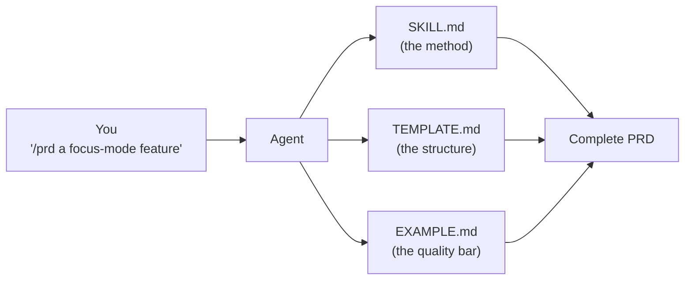

**Variant A - LR colored (recommended for README):**

Color semantics: dark = you, indigo = agent, purple = method, blue = structure, green = quality, dark green = output. Labeled edges make the relationships explicit.

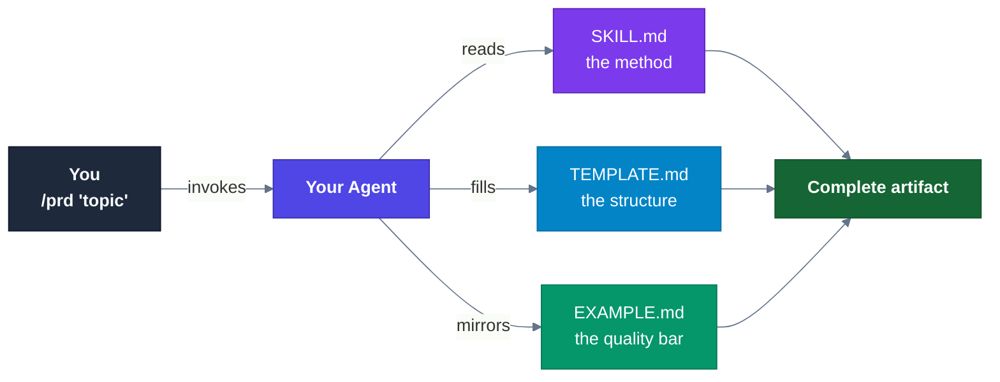

**Variant B - LR with subgraph grouping (3 columns instead of 5):**

Groups the three skill files into a subgraph. Reduces horizontal span significantly.
Trade-off: the reads/fills/mirrors relationships are consolidated into a single edge label.

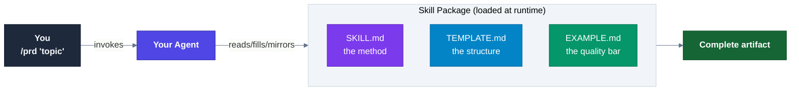

**Variant C - TD vertical (mobile / narrow sidebar):**

Flows top-to-bottom. Skill files rendered side-by-side in a subgraph row for compactness.

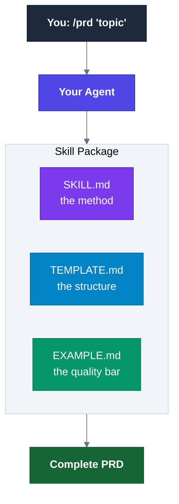

---

## Diagram 2: Triple Diamond at a Glance

**Original** (uncolored, TB with subgraphs):

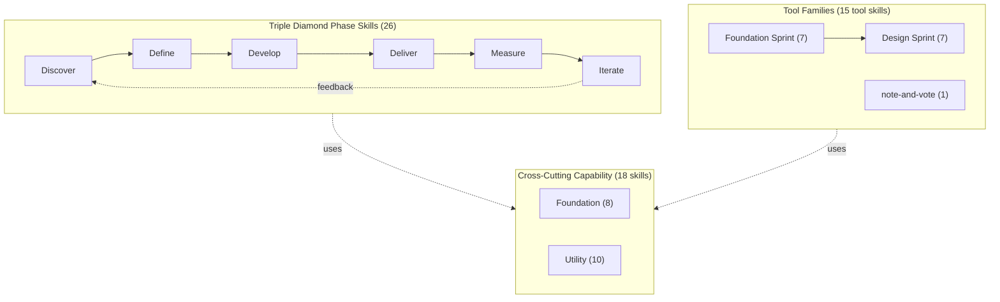

**Variant A - Styled TB with subgraphs (recommended for README):**

Full color coding per established palette. All three subgroups present with rich node labels.
Best when vertical space is available.

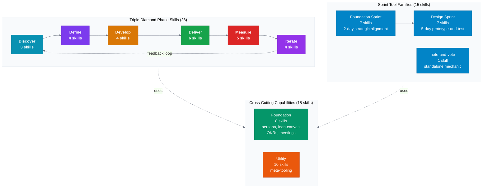

**Variant B - LR flattened, no subgraphs (color-implied grouping):**

Eliminates nested subgraph boxes. Groups are implied by color, not by boxes.
Better horizontal legibility at wide widths. Trade-off: subgroup labels are absent.

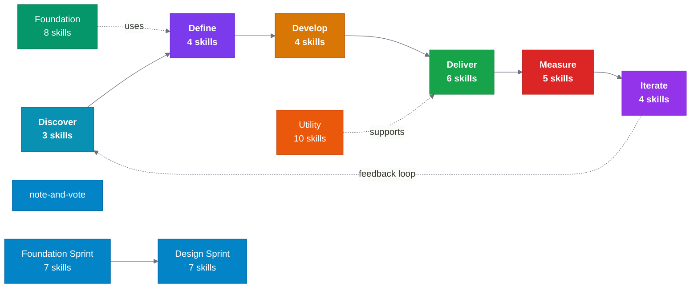

**Variant C - LR two-row swimlane (phase row above support layer row):**

Phase skills on top row. Sprint tools and foundation/utility grouped in a bottom support layer.
Horizontally efficient for medium widths.

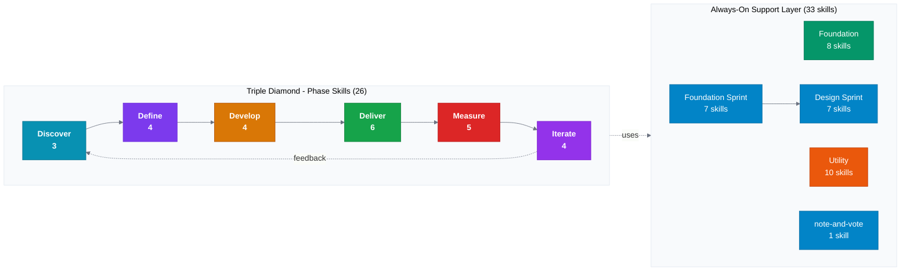

**Vertical A - TD outer, TD inner phases (narrowest - 2+1 column layout):**

Inner subgraph directions changed to TD. Phase chain flows top-to-bottom, Sprint sequence flows top-to-bottom. Mermaid places PHASE and SPRINT side-by-side above SUPPORT because both feed into it with `-.uses.->`. Best for portrait-oriented or very narrow embeds.

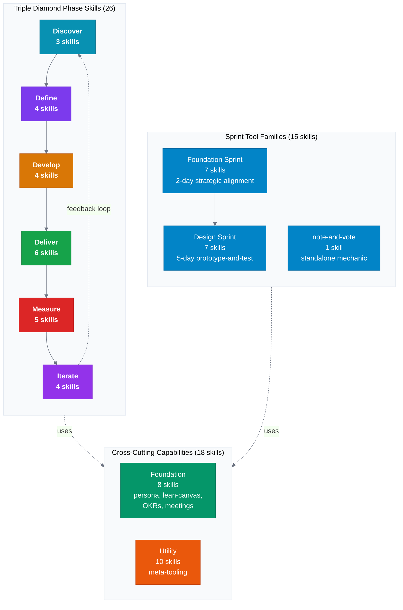

**Vertical B - TD single-column (Phase then Sprint then Support):**

Adds explicit `PHASE --> SPRINT` edge to force true single-column stacking. All three tiers render top-to-bottom in one column. Best for a linear narrative read where the hierarchy matters more than side-by-side comparison of PHASE and SPRINT.

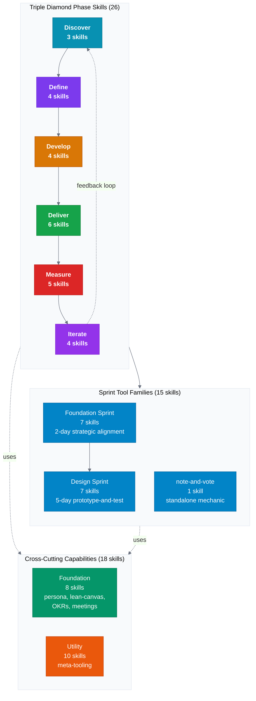

**Vertical C - TD outer, phase chain split 3+3 (shorter height, wider phase block):**

Keeps inner LR flow for phases but splits the 6-phase chain across two rows: Discover-Define-Develop on the first pass, then Deliver-Measure-Iterate. SPRINT and SUPPORT stay LR. Significantly less height than Vertical A. Best for medium-width embeds where Vertical A is too tall.


---

## Diagram 3: Foundation Sprint Sequence

**Original** (uncolored, LR):

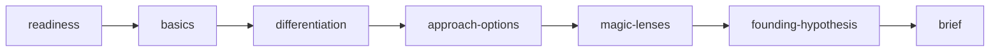

**Variant A - LR styled with descriptive labels (recommended):**

```mermaid
%%{init: {'theme': 'base', 'themeVariables': {'primaryColor': '#eff6ff', 'primaryBorderColor': '#bfdbfe', 'lineColor': '#3b82f6'}}}%%
flowchart LR
    classDef sprint fill:#0284c7,stroke:#0369a1,color:#fff,font-weight:bold
    classDef gate fill:#1d4ed8,stroke:#1e40af,color:#fff,font-weight:bold

    R["1. Readiness\nDo we need this sprint?"]:::gate
    B["2. Basics\nCustomer + Problem"]:::sprint
    Di["3. Differentiation\n2x2 advantages"]:::sprint
    A["4. Approach Options\n3-5 high-level paths"]:::sprint
    M["5. Magic Lenses\nScore approaches"]:::sprint
    H["6. Founding Hypothesis\nSynthesize direction"]:::sprint
    Br["7. Brief\nOne-page sprint output"]:::gate

    R --> B --> Di --> A --> M --> H --> Br
```

**Variant B - LR compact labels (shorter node text, better fit in constrained columns):**


**Variant C - LR two-row wrap (steps 1-4 top, steps 5-7 bottom):**

Wraps at step 4 so neither row exceeds 4 nodes. Significantly reduces total diagram width.

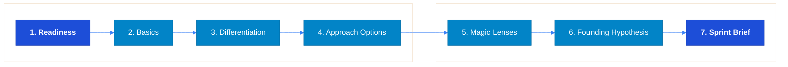

**Variant D - TD vertical (mobile, full descriptive labels):**

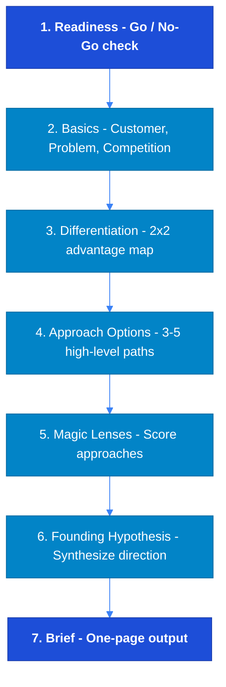

---

## Diagram 4: Design Sprint Sequence

**Original** (uncolored, LR):

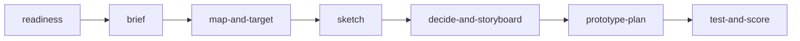

**Variant A - LR styled (recommended):**


**Variant B - LR compact labels (day numbers only):**

Shortest possible node labels. Maximizes available width for the chain.


**Variant C - LR two-row wrap (pre-sprint + days 1-2 top, days 3-5 bottom):**

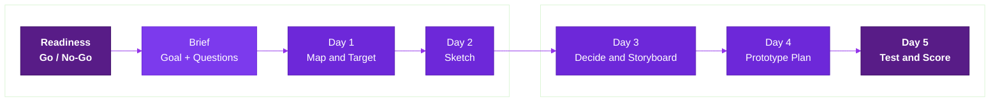

**Variant D - TD vertical (mobile, full descriptive labels):**

```mermaid
%%{init: {'theme': 'base', 'themeVariables': {'primaryColor': '#fdf4ff', 'primaryBorderColor': '#e9d5ff', 'lineColor': '#9333ea'}}}%%
flowchart TD
    classDef sprint fill:#7c3aed,stroke:#6d28d9,color:#fff
    classDef gate fill:#581c87,stroke:#3b0764,color:#fff,font-weight:bold
    classDef day fill:#6d28d9,stroke:#5b21b6,color:#fff

    R["Readiness - Go / No-Go check"]:::gate
    Br["Brief - Long-term goal and sprint questions"]:::sprint
    M["Day 1 - Map and Target"]:::day
    S["Day 2 - Sketch"]:::day
    D["Day 3 - Decide and Storyboard"]:::day
    P["Day 4 - Prototype Plan"]:::day
    T["Day 5 - Test and Score"]:::gate

    R --> Br --> M --> S --> D --> P --> T
```

---

## Diagram 5: Foundation-to-Design End-to-End Arc

Shows the full strategic arc from Foundation Sprint through Design Sprint. Not currently in the README draft; candidate for the Workflows section.

```mermaid
%%{init: {'theme': 'base', 'themeVariables': {'primaryColor': '#f0fdf4', 'lineColor': '#16a34a', 'clusterBkg': '#f8fafc', 'clusterBorder': '#e2e8f0'}}}%%
flowchart LR
    classDef fs fill:#0284c7,stroke:#0369a1,color:#fff
    classDef ds fill:#7c3aed,stroke:#6d28d9,color:#fff
    classDef handoff fill:#166534,stroke:#14532d,color:#fff,font-weight:bold

    subgraph FS["Foundation Sprint (Day 1-2)"]
        direction LR
        FS1["Basics"]:::fs --> FS2["Differentiation"]:::fs --> FS3["Approach Options"]:::fs
        FS3 --> FS4["Magic Lenses"]:::fs --> FS5["Founding Hypothesis"]:::fs --> FS6["Brief"]:::fs
    end

    subgraph DS["Design Sprint (Day 3-7)"]
        direction LR
        DS1["Map and Target"]:::ds --> DS2["Sketch"]:::ds --> DS3["Decide and Storyboard"]:::ds
        DS3 --> DS4["Prototype Plan"]:::ds --> DS5["Test and Score"]:::ds
    end

    Handoff["Foundation Brief\nbecomes DS input"]:::handoff

    FS --> Handoff --> DS
```

---

## Diagram 6: Skill Lifecycle

**Original** (uncolored):

```mermaid
flowchart LR
    Create["/pm-skill-builder\nCreate"] --> Validate["/pm-skill-validate\nValidate"]
    Validate --> Decision{Findings?}
    Decision -- "PASS" --> Ship["Ship"]
    Decision -- "WARN / FAIL" --> Iterate["/pm-skill-iterate\nIterate"]
    Iterate --> Validate
```

**Variant A - LR styled (recommended for README):**

```mermaid
%%{init: {'theme': 'base', 'themeVariables': {'primaryColor': '#fffbeb', 'primaryBorderColor': '#fde68a', 'lineColor': '#92400e'}}}%%
flowchart LR
    classDef create fill:#ea580c,stroke:#c2410c,color:#fff,font-weight:bold
    classDef validate fill:#0284c7,stroke:#0369a1,color:#fff,font-weight:bold
    classDef decision fill:#374151,stroke:#1f2937,color:#fff
    classDef ship fill:#166534,stroke:#14532d,color:#fff,font-weight:bold
    classDef iterate fill:#7c3aed,stroke:#6d28d9,color:#fff,font-weight:bold

    Create["/pm-skill-builder<br/>Create new skill<br/>from an idea"]:::create
    Validate["/pm-skill-validate<br/>Audit structure<br/>and quality"]:::validate
    Decision{"Findings?"}:::decision
    Ship["Ship<br/>to library"]:::ship
    Iterate["/pm-skill-iterate<br/>Apply targeted<br/>improvements"]:::iterate

    Create --> Validate
    Validate --> Decision
    Decision -- "PASS" --> Ship
    Decision -- "WARN / FAIL" --> Iterate
    Iterate --> Validate
```

**Variant B - LR narrow (command names only, minimal labels):**

Reduces width by stripping explanatory text from node labels. Good for tight column widths.

```mermaid
%%{init: {'theme': 'base', 'themeVariables': {'primaryColor': '#fffbeb', 'primaryBorderColor': '#fde68a', 'lineColor': '#92400e'}}}%%
flowchart LR
    classDef create fill:#ea580c,stroke:#c2410c,color:#fff,font-weight:bold
    classDef validate fill:#0284c7,stroke:#0369a1,color:#fff,font-weight:bold
    classDef decision fill:#374151,stroke:#1f2937,color:#fff
    classDef ship fill:#166534,stroke:#14532d,color:#fff,font-weight:bold
    classDef iterate fill:#7c3aed,stroke:#6d28d9,color:#fff,font-weight:bold

    Create["Build<br/>/pm-skill-builder"]:::create
    Validate["Audit<br/>/pm-skill-validate"]:::validate
    Decision{"Pass?"}:::decision
    Ship["Ship"]:::ship
    Iterate["Improve<br/>/pm-skill-iterate"]:::iterate

    Create --> Validate --> Decision
    Decision -- "Yes" --> Ship
    Decision -- "No" --> Iterate --> Validate
```

**Variant C - TD vertical (mobile, linear flow):**

Best for mobile viewports. The feedback loop reads naturally top-to-bottom then back up.

```mermaid
%%{init: {'theme': 'base', 'themeVariables': {'primaryColor': '#fffbeb', 'primaryBorderColor': '#fde68a', 'lineColor': '#92400e'}}}%%
flowchart TD
    classDef create fill:#ea580c,stroke:#c2410c,color:#fff,font-weight:bold
    classDef validate fill:#0284c7,stroke:#0369a1,color:#fff,font-weight:bold
    classDef decision fill:#374151,stroke:#1f2937,color:#fff
    classDef ship fill:#166534,stroke:#14532d,color:#fff,font-weight:bold
    classDef iterate fill:#7c3aed,stroke:#6d28d9,color:#fff,font-weight:bold

    Create["/pm-skill-builder - Create new skill"]:::create
    Validate["/pm-skill-validate - Audit structure and quality"]:::validate
    Decision{"Any findings?"}:::decision
    Ship["Ship to library"]:::ship
    Iterate["/pm-skill-iterate - Apply targeted improvements"]:::iterate

    Create --> Validate
    Validate --> Decision
    Decision -- "PASS" --> Ship
    Decision -- "WARN / FAIL" --> Iterate
    Iterate --> Validate
```

---

## Diagram 7: Note-and-Vote Mechanic

Visual explanation of the standalone note-and-vote skill used within both sprint families.

```mermaid
%%{init: {'theme': 'base', 'themeVariables': {'lineColor': '#6b7280', 'primaryColor': '#f8fafc'}}}%%
flowchart TD
    classDef step fill:#374151,stroke:#1f2937,color:#fff
    classDef vote fill:#dc2626,stroke:#b91c1c,color:#fff,font-weight:bold
    classDef output fill:#166534,stroke:#14532d,color:#fff

    Capture["1. Capture\nSilent note-taking\n(timed)"]:::step
    Share["2. Share\nRead all notes aloud\nno discussion yet"]:::step
    Dot["3. Dot Vote\nEach person votes\nwith limited dots"]:::vote
    Discuss["4. Discuss\nTop-voted items only"]:::step
    Decide["5. Decide\nDecider makes final call"]:::output

    Capture --> Share --> Dot --> Discuss --> Decide
```

---

## Diagram Usage Guide

**Which variant to use where:**

| Location | Recommended variant |
|---|---|
| README hero / first diagram | Variant A (LR) - most visual impact at full width |
| README section headers | Variant A or B depending on node count |
| Mobile-heavy audiences | TD vertical variants |
| Documentation site (`docs/`) | Variant A - Astro renders at full container width |
| Skill EXAMPLE.md files | Uncolored original (keeps files readable as plain text) |
| Narrow sidebar or column embed | Variant B (compact) or Variant C (two-row wrap) |

**Diagram-to-README section mapping:**

| Diagram | README section | Recommended variant |
|---|---|---|
| 1 - How Agent Skills Work | "How Agent Skills Work" | Variant A (LR labeled edges) |
| 2 - Triple Diamond at a Glance | "At a Glance" | Variant A (TB styled with subgraphs) |
| 3 - Foundation Sprint Sequence | Foundation Sprint section | Variant A (LR with descriptive labels) |
| 4 - Design Sprint Sequence | Design Sprint section | Variant A (LR styled) |
| 5 - Foundation-to-Design Arc | Workflows section | Single version (not in README yet) |
| 6 - Skill Lifecycle | Skill Lifecycle Tools section | Variant A (LR styled) |
| 7 - Note-and-Vote | Sprint Tool Families section | Single version (TD) |
