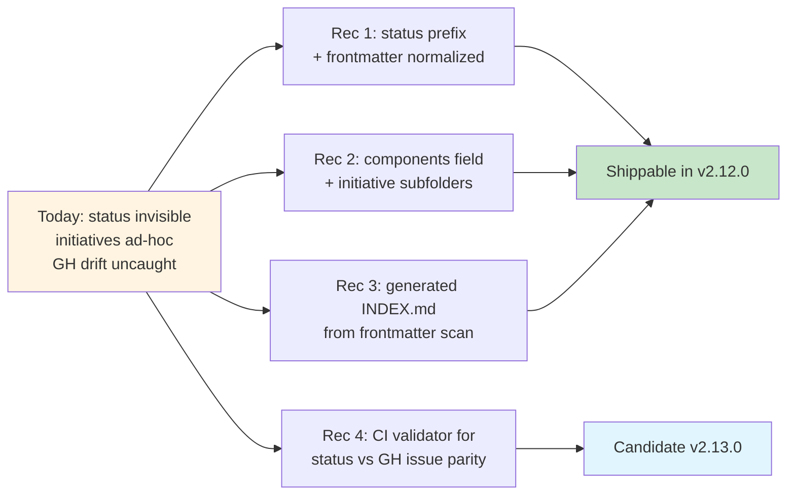

# Efforts Folder Organization. Status, Components, and GitHub-Issue Integration

**Date**: 2026-04-18
**Author**: Claude Opus 4.7 (design analysis, multi-option exploration)
**Status**: Draft for discussion
**Companion reference**: [`tracking-patterns-reference_2026-04-18.md`](tracking-patterns-reference_2026-04-18.md). industry best-practice synthesis (PEP, KEP, RFC, ADR, Linear/Jira) that validates the recommendation in §7.

## Table of Contents

1. [Executive summary](#executive-summary)
2. [Problem statement](#1-problem-statement)
   - 1.1 [What is hard to see today](#11-what-is-hard-to-see-today)
   - 1.2 [Jira-style "components" concept](#12-jira-style-components-concept)
   - 1.3 [GitHub issue integration gaps](#13-github-issue-integration-gaps)
3. [Option family A. Status visibility](#2-option-family-a-status-visibility)
   - A1. Status prefix in filename
   - A2. Emoji/marker prefix
   - A3. Status subdirectory (move on transition)
   - A4. Status frontmatter normalization
   - A5. Combine A1 + A4
4. [Option family B. Component grouping (Jira-style)](#3-option-family-b-component-grouping-jira-style)
   - B1. Components frontmatter field
   - B2. Initiative subfolder per component
   - B3. Initiative folder only for multi-effort initiatives
   - B4. Components registry + subfolder hybrid
5. [Option family C. Cross-folder tracking](#4-option-family-c-cross-folder-tracking)
   - C1. Generated INDEX.md from frontmatter scan
   - C2. Enhanced backlog-canonical.md
   - C3. GitHub Issues as source of truth
   - C4. C1 + C3 hybrid
6. [Option family D. GitHub issue integration](#5-option-family-d-github-issue-integration)
   - D1. gh-issue-create hook on new brief
   - D2. Validator that mirrors status
   - D3. Brief-to-issue one-way via template
   - D4. GH issue template that creates a brief stub
7. [Interaction effects and option bundles](#6-interaction-effects-and-option-bundles)
8. [Recommendation](#7-recommendation)
9. [Migration path](#8-migration-path)
10. [Open questions](#9-open-questions)
11. [Appendix](#10-appendix)
    - 10.1 Status enum proposal
    - 10.2 Initial components proposal
    - 10.3 Frontmatter schema proposal
    - 10.4 Generated INDEX.md structure proposal
    - 10.5 Questions this design does NOT address
12. [Related documents](#11-related-documents)
13. [Decision log](#12-decision-log-to-be-filled)

---

## Executive summary

The efforts folder has grown to 50+ briefs across three years of shipping. Status currently lives only in the brief's frontmatter, initiative grouping is ad-hoc (only `meeting-skills-family/` uses a subfolder), and the canonical backlog maintains a parallel "Shipped" table that requires manual sync. Result: **completion state is invisible in the folder listing**, cross-cutting initiatives have no first-class grouping, and GitHub-issue state drifts from brief state with nothing enforcing parity.

This doc presents **4 option families** (status visibility, component grouping, cross-folder tracking, GitHub integration), **17 discrete options** across them, and a **recommended bundle** that combines low-effort organizational changes with two lightweight CI validators. The recommendation preserves the existing brief-as-durable-narrative model and adds three surfaces that make state visible: a status-indicator filename convention, a `components:` frontmatter field, and a generated index.



---

## 1. Problem statement

### 1.1. What is hard to see today

**Status invisibility at folder level**. Running `ls docs/internal/efforts/` produces a flat list where shipped efforts (F-02, F-05, F-06, F-10, F-11, F-13, F-16, F-19, F-24, F-26, F-17, F-18, F-25, F-27, F-28, M-12, M-16, M-18, M-19, M-20) look identical to backlog efforts (F-07, F-08, F-09, F-12, F-14, F-15, F-20, F-21, F-22, F-23, F-29, F-30, F-31, F-32, F-33, F-34, F-35, F-36). You must open each file to see `Status:` in the frontmatter. For a maintainer returning to the repo after weeks, this is high-friction.

**Status-value inconsistency**. Observed values across the folder include: `Draft`, `Planned`, `Backlog`, `In Progress`, `Active`, `Shipped`, `Cancelled`, `Complete`. Some briefs stuck at `In Progress` after shipping because update was skipped. No validator checks that status values come from a closed enum or that `Shipped` implies a matching `Milestone:` that actually shipped.

**Initiative grouping is ad-hoc**. Only `meeting-skills-family/` uses a subfolder pattern for cross-effort coordination. F-29 (workflow for meeting-skills family), F-30 (adoption guide for meeting-skills family), F-33 (sample-standards CI tied to meeting-skills samples), F-34 (thread profiles used by meeting-skills sample generation) are all conceptually part of or downstream of the meeting-skills initiative but live alphabetically alongside unrelated work. Similarly, F-31/F-32/F-33/F-34/F-35 form a "sample-automation" initiative that has no folder-level identity.

**Parallel tracking systems drift**. `docs/internal/backlog-canonical.md` has a "Shipped" table. Each brief has a `Status:` field. GitHub issues have open/closed state. Three places, no enforced consistency. When v2.11.0 shipped, the backlog-canonical table was updated manually and no check verified the brief statuses matched.

**Legacy filename drift**. `F-17-meeting-synthesis.md` archived, `F-17-meeting-synthesize.md` current. `F-18-meeting-prep/` folder present, `F-18-meeting-agenda.md` current. The rename history lives in archived-efforts notes but is not surfaced in the folder itself. A new reader sees two folders/files with the same ID and has to hunt for which is authoritative.

### 1.2. Jira-style "components" concept

Jira's component model lets an issue belong to one or more components (e.g. "auth", "billing", "admin UI"). Components are project-scoped cross-cuts orthogonal to milestones/versions. They enable queries like "all open issues in the auth component" and "all shipped work on billing in the last quarter". For pm-skills, analogous components would be:

- **meeting-skills** (F-17, F-18, F-25, F-27, F-28, F-29, F-30 would all tag this)
- **sample-automation** (F-31, F-32, F-33, F-34, F-35, F-36)
- **runtime-leverage** (future work from agent-component-usage design doc)
- **mcp** (M-22 decoupling, future MCP unfreeze work)
- **ci-validation** (M-12, M-18, M-20, F-33, F-36)
- **governance** (skill-versioning, planning-persistence-policy, etc.)
- **lifecycle-tools** (F-05, F-10, F-11, F-32, F-35)

Today, none of these are tracked. They live in session-log narratives and the author's head.

### 1.3. GitHub issue integration gaps

The brief template has an `Issue: #{number}` field but:

- Many briefs show `Issue: TBD` or leave it blank (F-17 through F-36 recent additions).
- No validator checks that a brief with `Status: Shipped` has a closed issue.
- No validator checks that an open issue with an effort ID in title has a matching brief.
- Backlog-canonical lists shipped status manually. issue closure is not mirrored.
- PR references are manual fill-in (`PRs: TBD`), rarely updated after ship.

The brief-to-issue link is **one-way and lossy**. Fix candidates range from zero-tooling (discipline) to full CI parity checks.

---

## 2. Option family A. Status visibility

Goal: make completion state visible in the folder listing itself, not buried in frontmatter.

### Option A1. Status prefix in filename

Pattern: `{STATUS}_{ID}-{slug}.md` where `{STATUS}` is one of `backlog`, `active`, `shipped`, `cancelled`.

Examples:
- `backlog_F-07-discover-market-sizing.md`
- `shipped_F-26-lean-canvas.md`
- `active_F-29-workflow-meeting-lifecycle.md`

**Pros**: folder listing immediately shows state; grep-friendly (`ls shipped_*`); existing ID ordering preserved within each status; no file moves on creation.

**Cons**: filename changes on status transitions (rename + git history); breaks URL stability if the brief is ever linked externally; status change requires `git mv`; emoji-free but not as visually striking as icons.

**Effort**: medium. one-time sweep to rename existing files; update backlog-canonical references; shell alias or git hook for status transitions.

### Option A2. Emoji/marker prefix

Pattern: `{EMOJI}-{ID}-{slug}.md` where `{EMOJI}` is chosen per-status.

Examples:
- `📋-F-07-discover-market-sizing.md` (backlog)
- `✅-F-26-lean-canvas.md` (shipped)
- `🔨-F-29-workflow-meeting-lifecycle.md` (active)

**Pros**: immediately visible; scan-by-eye fast.

**Cons**: emoji in filenames cause tooling headaches (Windows rendering, URL-encoding, ripgrep glob patterns, pre-commit hook issues); inconsistent with repo's "no emojis unless requested" convention; URL-breakage if linked externally.

**Effort**: medium, same as A1. **Recommend against** due to tooling friction and convention mismatch.

### Option A3. Status subdirectory (move on transition)

Pattern: briefs live in `backlog/`, `active/`, or `shipped/vX.Y.Z/` subdirectories. Move on transition.

Examples:
- `docs/internal/efforts/backlog/F-07-discover-market-sizing.md`
- `docs/internal/efforts/active/F-29-workflow-meeting-lifecycle.md`
- `docs/internal/efforts/shipped/v2.11.0/F-26-lean-canvas.md`

**Pros**: folder listing is state; release-scoped shipped folder groups by release; `ls shipped/v2.11.0/` is a self-describing list of what shipped in that release.

**Cons**: file moves break URLs and cross-references (every link in release plans, session logs, backlog-canonical, CHANGELOG would need rewrite on status change); git-log traceability is preserved but harder to scan; multi-effort briefs for same ID can't coexist cleanly during rename/rescope transitions.

**Effort**: high. bulk move + link rewriting + CI validator that enforces link paths stay valid post-move. Recommend only if committing to this as the long-term model.

### Option A4. Status frontmatter normalization (no structural change)

Keep flat structure. Introduce closed-enum `Status:` values with a CI validator that fails on drift.

Enum: `draft | backlog | planned | active | blocked | shipped | cancelled | superseded`.

**Pros**: zero file moves; URLs stable; existing references all still work; CI catches typos and missed transitions.

**Cons**: folder listing still flat; maintainer still has to open files to see status.

**Effort**: low. write a shell script that scans frontmatter, 10-20 lines. Add to existing `.github/workflows/validation.yml`.

### Option A5. Combine A1 + A4 (prefix + validator)

Status prefix in filename **and** closed-enum status field in frontmatter, with CI that verifies both agree.

**Pros**: best of both worlds. visible in folder, validated in CI, single-file-rename on transition with a validator catching divergence.

**Cons**: two sources of truth for status that must stay in sync (validator prevents drift).

**Effort**: medium. A1 sweep + A4 validator.

---

## 3. Option family B. Component grouping (Jira-style)

Goal: express cross-cutting initiatives that span multiple efforts, making it easy to answer "what is the state of meeting-skills work?" or "what is scheduled for sample-automation?"

### Option B1. Components frontmatter field

Add `components:` to brief frontmatter as a list of component slugs.

```yaml
---
id: F-29
status: backlog
milestone: v2.12.0
issue: TBD
agent: Claude Opus 4.7
components: [meeting-skills, workflows]
---
```

Maintain a canonical component registry at `docs/internal/efforts/COMPONENTS.md` (similar to how Jira admins manage components). Registry entries name the component, describe the initiative, point at the anchor effort or initiative-folder.

**Pros**: zero structural change; grep-able (`grep -l "components:.*meeting-skills"`); one effort can belong to multiple components; generated indexes can group by component without moving files; survives rename and reclassification gracefully.

**Cons**: not visible in folder listing (component membership lives in file content); requires tooling to query ("what's in meeting-skills?" is a grep, not a `ls`).

**Effort**: low. one-line frontmatter addition + COMPONENTS.md registry + optional generated index.

### Option B2. Initiative subfolder per component

Extend the `meeting-skills-family/` pattern. Each initiative gets a subfolder with its briefs, plans, and master-plan doc.

```
docs/internal/efforts/
  meeting-skills/         (renamed from meeting-skills-family/)
    F-17-meeting-synthesize.md
    F-18-meeting-agenda.md
    F-25-meeting-brief.md
    F-27-meeting-recap.md
    F-28-stakeholder-update.md
    F-29-workflow-meeting-lifecycle.md
    F-30-adoption-guide.md
    plan_component.md
  sample-automation/
    F-31-validate-family-sample-awareness.md
    F-32-builder-sample-generation.md
    F-33-check-sample-standards-ci.md
    F-34-thread-profiles-reference.md
    F-35-iterate-sample-regeneration.md
    F-36-generic-family-registration-validator.md
    plan_component.md
```

**Pros**: initiative-as-folder is visible immediately; new-reader can navigate by clicking into the folder; master plan (`plan_component.md`) lives with its component.

**Cons**: one brief belongs to exactly one component (multi-component membership awkward); folder moves break existing links; cross-component efforts (e.g., F-33 touches both sample-automation and ci-validation) need a tiebreaker rule.

**Effort**: high. bulk reorganization of 50+ briefs into 6-10 components + link-rewrite sweep + canonical backlog update.

### Option B3. Initiative folder only for multi-effort initiatives

Keep single-effort briefs flat. Create subfolders only when 3+ related efforts form a coherent initiative.

**Pros**: low churn; matches how `meeting-skills-family/` emerged organically; preserves URLs for the majority of briefs; single-effort briefs stay simple.

**Cons**: threshold for creating a subfolder is judgment-based; does not help with Jira-style component queries (can't ask "all efforts touching CI").

**Effort**: low. opportunistic, done when an initiative grows.

### Option B4. Components registry + subfolder for multi-effort initiatives (B1 + B3)

Components are the primary cross-cut (frontmatter field + registry). Subfolders used only when an initiative has enough mass to warrant its own master plan and shared artifacts.

**Pros**: one brief belongs to many components via frontmatter; subfolder captures initiative-level coordination docs; low churn for existing briefs.

**Cons**: reader must know two patterns (grep components, browse subfolders); slight duplication if a subfolder's master plan lists briefs that also carry the component tag.

**Effort**: low-medium. One-line frontmatter addition to all briefs + registry doc + opportunistic subfolders.

---

## 4. Option family C. Cross-folder tracking

Goal: a dependable, dependable-across-folders view of all efforts' state.

### Option C1. Generated INDEX.md from frontmatter scan

A script scans all `docs/internal/efforts/**/*.md`, parses frontmatter, renders a Markdown table grouped by status (or by component, by milestone). INDEX.md regenerated on every change via pre-commit hook or CI.

Example output structure:

```markdown
# Efforts Index

Generated: 2026-04-18 by scripts/generate-efforts-index.sh

## By Status

### Active (3)
| ID | Name | Milestone | Components | Issue |
| F-34 | Thread Profiles Reference | v2.12.0 | sample-automation | #TBD |
...

### Shipped (20)
| ID | Name | Milestone | Components | Issue |
| F-26 | Lean Canvas Foundation Skill | v2.11.0 | foundation-skills | #TBD |
...

## By Component

### meeting-skills (7 efforts)
...

## By Milestone

### v2.12.0 (8 efforts)
...
```

**Pros**: single source-of-truth view; multiple pivots (status, component, milestone) from one scan; no manual sync; regenerable from source.

**Cons**: another file to maintain (generator script); regeneration cadence matters (stale if not run); adds tooling dependency (Python, jq, or shell).

**Effort**: medium. ~100 lines of shell or Python to parse YAML frontmatter and render.

### Option C2. Enhanced backlog-canonical.md (manual or semi-automated)

Keep the existing backlog-canonical.md. Enhance with a shipped-by-release structure and require brief-status changes to update it. Optional: generate sections from frontmatter but keep manually-curated priority order.

**Pros**: minimal change; one document for all of backlog.

**Cons**: still manual; still drift-prone; no enforcement.

**Effort**: low.

### Option C3. GitHub Issues as source of truth, briefs as durable narrative

Make GitHub issues the canonical state-of-lifecycle (open, closed, milestone). Briefs are durable design artifacts that must link to an issue but do not mirror its lifecycle state. Status drift is "by design". the brief's `Status:` field is advisory and reflects author intent at time of writing; the issue tells you whether it's actually shipped.

**Pros**: single authoritative lifecycle source (GH); removes parallel-tracking drift; aligns with how the team already thinks about closure.

**Cons**: requires GH account to check state; offline/local workflow loses state visibility; docs-only release plans have no GH-issue equivalent for several past releases (many v2.11.0 briefs have `Issue: TBD`).

**Effort**: low (policy change + documentation); medium (if adding `gh api` script that fetches current state into a local cache).

### Option C4. C1 + C3 (generated index sourced from GH + frontmatter)

Index generator queries GH issues by label and merges with frontmatter status. Surfaces drift explicitly: "brief says Shipped, issue is still open" becomes a visible flag in the generated index.

**Pros**: shows both sources; drift is actionable (CI could fail on drift); best visibility.

**Cons**: highest complexity; requires GH auth in CI; some effort-to-issue mapping is missing (legacy briefs with no issue).

**Effort**: medium-high.

---

## 5. Option family D. GitHub issue integration

Goal: make the brief-to-issue relationship dependable and bidirectional.

### Option D1. gh-issue-create hook on new brief

New brief added → Git pre-commit or CI hook runs `gh issue create` with title, body (from brief), labels (from frontmatter components + agent), milestone (from frontmatter). Writes the issue number back into the brief's `Issue:` field and amends the commit.

**Pros**: every brief gets an issue automatically; `Issue: TBD` disappears; issue title and body stay in sync with brief scope at creation time.

**Cons**: fails offline; requires GH auth in pre-commit; occasionally you want to draft a brief without creating an issue yet; reverting a brief means orphaning an issue.

**Effort**: medium. script + hook integration.

### Option D2. Validator that mirrors status

CI script checks:
- Every brief's `Issue:` links to an existing GH issue (or `Issue: N/A` explicitly marks legacy).
- Brief `Status: Shipped` implies GH issue state `closed`.
- Brief `Status: Backlog | Planned | Active` implies GH issue state `open`.
- Closed GH issue with an effort ID in title implies a brief with matching ID exists.

Fails CI on drift.

**Pros**: enforces parity without removing either source; catches drift at PR time.

**Cons**: requires GH API access in CI; noise from legacy drift until backfilled.

**Effort**: medium. ~150 lines of shell with `gh api` + frontmatter parse + comparison.

### Option D3. Brief-to-issue one-way via template (zero tooling)

Strengthen the brief template to require `Issue:` and document the manual workflow: "create brief, open issue referencing brief, paste issue URL back into brief". No enforcement beyond code review.

**Pros**: zero tooling; works offline; simple.

**Cons**: drifts in practice (we already see this with recent `Issue: TBD` briefs); relies on discipline.

**Effort**: trivial. documentation change only.

### Option D4. GH issue template that creates a brief stub

Inverse pattern: opening a GH issue with label `effort` triggers a GitHub Action that creates a brief stub file in a PR. Author writes the brief body, PR merges. Issue and brief are born linked.

**Pros**: flows that originate on GH (user report, customer ask) don't lose the brief step; workflow starts from GH which is where many users live.

**Cons**: more moving parts; requires GitHub Actions with write access; merge workflow complicates quick drafts.

**Effort**: medium-high. action + PR template + reconciliation rules.

---

## 6. Interaction effects and option bundles

The four families are not independent. Certain combinations reinforce each other; others conflict. Key bundles:

### Bundle 1. Low-friction visibility (recommended)

**A4** (normalized status enum + validator) **+ B4** (components frontmatter + opportunistic subfolders) **+ C1** (generated INDEX.md) **+ D3** (strengthened template).

Outcome: validated status enum, component grouping for queries, one-command index regeneration, lightweight tooling, stable URLs.

Cost: ~200 lines of script total, one frontmatter sweep, 1-line template strengthening.

### Bundle 2. High-visibility, high-churn

**A3** (status subdirectory move) **+ B2** (initiative subfolder per component) **+ C1** (generated INDEX) **+ D2** (validator mirrors status).

Outcome: folder listing is fully self-describing, strong coupling between briefs and issues.

Cost: bulk file moves (links break), link-rewrite sweep, multi-component efforts awkward, heavy CI.

### Bundle 3. GH-primary minimalism

**C3** (GH as source of truth, brief as advisory) **+ D1** (auto-issue-create hook) **+ minimal A4** (status values documented but not enforced).

Outcome: GH issues are authoritative; briefs are design narratives; drift is by design.

Cost: offline workflow suffers; legacy briefs without issues need backfill or explicit `Issue: N/A`.

### Bundle 4. Status quo with discipline

**A4** (validator only) **+ D3** (strengthened template).

Outcome: catches typos and missed transitions; no structural change.

Cost: minimal; visibility in folder listing remains unchanged.

---

## 7. Recommendation

### Recommended bundle: **Bundle 1 (low-friction visibility)** with incremental adoption

**v2.12.0 scope (low-risk, high-leverage)**:

1. **Normalize the status enum (A4)**. Define closed set: `draft | backlog | planned | active | blocked | shipped | cancelled | superseded`. Write `scripts/validate-efforts-status.sh` that scans all briefs for frontmatter compliance. Add advisory CI step.

2. **Add `components:` frontmatter field (B1)**. Define initial registry (`COMPONENTS.md`) with 6-8 components covering today's active work:
   - `meeting-skills`
   - `sample-automation`
   - `foundation-skills`
   - `lifecycle-tools`
   - `runtime-leverage`
   - `ci-validation`
   - `mcp`
   - `governance`
   One-time sweep: add `components:` to all existing briefs.

3. **Generate INDEX.md (C1)**. Script that reads all briefs' frontmatter, outputs grouped tables by status, component, and milestone. Runs via `pre-commit` hook (local) or `scripts/generate-efforts-index.sh` (manual). No CI requirement initially; add as advisory CI step once output format stabilizes.

4. **Strengthen brief template (D3)**. Require `Issue:` explicitly (N/A allowed). Add `components:`. Document the workflow in `README.md` at the top.

**v2.13.0 scope (if adoption holds)**:

5. **Introduce opportunistic initiative subfolders (B3)**. When an initiative accumulates 3+ briefs with shared master plan (like meeting-skills-family did), create a subfolder. Keep single-effort briefs flat.

6. **Status-to-issue validator (D2)**. Once every brief has a real GH issue number (not `TBD`), add CI that verifies status and issue state agree.

**Deferred (evaluate after v2.13.0)**:

7. **Status prefix in filename (A1)** or **status subdirectory (A3)**. Only if INDEX.md and components field prove insufficient for folder-level visibility in practice. Not worth the URL-churn cost up front.

8. **Auto-issue-create on brief (D1)**. High churn; revisit if `Issue: TBD` remains a persistent issue despite template strengthening.

### Why this bundle

- **Preserves URL stability**. No file moves in the recommended scope; all existing links, release plans, session logs, and CHANGELOG references keep working.
- **Additive, not disruptive**. Each step adds structure without removing anything. Failure to adopt any one step does not break the others.
- **Machine-verifiable**. Status enum and component registry are both closed sets that CI can validate.
- **Reader-friendly**. INDEX.md gives a single-page answer to "what's the state of everything?" without requiring GH access.
- **Matches existing organic pattern**. meeting-skills-family/ subfolder emerged naturally; components as frontmatter formalizes what is already happening in people's heads.
- **Aligns with industry best practice**. Bundle 1 maps to the convergent PEP/ADR hybrid with Jira-style component tags and KEP-style opportunistic subfolders. See `tracking-patterns-reference_2026-04-18.md` §6 (synthesis) and §8 (design-doc alignment check) for the cross-pattern validation.

### Why not the other bundles

- **Bundle 2** moves too many files. URL churn across ~60+ references hurts more than the visibility gain.
- **Bundle 3** removes state visibility locally and assumes GH availability. Conflicts with offline/air-gapped workflows.
- **Bundle 4** does not address the components question.

---

## 8. Migration path

### Phase 1. v2.12.0 (2-3 hour effort)

Prerequisite: agreement on component list and status enum.

1. Write `COMPONENTS.md` with initial 6-8 components.
2. Sweep all existing briefs. for each:
   - Normalize `Status:` to the new enum.
   - Add `components:` frontmatter field.
3. Write `scripts/validate-efforts-status.sh`. verifies status enum, components registry membership, and basic frontmatter schema.
4. Write `scripts/generate-efforts-index.sh`. produces `INDEX.md`.
5. Update `README.md` with the new conventions.
6. Add CI step (advisory at first) for the validator.

Commits: 2-3 (components + sweep, validator + CI, generator + README).

### Phase 2. v2.13.0 (if Phase 1 adoption holds)

1. Promote validator from advisory to enforcing.
2. Backfill GH issues for legacy briefs that have `Issue: TBD` (or mark `Issue: N/A` with explicit rationale).
3. Add status-to-issue CI validator (D2).
4. Consider opportunistic initiative subfolders for any v2.13.0 initiative that ships with 3+ briefs.

### Phase 3. Long-term (evaluate quarterly)

1. If folder-level visibility still feels thin, reconsider status prefix (A1) with a careful URL-rewrite tool.
2. If `Issue: TBD` remains chronic, adopt auto-issue-create hook (D1).
3. If session-log-driven narrative duplicates INDEX.md content, promote INDEX.md into a user-facing context surface (e.g., generated nav section in MkDocs).

---

## 9. Open questions

1. **Component cardinality limit**. Should a brief belong to at most N components (e.g., 2)? Or unlimited? Jira allows unlimited; recommend 1-3 for pm-skills to keep registry meaningful.

2. **Superseded briefs**. When F-17-meeting-synthesis was archived and F-17-meeting-synthesize replaced it, the archive note lives in `_NOTES/`. Should superseded briefs also appear in the index with a `superseded_by:` pointer? Recommend yes. visible history matters.

3. **Backlog-canonical redundancy**. If INDEX.md provides the same cuts (status, milestone), does `backlog-canonical.md` continue to exist? Recommend yes, as the priority-ordered backlog is distinct from the state-grouped index. backlog-canonical is "what's next"; INDEX is "what exists".

4. **Component registry governance**. Who approves new components? Recommend: any brief author can propose in a PR. merge requires maintainer review to prevent proliferation.

5. **Release-plan linkage**. Should the generated INDEX.md include a "By release" section that mirrors release-plans folder content? Recommend yes. it is the closest analog to Jira's version-based cuts.

6. **Format of INDEX.md**. Markdown table, collapsible `<details>` blocks, or both? Recommend collapsible-per-status groups to keep the top-of-file skimmable while preserving full detail.

7. **Cross-repo component membership**. pm-skills-mcp lives in a separate repo. Should components span repos? Not in v1; revisit if MCP unfreezes and tighter coupling emerges.

---

## 10. Appendix

### 10.1. Status enum proposal

| Value | Meaning | Implies |
|-------|---------|---------|
| `draft` | Brief exists, design not yet settled | No GH issue required yet |
| `backlog` | Scoped, not yet scheduled | GH issue open (optional) |
| `planned` | Scheduled to a specific milestone | GH issue open with milestone |
| `active` | Work in progress | GH issue open |
| `blocked` | Work started but halted | GH issue open with `blocked` label |
| `shipped` | Merged, released, tagged | GH issue closed |
| `cancelled` | Will not ship | GH issue closed with `wontfix` |
| `superseded` | Replaced by another effort | Link to successor brief |

### 10.2. Initial components proposal

| Component | Scope | Current anchor |
|-----------|-------|----------------|
| `meeting-skills` | Meeting-lifecycle family + workflows + adoption | `meeting-skills-family/plan_family-contract.md` |
| `sample-automation` | Sample creation, standards, validation, regeneration | Proposed master doc in v2.12.0 |
| `foundation-skills` | Cross-cutting foundation tooling (persona, lean-canvas, meeting family) | `docs/reference/skill-families/` |
| `lifecycle-tools` | Create, validate, iterate utilities | `docs/pm-skill-lifecycle.md` |
| `runtime-leverage` | Plugin runtime exploitation (hooks, sub-agents, dynamic MCP) | `agent-component-usage_2026-04-18.md` |
| `ci-validation` | CI scripts, validators, enforcement tooling | `scripts/` + audit-ci |
| `mcp` | pm-skills-mcp alignment, unfreeze work | `M-22-mcp-decoupling.md` |
| `governance` | Versioning, planning-policy, release runbook | `docs/internal/skill-versioning.md` |

### 10.3. Frontmatter schema proposal (v2 of brief template)

```yaml
---
id: F-XX
name: Human-readable name
status: draft | backlog | planned | active | blocked | shipped | cancelled | superseded
milestone: vX.Y.Z | TBD | N/A
issue: "#NNN" | TBD | N/A
agent: Claude | Codex | Human | <model identifier>
components: [component-slug-1, component-slug-2]
superseded_by: effort-id  # only if status = superseded
supersedes: effort-id  # only if this effort replaces another
created: YYYY-MM-DD
updated: YYYY-MM-DD
---
```

### 10.4. Generated INDEX.md structure proposal

```markdown
# Efforts Index

Generated: YYYY-MM-DD HH:MM by scripts/generate-efforts-index.sh
Total efforts: N (X active, Y shipped, Z backlog)

<details><summary><b>By status</b></summary>

### Active (N)
| ID | Name | Milestone | Components | Issue |
|----|------|-----------|-----------|-------|
...

### Shipped (N)
...
</details>

<details><summary><b>By component</b></summary>

### meeting-skills (N efforts)
...
</details>

<details><summary><b>By milestone</b></summary>

### v2.12.0 (N efforts)
...
</details>

<details><summary><b>Superseded / archived</b></summary>

| ID | Name | Superseded by | Date |
|----|------|---------------|------|
| F-17-meeting-synthesis | Meeting Synthesis (original) | F-17-meeting-synthesize | 2026-04-17 |
</details>
```

### 10.5. Questions this design does NOT address

- **Effort sizing/estimation**. No t-shirt size or effort field proposed. Add later if needed.
- **Dependencies between efforts**. `depends_on:` frontmatter could be added in a future iteration. Today captured in prose in briefs (e.g., F-32 depends on F-34).
- **Ownership**. `Agent:` covers execution; an `Owner:` or `DRI:` field for strategic ownership is not proposed here.
- **Effort-to-PR mapping**. PR linkage is currently prose; a `prs:` frontmatter list is an option but deferred.
- **Cross-repo tracking**. pm-skills-mcp has no efforts folder; if MCP work grows, consider mirroring the pattern there.

---

## 11. Related documents

- `docs/internal/efforts/tracking-patterns-reference_2026-04-18.md`. **companion reference**. industry best-practice synthesis (PEP, KEP, RFC, ADR, Linear/Jira) that validates this recommendation
- `docs/internal/efforts/README.md`. current canonical effort-brief model and operating rules
- `docs/internal/backlog-canonical.md`. priority-ordered backlog with parallel shipped table
- `docs/internal/release-plans/README.md`. release-governance structure, links from release to effort
- `docs/internal/planning-persistence-policy.md`. what belongs in efforts vs. release-plans vs. \_NOTES
- `docs/internal/agent-component-usage_2026-04-18.md`. sibling design doc for v2.12.0+ runtime leverage
- `docs/internal/efforts/meeting-skills-family/plan_family-contract.md`. worked example of an initiative-subfolder pattern

---

## 12. Decision log (to be filled)

| Date | Decision | Rationale |
|------|----------|-----------|
| 2026-04-18 | Draft authored | Surface options for v2.12.0+ planning |
| TBD | Component list locked | Requires maintainer review |
| TBD | Status enum locked | Requires maintainer review |
| TBD | INDEX.md generator adopted | After component list locked |
| TBD | Validator CI added | After generator stable |
