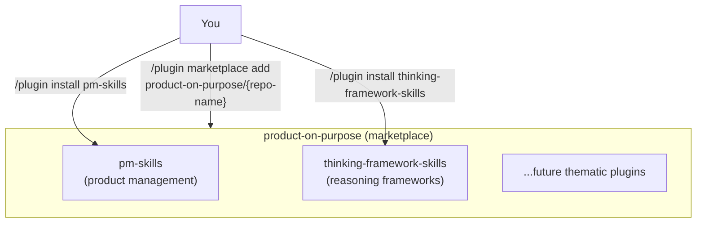

# Marketplace Multi-Plugin Migration. From single-plugin pm-skills to product-on-purpose marketplace

**Date**: 2026-05-18
**Status**: Draft for discussion
**Companion**: [`multi-repo-extraction-design_2026-04-19.md`](multi-repo-extraction-design_2026-04-19.md) (Option A4 is the foundation for this plan) and [`multi-repo-patterns-reference_2026-04-19.md`](multi-repo-patterns-reference_2026-04-19.md) (Nx, Turborepo, monorepo patterns)

## Table of contents

1. [Executive summary](#executive-summary)
2. [The conceptual flaw](#the-conceptual-flaw)
3. [Relationship to prior work](#relationship-to-prior-work)
4. [Target architecture](#target-architecture)
5. [Key architectural forks](#key-architectural-forks)
6. [Recommended approach](#recommended-approach)
7. [Migration phases](#migration-phases)
8. [Breaking changes and mitigation](#breaking-changes-and-mitigation)
9. [Versioning and lifecycle](#versioning-and-lifecycle)
10. [Content boundary decisions (deferred to follow-on)](#content-boundary-decisions-deferred-to-follow-on)
11. [Risks](#risks)
12. [Open questions](#open-questions)
13. [Estimated effort](#estimated-effort)
14. [Next steps](#next-steps)

---

## Executive summary

**What's changing.** The current architecture has one marketplace named `pm-skills-marketplace` exposing one plugin named `pm-skills`. The new architecture: one marketplace named `product-on-purpose` exposing multiple thematic plugins. The first two plugins under it would be `pm-skills` (current 59 skills) and `thinking-framework-skills` (new, initially empty or seed-set).

**Why.** Your conceptual model treats `product-on-purpose` as the brand/marketplace and each plugin as a *thematic skill collection*. The current naming (`pm-skills-marketplace` carrying one plugin called `pm-skills`) collapses these two concepts and constrains future growth. Once a second thematic collection exists, the current model has no home for it.

**What this builds on.** The 2026-04-19 design doc considered Option A4 (monorepo + multi-plugin marketplace) and rated it "low effort, ~50 lines of manifest changes" but didn't recommend it because the goal at that time was *brand separation* between PM and general business. Your new framing makes A4 the right answer: **the unifying brand is `product-on-purpose`, not `pm-skills`**, so multi-plugin doesn't dilute brand, it creates it.

**Recommended approach.** Adopt A4 as the long-term model in a **hybrid form** (Fork 1c): the existing `pm-skills` repo continues to host the marketplace manifest and the pm-skills plugin in place. The marketplace identity in `marketplace.json` is renamed from `pm-skills-marketplace` to `product-on-purpose`. New thematic plugins like `thinking-framework-skills` ship as their own GitHub repos, referenced from the marketplace manifest via Claude Code's documented `{source: "github", repo: "owner/name"}` form. This is supported by the schema (sources can be mixed between in-repo relative paths and external GitHub references in the same `plugins` array). pm-skills plugin bumps to v3.0.0 to mark the breaking marketplace rename. The existing pm-skills repo does NOT need to be restructured into a `plugins/` subdirectory unless you want to migrate it to that layout later for symmetry.

**Estimated effort.** ~3-5 sessions of focused work for the architectural migration (manifests, repo layout, CI scoping). Content migration (which existing skills move to other plugins) is a separate decision tracked in a follow-on doc.

---

## The conceptual flaw

The current setup:

```
GitHub: github.com/product-on-purpose/pm-skills    (the org owns one repo)
Repo: pm-skills                                    (the repo IS the product)
Marketplace: pm-skills-marketplace                 (marketplace is named after the plugin)
Plugin: pm-skills                                  (one plugin)
```

Install command: `/plugin marketplace add product-on-purpose/pm-skills`

The flaw: **the marketplace and the plugin share a name (`pm-skills`) and the marketplace name is derived from the plugin name, not from the brand or org.** A new user reads the install command as "add the PM-skills marketplace" rather than "add the Product-on-Purpose marketplace, which contains PM-skills among other things."

Two follow-on problems:

1. **There's no obvious home for a second thematic collection.** If you want to ship `thinking-framework-skills` tomorrow, it can either go inside the `pm-skills` plugin (wrong: thinking frameworks aren't a PM thing specifically) or as a separate marketplace (`thinking-framework-skills-marketplace`), forcing users to add multiple marketplaces from the same org.

2. **The brand identity is constrained.** The marketplace name advertises the first plugin, not the publisher. Future skill collections inherit this awkward "everything is a {category}-skills-marketplace" pattern.

The fix: the marketplace is named after the *publisher* (you, `product-on-purpose`), and plugins are the *thematic collections* underneath. This matches how npm packages relate to npm organizations, how VS Code extension packs relate to publishers, and how the `obra/superpowers-marketplace` setup actually works (Obra is the publisher; superpowers is one collection).

---

## Relationship to prior work

The [2026-04-19 multi-repo extraction design doc](multi-repo-extraction-design_2026-04-19.md) explored splitting general-business skills out of pm-skills into a sibling repo. It enumerated 15 options across 4 families (split strategy, taxonomy, automation, contribution flow) and recommended a release-tag-driven extraction approach.

Among those options was **A4: "No split. monorepo + multi-plugin marketplace"** - the option most aligned with what you're now proposing. The 2026-04-19 doc characterized A4 as:

> Keep everything in pm-skills. Update `.claude-plugin/plugin.json` and `marketplace.json` to expose two plugin identities from the same source.
>
> **Pros**: zero new repos; zero new infrastructure; uses marketplace's existing capability for multi-plugin manifests.
>
> **Cons**: no distinct GitHub URL or README for business-skills; no independent brand identity; marketplace listing still lives under the pm-skills org.
>
> **Effort**: low. ~50 lines of manifest changes.
>
> **When it fits**: the goal is distribution-channel diversity, not brand separation.

The 2026-04-19 con about "no independent brand identity" is now *exactly the point*. The brand is `product-on-purpose`, not `pm-skills` or `business-skills`. Each plugin is a sub-brand under the umbrella. A4 stops being a low-effort short-stop and starts being the architecturally correct long-term model.

**This plan supersedes the 2026-04-19 Recommendation section** while preserving its option-family analysis and the patterns-reference doc as valid historical context.

---

## Target architecture

### The mental model



### Concrete file layout (monorepo)

```
product-on-purpose-skills/                    (the repo, renamed from pm-skills)
├── .claude-plugin/
│   └── marketplace.json                      (declares ALL plugins in this marketplace)
├── plugins/
│   ├── pm-skills/
│   │   ├── .claude-plugin/
│   │   │   └── plugin.json
│   │   ├── skills/
│   │   ├── commands/
│   │   ├── _workflows/
│   │   ├── subagents/
│   │   ├── library/
│   │   ├── README.md                         (plugin-specific README)
│   │   ├── CHANGELOG.md                      (plugin-specific changelog)
│   │   └── AGENTS.md                         (plugin-specific skill map)
│   └── thinking-framework-skills/
│       ├── .claude-plugin/
│       │   └── plugin.json
│       ├── skills/                           (empty or seed-set initially)
│       ├── commands/
│       ├── README.md
│       ├── CHANGELOG.md
│       └── AGENTS.md
├── docs/                                     (shared Astro Starlight site, multi-plugin)
├── scripts/                                  (shared CI validators, plugin-scoped)
├── README.md                                 (marketplace README)
├── CHANGELOG.md                              (marketplace-level changelog)
├── CONTRIBUTING.md                           (cross-plugin contribution guide)
└── LICENSE
```

### Marketplace manifest after migration

```json
{
  "name": "product-on-purpose",
  "owner": {
    "name": "product-on-purpose",
    "url": "https://github.com/product-on-purpose"
  },
  "description": "Product on Purpose: thematic AI agent skill collections",
  "plugins": [
    {
      "name": "pm-skills",
      "version": "3.0.0",
      "source": "./plugins/pm-skills/",
      "description": "59 product management skills across the Triple Diamond cycle plus Foundation Sprint, Design Sprint, and active orchestration sub-agents.",
      "author": { "name": "product-on-purpose", "url": "..." },
      ...
    },
    {
      "name": "thinking-framework-skills",
      "version": "0.1.0",
      "source": "./plugins/thinking-framework-skills/",
      "description": "Canonical thinking frameworks for AI agents: SCQA, MECE, Pyramid Principle, First Principles, OODA, and more.",
      "author": { "name": "product-on-purpose", "url": "..." },
      ...
    }
  ]
}
```

### User-facing install commands after migration

```
# Add the marketplace once
/plugin marketplace add product-on-purpose/product-on-purpose-skills

# Install only the plugins you want
/plugin install pm-skills@product-on-purpose
/plugin install thinking-framework-skills@product-on-purpose

# Update either independently
/plugin update pm-skills
/plugin update thinking-framework-skills
```

---

## Key architectural forks

### Fork 1: Where does the marketplace manifest live?

The marketplace.json `source` field supports two forms (verified against [code.claude.com/docs/en/plugin-marketplaces](https://code.claude.com/docs/en/plugin-marketplaces)):

- **Relative path** (string): `"source": "./plugins/pm-skills"` for in-repo plugins
- **Typed object**: `"source": { "source": "github", "repo": "owner/repo-name" }` for plugins hosted in a different GitHub repo

Both forms can be mixed in the same `plugins` array. This means the marketplace doesn't have to choose monorepo vs multi-repo for the whole catalog - it can be hybrid.

| Option | Pros | Cons |
|---|---|---|
| **F1a. Pure monorepo**: marketplace + all plugins in one repo (all sources are relative paths) | One repo to clone, one CI, shared scripts/docs/site, atomic cross-plugin changes | Bigger repo. CI must be plugin-scoped to avoid running everything on every change |
| **F1b. Pure multi-repo**: marketplace.json in a central marketplace repo; each plugin in its own repo (all sources are typed `github` objects) | Each plugin has fully independent lifecycle | Marketplace manifest must reference external repos with pinned tags. Shared infrastructure duplicated. Cross-plugin coordination overhead |
| **F1c. Hybrid (recommended)**: pm-skills stays in-repo with marketplace.json; new thematic plugins (thinking-framework-skills, etc.) ship as separate repos referenced via `github` source objects | Best of both: existing pm-skills lifecycle preserved, new plugins get clean independent lifecycle from day 1. Each new plugin can be a focused repo with its own CI/docs scoped to that plugin. Mixing per the schema is explicitly supported | Two-place mental model: in-repo and external plugins coexist. Migration to fully multi-repo is possible later if needed |
| **F1d. Plugins-only monorepo (deprecated from prior thinking)**: marketplace inside today's pm-skills repo holding multiple plugins inside `plugins/` | Smaller incremental change to existing repo | Pure-monorepo cons; less future flexibility than F1c |

### Fork 2: What's the marketplace repo named?

| Option | Pros | Cons |
|---|---|---|
| **F2a. Rename `pm-skills` to `product-on-purpose-skills` (or similar)** | Brand-aligned name. GitHub auto-redirects from old URL. | One-time URL churn. Existing `/plugin marketplace add product-on-purpose/pm-skills` likely still works via GitHub redirect but should be tested. |
| **F2b. Rename `pm-skills` to `marketplace`** | Maximally clear ("the marketplace for product-on-purpose"). | "marketplace" is generic; not great as a standalone name. |
| **F2c. Keep `pm-skills` repo name** | Zero URL churn. | Repo name (`pm-skills`) misrepresents contents (multi-plugin marketplace). Confusing for new contributors. |
| **F2d. Create a new repo `product-on-purpose/agent-skills` from scratch** | Fully clean. New install command. | Loses GitHub history, stars, issues, PRs unless explicitly migrated. |

### Fork 3: How do plugins inside the monorepo version themselves?

| Option | Pros | Cons |
|---|---|---|
| **F3a. Per-plugin independent SemVer (recommended)** | Each plugin can release on its own cadence. Matches user expectation. | Marketplace-level changelog requires aggregation across plugins. |
| **F3b. Synchronized version across all plugins** | Single version number for the whole marketplace. | Forces unnecessary bumps when one plugin changes and others don't. |
| **F3c. Per-plugin SemVer plus marketplace-level "release train" version** | Most flexible. Each plugin has its own version; the marketplace also has a meta-version that increments on any plugin change. | More moving parts; two version numbers per artifact. |

### Fork 4: How are CI validators scoped?

| Option | Pros | Cons |
|---|---|---|
| **F4a. Plugin-scoped validators with shared infrastructure (recommended)** | Each validator takes a `--plugin <name>` flag; CI runs only the affected plugin on PRs that touch one plugin. | Requires retrofitting existing validators with the flag. |
| **F4b. Global validators that always run everything** | No retrofitting required. | Slow CI as plugin count grows. False sense of "the whole marketplace is healthy" when only one plugin was touched. |
| **F4c. Per-plugin GitHub Actions workflows** | Maximally granular. | Workflow file duplication; harder to share infrastructure improvements. |

### Fork 5: How is the docs site organized?

| Option | Pros | Cons |
|---|---|---|
| **F5a. One docs site covering all plugins (recommended)** | Single source of truth, single brand presence at `product-on-purpose.github.io`. Each plugin has its own section in the sidebar. | Sidebar grows over time; needs good IA. |
| **F5b. Per-plugin docs sites** | Each plugin has independent docs lifecycle. | Multiple sites to maintain; no unified discovery. |
| **F5c. Hybrid: per-plugin docs files in plugins/* and a shared site that aggregates them** | Best of both: docs co-located with plugin source, but unified site. | Build pipeline more complex; aggregation logic needs to be written. |

### Fork 6: Handling the existing pm-skills users on v2.13.0 through v2.16.0

| Option | Pros | Cons |
|---|---|---|
| **F6a. Hard cut at v3.0.0 (recommended): old marketplace deprecated, new one published; release notes guide migration** | Clean break. Users explicitly opt into new model. | Existing users must re-install. |
| **F6b. Soft transition: keep `pm-skills-marketplace` working as an alias for one release cycle** | Easier for existing users. | Requires maintaining two marketplace.json files in sync for a release. |
| **F6c. Gradual: leave `pm-skills-marketplace` intact, introduce `product-on-purpose` marketplace separately** | Zero disruption. | Two marketplaces forever. Defeats the unification goal. |

---

## Recommended approach

| Fork | Recommendation | Reasoning |
|---|---|---|
| Manifest location (F1) | **F1c. Hybrid** | pm-skills stays in-repo (preserves existing CI, docs, history); thinking-framework-skills and future thematic plugins ship as separate repos with focused scope. Confirmed supported by the Claude Code marketplace schema (mixed `source` forms in the same `plugins` array) |
| Repo name (F2) | **F2a. Rename to `product-on-purpose-skills`** | Best brand alignment with smallest disruption. GitHub redirects soften the break. |
| Versioning (F3) | **F3a. Per-plugin SemVer** | Matches user expectation. Skill collections evolve at different rates. |
| CI scoping (F4) | **F4a. Plugin-scoped with `--plugin <name>` flag** | Retrofitting effort is modest; CI speed gains are immediate. |
| Docs site (F5) | **F5a. One unified site** | Single brand presence; sidebar tabs per plugin is well-trodden IA pattern. |
| User migration (F6) | **F6a. Hard cut at v3.0.0** | Clean. Migration guide in release notes. |

The cumulative effect: the existing pm-skills repo gets renamed, internally restructured into `plugins/`, and ships a major v3.0.0 release marking the marketplace rename. From that release onward, new thematic plugins can be added as `plugins/<plugin-name>/` directories without further structural change.

---

## Migration phases

Each phase is a discrete chunk of work with a clear "done" state. Phases can run sequentially in 1-2 sessions each.

### Phase 0: Decisions and design alignment (1 session)

- Review and confirm the recommended fork picks above.
- Decide the new repo name (recommendation: `product-on-purpose-skills`).
- Decide the launch plugin set: just `pm-skills` + `thinking-framework-skills`, or also seed others (e.g., separating `facilitation-skills` from pm-skills)?
- Confirm the v3.0.0 cut as the marketplace-rename release.
- Decide breaking-change communication strategy (release notes, GitHub Release body, README banner for one release cycle).
- **Done state**: open questions in this doc are resolved; a v3.0.0 release plan exists at `docs/internal/release-plans/v3.0.0/`.

### Phase 1: Repo rename + monorepo skeleton (1 session)

- Rename the GitHub repo from `pm-skills` to `product-on-purpose-skills` (or chosen name). GitHub auto-creates a redirect.
- Create the `plugins/` directory at repo root.
- Move all existing pm-skills content into `plugins/pm-skills/` (one big `git mv` to preserve history).
- Move `.claude-plugin/plugin.json` to `plugins/pm-skills/.claude-plugin/plugin.json`.
- Keep `.claude-plugin/marketplace.json` at repo root and update its `source` for pm-skills to `./plugins/pm-skills/`.
- Update repo-root `README.md` to be the **marketplace** README (lists plugins, install commands, marketplace identity), not the pm-skills README.
- Create `plugins/pm-skills/README.md` as the **plugin-specific** README (pulled from old root README content).
- Run all existing validators to confirm nothing structural broke from the path moves.
- **Done state**: the marketplace install still works; pm-skills plugin still resolves; tests pass.

### Phase 2: Update marketplace.json for new identity (0.5 sessions)

- Rename marketplace from `pm-skills-marketplace` to `product-on-purpose`.
- Update `owner` and `description` to reflect the marketplace identity, not the plugin.
- Bump pm-skills plugin version to `3.0.0` to mark the breaking marketplace-name change.
- Test install path: `/plugin marketplace add product-on-purpose/product-on-purpose-skills` (or whatever the renamed repo path is).
- Test that `/plugin install pm-skills@product-on-purpose` resolves.
- **Done state**: marketplace install works under the new identity.

### Phase 3: CI validator plugin-scoping (1-2 sessions)

- Add a `--plugin <name>` flag to each validator script (bash + pwsh + md triplet).
- Default behavior with no flag: validate all plugins (preserves current behavior).
- With `--plugin pm-skills`: validate only that plugin's files.
- Update `.github/workflows/*.yml` to run plugin-scoped validation based on PR file paths.
- Update CONTRIBUTING.md to document the new validator invocation.
- **Done state**: a PR touching only pm-skills triggers only pm-skills validation; same for future plugins.

### Phase 4: Add the thinking-framework-skills plugin scaffold (1 session)

- Create `plugins/thinking-framework-skills/` with the standard structure (skills/, commands/, _workflows/, .claude-plugin/plugin.json, README.md, CHANGELOG.md, AGENTS.md).
- The plugin is **empty** at first: no skills inside, but the plugin manifest is valid and registers cleanly.
- Add to marketplace.json as the second plugin.
- Test that `/plugin install thinking-framework-skills@product-on-purpose` resolves (even if it installs an empty plugin).
- This establishes the pattern. The first thinking-framework skill can be added in a follow-on release without further structural work.
- **Done state**: the marketplace advertises two plugins; both install; both validate.

### Phase 5: Docs site multi-plugin organization (1 session)

- Update Astro Starlight site config to have a top-level sidebar split between "PM Skills" and "Thinking Framework Skills" (and any other plugins).
- Each plugin's docs live at `plugins/<name>/docs/` and are mounted into the unified site.
- Repo-root `docs/` continues to hold cross-plugin content (marketplace overview, contribution guide, methodology references that apply across plugins).
- **Done state**: the deployed site shows distinct plugin sections; URL structure is `product-on-purpose.github.io/<plugin-name>/...`.

### Phase 6: Release v3.0.0 (1 session)

- Write release notes documenting the marketplace rename and the user-facing migration path.
- Tag and push v3.0.0.
- GitHub Release body links to the migration guide.
- Update marketplace.json `pm-skills.version` to `3.0.0`.
- Verify the new marketplace install path works against a fresh Claude Code install.
- **Done state**: v3.0.0 is shipped; existing users have a clear path to migrate.

### Phase 7: Content boundary review (deferred to follow-on)

- Decide which existing pm-skills should move to other plugins (e.g., `mermaid-diagrams` to `visualization-skills`, `meeting-*` to `facilitation-skills`, `lean-canvas` to `strategy-skills`).
- This is **not** part of the v3.0.0 marketplace-restructure release. It's a separate content-architecture decision that benefits from having the multi-plugin chassis in place first.
- See [Content boundary decisions](#content-boundary-decisions-deferred-to-follow-on) below.

---

## Breaking changes and mitigation

### What breaks for existing users

| User action | Before v3.0.0 | After v3.0.0 |
|---|---|---|
| Add the marketplace | `/plugin marketplace add product-on-purpose/pm-skills` | `/plugin marketplace add product-on-purpose/product-on-purpose-skills` |
| Install the plugin | `/plugin install pm-skills@pm-skills-marketplace` | `/plugin install pm-skills@product-on-purpose` |
| Update the plugin | `/plugin update pm-skills` | `/plugin update pm-skills` (unchanged) |
| Repo URL | `github.com/product-on-purpose/pm-skills` | `github.com/product-on-purpose/product-on-purpose-skills` (auto-redirects) |

### Mitigation

1. **GitHub URL redirect**. GitHub auto-redirects from `pm-skills` to the new repo name after rename. External links keep working. Claude Code's marketplace fetch through GitHub shorthand likely still works via redirect (needs verification in Phase 0).
2. **Migration guide in v3.0.0 release notes**. Single section: "If you installed pm-skills before v3.0.0, here's how to migrate." Concrete commands: `/plugin marketplace remove pm-skills-marketplace` then `/plugin marketplace add product-on-purpose/product-on-purpose-skills` then `/plugin install pm-skills@product-on-purpose`.
3. **README banner for one release cycle (v3.0.x line)**. Top of README.md notes the marketplace rename and links to the migration guide.
4. **Existing v2.x users still work**. Their `pm-skills-marketplace` continues to function as a frozen-in-place install until they choose to migrate. We don't break what's already installed; we ask them to opt in to the new identity on their next update.

---

## Versioning and lifecycle

### Per-plugin SemVer

Each plugin in the monorepo carries its own version in its `plugin.json`:

- `plugins/pm-skills/.claude-plugin/plugin.json` → version `3.0.0` (the marketplace-rename major bump)
- `plugins/thinking-framework-skills/.claude-plugin/plugin.json` → version `0.1.0` (initial scaffold)

Each plugin's CHANGELOG.md tracks its own history. The repo-root CHANGELOG.md becomes a **marketplace-level** changelog that records structural changes (plugin additions, marketplace renames, monorepo conventions) and links to per-plugin changelogs.

### Release coordination

Plugins ship independently. Tag conventions:

- `pm-skills-v3.0.0` for pm-skills releases
- `thinking-framework-skills-v0.1.0` for thinking-framework-skills releases
- `marketplace-v1.0.0` for marketplace-level structural changes (initial marketplace rename = `marketplace-v1.0.0`)

Each tag triggers only the affected plugin's release pipeline.

### Marketplace.json updates

When a plugin releases, only that plugin's `version` field in marketplace.json updates. No other plugin's version changes. This is the standard Nx / Lerna / Turborepo pattern.

---

## Content boundary decisions (deferred to follow-on)

The 2026-04-19 doc enumerated candidate skills for extraction. Some of that analysis applies here: certain pm-skills may belong in other thematic plugins. **This is a separate decision** that benefits from the multi-plugin chassis being in place first.

A future doc (`marketplace-content-boundaries_2026-XX-XX.md`) should address:

- Which existing pm-skills naturally belong in other plugins (candidates from 2026-04-19: meeting-*, mermaid-diagrams, slideshow-creator, persona, lean-canvas)?
- What new plugins should host them (e.g., `facilitation-skills`, `visualization-skills`, `strategy-skills`)?
- How is migration of an existing skill from pm-skills to another plugin handled (deprecation in pm-skills, fresh-add in new plugin, or moved-with-redirect)?
- Are some skills genuinely shared across plugins (e.g., a `mermaid-diagrams` utility used by multiple plugin types)? If so, how is shared content represented?

These questions are *important* but not *blocking*. They can be deferred until v3.x or v4.x once the marketplace structure is settled and we see how readers actually navigate the new layout.

---

## Risks

| Risk | Likelihood | Impact | Mitigation |
|---|---|---|---|
| GitHub URL redirect doesn't work for Claude Code's marketplace resolver | Low | High | Verify in Phase 0 against a test repo rename. Fallback: provide explicit new install command in migration guide. |
| Multi-plugin marketplace.json schema isn't supported by current Claude Code | Low | High | Verify with a test plugin scaffold in Phase 1 before committing. The schema does support multi-plugin (the `plugins` array is plural), but real-world testing is wise. |
| Plugin-scoped validators introduce subtle scoping bugs (e.g., a check that's supposed to span plugins doesn't run) | Medium | Medium | Add a `validate-all` aggregate target that runs every plugin's validators; use it for release-gate CI. |
| Documentation site IA gets confusing with multiple plugins | Medium | Medium | Pin the sidebar IA in Phase 5 design. Each plugin gets exactly one top-level section. Cross-cutting docs live at repo root. |
| Users on v2.x ignore the migration and silently fall behind | Medium | Low | The v3.0.0 release notes + README banner are the mitigation. If a v2.x user wants to stay frozen, that's their choice; we don't block updates to the old marketplace artifacts. |
| `thinking-framework-skills` plugin ships as empty and feels unfinished | Medium | Low | Either delay shipping it as a plugin until at least 3 skills exist, OR include a few seed skills (e.g., SCQA, MECE, First Principles) in the v3.0.0 cut. |
| Branding tension: the marketplace name says "product-on-purpose" but the pm-skills content dominates the catalog for now | High | Low | Acknowledged in release notes. As more plugins ship, the brand-vs-content alignment improves. This is a transitional state, not a permanent flaw. |

---

## Open questions

These are questions for you to resolve before Phase 0 closes:

1. **Repo name.** Recommended: `product-on-purpose-skills`. Alternatives: `product-on-purpose-marketplace`, `agent-skills`, keep `pm-skills`. Pick one.
2. **Launch plugin set.** Just `pm-skills` + `thinking-framework-skills` skeleton? Or include a third (e.g., `facilitation-skills` carved out of pm-skills)?
3. **`thinking-framework-skills` initial content.** Ship empty (just scaffold), or seed with 3-5 starter skills (SCQA, MECE, Pyramid Principle, First Principles, OODA)?
4. **Version bump.** pm-skills v2.16.0 to v3.0.0 (recommended for breaking marketplace rename) or v2.17.0 (treating it as additive)?
5. **Migration window.** Should the old `pm-skills-marketplace` continue to work as an alias for one release cycle (F6b), or hard-cut at v3.0.0 (F6a)?
6. **Content boundary work.** Defer entirely to a follow-on doc (recommended) or include 1-2 obvious moves in v3.0.0 (e.g., move `mermaid-diagrams` to a `visualization-skills` plugin)?
7. **pm-skills-mcp.** The companion MCP server is currently in maintenance mode. Does the multi-plugin marketplace model imply a multi-plugin MCP server, or does each plugin get its own MCP server, or does the file-based path supersede MCP entirely going forward?
8. **Plugin naming convention.** Is the `*-skills` suffix mandatory (`pm-skills`, `thinking-framework-skills`, `facilitation-skills`)? Or should some plugins drop it for cleaner brand (e.g., just `thinking-frameworks`)?

---

## Estimated effort

| Phase | Effort | Notes |
|---|---|---|
| Phase 0: Decisions + alignment | 1 session | Resolves open questions; writes release plan |
| Phase 1: Repo rename + monorepo skeleton | 1 session | Mostly `git mv` and manifest path updates |
| Phase 2: Update marketplace.json identity | 0.5 sessions | Manifest field changes |
| Phase 3: CI validator plugin-scoping | 1-2 sessions | Retrofit `--plugin` flag across ~24 validators |
| Phase 4: thinking-framework-skills scaffold | 1 session | Empty plugin shell + manifest |
| Phase 5: Docs site multi-plugin IA | 1 session | Astro config + sidebar structure |
| Phase 6: Release v3.0.0 | 1 session | Release notes, tag, ship |
| **Total** | **~6-8 sessions** | Phase 7 (content boundaries) deferred |

For comparison, v2.15.0 (Sprint Skills Launch, similarly substantial) took ~10-12 sessions including content authoring. This migration is structural, not content-heavy.

---

## Next steps

1. Read this doc end-to-end and resolve the [open questions](#open-questions).
2. If aligned on direction, copy the relevant phase steps into `docs/internal/release-plans/v3.0.0/plan_v3.0.0.md` as the working release plan.
3. Phase 0 deliverables: confirmed repo name, confirmed launch plugin set, confirmed version bump strategy, confirmed migration window.
4. Once Phase 0 closes, Phase 1 can start immediately.

If any open question feels under-explored, branch it into its own design doc rather than letting it block this plan.

---

## Related documents

- [`multi-repo-extraction-design_2026-04-19.md`](multi-repo-extraction-design_2026-04-19.md) - the prior architectural exploration. Option A4 is the foundation for this plan. Other options in that doc (sibling-repo extraction, audience tagging, etc.) are now historical context.
- [`multi-repo-patterns-reference_2026-04-19.md`](multi-repo-patterns-reference_2026-04-19.md) - industry best-practice reference (Nx, Turborepo, git subtree, Hugo, Lerna). The monorepo + multi-publishable pattern (Nx) is the closest analog for what this plan adopts.
- [`backlog-canonical.md`](backlog-canonical.md) - if this plan goes ahead, add v3.0.0 marketplace migration as a top-priority backlog item.
- [`skill-versioning.md`](skill-versioning.md) - existing versioning governance. May need an update to reflect plugin-scoped versioning under the marketplace umbrella.

---

## Decision log

| Date | Decision | Rationale |
|---|---|---|
| 2026-05-18 | Adopt Option A4 (monorepo + multi-plugin marketplace) from the 2026-04-19 design doc | User identified the conceptual flaw in the single-plugin model; A4 maps to the desired mental model (product-on-purpose as marketplace, plugins as thematic collections) |
| TBD (Phase 0) | Repo name | Pending [Open question 1](#open-questions) |
| TBD (Phase 0) | Launch plugin set | Pending [Open question 2](#open-questions) |
| TBD (Phase 0) | v3.0.0 vs v2.17.0 | Pending [Open question 4](#open-questions) |
| TBD (Phase 0) | Migration window | Pending [Open question 5](#open-questions) |
