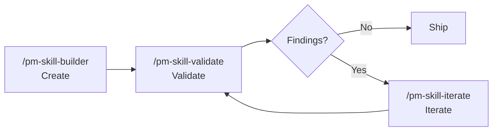

<!--
Draft README v1: Polished comprehensive.

Goal: Keep the existing README's general structure and rich content, but make it easier
to scan. This version preserves the familiar sections: hero, big idea, getting started,
usage, skills, workflows, status, contributing, FAQ, about. It trims release history
and platform setup details by linking to existing secondary docs.
-->

<a id="readme-top"></a>

<h1 align="center">
  <a href="https://github.com/product-on-purpose/pm-skills">PM-Skills</a>
</h1>

<p align="center">
  <strong>40 production-ready product management skills for AI agents.</strong><br>
  PRDs, OKRs, hypotheses, opportunity trees, meeting artifacts, retrospectives, diagrams, slides, and more, each with structured instructions, templates, examples, and slash commands.
</p>

<p align="center">
  <a href="https://github.com/product-on-purpose/pm-skills/issues/new?labels=bug">Report a Bug</a>
  |
  <a href="https://github.com/product-on-purpose/pm-skills/issues/new?labels=enhancement">Request a Feature</a>
  |
  <a href="https://github.com/product-on-purpose/pm-skills/discussions">Ask a Question</a>
</p>

<p align="center">
  
  <a href="https://github.com/product-on-purpose/pm-skills/releases/latest">
    
  </a>
  <a href="#skills">
    
  </a>
  <a href="https://agentskills.io/specification">
    
  </a>
  <a href="LICENSE">
    
  </a>
  <a href="https://skills.sh/product-on-purpose/pm-skills">
    
  </a>
</p>

<p align="center">
  <a href="#the-big-idea">About</a> |
  <a href="#getting-started">Getting Started</a> |
  <a href="#usage">Usage</a> |
  <a href="#skills">Skills</a> |
  <a href="#workflows">Workflows</a> |
  <a href="#project-status">Status</a> |
  <a href="#contributing">Contributing</a> |
  <a href="#faq">FAQ</a>
</p>

---

## The Big Idea

**Stop prompt-fumbling. Start shipping.**

Every product manager has asked an AI for a PRD, research synthesis, roadmap note, experiment plan, or launch checklist, then spent the next 20 minutes correcting the format. Generic AI knows a lot, but it does not automatically know your artifact standard.

PM-Skills gives your AI agent a professional PM playbook it can read directly. Each skill is a markdown capability with:

- **Instructions**: what the agent should do and when to use the skill.
- **Template**: the expected output structure.
- **Example**: a realistic artifact that sets the quality bar.
- **Command**: a shortcut like `/prd`, `/hypothesis`, `/okr-writer`, or `/meeting-recap`.

```
You: /prd "Search v2 for our marketplace"

AI + PM-Skills:
  Reads skills/deliver-prd/SKILL.md
  Follows references/TEMPLATE.md
  Mirrors references/EXAMPLE.md
  Produces a structured PRD with problem framing, goals, scope,
  user stories, dependencies, risks, and open questions.
```

| Without PM-Skills | With PM-Skills |
|---|---|
| Re-explain the artifact every time | The agent reads a durable skill |
| Inconsistent formats | Shared templates and examples |
| Missing sections and weak handoffs | Complete output contracts |
| Scattered PM knowledge | Curated PM library in your repo |
| One-off prompting | Repeatable skill and workflow patterns |

### What makes this different?

PM-Skills is not a prompt pack. It is a maintained, open-source skill library built around the [Agent Skills Specification](https://agentskills.io/specification), the Triple Diamond product lifecycle, and real PM artifact contracts. It is designed to be readable, forkable, and usable across the AI agent ecosystem.

### Built on open foundations

| Foundation | What it contributes |
|---|---|
| [Agent Skills Specification](https://agentskills.io/specification) | Portable skill format for AI agents |
| Triple Diamond | Six-phase product lifecycle: Discover, Define, Develop, Deliver, Measure, Iterate |
| [Opportunity Solution Trees](https://www.producttalk.org/opportunity-solution-tree/) | Outcome-driven discovery and opportunity framing |
| [Jobs to be Done](https://jtbd.info/) | Customer motivation and job framing |
| [Architecture Decision Records](https://adr.github.io/) | Technical decision documentation |
| Keep a Changelog | Structured release history |

<p align="right">(<a href="#readme-top">back to top</a>)</p>

---

## Getting Started

Most users only need one of these four paths.

### 1. Claude Code plugin

Use this if you want the cleanest Claude Code install path.

```text
/plugin marketplace add product-on-purpose/pm-skills
/plugin install pm-skills@pm-skills-marketplace
```

Verify with:

```text
/plugin list
```

Then try:

```text
/prd "Search v2 for our marketplace"
/meeting-agenda "Cross-functional kickoff for search v2"
/okr-writer "Q3 product OKRs for the growth team"
```

### 2. Skills CLI

Use this for the broadest cross-agent install path.

```bash
npx skills add product-on-purpose/pm-skills
```

This is the simplest path for many tools that support the open `skills` CLI or skills.sh ecosystem.

### 3. Git clone

Use this if you want to fork, contribute, customize skills, or let workspace-aware agents discover the repo through `AGENTS.md`.

```bash
git clone https://github.com/product-on-purpose/pm-skills.git
cd pm-skills
```

Cursor, Windsurf, GitHub Copilot, and other agentic IDEs can use `AGENTS.md` as the discovery index when the repo is in your workspace.

### 4. Release ZIP

Use this for Claude.ai, Claude Desktop, or offline review.

1. Download the latest ZIP from [Releases](https://github.com/product-on-purpose/pm-skills/releases/latest).
2. Upload it to your Claude Project or extract it locally.
3. Ask your AI to use the relevant skill by name.

### Other platforms

The README intentionally does not repeat every setup flow. Use the full platform guide for step-by-step instructions:

| Platform | Where to go |
|---|---|
| Claude.ai / Claude Desktop | [Platform guide](docs/getting-started/platforms.md#claudeai--claude-desktop) |
| Cursor | [Platform guide](docs/getting-started/platforms.md#cursor) |
| Windsurf | [Platform guide](docs/getting-started/platforms.md#windsurf) |
| GitHub Copilot | [Platform guide](docs/getting-started/platforms.md#github-copilot) |
| VS Code with Cline / Continue | [Platform guide](docs/getting-started/platforms.md#vs-code-cline--continue) |
| OpenCode | [Platform guide](docs/getting-started/platforms.md#opencode) |
| MCP clients | [MCP integration guide](docs/guides/mcp-integration.md) |
| ChatGPT or other LLMs | [Manual use notes](docs/getting-started/platforms.md#chatgpt--other-llms) |

For a guided first run, see [Quickstart](docs/getting-started/quickstart.md).

<p align="right">(<a href="#readme-top">back to top</a>)</p>

---

## Usage

### Run a single skill

```text
/prd "A focus-mode feature for our task app"
/hypothesis "One-page checkout will improve conversion"
/opportunity-tree "Reduce trial-to-paid drop-off"
/acceptance-criteria "Checkout as guest"
/retrospective "Sprint 12, handoff friction"
```

You can also invoke skills conversationally:

```text
Use the problem-statement skill to frame this customer support backlog issue.
Use the stakeholder-update skill to turn this meeting recap into an exec update.
Use the mermaid-diagrams skill to turn this workflow into a sequence diagram.
```

### Run a workflow

Workflows chain skills together for bigger jobs:

```text
/workflow-feature-kickoff "Recurring tasks for the consumer app"
/workflow-customer-discovery "Understand why teams abandon onboarding"
/workflow-product-strategy "2026 retention strategy"
```

### Use the skills as reference material

Every skill is plain markdown. You can open any `SKILL.md`, read the instructions, and adapt the template to your team's standard.

```text
skills/deliver-prd/
+-- SKILL.md
+-- references/
    +-- TEMPLATE.md
    +-- EXAMPLE.md
```

### See finished examples

The sample library includes 120+ worked outputs across three fictional product narratives:

- **Storevine**: B2B ecommerce marketing automation.
- **Brainshelf**: consumer personal knowledge management.
- **Workbench**: enterprise collaboration and governance.

Browse [`library/skill-output-samples/`](library/skill-output-samples/) to see what the skills actually produce.

<p align="right">(<a href="#readme-top">back to top</a>)</p>

---

## Skills

PM-Skills includes 40 skills across foundation, lifecycle, and utility categories.

| Category | Purpose | Skills |
|---|---|---|
| **Foundation** | Cross-cutting PM capabilities | `persona`, `lean-canvas`, `okr-writer`, `meeting-agenda`, `meeting-brief`, `meeting-recap`, `meeting-synthesize`, `stakeholder-update` |
| **Discover** | Understand the market, users, and stakeholders | `competitive-analysis`, `interview-synthesis`, `stakeholder-summary` |
| **Define** | Frame the problem and opportunity | `problem-statement`, `hypothesis`, `opportunity-tree`, `jtbd-canvas` |
| **Develop** | Explore solutions and document decisions | `solution-brief`, `spike-summary`, `adr`, `design-rationale` |
| **Deliver** | Specify, launch, and communicate what ships | `prd`, `user-stories`, `edge-cases`, `acceptance-criteria`, `launch-checklist`, `release-notes` |
| **Measure** | Instrument, evaluate, and learn from outcomes | `experiment-design`, `instrumentation-spec`, `dashboard-requirements`, `experiment-results`, `okr-grader` |
| **Iterate** | Reflect, refine, and decide what changes next | `retrospective`, `lessons-log`, `refinement-notes`, `pivot-decision` |
| **Utility** | Build, validate, transform, and maintain skills | `pm-skill-builder`, `pm-skill-validate`, `pm-skill-iterate`, `mermaid-diagrams`, `slideshow-creator`, `update-pm-skills` |

### Common commands

| Need | Command |
|---|---|
| Create a PRD | `/prd` |
| Break requirements into stories | `/user-stories` |
| Write Given/When/Then criteria | `/acceptance-criteria` |
| Frame a problem | `/problem-statement` |
| Define a hypothesis | `/hypothesis` |
| Map opportunities | `/opportunity-tree` |
| Write OKRs | `/okr-writer` |
| Score OKRs | `/okr-grader` |
| Prepare a meeting agenda | `/meeting-agenda` |
| Recap a meeting | `/meeting-recap` |
| Create a diagram | `/mermaid-diagrams` |
| Generate a slide deck | `/slideshow-creator` |

Full command catalog: [docs/reference/commands.md](docs/reference/commands.md).  
Skill reference pages: [docs/skills/](docs/skills/).

### Skill lifecycle tools

PM-Skills also includes utility skills for maintaining the library itself:



| Tool | What it does |
|---|---|
| `/pm-skill-builder` | Guides a contributor from skill idea to implementation packet |
| `/pm-skill-validate` | Audits skill structure and quality with severity-graded findings |
| `/pm-skill-iterate` | Applies targeted improvements from feedback or validation reports |

Guide: [PM-Skill Lifecycle](docs/guides/pm-skill-lifecycle.md).

<p align="right">(<a href="#readme-top">back to top</a>)</p>

---

## Workflows

Workflows are multi-skill recipes for common PM journeys.

| Workflow | What it helps with | Command |
|---|---|---|
| Feature Kickoff | Go from idea to PRD and stories | `/workflow-feature-kickoff` |
| Customer Discovery | Turn research into validated problem framing | `/workflow-customer-discovery` |
| Sprint Planning | Prepare sprint-ready stories from backlog inputs | `/workflow-sprint-planning` |
| Product Strategy | Frame a major product initiative | `/workflow-product-strategy` |
| Post-Launch Learning | Measure results and capture learnings | `/workflow-post-launch-learning` |
| Stakeholder Alignment | Build a case for leadership buy-in | `/workflow-stakeholder-alignment` |
| Technical Discovery | Evaluate feasibility and architecture | `/workflow-technical-discovery` |
| Lean Startup | Run a Build-Measure-Learn loop | See `_workflows/lean-startup.md` |
| Triple Diamond | Run the full product development cycle | See `_workflows/triple-diamond.md` |

Workflow guide: [docs/guides/using-workflows.md](docs/guides/using-workflows.md).  
Workflow reference: [docs/workflows/](docs/workflows/).

<p align="right">(<a href="#readme-top">back to top</a>)</p>

---

## Project Status

| Item | Current state |
|---|---|
| Latest stable | [v2.13.1](https://github.com/product-on-purpose/pm-skills/releases/tag/v2.13.1) |
| Skills | 40 |
| Commands | 47 |
| Workflows | 9 |
| License | [Apache 2.0](LICENSE) |
| Public docs | [docs/](docs/) |
| Release notes | [docs/releases/](docs/releases/) |
| Changelog | [CHANGELOG.md](CHANGELOG.md) |

### Recent releases

| Version | Highlight |
|---|---|
| v2.13.1 | Claude Code plugin install path correction |
| v2.13.0 | Documentation hardening and CI validator expansion |
| v2.12.0 | OKR write-and-score skill set |
| v2.11.x | Meeting Skills Family and lean canvas |
| v2.10.x | Mermaid diagrams, slideshow creator, and update utility |

For full historical detail, use [CHANGELOG.md](CHANGELOG.md). The README keeps only the recent-release summary so the front door stays readable.

### pm-skills vs pm-skills-mcp

|  | pm-skills | [pm-skills-mcp](https://github.com/product-on-purpose/pm-skills-mcp) |
|---|---|---|
| What it is | Source skill library | MCP server wrapping a catalog snapshot |
| Best for | Slash commands, customization, forking, AGENTS.md discovery | Clients that require MCP tool calls |
| Status | Active development | Maintenance mode |
| Updates | Tracks this repo | Security and critical fixes only |

New users should usually start with this repo's file-based install paths. Use MCP when your tooling specifically requires the protocol. Details: [MCP integration](docs/guides/mcp-integration.md).

<p align="right">(<a href="#readme-top">back to top</a>)</p>

---

## Contributing

Contributions are welcome, especially examples, docs improvements, bug fixes, and well-scoped skill proposals.

### Quick path

1. Fork the repo.
2. Create a branch.
3. Make your change.
4. Run the relevant validation script.
5. Open a pull request.

```bash
bash scripts/lint-skills-frontmatter.sh
bash scripts/validate-commands.sh
bash scripts/validate-plugin-install.sh
```

For new skills, start with `/pm-skill-builder` or read [Authoring PM-Skills](docs/guides/creating-pm-skills.md). For contribution rules, see [CONTRIBUTING.md](CONTRIBUTING.md).

### Good first contributions

- Improve examples or sample outputs.
- Clarify a template section.
- Fix docs links or stale wording.
- Add missing guidance to a skill's `When to Use` section.
- Propose a new skill with a clear output contract and example scenario.

<p align="right">(<a href="#readme-top">back to top</a>)</p>

---

## FAQ

<details>
<summary><strong>Do I need Claude Code?</strong></summary>

No. Claude Code has the best slash-command experience, but PM-Skills is plain markdown and works with Cursor, GitHub Copilot, Windsurf, Claude.ai, Claude Desktop, OpenCode, MCP clients, and manual copy/paste into other LLMs.

</details>

<details>
<summary><strong>Do I need to install all 40 skills?</strong></summary>

No. Each skill is self-contained. You can use the whole library, install through a platform helper, or copy only the specific `SKILL.md` file you need.

</details>

<details>
<summary><strong>Can I customize skills for my team?</strong></summary>

Yes. Fork the repo and edit the relevant `SKILL.md`, `TEMPLATE.md`, or `EXAMPLE.md`. The Apache 2.0 license allows commercial use, private modification, and redistribution with attribution.

</details>

<details>
<summary><strong>What is the difference between skills and workflows?</strong></summary>

Skills produce individual artifacts. Workflows chain multiple skills into a recommended sequence for larger PM jobs such as feature kickoff, sprint planning, customer discovery, or post-launch learning.

</details>

<details>
<summary><strong>Where should I start?</strong></summary>

If you want one artifact, run `/prd`, `/hypothesis`, `/opportunity-tree`, or whichever command matches the artifact. If you want an end-to-end process, start with `/workflow-feature-kickoff` or `/workflow-customer-discovery`.

</details>

<details>
<summary><strong>Can I contribute new skills?</strong></summary>

Yes. Use `/pm-skill-builder` to generate a skill implementation packet, then validate with `/pm-skill-validate`. The maintainer review focuses on fit, non-overlap, output contract quality, and example quality.

</details>

<details>
<summary><strong>Where can I see all platform instructions?</strong></summary>

Use [docs/getting-started/platforms.md](docs/getting-started/platforms.md). The README only shows the most common paths so it stays readable.

</details>

<p align="right">(<a href="#readme-top">back to top</a>)</p>

---

## About

PM-Skills is built and maintained by [Product on Purpose](https://github.com/product-on-purpose), created by [Jonathan Prisant](https://github.com/jprisant).

It is both a working PM skill library and a learning vehicle for exploring how AI agents can produce more consistent, rigorous, useful product artifacts. The goal is practical: help PMs and teams spend less time re-explaining formats and more time making good product decisions.

### License

[Apache 2.0](LICENSE). You can use PM-Skills commercially, modify it privately, fork it, redistribute it, and include it in proprietary work, subject to the license terms.

---

<p align="center">
  <strong>Built by <a href="https://github.com/product-on-purpose">Product on Purpose</a> for PMs who ship.</strong>
</p>

<p align="right">(<a href="#readme-top">back to top</a>)</p>
