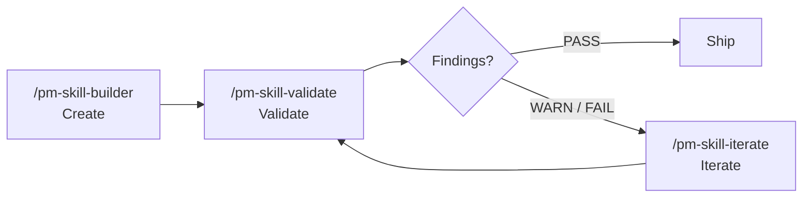

<!-- DRAFT README v3: Comprehensive but Polished. Target ~430 lines vs current 1,248.
     Approach: Keep the existing structural skeleton (hero, big idea, getting started, skills, workflows, status, contributing, FAQ, about). Tighten every section by 50-70% through better prose, better tables, and removing redundancy. Preserve the rich content that the existing README earns: the comparison vs MCP, the platform compatibility matrix, the lifecycle-tools narrative, the FAQ, the framework attributions. Platform install section: show 3 inline paths (Claude Code plugin, skills CLI, Git clone), link to a secondary doc for the rest. Previous-release blocks and roadmap/milestones move out (link to CHANGELOG and backlog docs). -->

<a id="readme-top"></a>

<h1 align="center">PM-Skills</h1>

<h4 align="center">A curated library of 40 plug-and-play product management skills for AI agents. Production-ready PRDs, hypotheses, OKRs, opportunity trees, retros, and 35 more, each shipping with templates, worked examples, and slash commands.</h4>

<p align="center">
  <a href="https://github.com/product-on-purpose/pm-skills/issues/new?labels=bug">Report a Bug</a> ·
  <a href="https://github.com/product-on-purpose/pm-skills/issues/new?labels=enhancement">Request a Feature</a> ·
  <a href="https://github.com/product-on-purpose/pm-skills/discussions">Ask a Question</a>
</p>

<p align="center">
  
  
  
  
  <a href="LICENSE"></a>
  <a href="CONTRIBUTING.md"></a>
</p>

<p align="center">
  <a href="https://github.com/product-on-purpose/pm-skills-mcp">
    
  </a>
</p>

<p align="center">
  <a href="#the-big-idea">About</a> •
  <a href="#getting-started">Getting Started</a> •
  <a href="#skills">Skills</a> •
  <a href="#workflows">Workflows</a> •
  <a href="#project-status">Status</a> •
  <a href="#contributing">Contributing</a> •
  <a href="#faq">FAQ</a>
</p>

---

## The Big Idea

**Stop prompt-fumbling. Start shipping.** Every time you ask an AI to help with product management, you start from zero. Generic responses. Inconsistent formats. Missing critical sections. Hours lost to repetitive prompt crafting.

PM-Skills changes that. It is a curated library of 40 best-practice skills, each one a specialized capability your agent can invoke on demand. The agent reads the skill's instructions, mirrors a worked example, follows a structured template, and produces a professional artifact in the format your team expects.

```
You: "Create a PRD for our new search feature"

AI + PM-Skills: Generates a comprehensive PRD with problem statement,
                success metrics, user stories, scope definition, and
                technical considerations - all in professional format.
```

| Without PM-Skills | With PM-Skills |
|---|---|
| Generic AI responses | Battle-tested PM frameworks |
| Inconsistent formats across artifacts | Production-ready templates |
| Missing critical sections | Comprehensive coverage |
| Prompt-engineering every time | One command, instant output |
| Tribal knowledge in your head | Institutional knowledge in your repo |

### Skill Lifecycle Tools

Three utility skills form a complete **Create > Validate > Iterate** loop for managing the library itself:



| Tool | Command | What it does |
|---|---|---|
| **Builder** | `/pm-skill-builder` | Creates a new skill from an idea: gap analysis, classification, draft files, promote on confirmation |
| **Validator** | `/pm-skill-validate` | Audits a skill against repo conventions; produces a severity-graded report |
| **Iterator** | `/pm-skill-iterate` | Applies fixes from feedback or validation report; previews changes; suggests version bump |

Skills are living artifacts. The builder creates them, the validator catches drift, and the iterator applies improvements. Together they keep the library consistent as it grows. See [PM-Skill Lifecycle](docs/guides/pm-skill-lifecycle.md) for the full workflow pattern.

### Built on open foundations

| Foundation | What it gives us |
|---|---|
| [Agent Skills Specification](https://agentskills.io/specification) | Open standard for AI-agent skills; works across the ecosystem |
| [Triple Diamond Framework](https://medium.com/zendesk-creative-blog/the-zendesk-triple-diamond-process-fd857a11c179) | Six-phase product development methodology (extends Design Council's Double Diamond) |
| [Teresa Torres' Opportunity Solution Trees](https://www.producttalk.org/opportunity-solution-tree/) | Outcome-driven discovery framework |
| [Jobs to be Done](https://jtbd.info/) | Customer-motivation framework |
| [Architecture Decision Records](https://adr.github.io/) (Michael Nygard format) | Technical decision documentation |
| [Keep a Changelog](https://keepachangelog.com/) | Structured release documentation |

### Works across the AI ecosystem

| Platform | Status | Method |
|---|---|---|
| **Claude Code** | Native | Plugin marketplace, skills CLI, or sync helper |
| **Claude.ai / Desktop** | Native | ZIP upload to Project Files |
| **GitHub Copilot** | Native | AGENTS.md auto-discovery |
| **Cursor / Windsurf** | Native | AGENTS.md auto-discovery; MCP optional |
| **VS Code** | Native | Cline, Continue, or other extensions |
| **OpenCode** | Native | Direct skill loading |
| **Any MCP client** | Universal | [pm-skills-mcp](https://github.com/product-on-purpose/pm-skills-mcp) (maintenance mode) |
| **ChatGPT / Codex** | Manual | Copy skill content into prompt |

Per-platform setup instructions: see [docs/getting-started/platforms.md](docs/getting-started/platforms.md).

### pm-skills vs pm-skills-mcp

PM-Skills ships in two complementary forms:

|  | pm-skills (this repo) | [pm-skills-mcp](https://github.com/product-on-purpose/pm-skills-mcp) |
|---|---|---|
| **Format** | Skill library as markdown files | MCP server wrapping the library |
| **Setup** | `npx skills add ...` or git clone, 2-5 min | `npx pm-skills-mcp`, 30 seconds |
| **Invocation** | Slash commands or AGENTS.md | MCP tool calls |
| **Updates** | `git pull` (active maintenance) | Maintenance mode (security + critical bug fixes) |
| **Catalog** | Live, all 40 skills, growing | Frozen at v2.9.2 build (40 skills, 11 workflow tools, 8 utility tools) |

> **MCP server entered [maintenance mode](docs/guides/mcp-integration.md) on 2026-05-04.** New users are best served by the file-based install. The MCP server remains available for clients that need the protocol; the catalog is frozen at the v2.9.2 build.

**Use this repo when** you want slash commands in Claude Code, want to read or fork the skills directly, use Copilot/Cursor/Windsurf with AGENTS.md, or want to customize for your team.

**Use the MCP server when** your tooling specifically requires the MCP protocol or your team has already adopted the v2.9.x line.

See the [Ecosystem Overview](docs/reference/ecosystem.md) for the detailed comparison.

<p align="right">(<a href="#readme-top">back to top</a>)</p>

---

## Getting Started

**Pick the path that matches your tool.** Most users want path 1 or 2.

### Path 1: Claude Code plugin (recommended for Claude Code)

Run inside Claude Code:

```
/plugin marketplace add product-on-purpose/pm-skills
/plugin install pm-skills@pm-skills-marketplace
```

After install, all 40 skills resolve from any directory. Slash commands like `/prd`, `/opportunity-tree`, `/agenda`, `/okr-writer` work out of the box. Verify with `/plugin list`.

### Path 2: skills CLI (works across most agents)

```bash
npx skills add product-on-purpose/pm-skills
```

Installs all 40 skills into your agent's default skills directory. Works with Claude Code, Cursor, GitHub Copilot, Cline, and any agent supported by the open [`skills` CLI](https://github.com/vercel-labs/skills). No clone, no sync.

### Path 3: Git clone (forkers, contributors, AGENTS.md auto-discovery)

```bash
git clone https://github.com/product-on-purpose/pm-skills.git
cd pm-skills
```

Cursor, Windsurf, and GitHub Copilot auto-discover skills via `AGENTS.md` once the repo is in your workspace. For openskills-style discovery (`.claude/skills/`), run `./scripts/sync-claude.sh` (Bash) or `.\scripts\sync-claude.ps1` (PowerShell) after clone.

### Other platforms

For Claude.ai, Claude Desktop, MCP clients, OpenCode, VS Code (Cline/Continue), or ChatGPT, see the full setup guide:

> **[docs/getting-started/platforms.md](docs/getting-started/platforms.md)** has step-by-step instructions for every supported platform, including ZIP-upload flows, MCP configuration JSON, manual copy patterns for unsupported tools, and platform-specific tips.

For a longer-form walkthrough, see [docs/getting-started/](docs/getting-started/index.md).

### Releases

| Item | Where |
|---|---|
| Latest stable | [`v2.13.1`](https://github.com/product-on-purpose/pm-skills/releases/tag/v2.13.1) (Plugin Install Path Correction) |
| Release ZIP | [`pm-skills-v2.13.1.zip`](https://github.com/product-on-purpose/pm-skills/releases/latest) (complete package; includes `QUICKSTART.md`) |
| Full changelog | [CHANGELOG.md](CHANGELOG.md) |
| Per-release notes | [docs/releases/](docs/releases/) |
| Documentation site | [product-on-purpose.github.io/pm-skills](https://product-on-purpose.github.io/pm-skills/) |

<p align="right">(<a href="#readme-top">back to top</a>)</p>

---

## Usage

### How skills work

Each skill is a self-contained directory with three files plus a slash command:

```
skills/deliver-prd/
├── SKILL.md                      <- agent instructions
├── references/
│   ├── TEMPLATE.md               <- output shape
│   └── EXAMPLE.md                <- worked example, ~200-400 lines
commands/prd.md                   <- /prd slash command
```

When you invoke a skill, the agent reads `SKILL.md` to learn what to do, mirrors `EXAMPLE.md` for the quality bar, and produces output in the shape of `TEMPLATE.md`. The slash command is a thin wrapper that hands the user's prompt to the skill.

For 126 real outputs across three fictional product narratives (Storevine, Brainshelf, Workbench), browse [`library/skill-output-samples/`](library/skill-output-samples/) and its [README index](library/skill-output-samples/README_SAMPLES.md). Each sample shows the prompt the PM typed, the artifact the skill produced, and source notes citing real public references.

### Skills

40 skills across 8 categories, organized by Triple Diamond phase:

| Phase | Description | Skills |
|---|---|---|
| **Foundation** | Cross-cutting capabilities used across phases | persona, lean-canvas, okr-writer, meeting-agenda, meeting-brief, meeting-recap, meeting-synthesize, stakeholder-update |
| **Discover** | Find the right problem | competitive-analysis, interview-synthesis, stakeholder-summary |
| **Define** | Frame the problem | problem-statement, hypothesis, opportunity-tree, jtbd-canvas |
| **Develop** | Explore solutions | solution-brief, spike-summary, adr, design-rationale |
| **Deliver** | Ship it | prd, user-stories, edge-cases, acceptance-criteria, launch-checklist, release-notes |
| **Measure** | Validate with data | experiment-design, instrumentation-spec, dashboard-requirements, experiment-results, okr-grader |
| **Iterate** | Learn and improve | retrospective, lessons-log, refinement-notes, pivot-decision |
| **Utility** | Meta-tooling for the library itself | pm-skill-builder, pm-skill-validate, pm-skill-iterate, mermaid-diagrams, slideshow-creator, update-pm-skills |

For per-skill descriptions, slash commands, and sample outputs, see [docs/skills/](docs/skills/) or browse the directory directly at [`skills/`](skills/).

### Quick examples

```
/prd "A focus-mode feature for our task app"
/hypothesis "One-page checkout will lift conversion from 2.1% to 3%"
/opportunity-tree "Reduce 30-day churn from 22% to 14%"
/okr-writer "Q3 OKRs for the consumer team's growth pillar"
/agenda "Cross-functional kickoff: search v2, 60 min"
/retrospective "Sprint 12, design hand-off issues, 5 attendees"
```

Every command produces a structured, hand-off-ready artifact. The full output for any of the above is the kind of thing you'd send to engineering, paste into a Notion doc, or share in a stakeholder review without further editing.

### Workflows

9 multi-skill workflows orchestrate skills end-to-end:

| Workflow | What it does | Slash command |
|---|---|---|
| Feature Kickoff | problem to hypothesis to PRD to stories | `/workflow-feature-kickoff` |
| Customer Discovery | research to JTBD to opportunities to problem | `/workflow-customer-discovery` |
| Sprint Planning | refinement to stories to edge cases | `/workflow-sprint-planning` |
| Product Strategy | competitive analysis to stakeholders to opportunities to solution to ADR | `/workflow-product-strategy` |
| Post-Launch Learning | instrumentation to dashboard to results to retro to lessons | `/workflow-post-launch-learning` |
| Stakeholder Alignment | stakeholders to problem to solution to launch | `/workflow-stakeholder-alignment` |
| Technical Discovery | spike to ADR to design rationale | `/workflow-technical-discovery` |
| Lean Startup | hypothesis to experiment to results to pivot/persevere | (see [`_workflows/lean-startup.md`](_workflows/lean-startup.md)) |
| Triple Diamond | full six-phase product cycle | (see [`_workflows/triple-diamond.md`](_workflows/triple-diamond.md)) |

```
/workflow-feature-kickoff "Recurring tasks for the consumer app"
```

Each workflow chains skills with intermediate artifacts; outputs from one feed inputs to the next. See [docs/workflows/](docs/workflows/) for each workflow's step list and worked example.

<p align="right">(<a href="#readme-top">back to top</a>)</p>

---

## Project Status

| Item | State |
|---|---|
| Latest stable | [`v2.13.1`](https://github.com/product-on-purpose/pm-skills/releases/tag/v2.13.1) (Plugin Install Path Correction) |
| Skills | 40 (26 phase + 8 foundation + 6 utility) |
| Workflows | 9 |
| Slash commands | 47 |
| Library samples | 126 |
| CI validators | 23 (11 enforcing, 12 advisory) |
| MCP server | [pm-skills-mcp](https://github.com/product-on-purpose/pm-skills-mcp) v2.9.x maintenance line |
| Documentation site | [product-on-purpose.github.io/pm-skills](https://product-on-purpose.github.io/pm-skills/) |

### Project structure

```
pm-skills/
├── skills/                     # 40 PM skills (26 phase + 8 foundation + 6 utility)
├── commands/                   # Slash commands (47) mapping to skills/workflows
├── _workflows/                 # 9 multi-skill workflows
├── library/skill-output-samples/  # 126 worked-example artifacts across 3 product narratives
├── scripts/                    # Build, sync, lint, and validation scripts (.sh + .ps1 + .md)
├── docs/                       # Public documentation, guides, reference
├── .claude-plugin/             # Plugin manifest + marketplace registration
├── AGENTS.md                   # Universal agent discovery file
├── CONTRIBUTING.md             # Contributor guide
└── CHANGELOG.md                # Version history
```

See [docs/reference/project-structure.md](docs/reference/project-structure.md) for full descriptions.

### Roadmap

Active roadmap, backlog, and feature requests live in [docs/internal/backlog-canonical.md](docs/internal/backlog-canonical.md). Top recurring asks: more skills, deeper Cursor / Windsurf integration patterns, sample-automation tooling, and the doc-stack migration tracked in v2.14.0.

### Previous releases

For per-release narratives, browse [docs/releases/](docs/releases/) or the [Releases page](https://github.com/product-on-purpose/pm-skills/releases). For the dated, structured changelog, see [CHANGELOG.md](CHANGELOG.md).

<p align="right">(<a href="#readme-top">back to top</a>)</p>

---

## Contributing

PRs welcome. Quickstart for contributors:

1. Fork, branch.
2. Make your change. For new skills, run `/pm-skill-builder` to scaffold; for edits, work in `skills/{phase-skill}/` directly.
3. Run local CI: `bash scripts/lint-skills-frontmatter.sh && bash scripts/validate-plugin-install.sh && bash scripts/validate-commands.sh`.
4. Open a PR.

For larger work (multi-skill changes, new workflows, infrastructure), see [docs/internal/efforts/README.md](docs/internal/efforts/README.md) for the effort-tracking system.

Bug reports: [open an issue](https://github.com/product-on-purpose/pm-skills/issues/new?labels=bug). Ideas and questions: [discussions](https://github.com/product-on-purpose/pm-skills/discussions). Full contributor guide: [CONTRIBUTING.md](CONTRIBUTING.md).

<p align="right">(<a href="#readme-top">back to top</a>)</p>

---

## FAQ

<details>
<summary><strong>Do I need Claude Code to use PM-Skills?</strong></summary>

No. PM-Skills works with Cursor, GitHub Copilot, Windsurf, OpenCode, Claude.ai, Claude Desktop, and any MCP client. Slash-command UX is best in Claude Code, but the markdown skills work everywhere. See [docs/getting-started/platforms.md](docs/getting-started/platforms.md) for per-platform setup.
</details>

<details>
<summary><strong>Can I fork and customize skills for my team?</strong></summary>

Yes. The Apache 2.0 license covers commercial and personal use. The whole library is markdown; edit any `SKILL.md` to change behavior, swap the template, or rewrite the worked example. Fork the repo to layer team-specific conventions.
</details>

<details>
<summary><strong>How do I add a new skill?</strong></summary>

Run `/pm-skill-builder "describe your skill"`. It runs gap analysis against existing skills, classifies the new one (phase / foundation / utility), and generates draft files for review. Then `/pm-skill-validate` checks repo conventions before merge. For the manual path, see [docs/guides/creating-pm-skills.md](docs/guides/creating-pm-skills.md).
</details>

<details>
<summary><strong>What is Triple Diamond and why use it?</strong></summary>

Six product phases (Discover > Define > Develop > Deliver > Measure > Iterate) extending the Design Council's Double Diamond with separate Measure and Iterate phases reflecting how product teams actually validate and learn. Each phase has 3 to 6 skills. See [docs/concepts/triple-diamond-delivery-process.md](docs/concepts/triple-diamond-delivery-process.md) for the full framing.
</details>

<details>
<summary><strong>Where can I see the skills in action?</strong></summary>

[`library/skill-output-samples/`](library/skill-output-samples/) has 126 worked examples across three fictional product narratives:

- **Storevine**: B2B ecommerce platform building Campaigns (email/SMS re-engagement)
- **Brainshelf**: consumer PKM app building Resurface (contextual morning digest)
- **Workbench**: enterprise collaboration platform building Blueprints (governed doc templates)

Each sample shows the prompt, the artifact, and source notes citing real public references. Browse the [README index](library/skill-output-samples/README_SAMPLES.md).
</details>

<details>
<summary><strong>What is the MCP server, and should I use it?</strong></summary>

[pm-skills-mcp](https://github.com/product-on-purpose/pm-skills-mcp) is an MCP server that wraps the skill library so MCP clients can call skills as protocol tools. It entered [maintenance mode](docs/guides/mcp-integration.md) on 2026-05-04; the catalog is frozen at the v2.9.2 build (40 skills + 11 workflow tools + 8 utility tools = 59 tools). Use the MCP server only if your tooling specifically requires the protocol. Otherwise, the file-based install in this repo is the recommended path.
</details>

<details>
<summary><strong>How is this different from a generic prompt library?</strong></summary>

Three differences. (1) **Templates are output-shape contracts**, not prompt suggestions; the agent fills the template and you get a deterministic structure. (2) **Worked examples set the quality bar**, so output quality stays high across uses. (3) **Workflows chain skills end-to-end** with intermediate artifacts; you go from problem to PRD without losing context between steps. Generic prompt libraries are decoupled prompts; PM-Skills is a coherent toolkit for the full PM lifecycle.
</details>

<p align="right">(<a href="#readme-top">back to top</a>)</p>

---

## License

[Apache 2.0](LICENSE). Free for commercial and personal use, with attribution.

## About

Built and maintained by [@jprisant](https://github.com/jprisant) at [product-on-purpose](https://github.com/product-on-purpose). PM-Skills is part learning vehicle for AI + PM exploration, part working library; expect frequent iteration. Contributions, forks, and use cases are all welcome.

## Community

- **Discussions**: [github.com/product-on-purpose/pm-skills/discussions](https://github.com/product-on-purpose/pm-skills/discussions)
- **Issues**: [github.com/product-on-purpose/pm-skills/issues](https://github.com/product-on-purpose/pm-skills/issues)
- **Releases**: [github.com/product-on-purpose/pm-skills/releases](https://github.com/product-on-purpose/pm-skills/releases)
- **Docs site**: [product-on-purpose.github.io/pm-skills](https://product-on-purpose.github.io/pm-skills/)

<p align="right">(<a href="#readme-top">back to top</a>)</p>
