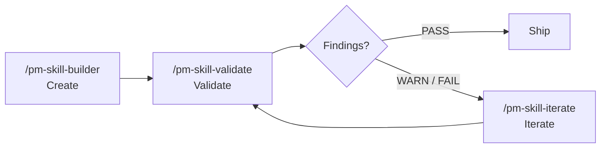

<!-- DRAFT README v4: Story-driven Polish with Reference Cards. Target ~430 lines vs current 1,248.
     Approach: Same level of substance as v3 but reorganized around a different narrative arc. Lead with a concrete "what does running a skill look like" example, not a problem-statement. Treat each section as a self-contained reference card with its own clear job (Quick Start, What's in the Library, How It Works, Comparison, FAQ). Slightly more confident voice. Same platform-install treatment as v3: 3 inline + link to secondary doc. Same trim of historical content (releases, roadmap, milestones moved to existing canonical files). -->

<a id="readme-top"></a>

<h1 align="center">PM-Skills</h1>

<p align="center">
  <strong>40 production-ready product management skills your AI agent can run today.</strong><br>
  PRDs, OKRs, hypotheses, opportunity trees, retros, and 35 more <br>
  each with a template, a worked example, and a slash command.
</p>

<p align="center">
  
  
  
  
  <a href="LICENSE"></a>
  <a href="CONTRIBUTING.md"></a>
</p>

<p align="center">
  <a href="#what-running-a-skill-looks-like">See it work</a> •
  <a href="#install">Install</a> •
  <a href="#the-library">The Library</a> •
  <a href="#workflows">Workflows</a> •
  <a href="#under-the-hood">Under the Hood</a> •
  <a href="#faq">FAQ</a>
</p>

---

## What running a skill looks like

```
PM (in Claude Code): /prd "A focus-mode feature for our task app"

Agent: [reads skills/deliver-prd/SKILL.md]
       [mirrors quality bar from references/EXAMPLE.md]
       [follows references/TEMPLATE.md structure]

Output: A complete Product Requirements Document with
        - Problem statement and user impact
        - Success metrics (leading + lagging)
        - User stories with acceptance criteria
        - Scope (in / out / future)
        - Technical considerations and dependencies
        - Open questions for engineering review
```

The agent already knows what a good PRD looks like, because it's reading the same battle-tested template you would. No prompt engineering. No "remember to include the user stories section." No starting from zero.

Every skill works this way: a markdown file the agent reads, a template it follows, a worked example it mirrors. 40 skills total, covering the full Triple Diamond product cycle from discovery through iteration.

---

## Install

Three install paths cover most users. Pick the one that matches your tool.

### Claude Code (recommended path: plugin marketplace)

Run inside Claude Code:

```
/plugin marketplace add product-on-purpose/pm-skills
/plugin install pm-skills@pm-skills-marketplace
```

All 40 skills resolve from any directory. Slash commands like `/prd`, `/opportunity-tree`, `/okr-writer`, `/agenda` work immediately. Verify with `/plugin list`.

### Cross-agent (skills CLI)

Works with Cursor, GitHub Copilot, Cline, and any agent supported by the open [`skills` CLI](https://github.com/vercel-labs/skills):

```bash
npx skills add product-on-purpose/pm-skills
```

Installs to your agent's default skills directory. No clone, no sync.

### Forkers and contributors (Git clone)

```bash
git clone https://github.com/product-on-purpose/pm-skills.git
cd pm-skills
```

Cursor, Windsurf, and GitHub Copilot auto-discover via `AGENTS.md` once the repo is in your workspace. For openskills-style discovery (`.claude/skills/`), run `./scripts/sync-claude.sh` (Bash) or `.\scripts\sync-claude.ps1` (PowerShell).

### Other platforms

For Claude.ai, Claude Desktop, MCP clients, OpenCode, VS Code (Cline / Continue), or ChatGPT, see the full setup guide:

> **[docs/getting-started/platforms.md](docs/getting-started/platforms.md)** has step-by-step instructions for every supported platform: ZIP-upload flows, MCP configuration JSON, manual copy patterns for unsupported tools, and platform-specific tips.

For a longer-form walkthrough, see [docs/getting-started/](docs/getting-started/index.md).

<p align="right">(<a href="#readme-top">back to top</a>)</p>

---

## The Library

40 skills across 8 categories, organized by Triple Diamond phase.

| Phase | What this phase is for | Skills |
|---|---|---|
| **Foundation** | Cross-cutting capabilities used across phases | persona, lean-canvas, okr-writer, meeting-agenda, meeting-brief, meeting-recap, meeting-synthesize, stakeholder-update |
| **Discover** | Find the right problem worth solving | competitive-analysis, interview-synthesis, stakeholder-summary |
| **Define** | Frame the problem with sharp success criteria | problem-statement, hypothesis, opportunity-tree, jtbd-canvas |
| **Develop** | Explore solutions; document architectural decisions | solution-brief, spike-summary, adr, design-rationale |
| **Deliver** | Specify the work; ship it | prd, user-stories, edge-cases, acceptance-criteria, launch-checklist, release-notes |
| **Measure** | Validate with data; close the loop | experiment-design, instrumentation-spec, dashboard-requirements, experiment-results, okr-grader |
| **Iterate** | Learn and improve | retrospective, lessons-log, refinement-notes, pivot-decision |
| **Utility** | Meta-tooling for the library itself | pm-skill-builder, pm-skill-validate, pm-skill-iterate, mermaid-diagrams, slideshow-creator, update-pm-skills |

For per-skill descriptions, slash commands, and sample outputs, see [docs/skills/](docs/skills/) or browse [`skills/`](skills/) directly.

### Sample outputs

Want to see what these skills actually produce? Browse [`library/skill-output-samples/`](library/skill-output-samples/), which has 126 worked examples across three fictional product narratives:

- **Storevine**: B2B ecommerce platform building Campaigns (email/SMS re-engagement). 70-person Series A.
- **Brainshelf**: consumer PKM app building Resurface (contextual morning digest). 20-person post-seed.
- **Workbench**: enterprise collaboration platform building Blueprints (governed doc templates). 200-person Series B.

Each sample shows the prompt the PM typed, the artifact the skill produced, and source notes citing real public references. Browse the [sample index](library/skill-output-samples/README_SAMPLES.md).

### Slash command snapshot

```
/prd "A focus-mode feature for our task app"
/hypothesis "One-page checkout will lift conversion from 2.1% to 3%"
/opportunity-tree "Reduce 30-day churn from 22% to 14%"
/okr-writer "Q3 OKRs for the consumer team's growth pillar"
/agenda "Cross-functional kickoff: search v2, 60 min"
/retrospective "Sprint 12, design hand-off issues, 5 attendees"
```

Every command produces a structured artifact ready for engineering hand-off, stakeholder review, or paste-into-Notion. Quality is calibrated to the worked examples in `references/EXAMPLE.md`.

<p align="right">(<a href="#readme-top">back to top</a>)</p>

---

## Workflows

9 multi-skill workflows chain skills end-to-end with intermediate artifacts:

| Workflow | What it does | Slash command |
|---|---|---|
| Feature Kickoff | problem to hypothesis to PRD to stories | `/workflow-feature-kickoff` |
| Customer Discovery | research to JTBD to opportunities to problem | `/workflow-customer-discovery` |
| Sprint Planning | refinement to stories to edge cases | `/workflow-sprint-planning` |
| Product Strategy | competitive analysis to stakeholders to opportunities to solution to ADR | `/workflow-product-strategy` |
| Post-Launch Learning | instrumentation to dashboard to results to retro to lessons | `/workflow-post-launch-learning` |
| Stakeholder Alignment | stakeholders to problem to solution to launch | `/workflow-stakeholder-alignment` |
| Technical Discovery | spike to ADR to design rationale | `/workflow-technical-discovery` |
| Lean Startup | hypothesis to experiment to results to pivot/persevere | (see [`_workflows/lean-startup.md`](_workflows/lean-startup.md)) |
| Triple Diamond | full six-phase product cycle | (see [`_workflows/triple-diamond.md`](_workflows/triple-diamond.md)) |

```
/workflow-feature-kickoff "Recurring tasks for the consumer app"
```

Outputs from one skill feed inputs to the next, so you go from a fuzzy idea to engineering-ready stories without losing context between steps. See [docs/workflows/](docs/workflows/) for each workflow's step list and worked example.

<p align="right">(<a href="#readme-top">back to top</a>)</p>

---

## Under the Hood

### Anatomy of a skill

```
skills/deliver-prd/
├── SKILL.md                      <- agent instructions
├── references/
│   ├── TEMPLATE.md               <- output shape
│   └── EXAMPLE.md                <- worked example, ~200-400 lines
commands/prd.md                   <- /prd slash command
```

`SKILL.md` tells the agent what to do (analyze the prompt, produce a PRD). `TEMPLATE.md` defines the output shape (which sections, in which order). `EXAMPLE.md` sets the quality bar with a complete worked artifact. The slash command is a thin wrapper that hands the user's prompt to the skill.

### Skill lifecycle: Create > Validate > Iterate

Three utility skills form a complete loop for managing the library itself:



| Tool | Command | What it does |
|---|---|---|
| **Builder** | `/pm-skill-builder` | Creates a new skill from an idea: gap analysis, classification, draft files, promote on confirmation |
| **Validator** | `/pm-skill-validate` | Audits a skill against repo conventions; produces a severity-graded report |
| **Iterator** | `/pm-skill-iterate` | Applies fixes from feedback or validation report; previews changes; suggests version bump |

Skills are living artifacts. The builder creates them, the validator catches drift, the iterator applies improvements. See [PM-Skill Lifecycle](docs/guides/pm-skill-lifecycle.md) for the full pattern.

### Built on open foundations

| Foundation | What it gives us |
|---|---|
| [Agent Skills Specification](https://agentskills.io/specification) | Open standard for AI-agent skills; works across the ecosystem |
| [Triple Diamond Framework](https://medium.com/zendesk-creative-blog/the-zendesk-triple-diamond-process-fd857a11c179) | Six-phase product methodology (extends Design Council's Double Diamond) |
| [Teresa Torres' Opportunity Solution Trees](https://www.producttalk.org/opportunity-solution-tree/) | Outcome-driven discovery |
| [Jobs to be Done](https://jtbd.info/) | Customer-motivation framework |
| [Architecture Decision Records (Nygard)](https://adr.github.io/) | Technical decision documentation |
| [Keep a Changelog](https://keepachangelog.com/) | Structured release documentation |

### Platform compatibility

| Platform | Status | Method |
|---|---|---|
| Claude Code | Native | Plugin marketplace, skills CLI, or sync helper |
| Claude.ai / Desktop | Native | ZIP upload to Project Files |
| GitHub Copilot | Native | AGENTS.md auto-discovery |
| Cursor / Windsurf | Native | AGENTS.md auto-discovery; MCP optional |
| VS Code | Native | Cline, Continue, or other extensions |
| OpenCode | Native | Direct skill loading |
| Any MCP client | Universal | [pm-skills-mcp](https://github.com/product-on-purpose/pm-skills-mcp) (maintenance mode) |
| ChatGPT / Codex | Manual | Copy skill content into prompt |

Per-platform setup: [docs/getting-started/platforms.md](docs/getting-started/platforms.md).

<p align="right">(<a href="#readme-top">back to top</a>)</p>

---

## pm-skills vs pm-skills-mcp

PM-Skills ships in two complementary forms.

|  | **pm-skills** (this repo) | **[pm-skills-mcp](https://github.com/product-on-purpose/pm-skills-mcp)** |
|---|---|---|
| Format | Skill library (markdown files) | MCP server wrapping the library |
| Setup | `npx skills add ...` or git clone, 2-5 min | `npx pm-skills-mcp`, 30 seconds |
| Invocation | Slash commands or AGENTS.md | MCP tool calls |
| Updates | `git pull` (active maintenance) | Maintenance mode (security + critical bug fixes only) |
| Catalog | Live, all 40 skills, growing | Frozen at v2.9.2 build (40 skills + 11 workflow tools + 8 utility tools) |

> **MCP server is in [maintenance mode](docs/guides/mcp-integration.md) as of 2026-05-04.** New users are best served by the file-based install. The MCP server remains available; the catalog is frozen at the v2.9.2 build.

**Use this repo** for slash commands in Claude Code, customizing skills, AGENTS.md auto-discovery in Cursor/Copilot/Windsurf, or forking for your team.

**Use the MCP server** if your tooling specifically requires the protocol or your team has already adopted the v2.9.x line.

See the [Ecosystem Overview](docs/reference/ecosystem.md) for the detailed comparison.

<p align="right">(<a href="#readme-top">back to top</a>)</p>

---

## Project Status

| Item | State |
|---|---|
| Latest stable | [`v2.13.1`](https://github.com/product-on-purpose/pm-skills/releases/tag/v2.13.1) (Plugin Install Path Correction) |
| Skills | 40 (26 phase + 8 foundation + 6 utility) |
| Workflows | 9 |
| Slash commands | 47 |
| Library samples | 126 |
| CI validators | 23 (11 enforcing, 12 advisory) |
| Documentation site | [product-on-purpose.github.io/pm-skills](https://product-on-purpose.github.io/pm-skills/) |

For the full version history see [CHANGELOG.md](CHANGELOG.md). For per-release narratives see [docs/releases/](docs/releases/). For roadmap and backlog see [docs/internal/backlog-canonical.md](docs/internal/backlog-canonical.md).

### Project structure

```
pm-skills/
├── skills/                     # 40 PM skills (26 phase + 8 foundation + 6 utility)
├── commands/                   # 47 slash commands
├── _workflows/                 # 9 multi-skill workflows
├── library/skill-output-samples/  # 126 worked-example artifacts
├── scripts/                    # Build, sync, lint, validation (.sh + .ps1 + .md)
├── docs/                       # Public documentation, guides, reference
├── .claude-plugin/             # Plugin manifest + marketplace registration
├── AGENTS.md                   # Universal agent discovery file
└── CHANGELOG.md                # Version history
```

See [docs/reference/project-structure.md](docs/reference/project-structure.md) for full descriptions.

<p align="right">(<a href="#readme-top">back to top</a>)</p>

---

## Contributing

PRs welcome. Quickstart for contributors:

1. Fork, branch.
2. Make your change. For new skills, run `/pm-skill-builder` to scaffold; for edits, work in `skills/{phase-skill}/` directly.
3. Run local CI: `bash scripts/lint-skills-frontmatter.sh && bash scripts/validate-plugin-install.sh && bash scripts/validate-commands.sh`.
4. Open a PR.

For larger work (multi-skill changes, new workflows, infrastructure), see [docs/internal/efforts/README.md](docs/internal/efforts/README.md).

Bug reports: [open an issue](https://github.com/product-on-purpose/pm-skills/issues/new?labels=bug). Ideas and questions: [discussions](https://github.com/product-on-purpose/pm-skills/discussions). Full guide: [CONTRIBUTING.md](CONTRIBUTING.md).

<p align="right">(<a href="#readme-top">back to top</a>)</p>

---

## FAQ

<details>
<summary><strong>Do I need Claude Code?</strong></summary>

No. Cursor, GitHub Copilot, Windsurf, OpenCode, Claude.ai, Claude Desktop, and any MCP client all work. Slash-command UX is best in Claude Code, but the markdown skills work everywhere. See [docs/getting-started/platforms.md](docs/getting-started/platforms.md).
</details>

<details>
<summary><strong>Can I customize skills for my team?</strong></summary>

Yes. The Apache 2.0 license covers commercial and personal use. Edit any `SKILL.md` to change behavior, swap the template, or rewrite the worked example. Fork to layer team-specific conventions over the library.
</details>

<details>
<summary><strong>How do I add a new skill?</strong></summary>

Run `/pm-skill-builder "describe your skill"`. Gap analysis, classification, draft files for review, then `/pm-skill-validate` for convention checks. For the manual path, see [docs/guides/creating-pm-skills.md](docs/guides/creating-pm-skills.md).
</details>

<details>
<summary><strong>What is Triple Diamond?</strong></summary>

Six product phases (Discover > Define > Develop > Deliver > Measure > Iterate) extending the Design Council's Double Diamond with separate Measure and Iterate phases reflecting how product teams actually validate and learn. Each phase has 3 to 6 skills. See [docs/concepts/triple-diamond-delivery-process.md](docs/concepts/triple-diamond-delivery-process.md).
</details>

<details>
<summary><strong>How is this different from a generic prompt library?</strong></summary>

Three differences. (1) **Templates are output-shape contracts**, not prompt suggestions; the agent fills the template and you get a deterministic structure. (2) **Worked examples set the quality bar**, so output quality stays high. (3) **Workflows chain skills end-to-end** with intermediate artifacts; you go from problem to PRD without losing context. Generic prompt libraries are decoupled prompts; PM-Skills is a coherent toolkit for the full PM lifecycle.
</details>

<details>
<summary><strong>What is the MCP server, and should I use it?</strong></summary>

[pm-skills-mcp](https://github.com/product-on-purpose/pm-skills-mcp) wraps the skill library so MCP clients can call skills as protocol tools. It is in [maintenance mode](docs/guides/mcp-integration.md); the catalog is frozen at v2.9.2 (40 skills + 11 workflow tools + 8 utility tools = 59 tools). Use it only if your tooling specifically requires MCP. Otherwise, the file-based install in this repo is the recommended path.
</details>

<details>
<summary><strong>Where can I see real outputs?</strong></summary>

[`library/skill-output-samples/`](library/skill-output-samples/) has 126 worked examples across three fictional product narratives (Storevine, Brainshelf, Workbench). Each sample shows the prompt + the artifact + source notes. Browse the [README index](library/skill-output-samples/README_SAMPLES.md).
</details>

<p align="right">(<a href="#readme-top">back to top</a>)</p>

---

## License

[Apache 2.0](LICENSE). Free for commercial and personal use, with attribution.

## About

Built and maintained by [@jprisant](https://github.com/jprisant) at [product-on-purpose](https://github.com/product-on-purpose). PM-Skills is part learning vehicle for AI + PM exploration, part working library; expect frequent iteration. Contributions, forks, and use cases are all welcome.

## Community

- **Discussions**: [github.com/product-on-purpose/pm-skills/discussions](https://github.com/product-on-purpose/pm-skills/discussions)
- **Issues**: [github.com/product-on-purpose/pm-skills/issues](https://github.com/product-on-purpose/pm-skills/issues)
- **Releases**: [github.com/product-on-purpose/pm-skills/releases](https://github.com/product-on-purpose/pm-skills/releases)
- **Docs site**: [product-on-purpose.github.io/pm-skills](https://product-on-purpose.github.io/pm-skills/)

<p align="right">(<a href="#readme-top">back to top</a>)</p>
