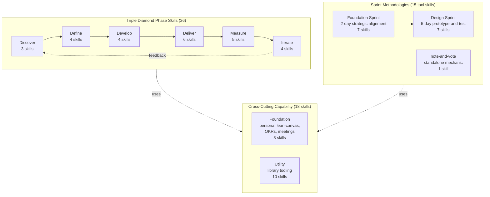
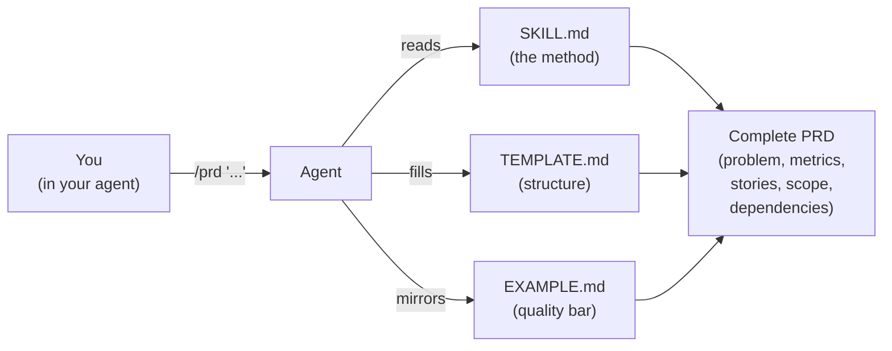
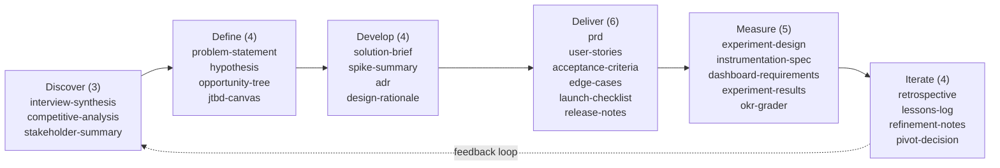
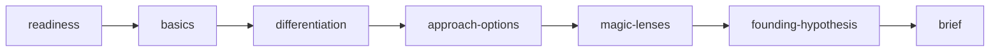
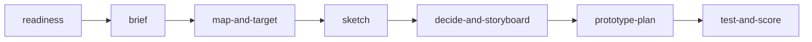
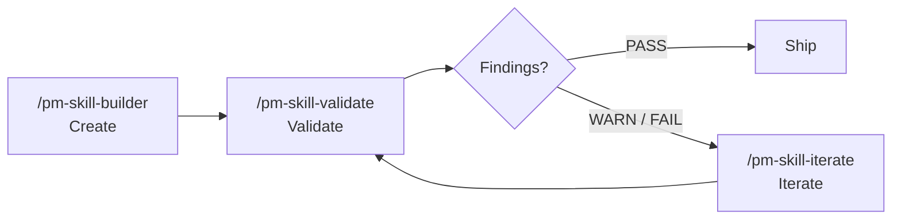
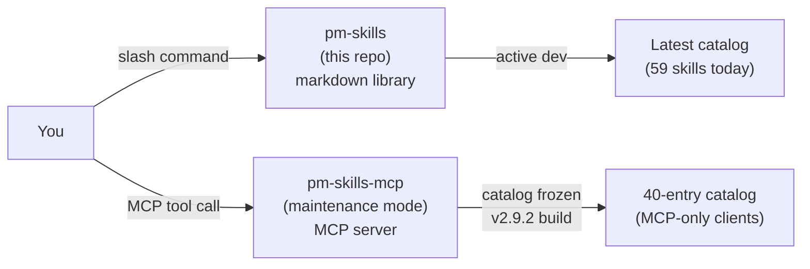

<!--
DRAFT README v11: "Visual-first / Mermaid-led". Target ~480 lines vs current 1,305.
Approach: Leads with a hero Mermaid diagram that shows the library's full shape (Triple Diamond 6-phase flow + Foundation Sprint + Design Sprint sub-graphs + foundation/utility layer underneath). Uses diagrams as primary explanation throughout; prose is caption. Library section includes mini-diagrams per chapter. Full catalog still present in tables.
Bet: A diagram that shows the library's shape teaches faster than a 4-row classification table. GitHub now renders Mermaid natively; pm-skills docs site already uses Mermaid heavily (v2.14.1 3-layer beautification). The README can lean into the visual without paying a rendering penalty.
Constraints honored:
  - MCP server notice stays at top (closed-by-default <details>).
  - Quick install near top.
  - Recent releases visible at top: human-centered What's New + collapsed release-by-release stack.
Visual elements:
  - Hero Mermaid: full library shape
  - Skill anatomy: 3-file diagram
  - Triple Diamond flow Mermaid
  - Foundation Sprint sequence Mermaid
  - Design Sprint sequence Mermaid
  - Skill lifecycle Mermaid (builder/validate/iterate loop)
  - pm-skills vs pm-skills-mcp: side-by-side flow diagram
-->

<a id="readme-top"></a>

<h1 align="center">PM-Skills</h1>

<p align="center">
  <strong>59 production-ready product management skills your AI agent can run today.</strong>
</p>

<p align="center">
  
  
  
  <a href="LICENSE"></a>
  <a href="https://github.com/product-on-purpose/pm-skills-mcp"></a>
</p>

<p align="center">
  <a href="#install">Install</a> .
  <a href="#whats-new">What's new</a> .
  <a href="#the-library-at-a-glance">Library at a glance</a> .
  <a href="#the-full-catalog">Full catalog</a> .
  <a href="#workflows">Workflows</a> .
  <a href="#how-a-skill-works">How a skill works</a>
</p>

---

## The library at a glance



**26 phase skills** run the canonical Triple Diamond product cycle. **15 tool skills** run two sprint methodologies plus a standalone group-decision mechanic. **8 foundation skills** support all of it. **10 utility skills** maintain the library itself. 59 total.

---

<details>
<summary><strong>MCP server: maintenance mode (effective 2026-05-04)</strong></summary>

The companion [`pm-skills-mcp`](https://github.com/product-on-purpose/pm-skills-mcp) server is in the v2.9.x maintenance line. The MCP catalog is frozen at the v2.9.2 build. Security patches and critical bug fixes continue; skill parity is paused.

**For new users, the file-based install paths below are the recommended path.** See [MCP Integration](docs/guides/mcp-integration.md) for status details and resumption criteria.

</details>

---

## Install

### Claude Code (recommended)

```
/plugin marketplace add product-on-purpose/pm-skills
/plugin install pm-skills@pm-skills-marketplace
```

All 59 skills and 66 commands resolve from any directory.

### Any agent supported by the open skills CLI

```bash
npx skills add product-on-purpose/pm-skills
```

<details>
<summary><strong>Other platforms (Claude.ai, MCP clients, OpenCode, Cursor, Windsurf, ChatGPT)</strong></summary>

See [docs/getting-started/platforms.md](docs/getting-started/platforms.md).

</details>

<p align="right">(<a href="#readme-top">back to top</a>)</p>

---

## What's new

### Sprint methodologies are now first-class skills (v2.15.0)

**What changed.** 15 new skills for Foundation Sprint (Knapp/Zeratsky 2-day) and Design Sprint (Knapp/Zeratsky/Kowitz 5-day), plus a standalone `note-and-vote` skill.

**Why it matters.** If you run sprints, you don't have to translate the books into prompts. The agent runs the workshop with you; outputs are workshop artifacts.

**Get started.** [`docs/concepts/foundation-sprint.md`](docs/concepts/foundation-sprint.md) . [`docs/concepts/design-sprint.md`](docs/concepts/design-sprint.md) . [`_workflows/foundation-to-design.md`](_workflows/foundation-to-design.md).

### Faster, more searchable docs site (v2.14.x)

**What changed.** Migrated from MkDocs Material to Astro Starlight. Pagefind search, native dark mode, Node 22.x build. v2.14.1 added the Mermaid style guide.

**Why it matters.** Search works (full-text, instant). Forkers: Node 22.x, not Python pip.

**Get started.** [product-on-purpose.github.io/pm-skills](https://product-on-purpose.github.io/pm-skills/).

### Active orchestration is now possible (v2.16.0)

**What changed.** First 4 active-orchestration sub-agents shipped. 6-gate pre-tag release runbook codified.

**Why it matters.** Foundation for chained workflows without human handoffs.

**Get started.** [`docs/reference/runtime-components.md`](docs/reference/runtime-components.md).

<details>
<summary><strong>Full release-by-release changelog</strong></summary>

<details open>
<summary><strong>v2.16.0 - Active Orchestration</strong></summary>

- First 4 active orchestration sub-agents shipped.
- 6-gate release runbook codified.
- Release note: [`docs/releases/Release_v2.16.0.md`](docs/releases/Release_v2.16.0.md).

</details>

<details>
<summary><strong>v2.15.0 - Sprint Skills Launch</strong></summary>

- 15 new skills (7 FS + 7 DS + 1 standalone). Catalog grows 40 to 55.
- 3 new workflows including `foundation-to-design`.
- Release note: [`docs/releases/Release_v2.15.0.md`](docs/releases/Release_v2.15.0.md).

</details>

<details>
<summary><strong>v2.14.x - Doc Stack Migration</strong></summary>

- v2.14.0: Astro Starlight ships.
- v2.14.1: title fix + Mermaid beautification + validators promoted.
- v2.14.2: cumulative docs hygiene patch.

</details>

</details>

Full history: [CHANGELOG.md](CHANGELOG.md) . [Releases](https://github.com/product-on-purpose/pm-skills/releases).

<p align="right">(<a href="#readme-top">back to top</a>)</p>

---

## How a skill works



A skill is three files in a directory:

```
skills/deliver-prd/
  SKILL.md                  # agent instructions (the canonical method)
  references/
    TEMPLATE.md             # the structure the output follows
    EXAMPLE.md              # a worked example to mirror the quality bar
```

Run `/prd "A focus-mode feature for our task app"`. The agent reads the skill, mirrors the example, fills the template, and produces a complete PRD. No prompt engineering.

Full anatomy: [docs/guides/anatomy-of-a-skill.md](docs/guides/anatomy-of-a-skill.md).

<p align="right">(<a href="#readme-top">back to top</a>)</p>

---

## The full catalog

### Triple Diamond phase skills (26)



**Discover - find the right problem (3)**

| Skill | What it does | Command |
|---|---|---|
| **interview-synthesis** | Turn user research into actionable insights | `/interview-synthesis` |
| **competitive-analysis** | Map the landscape, find opportunities | `/competitive-analysis` |
| **stakeholder-summary** | Understand who matters and what they need | `/stakeholder-summary` |

**Define - frame the problem (4)**

| Skill | What it does | Command |
|---|---|---|
| **problem-statement** | Crystal-clear problem framing | `/problem-statement` |
| **hypothesis** | Testable assumptions with success metrics | `/hypothesis` |
| **opportunity-tree** | Teresa Torres-style outcome mapping | `/opportunity-tree` |
| **jtbd-canvas** | Jobs to be Done framework | `/jtbd-canvas` |

**Develop - explore solutions (4)**

| Skill | What it does | Command |
|---|---|---|
| **solution-brief** | One-page solution pitch | `/solution-brief` |
| **spike-summary** | Document technical explorations | `/spike-summary` |
| **adr** | Architecture Decision Records (Nygard format) | `/adr` |
| **design-rationale** | Why you made that design choice | `/design-rationale` |

**Deliver - ship it (6)**

| Skill | What it does | Command |
|---|---|---|
| **prd** | Comprehensive product requirements | `/prd` |
| **user-stories** | INVEST-compliant stories with acceptance criteria | `/user-stories` |
| **acceptance-criteria** | Given/When/Then testable scenarios | `/acceptance-criteria` |
| **edge-cases** | Error states, boundaries, recovery paths | `/edge-cases` |
| **launch-checklist** | Never miss a launch step again | `/launch-checklist` |
| **release-notes** | User-facing release communication | `/release-notes` |

**Measure - validate with data (5)**

| Skill | What it does | Command |
|---|---|---|
| **experiment-design** | Rigorous A/B test planning | `/experiment-design` |
| **instrumentation-spec** | Event tracking requirements | `/instrumentation-spec` |
| **dashboard-requirements** | Analytics dashboard specs | `/dashboard-requirements` |
| **experiment-results** | Document learnings from experiments | `/experiment-results` |
| **okr-grader** | Score completed OKR sets with KR-level scoring + learning synthesis | `/okr-grader` |

**Iterate - learn and improve (4)**

| Skill | What it does | Command |
|---|---|---|
| **retrospective** | Team retros that drive action | `/retrospective` |
| **lessons-log** | Build organizational memory | `/lessons-log` |
| **refinement-notes** | Capture backlog refinement outcomes | `/refinement-notes` |
| **pivot-decision** | Evidence-based pivot/persevere framework | `/pivot-decision` |

### Foundation skills (8) - cross-cutting

| Skill | What it does | Command |
|---|---|---|
| **persona** | Generate product or marketing personas with evidence and confidence | `/persona` |
| **lean-canvas** | Capture problem, customer segment, value prop, and key metrics on one page | `/lean-canvas` |
| **okr-writer** | Draft an OKR plan with tight, measurable key results | `/okr-writer` |
| **stakeholder-update** | Compose a stakeholder-facing update from project state and recent activity | `/stakeholder-update` |
| **meeting-agenda** | Draft a focused agenda from purpose, attendees, and time-box | `/meeting-agenda` |
| **meeting-brief** | One-page brief priming attendees with context and pre-reads | `/meeting-brief` |
| **meeting-recap** | Synthesize a meeting transcript into decisions, actions, and follow-ups | `/meeting-recap` |
| **meeting-synthesize** | Cross-meeting synthesis distilling themes from multiple sessions | `/meeting-synthesize` |

### Foundation Sprint family (7) - 2-day strategic alignment



| Skill | What it does | Command |
|---|---|---|
| **foundation-sprint-readiness** | Decision tree: is your team ready for an FS? | `/foundation-sprint-readiness` |
| **foundation-sprint-basics** | Customer, problem, competition (founding 3-tuple) | `/foundation-sprint-basics` |
| **foundation-sprint-differentiation** | 2x2 of unique advantages against the competition | `/foundation-sprint-differentiation` |
| **foundation-sprint-approach-options** | Generate 3-5 high-level approaches to the problem | `/foundation-sprint-approach-options` |
| **foundation-sprint-magic-lenses** | Score approaches with 3-4 critical lenses | `/foundation-sprint-magic-lenses` |
| **foundation-sprint-founding-hypothesis** | Synthesize chosen approach into a testable founding hypothesis | `/foundation-sprint-founding-hypothesis` |
| **foundation-sprint-brief** | One-page brief capturing the full sprint output | `/foundation-sprint-brief` |

### Design Sprint family (7) - 5-day prototype-and-test



| Skill | What it does | Command |
|---|---|---|
| **design-sprint-readiness** | Decision tree: is your team ready for a DS? | `/design-sprint-readiness` |
| **design-sprint-brief** | Pre-sprint brief: long-term goal, sprint questions, target | `/design-sprint-brief` |
| **design-sprint-map-and-target** | Map of the customer journey; choose the target | `/design-sprint-map-and-target` |
| **design-sprint-sketch** | Structured 4-step individual sketch session | `/design-sprint-sketch` |
| **design-sprint-decide-and-storyboard** | Heat map, straw poll, decider vote; storyboard the winner | `/design-sprint-decide-and-storyboard` |
| **design-sprint-prototype-plan** | Plan the realistic-enough Friday prototype | `/design-sprint-prototype-plan` |
| **design-sprint-test-and-score** | Run 5 customer interviews; score patterns and decide | `/design-sprint-test-and-score` |

### Standalone tool skill (1)

| Skill | What it does | Command |
|---|---|---|
| **note-and-vote** | Group decision mechanic (silent note, vote, decider chooses) usable inside any workshop | `/note-and-vote` |

### Utility - meta-tooling (10)



| Skill | What it does | Command |
|---|---|---|
| **pm-skill-builder** | Create new PM skills with gap analysis and guided drafting | `/pm-skill-builder` |
| **pm-skill-validate** | Audit a skill against structural conventions and quality criteria | `/pm-skill-validate` |
| **pm-skill-iterate** | Apply targeted improvements from feedback or validation reports | `/pm-skill-iterate` |
| **mermaid-diagrams** | Create syntactically valid Mermaid diagrams for product documents | `/mermaid-diagrams` |
| **slideshow-creator** | Generate professional presentations from JSON deck specs | `/slideshow-creator` |
| **update-pm-skills** | Check for updates and update local pm-skills installation | `/update-pm-skills` |

Plus 4 utility skills for AGENTS.md sync and release tooling. Full source: [`skills/`](skills/). Skill map: [AGENTS.md](AGENTS.md).

<p align="right">(<a href="#readme-top">back to top</a>)</p>

---

## Workflows

12 multi-skill chains. Workflows encode handoff guidance between skills.

| Workflow | Best for | Skills chained |
|---|---|---|
| **[Foundation to Design](_workflows/foundation-to-design.md)** | End-to-end FS-to-DS arc | foundation-sprint-* + design-sprint-* |
| **[Foundation Sprint](_workflows/foundation-sprint.md)** | 2-day strategic alignment | All 7 foundation-sprint skills |
| **[Design Sprint](_workflows/design-sprint.md)** | 5-day prototype-and-test | All 7 design-sprint skills |
| **[Feature Kickoff](_workflows/feature-kickoff.md)** | New features | problem-statement, hypothesis, prd, user-stories, launch-checklist |
| **[Lean Startup](_workflows/lean-startup.md)** | Rapid validation | hypothesis, experiment-design, experiment-results, pivot-decision |
| **[Triple Diamond](_workflows/triple-diamond.md)** | Major initiatives | Full 26 phase-skill flow across 6 phases |
| **[Customer Discovery](_workflows/customer-discovery.md)** | Research synthesis | Transform raw research into a validated problem |
| **[Sprint Planning](_workflows/sprint-planning.md)** | Sprint prep | Prepare sprint-ready stories from a backlog |
| **[Product Strategy](_workflows/product-strategy.md)** | Strategic initiatives | Frame a major strategic initiative |
| **[Post-Launch Learning](_workflows/post-launch-learning.md)** | Post-launch | Measure results and capture learnings |
| **[Stakeholder Alignment](_workflows/stakeholder-alignment.md)** | Leadership buy-in | Build a case for leadership buy-in |
| **[Technical Discovery](_workflows/technical-discovery.md)** | Tech feasibility | Evaluate technical feasibility and architecture |

Full reference: [docs/reference/workflows/](docs/reference/workflows/).

<p align="right">(<a href="#readme-top">back to top</a>)</p>

---

## Built on canonical PM frameworks

| Foundation | What it gives us |
|---|---|
| [Agent Skills Specification](https://agentskills.io/specification) | Open standard for AI-agent skills |
| [Triple Diamond Framework](https://medium.com/zendesk-creative-blog/the-zendesk-triple-diamond-process-fd857a11c179) | Six-phase product cycle |
| [Foundation Sprint](https://www.jakeknapp.com/foundation-sprint) (Knapp/Zeratsky) | 2-day strategic alignment |
| [Design Sprint](https://www.thesprintbook.com/) (Knapp/Zeratsky/Kowitz) | 5-day prototype-and-test |
| [Opportunity Solution Trees](https://www.producttalk.org/opportunity-solution-tree/) (Teresa Torres) | Outcome-driven discovery |
| [Jobs to be Done](https://jtbd.info/) | Customer-motivation framework |
| [Architecture Decision Records](https://adr.github.io/) (Michael Nygard) | Technical decision documentation |
| [Keep a Changelog](https://keepachangelog.com/) | Structured release documentation |

---

## pm-skills vs pm-skills-mcp



|  | **pm-skills** (this repo) | [**pm-skills-mcp**](https://github.com/product-on-purpose/pm-skills-mcp) |
|---|---|---|
| **Format** | Markdown library | MCP server |
| **Setup** | `npx skills add ...` or git clone | `npx pm-skills-mcp` |
| **Status** | Active development | Maintenance mode |
| **Recommended for** | New users, all platforms | MCP-only clients |

See [MCP Integration](docs/guides/mcp-integration.md) for when MCP is the right choice.

---

## Project status

| | |
|---|---|
| **Current version** | [v2.16.0](https://github.com/product-on-purpose/pm-skills/releases/tag/v2.16.0) |
| **Skill count** | 59 (26 phase + 8 foundation + 10 utility + 15 tool) |
| **Spec** | [agentskills.io](https://agentskills.io/specification) |
| **License** | [Apache 2.0](LICENSE) |
| **Docs site** | [product-on-purpose.github.io/pm-skills](https://product-on-purpose.github.io/pm-skills/) |
| **MCP server** | [`pm-skills-mcp`](https://github.com/product-on-purpose/pm-skills-mcp) (maintenance mode) |
| **Changelog** | [CHANGELOG.md](CHANGELOG.md) |
| **FAQ** | [docs/reference/faq.md](docs/reference/faq.md) |
| **Contributing** | [CONTRIBUTING.md](CONTRIBUTING.md) |

---

## License

Apache 2.0. See [LICENSE](LICENSE). Built on the open [Agent Skills Specification](https://agentskills.io/specification). Sprint methods adapted from Knapp/Zeratsky/Kowitz.

<p align="right">(<a href="#readme-top">back to top</a>)</p>
