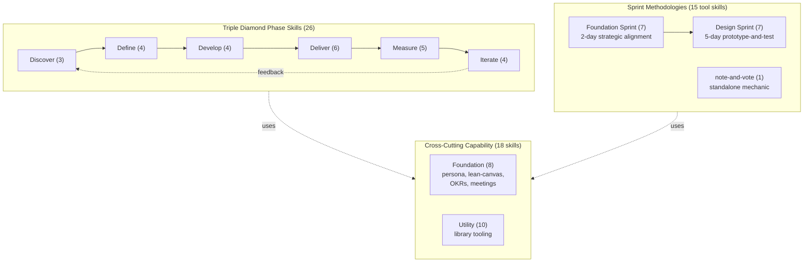
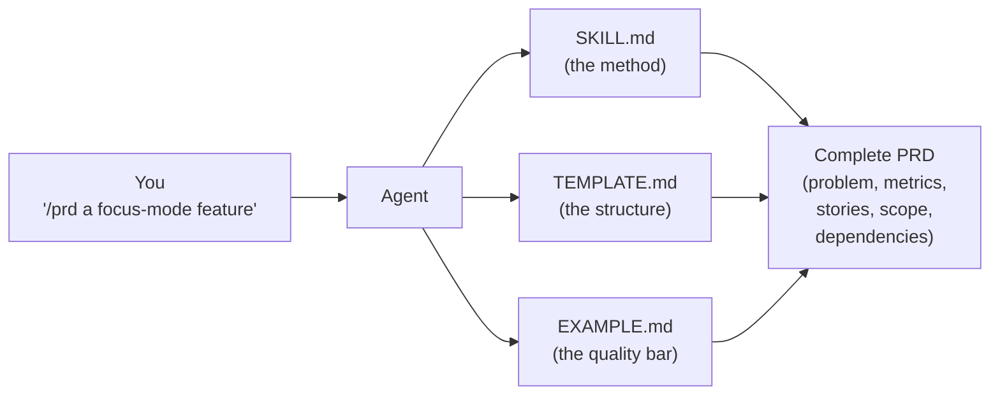
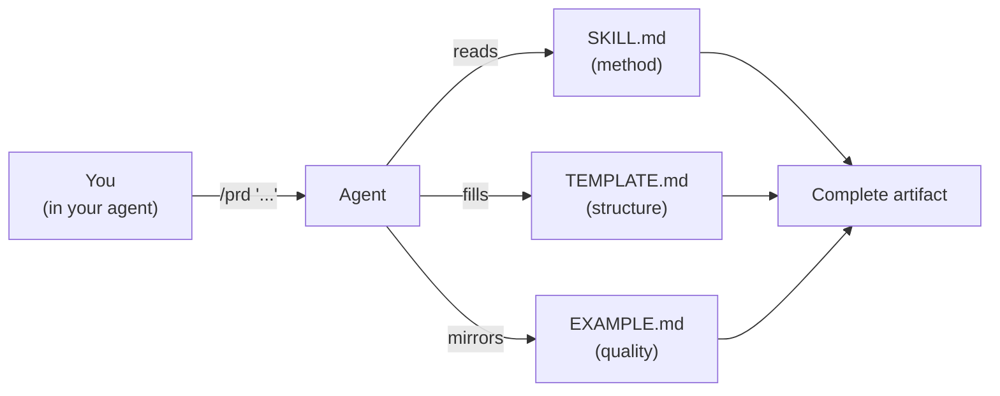
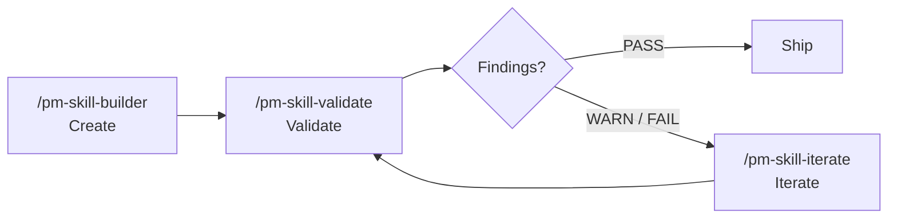
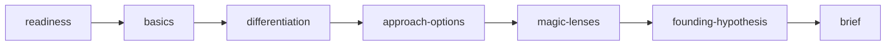
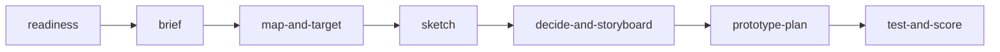
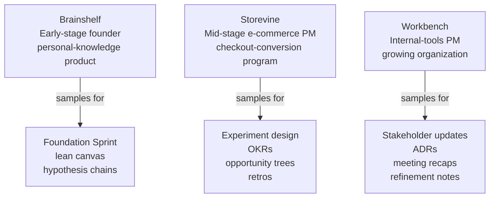
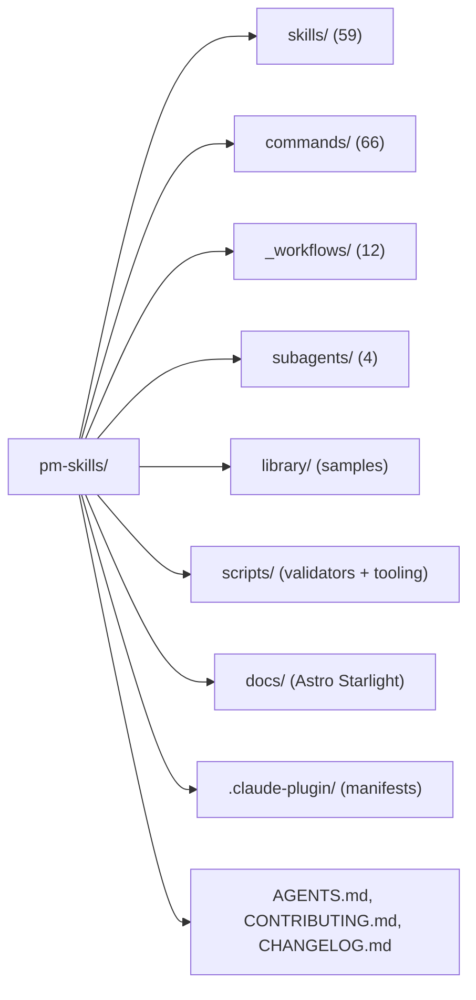

<!--
DRAFT README v13: "Structure spec + visual layer". Target ~520 lines.
Same structural spine as v12 (full structure.md spec) but with visual elements added throughout:
  - Hero library overview Mermaid (placed at the very top, before quick start)
  - Big Idea section gets the "how a skill turns a prompt into an artifact" Mermaid
  - How skills work section gets the 3-file anatomy diagram
  - The library section gets Triple Diamond Mermaid + 2 sprint sequence Mermaids
  - The Library samples section gets a "thread x phase" matrix visual
  - The Project status section gets a per-folder map
  - Skill lifecycle (Create > Validate > Iterate) loop Mermaid
This is v12 with diagrams layered on top, for readers who absorb visuals faster than prose.
-->

<a id="readme-top"></a>

<h1 align="center">PM-Skills</h1>

<p align="center">
  <strong>59 production-ready product management skills your AI agent can run today.</strong><br>
  PRDs, OKRs, hypotheses, opportunity trees, retros, Foundation Sprint, Design Sprint, and 50 more.
</p>

<p align="center">
  
  
  
  
  
  <a href="LICENSE"></a>
  <a href="https://github.com/product-on-purpose/pm-skills-mcp"></a>
</p>



<details>
<summary><strong>Table of contents</strong></summary>

- [Quick start](#quick-start)
- [MCP server maintenance notice](#mcp-server-maintenance-notice)
- [What's new](#whats-new)
- [The big idea](#the-big-idea)
- [Getting started](#getting-started)
- [How skills work](#how-skills-work)
- [The library](#the-library)
- [Library samples and worked examples](#library-samples-and-worked-examples)
- [Project status](#project-status)
- [Contributing](#contributing)
- [FAQ](#faq)
- [License](#license)

</details>

---

## Quick start

Two paths cover most users.

### Install into Claude Code (no clone required)

```
/plugin marketplace add product-on-purpose/pm-skills
/plugin install pm-skills@pm-skills-marketplace
```

Resolves all 59 skills, 66 slash commands, and 4 sub-agents from any directory. Updates: `/plugin update pm-skills`.

### Or, clone the repo

```bash
git clone https://github.com/product-on-purpose/pm-skills.git
cd pm-skills
```

Full library, samples, and source for forking or contributing. Cursor, Windsurf, Copilot auto-discover via `AGENTS.md` once the folder is open.

For Codex, Claude.ai, MCP clients, OpenCode, VS Code, ChatGPT, and other tools: see [docs/getting-started/platforms.md](docs/getting-started/platforms.md).

<p align="right">(<a href="#readme-top">back to top</a>)</p>

---

<a id="mcp-server-maintenance-notice"></a>

<details>
<summary><strong>MCP server: maintenance mode (effective 2026-05-04)</strong></summary>

The companion [`pm-skills-mcp`](https://github.com/product-on-purpose/pm-skills-mcp) server is in the v2.9.x maintenance line. The MCP catalog is frozen at the v2.9.2 build (40 MCP-embedded entries + 11 workflow tools + 8 utility tools). Security patches and critical bug fixes continue; skill parity with the file-based library is on hold.

**For new users, the file-based install paths above are the recommended path.** See [docs/guides/mcp-integration.md](docs/guides/mcp-integration.md) for status and resumption criteria.

</details>

---

## What's new

The library is under active development. Here's what changed in the last few releases and why it matters. Full per-release history: [CHANGELOG.md](CHANGELOG.md).

<details open>
<summary><strong>v2.16.0 - Active Orchestration</strong></summary>

**What changed.** First 4 active-orchestration sub-agents shipped (pm-critic, pm-skill-auditor, pm-changelog-curator, pm-release-conductor), giving Claude Code a stable interface for spawning sub-tasks against the catalog. 4 dispatch skills extend sub-agent-shaped flows to Codex, Cursor, Windsurf, Copilot, and Gemini CLI. The 6-gate pre-tag release runbook is now written down.

**Why it matters.** Foundation work for chained workflows that don't need a human in the handoff loop.

**Get started.** [`docs/reference/runtime-components.md`](docs/reference/runtime-components.md) . [`docs/releases/Release_v2.16.0.md`](docs/releases/Release_v2.16.0.md).

</details>

<details>
<summary><strong>v2.15.0 - Sprint Skills Launch</strong></summary>

**What changed.** 15 new skills under a new `classification: tool` taxonomy. Foundation Sprint family (Knapp/Zeratsky 2-day) + Design Sprint family (Knapp/Zeratsky/Kowitz 5-day) + standalone `note-and-vote`. Catalog grows from 40 to 55. New `foundation-to-design` workflow chains both end-to-end.

**Why it matters.** If you run sprints, the agent runs the workshop with you using canonical moves; outputs are workshop artifacts.

**Get started.** [`docs/concepts/foundation-sprint.md`](docs/concepts/foundation-sprint.md) . [`docs/concepts/design-sprint.md`](docs/concepts/design-sprint.md) . [`docs/releases/Release_v2.15.0.md`](docs/releases/Release_v2.15.0.md).

</details>

<details>
<summary><strong>v2.14.x - Doc Stack Migration to Astro Starlight</strong></summary>

**What changed.** Retired MkDocs Material; migrated to Astro Starlight. Pagefind search, native dark mode, Node 22.x build. v2.14.1 added the Mermaid style guide; v2.14.2 closed out a cumulative docs hygiene patch.

**Why it matters.** Search works (full-text, instant). Forkers: Node 22.x, not Python pip.

**Get started.** [product-on-purpose.github.io/pm-skills](https://product-on-purpose.github.io/pm-skills/) . [`docs/releases/Release_v2.14.0.md`](docs/releases/Release_v2.14.0.md).

</details>

<details>
<summary><strong>v2.13.x - Plugin Install Path Correction</strong></summary>

**What changed.** Fixed `/plugin marketplace add` install. Moved `marketplace.json` to `.claude-plugin/`; added the required `owner` schema field; introduced an enforcing `validate-plugin-install` CI script.

**Why it matters.** Before v2.13.1, the marketplace install failed silently. After v2.13.1, it's the recommended Claude Code path.

**Get started.** [`docs/releases/Release_v2.13.1.md`](docs/releases/Release_v2.13.1.md).

</details>

<details>
<summary><strong>v2.12.0 - OKR Skills Set</strong></summary>

**What changed.** OKR-focused skill set: `okr-writer` (foundation) and `okr-grader` (measure), plus the operational pattern for using them across a quarter.

**Why it matters.** OKR structure, KR quality bar, and grading rubric are encoded as skills your agent runs consistently across cycles.

**Get started.** [`docs/releases/Release_v2.12.0.md`](docs/releases/Release_v2.12.0.md).

</details>

Full changelog: [CHANGELOG.md](CHANGELOG.md) . All releases: [GitHub Releases](https://github.com/product-on-purpose/pm-skills/releases).

<p align="right">(<a href="#readme-top">back to top</a>)</p>

---

## The big idea

**Stop prompt-fumbling. Start shipping.** Every time you ask an AI to help with product management, you start from zero. Generic responses. Inconsistent formats. Missing critical sections. Hours lost to repetitive prompt crafting.

PM-Skills changes that. Each skill is a markdown file the agent reads, a template it follows, and a worked example it mirrors. The skill encodes the standard; the agent applies it.



| Without PM-Skills | With PM-Skills |
|---|---|
| Generic AI responses | Battle-tested PM frameworks |
| Inconsistent formats across artifacts | Production-ready templates |
| Missing critical sections | Comprehensive coverage |
| Prompt-engineering every time | One command, instant output |
| Tribal knowledge in your head | Institutional knowledge in your repo |

PM-Skills is opinionated about quality, not opinionated about your process. Each skill is a canonical artifact format; mix and match to fit your team's flow.

<p align="right">(<a href="#readme-top">back to top</a>)</p>

---

## Getting started

### Works for

| Platform | Native? | How |
|---|---|---|
| **Claude Code** | Yes | Plugin marketplace (recommended) or clone + AGENTS.md |
| **Codex** | Yes | `npx skills add product-on-purpose/pm-skills -a codex` |
| **Cursor / Windsurf** | Yes | AGENTS.md auto-discovery from cloned workspace |
| **GitHub Copilot** | Yes | AGENTS.md auto-discovery from cloned workspace |
| **OpenCode** | Yes | Direct skill loading from clone |
| **Claude.ai / Claude Desktop** | Manual | ZIP upload to Project Files |
| **VS Code (Cline / Continue)** | Yes | Extension reads AGENTS.md |
| **ChatGPT / other LLMs** | Manual | Copy skill content into the prompt |

Full per-platform setup: [docs/getting-started/platforms.md](docs/getting-started/platforms.md).

### Quick install paths

**Claude Code (recommended).** No clone required:

```
/plugin marketplace add product-on-purpose/pm-skills
/plugin install pm-skills@pm-skills-marketplace
```

**Codex (and other AGENTS.md-aware agents):**

```bash
npx skills add product-on-purpose/pm-skills -a codex
```

**Git clone (universal escape hatch):**

```bash
git clone https://github.com/product-on-purpose/pm-skills.git
cd pm-skills
```

### Updating

| Install path | Update command |
|---|---|
| Claude Code plugin marketplace | `/plugin update pm-skills` |
| `skills` CLI | `npx skills update` |
| Git clone | `git pull` |

### Helpful next steps

- Detailed install for all platforms: [docs/getting-started/platforms.md](docs/getting-started/platforms.md)
- Getting started walkthrough: [docs/getting-started/](docs/getting-started/index.md)
- How a skill works: [docs/guides/anatomy-of-a-skill.md](docs/guides/anatomy-of-a-skill.md)
- Universal skill map: [AGENTS.md](AGENTS.md)

<p align="right">(<a href="#readme-top">back to top</a>)</p>

---

## How skills work

A skill is three files in a directory:



```
skills/deliver-prd/
  SKILL.md                  # the method the agent reads
  references/
    TEMPLATE.md             # the structure the output follows
    EXAMPLE.md              # the worked example that anchors quality
```

When you run `/prd "topic"`, the agent loads the skill, mirrors the example, fills the template, and produces a complete PRD. No prompt engineering.

### Why this works

| Property | What it gives you |
|---|---|
| **Declarative** | The skill says *what a good PRD is*, not *how to phrase a prompt* |
| **Example-anchored** | The worked example sets the quality bar; the agent mirrors depth and structure |
| **Structurally contracted** | The template enforces sections-present, sections-complete |

### The lifecycle: Create > Validate > Iterate



Three utility skills form a complete loop. See [docs/guides/pm-skill-lifecycle.md](docs/guides/pm-skill-lifecycle.md).

### Learn more

- Skill anatomy and design rationale: [docs/guides/anatomy-of-a-skill.md](docs/guides/anatomy-of-a-skill.md)
- Built on canonical PM frameworks: [docs/concepts/](docs/concepts/)
- Cross-LLM review protocol: [docs/internal/cross-llm-review-protocol.md](docs/internal/cross-llm-review-protocol.md)

<p align="right">(<a href="#readme-top">back to top</a>)</p>

---

## The library

59 skills across 4 classifications, organized by Triple Diamond phase plus two sprint-method families.

### Discover - find the right problem (3)

| Skill | What it does | Command |
|---|---|---|
| **interview-synthesis** | Turn user research into actionable insights | `/interview-synthesis` |
| **competitive-analysis** | Map the landscape, find opportunities | `/competitive-analysis` |
| **stakeholder-summary** | Understand who matters and what they need | `/stakeholder-summary` |

### Define - frame the problem (4)

| Skill | What it does | Command |
|---|---|---|
| **problem-statement** | Crystal-clear problem framing | `/problem-statement` |
| **hypothesis** | Testable assumptions with success metrics | `/hypothesis` |
| **opportunity-tree** | Teresa Torres-style outcome mapping | `/opportunity-tree` |
| **jtbd-canvas** | Jobs to be Done framework | `/jtbd-canvas` |

### Develop - explore solutions (4)

| Skill | What it does | Command |
|---|---|---|
| **solution-brief** | One-page solution pitch | `/solution-brief` |
| **spike-summary** | Document technical explorations | `/spike-summary` |
| **adr** | Architecture Decision Records (Nygard format) | `/adr` |
| **design-rationale** | Why you made that design choice | `/design-rationale` |

### Deliver - ship it (6)

| Skill | What it does | Command |
|---|---|---|
| **prd** | Comprehensive product requirements | `/prd` |
| **user-stories** | INVEST-compliant stories with acceptance criteria | `/user-stories` |
| **acceptance-criteria** | Given/When/Then testable scenarios | `/acceptance-criteria` |
| **edge-cases** | Error states, boundaries, recovery paths | `/edge-cases` |
| **launch-checklist** | Complete launch step inventory | `/launch-checklist` |
| **release-notes** | User-facing release communication | `/release-notes` |

### Measure - validate with data (5)

| Skill | What it does | Command |
|---|---|---|
| **experiment-design** | Rigorous A/B test planning | `/experiment-design` |
| **instrumentation-spec** | Event tracking requirements | `/instrumentation-spec` |
| **dashboard-requirements** | Analytics dashboard specs | `/dashboard-requirements` |
| **experiment-results** | Document learnings from experiments | `/experiment-results` |
| **okr-grader** | Score completed OKR sets with KR-level scoring + synthesis | `/okr-grader` |

### Iterate - learn and improve (4)

| Skill | What it does | Command |
|---|---|---|
| **retrospective** | Team retros that drive action | `/retrospective` |
| **lessons-log** | Build organizational memory | `/lessons-log` |
| **refinement-notes** | Capture backlog refinement outcomes | `/refinement-notes` |
| **pivot-decision** | Evidence-based pivot/persevere framework | `/pivot-decision` |

### Foundation - cross-cutting (8)

| Skill | What it does | Command |
|---|---|---|
| **persona** | Generate evidence-backed personas | `/persona` |
| **lean-canvas** | One-page lean canvas across nine blocks | `/lean-canvas` |
| **okr-writer** | OKR plan with tight, measurable key results | `/okr-writer` |
| **stakeholder-update** | Stakeholder-facing update from project state | `/stakeholder-update` |
| **meeting-agenda** | Focused agenda from purpose, attendees, time-box | `/meeting-agenda` |
| **meeting-brief** | One-page brief priming attendees with pre-reads | `/meeting-brief` |
| **meeting-recap** | Transcript synthesized into decisions and actions | `/meeting-recap` |
| **meeting-synthesize** | Cross-meeting themes from multiple sessions | `/meeting-synthesize` |

### Foundation Sprint family - 2-day strategic alignment (7)



Run the full arc with the [foundation-sprint workflow](_workflows/foundation-sprint.md). Concept primer: [docs/concepts/foundation-sprint.md](docs/concepts/foundation-sprint.md).

| Skill | What it does | Command |
|---|---|---|
| **foundation-sprint-readiness** | Decision tree for FS readiness | `/foundation-sprint-readiness` |
| **foundation-sprint-basics** | Customer, problem, competition (founding 3-tuple) | `/foundation-sprint-basics` |
| **foundation-sprint-differentiation** | 2x2 of unique advantages | `/foundation-sprint-differentiation` |
| **foundation-sprint-approach-options** | 3-5 high-level approaches | `/foundation-sprint-approach-options` |
| **foundation-sprint-magic-lenses** | Approach scoring across 3-4 critical lenses | `/foundation-sprint-magic-lenses` |
| **foundation-sprint-founding-hypothesis** | Synthesize chosen approach into a testable hypothesis | `/foundation-sprint-founding-hypothesis` |
| **foundation-sprint-brief** | One-page sprint brief | `/foundation-sprint-brief` |

### Design Sprint family - 5-day prototype-and-test (7)



Run the full arc with the [design-sprint workflow](_workflows/design-sprint.md). Concept primer: [docs/concepts/design-sprint.md](docs/concepts/design-sprint.md).

| Skill | What it does | Command |
|---|---|---|
| **design-sprint-readiness** | Decision tree for DS readiness | `/design-sprint-readiness` |
| **design-sprint-brief** | Pre-sprint brief: long-term goal, sprint questions | `/design-sprint-brief` |
| **design-sprint-map-and-target** | Customer journey map; chosen target | `/design-sprint-map-and-target` |
| **design-sprint-sketch** | Structured 4-step individual sketch session | `/design-sprint-sketch` |
| **design-sprint-decide-and-storyboard** | Heat map, straw poll, decider vote, storyboard | `/design-sprint-decide-and-storyboard` |
| **design-sprint-prototype-plan** | Realistic-enough Friday prototype plan | `/design-sprint-prototype-plan` |
| **design-sprint-test-and-score** | 5 customer interviews, scored patterns, decision | `/design-sprint-test-and-score` |

### Standalone tool skill

| Skill | What it does | Command |
|---|---|---|
| **note-and-vote** | Group decision mechanic usable inside any workshop | `/note-and-vote` |

### Utility - meta-tooling (10)

| Skill | What it does | Command |
|---|---|---|
| **pm-skill-builder** | Create new PM skills with gap analysis + guided drafting | `/pm-skill-builder` |
| **pm-skill-validate** | Audit a skill against conventions and quality criteria | `/pm-skill-validate` |
| **pm-skill-iterate** | Apply targeted improvements from feedback or reports | `/pm-skill-iterate` |
| **mermaid-diagrams** | Syntactically valid Mermaid diagrams for product docs | `/mermaid-diagrams` |
| **slideshow-creator** | Professional presentations from JSON deck specs | `/slideshow-creator` |
| **update-pm-skills** | Update local pm-skills installation | `/update-pm-skills` |

Plus 4 utility skills for AGENTS.md sync and release tooling. Source: [`skills/`](skills/). Universal skill map: [AGENTS.md](AGENTS.md).

### Workflows (multi-skill chains)

12 workflows. Workflows encode handoff guidance between skills.

| Workflow | Best for | Skills chained |
|---|---|---|
| **[Foundation to Design](_workflows/foundation-to-design.md)** | End-to-end FS-to-DS arc | foundation-sprint-* + design-sprint-* |
| **[Foundation Sprint](_workflows/foundation-sprint.md)** | 2-day strategic alignment | All 7 foundation-sprint skills |
| **[Design Sprint](_workflows/design-sprint.md)** | 5-day prototype-and-test | All 7 design-sprint skills |
| **[Feature Kickoff](_workflows/feature-kickoff.md)** | New features | problem-statement, hypothesis, prd, user-stories, launch-checklist |
| **[Lean Startup](_workflows/lean-startup.md)** | Rapid validation | hypothesis, experiment-design, experiment-results, pivot-decision |
| **[Triple Diamond](_workflows/triple-diamond.md)** | Major initiatives | Full 26 phase-skill flow across 6 phases |
| **[Customer Discovery](_workflows/customer-discovery.md)** | Research synthesis | Raw research into a validated problem |
| **[Sprint Planning](_workflows/sprint-planning.md)** | Sprint prep | Sprint-ready stories from a backlog |
| **[Product Strategy](_workflows/product-strategy.md)** | Strategic initiatives | Frame a major strategic initiative |
| **[Post-Launch Learning](_workflows/post-launch-learning.md)** | Post-launch | Measure results and capture learnings |
| **[Stakeholder Alignment](_workflows/stakeholder-alignment.md)** | Leadership buy-in | Build a case for leadership |
| **[Technical Discovery](_workflows/technical-discovery.md)** | Tech feasibility | Evaluate feasibility and architecture |

Full reference: [docs/reference/workflows/](docs/reference/workflows/).

<p align="right">(<a href="#readme-top">back to top</a>)</p>

---

## Library samples and worked examples

Every skill ships with a worked `EXAMPLE.md` that anchors the agent's quality bar. On top of that, the `library/skill-output-samples/` directory holds full sample outputs across **three narrative threads**.



You read samples to:

- **Calibrate expectations** before running a skill (know what "good" looks like)
- **See how skills compose** into multi-step workflows (FS to DS, Triple Diamond end-to-end)
- **Borrow phrasing, structure, or quality bar** for your own work
- **Understand the kind of output** a skill produces before installing

| Thread | Persona | See it for |
|---|---|---|
| **Brainshelf** | Early-stage founder building a personal-knowledge product | Foundation Sprint outputs, lean canvas, hypothesis chains |
| **Storevine** | Mid-stage e-commerce PM running a checkout-conversion program | Experiment design, OKRs, retros, opportunity trees |
| **Workbench** | Internal-tools PM at a growing org | Stakeholder updates, ADRs, meeting recaps, refinement notes |

Each thread is internally self-consistent so a reader can follow one company's product story across many skills.

**Browse:** [library/skill-output-samples/](library/skill-output-samples/). Each skill's `references/EXAMPLE.md` also lives next to its `SKILL.md` for in-context reference.

<p align="right">(<a href="#readme-top">back to top</a>)</p>

---

## Project status

### At a glance

| | |
|---|---|
| **Current version** | [v2.16.0](https://github.com/product-on-purpose/pm-skills/releases/tag/v2.16.0) |
| **Skill count** | 59 (26 phase + 8 foundation + 10 utility + 15 tool) |
| **Sub-agents** | 4 (pm-critic, pm-skill-auditor, pm-changelog-curator, pm-release-conductor) |
| **Workflows** | 12 |
| **Slash commands** | 66 |
| **Spec** | [agentskills.io](https://agentskills.io/specification) |
| **License** | [Apache 2.0](LICENSE) |
| **Docs site** | [product-on-purpose.github.io/pm-skills](https://product-on-purpose.github.io/pm-skills/) |
| **MCP server** | [`pm-skills-mcp`](https://github.com/product-on-purpose/pm-skills-mcp) (maintenance mode) |

### Repository structure



Each major folder has one canonical reference document:

**`skills/`** - 59 skills, one directory each. Reference: [docs/reference/project-structure.md](docs/reference/project-structure.md).

**`commands/`** - 66 slash commands. Reference: [AGENTS.md](AGENTS.md).

**`_workflows/`** - 12 multi-skill workflows. Reference: [docs/reference/workflows/](docs/reference/workflows/).

**`subagents/`** - 4 Claude Code plugin sub-agents (v2.16.0+). Reference: [docs/reference/runtime-components.md](docs/reference/runtime-components.md).

**`library/`** - sample outputs across 3 narrative threads. See [Library samples and worked examples](#library-samples-and-worked-examples).

**`scripts/`** - CI validators and release tooling (.sh + .ps1 + .md triplet). Reference: [CONTRIBUTING.md](CONTRIBUTING.md).

**`docs/`** - Astro Starlight site source. Browse: [product-on-purpose.github.io/pm-skills](https://product-on-purpose.github.io/pm-skills/).

**`.claude-plugin/`** - [marketplace.json](.claude-plugin/marketplace.json) + [plugin.json](.claude-plugin/plugin.json).

**`AGENTS.md`** - universal skill discovery file. **`CONTRIBUTING.md`** - skill-shape contract + validators. **`CHANGELOG.md`** - full version history.

### Roadmap

- v2.17+: end-to-end automations on the active-orchestration runtime
- Astro 6.x upgrade + Node 22.12+ (deferred from v2.15)
- DS validator full metadata-shape enforcement
- pm-skills-mcp catalog parity (paused per maintenance mode)

Tracked in [docs/internal/backlog-canonical.md](docs/internal/backlog-canonical.md).

<p align="right">(<a href="#readme-top">back to top</a>)</p>

---

## Contributing

Bugs, features, and questions are welcome.

- Contribution guide: [CONTRIBUTING.md](CONTRIBUTING.md)
- Bugs: [open an issue](https://github.com/product-on-purpose/pm-skills/issues/new?labels=bug)
- Features: [open an issue](https://github.com/product-on-purpose/pm-skills/issues/new?labels=enhancement)
- Questions: [open a discussion](https://github.com/product-on-purpose/pm-skills/discussions)

Want to add a skill? Use the lifecycle tools: `/pm-skill-builder` to scaffold, `/pm-skill-validate` to check, `/pm-skill-iterate` to improve. See [docs/guides/pm-skill-lifecycle.md](docs/guides/pm-skill-lifecycle.md).

---

## FAQ

**Is this opinionated about my process?** No. Skills are canonical artifact formats. Mix and match.

**Do I need Claude Code?** No. Any agent that supports the [Agent Skills Spec](https://agentskills.io/specification) or auto-discovers via `AGENTS.md` works.

**Do I need the MCP server?** No. The file-based install is the recommended path.

**Can I use just a few skills, not all 59?** Yes. Invoke only what you need.

**Can I add my own skills?** Yes. See [CONTRIBUTING.md](CONTRIBUTING.md) and the lifecycle tools.

Full FAQ: [docs/reference/faq.md](docs/reference/faq.md).

---

## License

Apache 2.0. See [LICENSE](LICENSE). Built on the open [Agent Skills Specification](https://agentskills.io/specification). Triple Diamond framework extends the [Design Council's Double Diamond](https://medium.com/zendesk-creative-blog/the-zendesk-triple-diamond-process-fd857a11c179). Sprint methods adapted from Knapp/Zeratsky/Kowitz.

<p align="right">(<a href="#readme-top">back to top</a>)</p>
