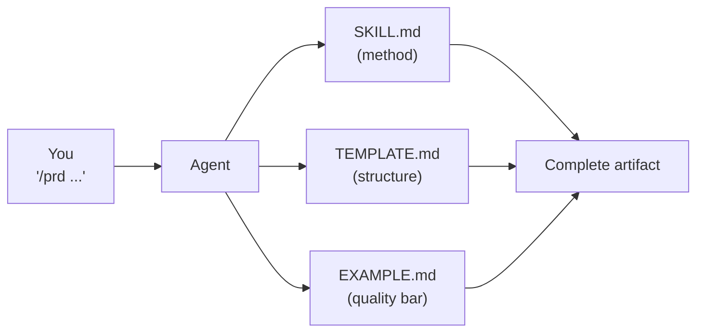
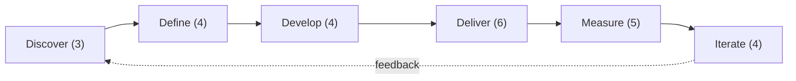

<!--
DRAFT v14a: README.md (short half of the two-file split). Target ~280 lines.
Pairs with v14b (readme_2026-05-18_v14b-split-README-detailed.md).

Maintenance rule for this split:
  - Each piece of content has ONE source of truth.
  - README.md holds: hero, quick start, MCP notice, what's new, big idea, getting started
    (works-for + quick paths + updating), a 1-paragraph "How skills work" pointer, the library
    summary (just counts + Mermaid + link to README-detailed.md), library samples preview,
    project status table (no per-folder walk), contributing, FAQ pointer.
  - README-detailed.md holds: full skill catalog tables, full workflow table, full repo
    structure walk, deep methodology, full FAQ, skill anatomy details, lifecycle deep-dive.
  - Where a piece of content MUST appear in both files (e.g., the version number, the
    skill count), it should come from `.claude-plugin/marketplace.json` via a generator
    OR be pinned to a single line per file with a comment marker so a future audit can
    diff them mechanically.
  - Tradeoff: README.md is short (~280 lines, much better for first-time readers). The
    long catalog moves down a click. The risk is that link-shy readers never click through;
    the mitigation is to make the README-detailed.md preview compelling (counts, Mermaid,
    "what you'll find there" framing).
-->

<a id="readme-top"></a>

<h1 align="center">PM-Skills</h1>

<p align="center">
  <strong>59 production-ready product management skills your AI agent can run today.</strong><br>
  PRDs, OKRs, hypotheses, opportunity trees, retros, Foundation Sprint, Design Sprint, and 50 more.
</p>

<p align="center">
  
  
  
  <a href="LICENSE"></a>
  <a href="https://github.com/product-on-purpose/pm-skills-mcp"></a>
</p>

<p align="center">
  <strong>This is the short README.</strong> Looking for the full catalog, methodology, and reference walkthrough? See <a href="README-detailed.md"><strong>README-detailed.md</strong></a>.
</p>

<details>
<summary><strong>Table of contents</strong></summary>

- [Quick start](#quick-start)
- [MCP server maintenance notice](#mcp-server-maintenance-notice)
- [What's new](#whats-new)
- [The big idea](#the-big-idea)
- [Getting started](#getting-started)
- [How skills work](#how-skills-work)
- [The library at a glance](#the-library-at-a-glance)
- [Library samples preview](#library-samples-preview)
- [Project status](#project-status)
- [Contributing](#contributing)
- [License](#license)

</details>

---

## Quick start

### Install into Claude Code (no clone required)

```
/plugin marketplace add product-on-purpose/pm-skills
/plugin install pm-skills@pm-skills-marketplace
```

Resolves all 59 skills, 66 commands, and 4 sub-agents. Updates: `/plugin update pm-skills`.

### Or, clone the repo

```bash
git clone https://github.com/product-on-purpose/pm-skills.git
cd pm-skills
```

For Codex, Cursor, Windsurf, Claude.ai, and other platforms: see [docs/getting-started/platforms.md](docs/getting-started/platforms.md).

<p align="right">(<a href="#readme-top">back to top</a>)</p>

---

<a id="mcp-server-maintenance-notice"></a>

<details>
<summary><strong>MCP server: maintenance mode (effective 2026-05-04)</strong></summary>

The companion [`pm-skills-mcp`](https://github.com/product-on-purpose/pm-skills-mcp) server is in the v2.9.x maintenance line. Catalog frozen at v2.9.2. Security patches continue; skill parity paused.

**For new users, the file-based install paths above are the recommended path.** See [docs/guides/mcp-integration.md](docs/guides/mcp-integration.md).

</details>

---

## What's new

The library is under active development. Here's what changed and why. Full per-release history: [CHANGELOG.md](CHANGELOG.md).

<details open>
<summary><strong>v2.16.0 - Active Orchestration</strong></summary>

**Changed.** First 4 active-orchestration sub-agents shipped + 4 dispatch skills for cross-client (Codex, Cursor, etc.) + 6-gate pre-tag release runbook codified.
**Matters because.** Foundation for chained workflows without human handoffs.
**Start here.** [`docs/reference/runtime-components.md`](docs/reference/runtime-components.md) . [Release note](docs/releases/Release_v2.16.0.md).

</details>

<details>
<summary><strong>v2.15.0 - Sprint Skills Launch</strong></summary>

**Changed.** 15 new skills (Foundation Sprint family + Design Sprint family + note-and-vote). Catalog 40 to 55. New end-to-end FS-to-DS workflow.
**Matters because.** Run canonical sprints without translating books into prompts.
**Start here.** [Foundation Sprint primer](docs/concepts/foundation-sprint.md) . [Design Sprint primer](docs/concepts/design-sprint.md) . [Release note](docs/releases/Release_v2.15.0.md).

</details>

<details>
<summary><strong>v2.14.x - Doc Stack Migration</strong></summary>

**Changed.** Astro Starlight replaces MkDocs Material. Pagefind search, native dark mode, Node 22.x build. v2.14.1 + v2.14.2 closed regression and Codex-review findings.
**Matters because.** Search actually works. Forkers move to Node 22.x.
**Start here.** [Docs site](https://product-on-purpose.github.io/pm-skills/) . [Release note](docs/releases/Release_v2.14.0.md).

</details>

<details>
<summary><strong>v2.13.x - Plugin Install Path Correction</strong></summary>

**Changed.** `/plugin marketplace add` works correctly against the public repo. `marketplace.json` moved to `.claude-plugin/`; required `owner` field added; new enforcing CI validator.
**Matters because.** The recommended Claude Code path now actually installs.
**Start here.** [Release note](docs/releases/Release_v2.13.1.md).

</details>

<details>
<summary><strong>v2.12.0 - OKR Skills Set</strong></summary>

**Changed.** `okr-writer` (foundation) and `okr-grader` (measure) shipped with operational pattern across a quarter.
**Matters because.** OKR structure, KR quality, and grading rubric are encoded consistently.
**Start here.** [Release note](docs/releases/Release_v2.12.0.md).

</details>

Full changelog: [CHANGELOG.md](CHANGELOG.md).

<p align="right">(<a href="#readme-top">back to top</a>)</p>

---

## The big idea

**Stop prompt-fumbling. Start shipping.** Each skill is a markdown file the agent reads, a template it follows, and a worked example it mirrors. The skill encodes the standard; the agent applies it.



| Without PM-Skills | With PM-Skills |
|---|---|
| Generic AI responses | Battle-tested PM frameworks |
| Inconsistent formats | Production-ready templates |
| Missing critical sections | Comprehensive coverage |
| Prompt-engineering every time | One command, instant output |

PM-Skills is opinionated about quality, not opinionated about your process. Mix and match.

<p align="right">(<a href="#readme-top">back to top</a>)</p>

---

## Getting started

### Works for

| Platform | Native? | How |
|---|---|---|
| **Claude Code** | Yes | Plugin marketplace (recommended) |
| **Codex** | Yes | `npx skills add product-on-purpose/pm-skills -a codex` |
| **Cursor / Windsurf / Copilot** | Yes | AGENTS.md auto-discovery from clone |
| **OpenCode / VS Code** | Yes | Direct or extension-based discovery |
| **Claude.ai / ChatGPT** | Manual | ZIP upload or copy-paste |

Full per-platform setup: [docs/getting-started/platforms.md](docs/getting-started/platforms.md).

### Updating

| Install path | Update command |
|---|---|
| Claude Code plugin marketplace | `/plugin update pm-skills` |
| `skills` CLI | `npx skills update` |
| Git clone | `git pull` |

### Helpful next steps

- Full catalog of all 59 skills: [README-detailed.md](README-detailed.md#the-library)
- Detailed install for all platforms: [docs/getting-started/platforms.md](docs/getting-started/platforms.md)
- How a skill works (anatomy): [docs/guides/anatomy-of-a-skill.md](docs/guides/anatomy-of-a-skill.md)
- Universal skill map: [AGENTS.md](AGENTS.md)

<p align="right">(<a href="#readme-top">back to top</a>)</p>

---

## How skills work

A skill is three files: `SKILL.md` (method), `TEMPLATE.md` (structure), `EXAMPLE.md` (quality bar). The agent reads, mirrors, and fills. No prompt engineering required.

```
skills/deliver-prd/
  SKILL.md
  references/
    TEMPLATE.md
    EXAMPLE.md
```

Three utility skills form a Create > Validate > Iterate loop for managing the library: `/pm-skill-builder`, `/pm-skill-validate`, `/pm-skill-iterate`.

**Deeper dive:** [How a skill works](docs/guides/anatomy-of-a-skill.md), [Skill lifecycle](docs/guides/pm-skill-lifecycle.md), [Library design](README-detailed.md#how-skills-work-deep-dive).

<p align="right">(<a href="#readme-top">back to top</a>)</p>

---

## The library at a glance



| Classification | Count | What's in it |
|---|---:|---|
| **Phase** (Triple Diamond) | 26 | One skill per canonical artifact across Discover, Define, Develop, Deliver, Measure, Iterate |
| **Foundation** (cross-cutting) | 8 | persona, lean-canvas, OKRs, meeting agenda/brief/recap/synthesize, stakeholder-update |
| **Utility** (library tooling) | 10 | pm-skill-builder, pm-skill-validate, pm-skill-iterate, mermaid-diagrams, slideshow-creator, update-pm-skills + 4 helpers |
| **Tool** (sprint methods) | 15 | Foundation Sprint family (7) + Design Sprint family (7) + note-and-vote (1) |

12 workflows ship today, including `foundation-to-design` (end-to-end FS-to-DS arc), `feature-kickoff`, `lean-startup`, `triple-diamond`.

**See the full catalog, all 59 skills with descriptions and slash commands, and the full workflow table:** [README-detailed.md](README-detailed.md#the-library).

<p align="right">(<a href="#readme-top">back to top</a>)</p>

---

## Library samples preview

Every skill ships with a worked `EXAMPLE.md` that anchors the agent's quality bar. The `library/skill-output-samples/` directory holds full sample outputs across **three narrative threads**: Brainshelf (early-stage founder), Storevine (mid-stage e-commerce PM), and Workbench (internal-tools PM).

Read them to calibrate expectations, see how skills compose, borrow phrasing, and understand the kind of output a skill produces before installing.

**Browse:** [library/skill-output-samples/](library/skill-output-samples/). **Why they matter, what to expect from each thread, full guide:** [README-detailed.md](README-detailed.md#library-samples-and-worked-examples).

<p align="right">(<a href="#readme-top">back to top</a>)</p>

---

## Project status

| | |
|---|---|
| **Current version** | [v2.16.0](https://github.com/product-on-purpose/pm-skills/releases/tag/v2.16.0) |
| **Skill count** | 59 (26 phase + 8 foundation + 10 utility + 15 tool) |
| **Sub-agents** | 4 |
| **Workflows** | 12 |
| **Slash commands** | 66 |
| **License** | [Apache 2.0](LICENSE) |
| **Docs site** | [product-on-purpose.github.io/pm-skills](https://product-on-purpose.github.io/pm-skills/) |
| **MCP server** | [`pm-skills-mcp`](https://github.com/product-on-purpose/pm-skills-mcp) (maintenance mode) |

**Repository structure walk** (per-folder map with linked references): see [README-detailed.md](README-detailed.md#repository-structure).

**Roadmap.** v2.17+ end-to-end automations, Astro 6.x upgrade, DS validator metadata enforcement. Tracked in [docs/internal/backlog-canonical.md](docs/internal/backlog-canonical.md).

---

## Contributing

- Contribution guide: [CONTRIBUTING.md](CONTRIBUTING.md)
- Bugs: [open an issue](https://github.com/product-on-purpose/pm-skills/issues/new?labels=bug). Features: [open an issue](https://github.com/product-on-purpose/pm-skills/issues/new?labels=enhancement). Questions: [open a discussion](https://github.com/product-on-purpose/pm-skills/discussions).

Want to add a skill? Use `/pm-skill-builder`, `/pm-skill-validate`, `/pm-skill-iterate`. See [docs/guides/pm-skill-lifecycle.md](docs/guides/pm-skill-lifecycle.md).

---

## License

Apache 2.0. See [LICENSE](LICENSE). Built on the open [Agent Skills Specification](https://agentskills.io/specification).

**For the full FAQ, methodology, skill catalog, repo structure walk, and design rationale, see [README-detailed.md](README-detailed.md).**

<p align="right">(<a href="#readme-top">back to top</a>)</p>
