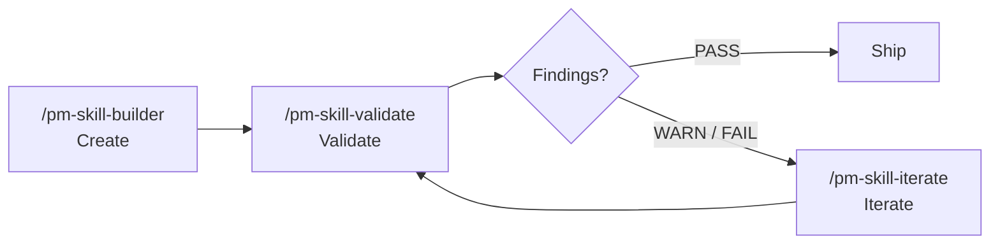

<!--
DRAFT v14b: README-detailed.md (long half of the two-file split). Target ~400 lines.
Pairs with v14a (readme_2026-05-18_v14a-split-README.md).
This file holds the reference-shaped content that the short README links to:
  - Full skill catalog (all 59 with descriptions + slash commands)
  - Full workflow table
  - Full library samples section (the 3-thread explanation)
  - Full repo structure walk (per major folder + canonical reference doc)
  - "How skills work" deep dive (anatomy, properties, lifecycle)
  - Built on canonical PM frameworks (methodology)
  - Full FAQ

The short README links here for: catalog, workflows, library samples deep dive, repo
structure walk, full FAQ.

Single source of truth rule: anything reference-shaped lives here. Anything navigational,
What's New, or onramp-shaped lives in README.md. The version number and skill count
appear in BOTH, but ideally those come from .claude-plugin/marketplace.json via a small
generator script in the future.
-->

<a id="readme-detailed-top"></a>

# PM-Skills — detailed reference

This is the long-form companion to the short [README.md](README.md). It carries the full skill catalog, methodology, repo structure walk, deep "how it works" explanation, and full FAQ. Reference-shaped content lives here; navigational, hero, and "what's new" content lives in the short README.

<details>
<summary><strong>Table of contents</strong></summary>

- [How skills work (deep dive)](#how-skills-work-deep-dive)
- [Built on canonical PM frameworks](#built-on-canonical-pm-frameworks)
- [The library](#the-library)
- [Workflows (multi-skill chains)](#workflows-multi-skill-chains)
- [Library samples and worked examples](#library-samples-and-worked-examples)
- [Repository structure](#repository-structure)
- [Full FAQ](#full-faq)

</details>

---

## How skills work (deep dive)

A skill is three files in a directory:

```
skills/deliver-prd/
  SKILL.md                  # the method the agent reads
  references/
    TEMPLATE.md             # the structure the output follows
    EXAMPLE.md              # the worked example that anchors quality
```

When you run `/prd "topic"`:

1. The agent loads `SKILL.md` into context.
2. It mirrors the depth and structure of `EXAMPLE.md`.
3. It fills `TEMPLATE.md` and produces the artifact.

### Why this works

| Property | What it gives you |
|---|---|
| **Declarative** | The skill says *what a good PRD is*, not *how to phrase a prompt* |
| **Example-anchored** | The worked example sets the quality bar; the agent mirrors depth, detail, structure |
| **Structurally contracted** | The template enforces sections-present, sections-complete |

### Skill lifecycle (Create > Validate > Iterate)



| Tool | Command | What it does |
|---|---|---|
| **Builder** | `/pm-skill-builder` | Creates a new skill from an idea: gap analysis, classification, draft files |
| **Validator** | `/pm-skill-validate` | Audits a skill against repo conventions; produces a severity-graded report |
| **Iterator** | `/pm-skill-iterate` | Applies fixes; previews changes; suggests version bump |

### Learn more

- Skill anatomy: [docs/guides/anatomy-of-a-skill.md](docs/guides/anatomy-of-a-skill.md)
- Lifecycle: [docs/guides/pm-skill-lifecycle.md](docs/guides/pm-skill-lifecycle.md)
- Cross-LLM review protocol: [docs/internal/cross-llm-review-protocol.md](docs/internal/cross-llm-review-protocol.md)

<p align="right">(<a href="#readme-detailed-top">back to top</a>)</p>

---

## Built on canonical PM frameworks

PM-Skills is opinionated about quality, not opinionated about your process. Each skill is a canonical artifact format drawn from established sources.

| Foundation | What it gives us |
|---|---|
| [Agent Skills Specification](https://agentskills.io/specification) | Open standard for AI-agent skills |
| [Triple Diamond Framework](https://medium.com/zendesk-creative-blog/the-zendesk-triple-diamond-process-fd857a11c179) | Six-phase product cycle (extends Design Council's Double Diamond) |
| [Foundation Sprint](https://www.jakeknapp.com/foundation-sprint) (Knapp/Zeratsky) | 2-day strategic alignment for early-stage teams |
| [Design Sprint](https://www.thesprintbook.com/) (Knapp/Zeratsky/Kowitz) | 5-day prototype-and-test for ambiguous problems |
| [Opportunity Solution Trees](https://www.producttalk.org/opportunity-solution-tree/) (Teresa Torres) | Outcome-driven discovery |
| [Jobs to be Done](https://jtbd.info/) | Customer-motivation framework |
| [Architecture Decision Records](https://adr.github.io/) (Michael Nygard) | Technical decision documentation |
| [Keep a Changelog](https://keepachangelog.com/) | Structured release documentation |

Concept primers: [docs/concepts/](docs/concepts/).

<p align="right">(<a href="#readme-detailed-top">back to top</a>)</p>

---

## The library

59 skills across 4 classifications, organized by Triple Diamond phase plus two sprint-method families.

### Discover - find the right problem (3)

| Skill | What it does | Command |
|---|---|---|
| **interview-synthesis** | Turn user research into actionable insights | `/interview-synthesis` |
| **competitive-analysis** | Map the landscape, find opportunities | `/competitive-analysis` |
| **stakeholder-summary** | Understand who matters and what they need | `/stakeholder-summary` |

### Define - frame the problem (4)

| Skill | What it does | Command |
|---|---|---|
| **problem-statement** | Crystal-clear problem framing | `/problem-statement` |
| **hypothesis** | Testable assumptions with success metrics | `/hypothesis` |
| **opportunity-tree** | Teresa Torres-style outcome mapping | `/opportunity-tree` |
| **jtbd-canvas** | Jobs to be Done framework | `/jtbd-canvas` |

### Develop - explore solutions (4)

| Skill | What it does | Command |
|---|---|---|
| **solution-brief** | One-page solution pitch | `/solution-brief` |
| **spike-summary** | Document technical explorations | `/spike-summary` |
| **adr** | Architecture Decision Records (Nygard format) | `/adr` |
| **design-rationale** | Why you made that design choice | `/design-rationale` |

### Deliver - ship it (6)

| Skill | What it does | Command |
|---|---|---|
| **prd** | Comprehensive product requirements | `/prd` |
| **user-stories** | INVEST-compliant stories with acceptance criteria | `/user-stories` |
| **acceptance-criteria** | Given/When/Then testable scenarios | `/acceptance-criteria` |
| **edge-cases** | Error states, boundaries, recovery paths | `/edge-cases` |
| **launch-checklist** | Complete launch step inventory | `/launch-checklist` |
| **release-notes** | User-facing release communication | `/release-notes` |

### Measure - validate with data (5)

| Skill | What it does | Command |
|---|---|---|
| **experiment-design** | Rigorous A/B test planning | `/experiment-design` |
| **instrumentation-spec** | Event tracking requirements | `/instrumentation-spec` |
| **dashboard-requirements** | Analytics dashboard specs | `/dashboard-requirements` |
| **experiment-results** | Document learnings from experiments | `/experiment-results` |
| **okr-grader** | Score completed OKR sets with KR-level scoring + synthesis | `/okr-grader` |

### Iterate - learn and improve (4)

| Skill | What it does | Command |
|---|---|---|
| **retrospective** | Team retros that drive action | `/retrospective` |
| **lessons-log** | Build organizational memory | `/lessons-log` |
| **refinement-notes** | Capture backlog refinement outcomes | `/refinement-notes` |
| **pivot-decision** | Evidence-based pivot/persevere framework | `/pivot-decision` |

### Foundation - cross-cutting (8)

| Skill | What it does | Command |
|---|---|---|
| **persona** | Generate evidence-backed personas | `/persona` |
| **lean-canvas** | One-page lean canvas across nine blocks | `/lean-canvas` |
| **okr-writer** | OKR plan with tight, measurable key results | `/okr-writer` |
| **stakeholder-update** | Stakeholder-facing update from project state | `/stakeholder-update` |
| **meeting-agenda** | Focused agenda from purpose, attendees, time-box | `/meeting-agenda` |
| **meeting-brief** | One-page brief priming attendees with pre-reads | `/meeting-brief` |
| **meeting-recap** | Transcript synthesized into decisions and actions | `/meeting-recap` |
| **meeting-synthesize** | Cross-meeting themes from multiple sessions | `/meeting-synthesize` |

### Foundation Sprint family - 2-day strategic alignment (7)

Run the full arc with the [foundation-sprint workflow](_workflows/foundation-sprint.md). Concept primer: [docs/concepts/foundation-sprint.md](docs/concepts/foundation-sprint.md).

| Skill | What it does | Command |
|---|---|---|
| **foundation-sprint-readiness** | Decision tree for FS readiness | `/foundation-sprint-readiness` |
| **foundation-sprint-basics** | Customer, problem, competition (founding 3-tuple) | `/foundation-sprint-basics` |
| **foundation-sprint-differentiation** | 2x2 of unique advantages | `/foundation-sprint-differentiation` |
| **foundation-sprint-approach-options** | 3-5 high-level approaches | `/foundation-sprint-approach-options` |
| **foundation-sprint-magic-lenses** | Approach scoring across 3-4 critical lenses | `/foundation-sprint-magic-lenses` |
| **foundation-sprint-founding-hypothesis** | Synthesize chosen approach into a testable hypothesis | `/foundation-sprint-founding-hypothesis` |
| **foundation-sprint-brief** | One-page sprint brief | `/foundation-sprint-brief` |

### Design Sprint family - 5-day prototype-and-test (7)

Run the full arc with the [design-sprint workflow](_workflows/design-sprint.md). Concept primer: [docs/concepts/design-sprint.md](docs/concepts/design-sprint.md).

| Skill | What it does | Command |
|---|---|---|
| **design-sprint-readiness** | Decision tree for DS readiness | `/design-sprint-readiness` |
| **design-sprint-brief** | Pre-sprint brief: long-term goal, sprint questions | `/design-sprint-brief` |
| **design-sprint-map-and-target** | Customer journey map; chosen target | `/design-sprint-map-and-target` |
| **design-sprint-sketch** | Structured 4-step individual sketch session | `/design-sprint-sketch` |
| **design-sprint-decide-and-storyboard** | Heat map, straw poll, decider vote, storyboard | `/design-sprint-decide-and-storyboard` |
| **design-sprint-prototype-plan** | Realistic-enough Friday prototype plan | `/design-sprint-prototype-plan` |
| **design-sprint-test-and-score** | 5 customer interviews, scored patterns, decision | `/design-sprint-test-and-score` |

### Standalone tool skill

| Skill | What it does | Command |
|---|---|---|
| **note-and-vote** | Group decision mechanic usable inside any workshop | `/note-and-vote` |

### Utility - meta-tooling (10)

| Skill | What it does | Command |
|---|---|---|
| **pm-skill-builder** | Create new PM skills with gap analysis + guided drafting | `/pm-skill-builder` |
| **pm-skill-validate** | Audit a skill against conventions and quality criteria | `/pm-skill-validate` |
| **pm-skill-iterate** | Apply targeted improvements from feedback or reports | `/pm-skill-iterate` |
| **mermaid-diagrams** | Syntactically valid Mermaid diagrams for product docs | `/mermaid-diagrams` |
| **slideshow-creator** | Professional presentations from JSON deck specs | `/slideshow-creator` |
| **update-pm-skills** | Update local pm-skills installation | `/update-pm-skills` |

Plus 4 utility skills for AGENTS.md sync and release tooling. Source: [`skills/`](skills/). Universal skill map: [AGENTS.md](AGENTS.md).

<p align="right">(<a href="#readme-detailed-top">back to top</a>)</p>

---

## Workflows (multi-skill chains)

12 workflows ship today. Workflows encode handoff guidance between skills, so context flows from discovery through delivery.

| Workflow | Best for | Skills chained |
|---|---|---|
| **[Foundation to Design](_workflows/foundation-to-design.md)** | End-to-end FS-to-DS arc | foundation-sprint-* + design-sprint-* |
| **[Foundation Sprint](_workflows/foundation-sprint.md)** | 2-day strategic alignment | All 7 foundation-sprint skills |
| **[Design Sprint](_workflows/design-sprint.md)** | 5-day prototype-and-test | All 7 design-sprint skills |
| **[Feature Kickoff](_workflows/feature-kickoff.md)** | New features | problem-statement, hypothesis, prd, user-stories, launch-checklist |
| **[Lean Startup](_workflows/lean-startup.md)** | Rapid validation | hypothesis, experiment-design, experiment-results, pivot-decision |
| **[Triple Diamond](_workflows/triple-diamond.md)** | Major initiatives | Full 26 phase-skill flow across 6 phases |
| **[Customer Discovery](_workflows/customer-discovery.md)** | Research synthesis | Raw research into a validated problem |
| **[Sprint Planning](_workflows/sprint-planning.md)** | Sprint prep | Sprint-ready stories from a backlog |
| **[Product Strategy](_workflows/product-strategy.md)** | Strategic initiatives | Frame a major strategic initiative |
| **[Post-Launch Learning](_workflows/post-launch-learning.md)** | Post-launch | Measure results and capture learnings |
| **[Stakeholder Alignment](_workflows/stakeholder-alignment.md)** | Leadership buy-in | Build a case for leadership |
| **[Technical Discovery](_workflows/technical-discovery.md)** | Tech feasibility | Evaluate feasibility and architecture |

Full reference: [docs/reference/workflows/](docs/reference/workflows/).

<p align="right">(<a href="#readme-detailed-top">back to top</a>)</p>

---

## Library samples and worked examples

Every skill ships with a worked `EXAMPLE.md` that anchors the agent's quality bar. On top of that, the `library/skill-output-samples/` directory holds full sample outputs across **three narrative threads**, each representing a different kind of product team.

You read samples to:

- **Calibrate expectations** before running a skill (so you know what "good" looks like)
- **See how skills compose** into multi-step workflows (Foundation Sprint to Design Sprint, Triple Diamond end-to-end)
- **Borrow phrasing, structure, or quality bar** for your own work
- **Understand the kind of output** a skill produces before installing

The three threads:

| Thread | Persona | Use it to see |
|---|---|---|
| **Brainshelf** | Early-stage founder building a personal-knowledge product | Foundation Sprint outputs, lean canvas, hypothesis chains |
| **Storevine** | Mid-stage e-commerce PM running a checkout-conversion program | Experiment design, OKRs, retros, opportunity trees |
| **Workbench** | Internal-tools PM at a growing org | Stakeholder updates, ADRs, meeting recaps, refinement notes |

Each thread is internally self-consistent so a reader can follow one company's product story across many skills.

**Browse:** [library/skill-output-samples/](library/skill-output-samples/). Each skill's `references/EXAMPLE.md` also lives next to its `SKILL.md` for in-context reference.

<p align="right">(<a href="#readme-detailed-top">back to top</a>)</p>

---

## Repository structure

The repo is organized so each kind of content lives in one canonical place.

**`skills/`** - the 59 skills, one directory each, following the `SKILL.md` + `references/TEMPLATE.md` + `references/EXAMPLE.md` pattern.
- Reference: [docs/reference/project-structure.md](docs/reference/project-structure.md)

**`commands/`** - 66 slash commands that map to skills, workflows, and sub-agents for Claude Code.
- Reference: [AGENTS.md](AGENTS.md) for the universal command map

**`_workflows/`** - 12 multi-skill workflows that encode handoff guidance.
- Reference: [docs/reference/workflows/](docs/reference/workflows/)

**`subagents/`** - 4 Claude Code plugin sub-agents (v2.16.0+ active orchestration runtime: pm-critic, pm-skill-auditor, pm-changelog-curator, pm-release-conductor).
- Reference: [docs/reference/runtime-components.md](docs/reference/runtime-components.md)

**`library/`** - sample outputs across 3 narrative threads (Brainshelf, Storevine, Workbench).
- See [Library samples and worked examples](#library-samples-and-worked-examples) above

**`scripts/`** - CI validators and release tooling, each shipping as `.sh` + `.ps1` + `.md` triplet.
- Reference: [CONTRIBUTING.md](CONTRIBUTING.md)

**`docs/`** - Astro Starlight site source (concept primers, guides, reference, releases).
- Browse: [product-on-purpose.github.io/pm-skills](https://product-on-purpose.github.io/pm-skills/)

**`.claude-plugin/`** - plugin marketplace manifest + plugin manifest for Claude Code install.
- Files: [marketplace.json](.claude-plugin/marketplace.json) + [plugin.json](.claude-plugin/plugin.json)

**`AGENTS.md`** - universal skill discovery file for AGENTS.md-aware agents.

**`CONTRIBUTING.md`** - skill-shape contract, validator suite, release workflow.

**`CHANGELOG.md`** - full version history.

<p align="right">(<a href="#readme-detailed-top">back to top</a>)</p>

---

## Full FAQ

**Is this opinionated about my process?** No. Skills are canonical artifact formats. Mix and match. The Triple Diamond is one organizing lens; you don't have to adopt it to use the skills.

**Do I need Claude Code?** No. Any agent that supports the [Agent Skills Specification](https://agentskills.io/specification) or auto-discovers via `AGENTS.md` works. See [docs/getting-started/platforms.md](docs/getting-started/platforms.md) for per-platform setup.

**Do I need the MCP server?** No. The file-based install is the recommended path. The MCP server is in maintenance mode and supports MCP-only clients.

**Can I use just a few skills, not all 59?** Yes. After install, invoke only the ones you need. There's no startup cost for unused skills.

**Can I add my own skills?** Yes. Use `/pm-skill-builder` to scaffold a new skill, `/pm-skill-validate` to check it, and `/pm-skill-iterate` to improve it. See [CONTRIBUTING.md](CONTRIBUTING.md).

**How is this versioned?** The repo follows SemVer (currently v2.16.0). Individual skills version independently; see [docs/internal/skill-versioning.md](docs/internal/skill-versioning.md).

**What's the difference between a skill, a workflow, and a sub-agent?**
- A **skill** is one declarative artifact-method (e.g., write a PRD).
- A **workflow** is a chain of skills with handoff guidance (e.g., Feature Kickoff: problem-statement to hypothesis to prd to user-stories to launch-checklist).
- A **sub-agent** is a Claude Code plugin runtime component that can spawn sub-tasks against the catalog (v2.16.0+).

**Why are there 4 different classifications (phase, foundation, utility, tool)?** Each one has a different purpose. Phase skills run the Triple Diamond product cycle. Foundation skills support cross-cutting capability (personas, meetings, OKRs). Utility skills maintain the library itself (builder, validator, iterator). Tool skills are workshop methodologies (Foundation Sprint, Design Sprint, note-and-vote). See [docs/reference/categories.md](docs/reference/categories.md) for the design rationale.

**What's the cross-LLM review protocol?** Pre-release adversarial review with Codex (the "Phase 0 Adversarial Review Loop"). See [docs/internal/cross-llm-review-protocol.md](docs/internal/cross-llm-review-protocol.md).

**Where do release plans live?** [docs/internal/release-plans/](docs/internal/release-plans/), one folder per version.

<p align="right">(<a href="#readme-detailed-top">back to top</a>)</p>

---

Back to short README: [README.md](README.md).
