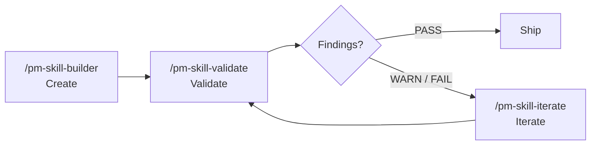

<!--
DRAFT README v7: "Two-Track Landing". Target ~340 lines vs current 1,305.
Approach: Hybrid. Same "above the fold" treatment as v5/v6 (MCP notice, quick install, recent releases). Then the body explicitly bifurcates into two collapsed tracks:
  - "Run the skills" (collapsed): catalog table, slash command quick-ref, workflow cards
  - "Understand the library" (collapsed): philosophy, framework basis, comparison vs MCP, skill anatomy, contributing
A reader picks one track based on what they came for; the README opens lean (only the open ones expand). This is the answer to: most readers are one of two personas (operator or evaluator), serve both without forcing either to scroll past the other.
Constraints honored:
  - MCP server notice stays at top (<details>, closed).
  - Quick install near top.
  - Past couple releases visible at top in expand-collapse.
-->

<a id="readme-top"></a>

<h1 align="center">PM-Skills</h1>

<p align="center">
  <strong>59 production-ready product management skills your AI agent can run today.</strong><br>
  PRDs, OKRs, hypotheses, opportunity trees, retros, Foundation Sprint, Design Sprint, and 50 more.
</p>

<p align="center">
  
  
  
  <a href="LICENSE"></a>
  <a href="https://github.com/product-on-purpose/pm-skills-mcp"></a>
  <a href="CONTRIBUTING.md"></a>
</p>

<p align="center">
  <a href="#install">Install</a> .
  <a href="#whats-new">What's new</a> .
  <a href="#run-the-skills">Run the skills</a> .
  <a href="#understand-the-library">Understand the library</a> .
  <a href="https://product-on-purpose.github.io/pm-skills/">Docs site</a>
</p>

---

<details>
<summary><strong>MCP server: maintenance mode (effective 2026-05-04)</strong></summary>

The companion [`pm-skills-mcp`](https://github.com/product-on-purpose/pm-skills-mcp) server is in the v2.9.x maintenance line (latest v2.9.3). The MCP catalog is frozen at the v2.9.2 build (40 MCP-embedded entries + 11 workflow tools + 8 utility tools). Security patches and critical bug fixes continue. Skill parity with the file-based library is on hold.

**For new users, the file-based install paths below are the recommended path.** See [MCP Integration](docs/guides/mcp-integration.md) for status details and resumption criteria.

</details>

---

## Install

### Claude Code (recommended)

```
/plugin marketplace add product-on-purpose/pm-skills
/plugin install pm-skills@pm-skills-marketplace
```

All 59 skills and 66 commands resolve from any directory. Verify with `/plugin list`.

### Cross-agent (open skills CLI)

Works with Cursor, GitHub Copilot, Cline, and any agent supported by the open [`skills` CLI](https://github.com/vercel-labs/skills):

```bash
npx skills add product-on-purpose/pm-skills
```

<details>
<summary><strong>Other platforms (Claude.ai, MCP clients, OpenCode, Cursor, Windsurf, ChatGPT)</strong></summary>

See [docs/getting-started/platforms.md](docs/getting-started/platforms.md) for ZIP-upload flows, MCP configuration JSON, AGENTS.md auto-discovery setup, and manual copy patterns. Longer-form walkthrough: [docs/getting-started/](docs/getting-started/index.md).

</details>

---

## What's new

The library is under active development. Here are the changes from the last few releases that are most likely to matter for how you use it.

### Sprint methodologies are now first-class skills (v2.15.0)

**What changed.** 15 new skills cover the canonical Foundation Sprint (Knapp/Zeratsky 2-day strategic alignment) and Design Sprint (Knapp/Zeratsky/Kowitz 5-day prototype-and-test) methodologies, plus a standalone `note-and-vote` skill.

**Why it matters.** If you run sprints, you don't have to translate the books into prompts. The agent runs the workshop with you using canonical moves; outputs are workshop artifacts your team can react to.

**Get started.** Concept primers: [`docs/concepts/foundation-sprint.md`](docs/concepts/foundation-sprint.md), [`docs/concepts/design-sprint.md`](docs/concepts/design-sprint.md). Chained workflow: [`_workflows/foundation-to-design.md`](_workflows/foundation-to-design.md).

### Faster, more searchable docs site (v2.14.x line)

**What changed.** Retired MkDocs Material; migrated to Astro Starlight. Same URLs and content; new Pagefind search, native dark mode, Node 22.x build pipeline. v2.14.1 added the canonical Mermaid style guide; v2.14.2 closed out a cumulative docs hygiene patch.

**Why it matters.** Search actually works now (full-text, instant). Forkers: build is Node 22.x, not Python pip.

**Get started.** Browse [product-on-purpose.github.io/pm-skills](https://product-on-purpose.github.io/pm-skills/). Migration notes: [`docs/internal/release-plans/v2.14.0/`](docs/internal/release-plans/v2.14.0/).

### Active orchestration is now possible (v2.16.0)

**What changed.** First 4 active-orchestration sub-agents shipped, giving agents a stable interface for spawning sub-tasks against the catalog. 6-gate pre-tag release runbook codified.

**Why it matters.** Foundation work for chained workflows that don't need human handoffs. Today the dispatch surface is documented; v2.17+ end-to-end automations build on this.

**Get started.** [`docs/reference/runtime-components.md`](docs/reference/runtime-components.md). Release runbook at [`docs/internal/release-plans/v2.16.0/`](docs/internal/release-plans/v2.16.0/).

<details>
<summary><strong>Full release-by-release changelog</strong></summary>

<details open>
<summary><strong>v2.16.0 - Active Orchestration</strong></summary>

- First 4 active orchestration sub-agents shipped (cross-client dispatch).
- 6-gate release runbook codified (`--strict` validator bundle at pre-tag).
- Release note: [`docs/releases/Release_v2.16.0.md`](docs/releases/Release_v2.16.0.md).

</details>

<details>
<summary><strong>v2.15.0 - Sprint Skills Launch</strong></summary>

- 15 new skills under `classification: tool` (7 FS + 7 DS + 1 standalone).
- 3 new workflows including `_workflows/foundation-to-design.md`.
- Release note: [`docs/releases/Release_v2.15.0.md`](docs/releases/Release_v2.15.0.md).

</details>

<details>
<summary><strong>v2.14.x - Doc Stack Migration</strong></summary>

- v2.14.0: MkDocs Material retired; Astro Starlight ships.
- v2.14.1: title-duplication fix + Mermaid beautification + validators promoted to enforcing.
- v2.14.2: Codex final review closure; cumulative docs hygiene patch.
- Release notes: [`v2.14.0`](docs/releases/Release_v2.14.0.md) . [`v2.14.1`](docs/releases/Release_v2.14.1.md) . [`v2.14.2`](docs/releases/Release_v2.14.2.md).

</details>

</details>

Full history: [CHANGELOG.md](CHANGELOG.md) . [Releases](https://github.com/product-on-purpose/pm-skills/releases).

---

## Two ways to read this README

> **Are you here to use the skills, or to evaluate the library?** Pick a track. Both are below; both are collapsed so you can scroll past either one.

---

## Run the skills

<details>
<summary><strong>Your first command (60 seconds)</strong></summary>

After install, in Claude Code or any AGENTS.md-aware agent:

```
/prd "A focus-mode feature for our task app"
```

The agent reads `skills/deliver-prd/SKILL.md`, mirrors the worked example in `references/EXAMPLE.md`, follows the structure in `references/TEMPLATE.md`, and produces a complete PRD: problem, metrics, user stories, scope, dependencies, open questions.

Every skill works this way. Slash command in, professional artifact out.

</details>

<details>
<summary><strong>The full catalog (all 59 skills, grouped by phase + family)</strong></summary>

**Discover - find the right problem (3)**

| Skill | What it does | Command |
|---|---|---|
| **interview-synthesis** | Turn user research into actionable insights | `/interview-synthesis` |
| **competitive-analysis** | Map the landscape, find opportunities | `/competitive-analysis` |
| **stakeholder-summary** | Understand who matters and what they need | `/stakeholder-summary` |

**Define - frame the problem (4)**

| Skill | What it does | Command |
|---|---|---|
| **problem-statement** | Crystal-clear problem framing | `/problem-statement` |
| **hypothesis** | Testable assumptions with success metrics | `/hypothesis` |
| **opportunity-tree** | Teresa Torres-style outcome mapping | `/opportunity-tree` |
| **jtbd-canvas** | Jobs to be Done framework | `/jtbd-canvas` |

**Develop - explore solutions (4)**

| Skill | What it does | Command |
|---|---|---|
| **solution-brief** | One-page solution pitch | `/solution-brief` |
| **spike-summary** | Document technical explorations | `/spike-summary` |
| **adr** | Architecture Decision Records (Nygard format) | `/adr` |
| **design-rationale** | Why you made that design choice | `/design-rationale` |

**Deliver - ship it (6)**

| Skill | What it does | Command |
|---|---|---|
| **prd** | Comprehensive product requirements | `/prd` |
| **user-stories** | INVEST-compliant stories with acceptance criteria | `/user-stories` |
| **acceptance-criteria** | Given/When/Then testable scenarios | `/acceptance-criteria` |
| **edge-cases** | Error states, boundaries, recovery paths | `/edge-cases` |
| **launch-checklist** | Never miss a launch step again | `/launch-checklist` |
| **release-notes** | User-facing release communication | `/release-notes` |

**Measure - validate with data (5)**

| Skill | What it does | Command |
|---|---|---|
| **experiment-design** | Rigorous A/B test planning | `/experiment-design` |
| **instrumentation-spec** | Event tracking requirements | `/instrumentation-spec` |
| **dashboard-requirements** | Analytics dashboard specs | `/dashboard-requirements` |
| **experiment-results** | Document learnings from experiments | `/experiment-results` |
| **okr-grader** | Score completed OKR sets with KR-level scoring + learning synthesis | `/okr-grader` |

**Iterate - learn and improve (4)**

| Skill | What it does | Command |
|---|---|---|
| **retrospective** | Team retros that drive action | `/retrospective` |
| **lessons-log** | Build organizational memory | `/lessons-log` |
| **refinement-notes** | Capture backlog refinement outcomes | `/refinement-notes` |
| **pivot-decision** | Evidence-based pivot/persevere framework | `/pivot-decision` |

**Foundation - cross-cutting (8)**

| Skill | What it does | Command |
|---|---|---|
| **persona** | Generate product or marketing personas with evidence and confidence | `/persona` |
| **lean-canvas** | Capture problem, customer segment, value prop, and key metrics on one page | `/lean-canvas` |
| **okr-writer** | Draft an OKR plan with tight, measurable key results | `/okr-writer` |
| **stakeholder-update** | Compose a stakeholder-facing update from project state and recent activity | `/stakeholder-update` |
| **meeting-agenda** | Draft a focused agenda from purpose, attendees, and time-box | `/meeting-agenda` |
| **meeting-brief** | One-page brief priming attendees with context and pre-reads | `/meeting-brief` |
| **meeting-recap** | Synthesize a meeting transcript into decisions, actions, and follow-ups | `/meeting-recap` |
| **meeting-synthesize** | Cross-meeting synthesis distilling themes from multiple sessions | `/meeting-synthesize` |

**Foundation Sprint family - 2-day strategic alignment (7)**

| Skill | What it does | Command |
|---|---|---|
| **foundation-sprint-readiness** | Decision tree: is your team ready for an FS? | `/foundation-sprint-readiness` |
| **foundation-sprint-basics** | Customer, problem, competition (founding 3-tuple) | `/foundation-sprint-basics` |
| **foundation-sprint-differentiation** | 2x2 of unique advantages against the competition | `/foundation-sprint-differentiation` |
| **foundation-sprint-approach-options** | Generate 3-5 high-level approaches to the problem | `/foundation-sprint-approach-options` |
| **foundation-sprint-magic-lenses** | Score approaches with 3-4 critical lenses | `/foundation-sprint-magic-lenses` |
| **foundation-sprint-founding-hypothesis** | Synthesize chosen approach into a testable founding hypothesis | `/foundation-sprint-founding-hypothesis` |
| **foundation-sprint-brief** | One-page brief capturing the full sprint output | `/foundation-sprint-brief` |

**Design Sprint family - 5-day prototype-and-test (7)**

| Skill | What it does | Command |
|---|---|---|
| **design-sprint-readiness** | Decision tree: is your team ready for a DS? | `/design-sprint-readiness` |
| **design-sprint-brief** | Pre-sprint brief: long-term goal, sprint questions, target | `/design-sprint-brief` |
| **design-sprint-map-and-target** | Map of the customer journey; choose the target | `/design-sprint-map-and-target` |
| **design-sprint-sketch** | Structured 4-step individual sketch session | `/design-sprint-sketch` |
| **design-sprint-decide-and-storyboard** | Heat map, straw poll, decider vote; storyboard the winner | `/design-sprint-decide-and-storyboard` |
| **design-sprint-prototype-plan** | Plan the realistic-enough Friday prototype | `/design-sprint-prototype-plan` |
| **design-sprint-test-and-score** | Run 5 customer interviews; score patterns and decide | `/design-sprint-test-and-score` |

**Standalone tool (1)**

| Skill | What it does | Command |
|---|---|---|
| **note-and-vote** | Group decision mechanic (silent note, vote, decider chooses) | `/note-and-vote` |

**Utility - meta-tooling (10)**

| Skill | What it does | Command |
|---|---|---|
| **pm-skill-builder** | Create new PM skills with gap analysis and guided drafting | `/pm-skill-builder` |
| **pm-skill-validate** | Audit a skill against structural conventions and quality criteria | `/pm-skill-validate` |
| **pm-skill-iterate** | Apply targeted improvements from feedback or validation reports | `/pm-skill-iterate` |
| **mermaid-diagrams** | Create syntactically valid mermaid diagrams for product documents | `/mermaid-diagrams` |
| **slideshow-creator** | Generate professional presentations from JSON deck specs | `/slideshow-creator` |
| **update-pm-skills** | Check for updates and update local pm-skills installation | `/update-pm-skills` |

Plus 4 utility skills for AGENTS.md sync and release tooling. Full list: [`skills/`](skills/) and [AGENTS.md](AGENTS.md).

</details>

<details>
<summary><strong>Workflows (all 12, chains of skills)</strong></summary>

Workflows encode handoff guidance between skills, so context flows naturally from discovery through delivery.

| Workflow | Best for | Skills chained |
|---|---|---|
| **[Foundation to Design](_workflows/foundation-to-design.md)** | End-to-end FS-to-DS arc | foundation-sprint-* + design-sprint-* |
| **[Foundation Sprint](_workflows/foundation-sprint.md)** | 2-day strategic alignment | All 7 foundation-sprint skills |
| **[Design Sprint](_workflows/design-sprint.md)** | 5-day prototype-and-test | All 7 design-sprint skills |
| **[Feature Kickoff](_workflows/feature-kickoff.md)** | New features | problem-statement, hypothesis, prd, user-stories, launch-checklist |
| **[Lean Startup](_workflows/lean-startup.md)** | Rapid validation | hypothesis, experiment-design, experiment-results, pivot-decision |
| **[Triple Diamond](_workflows/triple-diamond.md)** | Major initiatives | Full 26 phase-skill flow across 6 phases |
| **[Customer Discovery](_workflows/customer-discovery.md)** | Research synthesis | Transform raw research into a validated problem |
| **[Sprint Planning](_workflows/sprint-planning.md)** | Sprint prep | Prepare sprint-ready stories from a backlog |
| **[Product Strategy](_workflows/product-strategy.md)** | Strategic initiatives | Frame a major strategic initiative |
| **[Post-Launch Learning](_workflows/post-launch-learning.md)** | Post-launch | Measure results and capture learnings |
| **[Stakeholder Alignment](_workflows/stakeholder-alignment.md)** | Leadership buy-in | Build a case for leadership buy-in |
| **[Technical Discovery](_workflows/technical-discovery.md)** | Tech feasibility | Evaluate technical feasibility and architecture |

Full reference: [docs/reference/workflows/](docs/reference/workflows/).

</details>

<details>
<summary><strong>Quick examples (3 skills in action)</strong></summary>

```
/prd "Search feature for e-commerce platform"
/hypothesis "Will one-page checkout increase conversion?"
/user-stories "Recurring tasks feature from PRD"
```

For a curated tour of skill outputs, see the [showcase](https://product-on-purpose.github.io/pm-skills/showcase/) on the docs site.

</details>

<p align="right">(<a href="#readme-top">back to top</a>)</p>

---

## Understand the library

<details>
<summary><strong>The big idea (and what makes this different)</strong></summary>

**Stop prompt-fumbling. Start shipping.** Every time you ask an AI to help with product management, you start from zero. Generic responses. Inconsistent formats. Missing critical sections. Hours lost to repetitive prompt crafting.

PM-Skills changes that. Each skill is a markdown file the agent reads, a template it follows, and a worked example it mirrors. The skill encodes the standard; the agent applies it.

| Without PM-Skills | With PM-Skills |
|---|---|
| Generic AI responses | Battle-tested PM frameworks |
| Inconsistent formats across artifacts | Production-ready templates |
| Missing critical sections | Comprehensive coverage |
| Prompt-engineering every time | One command, instant output |
| Tribal knowledge in your head | Institutional knowledge in your repo |

</details>

<details>
<summary><strong>Built on canonical PM frameworks</strong></summary>

| Foundation | What it gives us |
|---|---|
| [Agent Skills Specification](https://agentskills.io/specification) | Open standard for AI-agent skills; works across the ecosystem |
| [Triple Diamond Framework](https://medium.com/zendesk-creative-blog/the-zendesk-triple-diamond-process-fd857a11c179) | Six-phase product cycle (extends Design Council's Double Diamond) |
| [Foundation Sprint](https://www.jakeknapp.com/foundation-sprint) (Knapp/Zeratsky) | 2-day strategic alignment for early-stage teams |
| [Design Sprint](https://www.thesprintbook.com/) (Knapp/Zeratsky/Kowitz) | 5-day prototype-and-test for ambiguous problems |
| [Opportunity Solution Trees](https://www.producttalk.org/opportunity-solution-tree/) (Teresa Torres) | Outcome-driven discovery |
| [Jobs to be Done](https://jtbd.info/) | Customer-motivation framework |
| [Architecture Decision Records](https://adr.github.io/) (Michael Nygard) | Technical decision documentation |

</details>

<details>
<summary><strong>How a skill works (the 3-file anatomy)</strong></summary>

A skill is three files in a directory:

```
skills/deliver-prd/
  SKILL.md                  <- agent instructions (the canonical method)
  references/
    TEMPLATE.md             <- the structure the output follows
    EXAMPLE.md              <- a worked example to mirror the quality bar
```

When you run `/prd "..."`, the agent loads `SKILL.md` into context, follows its instructions, fills the template, and produces an artifact that matches the example's quality. That's the whole mechanism.

Three properties make this work:

1. **Declarative.** The skill says what a good PRD is, not how to phrase one prompt.
2. **Example-anchored.** The worked example sets the quality bar; the agent mirrors structure, depth, detail.
3. **Structurally contracted.** The template enforces sections-present, sections-complete.

Full anatomy: [docs/guides/anatomy-of-a-skill.md](docs/guides/anatomy-of-a-skill.md).

</details>

<details>
<summary><strong>pm-skills vs pm-skills-mcp (when to pick which)</strong></summary>

PM-Skills ships in two complementary forms:

|  | **pm-skills** (this repo) | [**pm-skills-mcp**](https://github.com/product-on-purpose/pm-skills-mcp) |
|---|---|---|
| **Format** | Skill library as markdown files | MCP server wrapping the library |
| **Setup** | `npx skills add ...` or git clone | `npx pm-skills-mcp` |
| **Invocation** | Slash commands or AGENTS.md | MCP tool calls |
| **Status** | Active development | Maintenance mode (catalog frozen at v2.9.2 build) |
| **Recommended for** | New users, all platforms with AGENTS.md or skills-spec support | MCP-only clients that can't load the file-based library |

Most users want the file-based path. See [MCP Integration](docs/guides/mcp-integration.md) for when the MCP path is the right choice.

</details>

<details>
<summary><strong>Skill lifecycle (Create > Validate > Iterate)</strong></summary>

Three utility skills form a complete loop for managing the library:



| Tool | Command | What it does |
|---|---|---|
| **Builder** | `/pm-skill-builder` | Creates a new skill from an idea: gap analysis, classification, draft files |
| **Validator** | `/pm-skill-validate` | Audits a skill against repo conventions; produces a severity-graded report |
| **Iterator** | `/pm-skill-iterate` | Applies fixes from feedback; previews changes; suggests version bump |

See [PM-Skill Lifecycle](docs/guides/pm-skill-lifecycle.md).

</details>

<details>
<summary><strong>Contributing</strong></summary>

- [CONTRIBUTING.md](CONTRIBUTING.md) covers the skill-shape contract, the validator suite, and the release workflow.
- Bugs: [issues](https://github.com/product-on-purpose/pm-skills/issues/new?labels=bug). Features: [issues](https://github.com/product-on-purpose/pm-skills/issues/new?labels=enhancement). Questions: [discussions](https://github.com/product-on-purpose/pm-skills/discussions).
- Skill anatomy: see the section above, or [docs/guides/anatomy-of-a-skill.md](docs/guides/anatomy-of-a-skill.md).

</details>

<p align="right">(<a href="#readme-top">back to top</a>)</p>

---

## Project status

| | |
|---|---|
| **Current version** | [v2.16.0](https://github.com/product-on-purpose/pm-skills/releases/tag/v2.16.0) |
| **Skill count** | 59 |
| **Spec** | [agentskills.io](https://agentskills.io/specification) |
| **License** | [Apache 2.0](LICENSE) |
| **Docs site** | [product-on-purpose.github.io/pm-skills](https://product-on-purpose.github.io/pm-skills/) |
| **MCP server** | [`pm-skills-mcp`](https://github.com/product-on-purpose/pm-skills-mcp) (maintenance mode) |
| **Changelog** | [CHANGELOG.md](CHANGELOG.md) |
| **FAQ** | [docs/reference/faq.md](docs/reference/faq.md) |

---

## License

Apache 2.0. See [LICENSE](LICENSE). Built on the open [Agent Skills Specification](https://agentskills.io/specification).

<p align="right">(<a href="#readme-top">back to top</a>)</p>
