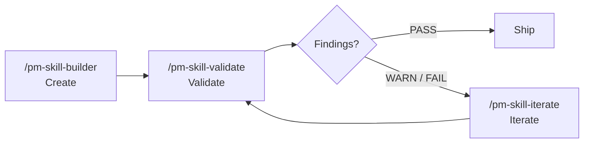

<!--
DRAFT README v8: "By Role / persona-routed". Target ~480 lines vs current 1,305.
Approach: After the constrained top (badges, MCP notice, quick install, what's new), body opens with a "Where to start" reader-self-identification block that routes each persona to a dedicated track. Body sections are personas, not topics. The full catalog still appears in full (under "For PMs running skills"); methodology appears (under "For PMs evaluating"); lifecycle appears (under "For contributors"); validator/release content surfaces (under "For maintainers"). Different navigation metaphor than v5/v6/v7: organized by reader, not by content.
Bet: Reader self-routing beats topic ordering when audiences diverge. pm-skills has 4 genuinely different audiences (operator, evaluator, contributor, fork maintainer) that the current README treats identically.
Constraints honored:
  - MCP server notice stays at top (closed-by-default <details>).
  - Quick install near top (single install block, two paths inline).
  - Recent releases visible at top: human-centered What's New + collapsed release-by-release stack.
-->

<a id="readme-top"></a>

<h1 align="center">PM-Skills</h1>

<p align="center">
  <strong>59 production-ready product management skills your AI agent can run today.</strong><br>
  PRDs, OKRs, hypotheses, opportunity trees, retros, Foundation Sprint, Design Sprint, and 50 more.
</p>

<p align="center">
  
  
  
  <a href="LICENSE"></a>
  <a href="https://github.com/product-on-purpose/pm-skills-mcp"></a>
</p>

<p align="center">
  <a href="#install">Install</a> .
  <a href="#whats-new">What's new</a> .
  <a href="#where-to-start">Where to start</a> .
  <a href="#for-pms-running-skills">Run skills</a> .
  <a href="#for-pms-evaluating-this-library">Evaluate</a> .
  <a href="#for-contributors">Contribute</a> .
  <a href="#for-maintainers-and-forkers">Maintain</a>
</p>

---

<details>
<summary><strong>MCP server: maintenance mode (effective 2026-05-04)</strong></summary>

The companion [`pm-skills-mcp`](https://github.com/product-on-purpose/pm-skills-mcp) server is in the v2.9.x maintenance line. The MCP catalog is frozen at the v2.9.2 build. Security patches and critical bug fixes continue; skill parity is paused.

**For new users, the file-based install paths below are the recommended path.** See [MCP Integration](docs/guides/mcp-integration.md) for status details and resumption criteria.

</details>

---

## Install

### Claude Code (recommended)

```
/plugin marketplace add product-on-purpose/pm-skills
/plugin install pm-skills@pm-skills-marketplace
```

All 59 skills and 66 commands resolve from any directory. Verify with `/plugin list`.

### Any agent supported by the open skills CLI

```bash
npx skills add product-on-purpose/pm-skills
```

Works with Cursor, GitHub Copilot, Cline, and any agent supported by the open [`skills` CLI](https://github.com/vercel-labs/skills).

<details>
<summary><strong>Other platforms (Claude.ai, MCP clients, OpenCode, Cursor, Windsurf, ChatGPT)</strong></summary>

See [docs/getting-started/platforms.md](docs/getting-started/platforms.md) for ZIP-upload flows, MCP configuration JSON, AGENTS.md auto-discovery, and manual copy patterns.

</details>

---

## What's new

### Sprint methodologies are now first-class skills (v2.15.0)

**What changed.** 15 new skills cover the canonical Foundation Sprint (Knapp/Zeratsky 2-day strategic alignment) and Design Sprint (Knapp/Zeratsky/Kowitz 5-day prototype-and-test), plus a standalone `note-and-vote` skill.

**Why it matters.** If you run sprints, you don't have to translate the books into prompts. The agent runs the workshop with you; outputs are workshop artifacts.

**Get started.** [`docs/concepts/foundation-sprint.md`](docs/concepts/foundation-sprint.md) . [`docs/concepts/design-sprint.md`](docs/concepts/design-sprint.md) . [`_workflows/foundation-to-design.md`](_workflows/foundation-to-design.md).

### Faster, more searchable docs site (v2.14.x line)

**What changed.** Migrated from MkDocs Material to Astro Starlight. Pagefind search, native dark mode, Node 22.x build. v2.14.1 added the Mermaid style guide; v2.14.2 closed out a cumulative docs hygiene patch.

**Why it matters.** Search actually works (full-text, instant). Forkers: Node 22.x, not Python pip.

**Get started.** [product-on-purpose.github.io/pm-skills](https://product-on-purpose.github.io/pm-skills/) . Migration notes: [`docs/internal/release-plans/v2.14.0/`](docs/internal/release-plans/v2.14.0/).

### Active orchestration is now possible (v2.16.0)

**What changed.** First 4 active-orchestration sub-agents shipped. 6-gate pre-tag release runbook codified.

**Why it matters.** Foundation for chained workflows without human handoffs. v2.17+ end-to-end automations build on this.

**Get started.** [`docs/reference/runtime-components.md`](docs/reference/runtime-components.md). Runbook at [`docs/internal/release-plans/v2.16.0/`](docs/internal/release-plans/v2.16.0/).

<details>
<summary><strong>Full release-by-release changelog</strong></summary>

<details open>
<summary><strong>v2.16.0 - Active Orchestration</strong></summary>

- First 4 active orchestration sub-agents shipped.
- 6-gate release runbook codified.
- Release note: [`docs/releases/Release_v2.16.0.md`](docs/releases/Release_v2.16.0.md).

</details>

<details>
<summary><strong>v2.15.0 - Sprint Skills Launch</strong></summary>

- 15 new skills (7 FS + 7 DS + 1 standalone). Catalog grows 40 to 55.
- 3 new workflows including `foundation-to-design`.
- Release note: [`docs/releases/Release_v2.15.0.md`](docs/releases/Release_v2.15.0.md).

</details>

<details>
<summary><strong>v2.14.x - Doc Stack Migration</strong></summary>

- v2.14.0: Astro Starlight ships; MkDocs Material retired.
- v2.14.1: title fix + Mermaid beautification + validators promoted to enforcing.
- v2.14.2: Codex final review closure; cumulative docs hygiene patch.

</details>

</details>

Full history: [CHANGELOG.md](CHANGELOG.md) . [Releases](https://github.com/product-on-purpose/pm-skills/releases).

<p align="right">(<a href="#readme-top">back to top</a>)</p>

---

## Where to start

PM-Skills serves four readers. Find yourself, then jump to the section that matches.

| If you are... | Start here |
|---|---|
| A PM who wants to use these skills now | [For PMs running skills](#for-pms-running-skills) |
| A PM lead evaluating this library for your team | [For PMs evaluating this library](#for-pms-evaluating-this-library) |
| A PM proposing or contributing a new skill | [For contributors](#for-contributors) |
| A maintainer or fork owner | [For maintainers and forkers](#for-maintainers-and-forkers) |

The library and the workflows tables are in track 1 (Run skills). The methodology and credibility argument is in track 2 (Evaluate). Anatomy and lifecycle are in track 3 (Contribute). Validators and release process are in track 4 (Maintain). Read what you need; skip what you don't.

<p align="right">(<a href="#readme-top">back to top</a>)</p>

---

## For PMs running skills

You installed it. Here's what you can do with it.

### Run your first skill

```
/prd "A focus-mode feature for our task app"
```

The agent reads `skills/deliver-prd/SKILL.md`, mirrors the worked example in `references/EXAMPLE.md`, follows the structure in `references/TEMPLATE.md`, and produces a complete PRD: problem, metrics, user stories, scope, dependencies, open questions.

Every skill works this way. Slash command in, professional artifact out.

### The full skill catalog (all 59)

#### Discover - find the right problem (3 phase skills)

| Skill | What it does | Command |
|---|---|---|
| **interview-synthesis** | Turn user research into actionable insights | `/interview-synthesis` |
| **competitive-analysis** | Map the landscape, find opportunities | `/competitive-analysis` |
| **stakeholder-summary** | Understand who matters and what they need | `/stakeholder-summary` |

#### Define - frame the problem (4 phase skills)

| Skill | What it does | Command |
|---|---|---|
| **problem-statement** | Crystal-clear problem framing | `/problem-statement` |
| **hypothesis** | Testable assumptions with success metrics | `/hypothesis` |
| **opportunity-tree** | Teresa Torres-style outcome mapping | `/opportunity-tree` |
| **jtbd-canvas** | Jobs to be Done framework | `/jtbd-canvas` |

#### Develop - explore solutions (4 phase skills)

| Skill | What it does | Command |
|---|---|---|
| **solution-brief** | One-page solution pitch | `/solution-brief` |
| **spike-summary** | Document technical explorations | `/spike-summary` |
| **adr** | Architecture Decision Records (Nygard format) | `/adr` |
| **design-rationale** | Why you made that design choice | `/design-rationale` |

#### Deliver - ship it (6 phase skills)

| Skill | What it does | Command |
|---|---|---|
| **prd** | Comprehensive product requirements | `/prd` |
| **user-stories** | INVEST-compliant stories with acceptance criteria | `/user-stories` |
| **acceptance-criteria** | Given/When/Then testable scenarios | `/acceptance-criteria` |
| **edge-cases** | Error states, boundaries, recovery paths | `/edge-cases` |
| **launch-checklist** | Never miss a launch step again | `/launch-checklist` |
| **release-notes** | User-facing release communication | `/release-notes` |

#### Measure - validate with data (5 phase skills)

| Skill | What it does | Command |
|---|---|---|
| **experiment-design** | Rigorous A/B test planning | `/experiment-design` |
| **instrumentation-spec** | Event tracking requirements | `/instrumentation-spec` |
| **dashboard-requirements** | Analytics dashboard specs | `/dashboard-requirements` |
| **experiment-results** | Document learnings from experiments | `/experiment-results` |
| **okr-grader** | Score completed OKR sets with KR-level scoring + learning synthesis | `/okr-grader` |

#### Iterate - learn and improve (4 phase skills)

| Skill | What it does | Command |
|---|---|---|
| **retrospective** | Team retros that drive action | `/retrospective` |
| **lessons-log** | Build organizational memory | `/lessons-log` |
| **refinement-notes** | Capture backlog refinement outcomes | `/refinement-notes` |
| **pivot-decision** | Evidence-based pivot/persevere framework | `/pivot-decision` |

#### Foundation - cross-cutting (8 foundation skills)

| Skill | What it does | Command |
|---|---|---|
| **persona** | Generate product or marketing personas with evidence and confidence | `/persona` |
| **lean-canvas** | Capture problem, customer segment, value prop, and key metrics on one page | `/lean-canvas` |
| **okr-writer** | Draft an OKR plan with tight, measurable key results | `/okr-writer` |
| **stakeholder-update** | Compose a stakeholder-facing update from project state and recent activity | `/stakeholder-update` |
| **meeting-agenda** | Draft a focused agenda from purpose, attendees, and time-box | `/meeting-agenda` |
| **meeting-brief** | One-page brief priming attendees with context and pre-reads | `/meeting-brief` |
| **meeting-recap** | Synthesize a meeting transcript into decisions, actions, and follow-ups | `/meeting-recap` |
| **meeting-synthesize** | Cross-meeting synthesis distilling themes from multiple sessions | `/meeting-synthesize` |

#### Foundation Sprint family - 2-day strategic alignment (7 tool skills)

Canonical Knapp/Zeratsky workshop, sequenced from readiness through brief.

| Skill | What it does | Command |
|---|---|---|
| **foundation-sprint-readiness** | Decision tree: is your team ready for an FS? | `/foundation-sprint-readiness` |
| **foundation-sprint-basics** | Customer, problem, competition (founding 3-tuple) | `/foundation-sprint-basics` |
| **foundation-sprint-differentiation** | 2x2 of unique advantages against the competition | `/foundation-sprint-differentiation` |
| **foundation-sprint-approach-options** | Generate 3-5 high-level approaches to the problem | `/foundation-sprint-approach-options` |
| **foundation-sprint-magic-lenses** | Score approaches with 3-4 critical lenses | `/foundation-sprint-magic-lenses` |
| **foundation-sprint-founding-hypothesis** | Synthesize chosen approach into a testable founding hypothesis | `/foundation-sprint-founding-hypothesis` |
| **foundation-sprint-brief** | One-page brief capturing the full sprint output | `/foundation-sprint-brief` |

#### Design Sprint family - 5-day prototype-and-test (7 tool skills)

Canonical Knapp/Zeratsky/Kowitz workshop, sequenced from readiness through test-and-score.

| Skill | What it does | Command |
|---|---|---|
| **design-sprint-readiness** | Decision tree: is your team ready for a DS? | `/design-sprint-readiness` |
| **design-sprint-brief** | Pre-sprint brief: long-term goal, sprint questions, target | `/design-sprint-brief` |
| **design-sprint-map-and-target** | Map of the customer journey; choose the target | `/design-sprint-map-and-target` |
| **design-sprint-sketch** | Structured 4-step individual sketch session | `/design-sprint-sketch` |
| **design-sprint-decide-and-storyboard** | Heat map, straw poll, decider vote; storyboard the winner | `/design-sprint-decide-and-storyboard` |
| **design-sprint-prototype-plan** | Plan the realistic-enough Friday prototype | `/design-sprint-prototype-plan` |
| **design-sprint-test-and-score** | Run 5 customer interviews; score patterns and decide | `/design-sprint-test-and-score` |

#### Standalone tool skill

| Skill | What it does | Command |
|---|---|---|
| **note-and-vote** | Group decision mechanic (silent note, vote, decider chooses) usable inside any workshop | `/note-and-vote` |

#### Utility - meta-tooling (10 utility skills)

| Skill | What it does | Command |
|---|---|---|
| **pm-skill-builder** | Create new PM skills with gap analysis and guided drafting | `/pm-skill-builder` |
| **pm-skill-validate** | Audit a skill against structural conventions and quality criteria | `/pm-skill-validate` |
| **pm-skill-iterate** | Apply targeted improvements from feedback or validation reports | `/pm-skill-iterate` |
| **mermaid-diagrams** | Create syntactically valid mermaid diagrams for product documents | `/mermaid-diagrams` |
| **slideshow-creator** | Generate professional presentations from JSON deck specs | `/slideshow-creator` |
| **update-pm-skills** | Check for updates and update local pm-skills installation | `/update-pm-skills` |

Plus 4 utility skills for AGENTS.md sync helpers and release tooling. Full source: [`skills/`](skills/). Universal skill map: [AGENTS.md](AGENTS.md).

### All 12 workflows (multi-skill chains)

Workflows encode handoff guidance between skills, ensuring context flows naturally from discovery through delivery.

| Workflow | Best for | Skills chained |
|---|---|---|
| **[Foundation to Design](_workflows/foundation-to-design.md)** | End-to-end FS-to-DS arc | foundation-sprint-* + design-sprint-* |
| **[Foundation Sprint](_workflows/foundation-sprint.md)** | 2-day strategic alignment | All 7 foundation-sprint skills |
| **[Design Sprint](_workflows/design-sprint.md)** | 5-day prototype-and-test | All 7 design-sprint skills |
| **[Feature Kickoff](_workflows/feature-kickoff.md)** | New features | problem-statement, hypothesis, prd, user-stories, launch-checklist |
| **[Lean Startup](_workflows/lean-startup.md)** | Rapid validation | hypothesis, experiment-design, experiment-results, pivot-decision |
| **[Triple Diamond](_workflows/triple-diamond.md)** | Major initiatives | Full 26 phase-skill flow across 6 phases |
| **[Customer Discovery](_workflows/customer-discovery.md)** | Research synthesis | Transform raw research into a validated problem |
| **[Sprint Planning](_workflows/sprint-planning.md)** | Sprint prep | Prepare sprint-ready stories from a backlog |
| **[Product Strategy](_workflows/product-strategy.md)** | Strategic initiatives | Frame a major strategic initiative |
| **[Post-Launch Learning](_workflows/post-launch-learning.md)** | Post-launch | Measure results and capture learnings |
| **[Stakeholder Alignment](_workflows/stakeholder-alignment.md)** | Leadership buy-in | Build a case for leadership buy-in |
| **[Technical Discovery](_workflows/technical-discovery.md)** | Tech feasibility | Evaluate technical feasibility and architecture |

Full reference: [docs/reference/workflows/](docs/reference/workflows/).

<p align="right">(<a href="#readme-top">back to top</a>)</p>

---

## For PMs evaluating this library

You're considering whether to adopt pm-skills for your team. Here's the credibility argument.

### The big idea

**Stop prompt-fumbling. Start shipping.** Every time you ask an AI to help with product management, you start from zero. Generic responses. Inconsistent formats. Missing critical sections. Hours lost to repetitive prompt crafting.

PM-Skills changes that. Each skill is a markdown file the agent reads, a template it follows, and a worked example it mirrors. The skill encodes the standard; the agent applies it.

| Without PM-Skills | With PM-Skills |
|---|---|
| Generic AI responses | Battle-tested PM frameworks |
| Inconsistent formats across artifacts | Production-ready templates |
| Missing critical sections | Comprehensive coverage |
| Prompt-engineering every time | One command, instant output |
| Tribal knowledge in your head | Institutional knowledge in your repo |

### Built on canonical PM frameworks

PM-Skills is opinionated about quality, not opinionated about your process. Each skill is a canonical artifact format drawn from established sources.

| Foundation | What it gives us |
|---|---|
| [Agent Skills Specification](https://agentskills.io/specification) | Open standard for AI-agent skills; works across the ecosystem |
| [Triple Diamond Framework](https://medium.com/zendesk-creative-blog/the-zendesk-triple-diamond-process-fd857a11c179) | Six-phase product cycle (extends Design Council's Double Diamond) |
| [Foundation Sprint](https://www.jakeknapp.com/foundation-sprint) (Knapp/Zeratsky) | 2-day strategic alignment for early-stage teams |
| [Design Sprint](https://www.thesprintbook.com/) (Knapp/Zeratsky/Kowitz) | 5-day prototype-and-test for ambiguous problems |
| [Opportunity Solution Trees](https://www.producttalk.org/opportunity-solution-tree/) (Teresa Torres) | Outcome-driven discovery framework |
| [Jobs to be Done](https://jtbd.info/) | Customer-motivation framework |
| [Architecture Decision Records](https://adr.github.io/) (Michael Nygard format) | Technical decision documentation |
| [Keep a Changelog](https://keepachangelog.com/) | Structured release documentation |

Mix and match. You don't have to adopt the Triple Diamond to use the skills; each one stands on its own.

### pm-skills vs pm-skills-mcp

|  | **pm-skills** (this repo) | [**pm-skills-mcp**](https://github.com/product-on-purpose/pm-skills-mcp) |
|---|---|---|
| **Format** | Skill library as markdown files | MCP server wrapping the library |
| **Setup** | `npx skills add ...` or git clone | `npx pm-skills-mcp` |
| **Invocation** | Slash commands or AGENTS.md | MCP tool calls |
| **Status** | Active development | Maintenance mode (catalog frozen at v2.9.2 build) |
| **Recommended for** | New users, all platforms with AGENTS.md or skills-spec support | MCP-only clients |

Most users want the file-based path. See [MCP Integration](docs/guides/mcp-integration.md) for when MCP is the right choice.

<p align="right">(<a href="#readme-top">back to top</a>)</p>

---

## For contributors

You want to propose a new skill or improve an existing one. Here's how the library is shaped and what the contribution loop looks like.

### How a skill works (the 3-file anatomy)

A skill is three files in a directory:

```
skills/deliver-prd/
  SKILL.md                  <- agent instructions (the canonical method)
  references/
    TEMPLATE.md             <- the structure the output follows
    EXAMPLE.md              <- a worked example to mirror the quality bar
```

Three properties make this work:

1. **Declarative.** The skill says what a good PRD is, not how to phrase one prompt.
2. **Example-anchored.** The worked example sets the quality bar; the agent mirrors structure, depth, detail.
3. **Structurally contracted.** The template enforces sections-present, sections-complete.

Full anatomy: [docs/guides/anatomy-of-a-skill.md](docs/guides/anatomy-of-a-skill.md).

### Skill lifecycle (Create > Validate > Iterate)



| Tool | Command | What it does |
|---|---|---|
| **Builder** | `/pm-skill-builder` | Creates a new skill from an idea |
| **Validator** | `/pm-skill-validate` | Audits a skill against repo conventions |
| **Iterator** | `/pm-skill-iterate` | Applies fixes from feedback or validation reports |

### Contributing

- [CONTRIBUTING.md](CONTRIBUTING.md) covers the skill-shape contract, the validator suite, and the release workflow.
- Bugs: [issues](https://github.com/product-on-purpose/pm-skills/issues/new?labels=bug). Features: [issues](https://github.com/product-on-purpose/pm-skills/issues/new?labels=enhancement). Questions: [discussions](https://github.com/product-on-purpose/pm-skills/discussions).
- Skill lifecycle: [docs/guides/pm-skill-lifecycle.md](docs/guides/pm-skill-lifecycle.md).

<p align="right">(<a href="#readme-top">back to top</a>)</p>

---

## For maintainers and forkers

You're maintaining a fork, running the docs site, or shepherding releases. Here are the levers.

### Project structure

```
pm-skills/
  skills/                     # 59 skills (26 phase + 8 foundation + 10 utility + 15 tool)
  commands/                   # Slash commands mapping to skills/workflows/sub-agents
  _workflows/                 # 12 multi-skill workflows
  subagents/                  # Active orchestration runtime components (v2.16.0+)
  library/                    # Sample output library across 3 narrative threads
  scripts/                    # CI validators + release tooling (.sh + .ps1 mirroring)
  docs/                       # Astro Starlight site source
  AGENTS.md                   # Universal agent discovery file
  CONTRIBUTING.md             # Contribution guidelines
  CHANGELOG.md                # Version history
```

Detailed: [docs/reference/project-structure.md](docs/reference/project-structure.md).

### Validators and release process

- **Validator suite.** ~24 validators total, with ~14 in the enforcing tier. Each ships as a bash + pwsh + markdown triplet. Family-specific validators (Meeting Skills, Foundation Sprint Skills) enforce family contracts at CI.
- **Release runbook.** Pre-tag bundle: `lint-skills-frontmatter`, `validate-agents-md`, `validate-commands`, `validate-docs-frontmatter --strict`, `check-internal-link-validity --strict`, `check-no-body-h1 --strict`, `check-count-consistency`, `check-generated-content-untouched`, family validators in `--strict`. See [`docs/internal/release-plans/v2.16.0/`](docs/internal/release-plans/v2.16.0/) for the 6-gate runbook.
- **Cross-LLM peer review (Codex adversarial review)** runs against trunk release-state before every release tag. Findings tracked in the release plan's review journal.

### Docs site

- Built with Astro Starlight on Node 22.x. Source: `docs/`. Build: `npm run build`. Deploy: GitHub Pages via `.github/workflows/deploy-pages.yml`.
- Mermaid via astro-mermaid 2.0.1 (code-split, lazy-loaded). Style guide: [`docs/reference/mermaid-style-guide.md`](docs/reference/mermaid-style-guide.md).

<p align="right">(<a href="#readme-top">back to top</a>)</p>

---

## Project status

| | |
|---|---|
| **Current version** | [v2.16.0](https://github.com/product-on-purpose/pm-skills/releases/tag/v2.16.0) |
| **Skill count** | 59 (26 phase + 8 foundation + 10 utility + 15 tool) |
| **Spec** | [agentskills.io](https://agentskills.io/specification) |
| **License** | [Apache 2.0](LICENSE) |
| **Docs site** | [product-on-purpose.github.io/pm-skills](https://product-on-purpose.github.io/pm-skills/) |
| **MCP server** | [`pm-skills-mcp`](https://github.com/product-on-purpose/pm-skills-mcp) (maintenance mode) |
| **Changelog** | [CHANGELOG.md](CHANGELOG.md) |
| **FAQ** | [docs/reference/faq.md](docs/reference/faq.md) |

---

## FAQ

**Is this opinionated about my process?** No. Skills are canonical artifact formats. Mix and match.

**Do I need Claude Code?** No. Any agent that supports the [Agent Skills Specification](https://agentskills.io/specification) or auto-discovers via `AGENTS.md` works.

**Do I need the MCP server?** No. The file-based install is the recommended path.

**Can I use just a few skills, not all 59?** Yes. Invoke only the ones you need.

**Can I add my own skills?** Yes. Use `/pm-skill-builder` then `/pm-skill-validate`. See [CONTRIBUTING.md](CONTRIBUTING.md).

Full FAQ: [docs/reference/faq.md](docs/reference/faq.md).

---

## License

Apache 2.0. See [LICENSE](LICENSE). Built on the open [Agent Skills Specification](https://agentskills.io/specification). Sprint methods adapted from Knapp/Zeratsky/Kowitz (Foundation Sprint, Design Sprint).

<p align="right">(<a href="#readme-top">back to top</a>)</p>
