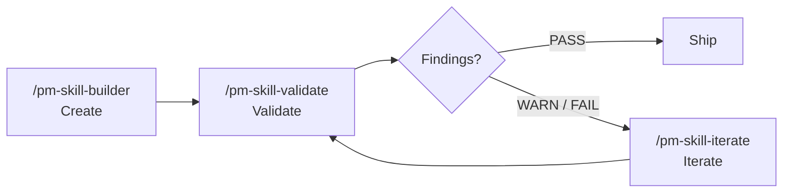

<!--
DRAFT README v9: "Cookbook / recipes-not-classifications". Target ~470 lines vs current 1,305.
Approach: Reframes 59 skills as recipes ("How to write a PRD", "How to run a Foundation Sprint", "How to synthesize 5 interviews"). The catalog becomes the README's spine. After the constrained top, leads with a "Quick recipes" block (12 most-likely-used skills as one-liner recipes with slash commands). Then the full catalog still appears as 8 grouped tables, but the framing is recipe-as-task throughout. Workflows are reframed as "multi-step recipes". Methodology is preserved (shorter section).
Bet: Most readers think in tasks ("I need to write a PRD today"), not classifications ("which phase is this?"). The classification table is a librarian's mental model; the recipe list is a cook's.
Constraints honored:
  - MCP server notice stays at top (closed-by-default <details>).
  - Quick install near top.
  - Recent releases visible at top: human-centered What's New + collapsed release-by-release stack.
-->

<a id="readme-top"></a>

<h1 align="center">PM-Skills</h1>

<p align="center">
  <strong>59 recipes for product management work, ready for your AI agent to run.</strong><br>
  PRDs, OKRs, hypotheses, opportunity trees, retros, Foundation Sprint, Design Sprint, and 50 more,<br>
  each with a method, a worked example, and a slash command.
</p>

<p align="center">
  
  
  
  <a href="LICENSE"></a>
  <a href="https://github.com/product-on-purpose/pm-skills-mcp"></a>
</p>

<p align="center">
  <a href="#install">Install</a> .
  <a href="#whats-new">What's new</a> .
  <a href="#quick-recipes">Quick recipes</a> .
  <a href="#the-full-recipe-book">Full recipe book</a> .
  <a href="#multi-step-recipes-workflows">Workflows</a> .
  <a href="#how-recipes-work">How recipes work</a>
</p>

---

<details>
<summary><strong>MCP server: maintenance mode (effective 2026-05-04)</strong></summary>

The companion [`pm-skills-mcp`](https://github.com/product-on-purpose/pm-skills-mcp) server is in the v2.9.x maintenance line. The MCP catalog is frozen at the v2.9.2 build. Security patches and critical bug fixes continue; recipe parity is paused.

**For new users, the file-based install paths below are the recommended path.** See [MCP Integration](docs/guides/mcp-integration.md) for status details and resumption criteria.

</details>

---

## Install

### Claude Code (recommended)

```
/plugin marketplace add product-on-purpose/pm-skills
/plugin install pm-skills@pm-skills-marketplace
```

All 59 recipes and 66 commands resolve from any directory. Verify with `/plugin list`.

### Any agent supported by the open skills CLI

```bash
npx skills add product-on-purpose/pm-skills
```

Works with Cursor, GitHub Copilot, Cline, and any agent supported by the open [`skills` CLI](https://github.com/vercel-labs/skills).

<details>
<summary><strong>Other platforms (Claude.ai, MCP clients, OpenCode, Cursor, Windsurf, ChatGPT)</strong></summary>

See [docs/getting-started/platforms.md](docs/getting-started/platforms.md) for ZIP-upload flows, MCP configuration JSON, AGENTS.md auto-discovery, and manual copy patterns.

</details>

<p align="right">(<a href="#readme-top">back to top</a>)</p>

---

## What's new

The library is under active development. Here are the changes from the last few releases that are most likely to matter for how you use it.

### Sprint methodologies are now first-class recipes (v2.15.0)

**What changed.** 15 new recipes cover the canonical Foundation Sprint (Knapp/Zeratsky 2-day strategic alignment) and Design Sprint (Knapp/Zeratsky/Kowitz 5-day prototype-and-test), plus a standalone `note-and-vote` recipe (the group-decision mechanic used inside both methods).

**Why it matters.** If you run sprints, you don't have to translate the books into prompts. The agent runs the workshop with you using canonical moves; outputs are workshop artifacts.

**Get started.** [`docs/concepts/foundation-sprint.md`](docs/concepts/foundation-sprint.md) . [`docs/concepts/design-sprint.md`](docs/concepts/design-sprint.md) . Chained: [`_workflows/foundation-to-design.md`](_workflows/foundation-to-design.md).

### Faster, more searchable docs site (v2.14.x line)

**What changed.** Migrated from MkDocs Material to Astro Starlight. Pagefind search, native dark mode, Node 22.x build pipeline. v2.14.1 added the Mermaid style guide; v2.14.2 closed out a cumulative docs hygiene patch.

**Why it matters.** Search actually works (full-text, instant). Forkers: Node 22.x, not Python pip.

**Get started.** [product-on-purpose.github.io/pm-skills](https://product-on-purpose.github.io/pm-skills/). Migration notes: [`docs/internal/release-plans/v2.14.0/`](docs/internal/release-plans/v2.14.0/).

### Active orchestration is now possible (v2.16.0)

**What changed.** First 4 active-orchestration sub-agents shipped. 6-gate pre-tag release runbook codified.

**Why it matters.** Foundation work for chained recipes that don't need human handoffs. Today the dispatch surface is documented; v2.17+ end-to-end automations build on this.

**Get started.** [`docs/reference/runtime-components.md`](docs/reference/runtime-components.md). Release runbook at [`docs/internal/release-plans/v2.16.0/`](docs/internal/release-plans/v2.16.0/).

<details>
<summary><strong>Full release-by-release changelog</strong></summary>

<details open>
<summary><strong>v2.16.0 - Active Orchestration</strong></summary>

- First 4 active orchestration sub-agents shipped.
- 6-gate release runbook codified.
- Release note: [`docs/releases/Release_v2.16.0.md`](docs/releases/Release_v2.16.0.md).

</details>

<details>
<summary><strong>v2.15.0 - Sprint Skills Launch</strong></summary>

- 15 new recipes (7 FS + 7 DS + 1 standalone). Catalog grows 40 to 55.
- 3 new workflows including `foundation-to-design`.
- Release note: [`docs/releases/Release_v2.15.0.md`](docs/releases/Release_v2.15.0.md).

</details>

<details>
<summary><strong>v2.14.x - Doc Stack Migration</strong></summary>

- v2.14.0: Astro Starlight ships.
- v2.14.1: title fix + Mermaid beautification + validators promoted.
- v2.14.2: cumulative docs hygiene patch.

</details>

</details>

Full history: [CHANGELOG.md](CHANGELOG.md) . [Releases](https://github.com/product-on-purpose/pm-skills/releases).

<p align="right">(<a href="#readme-top">back to top</a>)</p>

---

## Quick recipes

The 12 you'll use most often. Try one:

| Recipe | Command | Get |
|---|---|---|
| **Write a PRD** | `/prd "Topic"` | Comprehensive product requirements with problem, metrics, stories, scope |
| **State a testable hypothesis** | `/hypothesis "Belief"` | Falsifiable claim with success metric and falsification criterion |
| **Generate user stories** | `/user-stories "From PRD.md"` | INVEST-compliant stories with acceptance criteria |
| **Synthesize user interviews** | `/interview-synthesis "5 interviews"` | Themes, quotes, opportunity areas, recommended next steps |
| **Run a retro** | `/retrospective "Sprint 47"` | Format-agnostic retro with decisions, action items, owners |
| **Build a persona** | `/persona "Power user of X"` | Evidence-backed persona with confidence indicators |
| **Write an OKR set** | `/okr-writer "Q3 objectives"` | Tight, measurable key results in a structured plan |
| **Design an A/B test** | `/experiment-design "Test idea"` | Sample size, primary metric, success criterion, run plan |
| **Run a Foundation Sprint** | `/foundation-sprint` | 2-day strategic alignment workshop, end-to-end |
| **Run a Design Sprint** | `/design-sprint` | 5-day prototype-and-test workshop, end-to-end |
| **Build an opportunity tree** | `/opportunity-tree "Outcome"` | Teresa Torres-style outcome-to-opportunity-to-solution mapping |
| **Document a decision** | `/adr "Decision title"` | Architecture Decision Record in Nygard format |

That's a fraction of what's in the book. The full catalog of 59 recipes follows.

<p align="right">(<a href="#readme-top">back to top</a>)</p>

---

## The full recipe book

59 recipes across 4 classifications. Pick the chapter that matches your work.

Every recipe ships as a three-file directory:

```
skills/deliver-prd/
  SKILL.md                  <- the method (agent reads this)
  references/
    TEMPLATE.md             <- the structure (output follows this)
    EXAMPLE.md              <- a worked example (sets the quality bar)
```

Full anatomy: [docs/guides/anatomy-of-a-skill.md](docs/guides/anatomy-of-a-skill.md).

### Chapter 1: Discover - recipes for finding the right problem (3)

| Recipe | What you get | Command |
|---|---|---|
| **interview-synthesis** | User research turned into actionable insights | `/interview-synthesis` |
| **competitive-analysis** | Map of the landscape with identified opportunities | `/competitive-analysis` |
| **stakeholder-summary** | Who matters and what they need | `/stakeholder-summary` |

### Chapter 2: Define - recipes for framing the problem (4)

| Recipe | What you get | Command |
|---|---|---|
| **problem-statement** | Crystal-clear problem framing | `/problem-statement` |
| **hypothesis** | Testable assumption with a success metric | `/hypothesis` |
| **opportunity-tree** | Teresa Torres-style outcome mapping | `/opportunity-tree` |
| **jtbd-canvas** | Jobs to be Done canvas | `/jtbd-canvas` |

### Chapter 3: Develop - recipes for exploring solutions (4)

| Recipe | What you get | Command |
|---|---|---|
| **solution-brief** | One-page solution pitch | `/solution-brief` |
| **spike-summary** | Documented technical exploration | `/spike-summary` |
| **adr** | Architecture Decision Record (Nygard format) | `/adr` |
| **design-rationale** | Why you made that design choice | `/design-rationale` |

### Chapter 4: Deliver - recipes for shipping (6)

| Recipe | What you get | Command |
|---|---|---|
| **prd** | Comprehensive product requirements | `/prd` |
| **user-stories** | INVEST-compliant stories with acceptance criteria | `/user-stories` |
| **acceptance-criteria** | Given/When/Then testable scenarios | `/acceptance-criteria` |
| **edge-cases** | Error states, boundaries, recovery paths | `/edge-cases` |
| **launch-checklist** | Complete launch step inventory | `/launch-checklist` |
| **release-notes** | User-facing release communication | `/release-notes` |

### Chapter 5: Measure - recipes for validating with data (5)

| Recipe | What you get | Command |
|---|---|---|
| **experiment-design** | Rigorous A/B test plan | `/experiment-design` |
| **instrumentation-spec** | Event tracking requirements | `/instrumentation-spec` |
| **dashboard-requirements** | Analytics dashboard spec | `/dashboard-requirements` |
| **experiment-results** | Documented experiment learnings | `/experiment-results` |
| **okr-grader** | OKR cycle scoring with KR-level synthesis | `/okr-grader` |

### Chapter 6: Iterate - recipes for learning and improving (4)

| Recipe | What you get | Command |
|---|---|---|
| **retrospective** | Team retro that drives action | `/retrospective` |
| **lessons-log** | Built-up organizational memory | `/lessons-log` |
| **refinement-notes** | Captured backlog refinement outcomes | `/refinement-notes` |
| **pivot-decision** | Evidence-based pivot/persevere call | `/pivot-decision` |

### Chapter 7: Foundation - cross-cutting recipes (8)

| Recipe | What you get | Command |
|---|---|---|
| **persona** | Product or marketing persona with evidence | `/persona` |
| **lean-canvas** | Problem, segment, value prop, metrics on one page | `/lean-canvas` |
| **okr-writer** | OKR plan with tight measurable key results | `/okr-writer` |
| **stakeholder-update** | Stakeholder-facing update from current state | `/stakeholder-update` |
| **meeting-agenda** | Focused agenda from purpose, attendees, time-box | `/meeting-agenda` |
| **meeting-brief** | One-page brief priming attendees with context | `/meeting-brief` |
| **meeting-recap** | Transcript synthesized into decisions and actions | `/meeting-recap` |
| **meeting-synthesize** | Cross-meeting themes from multiple sessions | `/meeting-synthesize` |

### Chapter 8: Foundation Sprint family - 2-day strategic alignment (7)

Canonical Knapp/Zeratsky workshop. Sequenced from readiness through brief. Run the whole arc with `/foundation-sprint` (the workflow), or pick individual recipes.

| Recipe | What you get | Command |
|---|---|---|
| **foundation-sprint-readiness** | Decision tree: is your team ready for an FS? | `/foundation-sprint-readiness` |
| **foundation-sprint-basics** | Customer, problem, competition (founding 3-tuple) | `/foundation-sprint-basics` |
| **foundation-sprint-differentiation** | 2x2 of unique advantages | `/foundation-sprint-differentiation` |
| **foundation-sprint-approach-options** | 3-5 high-level approaches to the problem | `/foundation-sprint-approach-options` |
| **foundation-sprint-magic-lenses** | Approaches scored on 3-4 critical lenses | `/foundation-sprint-magic-lenses` |
| **foundation-sprint-founding-hypothesis** | Chosen approach synthesized into a founding hypothesis | `/foundation-sprint-founding-hypothesis` |
| **foundation-sprint-brief** | One-page brief capturing the full sprint output | `/foundation-sprint-brief` |

### Chapter 9: Design Sprint family - 5-day prototype-and-test (7)

Canonical Knapp/Zeratsky/Kowitz workshop. Sequenced from readiness through test-and-score. Run the whole arc with `/design-sprint` (the workflow), or pick individual recipes.

| Recipe | What you get | Command |
|---|---|---|
| **design-sprint-readiness** | Decision tree: is your team ready for a DS? | `/design-sprint-readiness` |
| **design-sprint-brief** | Pre-sprint brief: long-term goal, sprint questions | `/design-sprint-brief` |
| **design-sprint-map-and-target** | Customer journey map; chosen target | `/design-sprint-map-and-target` |
| **design-sprint-sketch** | Structured 4-step individual sketch session | `/design-sprint-sketch` |
| **design-sprint-decide-and-storyboard** | Heat map, straw poll, decider vote, storyboard | `/design-sprint-decide-and-storyboard` |
| **design-sprint-prototype-plan** | Realistic-enough Friday prototype plan | `/design-sprint-prototype-plan` |
| **design-sprint-test-and-score** | 5 customer interviews, scored patterns, decision | `/design-sprint-test-and-score` |

### Chapter 10: Standalone tool recipe (1)

| Recipe | What you get | Command |
|---|---|---|
| **note-and-vote** | Group decision mechanic (silent note, vote, decider chooses) usable inside any workshop | `/note-and-vote` |

### Chapter 11: Utility - recipes for maintaining the recipe book itself (10)

| Recipe | What you get | Command |
|---|---|---|
| **pm-skill-builder** | New recipe scaffolded with gap analysis and guided drafting | `/pm-skill-builder` |
| **pm-skill-validate** | Audit report against structural conventions and quality criteria | `/pm-skill-validate` |
| **pm-skill-iterate** | Targeted improvements applied from feedback or validation | `/pm-skill-iterate` |
| **mermaid-diagrams** | Syntactically valid Mermaid diagrams for product docs | `/mermaid-diagrams` |
| **slideshow-creator** | Professional presentations from JSON deck specs | `/slideshow-creator` |
| **update-pm-skills** | Local pm-skills install checked and updated | `/update-pm-skills` |

Plus 4 utility recipes for AGENTS.md sync and release tooling. Full source: [`skills/`](skills/). Universal recipe map: [AGENTS.md](AGENTS.md).

<p align="right">(<a href="#readme-top">back to top</a>)</p>

---

## Multi-step recipes (workflows)

Some product work needs more than one recipe in sequence. Workflows are recipe chains with handoff guidance built in.

| Workflow | Best for | Recipes chained |
|---|---|---|
| **[Foundation to Design](_workflows/foundation-to-design.md)** | End-to-end FS-to-DS arc | foundation-sprint-* + design-sprint-* |
| **[Foundation Sprint](_workflows/foundation-sprint.md)** | 2-day strategic alignment | All 7 foundation-sprint recipes |
| **[Design Sprint](_workflows/design-sprint.md)** | 5-day prototype-and-test | All 7 design-sprint recipes |
| **[Feature Kickoff](_workflows/feature-kickoff.md)** | New features | problem-statement, hypothesis, prd, user-stories, launch-checklist |
| **[Lean Startup](_workflows/lean-startup.md)** | Rapid validation | hypothesis, experiment-design, experiment-results, pivot-decision |
| **[Triple Diamond](_workflows/triple-diamond.md)** | Major initiatives | Full 26 phase-recipe flow across 6 phases |
| **[Customer Discovery](_workflows/customer-discovery.md)** | Research synthesis | Raw research into a validated problem |
| **[Sprint Planning](_workflows/sprint-planning.md)** | Sprint prep | Sprint-ready stories from a backlog |
| **[Product Strategy](_workflows/product-strategy.md)** | Strategic initiatives | Framing a major strategic initiative |
| **[Post-Launch Learning](_workflows/post-launch-learning.md)** | Post-launch | Measure results, capture learnings |
| **[Stakeholder Alignment](_workflows/stakeholder-alignment.md)** | Leadership buy-in | Build a case for leadership |
| **[Technical Discovery](_workflows/technical-discovery.md)** | Tech feasibility | Evaluate feasibility and architecture |

Full reference: [docs/reference/workflows/](docs/reference/workflows/).

<p align="right">(<a href="#readme-top">back to top</a>)</p>

---

## How recipes work

A recipe is three files in a directory. When you run `/prd "..."`, the agent loads `SKILL.md` (the method), follows it, fills out `TEMPLATE.md` (the structure), and matches the quality of `EXAMPLE.md` (the worked example). That's the entire mechanism.

Three properties make it work:

1. **Declarative.** The recipe says what a good PRD is, not how to phrase a prompt.
2. **Example-anchored.** The worked example sets the quality bar; the agent mirrors structure, depth, detail.
3. **Structurally contracted.** The template enforces sections-present, sections-complete.

### Built on canonical PM frameworks

Recipes draw from established sources. PM-Skills is opinionated about quality, not opinionated about your process.

| Source | What it gives us |
|---|---|
| [Agent Skills Specification](https://agentskills.io/specification) | Open standard for AI-agent skills |
| [Triple Diamond Framework](https://medium.com/zendesk-creative-blog/the-zendesk-triple-diamond-process-fd857a11c179) | Six-phase product cycle |
| [Foundation Sprint](https://www.jakeknapp.com/foundation-sprint) (Knapp/Zeratsky) | 2-day strategic alignment |
| [Design Sprint](https://www.thesprintbook.com/) (Knapp/Zeratsky/Kowitz) | 5-day prototype-and-test |
| [Opportunity Solution Trees](https://www.producttalk.org/opportunity-solution-tree/) (Teresa Torres) | Outcome-driven discovery |
| [Jobs to be Done](https://jtbd.info/) | Customer-motivation framework |
| [Architecture Decision Records](https://adr.github.io/) (Michael Nygard) | Technical decision documentation |
| [Keep a Changelog](https://keepachangelog.com/) | Structured release docs |

### Writing your own recipe

Three utility recipes form a complete loop:



See [CONTRIBUTING.md](CONTRIBUTING.md) for the recipe-shape contract.

<p align="right">(<a href="#readme-top">back to top</a>)</p>

---

## Project status

| | |
|---|---|
| **Current version** | [v2.16.0](https://github.com/product-on-purpose/pm-skills/releases/tag/v2.16.0) |
| **Recipe count** | 59 (26 phase + 8 foundation + 10 utility + 15 tool) |
| **Spec** | [agentskills.io](https://agentskills.io/specification) |
| **License** | [Apache 2.0](LICENSE) |
| **Docs site** | [product-on-purpose.github.io/pm-skills](https://product-on-purpose.github.io/pm-skills/) |
| **MCP server** | [`pm-skills-mcp`](https://github.com/product-on-purpose/pm-skills-mcp) (maintenance mode) |
| **Changelog** | [CHANGELOG.md](CHANGELOG.md) |
| **FAQ** | [docs/reference/faq.md](docs/reference/faq.md) |

---

## License

Apache 2.0. See [LICENSE](LICENSE). Built on the open [Agent Skills Specification](https://agentskills.io/specification). Sprint methods adapted from Knapp/Zeratsky/Kowitz.

<p align="right">(<a href="#readme-top">back to top</a>)</p>
