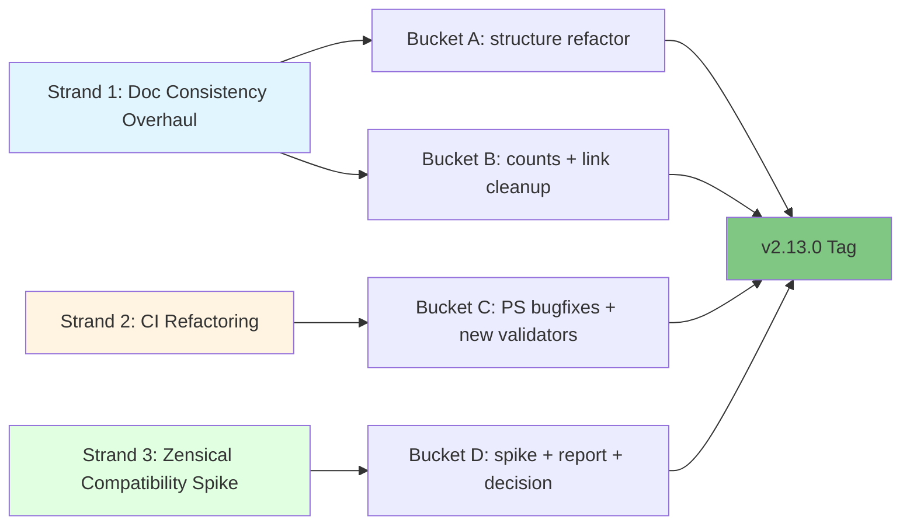

# v2.13.0 Release Plan: Foundation Hardening + Doc Stack Decision

**Status:** Plan (scope locked, decisions pending in Open Questions)
**Owner:** TBD
**Type:** Refactor + decision release (minor)
**Created:** 2026-05-02 (stub) → 2026-05-03 (scope locked, three strands defined)
**Sources:**
- v2.12.0 deferrals (session log Phases 11-12)
- `docs/internal/audit/audit_repo-structure_2026-05-01.md` (15 sections)
- `docs/internal/audit/ci-audit_2026-05-03.md` (gaps G1-G9)
- v2.12.0 session log Phase 10 (Material → Zensical exploration)

> **What this release is.** v2.13.0 ships three coherent strands of cleanup work and one deciding artifact: documentation consistency overhaul, CI refactoring, and a Material for MkDocs to Zensical compatibility spike that decides go/no-go for migration in v2.14.0+. Zero new skills.
>
> **What this release is not.** v2.13.0 is NOT a Zensical migration; the actual migration (if greenlit by the spike) is v2.14.0+ scope. v2.13.0 is also NOT a sample-automation slate cycle; F-29 to F-35 (except F-34) are deferred per the v2.12.0 session log re-eval.

---

## Release Theme

**Foundation Hardening + Doc Stack Decision.** The "Foundation Hardening" portion captures the doc-consistency and CI strands under one banner  -  make the repo less drift-prone so future skill releases inherit a hard floor instead of accumulating silent rot. The "+ Doc Stack Decision" portion telegraphs that the Zensical spike is a deciding artifact, not a migration commitment  -  it tees up v2.14.0+ rather than landing in v2.13.0 itself.

v2.12.0 demonstrated the cost of soft-floor drift by needing 4 release-state Codex review rounds catching 9 distinct MEDIUM defects across rendered docs, anatomy frontmatter examples, version data, and audit-trail accuracy. v2.13.0 closes that class of issue at the CI layer and clarifies the doc stack's medium-term direction.

---

## The three strands

1. **Doc consistency overhaul**  -  sourced from `audit_repo-structure_2026-05-01.md` Sections 9 (Tiers 1-3) and 13 (Refactor Patterns). Resolves stale counts, generated-content markers, the duplicate-files question, and authoring-guide consolidation.
2. **CI refactoring**  -  sourced from `ci-audit_2026-05-03.md` (G1-G9) and `audit_repo-structure_2026-05-01.md` Section 14 (proposals 14.1-14.8) plus v2.12.0 session log Phase 11 (5 PowerShell parity bugs). Detail in [`plan_v2.13_ci-refactor.md`](plan_v2.13_ci-refactor.md).
3. **Zensical compatibility spike**  -  sourced from v2.12.0 session log Phase 10. Time-boxed deciding artifact. Detail in [`plan_v2.13_zensical-spike.md`](plan_v2.13_zensical-spike.md).

---

## Progress Dashboard

**Overall:** 16 of 27 work items shipped (59%); pre-release gates 0 of 5
**Current focus:** Bucket B (count + link cleanup) OR Bucket D (Zensical spike)
**Last updated:** 2026-05-04

Per-bucket totals: A=4, B=9, C=12, D=2 = 27 items. Shipped: A.1 + A.2 + A.3 + A.4 + Wave 1 (7 items) + Wave 2 (2 items) + Wave 3 (3 items) = 16. **Buckets A and C complete.**

### Status legend

- ✅ Shipped (commit identified)
- 🟡 In progress (work started, not committed)
- ⬜ Not started
- ⛔ Blocked (dependency identified)

### Bucket A  -  Doc structure refactor (4 of 4 = 100% ✓)

| # | Item | Status | Evidence / Notes |
|---|------|--------|------------------|
| A.1 | Frameworks folder delete + `triple-diamond` rename | ✅ Shipped | commit `4190f45` |
| A.2 | Cross-folder reorg: 4 moves out of `concepts/` to `reference/` + `guides/` | ✅ Shipped | commit `4190f45` |
| A.3 | Authoring guide consolidation: `creating-skills` → `creating-pm-skills`, delete `authoring-pm-skills` | ✅ Shipped | commit `4190f45` |
| A.4 | Pattern 5C generated frontmatter flag (63 pages: 38 skills + 8 phase indices + 1 commands ref + 9 workflows + 1 workflow index + 3 showcase + 1 showcase index + commands ref) | ✅ Shipped | this session; unblocks Bucket C Wave 2 |

### Bucket B  -  Doc count + link cleanup (0 of 9 = 0%)

| # | Item | Status | Notes |
|---|------|--------|-------|
| B.1 | Reconcile counts across 6 docs (skill-anatomy, categories, ecosystem, project-structure, mcp-integration, getting-started) | ⬜ Not started | Audit Tier 1 #2-3, Tier 2 #7 |
| B.2 | `mkdocs.yml site_description` 32→40, `skills/index.md` + `showcase/index.md` "do not edit" banners | ⬜ Not started | Audit Tier 1 #1, #4, #5 |
| B.3 | `utility-pm-skill-builder` SKILL.md catalog table | ⬜ Not started | Foundation 1→8, Utility 1→6, Domain 25→26 |
| B.4 | `docs/guides/mcp-setup.md` frozen-MCP framing | ⬜ Not started | "all 38" → frozen at 28 per M-22 |
| B.5 | `AGENTS/codex/CONTEXT.md` decision: refresh OR vestigial-redirect | ⬜ Not started | v2.12.0 session log carryover |
| B.6 | README "What's New" inline-version-prefix workaround | ⬜ Not started | Generated section vs section-aware count CI |
| B.7 | F-34: `THREAD_PROFILES.md` standalone reference doc | ⬜ Not started | Lifted from old Bucket E |
| B.8 | `docs/reference/project-structure.md` full reconciliation | ⬜ Not started | A.1 patched 4 lines; full sweep needed |
| B.9 | `docs/guides/index.md` full guide listing (currently 5 of ~13) | ⬜ Not started | Audit Tier 2 |

### Bucket C  -  CI hardening (12 of 12 = 100% ✓)

Detail at [`plan_v2.13_ci-refactor.md`](plan_v2.13_ci-refactor.md).

| # | Item | Status | Evidence / Notes |
|---|------|--------|------------------|
| C.W1 | Wave 1: 5 PS parity bugfixes + count regex tighten + nav-completeness validator (7 items) | ✅ Shipped | prior session, PR #140 |
| C.W2.1 | `check-generated-content-untouched` validator | ✅ Shipped | this session; enforcing; pairs with Pattern 5C |
| C.W2.2 | `validate-references-cross-doc` validator | ✅ Shipped | this session; enforcing; PASS on current state |
| C.W3 | Wave 3: docs frontmatter + internal links + version refs + F-36 family validator (3 items) | ✅ Shipped | prior session, PR #140 |

### Bucket D  -  Zensical compatibility spike (0 of 2 = 0%)

Detail at [`plan_v2.13_zensical-spike.md`](plan_v2.13_zensical-spike.md).

| # | Item | Status | Notes |
|---|------|--------|-------|
| D.1 | Execute Zensical spike against current `mkdocs.yml` | ⬜ Not started | Needs `pip install zensical` approval; 60-min time-box |
| D.2 | Write spike report with GO / GO-WITH-CAVEATS / NO-GO decision | ⬜ Not started | Output: `plan_v2.13_zensical-spike-report_YYYY-MM-DD.md` |

### Pre-release gates (Phase 6, executed at tag time)

| # | Item | Status |
|---|------|--------|
| PR.1 | Per-strand Phase 0 adversarial review loops (Bucket A, Bucket C new validators, Bucket D spike) | ⬜ Not started |
| PR.2 | Release-state Phase 0 adversarial review loop | ⬜ Not started |
| PR.3 | Generator regen pre-release (mandatory) | ⬜ Not started |
| PR.4 | Pre-release checklist all green ([`plan_v2.13_pre-release-checklist.md`](plan_v2.13_pre-release-checklist.md)) | ⬜ Not started |
| PR.5 | CHANGELOG.md + Release_v2.13.0.md authored | ⬜ Not started |

---

## Status Snapshot (updated 2026-05-04)

| Item                          | Status                                                                                                                                          |
| ----------------------------- | ----------------------------------------------------------------------------------------------------------------------------------------------- |
| Plan                          | Scope locked; bucket inventory drafted; Open Questions pending maintainer decisions                                                             |
| Source: doc-structure audit   | `docs/internal/audit/audit_repo-structure_2026-05-01.md`                                                                                        |
| Source: CI audit (full)       | `docs/internal/audit/ci-audit_2026-05-03.md`                                                                                                    |
| Source: branches + PR audit   | `docs/internal/audit/branches-pr_2026-05-03.md`                                                                                                 |
| Source: v2.12.0 session log   | `AGENTS/claude/SESSION-LOG/2026-05-03_v2.12.0-tag-ship-and-v2.13-handoff_session.md`                                                            |
| CI refactor strand-level plan | [`plan_v2.13_ci-refactor.md`](plan_v2.13_ci-refactor.md) - drafted 2026-05-03; **Wave 1 + Wave 3 complete 2026-05-03 to 2026-05-04**            |
| Zensical spike plan           | [`plan_v2.13_zensical-spike.md`](plan_v2.13_zensical-spike.md) - drafted 2026-05-03                                                             |
| Pre-release checklist         | [`plan_v2.13_pre-release-checklist.md`](plan_v2.13_pre-release-checklist.md) - drafted 2026-05-03                                               |
| Skills manifest               | `skills-manifest.yaml` - drafted 2026-05-03 (empty by design)                                                                                   |
| Theme decision                | Foundation Hardening + Doc Stack Decision (locked)                                                                                              |
| Effort numbering convention   | No new F-XX effort docs for v2.13 mechanical work; existing F-29 to F-37 retained as deferral records                                           |
| Worktree                      | `E:\Projects\product-on-purpose\pm-skills_worktrees\v2.13-cycle` (branch `v2.13/cycle`); pushed to origin 2026-05-04                            |
| Active PR                     | [#140](https://github.com/product-on-purpose/pm-skills/pull/140) (draft) - opened 2026-05-04 to trigger CI verification on Wave 1 + Wave 3 work |
| Bucket-level progress         | See [Progress Dashboard](#progress-dashboard) above for item-level status                                                                       |
| Validator inventory           | 17 → 24 (net +7); enforcing tier 5 → 9 (Wave 1's nav-completeness + Wave 2's 2 enforcing + F-36 enforcing). All Bucket C deliverables shipped.   |
| Tag target                    | TBD                                                                                                                                             |

---

## Scope: Buckets A through D

The work below is bucketed for clarity. Each bucket can ship independently. Per-item detail for Buckets C and D lives in their respective strand-level docs.

### Bucket A  -  Doc structure refactor (architectural)

**Source:** `audit_repo-structure_2026-05-01.md` Sections 3.5, 5.4, 9.5 Phase B; Pattern 3 + Pattern 5C.

| Item | Source | Effort | Default |
|---|---|---|---|
| Resolve duplicate top-level files (`docs/getting-started.md`, `docs/pm-skill-anatomy.md`, `docs/agent-skill-anatomy.md`, `docs/pm-skill-lifecycle.md`) | Audit 3.5 | Medium | **Option C  -  delete duplicates, redirect via `mkdocs-redirects` plugin** (already enabled). See OQ-1. |
| Retire `docs/frameworks/` (single excluded file) | Audit 5.4 | Small | **Delete folder; merge content into `docs/concepts/triple-diamond.md`.** See OQ-2. |
| Consolidate `creating-skills.md` and `authoring-pm-skills.md` | Audit Pattern 3 | Small | **Keep `creating-skills.md` as canonical**; redirect `authoring-pm-skills.md`. See OQ-3. |
| Add Pattern 5C frontmatter `generated: true` flag to all generated pages | Audit Pattern 5 | Small | **Adopt 5C** (frontmatter flag). Pairs with new CI validator in Bucket C item 7. See OQ-4. |

### Bucket B  -  Doc count + link cleanup (mechanical)

**Source:** `audit_repo-structure_2026-05-01.md` Sections 7, 9 Tier 1-2; v2.12.0 session log Phase 12.

| Item | Source | Effort |
|---|---|---|
| Reconcile counts across `concepts/skill-anatomy.md`, `reference/categories.md`, `reference/ecosystem.md`, `reference/project-structure.md`, `guides/mcp-integration.md`, `getting-started.md` | Audit Tier 1 #2-3, Tier 2 #7 | Small |
| `mkdocs.yml site_description` 32→40, `docs/guides/index.md` to all 13 guides, `docs/skills/index.md` and `docs/showcase/index.md` "do not edit" banners | Audit Tier 1 #1, #4, #5 | Trivial |
| `utility-pm-skill-builder` SKILL.md catalog table: Foundation (1)→(8), Utility (1)→(6), Domain (25)→(26) with row additions | v2.12.0 session log Phase 12 | Small |
| `docs/guides/mcp-setup.md` "all 38 PM skills via MCP" rewrite for accurate frozen-MCP framing (frozen at 28 per M-22) | v2.12.0 session log | Small |
| `AGENTS/codex/CONTEXT.md` decision: active maintenance refresh OR vestigial-redirect | v2.12.0 session log | Small |
| README "What's New" inline-version-prefix workaround replacement (section-aware count-CI OR generated section sourced from CHANGELOG) | v2.12.0 session log | Medium |
| F-34: THREAD_PROFILES.md reference (lifted from old Bucket E sample-automation slate as standalone reference doc) | v2.12.0 deferral | Small |

### Bucket C  -  CI hardening

**Detail:** [`plan_v2.13_ci-refactor.md`](plan_v2.13_ci-refactor.md) (12 items across 3 waves).

Summary at this level:

| Wave | Items | Calendar effort |
|---|---|---|
| Wave 1: Prerequisites | 5 PS parity bugfixes + count-CI regex tighten + nav-completeness validator | ~1 week |
| Wave 2: After Bucket A lands | Generated-content untouched + cross-doc references validators | ~3-4 days |
| Wave 3: Durable improvements | Docs frontmatter + internal links + version refs + F-36 family validator | ~1-2 weeks |

After v2.13: validator inventory grows from 17 to 24 scripts. CI matrix posture (Ubuntu + Windows, bash + pwsh) unchanged. Strategic question raised but deferred to v2.14.0+ (bash + PS1 dual-stack consolidation).

### Bucket D  -  Zensical compatibility spike

**Detail:** [`plan_v2.13_zensical-spike.md`](plan_v2.13_zensical-spike.md).

Summary at this level:

| Item | Effort | Output |
|---|---|---|
| Execute Zensical spike against current `mkdocs.yml`; produce spike report | Half-day execution + half-day report | `plan_v2.13_zensical-spike-report_YYYY-MM-DD.md` with GO / GO-WITH-CAVEATS / NO-GO decision |
| Conditional: Plan B (Astro Starlight) effort doc IF spike returns NO-GO | Defer to separate effort | `docs/internal/efforts/...` (only if triggered) |

Decision rubric, plugin compatibility checklist, time-box, and Plan B trigger conditions all in the strand doc.

---

## Deferred from v2.13 (single consolidated table)

Per session log Phase 12 re-evaluation. These remain in backlog with effort docs intact; no edits to those docs in v2.13 scope.

| ID | Title | Why deferred | Re-eval at |
|---|---|---|---|
| F-29 | Meeting Lifecycle Workflow | Time-gated on real-world meeting-skills usage feedback that has not yet arrived | v2.14.0+ |
| F-30 | Family Adoption Guide | Time-gated on at least one team's adoption experience | v2.14.0+ |
| F-31 | pm-skill-validate Family + Sample Awareness | May be obsolete after v2.12.0 builder cleanup; re-eval before v2.14 | v2.14.0+ |
| F-32 | pm-skill-builder Sample Generation | Same reasoning as F-31 | v2.14.0+ |
| F-33 | check-sample-standards CI Script | Same reasoning as F-31 | v2.14.0+ |
| F-35 | pm-skill-iterate Sample Regeneration | Same reasoning as F-31 | v2.14.0+ |
| F-37 | HTML Template Creator | Conflicts with v2.13 "no new skills" guard | v2.14.0+ |
| Pattern 1 | Single-source content with build-time projection | Only relevant if OQ-1 picks Option A; default is C | Skip |
| Pattern 2 | Frontmatter-driven counts via mkdocs-macros-plugin | Adds dependency; CI tightening (Bucket C item 5) gets most of the win without it | v2.14.0+ pending Zensical decision |
| Pattern 4 | Unified generation pipeline `scripts/_lib/` | Nice DRY win; not urgent | Indefinite |
| Pattern 5A | Move generated outputs to `docs/_generated/` | High churn, breaks deep links; 5C is cheaper substitute | Skip |
| 14.5 | `check-duplicate-doc-divergence` validator | Only relevant if OQ-1 picks Option A | Skip if C |

**Lifted from old Bucket E into Bucket B:** F-34 (THREAD_PROFILES.md)  -  small standalone reference doc independent of the broader sample-automation slate.

**Lifted from old Bucket C into Bucket C strand doc:** F-36 (generic family-registration validator)  -  net-new validator, not a deferral.

---

## Out of Scope

Explicit guards to prevent the scope creep risk noted at the v2.12.0 to v2.13.0 strategy turn:

1. **No new PM skills.** v2.13.0 ships zero new skill artifacts. F-37 (HTML Template Creator) and any future skill ideas remain in backlog for v2.14.0+.
2. **No actual Zensical migration.** v2.13.0 ships only the spike + decision. Migration is v2.14.0+ if greenlit.
3. **No MCP work.** MCP server remains frozen per M-22.
4. **No retroactive HISTORY.md backfill.** HISTORY.md governance is unchanged.
5. **No marketplace.json structural changes.** Continue treating it as version-mirror only.
6. **No new external runtime dependencies.** mkdocs plugin set unchanged in v2.13. Zensical install for spike is venv-isolated and does not become a runtime dependency. `mkdocs-macros-plugin` (Pattern 2) deferred. Lychee for link-checking adopted in CI only.
7. **No bash + PS1 dual-stack consolidation.** Strategic question raised in CI doc but deferred to v2.14.0+.
8. **No branches/PR cleanup beyond Tier 1 from `branches-pr_2026-05-03.md`.** Orphan `claude/*` branch salvage is independent housekeeping not on v2.13 critical path.

---

## Decisions (provisional, defaults to confirm in Open Questions)

| Decision | Choice | Rationale |
|---|---|---|
| **v2.13.0 theme** | Foundation Hardening + Doc Stack Decision | Captures three strands under one banner |
| **Effort doc convention for v2.13** | No new F-XX effort docs for mechanical work | Effort docs add overhead for refactor-cycle work; plan tables are sufficient |
| **Audit naming convention** | Defer | Discussed but not committed; current filenames retained |
| **Adversarial review** | Per-strand AND release-state Phase 0 loops | Per v2.11.0 codification + v2.12.0 release-state extension |
| **Generator regen** | Mandatory pre-release | All 3 Python generators must re-run cleanly; new `check-generated-content-untouched` validator enforces |
| **Zensical migration target** | Decided by spike outcome | GO → v2.14.0 commitment; NO-GO → Plan B (Astro Starlight) deferred to separate effort |
| **Naming convention (locked 2026-05-04)** | `pm-skill-*` filename prefix for PM-Skills-specific content; no prefix for cross-platform/agent-skill content | Reverses MkDocs migration's "lump everything under concepts" simplification. Filename signals scope (PM-specific vs generic) at a glance, independent of folder. |
| **Folder semantics (locked 2026-05-04)** | concepts/ = generic explanatory; reference/ = PM-Skills lookup material; guides/ = PM-Skills how-to material | Aligns to Diátaxis 4-quadrant doc taxonomy. Pre-A2 reorg, concepts/ was effectively a junk drawer holding PM-Skills-specific anatomy/lifecycle/versioning/comparisons; post-reorg, all 3 folders match their semantic purpose and reader's mode of use (scan vs follow). |

---

## Open Questions (decisions required, defaults pre-filled)

| # | Question | Source | Default | Decision (TBD) |
|---|---|---|---|---|
| **OQ-1** | Duplicate top-level files: Option A (keep + warn), B (single source generated), or C (delete + redirect)? | Audit 3.5 | **C  -  delete duplicates, redirect via `mkdocs-redirects`** (smallest ongoing maintenance) | **Resolved 2026-05-04: Option C executed.** All 4 top-level legacy duplicates deleted; redirects in mkdocs.yml. Real drift was 60 of 3,226 lines for agent-skill-anatomy and 21 of 1,495 lines for getting-started after CR-strip; canonical was strictly newer in all cases. |
| **OQ-2** | `docs/frameworks/` folder (1 excluded file): delete or promote? | Audit 5.4 | **Delete folder; merge content into `docs/concepts/triple-diamond.md`** | **Resolved 2026-05-04: deleted folder.** Content was byte-identical to canonical (no merge needed). Canonical also renamed `concepts/triple-diamond.md` → `concepts/triple-diamond-delivery-process.md` for descriptive accuracy. |
| **OQ-3** | `creating-skills.md` vs `authoring-pm-skills.md`  -  which is canonical? | Audit Pattern 3 | **Keep `creating-skills.md` as canonical**; redirect the other | **Resolved 2026-05-04: renamed canonical to `creating-pm-skills.md`** per the locked `pm-skill-*` naming convention; deleted authoring duplicate; both old paths redirect to new. |
| **OQ-4** | Pattern 5 (generated-content marker): adopt 5A (filesystem move), 5B (banner comment), or 5C (frontmatter `generated: true`)? | Audit Pattern 5 | **5C  -  frontmatter flag** (least disruptive, most automatable, pairs with new CI script) | **Resolved 2026-05-04: Option 5C executed.** All 3 generators (`generate-skill-pages.py`, `generate-workflow-pages.py`, `generate-showcase.py`) now emit `generated: true` + `source:` frontmatter fields and a visible `!!! warning "Generated file"` admonition pointing editors to the source. Coverage: 63 generated pages (38 skill + 8 phase indices + 1 commands ref + 9 workflows + 1 workflow index + 3 showcase + 1 showcase index). Unblocks Bucket C Wave 2 item 7 (`check-generated-content-untouched`). |
| **OQ-5** | Pattern 2 (frontmatter-driven counts via mkdocs-macros-plugin): adopt in v2.13 or defer? | Audit Pattern 2 | **Defer to v2.14.0+** pending Zensical decision (depends on which engine renders) | TBD |
| **OQ-6** | F-37 HTML Template Creator: include in v2.13 or defer? | Working tree untracked | **Defer to v2.14.0+**  -  conflicts with "no new skills" guard | TBD |
| **OQ-7** | Sample-automation slate F-29 to F-36 except F-34: defer all? | Session log re-eval | **Defer all except F-34** (lifted into Bucket B) and F-36 (lifted into Bucket C strand doc as generic family validator) | TBD |

These resolve doc-reorg architectural questions. Bucket C (CI) and Bucket D (Zensical) have their own internal decisions documented in their respective strand docs; they don't surface here.

---

## Sequencing Proposal

Cross-references audit Section 9.5 (Phase A-D) and CI strand doc Section 5 (Wave 1-3). One PR per logical unit where feasible; some can run in parallel.

### Phase 1. Mechanical fixes + CI Wave 1 (week 1-2)

Bucket B in full + Bucket C Wave 1 (5 PS bugfixes + count regex tighten + nav-completeness validator). Lowest risk, highest signal-to-effort. Can land before architectural decisions.

### Phase 2. Architectural decisions (week 2-3)

Bucket A. Each item one PR. Resolves duplicate-file question (OQ-1), frameworks folder (OQ-2), authoring-guide consolidation (OQ-3), Pattern 5C adoption (OQ-4) once and durably.

### Phase 3. CI Wave 2 (week 3)

Bucket C Wave 2 (generated-content untouched, cross-doc references validators). Depends on Bucket A landing so the file set is stable.

### Phase 4. Zensical spike (week 3, parallel)

Bucket D. Half-day execution + half-day report. Produces decision artifact for v2.14.0+. Can run in parallel with Phase 3 since it's independent.

### Phase 5. CI Wave 3 (week 4-5)

Bucket C Wave 3 (docs frontmatter, internal links, version refs, F-36 family validator). Independent durable improvements.

### Phase 6. Pre-release polish (week 5-6)

Per-strand Phase 0 Adversarial Review Loops + release-state Phase 0 Loop + generator regen + version bumps + tag.

---

## Outcomes at v2.13.0 Tag Time

What shipping the full v2.13.0 release produces, by audience and by effect.

### What stays the same (skill consumers see no change)

| Area | State at v2.13.0 |
|------|------------------|
| PM skills count | 40 (26 phase + 8 foundation + 6 utility); zero added, zero removed |
| Skill content (`skills/*/SKILL.md`) | Untouched |
| Workflows | Unchanged (9 workflows) |
| Library samples | Unchanged (120 samples) |
| MCP server | Frozen at 28 skills per M-22 |
| License | Apache 2.0 |
| agentskills.io spec compliance | Unchanged |
| Doc stack runtime | MkDocs Material (Zensical spike is venv-isolated; not a runtime dependency) |
| AGENTS.md skill discovery | Unchanged |

### What changes (visible in the rendered docs)

| Change | Source | User-facing effect |
|--------|--------|--------------------|
| 6 doc files renamed with `pm-skill-*` prefix | Bucket A | Filenames signal scope (PM-specific vs generic) at a glance |
| 5 docs reorganized into Diátaxis-aligned folders | Bucket A | `concepts/` = generic; `reference/` = lookup; `guides/` = how-to |
| 6 legacy duplicate files deleted | Bucket A | Single source of truth per concept |
| `docs/frameworks/` folder retired | Bucket A | `mkdocs.yml exclude_docs:` reduced 8 → 2 |
| 63 generated pages get a "do not edit" banner | Bucket A.4 | Visible warning + `generated: true` + `source:` frontmatter fields |
| ~12 stale counts reconciled | Bucket B | Numbers match across skill catalog, mcp-setup, README, project-structure, guides/index |
| 12 broken internal links fixed | Bucket B | Click-throughs work everywhere |
| 10 redirect entries in `mkdocs.yml` | Bucket A | Old bookmarks still reach new locations |

### What's new (under the hood)

| Item | Effect |
|------|--------|
| Validator inventory 17 → 24 | 7 new automated checks |
| Enforcing validators 5 → 7 | Stricter gate on PRs |
| `check-generated-content-untouched` | Future hand-edits to generated pages rejected at CI |
| `validate-references-cross-doc` | Internal-link breakage caught at CI |
| `check-internal-link-validity` (advisory) | Reports broken links without blocking |
| `check-version-references` (advisory) | Surfaces stale version mentions |
| `check-docs-frontmatter` | Frontmatter consistency across docs |
| `nav-completeness` | Every doc reachable from `mkdocs.yml` nav |
| F-36 generic family-registration validator | `validate-meeting-skills-family` becomes a thin wrapper |
| 5 PowerShell parity bugfixes | PS1 scripts now bash-equivalent |
| Pattern 5C frontmatter flag | `generated: true` on all generated pages, machine-readable |

### Decision artifact: Zensical compatibility

| Output | Effect |
|--------|--------|
| `plan_v2.13_zensical-spike-report_YYYY-MM-DD.md` | GO / GO-WITH-CAVEATS / NO-GO decision tees up v2.14.0+ |
| If GO: v2.14.0 commits to Zensical migration | Plan B (Astro Starlight) shelved |
| If NO-GO: Plan B (Astro Starlight) becomes its own effort doc | v2.14.0 evaluates the alternative |
| Zero runtime impact in v2.13.0 either way | MkDocs Material stays as the runtime stack through v2.13 |

### What's deferred to v2.14.0+ (explicit out-of-scope guards)

| Item | Why deferred |
|------|--------------|
| Zensical migration itself | v2.13 ships only the spike + decision; migration is v2.14+ if greenlit |
| F-37 HTML Template Creator | Conflicts with "no new skills" guard |
| F-29 Meeting Lifecycle Workflow | Time-gated on real-world meeting-skills usage feedback |
| F-30 Family Adoption Guide | Time-gated on at least one team's adoption experience |
| F-31 / F-32 / F-33 / F-35 sample-automation slate | May be obsolete after v2.12.0 builder cleanup; re-eval before v2.14 |
| `mkdocs-macros-plugin` (Pattern 2) | Adds dependency; defer pending Zensical decision |
| Bash + PS1 dual-stack consolidation | v2.14+ strategic question |
| MCP server unfreeze | Frozen per M-22; revisit when team adoption demand justifies |

### Audience reads

| Audience | Experience post-v2.13.0 |
|----------|--------------------------|
| **New visitor cloning the repo** | Cleaner nav. Doc folders match Diátaxis. Skill content identical to v2.12.0. |
| **Existing user with bookmarked paths** | Redirects catch every old URL (10 redirect entries in `mkdocs.yml`) |
| **PR contributor** | Stronger CI catches silent rot. Generator output protected from hand-edits. PowerShell bugs fixed. |
| **Maintainer (you)** | Lower drift-accumulation rate. Foundation for the Zensical decision in v2.14. v2.12.0's 9-defect-across-4-rounds review experience does not repeat. |
| **Skill consumer** (someone using `deliver-prd`, `define-jtbd-canvas`, etc.) | Identical PM skill behavior. No visible change. |

### Acceptance criteria for tag readiness

The release is tag-ready when all of these are true:

- [ ] All Bucket A items shipped (A.1, A.2, A.3, A.4)
- [ ] All Bucket B items shipped (B.1 through B.9)
- [ ] All Bucket C waves shipped (Wave 1, Wave 2, Wave 3 = 12 CI items total)
- [ ] Bucket D spike report written with GO / GO-WITH-CAVEATS / NO-GO decision
- [ ] All 7 new validators returning clean (or advisory-only with documented findings)
- [ ] `mkdocs build --strict` passes
- [ ] Generator regen produces clean output (mandatory pre-release)
- [ ] All 4 Phase 0 adversarial review loops converged (per-strand x3 + release-state x1)
- [ ] Pre-release checklist ([`plan_v2.13_pre-release-checklist.md`](plan_v2.13_pre-release-checklist.md)) all items checked
- [ ] CHANGELOG.md v2.13.0 entry written
- [ ] Release_v2.13.0.md drafted
- [ ] No em-dash (U+2014) or en-dash (U+2013) characters anywhere in repo (standing rule per CLAUDE.md)
- [ ] No new external runtime dependencies introduced

---

## CI That Applies

Standard release validators plus the 7 new ones added in Bucket C. After Bucket C ships, validator inventory grows from 17 to 24. CI matrix posture (Ubuntu + Windows, bash + pwsh) unchanged.

| Workflow | Notes |
|---|---|
| `lint-skills-frontmatter` | Unchanged. v2.13.0 ships no new skills (40 → 40). PS1 false-positive bug fixed in Bucket C item 4. |
| `validate-commands` | Unchanged. 47 commands. |
| `validate-agents-md` | Unchanged. 40 paths. |
| `validate-skills-manifest` | v2.13.0 manifest is empty (no skill version bumps). |
| `validate-meeting-skills-family` | Becomes thin wrapper around new generic validator (F-36 in Bucket C item 12). |
| `check-count-consistency` | Tightened in Bucket C item 5; promoted to enforcing for current-state files. |
| 7 new validators in Bucket C | Added to `validation.yml` per existing `.sh + .ps1 + .md` triplet convention. Detail in CI strand doc. |

Detail at [`plan_v2.13_ci-refactor.md`](plan_v2.13_ci-refactor.md) Section 6.

---

## MCP Impact

| Question | Answer |
|---|---|
| New MCP tools needed? | No. MCP server frozen per M-22. |
| Skill count drift relative to MCP | MCP at 28; repo at 40 going into v2.13.0; v2.13.0 adds 0 new skills. Gap unchanged. |
| Separate MCP release required? | No. |

---

## Pre-release Checklist

Detail at [`plan_v2.13_pre-release-checklist.md`](plan_v2.13_pre-release-checklist.md). Adapted from v2.11.0 template with v2.13-specific gates (no skill fidelity checks, three-strand verification, per-strand AND release-state Phase 0 loops per v2.12.0 codification).

Top-level summary:

- [ ] Phase 0 per-strand adversarial review loops (Bucket A, Bucket C new validators, Bucket D spike report)
- [ ] Phase 0 release-state adversarial review loop
- [ ] Phase 1 mechanical CI all green (including 7 new validators)
- [ ] Phase 2 strand-level fidelity (4 sub-checks: A, B, C, D)
- [ ] Phase 3 discoverability (README, CHANGELOG, release notes, AGENTS docs all updated)
- [ ] Phase 4 release coordination (plan + CI + spike docs all marked Executed)
- [ ] Phase 5 tag-time chores (CHANGELOG, Release_v2.13.0.md, plugin/marketplace bumps, tag, push, gh release)
- [ ] Phase 6 post-release signals identified for v2.14.0 input

---

## Risk Register

| Risk | Mitigation |
|---|---|
| Scope creep ("while I'm here" additions to a refactor release) | Out of Scope section is binding; deviations require explicit approval |
| Bucket A doc-restructure breaks external links | `mkdocs-redirects` plugin entries; smoke-test top inbound paths after deploy |
| New CI validators produce false positives blocking unrelated PRs | Promote each new script to enforcing only after spike-tested at low false-positive rate; `check-version-references` starts advisory |
| Zensical spike runs over time-box | Hard 60-min ceiling; if exceeded, document partial findings and stop |
| Spike returns NO-GO and Plan B becomes urgent | Plan B (Astro Starlight) is its own effort doc with its own time-box; not v2.13 scope |
| Bash + PS1 dual-stack maintenance becomes worse during v2.13 (more bugs surface) | Capture maintenance cost data; surface as v2.14.0 strategic decision |
| Sample-automation slate (F-31 to F-35) gets re-included mid-cycle | Deferral is binding; re-eval gated on v2.14.0 cut, not v2.13 |
| Pattern 2 adoption attempted mid-cycle | Explicitly out of scope; defer to v2.14.0+ pending Zensical decision |

---

## Related

- v2.12.0 release plan: [`../v2.12.0/plan_v2.12.0.md`](../v2.12.0/plan_v2.12.0.md)
- v2.11.0 release plan: [`../v2.11.0/plan_v2.11.0.md`](../v2.11.0/plan_v2.11.0.md)
- v2.11.0 pre-release checklist (template): [`../v2.11.0/plan_v2.11_pre-release-checklist.md`](../v2.11.0/plan_v2.11_pre-release-checklist.md)
- Doc-structure audit: [`../../audit/audit_repo-structure_2026-05-01.md`](../../audit/audit_repo-structure_2026-05-01.md)
- CI audit (full): [`../../audit/ci-audit_2026-05-03.md`](../../audit/ci-audit_2026-05-03.md)
- Branches/PR audit: [`../../audit/branches-pr_2026-05-03.md`](../../audit/branches-pr_2026-05-03.md)
- v2.12.0 session log (handoff): [`../../../../AGENTS/claude/SESSION-LOG/2026-05-03_v2.12.0-tag-ship-and-v2.13-handoff_session.md`](../../../../AGENTS/claude/SESSION-LOG/2026-05-03_v2.12.0-tag-ship-and-v2.13-handoff_session.md)
- Strand-level docs:
  - CI refactor: [`./plan_v2.13_ci-refactor.md`](plan_v2.13_ci-refactor.md)
  - Zensical spike: [`./plan_v2.13_zensical-spike.md`](plan_v2.13_zensical-spike.md)
  - Pre-release checklist: [`./plan_v2.13_pre-release-checklist.md`](plan_v2.13_pre-release-checklist.md)
- Backlog canonical: [`../../backlog-canonical.md`](../../backlog-canonical.md)
- Existing effort docs (deferred to v2.14.0+): F-29, F-30, F-31, F-32, F-33, F-35, F-37 in `docs/internal/efforts/`

---

## Change Log

| Date | Change |
|---|---|
| 2026-05-02 | Stub created based on v2.12.0 deferrals + 2026-05-01 audits. Theme: Foundation Hardening. Six buckets (A-F) drafted. Four open questions. |
| 2026-05-03 | Scope locked: three strands (doc consistency + CI refactor + Zensical compatibility spike). Theme updated to "Foundation Hardening + Doc Stack Decision". Buckets restructured to A-D (old E + F dissolved into deferral table). Bucket E sample-automation slate deferred all except F-34 (lifted into B). Bucket F refactor patterns 1/2/4/5A deferred. Pattern 5C adopted as default (lifted into A). F-36 lifted into C strand doc. F-37 deferred. Open Questions reduced to 7 with my proposed defaults pre-filled. CI strand doc, Zensical spike doc, pre-release checklist, and skills-manifest authored as siblings. No new F-XX effort docs (effort-doc convention paused for v2.13 mechanical work per maintainer feedback on doc bloat). |
| 2026-05-04 | Bucket A executed: A1 (frameworks delete + `triple-diamond-delivery-process` rename in concepts/), A2 (4 concept moves out of concepts/ to reference/ and guides/ per Diátaxis + 4 legacy duplicate deletes including substantial-drift agent-skill-anatomy and getting-started after CR-strip analysis revealed real drift was minor), A3 (`creating-skills` → `creating-pm-skills` + `authoring-pm-skills` delete). Naming convention (`pm-skill-*` prefix for PM-specific content) and folder semantics (concepts=generic, reference=lookup, guides=how-to) locked. OQ-1, OQ-2, OQ-3 resolved. Backup at `_NOTES/backup-git/2026-05-04_v2.13-refactor/` (10 files + INDEX.md). mkdocs.yml `exclude_docs:` reduced from 8 entries to 2. Bucket A.4 (Pattern 5C generated frontmatter flag) deferred to fresh session. |
| 2026-05-04 | Plan readability pass: added Progress Dashboard section (item-level status with ✅/🟡/⬜/⛔ icons across 22 work items in 4 buckets + 5 pre-release gates) for in-flight visibility. Added Outcomes at v2.13.0 Tag Time section synthesizing what shipping the full release produces (stays-the-same / visible changes / under-the-hood / Zensical decision artifact / deferred / audience reads / acceptance criteria). Trimmed bucket-status rows from Status Snapshot to avoid dual-source-of-truth drift. Net: 2 new sections, 1 small table trim, scope/decisions/OQs unchanged. |
| 2026-05-04 | Bucket A.4 executed: Pattern 5C generated-content marker applied to all 3 generator scripts (`generate-skill-pages.py`, `generate-workflow-pages.py`, `generate-showcase.py`). Each generated page now carries `generated: true` and `source: scripts/generate-X.py` in frontmatter plus a `!!! warning "Generated file"` admonition pointing editors to the source. Coverage: 63 pages (38 skill + 8 phase indices + 1 commands ref + 9 workflows + 1 workflow index + 3 showcase + 1 showcase index). OQ-4 resolved. **Bucket A complete (4 of 4).** Bucket C Wave 2 (items 7 + 8) now unblocked. Progress: 14 of 27 work items shipped (52%). |
| 2026-05-04 | Bucket C Wave 2 executed: items 7 + 8 shipped. Item 7 `check-generated-content-untouched` ships enforcing using snapshot/regen/diff with Windows-safe line-ending normalization. Pairs with Pattern 5C: every generated page declares `generated: true` and any hand-edit drifts the diff. Item 8 `validate-references-cross-doc` ships enforcing per audit recommendation (option 8a); current `docs/reference/` state PASSes cleanly so no findings to fix. Validator skips template placeholders (`{{x}}`, `<x>`) to avoid false positives on contract-doc syntax examples. **Bucket C complete (12 of 12).** Validator inventory: 22 -> 24; enforcing tier 7 -> 9. Progress: 16 of 27 work items shipped (59%). |
