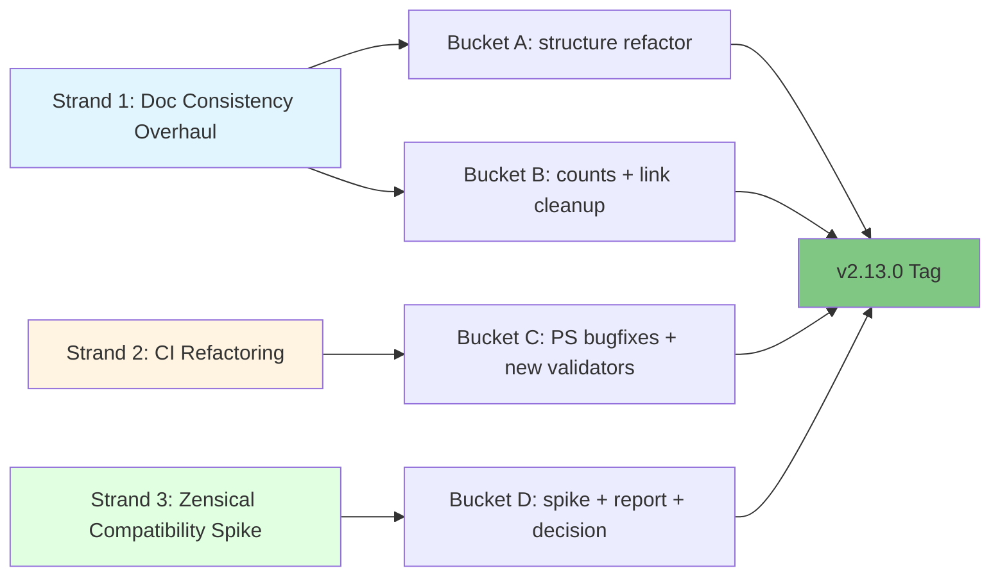

# v2.13.0 Release Plan: Foundation Hardening + Doc Stack Decision

**Status:** Pre-tag - all 27/27 in-cycle items shipped + 5 out-of-cycle MCP items shipped (MCP.1-MCP.5); pre-release gates: PR.1 (per-strand Phase 0) closed, PR.2 (release-state Phase 0) closed after 5 rounds, PR.3 (generator regen) closed first-run, PR.4 (pre-release checklist) closed; PR.5 (CHANGELOG + Release notes promotion to canonical locations from drafts in plan_ folder) is the next gate, then Phase 5 tag-time chores (version bumps, merge sequence, tag, push, release)
**Owner:** jprisant
**Type:** Refactor + decision release (minor)
**Created:** 2026-05-02 (stub) → 2026-05-03 (scope locked, three strands defined)
**Sources:**
- v2.12.0 deferrals (session log Phases 11-12)
- `docs/internal/audit/audit_repo-structure_2026-05-01.md` (15 sections)
- `docs/internal/audit/ci-audit_2026-05-03.md` (gaps G1-G9)
- v2.12.0 session log Phase 10 (Material → Zensical exploration)

> **What this release is.** v2.13.0 ships three coherent strands of cleanup work and one deciding artifact: documentation consistency overhaul, CI refactoring, and a Material for MkDocs to Zensical compatibility spike that decides go/no-go for migration in v2.14.0+. Zero new skills.
>
> **What this release is not.** v2.13.0 is NOT a Zensical migration; the actual migration (if greenlit by the spike) is v2.14.0+ scope. v2.13.0 is also NOT a sample-automation slate cycle; F-29 to F-35 (except F-34) are deferred per the v2.12.0 session log re-eval.

---

## Release Theme

**Foundation Hardening + Doc Stack Decision.** The "Foundation Hardening" portion captures the doc-consistency and CI strands under one banner  -  make the repo less drift-prone so future skill releases inherit a hard floor instead of accumulating silent rot. The "+ Doc Stack Decision" portion telegraphs that the Zensical spike is a deciding artifact, not a migration commitment  -  it tees up v2.14.0+ rather than landing in v2.13.0 itself.

v2.12.0 demonstrated the cost of soft-floor drift by needing 4 release-state Codex review rounds catching 9 distinct MEDIUM defects across rendered docs, anatomy frontmatter examples, version data, and audit-trail accuracy. v2.13.0 closes that class of issue at the CI layer and clarifies the doc stack's medium-term direction.

---

## The three strands

1. **Doc consistency overhaul**  -  sourced from `audit_repo-structure_2026-05-01.md` Sections 9 (Tiers 1-3) and 13 (Refactor Patterns). Resolves stale counts, generated-content markers, the duplicate-files question, and authoring-guide consolidation.
2. **CI refactoring**  -  sourced from `ci-audit_2026-05-03.md` (G1-G9) and `audit_repo-structure_2026-05-01.md` Section 14 (proposals 14.1-14.8) plus v2.12.0 session log Phase 11 (5 PowerShell parity bugs). Detail in [`plan_v2.13_ci-refactor.md`](plan_v2.13_ci-refactor.md).
3. **Zensical compatibility spike**  -  sourced from v2.12.0 session log Phase 10. Time-boxed deciding artifact. Detail in [`plan_v2.13_zensical-spike.md`](plan_v2.13_zensical-spike.md).

---

## Progress Dashboard

**Overall:** 27 of 27 work items shipped (100%); pre-release gates 5 of 5 closed
**Current focus:** Phase 5 tag-time chores (version bumps in `.claude-plugin/plugin.json` + `marketplace.json` + README badge; `validate-version-consistency` re-run; merge primary main into v2.13/cycle to absorb `87ddf7a`; merge v2.13/cycle into local main; create annotated tag `v2.13.0`; push main + tag; `gh release create v2.13.0`)
**Last updated:** 2026-05-05

Per-bucket totals: A=4, B=9, C=12, D=2 = 27 items. Shipped: A.1 + A.2 + A.3 + A.4 + B.1 + B.2 + B.3 + B.4 + B.5 + B.6 + B.7 + B.8 + B.9 + Wave 1 (7 items) + Wave 2 (2 items) + Wave 3 (3 items) + D.1 + D.2 = 27. **All scope buckets complete; only pre-release gates remain.**

### Status legend

- ✅ Shipped (commit identified)
- 🟡 In progress (work started, not committed)
- ⬜ Not started
- ⛔ Blocked (dependency identified)

### Bucket A  -  Doc structure refactor (4 of 4 = 100% ✓)

| # | Item | Status | Evidence / Notes |
|---|------|--------|------------------|
| A.1 | Frameworks folder delete + `triple-diamond` rename | ✅ Shipped | commit `4190f45` |
| A.2 | Cross-folder reorg: 4 moves out of `concepts/` to `reference/` + `guides/` | ✅ Shipped | commit `4190f45` |
| A.3 | Authoring guide consolidation: `creating-skills` → `creating-pm-skills`, delete `authoring-pm-skills` | ✅ Shipped | commit `4190f45` |
| A.4 | Pattern 5C generated frontmatter flag (63 pages: 40 individual skill pages + 8 category indices (6 phase + foundation + utility) + 9 workflows + 1 workflow index + 3 showcase + 1 showcase index + 1 commands ref) | ✅ Shipped | this session; unblocks Bucket C Wave 2 |

### Bucket B  -  Doc count + link cleanup (9 of 9 = 100% ✓)

| # | Item | Status | Notes |
|---|------|--------|-------|
| B.1 | Reconcile counts across 6 docs (`agent-skill-anatomy`, categories, ecosystem, project-structure, mcp-integration, getting-started) | ✅ Shipped | Audit Tier 1 #2-3, Tier 2 #7. `mcp-integration.md` and `ecosystem.md` MCP-count concerns subsumed by 2026-05-05 MCP maintenance-mode pivot. `project-structure.md` Measure Phase heading 4→5 + `measure-okr-grader` row added. `agent-skill-anatomy.md` (correct filename; original plan said `skill-anatomy.md`) already showed 40 throughout. `categories.md`, `getting-started.md` already correct. Foundation count drift in `project-structure.md` (shows 1, actual 8) deferred to B.8 full reconciliation. |
| B.2 | `mkdocs.yml site_description` 32→40, `skills/index.md` + `showcase/index.md` "do not edit" banners | ✅ Shipped | site_description updated. `skills/index.md` is hand-edited (A.4 explicitly skipped); added a "Hand-edited curated index" banner explaining the coexistence with generated phase indices. `showcase/index.md` is generated; A.4 already added the auto-generated banner. |
| B.3 | `utility-pm-skill-builder` SKILL.md catalog table | ✅ Shipped | Domain 25→26 (added measure-okr-grader). Foundation 1→8 (added lean-canvas + 5 meeting-* + okr-writer + stakeholder-update; persona retained). Utility 1→6 (added mermaid-diagrams, pm-skill-iterate, pm-skill-validate, slideshow-creator, update-pm-skills; pm-skill-builder retained). Categories sourced from each skill's SKILL.md frontmatter. |
| B.4 | `docs/guides/mcp-setup.md` frozen-MCP framing | ✅ Shipped | Decision: delete `mcp-setup.md` (254 lines of largely-duplicate setup content) and add redirect `guides/mcp-setup.md` → `guides/mcp-integration.md` via `mkdocs.yml redirect_maps`. Removed `MCP Setup` nav entry. Pre-release-checklist updated to reference deletion. The maintenance-mode pivot made the canonical "how to use MCP" content live in pm-skills-mcp's own README (per the trim of `mcp-integration.md`); a second pm-skills doc on the same topic was redundant. |
| B.5 | `AGENTS/codex/CONTEXT.md` decision: refresh OR vestigial-redirect | ✅ Shipped | Decision: vestigial-redirect (b). File shrunk 74→32 lines. Acknowledges Codex usage scope is now Phase 0 adversarial review only (codified v2.11.0); points to `AGENTS/claude/CONTEXT.md` as canonical project context. Currency marker `v2.12.0` retained so `check-context-currency` CI still passes (verified). Three explicit re-update triggers documented (scope change, protocol change, release tag time). |
| B.6 | README "What's New" inline-version-prefix workaround | ✅ Shipped | Option (a) section-aware CI extension. Replaced the broad `v[0-9]+\.` line-exemption with two principled layers: (1) HTML-comment markers (`<!-- count-exempt:start -->` / `end`) for explicit historical-content exemption (added to README.md What's New, docs/index.md Recent Releases, EXAMPLE.md illustrative section); (2) subset-descriptor exclusion (`26 phase skills`, `40 skill commands`, etc. no longer flagged as stale totals). Validator now PASSes cleanly with these mechanisms; the broad version-prefix exemption removed. Surfaced and resolved 18 hidden findings (12 subset false positives, 1 false positive on `300 lines for complex skills`, 2 EXAMPLE.md illustrative cases, 3 generated-output mirrors, 2 historical references in AGENTS/claude/DECISIONS.md). Generator regen propagated source EXAMPLE.md exemption markers into the published page. |
| B.7 | F-34: `THREAD_PROFILES.md` standalone reference doc | ✅ Shipped | Created at `library/skill-output-samples/THREAD_PROFILES.md` (~395 lines). Machine-readable per-thread metadata contract for tooling consumers: identity (stage, team size, user base), feature arc, prompt style, character naming convention, real competitors, sample-suffix patterns, scenario archetypes per phase. Three threads documented (storevine B2B / brainshelf consumer / workbench enterprise). Coupled with `scripts/generate-showcase.py:THREADS` and `README_SAMPLES.md`; companion `check-thread-profiles-consistency` script deferred to v2.13.0+ pending usage signal. README_SAMPLES.md cross-links to it from the TOC and as a sibling section to "Sample Creation Standards". |
| B.8 | `docs/reference/project-structure.md` full reconciliation | ✅ Shipped | TOC anchor `the-32-pm-skills-flat` → `the-40-pm-skills-flat`. Directory tree comments: skills 38→40, commands 45→47. Foundation section 1→8 with full skill listing. Slash command table: added 8 missing rows (`/okr-grader`, `/lean-canvas`, `/meeting-agenda`, `/meeting-brief`, `/meeting-recap`, `/meeting-synthesize`, `/okr-writer`, `/stakeholder-update`). B.1's Measure 4→5 fix already applied in earlier commit. |
| B.9 | `docs/guides/index.md` full guide listing (currently 5 of ~13) | ✅ Shipped | Listing expanded from 7 to 12 guides. Added: `using-meeting-skills`, `skill-finder`, `recipes`, `prompt-gallery`, `updating-pm-skills`. MCP Integration row description updated to reflect maintenance-mode posture. |

### Bucket C  -  CI hardening (12 of 12 = 100% ✓)

Detail at [`plan_v2.13_ci-refactor.md`](plan_v2.13_ci-refactor.md).

| # | Item | Status | Evidence / Notes |
|---|------|--------|------------------|
| C.W1 | Wave 1: 5 PS parity bugfixes + count regex tighten + nav-completeness validator (7 items) | ✅ Shipped | prior session, PR #140 |
| C.W2.1 | `check-generated-content-untouched` validator | ✅ Shipped | this session; enforcing; pairs with Pattern 5C |
| C.W2.2 | `validate-references-cross-doc` validator | ✅ Shipped | this session; enforcing; PASS on current state |
| C.W3 | Wave 3: docs frontmatter + internal links + version refs + F-36 family validator (3 items) | ✅ Shipped | prior session, PR #140 |

### Bucket D  -  Zensical compatibility spike (2 of 2 = 100% ✓)

Detail at [`plan_v2.13_zensical-spike.md`](plan_v2.13_zensical-spike.md). Report at [`plan_v2.13_zensical-spike-report_2026-05-05.md`](plan_v2.13_zensical-spike-report_2026-05-05.md).

| # | Item | Status | Notes |
|---|------|--------|-------|
| D.1 | Execute Zensical spike against current `mkdocs.yml` | ✅ Shipped | Executed 2026-05-05 against Zensical 0.0.40, Material 9.7.6 baseline. Build exit 0 but emitted 2940 link-reference parser warnings (false positives on `[role]`, `[yes / no]`, etc.) and exposed two BLOCKERs: `mkdocs-redirects` plugin not honored (zero redirect HTML generated for 12 mapped paths); `exclude_docs:` not honored (183 internal HTML files leaked into public output). Performance: cold 15.92s (1.95x slower than Material 8.16s); cached rebuild 6.40s (1.27x faster than Material full build). |
| D.2 | Write spike report with GO / GO-WITH-CAVEATS / NO-GO decision | ✅ Shipped | Decision: **NO-GO** for v2.14.0 commitment. Two NO-GO triggers fired (redirects + exclude_docs). Recommendation: stay on Material through v2.14.0; do NOT trigger Plan B (Astro Starlight) immediately per spike plan Section 5; re-spike Zensical when blockers resolve. Report at [`plan_v2.13_zensical-spike-report_2026-05-05.md`](plan_v2.13_zensical-spike-report_2026-05-05.md). |

### Pre-release gates (Phase 6, executed at tag time)

| # | Item | Status | Notes |
|---|------|--------|-------|
| PR.1 | Per-strand Phase 0 adversarial review loops (Bucket A, Bucket C new validators, Bucket D spike) | ✅ Shipped | All three strands converged below IMPORTANT severity. Codex session IDs: Bucket A retry `task-moszvz7v-fdr6kl` (5m38s); Bucket C round 1 `task-mosyoe00-canbf1` (7m45s); Bucket C round 2 `task-mot0w2ue-9k000t` (~5m, CONVERGED verdict); Bucket D retry `task-mot0yn6c-ysyzde` (7m58s, both BLOCKERs hold under independent scrutiny). Resolution commits: `d7da4a5` (Bucket C 2 IMPORTANT + Bucket A 1 MINOR), `4c3682b` (Bucket D 4 MEDIUM count-drift polish). |
| PR.2 | Release-state Phase 0 adversarial review loop | ✅ Shipped | Converged after 5 Codex review rounds + 1 comprehensive sweep + 1 stale-text follow-on + 1 round-7 audit-trail correction. Round 1 (`task-mot1m40y-esjydx`) found 6 IMPORTANT + 3 MEDIUM + 1 MINOR; round 2 (`task-motc66m6-csy9ay`) found 4 of 6 IMPORTANTs persisted as stale-status-block-text + 2 new MEDIUM + 1 new MINOR; round 4 (`task-acb13e3c-9a1d51d24`) confirmed round-2 findings RESOLVED but flagged 2 new IMPORTANTs (gate-table row stale; release-plans/README.md index stale 2026-03-22); round 5 (`task-a51d420d-85c922465`) found 4 new IMPORTANT (top status block + drafts misrepresenting audit trail + generated-page count breakdown stale + README update draft wrong index.md headers) + 1 new MEDIUM; round 6 was a comprehensive sweep across the full release stack (commit `0af6cf3`); round 7 (`task-a0411ab687fe95927`) found 2 IMPORTANT remaining audit-trail correctness defects (this very row + checklist note + README "What's New" draft text), corrected in this commit. Resolution surface: `05c5252` + `0ff7071` + `c5d41dc` + `0ed4621` + `0d43188` + `fc55704` + `0af6cf3` + `3f2894f` + this commit. Pattern lesson codified in `feedback_stale-aggregate-counter` memory: every gate closure must sweep ALL release-stack docs that reference the gate's state simultaneously; mid-loop summary text freezes the in-progress claim and needs a final pass. |
| PR.3 | Generator regen pre-release (mandatory) | ✅ Shipped | Re-ran all 3 generators on 2026-05-05 against `0ed4621`: `generate-skill-pages.py` (40 skills + 8 category indices + commands.md), `generate-workflow-pages.py` (9 workflows + index), `generate-showcase.py` (3 thread pages + index). Zero git diff post-regen. `check-generated-content-untouched.sh` validator: PASS for all 63 generated pages. Pattern 5C drift prevention confirmed working. No commit needed. |
| PR.4 | Pre-release checklist all green ([`plan_v2.13_pre-release-checklist.md`](plan_v2.13_pre-release-checklist.md)) | ✅ Shipped | Mechanical CI sweep run 2026-05-05 against `aa49867`: all 10 enforcing scripts PASS (lint-skills-frontmatter, validate-commands, validate-agents-md, validate-skills-manifest, validate-meeting-skills-family, check-nav-completeness, check-generated-content-untouched, validate-references-cross-doc, check-count-consistency, validate-skill-family-registration); all 5 advisory scripts PASS (check-context-currency, check-version-references, validate-docs-frontmatter, check-internal-link-validity); validate-version-consistency PASS at 2.12.0 (will re-verify at 2.13.0 post version bump). Checklist boxes ticked covering Phase 0 + Phase 1 + Phase 2 + Phase 4 closeable items; remaining unticked are PR.5 + Phase 5 tag-time chores + Phase 6 post-release signals + the version-consistency-at-2.13.0 box that re-runs after version bumps. |
| PR.5 | CHANGELOG.md + Release_v2.13.0.md authored | ✅ Shipped | Drafts authored in `plan_v2.13_*-DRAFT.md` (commit `fc55704` + user-value reframe `2db7281`/`e2314e1` + audit-trail correctness fixes `ad91f95`/`7b866b3`), then promoted to canonical locations in commit `6f81fb1`: `docs/releases/Release_v2.13.0.md` (new, ~213 lines, dated 2026-05-05), `CHANGELOG.md` v2.13.0 entry above v2.12.0, `docs/releases/index.md` new top row, `README.md` What's New block (open) above v2.12.0 (collapsed) plus Latest stable / release notes / published tag pointers updated to v2.13.0. Mechanical CI re-run post-promotion: all 10 enforcing scripts PASS; 3 advisory unchanged from pre-PR.5 baseline. Em-dash audit clean across all canonical files. |

---

## Status Snapshot (updated 2026-05-05)

| Item                          | Status                                                                                                                                          |
| ----------------------------- | ----------------------------------------------------------------------------------------------------------------------------------------------- |
| Plan                          | Scope locked; bucket inventory drafted; Open Questions pending maintainer decisions                                                             |
| Source: doc-structure audit   | `docs/internal/audit/audit_repo-structure_2026-05-01.md`                                                                                        |
| Source: CI audit (full)       | `docs/internal/audit/ci-audit_2026-05-03.md`                                                                                                    |
| Source: branches + PR audit   | `docs/internal/audit/branches-pr_2026-05-03.md`                                                                                                 |
| Source: v2.12.0 session log   | `AGENTS/claude/SESSION-LOG/2026-05-03_v2.12.0-tag-ship-and-v2.13-handoff_session.md`                                                            |
| CI refactor strand-level plan | [`plan_v2.13_ci-refactor.md`](plan_v2.13_ci-refactor.md) - drafted 2026-05-03; **Wave 1 + Wave 3 complete 2026-05-03 to 2026-05-04**            |
| Zensical spike plan           | [`plan_v2.13_zensical-spike.md`](plan_v2.13_zensical-spike.md) - drafted 2026-05-03                                                             |
| Pre-release checklist         | [`plan_v2.13_pre-release-checklist.md`](plan_v2.13_pre-release-checklist.md) - drafted 2026-05-03                                               |
| Skills manifest               | `skills-manifest.yaml` - drafted 2026-05-03 (empty by design)                                                                                   |
| Theme decision                | Foundation Hardening + Doc Stack Decision (locked)                                                                                              |
| Effort numbering convention   | No new F-XX effort docs for v2.13 mechanical work; existing F-29 to F-37 retained as deferral records                                           |
| Worktree                      | `E:\Projects\product-on-purpose\pm-skills_worktrees\v2.13-cycle` (branch `v2.13/cycle`); pushed to origin 2026-05-04                            |
| Active PR                     | [#140](https://github.com/product-on-purpose/pm-skills/pull/140) (draft) - opened 2026-05-04 to trigger CI verification on Wave 1 + Wave 3 work |
| Bucket-level progress         | See [Progress Dashboard](#progress-dashboard) above for item-level status                                                                       |
| Validator inventory           | 15 → 22 (net +7); enforcing tier 5 → 10 (4 new enforcing - nav-completeness + generated-content-untouched + references-cross-doc + skill-family-registration - plus check-count-consistency promotion; 3 new advisory - validate-docs-frontmatter + check-internal-link-validity + check-version-references). All Bucket C deliverables shipped. |
| Tag target                    | TBD                                                                                                                                             |

---

## Scope: Buckets A through D

The work below is bucketed for clarity. Each bucket can ship independently. Per-item detail for Buckets C and D lives in their respective strand-level docs.

### Bucket A  -  Doc structure refactor (architectural)

**Source:** `audit_repo-structure_2026-05-01.md` Sections 3.5, 5.4, 9.5 Phase B; Pattern 3 + Pattern 5C.

| Item | Source | Effort | Default |
|---|---|---|---|
| Resolve duplicate top-level files (`docs/getting-started.md`, `docs/pm-skill-anatomy.md`, `docs/agent-skill-anatomy.md`, `docs/pm-skill-lifecycle.md`) | Audit 3.5 | Medium | **Option C  -  delete duplicates, redirect via `mkdocs-redirects` plugin** (already enabled). See OQ-1. |
| Retire `docs/frameworks/` (single excluded file) | Audit 5.4 | Small | **Delete folder; merge content into `docs/concepts/triple-diamond.md`.** See OQ-2. |
| Consolidate `creating-skills.md` and `authoring-pm-skills.md` | Audit Pattern 3 | Small | **Keep `creating-skills.md` as canonical**; redirect `authoring-pm-skills.md`. See OQ-3. |
| Add Pattern 5C frontmatter `generated: true` flag to all generated pages | Audit Pattern 5 | Small | **Adopt 5C** (frontmatter flag). Pairs with new CI validator in Bucket C item 7. See OQ-4. |

### Bucket B  -  Doc count + link cleanup (mechanical)

**Source:** `audit_repo-structure_2026-05-01.md` Sections 7, 9 Tier 1-2; v2.12.0 session log Phase 12.

| Item | Source | Effort |
|---|---|---|
| Reconcile counts across `concepts/skill-anatomy.md`, `reference/categories.md`, `reference/ecosystem.md`, `reference/project-structure.md`, `guides/mcp-integration.md`, `getting-started.md` | Audit Tier 1 #2-3, Tier 2 #7 | Small |
| `mkdocs.yml site_description` 32→40, `docs/guides/index.md` to all 13 guides, `docs/skills/index.md` and `docs/showcase/index.md` "do not edit" banners | Audit Tier 1 #1, #4, #5 | Trivial |
| `utility-pm-skill-builder` SKILL.md catalog table: Foundation (1)→(8), Utility (1)→(6), Domain (25)→(26) with row additions | v2.12.0 session log Phase 12 | Small |
| `docs/guides/mcp-setup.md` "all 38 PM skills via MCP" rewrite for accurate frozen-MCP framing (frozen at 28 per M-22) | v2.12.0 session log | Small |
| `AGENTS/codex/CONTEXT.md` decision: active maintenance refresh OR vestigial-redirect | v2.12.0 session log | Small |
| README "What's New" inline-version-prefix workaround replacement (section-aware count-CI OR generated section sourced from CHANGELOG) | v2.12.0 session log | Medium |
| F-34: THREAD_PROFILES.md reference (lifted from old Bucket E sample-automation slate as standalone reference doc) | v2.12.0 deferral | Small |

### Bucket C  -  CI hardening

**Detail:** [`plan_v2.13_ci-refactor.md`](plan_v2.13_ci-refactor.md) (12 items across 3 waves).

Summary at this level:

| Wave | Items | Calendar effort |
|---|---|---|
| Wave 1: Prerequisites | 5 PS parity bugfixes + count-CI regex tighten + nav-completeness validator | ~1 week |
| Wave 2: After Bucket A lands | Generated-content untouched + cross-doc references validators | ~3-4 days |
| Wave 3: Durable improvements | Docs frontmatter + internal links + version refs + F-36 family validator | ~1-2 weeks |

After v2.13: validator inventory grows from 15 to 22 scripts (net +7). CI matrix posture (Ubuntu + Windows, bash + pwsh) unchanged. Strategic question raised but deferred to v2.14.0+ (bash + PS1 dual-stack consolidation).

### Bucket D  -  Zensical compatibility spike

**Detail:** [`plan_v2.13_zensical-spike.md`](plan_v2.13_zensical-spike.md).

Summary at this level:

| Item | Effort | Output |
|---|---|---|
| Execute Zensical spike against current `mkdocs.yml`; produce spike report | Half-day execution + half-day report | `plan_v2.13_zensical-spike-report_YYYY-MM-DD.md` with GO / GO-WITH-CAVEATS / NO-GO decision |
| Conditional: Plan B (Astro Starlight) effort doc IF spike returns NO-GO | Defer to separate effort | `docs/internal/efforts/...` (only if triggered) |

Decision rubric, plugin compatibility checklist, time-box, and Plan B trigger conditions all in the strand doc.

---

## Out-of-cycle work added 2026-05-05: MCP maintenance mode pivot

Not in the original v2.13.0 plan. User-initiated pivot to publish an official maintenance-mode marker for the companion `pm-skills-mcp` server, rather than continuing release parity with this library. Tracked here so the cycle's release notes can mention it and so subsequent buckets (B.1, B.4, ecosystem.md doc) reference the right canonical status page. Same-day follow-up patch v2.9.3 added 2026-05-05 (MCP.5) to clear the 8 open Dependabot advisories accumulated against the v2.9.0 dependency tree, validating the maintenance-mode "security patches will continue" commitment in operational practice.

| # | Item | Status | Notes |
|---|------|--------|-------|
| MCP.1 | `pm-skills-mcp` v2.9.2 release: README banner + status badge swap + Project Status Development Status subsection + CHANGELOG entry combining maintenance announcement with held-back v2.9.0 catch-up content + version bump in `package.json` and `src/config.ts`. Originally tagged as v2.9.1 (commit `3e39776`, tag `v2.9.1`); pushed to GitHub but failed to reach npm because the build step revealed the embed-skills script copies upstream `pm-skills` live (40 skills now, not the 29 from v2.9.0 build time). v2.9.2 (commit `083b8e3`, tag `v2.9.2`) corrects all skill-count references (29→40, 48 tools→59 tools) and is the canonical release that ships to npm. | ✅ Shipped | v2.9.1 + v2.9.2 tags pushed to GitHub. `npm publish pm-skills-mcp@2.9.2` completed 2026-05-05 (browser-auth OTP path); `npm view pm-skills-mcp version` returns `2.9.2`. GitHub Release authored at https://github.com/product-on-purpose/pm-skills-mcp/releases/tag/v2.9.2 with the v2.9.2 CHANGELOG entry as body. |
| MCP.2 | `docs/guides/mcp-integration.md` aggressive trim: 570 → 39 lines. Removed quick-start per client, tool inventory, slash-mapping, customization, sync workflow, troubleshooting (now canonically in pm-skills-mcp's own README). Kept maintenance notice + recommended path + skill-parity table + interest-registration link. | ✅ Shipped | This commit. -554 / +23 net. |
| MCP.3 | `README.md` MCP cross-reference callout + comparison table + Use-when bullets reframed for maintenance-mode posture. Status badge swapped from purple `available` to yellow `maintenance mode`. Comparison Updates row updated to reflect frozen v2.9.2. | ✅ Shipped | Initial commit `1b1d76b` (v2.9.1 references); follow-up commit corrects to v2.9.2 with 40-skill counts. |
| MCP.4 | `docs/reference/ecosystem.md`: maintenance notice atop the PM-Skills MCP section; line 27 ecosystem statement reframed; Decision Matrix qualifier note. | ✅ Shipped | This commit. +6 / -2 net. |
| MCP.5 | `pm-skills-mcp` v2.9.3 follow-up patch: clears 8 open Dependabot moderate advisories via transitive `npm audit fix` (hono 4.12.10 to 4.12.17, @hono/node-server 1.19.12 to 1.19.14, vite 6.4.1 to 6.4.2, postcss 8.5.6 to 8.5.14). Bundles three latent v2.9.x maintenance debts caught during the patch: tests/loader.test.ts catalog assertions corrected for the 40-skill embedded library (measure phase 4 to 5 after measure-okr-grader joined upstream; deliver+measure filter 10 to 11; suite now 81 of 81 passing); package-lock.json top-level version metadata synced from a stale 2.8.1; CHANGELOG.md retroactive em-dash sweep on 28 occurrences in entries from v2.6.0 and earlier per the no-em-dash rule codified 2026-04-13. Embedded skill catalog (40 skills) and tool counts (59 total) unchanged from v2.9.2. | ✅ Shipped | Commit `1700854`, tag `v2.9.3`. `npm publish pm-skills-mcp@2.9.3` completed 2026-05-05 18:09 UTC via browser-auth OTP path; `npm view pm-skills-mcp version` returns `2.9.3`. GitHub Release at https://github.com/product-on-purpose/pm-skills-mcp/releases/tag/v2.9.3 with the v2.9.3 CHANGELOG entry as body. Post-ship Dependabot open-alert count: 0 (down from 8). Two-hour announcement-to-patch turnaround (v2.9.2 published 16:08 UTC, v2.9.3 published 18:09 UTC). |

Decisions captured during pivot:
- Single-release strategy (Option X): v2.9.2 carries both the v2.9.0 held-back changes and the maintenance announcement, rather than two separate npm publishes. (Originally targeted v2.9.1 but a publish-time count error required a v2.9.2 follow-on; v2.9.1 tag retained but unpublished.)
- Em-dash sweep scope (Option C): pm-skills-mcp README swept (15 em-dashes), CHANGELOG history left as-published.
- Tone: "Maintenance Mode" framing (industry-standard, neutral, descriptive). Not "Paused" (too soft) or "Frozen/Deprecated" (too strong).
- Decision Matrix kept rows intact; added qualifier note rather than per-row rewrites.
- npm namespace strategy (scoped publishing under `@product-on-purpose/`, name-dispute against tarunccet's `pm-skills` squat) flagged as v2.14.0+ scope; not in this cycle.

---

## Deferred from v2.13 (single consolidated table)

Per session log Phase 12 re-evaluation. These remain in backlog with effort docs intact; no edits to those docs in v2.13 scope.

| ID | Title | Why deferred | Re-eval at |
|---|---|---|---|
| F-29 | Meeting Lifecycle Workflow | Time-gated on real-world meeting-skills usage feedback that has not yet arrived | v2.14.0+ |
| F-30 | Family Adoption Guide | Time-gated on at least one team's adoption experience | v2.14.0+ |
| F-31 | pm-skill-validate Family + Sample Awareness | May be obsolete after v2.12.0 builder cleanup; re-eval before v2.14 | v2.14.0+ |
| F-32 | pm-skill-builder Sample Generation | Same reasoning as F-31 | v2.14.0+ |
| F-33 | check-sample-standards CI Script | Same reasoning as F-31 | v2.14.0+ |
| F-35 | pm-skill-iterate Sample Regeneration | Same reasoning as F-31 | v2.14.0+ |
| F-37 | HTML Template Creator | Conflicts with v2.13 "no new skills" guard | v2.14.0+ |
| Pattern 1 | Single-source content with build-time projection | Only relevant if OQ-1 picks Option A; default is C | Skip |
| Pattern 2 | Frontmatter-driven counts via mkdocs-macros-plugin | Adds dependency; CI tightening (Bucket C item 5) gets most of the win without it | v2.14.0+ pending Zensical decision |
| Pattern 4 | Unified generation pipeline `scripts/_lib/` | Nice DRY win; not urgent | Indefinite |
| Pattern 5A | Move generated outputs to `docs/_generated/` | High churn, breaks deep links; 5C is cheaper substitute | Skip |
| 14.5 | `check-duplicate-doc-divergence` validator | Only relevant if OQ-1 picks Option A | Skip if C |

**Lifted from old Bucket E into Bucket B:** F-34 (THREAD_PROFILES.md)  -  small standalone reference doc independent of the broader sample-automation slate.

**Lifted from old Bucket C into Bucket C strand doc:** F-36 (generic family-registration validator)  -  net-new validator, not a deferral.

---

## Out of Scope

Explicit guards to prevent the scope creep risk noted at the v2.12.0 to v2.13.0 strategy turn:

1. **No new PM skills.** v2.13.0 ships zero new skill artifacts. F-37 (HTML Template Creator) and any future skill ideas remain in backlog for v2.14.0+.
2. **No actual Zensical migration.** v2.13.0 ships only the spike + decision. Migration is v2.14.0+ if greenlit.
3. **No in-cycle MCP work.** MCP server remained frozen per M-22 at the start of v2.13.0. An out-of-cycle MCP maintenance-mode pivot (MCP.1-MCP.5) was added mid-cycle on 2026-05-05 by explicit user decision; it is tracked separately in the dedicated MCP section above and was NOT scope creep on the original v2.13 buckets. The original guard prevented in-cycle MCP feature work; the out-of-cycle exception was a deliberate user-initiated pivot.
4. **No retroactive HISTORY.md backfill.** HISTORY.md governance is unchanged.
5. **No marketplace.json structural changes.** Continue treating it as version-mirror only.
6. **No new external runtime dependencies.** mkdocs plugin set unchanged in v2.13. Zensical install for spike is venv-isolated and does not become a runtime dependency. `mkdocs-macros-plugin` (Pattern 2) deferred. Lychee for link-checking adopted in CI only.
7. **No bash + PS1 dual-stack consolidation.** Strategic question raised in CI doc but deferred to v2.14.0+.
8. **No branches/PR cleanup beyond Tier 1 from `branches-pr_2026-05-03.md`.** Orphan `claude/*` branch salvage is independent housekeeping not on v2.13 critical path.

---

## Decisions (provisional, defaults to confirm in Open Questions)

| Decision | Choice | Rationale |
|---|---|---|
| **v2.13.0 theme** | Foundation Hardening + Doc Stack Decision | Captures three strands under one banner |
| **Effort doc convention for v2.13** | No new F-XX effort docs for mechanical work | Effort docs add overhead for refactor-cycle work; plan tables are sufficient |
| **Audit naming convention** | Defer | Discussed but not committed; current filenames retained |
| **Adversarial review** | Per-strand AND release-state Phase 0 loops | Per v2.11.0 codification + v2.12.0 release-state extension |
| **Generator regen** | Mandatory pre-release | All 3 Python generators must re-run cleanly; new `check-generated-content-untouched` validator enforces |
| **Zensical migration target** | NO-GO (resolved 2026-05-05) | Spike against Zensical 0.0.40 surfaced two NO-GO triggers: redirects plugin not honored + exclude_docs not honored. Stay on Material through v2.14.0. Plan B (Astro Starlight) NOT triggered immediately per spike plan Section 5; re-spike Zensical when blockers resolve. See [`plan_v2.13_zensical-spike-report_2026-05-05.md`](plan_v2.13_zensical-spike-report_2026-05-05.md). |
| **Naming convention (locked 2026-05-04)** | `pm-skill-*` filename prefix for PM-Skills-specific content; no prefix for cross-platform/agent-skill content | Reverses MkDocs migration's "lump everything under concepts" simplification. Filename signals scope (PM-specific vs generic) at a glance, independent of folder. |
| **Folder semantics (locked 2026-05-04)** | concepts/ = generic explanatory; reference/ = PM-Skills lookup material; guides/ = PM-Skills how-to material | Aligns to Diátaxis 4-quadrant doc taxonomy. Pre-A2 reorg, concepts/ was effectively a junk drawer holding PM-Skills-specific anatomy/lifecycle/versioning/comparisons; post-reorg, all 3 folders match their semantic purpose and reader's mode of use (scan vs follow). |

---

## Open Questions (decisions required, defaults pre-filled)

| # | Question | Source | Default | Decision (TBD) |
|---|---|---|---|---|
| **OQ-1** | Duplicate top-level files: Option A (keep + warn), B (single source generated), or C (delete + redirect)? | Audit 3.5 | **C  -  delete duplicates, redirect via `mkdocs-redirects`** (smallest ongoing maintenance) | **Resolved 2026-05-04: Option C executed.** All 4 top-level legacy duplicates deleted; redirects in mkdocs.yml. Real drift was 60 of 3,226 lines for agent-skill-anatomy and 21 of 1,495 lines for getting-started after CR-strip; canonical was strictly newer in all cases. |
| **OQ-2** | `docs/frameworks/` folder (1 excluded file): delete or promote? | Audit 5.4 | **Delete folder; merge content into `docs/concepts/triple-diamond.md`** | **Resolved 2026-05-04: deleted folder.** Content was byte-identical to canonical (no merge needed). Canonical also renamed `concepts/triple-diamond.md` → `concepts/triple-diamond-delivery-process.md` for descriptive accuracy. |
| **OQ-3** | `creating-skills.md` vs `authoring-pm-skills.md`  -  which is canonical? | Audit Pattern 3 | **Keep `creating-skills.md` as canonical**; redirect the other | **Resolved 2026-05-04: renamed canonical to `creating-pm-skills.md`** per the locked `pm-skill-*` naming convention; deleted authoring duplicate; both old paths redirect to new. |
| **OQ-4** | Pattern 5 (generated-content marker): adopt 5A (filesystem move), 5B (banner comment), or 5C (frontmatter `generated: true`)? | Audit Pattern 5 | **5C  -  frontmatter flag** (least disruptive, most automatable, pairs with new CI script) | **Resolved 2026-05-04: Option 5C executed.** All 3 generators (`generate-skill-pages.py`, `generate-workflow-pages.py`, `generate-showcase.py`) now emit `generated: true` + `source:` frontmatter fields and a visible `!!! warning "Generated file"` admonition pointing editors to the source. Coverage: 63 generated pages (40 individual skill pages + 8 category indices (6 phase + foundation + utility) + 9 workflows + 1 workflow index + 3 showcase + 1 showcase index + 1 commands ref). Unblocks Bucket C Wave 2 item 7 (`check-generated-content-untouched`). |
| **OQ-5** | Pattern 2 (frontmatter-driven counts via mkdocs-macros-plugin): adopt in v2.13 or defer? | Audit Pattern 2 | **Defer to v2.14.0+** pending Zensical decision (depends on which engine renders) | **Resolved 2026-05-05: deferred to v2.14.0+.** Zensical spike returned NO-GO; Material continues. Reconsider when Zensical re-spike is triggered (per `plan_v2.13_zensical-spike-report_2026-05-05.md`). |
| **OQ-6** | F-37 HTML Template Creator: include in v2.13 or defer? | Working tree untracked | **Defer to v2.14.0+** - conflicts with "no new skills" guard | **Resolved 2026-05-04: deferred to v2.14.0+** per Out of Scope guard #1; effort doc retained at `docs/internal/efforts/F-37-html-template-creator.md`. |
| **OQ-7** | Sample-automation slate F-29 to F-36 except F-34: defer all? | Session log re-eval | **Defer all except F-34** (lifted into Bucket B) and F-36 (lifted into Bucket C strand doc as generic family validator) | **Resolved 2026-05-04: F-34 lifted into Bucket B (shipped as B.7); F-36 lifted into Bucket C strand doc (shipped as Wave 3 item 12); F-29, F-30, F-31, F-32, F-33, F-35 deferred to v2.14.0+ per Deferred table.** |

These resolve doc-reorg architectural questions. Bucket C (CI) and Bucket D (Zensical) have their own internal decisions documented in their respective strand docs; they don't surface here.

---

## Sequencing Proposal

Cross-references audit Section 9.5 (Phase A-D) and CI strand doc Section 5 (Wave 1-3). One PR per logical unit where feasible; some can run in parallel.

### Phase 1. Mechanical fixes + CI Wave 1 (week 1-2)

Bucket B in full + Bucket C Wave 1 (5 PS bugfixes + count regex tighten + nav-completeness validator). Lowest risk, highest signal-to-effort. Can land before architectural decisions.

### Phase 2. Architectural decisions (week 2-3)

Bucket A. Each item one PR. Resolves duplicate-file question (OQ-1), frameworks folder (OQ-2), authoring-guide consolidation (OQ-3), Pattern 5C adoption (OQ-4) once and durably.

### Phase 3. CI Wave 2 (week 3)

Bucket C Wave 2 (generated-content untouched, cross-doc references validators). Depends on Bucket A landing so the file set is stable.

### Phase 4. Zensical spike (week 3, parallel)

Bucket D. Half-day execution + half-day report. Produces decision artifact for v2.14.0+. Can run in parallel with Phase 3 since it's independent.

### Phase 5. CI Wave 3 (week 4-5)

Bucket C Wave 3 (docs frontmatter, internal links, version refs, F-36 family validator). Independent durable improvements.

### Phase 6. Pre-release polish (week 5-6)

Per-strand Phase 0 Adversarial Review Loops + release-state Phase 0 Loop + generator regen + version bumps + tag.

---

## Outcomes at v2.13.0 Tag Time

What shipping the full v2.13.0 release produces, by audience and by effect.

### What stays the same (skill consumers see no change)

| Area | State at v2.13.0 |
|------|------------------|
| PM skills count | 40 (26 phase + 8 foundation + 6 utility); zero added, zero removed |
| Skill content (`skills/*/SKILL.md`) | Untouched |
| Workflows | Unchanged (9 workflows) |
| Library samples | Unchanged (126 samples) |
| MCP server | Catalog frozen at 40 skills per v2.9.2 build (M-22's 28-skill freeze superseded 2026-05-05 when v2.9.2 re-embedded the full current catalog); v2.9.x maintenance line (latest v2.9.3) continues with security patches |
| License | Apache 2.0 |
| agentskills.io spec compliance | Unchanged |
| Doc stack runtime | MkDocs Material (Zensical spike is venv-isolated; not a runtime dependency) |
| AGENTS.md skill discovery | Unchanged |

### What changes (visible in the rendered docs)

| Change | Source | User-facing effect |
|--------|--------|--------------------|
| 6 doc files renamed with `pm-skill-*` prefix | Bucket A | Filenames signal scope (PM-specific vs generic) at a glance |
| 5 docs reorganized into Diátaxis-aligned folders | Bucket A | `concepts/` = generic; `reference/` = lookup; `guides/` = how-to |
| 6 legacy duplicate files deleted | Bucket A | Single source of truth per concept |
| `docs/frameworks/` folder retired | Bucket A | `mkdocs.yml exclude_docs:` reduced 8 → 2 |
| 63 generated pages get a "do not edit" banner | Bucket A.4 | Visible warning + `generated: true` + `source:` frontmatter fields |
| ~12 stale counts reconciled | Bucket B | Numbers match across skill catalog, mcp-setup, README, project-structure, guides/index |
| 12 broken internal links fixed | Bucket B | Click-throughs work everywhere |
| 12 redirect entries in `mkdocs.yml` | Bucket A | Old bookmarks still reach new locations |

### What's new (under the hood)

| Item | Effect |
|------|--------|
| Validator inventory 15 → 22 | 7 new automated checks |
| Enforcing validators 5 → 10 | Stricter gate on PRs (5 newly-enforcing: 4 new + check-count-consistency promoted) |
| `check-generated-content-untouched` | Future hand-edits to generated pages rejected at CI |
| `validate-references-cross-doc` | Internal-link breakage caught at CI |
| `check-internal-link-validity` (advisory) | Reports broken links without blocking |
| `check-version-references` (advisory) | Surfaces stale version mentions |
| `check-docs-frontmatter` | Frontmatter consistency across docs |
| `nav-completeness` | Every doc reachable from `mkdocs.yml` nav |
| F-36 generic family-registration validator | `validate-meeting-skills-family` becomes a thin wrapper |
| 5 PowerShell parity bugfixes | PS1 scripts now bash-equivalent |
| Pattern 5C frontmatter flag | `generated: true` on all generated pages, machine-readable |

### Decision artifact: Zensical compatibility

| Output | Effect |
|--------|--------|
| `plan_v2.13_zensical-spike-report_YYYY-MM-DD.md` | GO / GO-WITH-CAVEATS / NO-GO decision tees up v2.14.0+ |
| If GO: v2.14.0 commits to Zensical migration | Plan B (Astro Starlight) shelved |
| If NO-GO: Plan B (Astro Starlight) becomes its own effort doc | v2.14.0 evaluates the alternative |
| Zero runtime impact in v2.13.0 either way | MkDocs Material stays as the runtime stack through v2.13 |

### What's deferred to v2.14.0+ (explicit out-of-scope guards)

| Item | Why deferred |
|------|--------------|
| Zensical migration itself | v2.13 ships only the spike + decision; migration is v2.14+ if greenlit |
| F-37 HTML Template Creator | Conflicts with "no new skills" guard |
| F-29 Meeting Lifecycle Workflow | Time-gated on real-world meeting-skills usage feedback |
| F-30 Family Adoption Guide | Time-gated on at least one team's adoption experience |
| F-31 / F-32 / F-33 / F-35 sample-automation slate | May be obsolete after v2.12.0 builder cleanup; re-eval before v2.14 |
| `mkdocs-macros-plugin` (Pattern 2) | Adds dependency; defer pending Zensical decision |
| Bash + PS1 dual-stack consolidation | v2.14+ strategic question |
| MCP server unfreeze | Frozen per M-22; revisit when team adoption demand justifies |

### Audience reads

| Audience | Experience post-v2.13.0 |
|----------|--------------------------|
| **New visitor cloning the repo** | Cleaner nav. Doc folders match Diátaxis. Skill content identical to v2.12.0. |
| **Existing user with bookmarked paths** | Redirects catch every old URL (12 redirect entries in `mkdocs.yml`) |
| **PR contributor** | Stronger CI catches silent rot. Generator output protected from hand-edits. PowerShell bugs fixed. |
| **Maintainer (you)** | Lower drift-accumulation rate. Foundation for the Zensical decision in v2.14. v2.12.0's 9-defect-across-4-rounds review experience does not repeat. |
| **Skill consumer** (someone using `deliver-prd`, `define-jtbd-canvas`, etc.) | Identical PM skill behavior. No visible change. |

### Acceptance criteria for tag readiness

The release is tag-ready when all of these are true:

- [ ] All Bucket A items shipped (A.1, A.2, A.3, A.4)
- [ ] All Bucket B items shipped (B.1 through B.9)
- [ ] All Bucket C waves shipped (Wave 1, Wave 2, Wave 3 = 12 CI items total)
- [ ] Bucket D spike report written with GO / GO-WITH-CAVEATS / NO-GO decision
- [ ] All 7 new validators returning clean (or advisory-only with documented findings)
- [ ] `mkdocs build --strict` passes
- [ ] Generator regen produces clean output (mandatory pre-release)
- [ ] All 4 Phase 0 adversarial review loops converged (per-strand x3 + release-state x1)
- [ ] Pre-release checklist ([`plan_v2.13_pre-release-checklist.md`](plan_v2.13_pre-release-checklist.md)) all items checked
- [ ] CHANGELOG.md v2.13.0 entry written
- [ ] Release_v2.13.0.md drafted
- [ ] No em-dash (U+2014) or en-dash (U+2013) characters anywhere in repo (standing rule per CLAUDE.md)
- [ ] No new external runtime dependencies introduced

---

## CI That Applies

Standard release validators plus the 7 new ones added in Bucket C. After Bucket C ships, validator inventory grows from 15 to 22 (net +7). CI matrix posture (Ubuntu + Windows, bash + pwsh) unchanged.

| Workflow | Notes |
|---|---|
| `lint-skills-frontmatter` | Unchanged. v2.13.0 ships no new skills (40 → 40). PS1 false-positive bug fixed in Bucket C item 4. |
| `validate-commands` | Unchanged. 47 commands. |
| `validate-agents-md` | Unchanged. 40 paths. |
| `validate-skills-manifest` | v2.13.0 manifest is empty (no skill version bumps). |
| `validate-meeting-skills-family` | Becomes thin wrapper around new generic validator (F-36 in Bucket C item 12). |
| `check-count-consistency` | Tightened in Bucket C item 5; promoted to enforcing for current-state files. |
| 7 new validators in Bucket C | Added to `validation.yml` per existing `.sh + .ps1 + .md` triplet convention. Detail in CI strand doc. |

Detail at [`plan_v2.13_ci-refactor.md`](plan_v2.13_ci-refactor.md) Section 6.

---

## MCP Impact

| Question | Answer |
|---|---|
| New MCP tools needed for v2.13.0 cycle work? | No. v2.13.0 in-cycle scope adds zero new pm-skills, so the MCP server's catalog needs no update from v2.13.0 itself. |
| Skill count drift relative to MCP (in-cycle) | Going into v2.13.0: MCP at 28 per M-22 freeze (2026-04-17); repo at 40. v2.13.0 in-cycle scope: 0 new skills, so the in-cycle gap is unchanged. |
| Out-of-cycle MCP work happened? | Yes. User-initiated maintenance-mode pivot 2026-05-05 (MCP.1-MCP.5). v2.9.2 re-embedded the full 40-skill catalog (M-22's 28-skill freeze superseded). v2.9.3 follow-up patch shipped same day to clear all 8 open Dependabot moderate advisories; 0 alerts post-ship. Out-of-cycle scope tracked separately in the MCP section. |
| Separate MCP release required for in-cycle work? | No. The out-of-cycle MCP releases (v2.9.2, v2.9.3) shipped independently of v2.13.0's release cycle. |

---

## Pre-release Checklist

Detail at [`plan_v2.13_pre-release-checklist.md`](plan_v2.13_pre-release-checklist.md). Adapted from v2.11.0 template with v2.13-specific gates (no skill fidelity checks, three-strand verification, per-strand AND release-state Phase 0 loops per v2.12.0 codification).

Top-level summary:

- [ ] Phase 0 per-strand adversarial review loops (Bucket A, Bucket C new validators, Bucket D spike report)
- [ ] Phase 0 release-state adversarial review loop
- [ ] Phase 1 mechanical CI all green (including 7 new validators)
- [ ] Phase 2 strand-level fidelity (4 sub-checks: A, B, C, D)
- [ ] Phase 3 discoverability (README, CHANGELOG, release notes, AGENTS docs all updated)
- [ ] Phase 4 release coordination (plan + CI + spike docs all marked Executed)
- [ ] Phase 5 tag-time chores (CHANGELOG, Release_v2.13.0.md, plugin/marketplace bumps, tag, push, gh release)
- [ ] Phase 6 post-release signals identified for v2.14.0 input

---

## Risk Register

| Risk | Mitigation |
|---|---|
| Scope creep ("while I'm here" additions to a refactor release) | Out of Scope section is binding; deviations require explicit approval |
| Bucket A doc-restructure breaks external links | `mkdocs-redirects` plugin entries; smoke-test top inbound paths after deploy |
| New CI validators produce false positives blocking unrelated PRs | Promote each new script to enforcing only after spike-tested at low false-positive rate; `check-version-references` starts advisory |
| Zensical spike runs over time-box | Hard 60-min ceiling; if exceeded, document partial findings and stop |
| Spike returns NO-GO and Plan B becomes urgent | Plan B (Astro Starlight) is its own effort doc with its own time-box; not v2.13 scope |
| Bash + PS1 dual-stack maintenance becomes worse during v2.13 (more bugs surface) | Capture maintenance cost data; surface as v2.14.0 strategic decision |
| Sample-automation slate (F-31 to F-35) gets re-included mid-cycle | Deferral is binding; re-eval gated on v2.14.0 cut, not v2.13 |
| Pattern 2 adoption attempted mid-cycle | Explicitly out of scope; defer to v2.14.0+ pending Zensical decision |

---

## Related

- v2.12.0 release plan: [`../v2.12.0/plan_v2.12.0.md`](../v2.12.0/plan_v2.12.0.md)
- v2.11.0 release plan: [`../v2.11.0/plan_v2.11.0.md`](../v2.11.0/plan_v2.11.0.md)
- v2.11.0 pre-release checklist (template): [`../v2.11.0/plan_v2.11_pre-release-checklist.md`](../v2.11.0/plan_v2.11_pre-release-checklist.md)
- Doc-structure audit: [`../../audit/audit_repo-structure_2026-05-01.md`](../../audit/audit_repo-structure_2026-05-01.md)
- CI audit (full): [`../../audit/ci-audit_2026-05-03.md`](../../audit/ci-audit_2026-05-03.md)
- Branches/PR audit: [`../../audit/branches-pr_2026-05-03.md`](../../audit/branches-pr_2026-05-03.md)
- v2.12.0 session log (handoff): [`../../../../AGENTS/claude/SESSION-LOG/2026-05-03_v2.12.0-tag-ship-and-v2.13-handoff_session.md`](../../../../AGENTS/claude/SESSION-LOG/2026-05-03_v2.12.0-tag-ship-and-v2.13-handoff_session.md)
- Strand-level docs:
  - CI refactor: [`./plan_v2.13_ci-refactor.md`](plan_v2.13_ci-refactor.md)
  - Zensical spike: [`./plan_v2.13_zensical-spike.md`](plan_v2.13_zensical-spike.md)
  - Pre-release checklist: [`./plan_v2.13_pre-release-checklist.md`](plan_v2.13_pre-release-checklist.md)
- Backlog canonical: [`../../backlog-canonical.md`](../../backlog-canonical.md)
- Existing effort docs (deferred to v2.14.0+): F-29, F-30, F-31, F-32, F-33, F-35, F-37 in `docs/internal/efforts/`

---

## Change Log

| Date | Change |
|---|---|
| 2026-05-02 | Stub created based on v2.12.0 deferrals + 2026-05-01 audits. Theme: Foundation Hardening. Six buckets (A-F) drafted. Four open questions. |
| 2026-05-03 | Scope locked: three strands (doc consistency + CI refactor + Zensical compatibility spike). Theme updated to "Foundation Hardening + Doc Stack Decision". Buckets restructured to A-D (old E + F dissolved into deferral table). Bucket E sample-automation slate deferred all except F-34 (lifted into B). Bucket F refactor patterns 1/2/4/5A deferred. Pattern 5C adopted as default (lifted into A). F-36 lifted into C strand doc. F-37 deferred. Open Questions reduced to 7 with my proposed defaults pre-filled. CI strand doc, Zensical spike doc, pre-release checklist, and skills-manifest authored as siblings. No new F-XX effort docs (effort-doc convention paused for v2.13 mechanical work per maintainer feedback on doc bloat). |
| 2026-05-04 | Bucket A executed: A1 (frameworks delete + `triple-diamond-delivery-process` rename in concepts/), A2 (4 concept moves out of concepts/ to reference/ and guides/ per Diátaxis + 4 legacy duplicate deletes including substantial-drift agent-skill-anatomy and getting-started after CR-strip analysis revealed real drift was minor), A3 (`creating-skills` → `creating-pm-skills` + `authoring-pm-skills` delete). Naming convention (`pm-skill-*` prefix for PM-specific content) and folder semantics (concepts=generic, reference=lookup, guides=how-to) locked. OQ-1, OQ-2, OQ-3 resolved. Backup at `_NOTES/backup-git/2026-05-04_v2.13-refactor/` (10 files + INDEX.md). mkdocs.yml `exclude_docs:` reduced from 8 entries to 2. Bucket A.4 (Pattern 5C generated frontmatter flag) deferred to fresh session. |
| 2026-05-04 | Plan readability pass: added Progress Dashboard section (item-level status with ✅/🟡/⬜/⛔ icons across 22 work items in 4 buckets + 5 pre-release gates) for in-flight visibility. Added Outcomes at v2.13.0 Tag Time section synthesizing what shipping the full release produces (stays-the-same / visible changes / under-the-hood / Zensical decision artifact / deferred / audience reads / acceptance criteria). Trimmed bucket-status rows from Status Snapshot to avoid dual-source-of-truth drift. Net: 2 new sections, 1 small table trim, scope/decisions/OQs unchanged. |
| 2026-05-04 | Bucket A.4 executed: Pattern 5C generated-content marker applied to all 3 generator scripts (`generate-skill-pages.py`, `generate-workflow-pages.py`, `generate-showcase.py`). Each generated page now carries `generated: true` and `source: scripts/generate-X.py` in frontmatter plus a `!!! warning "Generated file"` admonition pointing editors to the source. Coverage: 63 pages (38 skill + 8 phase indices + 1 commands ref + 9 workflows + 1 workflow index + 3 showcase + 1 showcase index). OQ-4 resolved. **Bucket A complete (4 of 4).** Bucket C Wave 2 (items 7 + 8) now unblocked. Progress: 14 of 27 work items shipped (52%). |
| 2026-05-04 | Bucket C Wave 2 executed: items 7 + 8 shipped. Item 7 `check-generated-content-untouched` ships enforcing using snapshot/regen/diff with Windows-safe line-ending normalization. Pairs with Pattern 5C: every generated page declares `generated: true` and any hand-edit drifts the diff. Item 8 `validate-references-cross-doc` ships enforcing per audit recommendation (option 8a); current `docs/reference/` state PASSes cleanly so no findings to fix. Validator skips template placeholders (`{{x}}`, `<x>`) to avoid false positives on contract-doc syntax examples. **Bucket C complete (12 of 12).** Validator inventory: 22 -> 24; enforcing tier 7 -> 9. Progress: 16 of 27 work items shipped (59%). |
| 2026-05-05 | MCP.1 ship: `npm publish pm-skills-mcp@2.9.2` completed via browser-auth OTP path (tarball 280.3 kB, 148 files; `npm view pm-skills-mcp version` returns `2.9.2`). `gh release create v2.9.2` authored at https://github.com/product-on-purpose/pm-skills-mcp/releases/tag/v2.9.2 with the v2.9.2 CHANGELOG entry as body. MCP maintenance-mode pivot complete end-to-end. |
| 2026-05-05 | B.7 shipped (F-34 THREAD_PROFILES.md). Created `library/skill-output-samples/THREAD_PROFILES.md` (~395 lines) as the machine-readable per-thread metadata contract for tooling consumers (utility-pm-skill-builder primary; future regen tools). Documents identity, feature arc, prompt style, character naming convention, real competitors, sample-suffix patterns, and scenario archetypes per phase across all three threads (storevine, brainshelf, workbench). Coupled with `scripts/generate-showcase.py:THREADS` and `README_SAMPLES.md`; companion `check-thread-profiles-consistency` script deferred to v2.13.0+ pending usage signal. `README_SAMPLES.md` cross-links to it from the TOC and as a sibling section to "Sample Creation Standards". **Bucket B complete (9 of 9 = 100%).** Dashboard summary corrected from "16 of 27" (stale; omitted shipped Bucket B items) to "25 of 27" (true count). Remaining v2.13 scope: Bucket D (Zensical spike, 2 items) plus 5 pre-release gates at tag time. |
| 2026-05-05 | Bucket D Zensical spike executed and decided. **NO-GO for v2.14.0 commitment.** Zensical 0.0.40 does not honor `mkdocs-redirects` (zero redirect HTML generated for the 12 mapped paths in `mkdocs.yml`) and does not honor `exclude_docs:` (183 internal HTML files from `docs/internal/` leaked into the public `site/` output). 2940 link-reference parser-strictness false positives also flagged as IMPORTANT severity (would block `--strict` adoption). Performance: cold build 1.95x slower than Material (15.92s vs 8.16s); cached rebuild 1.27x faster than Material full build (6.40s vs 8.16s); ZRX 4-5x rebuild claim contradicted at the cold-build level. Recommendation: stay on Material through v2.14.0; do NOT trigger Plan B (Astro Starlight) immediately per spike plan Section 5; re-spike when redirects + exclude_docs parity announced. Decisions row updated. Full report at [`plan_v2.13_zensical-spike-report_2026-05-05.md`](plan_v2.13_zensical-spike-report_2026-05-05.md). **Bucket D complete (2 of 2 = 100%); all v2.13 scope work shipped (27 of 27); only the 5 pre-release gates remain at tag prep.** |
| 2026-05-05 | Bucket B quick-wins batch shipped: B.1 (project-structure.md Measure 4→5 + measure-okr-grader row + plan path correction), B.2 (mkdocs.yml site_description 32→40 + skills/index.md hand-edited curated banner), B.4 (mcp-setup.md deleted + redirect to mcp-integration.md per maintenance-mode pivot subsumption + nav entry removed + pre-release-checklist updated), B.9 (guides/index.md expanded 7→12 guides). Bucket B progress: 0 of 9 → 4 of 9 (44%). |
| 2026-05-05 | Bucket B medium-tier batch shipped: B.5 (AGENTS/codex/CONTEXT.md vestigial-redirect rewrite, 74→32 lines, currency marker retained for check-context-currency CI), B.3 (utility-pm-skill-builder catalog: Domain 25→26, Foundation 1→8, Utility 1→6 with descriptions and categories sourced from each skill's frontmatter), B.8 (project-structure.md full reconciliation: TOC anchor, directory tree counts 38→40 + 45→47, Foundation section 1→8 with full listing, slash command table +8 missing rows). Bucket B progress: 4 of 9 → 7 of 9 (78%). |
| 2026-05-05 | B.6 shipped (Option a: section-aware CI extension). Replaced the broad `v[0-9]+\.` line-exemption in `check-count-consistency.{sh,ps1}` with: (1) `<!-- count-exempt:start -->`/`end` HTML-comment markers for explicit historical-content exemption (added to README What's New, docs/index.md Recent Releases, utility-pm-skill-builder/references/EXAMPLE.md illustrative section); (2) subset-descriptor exclusion list (`phase`, `foundation`, `utility`, `domain`, `shipped`, `embedded`, `test`, `sample`, `library`, `lines?` for skills; `skill`, `workflow` for commands) so phrasing like "26 phase skills" / "40 skill commands" is no longer flagged as a stale total. Side effect: surfaced 18 hidden findings the prior workaround had silenced; all resolved (12 subset false positives via regex tightening, 1 line-count false positive via `lines?` addition, 2 EXAMPLE.md illustrative via markers, 3 generated-output mirrors via source-file regen propagation, 2 historical AGENTS/claude/DECISIONS.md references via file-level exclusion). Validator now PASSes cleanly. `check-count-consistency.md` doc rewritten to document both new mechanisms. Bucket B progress: 7 of 9 → 8 of 9 (89%). Remaining: B.7 (F-34 THREAD_PROFILES.md). |
| 2026-05-05 | PR.5 closed (CHANGELOG.md + Release_v2.13.0.md authored). Drafts in `plan_v2.13_*-DRAFT.md` promoted to canonical locations in commit `6f81fb1`: `docs/releases/Release_v2.13.0.md` (new, dated 2026-05-05), `CHANGELOG.md` v2.13.0 entry inserted above v2.12.0, `docs/releases/index.md` new top row with audience-oriented Highlights summary, `README.md` What's New block (open, with user-value reframe) above v2.12.0 (collapsed) plus Latest stable / release notes / published tag pointers updated to v2.13.0. Post-promotion mechanical CI re-run: 10 enforcing PASS + 3 advisory unchanged from pre-PR.5 baseline. All 5 pre-release gates now closed; Phase 5 tag-time chores next. |
| 2026-05-05 | PR.4 closed (pre-release checklist all green). Ran the full Phase 1 mechanical CI sweep against `aa49867`: 10 of 10 enforcing scripts PASS, 5 of 5 advisory scripts PASS. Ticked 51 of 75 checklist boxes (Phase 0 per-strand and release-state, Phase 1 mechanical, Phase 2a/2b/2c/2d strand fidelity, Phase 4 release coordination items achievable pre-tag). 24 remaining unticked are intentional: 1 awaits PR.2 round 2 Codex re-review (usage limit), 1 awaits version-consistency re-verify after version bump, 1 is N/A on NO-GO outcome, 13 are PR.5 + Phase 5 tag-time chores, 8 are Phase 6 post-release signals to monitor over time. ci-refactor doc top status updated to Executed. |
| 2026-05-05 | PR.3 closed (generator regen pre-release). Re-ran all 3 generators against `0ed4621`. Output: `generate-skill-pages.py` regenerated 40 skill pages + 8 category indices + `docs/reference/commands.md`; `generate-workflow-pages.py` regenerated 9 workflow pages + index; `generate-showcase.py` regenerated 3 thread pages + index. Post-regen `git status` was empty (zero drift). `bash scripts/check-generated-content-untouched.sh` returned `PASS: all 63 generated pages match generator output.` First-run convergence. Pattern 5C drift prevention validated end-to-end. No commit needed. |
| 2026-05-05 | Hygiene: commit `06a2e36` removed unused `mkdocs.yml` `theme.custom_dir: overrides` hook + empty `overrides/.gitkeep`. Sibling commit to the MCP maintenance-mode pivot batch; not tracked as a Bucket A/B/C/D scope item because it is incidental cleanup rather than planned scope. |
| 2026-05-05 | Out-of-cycle: MCP maintenance mode pivot (4 work items MCP.1-MCP.4 added). User-initiated decision to publish `pm-skills-mcp` as official maintenance-mode marker. Originally targeted v2.9.1 (commit `3e39776`, tag `v2.9.1`); pushed to GitHub but failed at `npm publish` because the build step revealed `embed-skills.js` copies the upstream `pm-skills` library live (40 skills now, not the 29 from v2.9.0 build time). Corrected via v2.9.2 (commit `083b8e3`, tag `v2.9.2`): all skill-count references updated 29→40, total tool count 48→59, in pm-skills-mcp/{README,CHANGELOG,CLAUDE.md,src/config.ts,package.json}. v2.9.1 tag retained in git for reference but unpublished. `pm-skills` downstream sweep done in 3 sub-batches initially against v2.9.1 references (commit `1b1d76b`): 2.1 `mcp-integration.md` aggressive trim (-554/+23), 2.2 `README.md` MCP-section reframe (+15/-13), 2.3 `ecosystem.md` notice + Decision Matrix qualifier (+6/-2). Follow-on commit corrects all v2.9.1→v2.9.2 references and 29→40 skill counts. Bucket B.1 partially subsumed (mcp-integration.md scope handled). Bucket B.4 status changed to `Re-evaluate` (mcp-setup.md may also need full maintenance-mode rewrite). Sibling commit `06a2e36` removes unused `mkdocs.yml` `theme.custom_dir: overrides` hook + empty `overrides/.gitkeep` (basic hygiene). |
| 2026-05-05 | PR.1 closed (per-strand Phase 0 adversarial review). All three strands converged below IMPORTANT severity via Codex review. Bucket A retry session `task-moszvz7v-fdr6kl` (5m38s) found 1 MINOR (doc count drift) cleared in `d7da4a5`. Bucket C round 1 `task-mosyoe00-canbf1` (7m45s) found 2 IMPORTANT + 3 MEDIUM + 1 MINOR; the 2 IMPORTANT (count-consistency still advisory in CI; new validators missing always() condition cascade-skipping later checks) cleared in `d7da4a5`; round 2 `task-mot0w2ue-9k000t` confirmed CONVERGED. Bucket D retry `task-mot0yn6c-ysyzde` (7m58s, MCP filesystem only after sandbox shell unavailable) found 4 MEDIUM + 2 MINOR; both BLOCKERs confirmed valid via independent cross-reference to Zensical's own compatibility/config/validation docs (NO-GO holds). Bucket D O2 count-drift polish (10→12 redirect_maps; 5→2 exclude_docs paths) shipped as `4c3682b`. Two stalled Codex tasks cancelled (`task-mosynsg8-8jlc0d` Bucket A original at 58m, `task-mosyp69l-ersa06` Bucket D original at 60m); MCP-filesystem-fallback briefing instruction was the unlock for retries. Total Codex compute time across PR.1: ~26 minutes wall-clock across 4 successful tasks. Per-strand findings stabilized; PR.2 release-state loop is next. |
| 2026-05-05 | MCP.5 ship: `pm-skills-mcp` v2.9.3 follow-up patch shipped end-to-end (commit `1700854`, tag `v2.9.3`, npm publish at 18:09 UTC, GitHub Release at https://github.com/product-on-purpose/pm-skills-mcp/releases/tag/v2.9.3). `npm audit fix` cleared 8 open Dependabot moderate advisories via transitive bumps (hono 4.12.10 to 4.12.17, @hono/node-server 1.19.12 to 1.19.14, vite 6.4.1 to 6.4.2, postcss 8.5.6 to 8.5.14); post-ship Dependabot open-alert count is 0. Bundled three latent v2.9.x maintenance debts in the same patch: tests/loader.test.ts catalog assertions corrected for the 40-skill embedded library (measure phase 4 to 5; deliver+measure filter 10 to 11; suite green at 81 of 81 from a previously red state shipped at v2.9.2); package-lock.json top-level version metadata synced from a stale 2.8.1; CHANGELOG.md retroactive em-dash sweep (28 occurrences in entries from v2.6.0 and earlier) per the no-em-dash rule codified 2026-04-13. Two-hour announcement-to-patch turnaround (v2.9.2 published 16:08 UTC, v2.9.3 published 18:09 UTC) operationally validates the v2.9.2 maintenance-mode "security patches will continue" commitment. Embedded skill catalog (40 skills) and tool counts (59 total) unchanged. |
