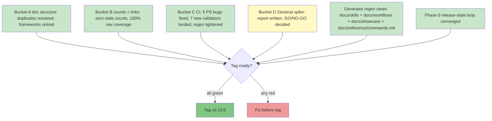
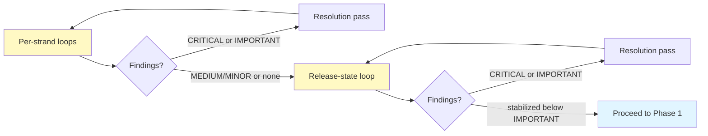
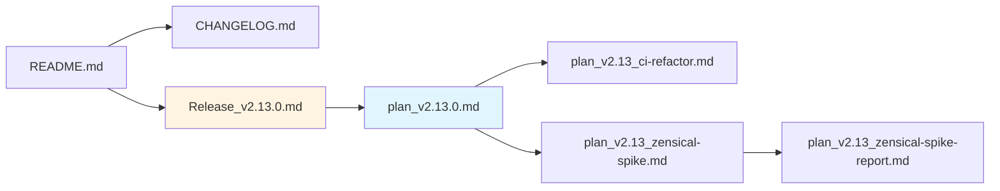

# v2.13.0 Pre-Release Document Fidelity + Quality Checklist

**Purpose:** Holistic checklist for evaluating whether v2.13.0 is tag-ready. Goes beyond the mechanical CI checks to verify documentation fidelity, narrative coherence, and the three-strand cleanup completeness across the doc-overhaul, CI-refactor, and Zensical-decision deliverables.

**When to use:**
- Before cutting the v2.13.0 git tag
- Before requesting Codex adversarial review on the release
- As template-evolution input for future refactor releases

> **Adapted from `plan_v2.11_pre-release-checklist.md`** with v2.13-specific gates: no new skills (skip skill-fidelity sections), doc-overhaul-specific verification, CI-script triplet-completeness for new validators, Zensical spike completion as a release prerequisite.

---

## Release state overview



Legend: green = expected complete pre-tag, yellow = decision-deliverable (spike outcome documented but not necessarily GO), red = blocker.

---

## Phase 0. Adversarial review loop (MUST run before tag)

**Per v2.11.0 codification + v2.12.0 release-state loop extension.** pm-skills releases run TWO Phase 0 loops:

1. **Per-strand loop** on each major deliverable (Bucket A doc-structure changes, Bucket C new validators, Bucket D spike report).
2. **Release-state loop** on the broader release stack to catch drift mechanical CI cannot (untracked file inconsistencies, prose-form stale counts, version data accuracy in concept docs, audit-trail accuracy in release notes).

Run the per-strand loops first; then the release-state loop. After each resolution pass, re-run until findings stabilize below IMPORTANT severity.



**Per-strand checklist:**

- [x] Bucket A  -  doc-structure adversarial review round(s) executed
- [x] Bucket C  -  new-validators adversarial review (logic correctness, false-positive risk) executed
- [x] Bucket D  -  Zensical spike report adversarial review executed (decision rubric correctly applied?)
- [x] All CRITICAL + IMPORTANT findings from per-strand resolved or explicitly deferred
- [x] Re-runs until per-strand findings stabilize below IMPORTANT

**Release-state checklist:**

- [x] Release-state loop round 1 executed (against full release stack)
- [x] All CRITICAL + IMPORTANT resolved
- [x] Re-runs until release-state findings stabilize per the v2.12.0-codified rule (5 Codex review rounds + 3 resolution passes = 8 numbered rounds run 2026-05-05; convergence verified: round 5 found 4 new IMPORTANT + 1 MEDIUM, round 6 was a comprehensive resolution sweep, round 7 found 2 remaining audit-trail correctness defects, round 8 resolved them. The 8-round depth itself catalogued the stale-aggregate-counter pattern at meta level: mid-loop status text freezes in-progress claims and needs a final correctness pass.)
- [x] Each round's findings + resolution commit documented in plan_v2.13.0.md Change Log

**v2.13-specific watch items** (lessons from v2.12.0):

- Don't author audit-trail prose in advance ("loop terminated after round X" before round X actually returns). Write it in past tense after the actual outcome.
- Don't write factual prose claims (counts, versions, enumerations) from memory. Re-derive from manifest / frontmatter / `git ls` at edit time.
- Watch for prose-form count drift in homepage hero, concept docs, anatomy reference. The new tightened count-CI catches more, but adversarial review is still the safety net.

---

## Phase 1. Mechanical CI (must all be green)

Run locally before tagging:

```bash
# Existing enforcing
bash scripts/lint-skills-frontmatter.sh
bash scripts/validate-commands.sh
bash scripts/validate-agents-md.sh
bash scripts/validate-skills-manifest.sh
bash scripts/validate-meeting-skills-family.sh
bash scripts/validate-version-consistency.sh

# New in v2.13 (Bucket C)
bash scripts/check-nav-completeness.sh
bash scripts/check-generated-content-untouched.sh
bash scripts/validate-references-cross-doc.sh
bash scripts/validate-docs-frontmatter.sh
bash scripts/check-internal-link-validity.sh
bash scripts/validate-skill-family-registration.sh

# Existing advisory (review output)
bash scripts/check-count-consistency.sh   # now enforcing for current-state per Bucket C item 5
bash scripts/check-context-currency.sh
bash scripts/check-version-references.sh  # new in v2.13, advisory
```

**Checklist:**

- [x] `lint-skills-frontmatter` green. all 40 skills pass (no new skills in v2.13)
- [x] `validate-commands` green. all 47 commands map to valid skills
- [x] `validate-agents-md` green. 40 skill paths match
- [x] `validate-skills-manifest` green. v2.13.0 manifest is empty (no skill version bumps); validator handles empty manifest
- [x] `validate-meeting-skills-family` green. unchanged
- [ ] `validate-version-consistency` green. all version refs at 2.13.0
- [x] `check-nav-completeness` green (new). all `docs/**/*.md` in nav or exclude_docs
- [x] `check-generated-content-untouched` green (new). regenerate clean
- [x] `validate-references-cross-doc` green (new). all reference cross-links resolve
- [x] `validate-docs-frontmatter` green (new). all rendered docs have title + description
- [x] `check-internal-link-validity` green (new). zero broken internal links
- [x] `validate-skill-family-registration` green (new). registry-driven family validation passes
- [x] `check-count-consistency` green for current-state (now enforcing). historical entries advisory
- [x] `check-version-references` reviewed (new, advisory). drift documented or fixed

---

## Phase 2. Strand-level fidelity

### 2a. Bucket A doc-structure fidelity

- [x] Duplicate top-level files resolved per Open Question 1 decision (delete + redirect, OR keep + warn, OR generate)
- [x] `docs/frameworks/` resolved per Open Question 2 decision (deleted or promoted)
- [x] `creating-skills.md` vs `authoring-pm-skills.md` consolidation complete; redirect in place if duplicate deleted
- [x] Pattern 5C frontmatter `generated: true` flag added to every generated page (`docs/skills/**/*.md`, `docs/workflows/*.md`, `docs/showcase/*.md`, `docs/reference/commands.md`)
- [x] All `redirects` plugin entries in `mkdocs.yml` resolve to existing paths

### 2b. Bucket B count + link fidelity

- [x] Zero stale skill counts across `concepts/agent-skill-anatomy.md`, `reference/categories.md`, `reference/ecosystem.md`, `reference/project-structure.md`, `guides/mcp-integration.md`, `getting-started/index.md`, `mkdocs.yml site_description`
- [x] All counts at 40 (MCP frozen at 40 in v2.9.2 per 2026-05-05 maintenance-mode pivot; superseded the v2.11.0 M-22 28-skill freeze when v2.9.2 re-embedded the full current catalog)
- [x] `docs/guides/index.md` lists all current guides
- [x] `docs/skills/index.md` carries hand-edited curated index banner; `docs/showcase/index.md` carries auto-generated banner from A.4
- [x] `utility-pm-skill-builder` SKILL.md catalog table updated: Foundation (1)→(8), Utility (1)→(6), Domain (25)→(26)
- [x] `AGENTS/codex/CONTEXT.md` decision executed (refresh or vestigial-redirect)
- [x] `mcp-setup.md` deleted; `mkdocs.yml redirect_maps` redirects `guides/mcp-setup.md` to `guides/mcp-integration.md` (canonical maintenance-mode status page)
- [x] README "What's New" workaround replaced (section-aware CI or generated section) OR explicitly accepted as v2.13.0 carryover

### 2c. Bucket C CI strand fidelity

- [x] All 5 PowerShell parity bugs fixed; PS1 output matches bash on current main
- [x] `check-count-consistency` regex tightening lands and passes against current state with no false positives
- [x] All 7 new validators have `.sh` + `.ps1` + `.md` triplet completeness (verified by `validate-script-docs.sh`)
- [x] `validation.yml` updated with new job entries; both Ubuntu and Windows legs green
- [x] At least one Codex round on each new validator's logic correctness

### 2d. Bucket D Zensical spike fidelity

- [x] Spike executed within time-box
- [x] Spike report written: `plan_v2.13_zensical-spike-report_YYYY-MM-DD.md`
- [x] Decision recorded: GO / GO-WITH-CAVEATS / NO-GO
- [ ] If GO or GO-WITH-CAVEATS: v2.14.0+ migration commitment captured in v2.14 backlog
- [x] If NO-GO: Plan B (Astro Starlight) deferred to v2.14.0+ as separate effort
- [x] Report archived in `docs/internal/release-plans/v2.13.0/` for retention

---

## Phase 3. Discoverability

The cleanups are discoverable through multiple entry points.



**Checklist:**

- [ ] README "What's New" v2.13.0 entry authored as open `<details>` block
- [ ] README "Latest stable" / "Latest release notes" / "Published tag" pointers bumped to v2.13.0
- [ ] CHANGELOG.md `## [2.13.0]` entry with Added / Changed / Infrastructure / Fixed sections
- [ ] `docs/releases/Release_v2.13.0.md` authored with hero summary, mermaid (3 strands), validation list, links to plan + CI doc + spike report
- [ ] `docs/releases/index.md` v2.13.0 row added
- [ ] AGENTS/claude/CONTEXT.md and DECISIONS.md updated for v2.13.0 SHIPPED state with v2.14.0 next-step list
- [ ] AGENTS/claude/TODO.md replaced with v2.14.0 priorities

---

## Phase 4. Release coordination

- [ ] `docs/internal/release-plans/v2.13.0/plan_v2.13.0.md` Status Snapshot reflects every commit and artifact (NOTE: re-tick at PR.5 / Phase 5 tag-prep time after Status Snapshot is refreshed alongside CHANGELOG / Release notes authoring; the Snapshot was refreshed to 2026-05-05 in round 3 resolution but additional commits may still land before tag)
- [x] Pre-release Checklist marked executed with checkboxes
- [x] Open Questions all marked Resolved with the actual decision history
- [x] Change Log appended with every release-cycle event
- [x] `docs/internal/release-plans/v2.13.0/skills-manifest.yaml` confirmed empty (no skill version bumps)
- [x] CI refactor doc (`plan_v2.13_ci-refactor.md`) marked Executed with each item's resolution status
- [x] Spike doc (`plan_v2.13_zensical-spike.md`) cross-referenced by spike report

---

## Phase 5. Tag-time chores

Customary at git-tag time (not at feature-complete time):

- [ ] CHANGELOG.md v2.13.0 entry summarizing doc + CI + Zensical-decision deliverables
- [ ] `docs/releases/Release_v2.13.0.md` release notes finalized
- [ ] `docs/releases/index.md` v2.13.0 row added
- [ ] `.claude-plugin/plugin.json` version bumped from 2.12.0 to 2.13.0
- [ ] `marketplace.json` version bumped
- [ ] README badge bumped
- [ ] `bash scripts/validate-version-consistency.sh` re-run after the bumps land (must PASS at 2.13.0 across plugin manifest, marketplace, README badge, and any other version-tracked files)
- [ ] Git tag `v2.13.0` created (annotated) and pushed
- [ ] GitHub release published from `Release_v2.13.0.md`

---

## Phase 6. Post-release signals

Monitored after the tag to decide v2.14.0 priorities:

- [ ] Zensical spike outcome triages v2.14.0 backlog (migration as scope OR Plan B Astro Starlight as scope OR neither)
- [ ] Bash + PS1 dual-stack maintenance cost (PS1 bugs encountered, hours spent on parity authoring) captured for v2.14.0 dual-stack-consolidation decision
- [ ] Sample-automation slate (F-31 to F-35 except F-34) re-evaluated with v2.13 builder simplification fully landed
- [ ] F-29 / F-30 (meeting-lifecycle workflow + family adoption guide) re-evaluated for adoption signal arrival
- [ ] First real-world use of new validators by external contributors (false-positive rate observed)
- [ ] `check-version-references` advisory output stability  -  promote to enforcing if zero false positives across cycle

---

## Quality gates: severity tiers

| Tier | Blocks tag? | Examples |
|---|---|---|
| **Tier 1: hard gate** | Yes | Any enforcing CI failure; new validator returns false positives that block other PRs; Zensical spike not executed |
| **Tier 2: soft gate** | Usually | Stale count references; cosmetic doc drift; spike report missing structured outcome |
| **Tier 3: hygiene** | No | Typos; wording refinements; nice-to-have validator polish; README "What's New" workaround replacement deferred again |

Tier 1 must be green. Tier 2 must be green or explicitly accepted as known-debt in the release plan. Tier 3 release-noted if notable; otherwise deferred.

---

## Document-fidelity heuristic: the "cold reader" test

Give the repo to someone who's never seen it. Ask them to:

1. Find out what changed in v2.13.0 (expected: README v2.13.0 What's New → CHANGELOG → Release_v2.13.0.md → plan_v2.13.0.md)
2. Understand the doc structure cleanup outcome (expected: plan_v2.13.0.md Bucket A summary → audit_repo-structure_2026-05-01.md for evidence)
3. Find the new CI validators and their purpose (expected: plan_v2.13.0.md Bucket C → plan_v2.13_ci-refactor.md per-script detail)
4. Find the Zensical decision (expected: plan_v2.13.0.md Bucket D → plan_v2.13_zensical-spike-report)
5. Know what's deferred for v2.14.0 (expected: plan_v2.13.0.md Deferred section + Open Questions)

If any of these require more than 2 clicks from a natural entry point, fix navigation before tagging.

---

## Change log for this checklist

| Date | Change |
|---|---|
| 2026-05-03 | Initial v2.13.0 checklist authored. Adapted from v2.11.0 template. v2.13-specific gates: no new skills, three strands (doc/CI/Zensical), per-strand AND release-state Phase 0 loops per v2.12.0 codification. |
