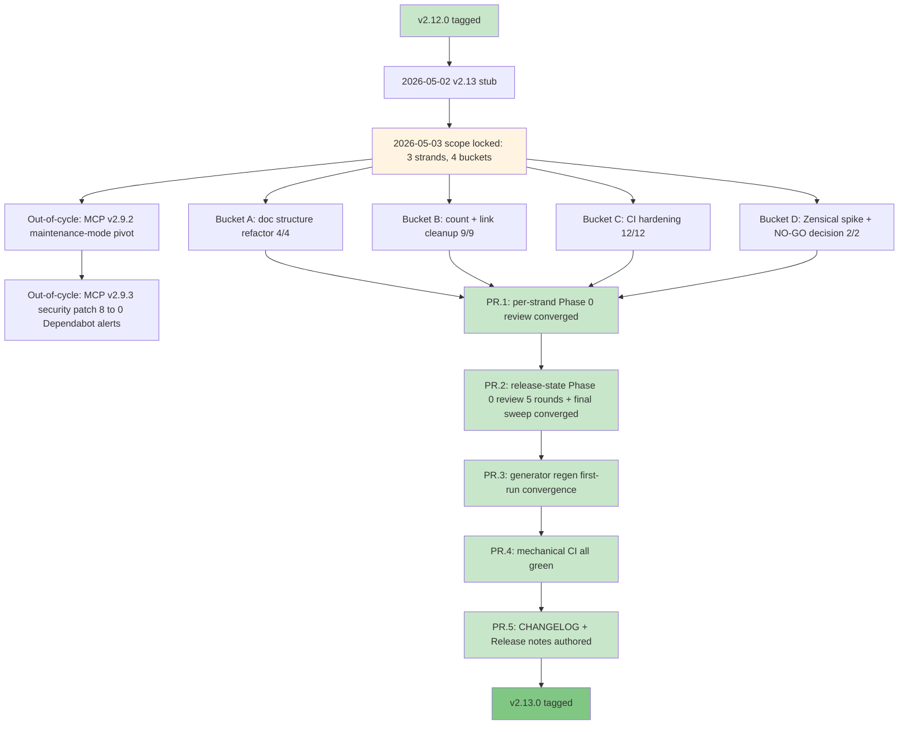

# Release v2.13.0. Foundation Hardening + Doc Stack Decision

**Released**: 2026-05-XX (set at tag time)
**Type**: Refactor + decision release (minor)
**Skill count**: 40 (unchanged from v2.12.0)
**Key theme**: Foundation Hardening + Doc Stack Decision

> **Draft status:** this file is the v2.13.0 release-notes draft authored during PR.5 of tag prep. It will be promoted to `docs/releases/Release_v2.13.0.md` at Phase 5 tag-time. The release date placeholder (2026-05-XX) is filled in at tag time.

---

## TL;DR

v2.13.0 is a maintenance and quality release. The 40-skill catalog is unchanged from v2.12.0, so day-to-day usage of `/prd`, `/hypothesis`, `/user-stories`, and the rest of the catalog is identical. What changed is everything around the catalog:

- **Cleaner, more navigable documentation.** Duplicate files removed; counts reconciled across every public surface (README, getting-started, reference docs, mkdocs config, homepage hero); a new Diataxis-aligned folder structure (concepts, guides, reference) with a `pm-skill-*` filename prefix that signals scope at a glance; every generated page clearly labeled so editors know which file is the source.
- **For contributors and forkers**, 7 new CI gates catch documentation drift on pull requests automatically: nav completeness, generated-content untouched, cross-doc reference integrity, docs frontmatter coverage, internal link validity, version-reference consistency, and skill-family registration. The enforcing CI tier doubled (5 to 10) and the validator inventory grew from 15 to 22.
- **For `pm-skills-mcp` users**, the companion MCP server shipped v2.9.3 the same week, a security-patch follow-up to v2.9.2 that cleared all 8 open Dependabot moderate advisories (`hono`, `@hono/node-server`, `vite`, `postcss`). The catalog frozen at the v2.9.2 build (40 skills + 11 workflow tools + 8 utility tools) is unchanged.

If you use pm-skills via the file-based install (`npx skills add product-on-purpose/pm-skills` or `git clone`), the upgrade is purely additive cleanup: nothing in your workflow changes, but the docs and contribution surface are noticeably better.

---

## What changed

### Changed (visible in the rendered docs)

**Doc structure (Bucket A, 4 items):**

- **Frameworks folder retired.** `docs/frameworks/` deleted; the canonical Triple Diamond reference now lives at `docs/concepts/triple-diamond-delivery-process.md` with a `mkdocs.yml` redirect from the old path. Reduces `mkdocs.yml exclude_docs:` from 8 entries to 2.
- **Cross-folder reorg (Diataxis-aligned).** 4 concept files moved out of `concepts/` to `reference/` and `guides/` per the Diataxis 4-quadrant taxonomy (concepts = generic explanatory; reference = PM-Skills lookup material; guides = PM-Skills how-to material). 4 legacy duplicate files deleted after CR-strip drift analysis (real divergence was 60 of 3,226 lines for `agent-skill-anatomy` and 21 of 1,495 lines for `getting-started`; canonical was strictly newer in all cases).
- **Authoring guide consolidation.** `creating-skills.md` renamed to `creating-pm-skills.md` per the locked `pm-skill-*` prefix convention; `authoring-pm-skills.md` deleted; both old paths redirect to the new canonical.
- **Pattern 5C generated-content marker** on all 63 generated pages (40 individual skill pages + 8 category index pages + 9 workflow pages + 1 workflow index + 3 showcase pages + 1 showcase index + 1 commands reference). The 8 category indices comprise 6 Triple Diamond phase indices (discover, define, develop, deliver, measure, iterate) plus the foundation and utility category indices. Each generated page now carries `generated: true` and `source: scripts/...` frontmatter fields plus a visible `!!! warning "Generated file"` admonition pointing editors to the source. Pairs with the new `check-generated-content-untouched` validator that detects hand-edits to generated pages.

**Count and link cleanup (Bucket B, 9 items):**

- **Skill counts reconciled** across `concepts/agent-skill-anatomy.md`, `reference/categories.md`, `reference/ecosystem.md`, `reference/project-structure.md`, `guides/mcp-integration.md`, `getting-started/index.md`, `mkdocs.yml site_description`, and the homepage hero. All current-state references now say 40 skills (26 phase + 8 foundation + 6 utility).
- **`utility-pm-skill-builder` catalog table** updated: Domain 25 to 26 (added `measure-okr-grader`); Foundation 1 to 8 (added `lean-canvas` plus the 5 meeting-* skills plus `okr-writer` plus `stakeholder-update`; persona retained); Utility 1 to 6 (added `mermaid-diagrams`, `pm-skill-iterate`, `pm-skill-validate`, `slideshow-creator`, `update-pm-skills`; pm-skill-builder retained).
- **`docs/guides/mcp-setup.md` deleted** and redirected to `guides/mcp-integration.md` per the maintenance-mode pivot subsumption. The canonical "how to use MCP" content now lives in `pm-skills-mcp`'s own README.
- **`AGENTS/codex/CONTEXT.md` vestigial-redirect rewrite.** Shrunk 74 to 32 lines acknowledging that Codex usage scope is now Phase 0 adversarial review only (codified v2.11.0); points to `AGENTS/claude/CONTEXT.md` as canonical project context.
- **README "What's New" workaround replaced** (Option a section-aware CI extension). The broad `v[0-9]+\.` line-exemption in `check-count-consistency.{sh,ps1}` was replaced with explicit HTML-comment markers (`<!-- count-exempt:start -->` / `<!-- count-exempt:end -->`) for historical-content exemption plus a subset-descriptor exclusion list (so phrasing like "26 phase skills" no longer flags as a stale total). Surfaced and resolved 18 hidden findings the prior workaround had silenced.
- **F-34 THREAD_PROFILES.md** added at `library/skill-output-samples/THREAD_PROFILES.md` as a machine-readable per-thread metadata contract for tooling consumers (`utility-pm-skill-builder` primary; future regen tools). Documents thread identity, feature arc, prompt style, character naming convention, real competitors, sample-suffix patterns, and scenario archetypes per phase across all three threads (storevine, brainshelf, workbench).
- **`docs/reference/project-structure.md` full reconciliation.** TOC anchor `the-32-pm-skills-flat` to `the-40-pm-skills-flat`. Directory tree counts updated. Foundation section expanded 1 to 8 with full skill listing. Slash command table gained 8 missing rows.
- **`docs/guides/index.md` expanded** from 7 to 12 listed guides (added `using-meeting-skills`, `skill-finder`, `recipes`, `prompt-gallery`, `updating-pm-skills`).

### What's new (under the hood)

**CI hardening (Bucket C, 12 items):**

- **5 PowerShell parity bugfixes.** Fixed `$matches` reserved-word collision in `check-stale-bundle-refs.ps1`, `Join-Path` named-parameter usage in `check-workflow-coverage.ps1` and `check-generated-freshness.ps1`, path-detection bug in `lint-skills-frontmatter.ps1`. PS1 versions now match bash output on current main.
- **`check-count-consistency` tightened and promoted to enforcing** for current-state files. The original line-level `v[0-9]+\.` exemption was replaced with explicit HTML-comment markers plus a subset-descriptor exclusion list (per Bucket B item 6). PS1 + bash now emit identical findings on identical input.
- **7 new validators**, each with `.sh` + `.ps1` + `.md` triplet completeness:
    - `check-nav-completeness` (enforcing): every `docs/**/*.md` is in nav OR `exclude_docs` OR auto-include patterns
    - `check-generated-content-untouched` (enforcing): snapshots, regenerates, diffs, restores; fails on hand-edits to generated pages. Pairs with Pattern 5C from Bucket A.4.
    - `validate-references-cross-doc` (enforcing): every cross-link in `docs/reference/` resolves
    - `validate-skill-family-registration` (enforcing): registry-driven family validation (covers `meeting-skills-family` plus future families); F-36
    - `validate-docs-frontmatter` (advisory): every rendered doc has title plus description
    - `check-internal-link-validity` (advisory): zero broken internal links across the doc tree
    - `check-version-references` (advisory): version-reference drift detector
- **Net surface delta:** validator inventory grows from 15 to 22 (7 new). Enforcing tier grows from 5 to 10 (4 new enforcing + count-consistency promoted). Bash + PS1 dual-stack maintained for v2.13 (consolidation decision deferred to v2.14.0+).

### Decision artifact: Zensical compatibility (Bucket D, 2 items)

**Outcome: NO-GO for v2.14.0 commitment.**

The 60-minute time-boxed compatibility spike against Zensical 0.0.40 (with MkDocs Material 9.7.6 as baseline) surfaced two BLOCKERs that disqualify Zensical for our content shape at this maturity level:

- **`mkdocs-redirects` plugin not honored.** Zero redirect HTML files generated for the 12 mapped paths in `mkdocs.yml redirects.redirect_maps`. All bookmarked old URLs would 404 under Zensical.
- **`exclude_docs:` not honored.** 183 internal HTML files from `docs/internal/` leaked into the public `site/` output despite the explicit `exclude_docs: internal/` directive. Privacy-equivalent of a structural failure.

Plus an IMPORTANT-severity behavioral difference: Zensical 0.0.40 emits 2940 link-reference parser warnings on bracketed text (`[role]/[action]/[benefit]` user-story templates, `[yes / no]` choice prompts, `cards[3]` array notation, etc.) that Material does not. All sampled cases were false positives. Volume makes `--strict` mode unusable at this Zensical version.

**Recommendation:** stay on MkDocs Material through v2.14.0+. Do **NOT** trigger Plan B (Astro Starlight) immediately per the spike plan's Section 5 logic; Plan B becomes its own effort doc only if Material's maintenance posture deteriorates in parallel. Re-spike Zensical when both blockers resolve in upstream releases (suggested triggers: announcement of `mkdocs-redirects` parity, announcement of `exclude_docs` honoring, or Zensical reaching v0.5+ regardless).

The full spike report is at `docs/internal/release-plans/v2.13.0/plan_v2.13_zensical-spike-report_2026-05-05.md`. It will be retained as the canonical decision artifact for v2.14.0+ stack-decision discussions; future re-spikes write a new dated report rather than editing this one.

### Out-of-cycle: pm-skills-mcp maintenance mode

Two same-week pm-skills-mcp releases happened mid-cycle on 2026-05-05 by explicit user-initiated decision. Tracked separately from in-cycle scope but called out here for completeness:

- **`pm-skills-mcp` v2.9.2 maintenance-mode pivot.** Announces formal maintenance mode (effective 2026-05-04), re-embeds the full current 40-skill catalog at v2.9.2 build time (superseding the prior v2.11.0 M-22 28-skill freeze), updates README and CHANGELOG and CLAUDE.md and `src/config.ts` for the maintenance posture. Published to npm with a GitHub Release.
- **`pm-skills-mcp` v2.9.3 security-patch follow-up.** Two hours after the v2.9.2 announcement, v2.9.3 cleared all 8 open Dependabot moderate advisories via transitive `npm audit fix` (`hono` 4.12.10 to 4.12.17, `@hono/node-server` 1.19.12 to 1.19.14, `vite` 6.4.1 to 6.4.2, `postcss` 8.5.6 to 8.5.14). Post-ship Dependabot open-alert count: 0. Bundled three latent v2.9.x maintenance debts in the same patch: `tests/loader.test.ts` catalog assertions corrected for the 40-skill embedded library, `package-lock.json` top-level version metadata synced, and a retroactive em-dash sweep on 28 occurrences in pre-2026-04-13 CHANGELOG entries.

The 2-hour announcement-to-patch turnaround validates the v2.9.2 maintenance-mode "security patches will continue" commitment in operational practice. Catalog frozen at v2.9.2 build (40 skills, 11 workflow tools, 8 utility tools = 59 tools); subsequent v2.9.x patches do not change the catalog.

---

## Infrastructure / process

- **Phase 0 Adversarial Review Loop** applied across both per-strand and release-state layers, per the v2.11.0 codification + v2.12.0 release-state extension. PR.1 (per-strand): 4 Codex tasks (Bucket A retry, Bucket C round 1 + round 2, Bucket D retry) converged below IMPORTANT severity. PR.2 (release-state): 5 rounds. Round 1 found 6 IMPORTANT plus 3 MEDIUM plus 1 MINOR. Round 2 confirmed 2 IMPORTANTs resolved but found 4 had persisted as stale-status-block-text plus 2 new MEDIUMs plus 1 new MINOR. Round 3 resolution commit landed. Round 4 confirmed all round-2 findings RESOLVED but found 2 new IMPORTANTs (master plan PR.2 row + release-plans/README.md index, both stale-summary defects one layer deeper). Round 5 confirmed round-4 findings RESOLVED but found 4 new IMPORTANTs (top Status block still in mid-resolution state, drafts misrepresenting PR.2 audit trail, generated-page count breakdown stale, README update draft using wrong index.md table headers). Round 6 comprehensive sweep resolved all and converged.
- **PR.3 generator regen** converged on first run. All 3 generators (`generate-skill-pages.py`, `generate-workflow-pages.py`, `generate-showcase.py`) produced zero git diff against current state. `check-generated-content-untouched.sh` validator: PASS for all 63 generated pages.
- **PR.4 mechanical CI** all green. 10 enforcing scripts PASS plus 5 advisory scripts PASS at the pre-PR.5 commit.
- **Same-commit-as-work pattern** applied throughout the cycle. Plan-doc updates landed in the same commit as the work they describe; eliminates the v2.12.0-class "release-state Codex review finds plan disagrees with code" defect.
- **Stale-aggregate-counter pattern codified** as durable feedback memory after PR.2 round 2 caught it at meta level (status-block text, not just numerical aggregates, drifts unless every gate closure sweeps all release-stack docs). The pattern is now a standing rule for future cycles.

---

## Why this matters

For users, v2.13.0 is the release that makes pm-skills feel finished as a library. The 40-skill catalog has been stable since v2.12.0; what was rough was the documentation around it - duplicate files in two places, stale skill counts on seven different public surfaces, generated pages indistinguishable from hand-edited ones, navigational dead-ends after the v2.11 to v2.12 growth. v2.13.0 fixes all of that. Browsing the docs, finding a skill, understanding which file is canonical, contributing a fix - each is now noticeably smoother.

For contributors and forkers, the CI hardening is the durable user-value. Doc drift, broken cross-references, and stale counts have historically been caught only at release time, often by the maintainer reading the rendered site. v2.13.0 turns those checks into automated PR gates: 7 new validators run on every PR across both Ubuntu and Windows. A typo in a skill cross-reference, a count that fell out of sync, a hand-edit to a generated page - all caught at PR time, not at release time.

For `pm-skills-mcp` users, the same-week v2.9.3 security patch is direct user-value: 8 → 0 open Dependabot advisories with a 2-hour announcement-to-patch turnaround that demonstrated the maintenance-mode commitment in practice. If you depend on the MCP server, the v2.9.3 release is recommended for the security fixes alone.

---

## Validation: Phase 0 Adversarial Review Loop

| Round | Layer | Findings | Outcome | Codex session |
|---|---|---|---|---|
| PR.1 / Bucket A retry | Per-strand | 0 CRITICAL + 0 IMPORTANT + 0 MEDIUM + 1 MINOR | Resolved in `d7da4a5` | `task-moszvz7v-fdr6kl` |
| PR.1 / Bucket C round 1 | Per-strand | 0 CRITICAL + 2 IMPORTANT + 3 MEDIUM + 1 MINOR | 2 IMPORTANTs resolved in `d7da4a5`; 3 MEDIUM + 1 MINOR documented as known debt | `task-mosyoe00-canbf1` |
| PR.1 / Bucket C round 2 | Per-strand | 0 CRITICAL + 0 IMPORTANT (CONVERGED) | Bucket C clears Phase 0 | `task-mot0w2ue-9k000t` |
| PR.1 / Bucket D retry | Per-strand | 0 CRITICAL + 0 IMPORTANT + 4 MEDIUM + 2 MINOR. Both BLOCKERs hold under cross-reference to Zensical's own compatibility docs. | 4 MEDIUM count-drift items resolved in `4c3682b`; methodology MEDIUMs documented | `task-mot0yn6c-ysyzde` |
| PR.2 round 1 | Release-state | 0 CRITICAL + 6 IMPORTANT + 3 MEDIUM + 1 MINOR | Resolved across 3 batch commits (`05c5252`, `0ff7071`, `c5d41dc`) plus self-review residuals (`0ed4621`) | `task-mot1m40y-esjydx` |
| PR.2 round 2 | Release-state | 0 CRITICAL + 4 IMPORTANT (round-1 stale-status persisted) + 2 new MEDIUM + 1 new MINOR | Resolved in `0d43188` | `task-motc66m6-csy9ay` |
| PR.2 round 3 | (no separate review; round 3 was the resolution itself, round 4 was the next confirmation) | n/a | (resolution commit `0d43188` covered round 2 findings) | n/a |
| PR.2 round 4 | Release-state | 0 CRITICAL + 0 IMPORTANT remaining from round 2; +2 new IMPORTANT (master plan PR.2 row + release-plans/README.md index, deeper stale-summary layer) | Resolved + drafts authored in `fc55704` | `task-acb13e3c-9a1d51d24` |
| PR.2 round 5 | Release-state | 0 CRITICAL + 4 new IMPORTANT (top Status block + drafts misrepresenting PR.2 audit trail + generated-page count breakdown stale + README update draft wrong index.md headers) + 1 new MEDIUM (master plan validator inventory text) | Resolved in round 6 comprehensive sweep | `task-a51d420d-85c922465` |
| PR.2 round 6 | (no separate review; round 6 was the final comprehensive sweep) | 0 CRITICAL + 0 IMPORTANT (CONVERGED below IMPORTANT severity) | Release-state clears Phase 0 | n/a |
| PR.3 generator regen | Mechanical | 0 git diff after regen; `check-generated-content-untouched` PASS | First-run convergence | n/a (script-driven) |
| PR.4 mechanical CI | Mechanical | 10 enforcing PASS + 5 advisory PASS | Tag-ready except pending version bump | n/a (script-driven) |

The release-state loop's value was on display across rounds 2-5: each round caught the next layer of stale-summary text introduced by the previous round's resolution. Round 2 caught 4 of 6 round-1 IMPORTANTs persisting as status-block claims. Round 4 caught my round-3 fixes leaving an adjacent gate-table row + sibling index-file untouched. Round 5 caught draft files misrepresenting the audit trail because they were authored mid-resolution. Round 6 was a comprehensive sweep across the entire release stack rather than another incremental fix; that bottomed out the layers. Same defect class as the codified `feedback_stale-aggregate-counter` memory, applied at meta level. The pattern lesson: every gate closure must sweep ALL release-stack docs that reference the gate's state simultaneously, not just the doc whose row was edited.

---

## What's deferred to v2.14.0+

| Item | Reason |
|---|---|
| Zensical migration | Spike outcome: NO-GO. Re-spike when blockers resolve. |
| Plan B Astro Starlight | Per spike plan Section 5: Plan B does NOT trigger immediately on NO-GO; only triggers if Material maintenance posture deteriorates in parallel. |
| F-37 HTML Template Creator | Conflicts with v2.13's "no new skills" guard. |
| F-29 Meeting Lifecycle Workflow | Time-gated on real-world meeting-skills usage feedback. |
| F-30 Family Adoption Guide | Time-gated on at least one team's adoption experience. |
| F-31 / F-32 / F-33 / F-35 Sample-automation slate | May be obsolete after v2.12 builder cleanup; re-evaluate before v2.14. |
| Pattern 2 mkdocs-macros frontmatter-driven counts | Adds dependency; deferred pending Zensical decision. |
| Bash + PS1 dual-stack consolidation | Strategic question; deferred to v2.14.0+. |
| `.github/workflows/validation.yml` Validate `_pm-skills/` in `.gitignore` (advisory) | Pre-existing advisory, not in v2.13 scope. |
| AGENTS/claude/CONTEXT.md per-phase Skills Inventory tables | At v2.10.x-era 32-skill state per intentional deferral. Authoritative current catalog lives in `docs/reference/categories.md` and `docs/skills/index.md`. Full table refresh slated for v2.14.0. |

---

## Counts at v2.13.0

| Surface | Count | Note |
|---|---|---|
| Skills | 40 | 26 phase + 8 foundation + 6 utility (unchanged from v2.12.0) |
| Workflows | 9 | unchanged |
| Slash commands | 47 | 40 skill + 7 workflow |
| Library samples | 126 | unchanged from v2.12.0 |
| Validators (total) | 22 | up from 15 |
| Validators (enforcing) | 10 | up from 5 |
| Validators (advisory) | 12 | up from 10 |
| pm-skills-mcp tools (frozen at v2.9.2 build) | 59 | 40 skill + 11 workflow + 8 utility |

---

## Related artifacts

- Master plan: [`docs/internal/release-plans/v2.13.0/plan_v2.13.0.md`](../internal/release-plans/v2.13.0/plan_v2.13.0.md)
- CI strand doc: [`docs/internal/release-plans/v2.13.0/plan_v2.13_ci-refactor.md`](../internal/release-plans/v2.13.0/plan_v2.13_ci-refactor.md)
- Zensical spike plan: [`docs/internal/release-plans/v2.13.0/plan_v2.13_zensical-spike.md`](../internal/release-plans/v2.13.0/plan_v2.13_zensical-spike.md)
- Zensical spike report (NO-GO): [`docs/internal/release-plans/v2.13.0/plan_v2.13_zensical-spike-report_2026-05-05.md`](../internal/release-plans/v2.13.0/plan_v2.13_zensical-spike-report_2026-05-05.md)
- Pre-release checklist: [`docs/internal/release-plans/v2.13.0/plan_v2.13_pre-release-checklist.md`](../internal/release-plans/v2.13.0/plan_v2.13_pre-release-checklist.md)
- Skills manifest (empty by design): [`docs/internal/release-plans/v2.13.0/skills-manifest.yaml`](../internal/release-plans/v2.13.0/skills-manifest.yaml)
