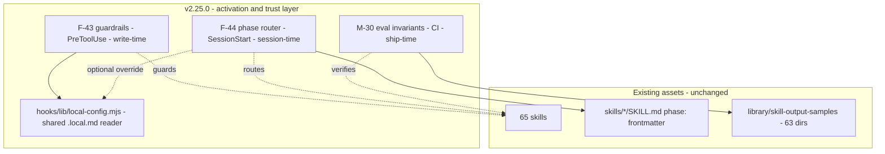
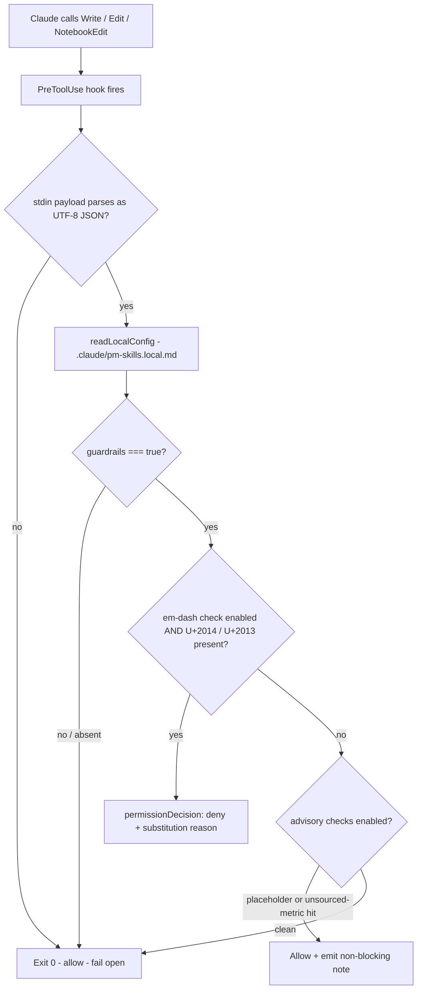
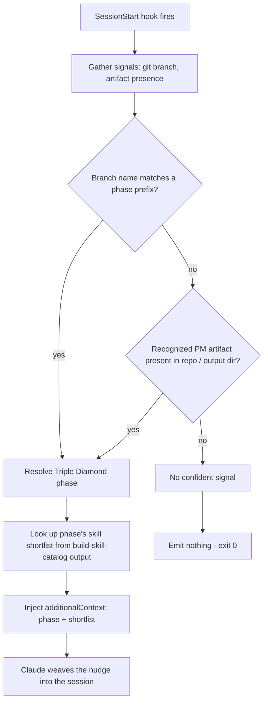
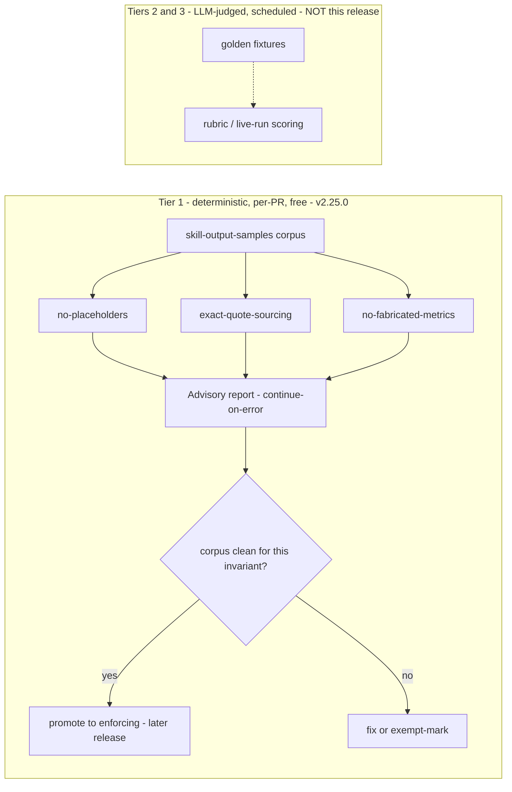

# v2.25.0 Spec: Activation and Trust Layer

**Status:** DRAFT for maintainer review (design approved via brainstorming 2026-06-03).
**Covers:** F-43 (house-rule guardrails), F-44 (phase router), M-30 (eval harness Phase 1).
**Companion:** [`plan_v2.25.0.md`](plan_v2.25.0.md). Effort briefs under [`../../efforts/`](../../efforts/).

This is one spec for three components because they share a runtime (Node `.mjs`), a config layer (`.claude/pm-skills.local.md`), and a release narrative (trust + activation over the existing 65 skills). Each component has its own section with a diagram and numbered acceptance criteria (ACs).

---

## 0. Shared architecture

### 0.1 One runtime: Node `.mjs`

All five new executables (two hooks, one shared lib, three validators) are Node ES modules. Rationale:

- **Hooks must be portable.** A `PreToolUse` / `SessionStart` hook runs on the installer's machine. Python is not guaranteed there; Node is (Claude Code ships on Node). A Python hook silently no-ops or errors where Python is absent.
- **Single-source cross-platform.** The repo's newer validators are already `.mjs` (`check-rendered-links.mjs`, `check-route-parity.mjs`), avoiding the `.sh` + `.ps1` dual-maintenance the older trio requires. Aligning the eval validators with the hooks keeps one idiom.
- **`js-yaml` is already a root tooling dependency** (added in the Astro convergence), so the `.local.md` frontmatter parse needs no new dependency.

### 0.2 Component map



### 0.3 The `.claude/pm-skills.local.md` config (shared)

A gitignored, per-project file with YAML frontmatter, read by `hooks/lib/local-config.mjs`. MVP schema:

```yaml
---
# F-43 guardrails (default: absent = off)
guardrails: true
guardrail_checks: [em-dash, placeholder, fabricated-metric]
# F-44 router override (optional, post-MVP; absent = default confident-only behavior)
phase_router: auto        # auto | off | verbose
---
```

`local-config.mjs` contract: locate `.claude/pm-skills.local.md` from the project root, parse the frontmatter with `js-yaml`, return a plain object (or `{}` on absence / parse error). It NEVER throws to its callers; a parse error returns `{}` so the hooks fail open.

### 0.4 Build-time confirmations (do BEFORE coding the hooks)

A short spike confirms against `code.claude.com/docs`:

1. Plugin hook registration: `hooks/hooks.json` schema and whether it auto-discovers or must be declared in `.claude-plugin/plugin.json`.
2. `PreToolUse` output shape for a deny (the `hookSpecificOutput.permissionDecision: "deny"` + `permissionDecisionReason` form the personal hook already uses) and for a non-blocking advisory note.
3. `SessionStart` output shape for injecting `additionalContext`, and the exact field name.
4. Whether the hook receives the project root / cwd needed to locate `.claude/pm-skills.local.md`, and the `tool_input.file_path` for any future path-scoping.

---

## 1. Shared lib: `hooks/lib/local-config.mjs`

**Purpose:** single reader for `.claude/pm-skills.local.md`. One unit so both hooks parse config identically and fail open identically.

**Interface:**
- `readLocalConfig(projectRoot) -> object` - returns parsed frontmatter as an object, or `{}` if the file is absent or unparseable. Never throws.
- `isGuardrailEnabled(config) -> boolean` - true only if `config.guardrails === true`.
- `enabledChecks(config) -> string[]` - the `guardrail_checks` array, defaulting to `['em-dash']` when guardrails are on but no list is given.

**ACs:**
- AC-L1: absent file returns `{}`.
- AC-L2: malformed YAML returns `{}` (no throw).
- AC-L3: `guardrails: true` with no `guardrail_checks` yields `enabledChecks === ['em-dash']`.
- AC-L4: the function never reads outside the project root.

---

## 2. F-43 - house-rule guardrails (`hooks/guardrails.mjs`)

### 2.1 Behavior

A `PreToolUse(Write|Edit|NotebookEdit)` hook. Reads the tool payload from stdin (recognizing `tool_input.new_string` / `.content` / `.new_source`, matching the personal hook), reads `.local.md` via the shared lib, and enforces only when opted in.



### 2.2 Checks

| Check | Mode | Definition |
|---|---|---|
| `em-dash` | BLOCK | text contains U+2014 or U+2013. Ported from `no-em-dashes.py`, including the explicit UTF-8 stdin decode (do not let Windows cp1252 mis-decode multibyte glyphs into a phantom em-dash). |
| `placeholder` | WARN | text contains `[Placeholder]`, `[Feature Name]`, `TODO`, or an unfilled `<...>` token. |
| `fabricated-metric` | WARN | a number/percentage in the text not present in the surrounding context and not marked `[fictional]`. Heuristic; advisory only. |

Employer-specific-context detection is explicitly NOT a hook check; it is deferred to `pm-critic`.

### 2.3 ACs

- AC-43-1: with NO `.local.md`, a Write containing an em-dash is ALLOWED (hook inert by default).
- AC-43-2: with `guardrails: true`, a Write containing U+2014 or U+2013 is DENIED with a reason naming the character and the ` - ` substitution.
- AC-43-3: with `guardrails: true` and `guardrail_checks: [em-dash]`, a placeholder-only Write is ALLOWED (placeholder not enabled).
- AC-43-4: with placeholder enabled, a Write containing `TODO` emits a non-blocking note and is ALLOWED (warn, not deny).
- AC-43-5: a malformed payload or a malformed `.local.md` ALLOWS the write (fail open); the hook never throws to the host.
- AC-43-6: the hook's own source can be edited without self-blocking (banned characters represented as escape sequences, as in the personal hook).
- AC-43-7: unit tests in `guardrails.test.mjs` cover AC-43-1..5 with fixture payloads.

---

## 3. F-44 - phase router (`hooks/phase-router.mjs`)

### 3.1 Behavior

A `SessionStart` hook (rule-based MVP). Gathers cheap signals, maps a STRONG signal to one Triple Diamond phase, looks up that phase's skills, and injects an `additionalContext` nudge. No strong signal emits nothing.

**Data source:** the hook derives the phase-to-skills map by reading the `phase:` field from `skills/*/SKILL.md` frontmatter directly (via `js-yaml`), NOT from `build-skill-catalog.py` output. Rationale: the Node hook cannot invoke a Python script at runtime, and that script emits a filtered markdown doc scoped to one skill's recommendation tiers, not a phase map. The `phase:` frontmatter is the authoritative classification the Python script itself parses; the six valid values are `discover`, `define`, `develop`, `deliver`, `measure`, `iterate` (30 skills carry one).



### 3.2 Signal-to-phase mapping (MVP)

| Signal | Example | Maps to |
|---|---|---|
| Branch prefix | `discover/...`, `define/...`, `develop/...`, `deliver/...`, `measure/...`, `iterate/...` | the named phase |
| Artifact present | a problem-statement / persona file | Discover / Define |
| | a PRD / acceptance-criteria file | Deliver |
| | an OKR / dashboard-spec file | Measure |
| No strong signal | a generic repo, no phase branch, no artifact | NONE (silent) |

The phase-to-skills shortlist is built by globbing `skills/*/SKILL.md`, parsing the `phase:` frontmatter with `js-yaml`, grouping by phase, and naming the top few skills for the resolved phase. No Python, no committed-catalog dependency.

### 3.3 ACs

- AC-44-1: a repo on branch `discover/x` injects a nudge naming the Discover phase and at least one real Discover-phase skill.
- AC-44-2: a repo with a recognized PRD-style artifact and no phase branch injects a Deliver-phase nudge.
- AC-44-3: a repo with NO phase branch and NO recognized artifact injects NOTHING (silent path; hook exits 0 with no `additionalContext`).
- AC-44-4: every skill named in a nudge exists in `skills/` with a matching `phase:` frontmatter value (no fabricated skill names).
- AC-44-5: a git or filesystem error during signal-gathering results in the silent path (fail safe), never a crash.
- AC-44-6: unit tests in `phase-router.test.mjs` cover the confident (AC-44-1/2) and silent (AC-44-3) paths with fixtures.

---

## 4. M-30 - eval harness Phase 1 (deterministic invariants)

### 4.1 Scope

Tier 1 only of the three-tier design. Deterministic invariants over `library/skill-output-samples/`, wired advisory into `validation.yml`. No LLM, no cost.



### 4.2 The three invariants

| Validator | Determinism | Rule | Scope |
|---|---|---|---|
| `check-sample-no-placeholders.mjs` | full | flags `[Placeholder]`, `[Feature Name]`, `TODO`, unfilled `<...>` brackets in any sample body | all samples |
| `check-sample-exact-quote-sourcing.mjs` | full | every `Source:` quoted span is an exact substring of the sample's Prompt/input block | evidence-citing skills, starting with `foundation-prioritized-action-plan` |
| `check-sample-no-fabricated-metrics.mjs` | heuristic | a number/percentage not marked `[fictional]` and absent from the sample's Prompt block is flagged | all samples; `[fictional]` allowlist + per-sample exempt marker |

### 4.3 ACs

- AC-30-1: each validator exits 0 on a known-good fixture and non-zero on a known-bad fixture (covered in its `.test.mjs`).
- AC-30-2: all three are wired into `validation.yml` with `continue-on-error: true`; NONE is in the enforcing pre-tag bundle.
- AC-30-3: running the suite over the real corpus produces a readable per-sample report (file, invariant, finding); pre-existing violations are listed, not silently passed.
- AC-30-4: `no-fabricated-metrics` honors the `[fictional]` marker and a per-sample exempt marker (mirroring `count-exempt`).
- AC-30-5: any pre-existing corpus violation is triaged (fixed or exempt-marked) before tag, so the advisory run is informative rather than noise.
- AC-30-6: confirm `validate-script-docs` does not fail on `.mjs` validators lacking a `.md` companion; if it does, add companions.

---

## 5. Cross-component acceptance

- AC-X1: `validate-plugin-install` green with the new `hooks/` directory present.
- AC-X2: catalog counts UNCHANGED (65 skills, 5 sub-agents); `check-count-consistency` + `check-landing-page-counts --strict` green.
- AC-X3: version surfaces at 2.25.0; `validate-version-consistency` green.
- AC-X4: three user-facing reference docs exist with valid frontmatter and rendered mermaid; `validate-docs-frontmatter` + Astro build green.
- AC-X5: no em-dash / en-dash in any new file (repo hard rule).
- AC-X6: all new `*.test.mjs` pass in CI on Linux and Windows.
