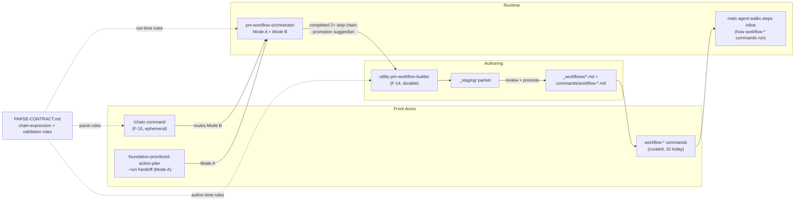

# v2.26.0 Spec: Workflow Builder + Ad-Hoc Chaining (F-14 + F-15)

**Status:** DRAFT for maintainer review (specced 2026-06-10; build does not start until this spec is approved). Revised 2026-06-10 R1 after the Codex adversarial review: separator-driven chain boundary (CR-4), smoke gate reworded as an evidence gate (CR-6), runtime-components row added to the builder checklist (CR-5 follow-on). R3: the builder checklist also names the validator-blind `.github/workflows/release.yml` release-note template so future workflow promotions cannot reintroduce the CR-8 class (CR-9). Finding-by-finding trace: [`review_2026-06-10_codex-adversarial.md`](review_2026-06-10_codex-adversarial.md).
**Covers:** Workflow Builder (F-14, issue #133) and Ad-Hoc Skill Chaining (F-15, issue #134), specced jointly per the v2.26.0 plan because they share one chain-definition core.
**Companion:** [`plan_v2.26.0.md`](plan_v2.26.0.md) | [`implementation-plan_workflow-builder-and-chaining.md`](implementation-plan_workflow-builder-and-chaining.md) | effort briefs [`F-14-workflow-builder.md`](../../efforts/F-14-workflow-builder.md), [`F-15-skill-chaining.md`](../../efforts/F-15-skill-chaining.md) (historical; this spec supersedes their stale numbers: "29-skill library", "9 workflows", `generate-workflow-pages.py`, and mkdocs nav all predate the current 65-skill / 12-workflow / Pattern S reality).

---

## 0. Shared architecture: one engine, two front doors, one authoring tool

### 0.1 The discovery that shapes this spec

When the F-15 brief was written, no runtime existed and the brief proposed building one (Options A/B/C). Since then, v2.24.0 shipped `pm-workflow-orchestrator`, whose **Mode B already IS the ad-hoc chain runtime**: it accepts a user-named ordered skill list plus context, validates every name pre-flight (exact-match, no auto-correct), refuses Tier-3 maintenance skills and self-reference, routes curated workflows out as MANUAL, supports CHECKPOINTED / GUARDED AUTO / `--force-auto` / `--dry-run`, threads context only on user-declared dependency, and auto-enables disk-write for 2+ step runs (`agents/pm-workflow-orchestrator.md`, "Mode B" sections; `skills/utility-pm-workflow-orchestrator/references/PARSE-CONTRACT.md`).

Therefore **F-15 builds no engine and no new skill.** It productizes Mode B: a terse `/chain` front door, a written-down chain-expression contract, and a promotion path into F-14. And **F-14's authoring-time validation reuses the same contract** the engine applies at run time. The "shared engine" the plan asked for is a shared **contract**, not shared new code.

### 0.2 Composition map

The loop this closes: try a sequence ad hoc (`/chain`), discover it is reusable, promote it to a durable workflow (builder), and from then on run the curated `workflow-*` command. The orchestrator stays the generic runtime; curated workflow commands stay main-agent-guided documents; neither is superseded.

### 0.3 The pinned orchestrator boundary

| Surface | Persistence | Who executes | Validation source | Status |
|---|---|---|---|---|
| `/chain` (F-15) | Ephemeral; nothing committed | `pm-workflow-orchestrator` Mode B (native sub-agent on Claude Code; dispatch skill inline branch elsewhere) | Chain-expression contract in `PARSE-CONTRACT.md` | NEW, inherits the engine's EXPERIMENTAL label until the smoke gate passes |
| `utility-pm-workflow-orchestrator` Mode B direct | Ephemeral | Same engine | Same contract | Shipped v2.24.0 (EXPERIMENTAL) |
| `workflow-*` commands | Durable, curated, hand-authored | Main agent reads each skill inline (NOT the orchestrator) | Author judgment + repo validators | Shipped; unchanged |
| `utility-pm-workflow-builder` (F-14) | Authors durable files via `_staging/` | Not an executor; writes a packet only | Same contract, applied at authoring time | NEW |

Boundary rules carried over unchanged from v2.24.0 and restated here as binding: the orchestrator never nests a workflow (Category 3 steps surface as MANUAL); it never spawns a sub-agent (leaf-inlining for Category 2; no `Agent` tool; no `_chain-permitted.yaml` entry); Mode A and Mode B threading semantics are untouched by this spec except for formalizing the already-reserved user-declared dependency flag as `--thread` (section 1.4).

### 0.4 Decisions (lettered for review)

| # | Decision | Choice | Rationale | Alternative rejected |
|---|---|---|---|---|
| D-A | F-15 implementation form | `/chain` command + Mode B contract + promotion path; NO new skill, NO new engine | Mode B already implements the brief's entire runtime ask; a `utility-skill-chain` skill would near-duplicate the orchestrator's description and trigger surface (exactly the collision class the 2026-06-09 audit flagged) | Brief Option B (chain skill) and Option C (MCP tool; MCP is in maintenance mode) |
| D-B | Builder skill name | `utility-pm-workflow-builder` | Symmetry with `utility-pm-skill-builder` and `utility-pm-workflow-orchestrator`; the brief's `utility-workflow-builder` predates the `utility-pm-*` convention | `utility-workflow-builder` |
| D-C | New command file `commands/chain.md` | Yes, one new command | The commands class is, post-v2.22.0, exactly "multi-skill orchestration entry points" (the 10 `workflow-*` files); `/chain` is that class. Issue #134 names `/chain` as the ask. Codex and other non-Claude clients use the orchestrator dispatch skill directly with the same chain expression, so no portability is lost | No command (invoking the orchestrator by name is a mouthful for an ergonomics feature) |
| D-D | Smoke gate | The v2.24.0 native-path smoke test (dry-run + live 2-step chain on the installed plugin) becomes an EVIDENCE gate of THIS release: it must RUN and its result must be RECORDED before the tag. A recorded FAIL keeps the EXPERIMENTAL label and is disclosed in the release notes; it does not block the ship. Only an UNRUN smoke test blocks the tag | Shipping a headline `/chain` on a never-smoked engine path is the wrong order; this also closes the v2.24.0 residual question. Hard-blocking on a live FAIL would couple the release to environment flakiness the EXPERIMENTAL label already governs | Ship with no test at all (wastes the natural test moment); or a hard-blocking acceptance gate (overcouples) |
| D-E | Catalog impact | 65 -> 66 skills (utility 11 -> 12); commands 10 -> 11; workflows stay 12 | F-14 adds one skill; F-15 adds zero | - |
| D-F | Builder step types | v1 generates workflows whose steps are Category 1 content skills only | Matches every existing workflow; dispatch skills (Category 2) and nested workflows (Category 3) are refused with an explanation, keeping builder output runnable by both the main agent and (step-wise) the engine | Allowing dispatch-skill steps (pulls sub-agent semantics into curated docs) |
| D-G | Threading flag name | `--thread` | The engine body already reserves "a flag or chain syntax" for user-declared dependency; this names it. Default remains OFF (each step self-sufficient given shared context) | Inferring dependencies from skill identity (explicitly forbidden by the engine) |

### 0.5 Out of scope (resolves the F-15 brief's open questions)

- **No branching** ("if results negative run pivot-decision"): workflow-document territory; a chain is strictly ordered.
- **No parallelism**: deferred indefinitely; nothing in the engine supports it.
- **No saveable chains**: persistence IS the promotion path to F-14; `/chain save` will not exist.
- **No MCP chaining tool**: pm-skills-mcp is in maintenance mode by standing decision.
- **No auto-promotion**: the builder always writes to `_staging/`; a human promotes.

---

## 1. F-15: `/chain` (productize Mode B)

### 1.1 Deliverables

1. `commands/chain.md` (new command file).
2. A new "Mode B Chain Expression Contract" section in `skills/utility-pm-workflow-orchestrator/references/PARSE-CONTRACT.md`.
3. Engine edits in `agents/pm-workflow-orchestrator.md`: `--thread` formalized; promotion suggestion in the completion terminal block.
4. Dispatch-skill edits in `skills/utility-pm-workflow-orchestrator/SKILL.md`: version 1.0.0 -> 1.1.0, chain front door + `--thread` documented, HISTORY.md created.
5. Smoke-test record (D-D) in the sub-agent compatibility matrix.

### 1.2 Chain expression contract (normative content for the new PARSE-CONTRACT section)

- **Form:** an ordered list of skill names separated by `,` or `->` (the two separators are equivalent; mixing is allowed), followed by free-form context. Example: `deliver-prd -> deliver-user-stories Mobile checkout redesign for the EU market`.
- **Boundary (separator-driven):** the chain expression is exactly the separator-joined list; it ends after the first step token not followed by a separator, and everything after that is context, even when the context words look like skill names (`deliver-prd, deliver-user-stories mobile checkout redesign` is two steps plus context). A separator promises another step: a trailing separator with nothing resolvable after it is a parse refusal, never a silent drop. The boundary never depends on token shape or letter case, so the front door needs no skill knowledge: the command parses shape, the engine remains the only name authority.
- **Flags:** `--auto`, `--force-auto`, `--dry-run`, `--thread` may appear anywhere; they are extracted before parsing and passed through to the engine unchanged.
- **Name rules:** each entry must exactly match an installed skill (`skills/<name>/SKILL.md`). Name-safety is inherited: never approximate or auto-correct. On a miss, refuse the WHOLE run pre-flight and suggest the closest real names (for example `prd` -> "did you mean deliver-prd?"). Suggestions are offers, not substitutions.
- **Existing rules cross-referenced, not restated:** Tier-3 maintenance refusal, self-reference refusal, Category 1/2/3 routing (content / leaf-inline / surface-as-MANUAL), no top-3 cap with a context-budget warning past 3 steps, GUARDED AUTO degrading to CHECKPOINTED for Mode B without `--force-auto`. The new section links to those rules; it does not duplicate them.
- **`--thread`:** opt-in declaration that step N+1 consumes step N's artifact; the engine passes the prior artifact reference per its existing user-declared dependency rule. Without `--thread`, every step is self-sufficient given the shared context. `--thread` declares a linear pipeline over the whole chain (per-step granularity is out of scope for v1).

### 1.3 `commands/chain.md` behavior

The command is a thin prompt (mirroring the `workflow-*` command thinness): it tells the model to (1) extract flags, (2) split the chain expression from the context at the separator-driven boundary defined in the contract (1.2), (3) restate the parsed chain and context in one confirmation line, and (4) invoke the `utility-pm-workflow-orchestrator` skill, referencing `skills/utility-pm-workflow-orchestrator/SKILL.md` literally (required: `validate-commands.sh:12` fails any command file without at least one `skills/<name>/SKILL.md` path), with the chain, context, and flags. It contains NO step-loop logic, no status rubric, and no name-validation rules of its own; it applies the contract's boundary rule only, and the engine is the single authority for everything else (the command links to the contract section rather than restating it). Receives input via `$ARGUMENTS` like every other command.

### 1.4 Engine and dispatch-skill deltas (exhaustive)

- `agents/pm-workflow-orchestrator.md`: (a) in "Mode B: a user-named chain plus context," replace the prose reservation "(a flag or chain syntax)" with the named `--thread` flag and point to the new contract section; (b) in the completion terminal block's "Next steps," add one line: when the run was a Mode B chain of 2+ steps, suggest `utility-pm-workflow-builder` with the exact chain prefilled ("Reusable? Promote this chain to a durable workflow with utility-pm-workflow-builder"). No other engine behavior changes.
- `skills/utility-pm-workflow-orchestrator/SKILL.md`: bump `metadata.version` to 1.1.0 and `metadata.updated`; add `/chain` to "When to Use" (Claude Code ergonomics note) and `--thread` to the run-modes prose; description updated per the F-12 Batch 0 coordination note (the orchestrator's description rewrite is owned HERE, not by F-12, to avoid a double bump; see `spec_skill-quality-convergence.md` section 3).
- Create `skills/utility-pm-workflow-orchestrator/HISTORY.md` (second version triggers history per `docs/internal/skill-versioning.md`).

### 1.5 Acceptance criteria

- AC-C1: `/chain deliver-prd, deliver-user-stories <context>` parses, confirms, and routes to the orchestrator with both names validated pre-flight.
- AC-C2: an unknown name in the separator-joined list (`/chain prd, deliver-user-stories ...`) refuses the whole run before any step and suggests `deliver-prd`; nothing executes. A trailing separator with nothing after it also refuses. Lowercase context after an unseparated final step parses as context, not steps (`/chain deliver-prd, deliver-user-stories mobile checkout redesign` = exactly two steps).
- AC-C3: `--dry-run` through `/chain` walks the steps with "NOT EXECUTED - dry run" per step.
- AC-C4: `--auto`, `--force-auto`, `--thread` reach the engine unchanged; Mode B without `--force-auto` stays effectively checkpointed under `--auto` (existing guardrail observed through the new front door).
- AC-C5: a chain naming `utility-pm-workflow-orchestrator` or any Tier-3 maintenance skill is refused with the engine's standard message.
- AC-C6: a completed 2+ step chain's terminal output contains the promotion suggestion naming `utility-pm-workflow-builder` and the exact chain.
- AC-C7: `commands/chain.md` contains no copy of the step loop, status rubric, or validation rules (review check: it links to the contract).
- AC-C8: `validate-commands`, `check-agents-md-command-sync`, and `check-count-consistency` pass after the command-count claim sweep (10 -> 11 command files; "10 /workflow-*" phrasings remain true and are left intact where they say exactly that).
- AC-C9: smoke gate (D-D) executed and RECORDED: `--dry-run` plus one live 2-step chain on the installed plugin; the compatibility matrix and the dispatch skill's status block updated to reflect the result (EXPERIMENTAL label removed only on a recorded PASS of the native path).

---

## 2. F-14: `utility-pm-workflow-builder`

### 2.1 Identity

- `skills/utility-pm-workflow-builder/` with `SKILL.md`, `references/TEMPLATE.md`, `references/EXAMPLE.md` (lint contract: TEMPLATE has 3+ H2 sections; EXAMPLE complete).
- Frontmatter: `classification: utility`, `category: workflow`, `version: "1.0.0"`, `frameworks: [triple-diamond]`. No command wrapper (v2.22.0 convention: the skill name is the invocation).
- Proposed description (verbatim; 78 words, no unquoted colon-space, trigger-first, boundary sentences per the 2026-06-09 audit's description standard):

> Guides a contributor from a workflow idea to a complete Workflow Implementation Packet (draft workflow file, draft workflow command, cross-cutting update checklist) in a staging area for review. Runs overlap analysis against the existing workflows with a Why Gate, then helps select and sequence skills with authored handoffs. Use when creating a new multi-skill workflow or promoting a repeated ad-hoc chain into a durable one. To build a single skill instead, use utility-pm-skill-builder; to run a sequence without authoring anything, use the chain command or utility-pm-workflow-orchestrator.

### 2.2 The five-step flow (mirrors `utility-pm-skill-builder`)

1. **Understand the idea.** Three entry forms, all converging: problem-first ("I need a workflow for quarterly business reviews"), skills-first ("chain competitive-analysis, experiment-results, pivot-decision"), and chain-promotion (the orchestrator's terminal suggestion hands over a literal chain expression plus the run's context). One clarifying question max.
2. **Overlap analysis + Why Gate.** Compare against ALL current `_workflows/*.md` (12 today; scan the directory, never a hardcoded list). Name each overlapping workflow and what it covers. Kill gate at >70% coverage overlap: recommend customizing the existing workflow, adding a step to it, or just using `/chain`. The Why Gate asks for 2-3 scenarios existing workflows fail; do not pass without evidence or explicit override.
3. **Sequence design.** Select and order steps with the user. Validation applies the chain-expression contract at authoring time: every step must resolve to an installed skill; Tier-3 maintenance skills, dispatch skills, and workflows are refused as steps (D-F; Category 1 content skills only); self-reference impossible by construction. For each step, author the handoff: what this step consumes from the prior step, what it must produce for the next (this authored guidance is exactly what distinguishes a workflow from a chain).
4. **Generate the packet** into `_staging/workflows/<name>/` (gitignored staging, same review model as the skill builder): draft `_workflows/<name>.md`, draft `commands/workflow-<name>.md`, auto-generated linear mermaid context-flow diagram, and the cross-cutting checklist (2.4). Never write to canonical locations.
5. **Review + promotion guidance.** Present the packet; on approval, the user (or a follow-up session) moves files to canonical paths and works the checklist. The builder itself never promotes.

### 2.3 Generated workflow-file contract

The draft `_workflows/<name>.md` must carry the section inventory the 12 current files share (source exemplars: `_workflows/sprint-planning.md`, `_workflows/customer-discovery.md`): title-only YAML frontmatter; H1; one-line bold tagline blockquote; **Workflow Metadata** table (Workflow, Command, Skills, Phases Covered, Estimated Duration, Prerequisite Inputs, Final Output); **When to Use This Workflow** including the "Do NOT use when" list with pointers to neighboring workflows; **Workflow Steps** (per step: skill link as a repo-relative path per `_workflows/README.md`, "What you do," "Input requirements," "Output"); a mermaid context-flow diagram; **Tips**; **Quality Checklist**; **See Also**. The draft `commands/workflow-<name>.md` mirrors the existing command shape: description frontmatter, per-step "Use the X skill from `skills/X/SKILL.md`" body, "Context from user: $ARGUMENTS" footer. The full normative skeletons live in the builder's `references/TEMPLATE.md`; `references/EXAMPLE.md` is one complete worked packet (scenario: a "quarterly-business-review" workflow chaining `foundation-stakeholder-update` prerequisites, `measure-experiment-results`, `discover-stakeholder-summary`, `foundation-meeting-agenda`; final content at author's discretion but must be complete, no bracketed scaffolding).

### 2.4 Cross-cutting checklist (the packet's promotion checklist, current as of v2.25.2)

The checklist the packet emits must name exactly these surfaces, because adding a workflow trips them:

| Surface | What changes | Enforced by |
|---|---|---|
| `_workflows/<name>.md` | the new file | `check-workflow-generator-coverage` (enforcing), `gen-site.mjs` emits the site page automatically (Pattern S: NO hand-authored docs page) |
| `commands/workflow-<name>.md` | the new command | `validate-commands` (enforcing), `check-workflow-coverage` (advisory; a command-less workflow must be added to its documented optional list instead) |
| `AGENTS.md` | workflows section + command list | `validate-agents-md`, `check-agents-md-command-sync` (enforcing) |
| `README.md` | workflow table row + any workflow/command count phrasings | `check-count-consistency` (enforcing) |
| `QUICKSTART.md` | "12 Workflows" / command-count phrasings | `check-count-consistency` |
| `site/src/content/docs/index.mdx` | hand-authored workflow table + "12 guided multi-skill workflows" line | `check-landing-page-counts --strict` (enforcing) |
| `site/src/content/docs/reference/runtime-components.md` | the content-library counts line ("... skills, ... slash commands, 12 workflows ...") when workflow or command counts change | `check-count-consistency` (enforcing) |
| `.github/workflows/release.yml` | the generated public release-note template's "Slash commands (10 `/workflow-*` orchestrators ...)" bullet: a NEW workflow command makes that count FALSE, and NO validator scans YAML (`check-count-consistency` covers `.md`/`.mdx`/`.json` only). Validator-blind surface; update it by hand every time `commands/workflow-<name>.md` is added (review CR-9) | none (validator-blind; the checklist IS the control) |
| `CHANGELOG.md` | entry under `[Unreleased]` | release motion |

(The builder shipping in v2.26.0 does NOT itself add a workflow, so at ship time these stay at 12; the checklist exists for the builder's users.)

### 2.5 Acceptance criteria

- AC-B1: `lint-skills-frontmatter` passes for the new skill (name=dir, description 20-100 words without unquoted ": ", license, metadata.version/updated, classification XOR phase, TEMPLATE 3+ H2s, EXAMPLE present, byte-0 frontmatter).
- AC-B2: the Why Gate and >70% kill gate fire in the EXAMPLE walkthrough; the overlap step scans `_workflows/` rather than embedding a workflow list (no hardcoded "12").
- AC-B3: step validation refuses a Tier-3 skill, a dispatch skill, and a workflow named as a step, each with the standard explanation; an unknown skill name is refused with suggestions (same name-safety as the engine).
- AC-B4: the packet lands only under `_staging/workflows/<name>/`; no canonical path is written.
- AC-B5: the generated workflow draft contains every section in 2.3; the generated command draft matches the existing command shape; the mermaid diagram derives from the chosen sequence.
- AC-B6: chain-promotion entry works end-to-end with a chain expression as input (the exact string the orchestrator's terminal suggestion emits).
- AC-B7: catalog sweep complete: 65 -> 66 everywhere counts are claimed (README x7 sites + badge, QUICKSTART x2, CLAUDE.md, `.claude-plugin/plugin.json`, `.claude-plugin/marketplace.json`, `.codex-plugin/plugin.json` longDescription, `site/src/content/docs/index.mdx` headline + Utility card), utility 11 -> 12 in every breakdown; `check-count-consistency` + `check-landing-page-counts --strict` green. (Note: lands AFTER the 2026-06-09 audit's landing-page de-rot, which first corrects the Utility card to 11; see plan workstream WS-A.)
- AC-B8: 3-thread library samples exist at `library/skill-output-samples/utility-pm-workflow-builder/` matching the skill-builder precedent (sample = a Workflow Implementation Packet per thread), and `check-skill-sample-coverage` remains green.
- AC-B9: AGENTS.md gains the skill entry; `validate-agents-md` green.

---

## 3. Documentation and runtime-component updates (joint)

- `AGENTS.md`: utility section gains `utility-pm-workflow-builder`; commands section gains `/chain`; the workflows section's "how these compose" paragraph adds the chain -> builder -> workflow promotion loop (one short paragraph, with the 0.2 diagram's logic in prose).
- `site/src/content/docs/reference/runtime-components.md`: add `/chain` (front door, Mode B) and the builder (authoring tool) rows; restate the boundary table (0.3).
- `site/src/content/docs/reference/sub-agent-compatibility.md`: orchestrator row updated with the smoke-gate result (AC-C9).
- README "Workflows" section: one short "Ad-hoc chains and building your own" paragraph introducing `/chain` and the builder.

## 4. Risks and mitigations

- **Engine path unproven natively (v2.24.0 residual):** mitigated by D-D, the evidence gate: the smoke test runs BEFORE tagging and its result is recorded either way. If the live chain FAILS, `/chain` still ships (it is a front door to a labeled-EXPERIMENTAL engine, same as today's dispatch skill) with the failure recorded, the EXPERIMENTAL label kept, and the release notes disclosing it; the builder is unaffected. This wording is deliberately consistent with the release plan's P-G and the implementation plan's Task 9.3 (an earlier draft said "acceptance gate," which contradicted the ship-anyway posture; resolved per review CR-6).
- **Description collision with the two sibling utilities:** the proposed descriptions (1.4 orchestrator rewrite, 2.1 builder) carry explicit cross-pointers ("to build a single skill... to run a sequence..."); review them as a SET against `utility-pm-skill-builder` before merge.
- **Count-claim sweep misses:** `check-count-consistency` and `check-landing-page-counts --strict` are the nets; the implementation plan runs both at every commit point that changes a count.

## 5. Resolved questions from the briefs

| Brief question | Resolution |
|---|---|
| F-15: command, skill, or MCP tool? | Command + Mode B contract (D-A); no skill, no MCP |
| F-15: implicit vs explicit context passing | Engine semantics unchanged: shared context by default, `--thread` for declared linear dependency (D-G) |
| F-15: branching / parallelism / saving | All out of scope (0.5) |
| F-15: promotion built-in? | Yes: engine terminal suggestion -> builder chain-promotion entry |
| F-14: skill or command? | Skill, no wrapper (v2.22.0 convention) |
| F-14: kill-gate threshold | 70% (matches skill-builder) |
| F-14: auto-generate vs draft-for-review | Draft to `_staging/` only |
| F-14: auto-generate mermaid? | Yes, linear derivation from the sequence |
| F-14: auto-update cross-cutting files? | No; checklist only (2.4) |
| F-14 brief's `generate-workflow-pages.py` step | Obsolete: Pattern S generates site pages from `_workflows/` via `gen-site.mjs` automatically |
