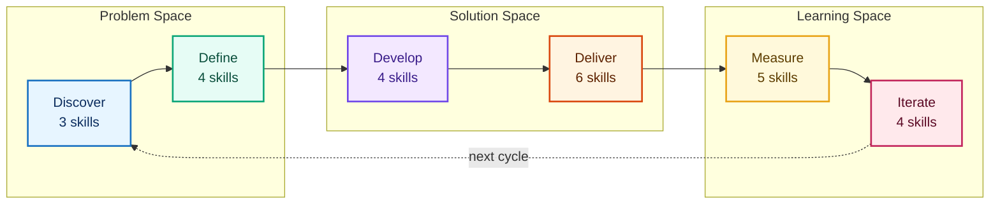
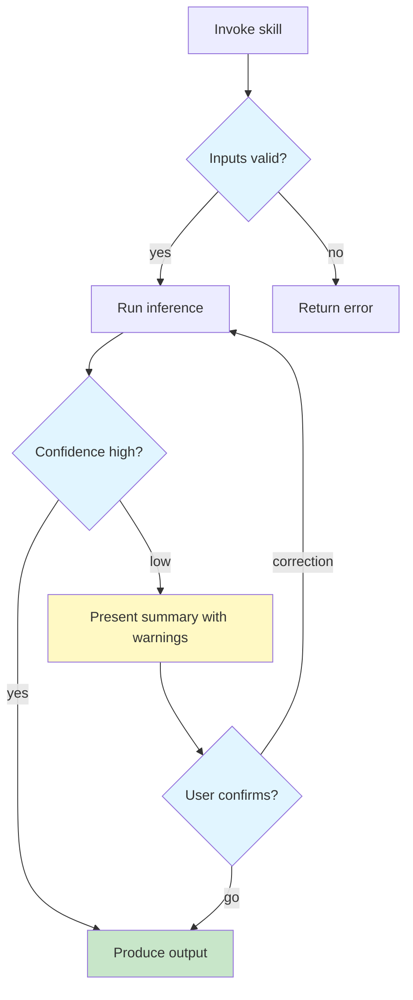
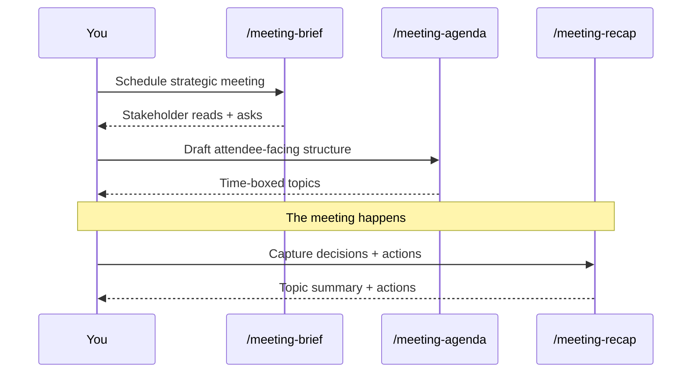
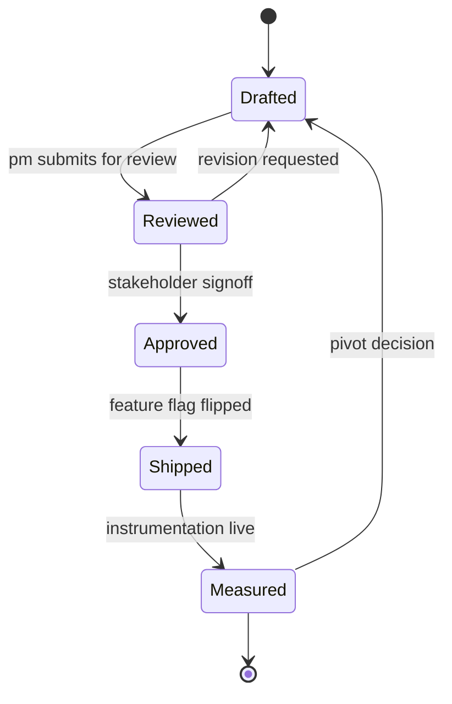
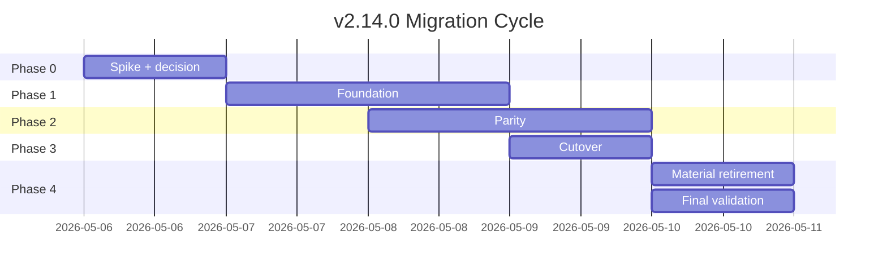

```mermaid
block-beta
    columns 6

    block:discover["Discover"]:1
        d1["/competitive-analysis"]
        d2["/interview-synthesis"]
    end

    block:define["Define"]:1
        f1["/problem-statement"]
        f2["/hypothesis"]
    end

    block:develop["Develop"]:1
        v1["/solution-brief"]
        v2["/adr"]
    end

    block:deliver["Deliver"]:1
        l1["/prd"]
        l2["/user-stories"]
    end

    block:measure["Measure"]:1
        m1["/experiment-design"]
        m2["/okr-grader"]
    end

    block:iterate["Iterate"]:1
        i1["/retrospective"]
        i2["/lessons-log"]
    end

    discover --> define --> develop --> deliver --> measure --> iterate

    style discover fill:#e7f5ff,stroke:#1971c2,color:#0c2d5e,stroke-width:2px
    style define fill:#e6fcf5,stroke:#0ca678,color:#0a4f3c,stroke-width:2px
    style develop fill:#f3e8ff,stroke:#7048e8,color:#3a1d8a,stroke-width:2px
    style deliver fill:#fff4e1,stroke:#d9480f,color:#5e2200,stroke-width:2px
    style measure fill:#fff9db,stroke:#e8a317,color:#5e3e00,stroke-width:2px
    style iterate fill:#ffe9ec,stroke:#c2255c,color:#5c0a25,stroke-width:2px
```

# Mermaid Diagram Style Guide

Reference for **anyone authoring a Mermaid diagram in pm-skills documentation**, whether you are a human PM contributor or an agent (Claude, Codex, GPT, etc.) generating a diagram inline. Quick-scan headers + copy-pasteable code blocks + decision matrices.

> **Live HTML preview**: a self-contained rendered version of all examples below is at [`mermaid-style-guide.html`](/pm-skills/mermaid-style-guide.html). Opens locally too (no docs site required).

## When to use which diagram type

Pick the diagram type that matches the structure of what you are showing. Mismatched types are the most common source of confusing diagrams.

| Diagram type | Use when | Mermaid syntax | Renders as |
|---|---|---|---|
| **Phase flowchart** | Showing ordered phases or steps with arrows between them | `graph LR` or `graph TD` | Boxes with arrows |
| **Phase block diagram** | Showing 6 phases as parallel columns with shared structure | `block-beta` | Grid-aligned blocks |
| **Workflow flowchart** | Showing branching logic (decisions, conditionals, loops) | `graph TD` with `{decision}` shapes | Branching tree |
| **Sequence diagram** | Showing back-and-forth interaction between roles or systems over time | `sequenceDiagram` | Lifeline + arrows |
| **State diagram** | Showing transitions between named states | `stateDiagram-v2` | States + transitions |
| **Gantt** | Showing timeline of overlapping work | `gantt` | Horizontal bars |
| **Mind map** | Showing hierarchical idea expansion | `mindmap` | Radial tree |
| **Pie** | Showing percentage breakdown of a single total | `pie` | Pie chart |

**Heuristic for ambiguous cases:**

- "Show a process" -> graph LR (left-to-right) for short chains; graph TD (top-down) for branching
- "Show roles working together" -> sequenceDiagram
- "Show a feature's lifecycle" -> stateDiagram-v2 (states) or gantt (durations)

## The pm-skills brand palette

Two tiers: **global brand** (applies across all diagrams via `themeVariables`) and **Triple Diamond palette** (applies semantically to phase-aligned diagrams via `classDef` or `style`).

### Global brand (automatic; M1 themeVariables)

These apply to every Mermaid diagram on the docs site without you needing to do anything. They are configured in `astro.config.mjs`.

| Variable | Value | Effect |
|---|---|---|
| `lineColor` | `#5C7CFA` | Indigo edges (matches favicon Triple Diamond mark) |
| `fontFamily` | `system-ui, ...` | Matches Starlight body text for visual consistency |
| `fontSize` | `14px` | Slightly tighter than Mermaid default 16px |

### Triple Diamond palette (opt-in; M3 classDef / style)

Apply these when your diagram nodes map onto the 6-phase Triple Diamond framework. Do NOT use them for diagrams with unrelated semantics (meeting lifecycle, behavioral contracts, release flows) where a different color meaning already applies.

| Phase | Fill | Stroke | Text | Hex copy-paste |
|---|---|---|---|---|
| Discover | light blue | medium blue | dark navy | `fill:#e7f5ff,stroke:#1971c2,color:#0c2d5e` |
| Define | light teal | medium teal | dark teal | `fill:#e6fcf5,stroke:#0ca678,color:#0a4f3c` |
| Develop | light purple | medium purple | dark purple | `fill:#f3e8ff,stroke:#7048e8,color:#3a1d8a` |
| Deliver | light amber | dark orange | dark brown | `fill:#fff4e1,stroke:#d9480f,color:#5e2200` |
| Measure | light yellow | medium amber | dark amber | `fill:#fff9db,stroke:#e8a317,color:#5e3e00` |
| Iterate | light pink | dark pink | dark pink | `fill:#ffe9ec,stroke:#c2255c,color:#5c0a25` |

The palette is designed for high contrast in light mode and acceptable readability in dark mode. Borders are at `stroke-width:2px` so they remain visible against either background.

## How styling works (3 layers)

Layered model. Each layer composes with the others.

### Layer 1: Global theme variables (M1)

Set once in `astro.config.mjs`. Applies on top of whichever base theme `autoTheme` picks (default for light, dark for dark). You do not author this in your diagram; it is already configured.

```js
// astro.config.mjs
mermaid({
  theme: 'default',
  autoTheme: true,
  mermaidConfig: {
    themeVariables: {
      lineColor: '#5C7CFA',
      fontFamily: 'system-ui, ...',
      fontSize: '14px',
    },
  },
}),
```

### Layer 2: CSS polish (M2)

Set once in `src/styles/custom.css`. Applies SVG-level rules (edge thickness, node corner radius, cluster fill opacity) across all diagrams. You do not author this in your diagram; it is already configured.

```css
/* src/styles/custom.css */
.mermaid svg { max-width: 100%; height: auto; }
.mermaid .edgePath path { stroke-width: 1.75px; }
.mermaid .node rect { rx: 6; ry: 6; }
.mermaid .cluster rect { fill-opacity: 0.4; }
```

### Layer 3: Per-diagram class / style (M3)

You author this inside the Mermaid code block when you want phase-coded nodes. Two syntax variants depending on diagram type:

- `graph LR/TD/RL/BT/etc.`: use `classDef` + `class` directives
- `block-beta`: use `style {block-id} ...` directives
- `sequenceDiagram`: limited styling; use `note`/`rect` blocks for grouping
- `stateDiagram-v2`: use `classDef` + `class`

## Concrete examples

Each example is copy-pasteable. The `Mermaid source` block is what you put in your Markdown; the `Renders as` line describes the expected output.

### Phase flowchart with classDef (graph LR)

Triple Diamond phase flow. This is the canonical pm-skills home page diagram.

````markdown

````

**Renders as**: 6 color-coded phase boxes grouped into 3 subgraph diamonds with arrows between adjacent phases and a dotted "next cycle" arrow from Iterate back to Discover.

### Phase block diagram with style directives (block-beta)

Use when you want a 6-column grid of phases with their constituent items inside each block. classDef does not work in block-beta; use inline `style` directives instead.

````markdown

````

**Renders as**: 6 phase columns each containing slash-command leaves; arrows connecting phase-to-phase below the grid; phase blocks color-coded per Triple Diamond palette.

### Workflow flowchart with semantic palette (graph TD)

Use when showing branching logic with decisions. Triple Diamond palette does NOT apply here; use semantic colors (green for success, yellow for warning, blue for branch) instead.

````markdown

````

**Renders as**: branching tree with green output node, yellow warning node, blue decision diamonds.

### Behavioral sequence (sequenceDiagram)

Use when showing back-and-forth between named participants. Limited styling; keep it clean.

````markdown

````

**Renders as**: 4 lifeline columns with solid + dashed arrows showing the meeting-skills hand-off pattern.

### State diagram (stateDiagram-v2)

Use when showing named states and transitions, not phases or interactions.

````markdown

````

**Renders as**: 5 named states + transitions; entry from `[*]` and exit to `[*]`.

### Gantt timeline

Use when showing overlapping work with durations.

````markdown

````

**Renders as**: horizontal timeline with phase sections; bars sized to duration.

## Dark mode considerations

Starlight switches the site between light and dark mode based on the user's system preference or manual toggle. Mermaid's `autoTheme: true` follows this via the `data-theme` attribute on `<html>` or `<body>`.

**What changes automatically:**

- The base Mermaid theme switches between `default` (light) and `dark` (dark).
- Edge labels, axis text, and other "framework" elements adapt.

**What stays static:**

- `classDef` fills, strokes, and text colors are inline `!important` styles. They render the same in both modes.
- `style` directive values stay static the same way.

**Implication for your authoring:**

- Pick fills + strokes that work in both backgrounds. Light pastels with medium-saturation strokes work well because the high-contrast border preserves visibility on dark backgrounds.
- Use the Triple Diamond palette as your default; it has been tested in both modes.
- If you author a diagram where dark mode is jarring, prefer rgba() with an alpha < 1 so the background partially shows through. Example: `fill:rgba(231,245,255,0.4)` instead of `fill:#e7f5ff`.

## Common mistakes

| Mistake | Symptom | Fix |
|---|---|---|
| Using `style` in `graph LR/TD` for many nodes | Repetitive declarations; hard to update | Use `classDef` + `class` instead |
| Using `classDef` in `block-beta` | Style directive ignored; nodes default-colored | Use inline `style {block-id} ...` |
| Triple Diamond palette on non-phase diagrams | Color meaning conflicts with content | Use semantic colors (green/yellow/blue) |
| `mermaid` block in source SKILL.md uses `../../docs/...` paths | Paths break when generator copies to `docs/skills/{phase}/` | Generator's `rewrite_internal_paths()` handles this; do not "fix" |
| Em-dash characters in diagram text | Hook blocks the file write | Use ` - ` (space-hyphen-space) instead |
| Missing `subgraph` titles in quotes | Parser fails on titles with special characters | Always quote: `subgraph "My Title"` |

## Validation

Before committing a diagram:

1. **Em-dash discipline**: zero `U+2014` or `U+2013` characters anywhere in the diagram source. Use `python -c "with open('your-file.md','rb') as f: print(f.read().count(b'\xe2\x80\x94'))"` to verify.
2. **Build PASS**: `npm run build` should complete without warnings about your diagram.
3. **Visual smoke**: navigate to the rendered page in a browser; confirm all blocks have rendered as SVG (not raw `<pre class="mermaid">` text).
4. **DOM check**: in the browser console: `document.querySelectorAll('pre.mermaid svg').length` should equal the number of mermaid blocks on the page; `document.querySelectorAll('pre.mermaid:not(:has(svg))').length` should be 0.

## For agents: machine-readable summary

```yaml
brand_palette:
  global_edge_color: "#5C7CFA"
  global_font_family: "system-ui, -apple-system, BlinkMacSystemFont, 'Segoe UI', Roboto, 'Helvetica Neue', sans-serif"
  global_font_size: "14px"

triple_diamond_palette:
  - phase: discover
    fill: "#e7f5ff"
    stroke: "#1971c2"
    color: "#0c2d5e"
  - phase: define
    fill: "#e6fcf5"
    stroke: "#0ca678"
    color: "#0a4f3c"
  - phase: develop
    fill: "#f3e8ff"
    stroke: "#7048e8"
    color: "#3a1d8a"
  - phase: deliver
    fill: "#fff4e1"
    stroke: "#d9480f"
    color: "#5e2200"
  - phase: measure
    fill: "#fff9db"
    stroke: "#e8a317"
    color: "#5e3e00"
  - phase: iterate
    fill: "#ffe9ec"
    stroke: "#c2255c"
    color: "#5c0a25"

stroke_width_default: "2px"

syntax_by_diagram_type:
  graph_lr_td: "classDef + class"
  block_beta: "style {block-id}"
  sequence_diagram: "note + rect (limited styling)"
  state_diagram_v2: "classDef + class"
  gantt: "section + class"

constraints:
  no_em_dashes: true
  no_en_dashes: true
  prefer_dash_substitute: " - "
  quote_subgraph_titles: true
  generator_path_rewrite: "../../docs/ -> ../../"

rendering:
  client_side: true
  bundle: "code-split via astro-mermaid 2.0.1"
  loads_only_on_pages_with: 'pre class="mermaid" elements'
  auto_theme: true
  data_theme_attribute_source: "Starlight html or body"
```

## Related artifacts

- Live HTML preview of all examples: [`mermaid-style-guide.html`](/pm-skills/mermaid-style-guide.html)
- M1 + M2 source: [`astro.config.mjs`](https://github.com/product-on-purpose/pm-skills/blob/main/astro.config.mjs) + [`src/styles/custom.css`](https://github.com/product-on-purpose/pm-skills/blob/main/src/styles/custom.css)
- M3 home page application: [`docs/index.mdx`](../) (graph LR + block-beta)
- pm-skills brand favicon source (for color reference): [`public/favicon.svg`](https://github.com/product-on-purpose/pm-skills/blob/main/public/favicon.svg)
