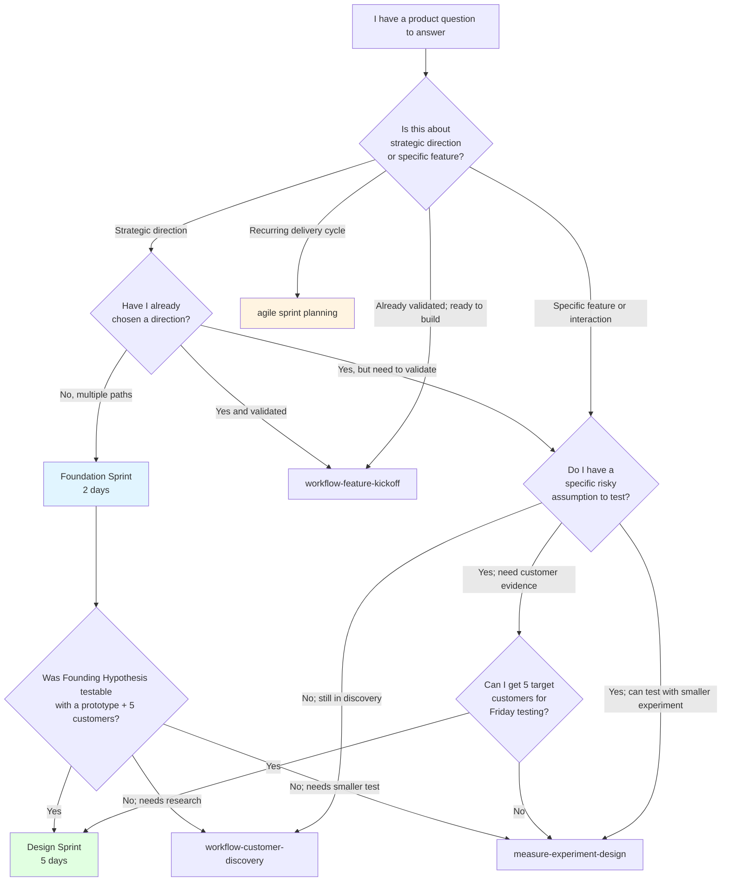

## Purpose

PM teams have many overlapping methodologies for similar-looking questions ("what should we build?", "is this idea worth pursuing?", "how do we test this?"). This page is the cross-method comparison reference - it does not advocate any single method but helps you pick the right one for the question you're actually facing.

For details on any single method, follow the linked concept doc or skill body. For terminology specific to Foundation Sprint or Design Sprint, see the [Sprint Methodology Glossary](sprint-methodology-glossary.md). For the disambiguation between workshop sprints and agile sprints, see [Workshop Sprints vs Agile Sprints](../concepts/workshop-sprints-vs-agile-sprints.md).

## Comparison matrix

| Method | Purpose | Duration | Team size | Output | Customer access required? | Recurring or one-time? |
|---|---|---|---|---|---|---|
| **[Foundation Sprint](../concepts/foundation-sprint.md)** | Choose a testable strategic direction at the start of a big initiative | 2 days (one-time) | 3-5 inc. Decider | Founding Hypothesis sentence + assumption scorecard + recommended next test | No (uses existing customer knowledge) | One-time |
| **[Design Sprint](../concepts/design-sprint.md)** | Validate a risky idea with a realistic prototype and 5 target customers | 5 days (one-time) | 4-7 inc. Decider | Friday scorecard + Decider's build/iterate/pivot/stop call + named next artifact | Yes (5 target-profile customers Friday) | One-time per challenge |
| **[Agile / Scrum sprint planning](../../_workflows/sprint-planning.md)** | Commit a sprint goal + select backlog items for the next iteration | 2-4 hours (recurring) | Whole Scrum team | Sprint goal + committed backlog | No | Recurring (every 1-4 weeks) |
| **[`foundation-lean-canvas`](../../skills/foundation-lean-canvas/SKILL.md)** | Capture a one-page business model spanning 9 interlocking blocks | 60-90 min | 1-3 | Lean Canvas (one page; 9 blocks) | No | One-time per pivot or initiative |
| **[`define-jtbd-canvas`](../../skills/define-jtbd-canvas/SKILL.md)** | Frame what job customers hire your product to do | 45-90 min | 1-3 | JTBD canvas | Helpful but not required | One-time per discovery cycle |
| **[`workflow-customer-discovery`](../../_workflows/customer-discovery.md)** | Transform raw research into a validated problem statement | 2-4 hours across multiple skills | 1-3 | Problem statement + opportunity tree + persona | Yes (research synthesis) | One-time per discovery cycle |
| **[`workflow-feature-kickoff`](../../_workflows/feature-kickoff.md)** | Move from validated problem to ready-to-build feature spec | 2-4 hours across multiple skills | 1-3 | PRD + user stories + acceptance criteria | No | Recurring per feature |
| **[`measure-experiment-design`](../../skills/measure-experiment-design/SKILL.md)** | Design a smaller-than-Design-Sprint experiment (fake-door, landing-page, A/B test) | 60-90 min | 1-3 | Experiment spec | Varies by experiment type | One-time per experiment |

## Decision tree: which method fits my situation?

## When you'd combine methods

These aren't either/or. A common end-to-end pattern in product organizations:

1. **Foundation Sprint** at the start of a new bet to choose direction
2. **Design Sprint** within 1-2 weeks of Foundation Sprint to test the Founding Hypothesis
3. **Feature Kickoff workflow** to convert the Design Sprint Build call into PRD + stories
4. **Agile sprints** as the recurring delivery cadence for the build
5. **Experiment Design** for smaller-than-DS questions that arise during build
6. **Customer Discovery workflow** if any post-launch signal suggests the original problem framing was wrong

The methodologies operate at different cadences and altitudes; they compose rather than compete.

## When NOT to use a Foundation Sprint or Design Sprint

| Situation | Better alternative |
|---|---|
| Recurring 2-week delivery cycle | Agile / Scrum sprint planning |
| Single PM wants a strategic framing in an afternoon | Lean Canvas (1-3 person; 60-90 min) |
| Specific assumption testable with no customers | Experiment Design (fake-door, landing-page, A/B test) |
| Team is in pure discovery; no clear challenge yet | Customer Discovery workflow |
| Validated direction; ready to build | Feature Kickoff workflow |
| Small UX tweak with low stakes | None of the above; just ship it |
| Stakeholder alignment without strategic-direction question | Stakeholder Alignment workflow |
| Pure tech-feasibility question | Technical Discovery workflow (spike-summary + ADR) |

## Cross-references

- [Foundation Sprint concept doc](../concepts/foundation-sprint.md) - the FS methodology in depth
- [Design Sprint concept doc](../concepts/design-sprint.md) - the DS methodology in depth
- [Workshop Sprints vs Agile Sprints](../concepts/workshop-sprints-vs-agile-sprints.md) - the cross-methodology disambiguation
- [Sprint Methodology Glossary](sprint-methodology-glossary.md) - terminology reference

---

*Part of [PM-Skills](https://github.com/product-on-purpose/pm-skills) - Open source Product Management skills for AI agents.*
