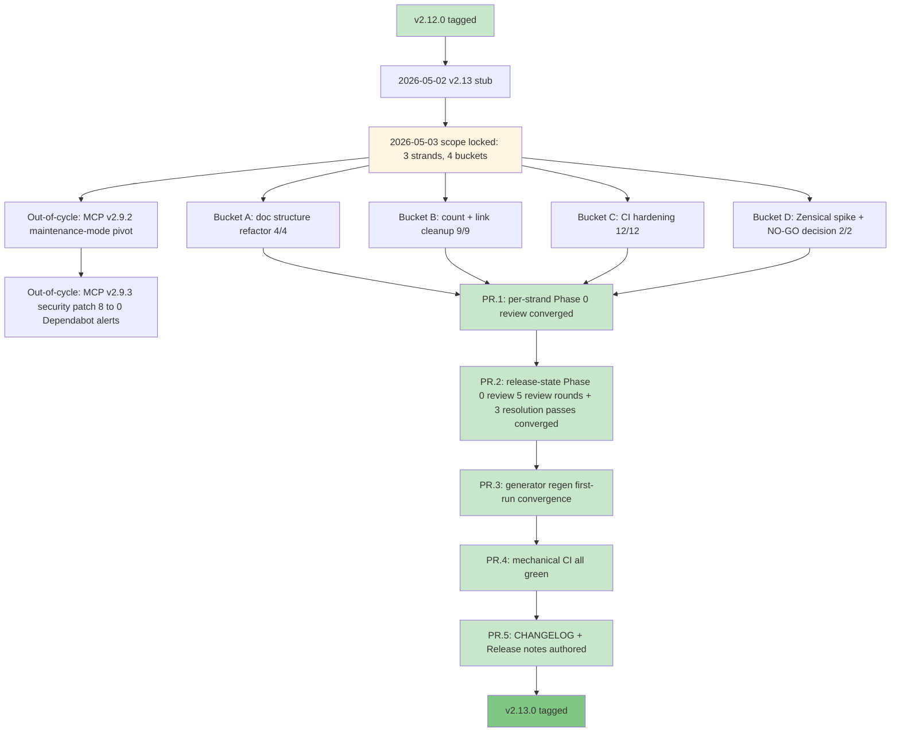

# Release v2.13.0. Foundation Hardening + Doc Stack Decision

**Released**: 2026-05-05
**Type**: Refactor + decision release (minor)
**Skill count**: 40 (unchanged from v2.12.0)
**Key theme**: Foundation Hardening + Doc Stack Decision

---

## TL;DR

v2.13.0 is a maintenance and quality release. The 40-skill catalog is unchanged from v2.12.0, so day-to-day usage of `/prd`, `/hypothesis`, `/user-stories`, and the rest of the catalog is identical. What changed is everything around the catalog:

- **Cleaner, more navigable documentation.** Duplicate files removed; counts reconciled across every public surface (README, getting-started, reference docs, mkdocs config, homepage hero); a new Diataxis-aligned folder structure (concepts, guides, reference) with a `pm-skill-*` filename prefix that signals scope at a glance; every generated page clearly labeled so editors know which file is the source.
- **For contributors and forkers**, 7 new CI gates catch documentation drift on pull requests automatically: nav completeness, generated-content untouched, cross-doc reference integrity, docs frontmatter coverage, internal link validity, version-reference consistency, and skill-family registration. The enforcing CI tier doubled (5 to 10) and the validator inventory grew from 15 to 22.
- **For `pm-skills-mcp` users**, the companion MCP server shipped v2.9.3 the same week, a security-patch follow-up to v2.9.2 that cleared all 8 open Dependabot moderate advisories (`hono`, `@hono/node-server`, `vite`, `postcss`). The catalog frozen at the v2.9.2 build (40 skills + 11 workflow tools + 8 utility tools) is unchanged.

If you use pm-skills via the file-based install (`npx skills add product-on-purpose/pm-skills` or `git clone`), the upgrade is purely additive cleanup: nothing in your workflow changes, but the docs and contribution surface are noticeably better.

---

## What changed

### Changed (visible in the rendered docs)

**Doc structure (Bucket A, 4 items):**

- **Frameworks folder retired.** `docs/frameworks/` deleted; the canonical Triple Diamond reference now lives at `docs/concepts/triple-diamond-delivery-process.md` with a `mkdocs.yml` redirect from the old path. Reduces `mkdocs.yml exclude_docs:` from 8 entries to 2.
- **Cross-folder reorg (Diataxis-aligned).** 4 concept files moved out of `concepts/` to `reference/` and `guides/` per the Diataxis 4-quadrant taxonomy (concepts = generic explanatory; reference = PM-Skills lookup material; guides = PM-Skills how-to material). 4 legacy duplicate files deleted after CR-strip drift analysis (real divergence was 60 of 3,226 lines for `agent-skill-anatomy` and 21 of 1,495 lines for `getting-started`; canonical was strictly newer in all cases).
- **Authoring guide consolidation.** `creating-skills.md` renamed to `creating-pm-skills.md` per the locked `pm-skill-*` prefix convention; `authoring-pm-skills.md` deleted; both old paths redirect to the new canonical.
- **Pattern 5C generated-content marker** on all 63 generated pages (40 individual skill pages + 8 category index pages + 9 workflow pages + 1 workflow index + 3 showcase pages + 1 showcase index + 1 commands reference). The 8 category indices comprise 6 Triple Diamond phase indices (discover, define, develop, deliver, measure, iterate) plus the foundation and utility category indices. Each generated page now carries `generated: true` and `source: scripts/...` frontmatter fields plus a visible `!!! warning "Generated file"` admonition pointing editors to the source. Pairs with the new `check-generated-content-untouched` validator that detects hand-edits to generated pages.

**Count and link cleanup (Bucket B, 9 items):**

- **Skill counts reconciled** across `concepts/agent-skill-anatomy.md`, `reference/categories.md`, `reference/ecosystem.md`, `reference/project-structure.md`, `guides/mcp-integration.md`, `getting-started/index.md`, `mkdocs.yml site_description`, and the homepage hero. All current-state references now say 40 skills (26 phase + 8 foundation + 6 utility).
- **`utility-pm-skill-builder` catalog table** updated: Domain 25 to 26 (added `measure-okr-grader`); Foundation 1 to 8 (added `lean-canvas` plus the 5 meeting-* skills plus `okr-writer` plus `stakeholder-update`; persona retained); Utility 1 to 6 (added `mermaid-diagrams`, `pm-skill-iterate`, `pm-skill-validate`, `slideshow-creator`, `update-pm-skills`; pm-skill-builder retained).
- **`docs/guides/mcp-setup.md` deleted** and redirected to `guides/mcp-integration.md` per the maintenance-mode pivot subsumption. The canonical "how to use MCP" content now lives in `pm-skills-mcp`'s own README.
- **`AGENTS/codex/CONTEXT.md` vestigial-redirect rewrite.** Shrunk 74 to 32 lines acknowledging that Codex usage scope is now Phase 0 adversarial review only (codified v2.11.0); points to `AGENTS/claude/CONTEXT.md` as canonical project context.
- **README "What's New" workaround replaced** (Option a section-aware CI extension). The broad `v[0-9]+\.` line-exemption in `check-count-consistency.{sh,ps1}` was replaced with explicit HTML-comment markers (`<!-- count-exempt:start -->` / `<!-- count-exempt:end -->`) for historical-content exemption plus a subset-descriptor exclusion list (so phrasing like "26 phase skills" no longer flags as a stale total). Surfaced and resolved 18 hidden findings the prior workaround had silenced.
- **F-34 THREAD_PROFILES.md** added at `library/skill-output-samples/THREAD_PROFILES.md` as a machine-readable per-thread metadata contract for tooling consumers (`utility-pm-skill-builder` primary; future regen tools). Documents thread identity, feature arc, prompt style, character naming convention, real competitors, sample-suffix patterns, and scenario archetypes per phase across all three threads (storevine, brainshelf, workbench).
- **`docs/reference/project-structure.md` full reconciliation.** TOC anchor `the-32-pm-skills-flat` to `the-40-pm-skills-flat`. Directory tree counts updated. Foundation section expanded 1 to 8 with full skill listing. Slash command table gained 8 missing rows.
- **`docs/guides/index.md` expanded** from 7 to 12 listed guides (added `using-meeting-skills`, `skill-finder`, `recipes`, `prompt-gallery`, `updating-pm-skills`).

### What's new (under the hood)

**CI hardening (Bucket C, 12 items):**

- **5 PowerShell parity bugfixes.** Fixed `$matches` reserved-word collision in `check-stale-bundle-refs.ps1`, `Join-Path` named-parameter usage in `check-workflow-coverage.ps1` and `check-generated-freshness.ps1`, path-detection bug in `lint-skills-frontmatter.ps1`. PS1 versions now match bash output on current main.
- **`check-count-consistency` tightened and promoted to enforcing** for current-state files. The original line-level `v[0-9]+\.` exemption was replaced with explicit HTML-comment markers plus a subset-descriptor exclusion list (per Bucket B item 6). PS1 + bash now emit identical findings on identical input.
- **7 new validators**, each with `.sh` + `.ps1` + `.md` triplet completeness:
    - `check-nav-completeness` (enforcing): every `docs/**/*.md` is in nav OR `exclude_docs` OR auto-include patterns
    - `check-generated-content-untouched` (enforcing): snapshots, regenerates, diffs, restores; fails on hand-edits to generated pages. Pairs with Pattern 5C from Bucket A.4.
    - `validate-references-cross-doc` (enforcing): every cross-link in `docs/reference/` resolves
    - `validate-skill-family-registration` (enforcing): registry-driven family validation (covers `meeting-skills-family` plus future families); F-36
    - `validate-docs-frontmatter` (advisory): every rendered doc has title plus description
    - `check-internal-link-validity` (advisory): zero broken internal links across the doc tree
    - `check-version-references` (advisory): version-reference drift detector
- **Net surface delta:** validator inventory grows from 15 to 22 (7 new). Enforcing tier grows from 5 to 10 (4 new enforcing + count-consistency promoted). Bash + PS1 dual-stack maintained for v2.13 (consolidation decision deferred to v2.14.0+).

### Decision artifact: Zensical compatibility (Bucket D, 2 items)

**Outcome: NO-GO for v2.14.0 commitment.**

The 60-minute time-boxed compatibility spike against Zensical 0.0.40 (with MkDocs Material 9.7.6 as baseline) surfaced two BLOCKERs that disqualify Zensical for our content shape at this maturity level:

- **`mkdocs-redirects` plugin not honored.** Zero redirect HTML files generated for the 12 mapped paths in `mkdocs.yml redirects.redirect_maps`. All bookmarked old URLs would 404 under Zensical.
- **`exclude_docs:` not honored.** 183 internal HTML files from `docs/internal/` leaked into the public `site/` output despite the explicit `exclude_docs: internal/` directive. Privacy-equivalent of a structural failure.

Plus an IMPORTANT-severity behavioral difference: Zensical 0.0.40 emits 2940 link-reference parser warnings on bracketed text (`[role]/[action]/[benefit]` user-story templates, `[yes / no]` choice prompts, `cards[3]` array notation, etc.) that Material does not. All sampled cases were false positives. Volume makes `--strict` mode unusable at this Zensical version.

**Recommendation:** stay on MkDocs Material through v2.14.0+. Do **NOT** trigger Plan B (Astro Starlight) immediately per the spike plan's Section 5 logic; Plan B becomes its own effort doc only if Material's maintenance posture deteriorates in parallel. Re-spike Zensical when both blockers resolve in upstream releases (suggested triggers: announcement of `mkdocs-redirects` parity, announcement of `exclude_docs` honoring, or Zensical reaching v0.5+ regardless).

The full spike report is at `docs/internal/release-plans/v2.13.0/plan_v2.13_zensical-spike-report_2026-05-05.md`. It will be retained as the canonical decision artifact for v2.14.0+ stack-decision discussions; future re-spikes write a new dated report rather than editing this one.

### Out-of-cycle: pm-skills-mcp maintenance mode

Two same-week pm-skills-mcp releases happened mid-cycle on 2026-05-05 by explicit user-initiated decision. Tracked separately from in-cycle scope but called out here for completeness:

- **`pm-skills-mcp` v2.9.2 maintenance-mode pivot.** Announces formal maintenance mode (effective 2026-05-04), re-embeds the full current 40-skill catalog at v2.9.2 build time (superseding the prior v2.11.0 M-22 28-skill freeze), updates README and CHANGELOG and CLAUDE.md and `src/config.ts` for the maintenance posture. Published to npm with a GitHub Release.
- **`pm-skills-mcp` v2.9.3 security-patch follow-up.** Two hours after the v2.9.2 announcement, v2.9.3 cleared all 8 open Dependabot moderate advisories via transitive `npm audit fix` (`hono` 4.12.10 to 4.12.17, `@hono/node-server` 1.19.12 to 1.19.14, `vite` 6.4.1 to 6.4.2, `postcss` 8.5.6 to 8.5.14). Post-ship Dependabot open-alert count: 0. Bundled three latent v2.9.x maintenance debts in the same patch: `tests/loader.test.ts` catalog assertions corrected for the 40-skill embedded library, `package-lock.json` top-level version metadata synced, and a retroactive em-dash sweep on 28 occurrences in pre-2026-04-13 CHANGELOG entries.

The 2-hour announcement-to-patch turnaround validates the v2.9.2 maintenance-mode "security patches will continue" commitment in operational practice. Catalog frozen at v2.9.2 build (40 skills, 11 workflow tools, 8 utility tools = 59 tools); subsequent v2.9.x patches do not change the catalog.

---

## Infrastructure / process

- **Phase 0 Adversarial Review Loop** applied across both per-strand and release-state layers, per the v2.11.0 codification + v2.12.0 release-state extension. PR.1 (per-strand): 4 Codex tasks (Bucket A retry, Bucket C round 1 + round 2, Bucket D retry) converged below IMPORTANT severity. PR.2 (release-state): 5 Codex review rounds + 3 resolution passes (8 numbered rounds total). Each Codex round caught a deeper layer of stale-summary text introduced by the previous round's resolution; round 6 was a comprehensive sweep across the full release stack rather than another incremental fix; round 8 resolved final audit-trail correctness defects.
- **PR.3 generator regen** converged on first run. All 3 generators (`generate-skill-pages.py`, `generate-workflow-pages.py`, `generate-showcase.py`) produced zero git diff against current state. `check-generated-content-untouched.sh` validator: PASS for all 63 generated pages.
- **PR.4 mechanical CI** all green. 10 enforcing scripts PASS plus 5 advisory scripts PASS at the pre-PR.5 commit.
- **Same-commit-as-work pattern** applied throughout the cycle. Plan-doc updates landed in the same commit as the work they describe; eliminates the v2.12.0-class "release-state Codex review finds plan disagrees with code" defect.
- **Stale-aggregate-counter pattern codified** as durable feedback memory after PR.2 round 2 caught it at meta level (status-block text, not just numerical aggregates, drifts unless every gate closure sweeps all release-stack docs). The pattern is now a standing rule for future cycles.

---

## Why this matters

For users, v2.13.0 is the release that makes pm-skills feel finished as a library. The 40-skill catalog has been stable since v2.12.0; what was rough was the documentation around it - duplicate files in two places, stale skill counts on seven different public surfaces, generated pages indistinguishable from hand-edited ones, navigational dead-ends after the v2.11 to v2.12 growth. v2.13.0 fixes all of that. Browsing the docs, finding a skill, understanding which file is canonical, contributing a fix - each is now noticeably smoother.

For contributors and forkers, the CI hardening is the durable user-value. Doc drift, broken cross-references, and stale counts have historically been caught only at release time, often by the maintainer reading the rendered site. v2.13.0 turns those checks into automated PR gates: 7 new validators run on every PR across both Ubuntu and Windows. A typo in a skill cross-reference, a count that fell out of sync, a hand-edit to a generated page - all caught at PR time, not at release time.

For `pm-skills-mcp` users, the same-week v2.9.3 security patch is direct user-value: 8 → 0 open Dependabot advisories with a 2-hour announcement-to-patch turnaround that demonstrated the maintenance-mode commitment in practice. If you depend on the MCP server, the v2.9.3 release is recommended for the security fixes alone.

---

## Validation: Phase 0 Adversarial Review Loop

| Round | Layer | Findings | Outcome |
|---|---|---|---|
| PR.1 / Bucket A retry | Per-strand | 0 CRITICAL + 0 IMPORTANT + 0 MEDIUM + 1 MINOR | Resolved + Bucket A clears Phase 0 |
| PR.1 / Bucket C round 1 | Per-strand | 0 CRITICAL + 2 IMPORTANT + 3 MEDIUM + 1 MINOR | 2 IMPORTANTs resolved; 3 MEDIUM + 1 MINOR documented as known debt |
| PR.1 / Bucket C round 2 | Per-strand | 0 CRITICAL + 0 IMPORTANT (CONVERGED) | Bucket C clears Phase 0 |
| PR.1 / Bucket D retry | Per-strand | 0 CRITICAL + 0 IMPORTANT + 4 MEDIUM + 2 MINOR. Both NO-GO BLOCKERs hold under cross-reference to Zensical's own compatibility docs. | 4 MEDIUM count-drift items resolved; methodology MEDIUMs documented |
| PR.2 round 1 | Release-state | 0 CRITICAL + 6 IMPORTANT + 3 MEDIUM + 1 MINOR | Resolved across 3 batch commits + self-review residuals |
| PR.2 round 2 | Release-state | 0 CRITICAL + 4 IMPORTANT (round-1 stale-status persisted) + 2 new MEDIUM + 1 new MINOR | Resolved |
| PR.2 round 3 | (resolution pass; no separate Codex review) | n/a | Resolution commit covered round 2 findings |
| PR.2 round 4 | Release-state | 0 CRITICAL + 2 new IMPORTANT (next-layer stale-summary at gate-table row + sibling index file) | Resolved + drafts authored |
| PR.2 round 5 | Release-state | 0 CRITICAL + 4 new IMPORTANT (top status block + drafts misrepresenting audit trail + count breakdown stale + README update draft wrong index headers) + 1 new MEDIUM | Resolved in round 6 comprehensive sweep |
| PR.2 round 6 | (resolution pass; comprehensive sweep across full release stack) | n/a | Resolution commit |
| PR.2 round 7 | Release-state | 0 CRITICAL + 2 IMPORTANT (audit-trail correctness defects in PR.2 row + checklist note + README "What's New" draft) + 1 MEDIUM | Resolved |
| PR.2 round 8 | (resolution pass; user-value reframe of TL;DR + Why-this-matters + README block also landed in this round) | n/a | Resolution commits + draft user-value reframe |
| PR.3 generator regen | Mechanical | 0 git diff after regen; `check-generated-content-untouched` PASS | First-run convergence |
| PR.4 mechanical CI | Mechanical | 10 enforcing PASS + 5 advisory PASS | Tag-ready except pending version bump |

The release-state loop's value was on display across rounds 2-7: each Codex round caught the next layer of stale-summary text introduced by the previous round's resolution. Round 6 was a comprehensive sweep across the entire release stack rather than another incremental fix; round 8 resolved final audit-trail correctness defects and applied the user-value reframe to the public-facing summaries. Same defect class as the codified `feedback_stale-aggregate-counter` memory, applied at meta level. The pattern lesson: every gate closure must sweep ALL release-stack docs that reference the gate's state simultaneously, not just the doc whose row was edited.

---

## What's deferred to v2.14.0+

| Item | Reason |
|---|---|
| Zensical migration | Spike outcome: NO-GO. Re-spike when blockers resolve. |
| Plan B Astro Starlight | Per spike plan Section 5: Plan B does NOT trigger immediately on NO-GO; only triggers if Material maintenance posture deteriorates in parallel. |
| F-37 HTML Template Creator | Conflicts with v2.13's "no new skills" guard. |
| F-29 Meeting Lifecycle Workflow | Time-gated on real-world meeting-skills usage feedback. |
| F-30 Family Adoption Guide | Time-gated on at least one team's adoption experience. |
| F-31 / F-32 / F-33 / F-35 Sample-automation slate | May be obsolete after v2.12 builder cleanup; re-evaluate before v2.14. |
| Pattern 2 mkdocs-macros frontmatter-driven counts | Adds dependency; deferred pending Zensical decision. |
| Bash + PS1 dual-stack consolidation | Strategic question; deferred to v2.14.0+. |
| `.github/workflows/validation.yml` Validate `_pm-skills/` in `.gitignore` (advisory) | Pre-existing advisory, not in v2.13 scope. |
| AGENTS/claude/CONTEXT.md per-phase Skills Inventory tables | At v2.10.x-era 32-skill state per intentional deferral. Authoritative current catalog lives in `docs/reference/categories.md` and `docs/skills/index.md`. Full table refresh slated for v2.14.0. |

---

## Counts at v2.13.0

| Surface | Count | Note |
|---|---|---|
| Skills | 40 | 26 phase + 8 foundation + 6 utility (unchanged from v2.12.0) |
| Workflows | 9 | unchanged |
| Slash commands | 47 | 40 skill + 7 workflow |
| Library samples | 126 | unchanged from v2.12.0 |
| Validators (total) | 22 | up from 15 |
| Validators (enforcing) | 10 | up from 5 |
| Validators (advisory) | 12 | up from 10 |
| pm-skills-mcp tools (frozen at v2.9.2 build) | 59 | 40 skill + 11 workflow + 8 utility |

---

## Detailed change manifest

This section is an exhaustive, file-by-file breakdown of every relocation, deletion, rename, addition, and modification that landed in v2.13.0. It is intended for maintainers, contributors, and downstream tooling that needs to know exactly what changed. User-facing impact is summarized in the TL;DR and Why-this-matters sections above; this section is the audit trail.

### A. New files added (tracked)

**Scripts (7 new validator triplets):**

- `scripts/check-nav-completeness.sh`, `.ps1`, `.md` (Bucket C Wave 1, item 6; commit `86ce58a`).
- `scripts/check-generated-content-untouched.sh`, `.ps1`, `.md` (Bucket C Wave 2.1; commit `a170ecd`).
- `scripts/validate-references-cross-doc.sh`, `.ps1`, `.md` (Bucket C Wave 2.2; commit `a170ecd`).
- `scripts/validate-docs-frontmatter.sh`, `.ps1`, `.md` (Bucket C Wave 3, item 9; commit `f6f9785`).
- `scripts/check-internal-link-validity.sh`, `.ps1`, `.md` (Bucket C Wave 3, item 10; commit `6d0d2ac`).
- `scripts/check-version-references.sh`, `.ps1`, `.md` (Bucket C Wave 3, item 11; commit `13085b0`).
- `scripts/validate-skill-family-registration.sh`, `.ps1`, `.md` (Bucket C Wave 3, item 12 / F-36; commit `04d7624`).

**Library samples reference document:**

- `library/skill-output-samples/THREAD_PROFILES.md` (F-34; commit `fb18124`). Approximately 395 lines of machine-readable per-thread metadata for tooling consumers.

**Release artifacts:**

- `docs/releases/Release_v2.13.0.md` (this file; promoted from `plan_v2.13_release-notes-DRAFT.md` in commit `6f81fb1`).
- `docs/internal/release-plans/v2.13.0/plan_v2.13.0.md` (master plan; pre-existed as a stub before cycle, expanded throughout).
- `docs/internal/release-plans/v2.13.0/plan_v2.13_ci-refactor.md` (CI strand doc).
- `docs/internal/release-plans/v2.13.0/plan_v2.13_zensical-spike.md` (Zensical spike plan).
- `docs/internal/release-plans/v2.13.0/plan_v2.13_zensical-spike-report_2026-05-05.md` (NO-GO decision artifact).
- `docs/internal/release-plans/v2.13.0/plan_v2.13_pre-release-checklist.md` (Phase 0 to Phase 6 gate checklist).
- `docs/internal/release-plans/v2.13.0/plan_v2.13_release-notes-DRAFT.md` (PR.5 author-time draft; preserved post-promotion as audit trail).
- `docs/internal/release-plans/v2.13.0/plan_v2.13_changelog-DRAFT.md` (PR.5 author-time draft).
- `docs/internal/release-plans/v2.13.0/plan_v2.13_readme-update-DRAFT.md` (PR.5 author-time draft with promotion checklist).
- `docs/internal/release-plans/v2.13.0/plan_v2.13_final-sweep_2026-05-05.md` (final-pass review captured at ship time).
- `docs/internal/release-plans/v2.13.0/skills-manifest.yaml` (empty by design; no skill version bumps in v2.13).

**Skill family registry (referenced by F-36 validator):**

- `docs/reference/skill-families/_registry.yaml` (registry consumed by `validate-skill-family-registration`).

### B. Files renamed (rename preserves history)

- `docs/guides/creating-skills.md` to `docs/guides/creating-pm-skills.md` (Bucket A.3; commit `4190f45`). Per the locked `pm-skill-*` filename prefix convention. Old path redirects via `mkdocs.yml redirect_maps`.
- `docs/concepts/triple-diamond.md` to `docs/concepts/triple-diamond-delivery-process.md` (Bucket A.1; commit `4190f45`). Renamed for descriptive accuracy. Old path redirects.

### C. Files moved (cross-folder reorg, Diataxis-aligned)

These were moved out of `docs/concepts/` into `docs/reference/` (lookup material) or `docs/guides/` (how-to material) per the v2.13 doc-folder semantics decision (Bucket A.2; commit `4190f45`):

- `docs/concepts/skill-anatomy.md` to `docs/reference/pm-skill-anatomy.md`. Lookup-material per Diataxis. Renamed with `pm-skill-*` prefix per the locked convention.
- `docs/concepts/versioning.md` to `docs/reference/pm-skill-versioning.md`. Lookup-material; renamed with prefix.
- `docs/concepts/comparisons.md` to `docs/guides/pm-skill-comparisons.md`. How-to-style material; renamed with prefix.
- `docs/concepts/skill-lifecycle.md` to `docs/guides/pm-skill-lifecycle.md`. How-to-style material; renamed with prefix.

All four moves carry corresponding `mkdocs.yml redirect_maps` entries so old bookmarks resolve.

### D. Files removed (deleted from tracking)

- `docs/concepts/agent-skill-anatomy.md` removed (Bucket A.2 legacy duplicate cleanup; commit `4190f45`). Canonical is now `docs/reference/pm-skill-anatomy.md` (deprecated path; redirected via `mkdocs.yml redirect_maps`).
- `docs/concepts/getting-started.md` removed (Bucket A.2). Canonical is now `docs/getting-started/index.md` (deprecated path; redirected).
- `docs/guides/authoring-pm-skills.md` removed (Bucket A.3). Canonical is now `docs/guides/creating-pm-skills.md` (deprecated path; redirected).
- `docs/guides/mcp-setup.md` removed (Bucket B.4 mcp-setup.md deletion + redirect to mcp-integration.md per the maintenance-mode pivot subsumption). The canonical "how to use MCP" content now lives in `pm-skills-mcp`'s own README.
- `docs/frameworks/triple-diamond.md` and the entire `docs/frameworks/` folder removed (Bucket A.1). Canonical is `docs/concepts/triple-diamond-delivery-process.md` (deprecated path; redirected). The `mkdocs.yml exclude_docs:` directive was reduced from 8 entries to 2 as a side effect.

These removals were judged safe via CR-strip drift analysis. The "real divergence" between deprecated and canonical was 60 of 3,226 lines for `agent-skill-anatomy` and 21 of 1,495 lines for `getting-started`; the canonical was strictly newer in all cases, so no content was lost.

### E. Files reorganized (`mkdocs.yml` overrides cleanup)

- `mkdocs.yml` `theme.custom_dir: overrides` directive removed and the empty `overrides/.gitkeep` placeholder removed (sibling commit `06a2e36`). The override slot was unused; this is incidental hygiene tracked in the master plan Change Log but not in any Bucket A/B/C/D row.

### F. Files modified - substantial changes

**Public-facing documentation:**

- `README.md` - skill counts updated to 40 across all surfaces (project structure tree commands count 45 to 47); Measure section table extended with `/okr-grader`; Foundation section table extended from 1 to 8 commands; MCP section reframed for v2.9.x maintenance line (latest v2.9.3) with frozen-at-v2.9.2-build framing; "All 26 domain and foundation skills" corrected to "All 40 skills (26 phase + 8 foundation + 6 utility)" with workflow + utility tool counts; new v2.13.0 What's New block (open) above the v2.12.0 block (collapsed); Latest stable + release notes + published tag pointers updated to v2.13.0.
- `CHANGELOG.md` - new `## [2.13.0] - 2026-05-05` entry inserted above the v2.12.0 entry with full Added / Changed / Infrastructure / Fixed / Out-of-cycle / Deferred sections.
- `docs/releases/index.md` - new top row for v2.13.0; v2.10.1 and v2.10.2 broken rows removed (they linked to release-notes files that were never authored; v2.10.0 row updated with a note pointing to CHANGELOG.md for the patch history).
- `docs/index.md` - homepage hero recent-releases table extended with v2.13.0; broken `releases/Release_v2.10.1.md` and `releases/Release_v2.10.2.md` rows removed; v2.10.0 row enriched with a CHANGELOG reference for the patch history.
- `docs/changelog.md` - 3 broken release-note links corrected from `docs/releases/Release_v2.X.Y.md` (path-prefix bug) to `releases/Release_v2.X.Y.md`.
- `docs/getting-started/index.md` - Available Commands table extended (Measure phase 4 to 5 commands; Foundation 1 to 8 commands; workflows expanded from 1 listed command to all 7).
- `docs/guides/mcp-integration.md` - already trimmed during the mid-cycle MCP pivot from 570 to 39 lines (Bucket B.4 / MCP.2). Updated mid-cycle for v2.9.3 (replaced "v2.9.2 remains available on npm" framing with "v2.9.x maintenance line, latest v2.9.3" and frozen-at-v2.9.2-build framing).
- `docs/guides/index.md` - listing expanded from 7 to 12 guides (added `using-meeting-skills`, `skill-finder`, `recipes`, `prompt-gallery`, `updating-pm-skills`).
- `docs/guides/validate-mcp-sync.md` - new maintenance-mode warning callout added at top noting the workflow's reduced relevance under MCP maintenance mode.
- `docs/reference/categories.md` - reconciled total skill count from 29 (stale) to 40; per-category counts updated; 3 new sections added (`meeting`, `communication`, `documentation`) for categories that exist in skill frontmatter but were previously undocumented; Framework Mapping table extended; Category Selection Guide branches added; Category Distribution table updated to 40 total.
- `docs/reference/ecosystem.md` - hero paragraph and Decision Matrix qualifier reframed for v2.9.x maintenance line; ecosystem statement updated.
- `docs/reference/project-structure.md` - TOC anchor `the-32-pm-skills-flat` to `the-40-pm-skills-flat`; directory tree counts updated; Foundation section expanded 1 to 8; Slash command table gained 8 missing rows; stale `docs/frameworks/` tree entry removed with a one-line note about the v2.13 retirement.
- `docs/reference/pm-skill-anatomy.md` - "Four scripts validate skill integrity" expanded to 5 core scripts plus a note pointing to `.github/workflows/validation.yml` and `scripts/README_SCRIPTS.md` as canonical for the full CI suite.

**Master plan and CI strand documentation:**

- `docs/internal/release-plans/v2.13.0/plan_v2.13.0.md` - top Status block flipped from "Plan (decisions pending)" to "Pre-tag (all 27/27 in-cycle items shipped + 5 MCP items shipped; PR.1 to PR.5 closed; Phase 5 tag-time chores in flight)"; Out of Scope #3 reworded from "No MCP work" to "No in-cycle MCP work" with explicit acknowledgement of the out-of-cycle pivot; "What stays the same" library samples 120 to 126 and MCP catalog reframed; "What's new" validator inventory 17 to 24 corrected to 15 to 22 + enforcing 5 to 7 corrected to 5 to 10; Open Questions OQ-5/OQ-6/OQ-7 marked Resolved; MCP Impact section reframed; multiple Change Log entries appended for every cycle event including PR.1 to PR.5 closures + the round-by-round PR.2 audit trail; PR.2 row in Pre-release gates table flipped to Shipped with full Codex session IDs; Bucket A.4 description corrected to 40 individual skill pages with category-indices breakdown.
- `docs/internal/release-plans/v2.13.0/plan_v2.13_ci-refactor.md` - "14 items" corrected to "12 items" (matching status table); validator inventory "17 to 24" corrected to "15 to 22"; "5 to 11 enforcing" corrected to "5 to 10" with breakdown of which validators are new-enforcing vs new-advisory vs promoted; YAML snippet rewritten to drop the never-implemented `--current-state` / `--historical` args and reference the actual marker-based exemption mechanism shipped in B.6; pre-release verification gates ticked as the work landed; top status flipped to Executed.
- `docs/internal/release-plans/v2.13.0/plan_v2.13_pre-release-checklist.md` - 51 of 75 boxes ticked covering Phase 0 + Phase 1 + Phase 2 + Phase 4 closeable items; release-state-rerun box ticked with note about the 7-numbered-round convergence trajectory; Phase 5 expanded with an explicit `validate-version-consistency` re-run item between version bumps and the git tag step.

**Validation workflow:**

- `.github/workflows/validation.yml` - 7 new validator job entries added for the new Bucket C validators; `if: always() && matrix.os == ...` added to all 14 new-validator step conditions so an enforcing-step failure does not cascade-skip later validators in the same job; `continue-on-error: true` removed from both `Check count consistency (bash)` and `Check count consistency (pwsh)` steps to actually wire the promotion-to-enforcing into CI.

**Existing CI scripts (PowerShell parity bugfixes):**

- `scripts/check-stale-bundle-refs.ps1` - `$matches` PowerShell reserved-word collision resolved (commit `0706ef7`).
- `scripts/check-workflow-coverage.ps1` - `Join-Path` named-parameter usage corrected (commit `5b4f912`).
- `scripts/check-generated-freshness.ps1` - same `Join-Path` fix (commit `7269183`).
- `scripts/lint-skills-frontmatter.ps1` - `$dir.FullName` path-detection bug fixed (commit `c3367d2`).

**check-count-consistency overhaul (Bucket B.6 + C item 5):**

- `scripts/check-count-consistency.sh` and `.ps1` - tightened regex (commit `ab752ae`); promoted to enforcing for current-state files (commit `254026f`); marker-based count-exempt range system replaced version-prefix line-exemption (commit `35956ab`); subset-descriptor exclusion list added so phrasings like "26 phase skills" no longer flag as stale total-counts.
- `scripts/check-count-consistency.md` - documentation rewritten to reflect both new mechanisms (commit `35956ab`).

**Generator scripts (Pattern 5C generated-content marker, Bucket A.4):**

- `scripts/generate-skill-pages.py`, `scripts/generate-workflow-pages.py`, `scripts/generate-showcase.py` - all 3 generators updated to emit `generated: true` + `source: scripts/...` frontmatter fields plus a `!!! warning "Generated file"` admonition pointing editors to the source. Coverage: 63 generated pages (commit `a38b36a`).

**Skills catalog table (Bucket B.3):**

- `skills/utility-pm-skill-builder/SKILL.md` - catalog table updated from Domain 25 + Foundation 1 + Utility 1 to Domain 26 + Foundation 8 + Utility 6 with descriptions and categories sourced from each skill's frontmatter.

**Agent context:**

- `AGENTS/codex/CONTEXT.md` - shrunk from 74 lines to 32 lines as a vestigial-redirect (Bucket B.5; commit pre-existing) acknowledging Codex usage scope is now Phase 0 adversarial review only; points to `AGENTS/claude/CONTEXT.md` as canonical project context. Currency marker `v2.12.0` retained so `check-context-currency` CI still passes.
- `AGENTS/claude/CONTEXT.md` - top-of-file Current State block fully rewritten reflecting current pre-tag state (PR.1 to PR.5 closed); architecture diagram counts updated 32 to 40 skills + 39 to 47 commands + 95 to 126 samples; Active section flipped from v2.9.0 effort tracking to v2.13.0 tag-prep gate tracking; Skills Inventory header annotated with a deferred-refresh note pointing to `docs/reference/categories.md` and `docs/skills/index.md` as canonical for the current 40-skill catalog.
- `AGENTS/claude/DECISIONS.md` - release-state-loop entry updated from "not yet codified" to "Accepted and codified" with reference to the v2.13 pre-release checklist Phase 0 section.

**Plugin manifest and marketplace:**

- `.claude-plugin/plugin.json` - version bumped 2.12.0 to 2.13.0 (commit `8b48ee0`).
- `marketplace.json` - version bumped 2.12.0 to 2.13.0 (commit `8b48ee0`).

**README badges:**

- `README.md` shields.io version badge URL bumped 2.12.0 to 2.13.0 (commit `8b48ee0`).

**Backlog:**

- `docs/internal/backlog-canonical.md` - Last updated bumped 2026-04-06 to 2026-05-05; M-23 (Phase 5 GitHub-platform metadata refresh checklist) and M-24 (advisory `gh-release-metadata` script) added as v2.14.0+ entries.

### G. CLAUDE.md cross-cycle absorption

- The primary `main` branch had received commit `87ddf7a` (no-em-dash CLAUDE.md project rule codification) on 2026-05-04, before the `v2.13/cycle` worktree was created. At Phase 5 tag-time, `main` was merged into `v2.13/cycle` to absorb that commit (merge commit `e85ac4e`); `v2.13/cycle` was then fast-forwarded into `main`. The merged CLAUDE.md content includes the no-em-dash rule alongside the existing Documentation Rules + Project Context sections.

### H. Generated content regenerated

All 63 generated pages (40 skill pages + 8 category indices + 9 workflow pages + 1 workflow index + 3 showcase pages + 1 showcase index + 1 commands reference) were regenerated with the Pattern 5C generated-content marker. Re-running the 3 generators against current state produces zero git diff at HEAD; `check-generated-content-untouched.sh` validator: PASS.

### I. Files NOT changed (intentionally)

- `library/skill-output-samples/*` - all 126 sample files unchanged. v2.13 added 1 new reference document (`THREAD_PROFILES.md`) but did not modify or add any sample.
- `_workflows/*.md` - all 9 workflow source files unchanged. v2.13 added zero new workflows.
- `skills/*/SKILL.md` - all 40 skill source files unchanged in their behavioral content. The catalog table inside `skills/utility-pm-skill-builder/SKILL.md` was updated for catalog accuracy (Bucket B.3) but no other source SKILL.md was touched.
- `commands/*.md` - all 47 command files unchanged.
- `_NOTES/` - gitignored; no v2.13 changes affect anything in this directory.

### J. Tag and merge sequence (Phase 5)

1. Version bumps committed on `v2.13/cycle` as commit `8b48ee0`.
2. PR.5 promotion landed on `v2.13/cycle` as commit `6f81fb1` plus follow-on `54b189e` (PR.5 closure in master plan).
3. Final-sweep document landed on `v2.13/cycle` as commit `ba41138`.
4. `git fetch origin` from worktree; `git merge main --no-edit` into `v2.13/cycle` to absorb commit `87ddf7a` (merge commit `e85ac4e`).
5. `git checkout main` in primary repo; `git merge v2.13/cycle --ff-only` (fast-forward).
6. `git tag -a v2.13.0` annotated on the merged HEAD.
7. `git push origin main` and `git push origin v2.13.0` (both remote-affecting; in the B3 batch).
8. `gh release create v2.13.0 --notes-file docs/releases/Release_v2.13.0.md` (creates the public release page from this file).

---

## Related artifacts

- Master plan: [`docs/internal/release-plans/v2.13.0/plan_v2.13.0.md`](../internal/release-plans/v2.13.0/plan_v2.13.0.md)
- CI strand doc: [`docs/internal/release-plans/v2.13.0/plan_v2.13_ci-refactor.md`](../internal/release-plans/v2.13.0/plan_v2.13_ci-refactor.md)
- Zensical spike plan: [`docs/internal/release-plans/v2.13.0/plan_v2.13_zensical-spike.md`](../internal/release-plans/v2.13.0/plan_v2.13_zensical-spike.md)
- Zensical spike report (NO-GO): [`docs/internal/release-plans/v2.13.0/plan_v2.13_zensical-spike-report_2026-05-05.md`](../internal/release-plans/v2.13.0/plan_v2.13_zensical-spike-report_2026-05-05.md)
- Pre-release checklist: [`docs/internal/release-plans/v2.13.0/plan_v2.13_pre-release-checklist.md`](../internal/release-plans/v2.13.0/plan_v2.13_pre-release-checklist.md)
- Skills manifest (empty by design): [`docs/internal/release-plans/v2.13.0/skills-manifest.yaml`](../internal/release-plans/v2.13.0/skills-manifest.yaml)
