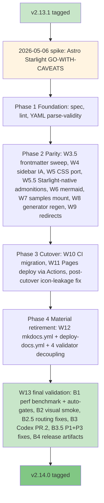

**Released**: 2026-05-10
**Type**: Doc-stack migration release (minor)
**Skill count**: 40 (unchanged from v2.13.x)
**Key theme**: MkDocs Material to Astro Starlight migration

---

## TL;DR

v2.14.0 is the doc-stack migration release. The 40-skill catalog is unchanged from v2.13.x, so day-to-day usage of `/prd`, `/hypothesis`, `/user-stories`, and the rest of the catalog is identical. What changed is the documentation site itself: MkDocs Material is retired; Astro Starlight ships in its place. The user-visible site at https://product-on-purpose.github.io/pm-skills/ continues to serve the same content under a modern static-site stack.

- **For readers**, the docs site renders faster, has client-side Pagefind search, native dark-mode auto-toggle, and inline-SVG icon rendering. Same URL, same content, better performance under the hood.
- **For contributors and forkers**, the build moves from `mkdocs build --strict` (Python pip toolchain) to `npm run build` (Node 22.x toolchain). All editing flows still work against the in-place `docs/` source tree; the new build infrastructure is invisible to anyone editing markdown. Validator inventory adjusts net -1 (24 to 23) after `check-nav-completeness` retirement (Starlight autogenerate solves the orphan class structurally).
- **For inbound-link consumers**, all 12 redirect entries from `mkdocs.yml redirect_maps` are preserved with proper `/pm-skills/` base path handling. Old Material-era URLs redirect cleanly to current pm-skills pages instead of bouncing to a generic GitHub Pages "Site not found".

If you use pm-skills as a Claude Code plugin, via the sync helper, or via `npx skills add`, the upgrade requires no action: the catalog is unchanged. The doc-stack migration is invisible to source-skill consumers.

---

## What changed

### Doc stack: Astro Starlight replaces MkDocs Material

- **`astro ~5.13.0` + `@astrojs/starlight ~0.34.0`** as the core stack. Pin policy documented in `docs/internal/dependency-policy.md` with the static-site CVE exemption (5 advisories on `astro ~5.13.0` covering SSR / server islands / Cloudflare adapter features that pm-skills does not use).
- **`astro-mermaid ~2.0.1`** for client-side Mermaid rendering. Code-splits the mermaid bundle (601 kB) and dynamically imports only on pages with `<pre class="mermaid">` blocks. `autoTheme: true` integrates with Starlight's light/dark mode toggle. 31 mermaid blocks shipped across 31 pages.
- **`sharp ^0.34.5`** explicit pin for Astro's image-optimization transitive (cross-platform binary parity).
- **`docs/` mounted in-place** via custom glob loader in `src/content.config.ts` (D2 Option B). Contributors keep editing the same `docs/` files; no copy step. `internal/`, `templates/`, `workflows/README.md`, and `reference/README.md` are excluded from the build.
- **115 library samples mounted under `/samples/`** via the same glob loader (W7). 11 historical legacy/orbit samples are excluded from the docs site (Path B); they remain in the library/ source for historical record.
- **12 redirect entries** ported from `mkdocs.yml redirect_maps` to `astro.config.mjs redirects:` config. All destinations include the `/pm-skills/` base path so meta-refresh navigates to working pm-skills pages, not the bare GitHub Pages domain.

### CI and deploy

- **`.github/workflows/validation.yml`** runs on Node 22.x with `npm ci` + 23 validators on Ubuntu + Windows + `npm run build` smoke test.
- **`.github/workflows/deploy-pages.yml`** (new) deploys via GitHub Actions Pages source. Composable steps (checkout + setup-node + npm ci + npm run build + upload-pages-artifact + deploy-pages) preserve the Phase 2 post-build `.md` link sweep. Push trigger on main + workflow_dispatch.
- **`.github/workflows/deploy-docs.yml`** (mkdocs gh-deploy) and **`.github/workflows/validate-docs.yml`** (mkdocs build --strict) retired.
- **GitHub Pages source flipped** from "Deploy from a branch (gh-pages)" to "GitHub Actions" via repo Settings during W11 cutover. The dormant `gh-pages` branch remains as an emergency rollback target (frozen pre-cutover state).

### Generator output reframe

3 Python generators rewritten in W5.5 to emit Starlight-native syntax instead of Material/pymdownx admonitions:

- `!!! warning "Generated file"` to `:::caution[Generated file]` (Starlight aside)
- `!!! info "Quick facts"` to `:::note[Quick facts]`
- `??? example "..."` to MDX `

...
`
- `{ .md-button }` line removed (Material attr_list pattern; Starlight does not need it)

Affected: `scripts/generate-skill-pages.py` (5 sites), `scripts/generate-workflow-pages.py` (2 sites), `scripts/generate-showcase.py` (4 sites). 38 doc pages regenerated. Source files in `skills/`, `commands/`, `library/`, and plugin manifests are untouched throughout.

### Routing fixes (W13 B2.5, late-cycle catch from visual smoke)

Browser visual smoke test on production (W13 B2) surfaced 3 routing defects that local validators had missed:

- **`/reference/` returned 404.** Cause: `docs/reference/README.md` mapped to `/reference/readme/` via Starlight's README slug rule, not `/reference/`. Fix: workflows-style pattern. README.md kept as the GitHub-directory landing page (short pointer). New `docs/reference/index.md` is the Astro source-of-truth at `/reference/`. README.md added to the glob exclusions.
- **`/samples/` returned 404.** Cause: no source `docs/samples/index.md`. Fix: authored `docs/samples/index.md` with corpus overview (115 samples, 40 skills, 3 threads). Samples sidebar in `astro.config.mjs` switched to hybrid items (slug ref + Library autogen).
- **Redirect destinations landed at "Site not found · GitHub Pages".** Cause: redirect destinations used plain paths without the `/pm-skills/` base. Fix: prepended `/pm-skills/` to all 12 destinations in `astro.config.mjs`.

The B2.5 catch demonstrates the value of the visual smoke test layer: mechanical CI passes did not surface the section-root 404s or the redirect base-path bug because both are inherent to client-rendered URLs (the build artifacts technically existed; only browser-following revealed the failure).

---

## Infrastructure / process

- **Phase 0 Adversarial Review Loop** applied via `codex:rescue` skill against the release-state at HEAD `da11498` (post-B2.5). 0 P0, 3 P1, 4 P2, 2 P3 findings. P1.2 (Astro 5.13.x CVE exemption documentation) and P3.1 (stale `26 legacy/orbit` comment) addressed in B3.5; P1.1 partial (CI step labels relabeled to advisory; full true-enforcement deferred to v2.14.x cleanup); P1.3 release artifacts addressed in B4. P2 findings deferred to v2.14.x.
- **B2.5 routing fix re-decided the 2026-05-06 redirect base-path deferral.** The original maintainer call ("don't care that much about breaking links") was made on the framing "wrong URL". Live-impact evidence revealed "Site not found · GitHub Pages" with no recovery, qualitatively worse than the original framing assumed. Re-deciding on actual evidence improved the cost-benefit; 3-minute fix preserved the migration-headline UX.
- **Spike methodology repeated.** v2.14 cycle started with a 60-min Astro Starlight spike (2026-05-06) which returned GO-WITH-CAVEATS (5 bounded caveats; all closed during execution). This is the second consecutive cycle (after v2.13's Zensical NO-GO spike) where a time-boxed compatibility spike preceded the major decision.
- **PowerShell parity gap discovered late.** During W13 B3.5, local `--strict` runs of `check-internal-link-validity` revealed the bash version misses 7 broken links in `docs/skills/foundation/foundation-meeting-*` generator output that the pwsh version catches. Promoting both to `--strict` would create cross-OS asymmetric CI failures. Both relabeled to advisory; v2.14.x will fix the bash parity bug, fix the 7 broken links, then promote.

---

## Why this matters

For users, v2.14.0 is the release that future-proofs the docs site. MkDocs Material is healthy as of 2026-05; Astro Starlight is on a faster modernization path with native dark mode, Pagefind search, MDX components, and inline-SVG icons. The migration positions pm-skills' docs to absorb the next several years of static-site evolution without further stack changes. Same URL, same content, better foundation.

For contributors and forkers, the build pipeline switches from Python pip (mkdocs + theme + plugins) to Node 22.x (Astro + Starlight + a single mermaid plugin). The npm-based build is faster cold (warm builds particularly competitive), and the source-of-truth boundary is cleaner: `docs/` is mounted in place, no synthetic `docs/` copy step. The generator output reframe (Starlight asides instead of pymdownx admonitions) is a one-time cost; future skill additions inherit the simpler shape.

For maintainers of similar repos, the 4-phase / 13-workstream cycle plan plus the spike-then-execute pattern is reproducible. The Phase 0 Adversarial Review Loop via `codex:rescue` worked end-to-end against a release-state without needing an open PR; this is the first cycle where Codex review ran against trunk. The migration plan at `docs/internal/release-plans/v2.14.0/plan_v2.14_starlight-migration.md` documents the full decision lineage (DM-1 through DM-4 architectural decisions; Q1 through Q5 spec decisions; W1 through W13 status blocks; B1 through B4 W13 sub-batches).

---

## Validation: Phase 0 Adversarial Review Loop

| Round | Layer | Findings | Outcome |
|---|---|---|---|
| Spike (2026-05-06) | Pre-cycle | GO-WITH-CAVEATS; 5 bounded caveats | All 5 closed during execution |
| PR.1 (per-strand) | Per-workstream | Per-workstream Codex tasks landed alongside W2-W12 closures | Closed at workstream level |
| PR.2 (release-state) | Release-state | 0 P0 + 3 P1 + 4 P2 + 2 P3 | P1.2 + P3.1 resolved B3.5; P1.1 partial (relabeled to advisory; full enforcement deferred to v2.14.x); P1.3 resolved B4; P2 deferred to v2.14.x |
| W13 visual smoke | Browser | 3 routing defects (F1 /reference/ 404, F2 /samples/ 404, F3 redirect base-path) | All 3 resolved B2.5 |
| W13 mechanical CI | Mechanical | 23 validators on Ubuntu + Windows green on `da11498` (run 25631391363) and on B3.5 push | PASS |

---

## Counts at v2.14.0

Snapshot at tag time (`5718440`, 2026-05-10). Post-tag cleanup (FU1-FU8 + M1-M3 + V1-V11 batches; ~20 commits) is shipped to main but not part of the v2.14.0 tag. See the CHANGELOG `[Unreleased]` section for post-tag drift from these numbers (added pages, promoted validators, etc.).

| Surface | Count | Note |
|---|---|---|
| Skills | 40 | unchanged from v2.13.x (26 phase + 8 foundation + 6 utility) |
| Workflows | 9 | unchanged |
| Slash commands | 47 | 40 skill + 7 workflow |
| Library samples | 115 | mounted under /samples/ via W7; 11 legacy/orbit excluded (9 + 2); post-tag V11 swept en-dashes in all 45 affected sample files |
| Validators (total) | 23 | net -1 from v2.13.x (24 to 23); `check-nav-completeness` retired (Starlight autogenerate solves orphan class structurally) |
| Validators (enforcing at tag) | 11 | structurally enforcing CI steps; 2 of these ran in advisory mode at tag pending bash/pwsh parity fix. Post-tag: both promoted to truly enforcing in v2.14.x FU6 (check-internal-link-validity --strict) and V5 (validate-docs-frontmatter --strict). Current state: 13 enforcing + 10 advisory. |
| Validators (advisory at tag) | 12 | post-tag: 10 (2 promoted; see above) |
| Pages built at tag | 239 | 124 docs + 115 samples. Post-tag: 254 pages (added 7 README stubs via FU7, Mermaid style guide MD+HTML via FU8, samples/index.md + reference/index.md via B2.5, etc.) |
| Redirect entries preserved | 12 | all destinations include /pm-skills/ base |
| Mermaid blocks across pages | 31 | rendered client-side via astro-mermaid |
| pm-skills-mcp tools (frozen at v2.9.2 build) | 59 | maintenance line; v2.14.0 doc-stack migration does not affect MCP. Post-tag V9 updated pm-skills-mcp/pm-skills-source.json metadata to v2.14.0 + maintenance: true flag |

---

## What's deferred to v2.14.x

| Item | Reason |
|---|---|
| `check-internal-link-validity` bash/pwsh parity fix + 7 broken-link cleanup | pwsh -Strict catches 7 broken links in foundation-meeting-* generator output (doubled-docs-prefix paths from source SKILL.md); bash --strict misses them. Adding --strict to both creates cross-OS CI asymmetry. Fix bash path-resolution + fix the 7 broken links + then promote both to true enforcing. |
| `check-internal-link-validity` and `validate-docs-frontmatter` content scope expansion | Currently scan only `*.md`; src/content.config.ts also includes `.mdx` and `library/skill-output-samples/`. Expand validators to match the rendered content set. |
| `verify-edit-links.mjs` minimum-count assertion | Currently passes on 0 occurrences; should fail if edit-link count drops below an expected threshold. |
| README stub coverage across docs sections | reference/ and workflows/ have both README.md (GitHub auto-render) and index.md (Astro). Other docs sections (skills/, guides/, concepts/, etc.) have only index.md. v2.14.x consistency pass adds README stubs or accepts and documents the partial coverage. |
| Tags-as-feature | `docs/tags.md` is `draft: true` and removed from sidebar (Material tags plugin had no Starlight equivalent at migration time). Re-evaluate when a Starlight tags plugin emerges or when a custom remark plugin is in scope. |
| URL slug shape (preserves casing and dots, e.g. `/releases/Release_v2.13.0/`) | Functional but non-conventional. v2.14.x or v2.15+ may add slug normalization with a redirect map for in-the-wild URLs. |
| Architectural workaround documentation in CONTRIBUTING.md | Three workarounds (autogenerate prefix, post-build link sweep, EXCLUDE_PATHS arrays) are well-commented inline; v2.14.x adds a maintainer note in CONTRIBUTING.md or a docs-internal Starlight maintenance guide. |
| Node 20 deprecation in GitHub Actions | `actions/checkout@v4`, `actions/setup-node@v4`, `actions/upload-artifact@v4` use Node 20 internally. GitHub forces Node 24 starting 2026-06-02. Bump in next maintenance commit. |
| Astro 6 + Node 22.12+ upgrade | Deferred to v2.15+ per Decision 11 in the v2.14 cycle plan; the static-site CVE exemption table in `docs/internal/dependency-policy.md` becomes mostly moot at that cycle. |

---

## Related artifacts

- Master migration plan: [`docs/internal/release-plans/v2.14.0/plan_v2.14_starlight-migration.md`](../internal/release-plans/v2.14.0/plan_v2.14_starlight-migration.md)
- Cycle plan: [`docs/internal/release-plans/v2.14.0/plan_v2.14.0.md`](../internal/release-plans/v2.14.0/plan_v2.14.0.md)
- Spike report (GO-WITH-CAVEATS): [`docs/internal/release-plans/v2.14.0/plan_v2.14_starlight-spike-report_2026-05-06.md`](../internal/release-plans/v2.14.0/plan_v2.14_starlight-spike-report_2026-05-06.md)
- Dependency policy + CVE exemption table: [`docs/internal/dependency-policy.md`](../internal/dependency-policy.md)
