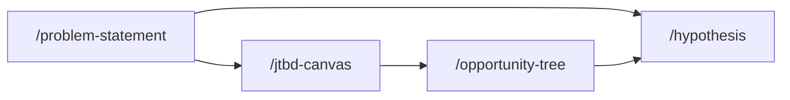

## How these skills connect

## Skills in this phase

| Skill | Description | Command |
|-------|-------------|---------|
| [define-hypothesis](define-hypothesis.md) | Defines a testable hypothesis with clear success metrics and validation approach... | . |
| [define-jtbd-canvas](define-jtbd-canvas.md) | Creates a Jobs to be Done canvas capturing the functional, emotional, and social... | . |
| [define-opportunity-tree](define-opportunity-tree.md) | Creates an opportunity solution tree mapping desired outcomes to opportunities a... | . |
| [define-prioritization-framework](define-prioritization-framework.md) | Run applicable prioritization frameworks (RICE, ICE, MoSCoW, Weighted Scoring, K... | . |
| [define-problem-statement](define-problem-statement.md) | Creates a clear problem framing document with user impact, business context, and... | . |
